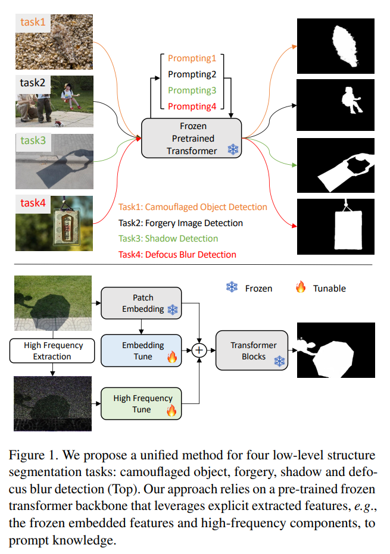
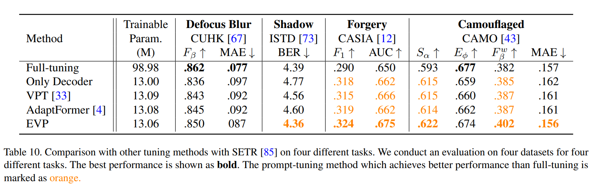

논문 및 이미지 출처 : <https://openaccess.thecvf.com/content/CVPR2023/papers/Liu_Explicit_Visual_Prompting_for_Low-Level_Structure_Segmentations_CVPR_2023_paper.pdf>

# Abstract

저자는 image 의 segmenting manipulared parts, identifying out-of-focus pixels, separating shadow regions 및 detecting concealed objects 를 포함한 low-level structures detecting 문제를 고려

이런 각 주제는 일반적으로 domain-specific solution 으로 다루어졌으나, 저자는 unified approach 로 모든 task 에서 잘 수행된다는 것을 보여줌. 

저자는 NLP 에서 널리 사용되는 pre-training 및 prompt tuning protocol 에 영감을 받아 new visual prompting model 인 Explicit Visual Prompting (EVP) 을 제안

- 이전의 visual prompting 이 일반적으로 dataset-level implicit embedding 인 것과 달리, 저자의 key insight 는 tunable parameters 가 각 individual image 의 explicit visual content 에 focusing 하도록 하는 것
- 즉, frozen patch embeddings 에서 얻은 features 와 input 의 high-frequency components 를 활용
- EVP 는 동일한 양의 tunable parameters (각 task 당 5.7% extra trainable parameters) 하에 other parameter-efficient tuning protocols 보다 현저히 뛰어남
- 또한 EVP 는 다양한 low-level structure segmentation task 에서 task-specific solution 과 비교하여 SOTA 달성

# 1. Introduction

이미지 편집 및 조작의 발전으로 fake picture 를 쉽게 만들며, 이를 감지하는 것은 감시 및 범죄와 관련된 잠재적인 부정적 영향의 중요한 문제로 떠오름.

- Low-level 은 tampered region detecting 에 유익한 것으로 알려져있다.
- 예로, resizing 및 copy-pasting 은 temper region 및 host image 간의 JPEG compression levels 를 파괴하고, tempered region 및 background 의 noise level 도 다르다.
- blurred pixels, shadowed regions, concealed objects 를 분할하기 위해, low-level clues 도 중요한 역할을 한다.
- 이런 detection tasks 는 auto-refocus, image retargeting, object tracking 등 다양한 vision tasks 에 유익한 것으로 나타난다.

이러한 모든 tasks 는 low-level structure segmentation 에 속하지만, 일반적으로 domain-specific solutions 를 신중하게 설계된 network architecture 를 사용하여 처리하며, 또한 large-scale datasets lack 은 성능을 제한하는 주 요인으로 간주된다.

---

본 연구에선 4 tasks 를 통합하는 방식으로 해결하는 솔루션을 제안

- 최근의 prompting 의 발전에서 영감을 받음
  - prompting 은 NLP 에서 처음 등장한 개념으로, 기본 아이디어는 minimum extra trainable parameters 로 large-scale dataset 을 효율적으로 다양한 downstream task 에 adapting 하는 것.
  - pre-trained model 은 이미 large-scale dataset 에 training 되어, prompting 은 특히 annotated data 가 제한된 경우 downstream task 에서 model generalization 을 향상시킨다.
  - 또한, prompting 은 shared basic model 및 task-aware promptings 만 저장하면 되므로 모델의 저장 공간을 크게 절약

저자의 insight 는 pre-trained base model 이 semantic understanding 을 위한 충분한 knowledge 를 포함하고 있기 때문에, 각 individual image 자체의 features 에서 task-specific knowledge 를 tuning 하는 것이다. 이는 SIFT, JPEG noise, resampling artifacts 와 같은 hand-crafted image features 의 효과에서 영감을 받았다.

이 관찰을 바탕으로, 저자는 _explicit visual prompting_ (EVP) 을 제안. 여기서 tuning performance 는 image features 의 re-modulation 을 통해 크게 향상될 수 있음. 구체적으로, 저자는 task 를 위해 두 종류의 feature 를 고려.

1. frozen patch embeddings 에서 얻은 features.
   - 이는 original model 의 distribution 을 이동시켜야 하기 때문에 중요
2. input image 의 high-frequency.
   - pre-trained vision recognition model 은 data augmentation 을 통해 이러한 features 에 불변하도록 학습됨.

Fig. 1 에서 볼 수 있듯,

- 저자는 pre-trained on large-scale dataset 을 가져와 그 parameter 를 freezing 한다
- 이후, 각 task 에 adapting 하기 위해, embedded features 를 tuning 하고 각 individual image 의 high-frequency 를 위한 extra embedding 을 학습

실험 측면에서, 4 tasks: forgery detection, shadow detection, defocus blur detection, camouflaged object detection 의 9 dataset 에서 저자의 방법을 검증.

simple 및 unified network 는 model fine-tuning 과 competitive performance 를 보여주며, 수정 없이 task-specific solution 을 능가

주요 기여:

- forgery detection, defocus blur detection, shadow detection, 및 camouflaged object detection 을 포함한 여러 task 에서 SOTA
- frozen patch embedding 및 input high-frequency 의 features 를 사용하는 explicit visual prompting (EVP) 제안
  - 이는 다양한 task 에서 효과적이며 다른 PEFT 능가
- EVP 는 low-level structure segmentation models 를 크게 단순화하면서도 잘 설계된 SOTA methods 와 comparable performance

# 2. Related Work

#### Visual Prompting Tuning.

Prompting 은 NLP 에서 처음 제안. 

- Few-shot Learner 는 GPT-3 를 manual prompt 를 사용해 few-shot 또는 zero-shot setting 에서 downstream transfer learning task 에 강력한 일반화를 보여줌
- 최근 promting 이 vision task 에도 적용됨
  - 각 transformer layer 에 learnable embedding vector set 인 memory token 제안
  - VPT 는 유사한 아이디어를 제안하고 여러 domain 과 backbone 에 걸쳐 여러 종류의 recognition task 를 통해 visual prompting 의 일반성과 실현 가능성 조사
  - VPT 와 달리, 저자의 연구는 low-level structure segmentation 을 위한 optimal visual content 탐색을 목표

#### Forgery Detection

Forgery Detection 의 목표는 manually manipulated pixel, removed, replaced or edited pixel  을 감지하는 것.

- 초기 접근법은 local noise levels 의 불일치를 통해 region slicing 을 감지
  - 이는 다른 기원에서 온 image 가 sensor 또는 post-processing steps 에서 도입된 서로 다른 noise characteristics 를 포함할 수 있다는 사실에 기반
  - 다른 단서로는 SIFT, JPEG 압축 아티팩트 및 리샘플링 아티팩트가 있다
- 최근 labeled training data 를 사용하여 specific forensics tasks 를 해결하기 위한 end-to-end deep learning 으로 이동하고 있다
  - Salloum et al. 은 labeled training data 로 fully convolutional network 를 훈련시켜 splicing 을 감지하는 방법을 학습한다.
  - Islam et al. 은 GAN 을 통합하여 copy-move forgeries 를 감지한다
  - Huh et al. 은 photographic metadata 를 풍부한 supervisory signal 로 사용하여 self-consistency 를 학습하고, trained model 을 splices 감지에 적용하는 방법을 제안
- 최근 TransForensic 은 ViT 를 활용하여 문제를 해결
- High-frequency 는 여전히 ​​이 분야에서 유용한 전제로 작용
  - RGB-N 는 additional noise stream 을 설계
  - ObjectFormer 은 visual content 에 complementary signals 로서 high-frequency features 를 추출
  - 하지만 ObjectFormer 와 달리, 저자의 초점은 low-level segmentation tasks  에 효율적이고 효과적으로 적응하기 위해 high-frequency components 를 prompting 설계로 활용하는 것

#### Defocus Blur Detection

image 에서 defocus blur detection 은 in-focus 및 out-of-focus region 을 분리하는 것을 목표, 이는 auto-refocus, salient object detection 및 image retargeting 에 잠재적으로 유용.

- 전통적인 방법은 gradient 또는 edge 기반의 hand-crafted features 에 집중
- 이후, CNN architecture 에 집중
  - A unified approach of multi-scale deep and hand-crafted features for defocus estimation : hand-crafted 및 deep features 를 사용한 최초 CNN 기반 방법
  - BTBNet : low-level clues 와 high-level semantic information 을 위해 fully convolutional network 개발
  - DeFusionNet : defocus blur detectors 를 위해 multi-scale deep features 를 반복적으로 융합하고 정제
  - CENet : multiple smaller defocus blur detectors 를 학습 diversity 향상을 위해 이를 앙상블
  - Defocus blur detection via depth distillation : additional supervision 으로 depth information 을 사용하고 knowledge distillation 에서 영감을 받은 joint learning framework 제안 
  - Defocus blur detection via boosting diversity of deep ensemble networks : defocus blur detection 을 위해 딥 앙상블 네트워크를 탐구 
  - Self-generated defocus blur detection via dual adversarial discriminators : generator 를 학습하여 adversarial manner 로 mask 를 생성하는 방법을 제안

#### Shadow Detection

Shadow 는 natural scenes 에서 자주 발생하며, scene geometry, light conditions 및 camera location 등의 힌트를 제공하며, image segmentation 및 object tracking 같은 많은 vision task 에서 도전 과제를 야기한다

- 초기 시도는 illumination 및 hand-crafted features 탐구
- 일부 방법이 주로 CNN 아키텍처 설계 또는 attention modules (e.g., direction-aware attention, distraction-aware module)을 포함하는 데 집중
- 최근 연구는 illumination 을 추가적인 전제로 사용
  - 예로, ADNet 은 더 나은 감지를 위해 adversarial training sample 을 생성
  - FDRNet 은 additionally adjusted brightness 로 training samples 보강
  - MTMT 는 mean teacher model 을 활용하여 semi-supervised shadow detection 을 위해 unlabeled data 탐구

#### Camouflaged Object Detection

detecting camouflaged object 은 foreground objects 가 background 와 visual similar patterns 를 가지기 때문에 어려운 작업

- 초기 연구는 texture, brightness 및 color 같은 low-level clues 를 통해 foreground 및 background 을 구별
- 최근에는 딥러닝 기반 방법이 복잡한 detecting camouflaged object 에 강력한 능력을 보여준다
  - Le et al. 은 detecting camouflaged object 을위한 최초의 end-to-end network 제안. 이는 classification branch 및 segmentation branch 로 구성
  - Fan et al. 은 search-identification network 와 largest camouflaged object detection dataset 을 개발
  - PFNet 은  예측에 positioning 및 identification 의 process 을 모방하는 bio-inspired framework
  - FBNet 은 frequency modeling 을 분리하고 important frequency components 향상시키는 것을 제안

# 3. Method

최근 ViT 를 ImageNet 에 pre-training 한 후 low-level structure segmentation 에 adapting 하기 위한 Explicit Visual Prompting (EVP) 제안

- backbone 는 freezing 을 유지하고, frozen image embeddings 과 high-frequency components 의 features 에서 task-specific knowledge 를 학습하기 위해 small tunable parameters 를 포함

## 3.1 Preliminaries

#### SegFormer

SegFormer 는 simpler decoder 를 갖춘 hierarchical transformer-based structure 로, semantic segmentation 을 수행.

- CNN backbone 과 유사하게, SegFormer 는 여러 stages 를 통해 multi-stale feature 를 캡처.
- 하지만 각 stage 는 feature embedding layers 와 vision transformer blocks 를 통해 구축된다.
- decoder 는 encoder 의 multi-scale feature 와 MLP layer 를 활용하여 specific classes 에 decoding

저자의 prompting 전략은 SegFormer 에만 국한되지 않고, ViT 및 Swin 같은 다른 network 구조에도 쉽게 적용 가능

#### High-frequency Components (HFC).

Fig. 2 처럼, 

- dimension $H \times W$ 의 image $I$ 의 경우, 저자는 low-frequency components $I_l$ (LFC) 및 high-frequency components $I_h$ (HFC) 로 분할한다. 예로, $I = \{ I_l, I_h \}$
- fft 및 ifft 는 각각 Fast Fourier Transform 및 그 역변환을 나타냄
- $I$ 의 frequency component 를 $z$ 로 표기
- 그러므로 $z = fft(I)$ 및 $I = ifft(z)$ 이다.
- 저자는 low frequency coefficients 를 center $(\frac{H}{2}, \frac{W}{2})$ 로 이동시킴
- HFC 를 얻기 위해, binary mask $M_h \in \{ 0, 1 \}^{H \times W}$ 를 생성하고 mask ratio $\tau$ 에 따른 $z$ 적용

$$
\begin{equation}
    \mathbf {M}^{i,j}_h(\tau ) = \begin {cases} 0, & \frac {4|(i - \frac {H}{2})(j - \frac {W}{2})|}{HW} \le \tau \\ 1, & \text {otherwise} \end {cases} 
\end{equation}
$$

- $\tau$ : masked regions 의 surface ratio
- HFC 는 다음과 같이 계산

$$
\begin{equation}
     I_{hfc} = \mathtt {ifft}(z \mathbf {M}_h(\tau ))
\end{equation}
$$

유사하게, binary mask $M_l \in \{ 0, 1 \}^{H \times W}$ 은 LFC 계산을 위해 정의:

$$
\begin{equation}
    bf {M}^{i,j}_l(\tau ) = \begin {cases} 0, & \frac {HW - 4|(i - \frac {H}{2})(j - \frac {W}{2})|}{HW} \le \tau \\ 1, & \text {otherwise} \end {cases}
\end{equation}
$$

LFC 는 다음과 같이 계산

$$
\begin{equation}
     I_{lfc} = \mathtt {ifft}(z \mathbf {M}_l(\tau ))
\end{equation}
$$

RGB image 의 경우, 위 과정을 각 channel 의 pixel 에 대해 독립적으로 계산

## 3.2. Explicit Visual Prompting

이 섹션에선 EVP 소개.

key insight 는 image embedding 과 high-frequency component 를 학습하는 것.

- former 는 pre-trained dataset 의 distribution 을 target dataset 으로 전환하기 위해 학습됨
- latter 는 pre-trained model 이 data augmentation 을 통해 이 특징들에 불변하게 학습되었기 때문에 훈련됨.

이는 implicit prompts 를 학습하는 VPT 와는 다르다.

#### Patch embedding tune.

이 모듈은 pre-trained patch embedding tuning 이 목표.

- pre-trained SegFormer 에서, patch $I^p$ 는 $C_{seg}$-dimension feature 로 project 된다
- 저자는 이 projection 을 freezing 하고, original embedding 을 $c$-dimension feature $F_{pe} \in \mathbb{R}^c$ 로 project 하기 위해 tunable linear layer $L_{pe}$ 를 추가

$$
\begin{equation}
     F_{pe} = \mathtt {L_{pe}}(I^p) \text {, with } c = \frac{C_{seg}}{r}
\end{equation}
$$

- tunable parameter 를 제어하기 위한 scale factor $r$ 을 도입

#### High-frequency components tune.

high frequency component $I_{\text{hf}}^c$ 에 대해, SegFormer 과 유사한 overlapped patch embedding 을 학습한다.

- 공식적으로, $I_{\text{hf}}^c$ 는 SegFormer 과 동일한 patch size 로 small patches 로 나뉜다
- patch $I_{\text{hf}}^p \in \mathbb{R}^C$ 로 나타내며, 여기서 $C = h \times w \times 3$ 이다
- 저자는 patch 를 $c$-dimension feature $F_{\text{hfc}} \in \mathbb{R}^c$ 로 project 하기 위해 linear layer $L_{\text{hfc}}$ 를 학습

$$
\begin{equation}
    F_{\text{hf}}^c = \mathtt{L_{\text{hf}}^c}(I_{\text{hf}}^p)
\end{equation}
$$

#### Adaptor.

Adaptor 의 목표는 image embeddings 및 high-frequency components 를 고려하여 all layers 에서 효율적이고 효과적으로 adaptation 을 수행하는 것

- $i$-th Adaptor 의 경우, $F_{\text{pe}}$ 와 $F_{\text{hfc}}$ 를 입력으로 받아 prompting $P^i$ 를 얻는다:

$$
\begin{equation}
    P^i = \mathtt{MLP_{\text{up}}(\text{GELU}(\mathtt{MLP^i_{\text{tune}}}(F_{\text{pe}} + F_{\text{hf}}^c)))}
\end{equation}
$$

- $\text{GELU}$ : GLUE activation
- $\mathtt{MLP^i_{\text{tune}}}$ : 각 adaptor 에서 다른 prompts 를 생성하기 위한 linear layer
- $\mathtt{MLP_{\text{up}}}$ : transformer features 의 dimension 을 맞추기 위해 all Adaptors 에서 공유되는 up-projection layer
- $P^i$ : 각 transformer layer 에 연결되는 output prompting

# 4. Experiment

## 4.1. Datasets

4 tasks: forgery detection, shadow detection, defocus blur detection, 및 camouflaged object detection 에 대한 다양한 datasets 에 평가

#### Forgery Detection.

- CASIA : forgery detection 에 대한 large dataset 으로, 5,123 training 및 921 testing spliced 및 copy-moved images 로 구성
- IMD20 : real-life forgery image dataset 으로 2,010 testing samples 로 구성
- 저자는 이전 연구의 protocol 을 따라 256 × 256 해상도로 훈련 및 평가를 수행
- 성능 평가를 위해 pixel-level Area Under the Receiver Operating Characteristic Curve (AUC)와 F1 score 사용

#### Shadow Detection.

- SBU : largest annotated shadow dataset, 각각 4,089 training 및 638 testing samples 를 포함
- ISTD : shadow detection 및 removal 을 위한 triple samples 를 포함, 저자는 shadow image 및 shadow mask 만을 사용하여 저자의 방법을 훈련
- 이전 연구를 따라, both dataset 모두 400 × 400 크기로 훈련 및 테스트
- evaluation metrics 로는 balance error rate (BER) report

#### Defocus Blur Detection.

이전 연구을 따라, CUHK dataset 에서 defocus blur detection model 을 훈련
- 이 데이터셋은 704 partial defocus sample 포함
- CUHK dataset 에서 분할된 604 image 로 network 를 훈련시키고, DUT 및 CUHK 에서 test
- image 는 320 × 320 으로 크기를 조정
- 일반적으로 사용되는 metrics 인 F-measure($F_\beta$) 및 MAE 로 report

#### Camouflaged Object Detection.

- COD10K :  camouflaged object detection 을 위한 largest dataset 으로, 3,040 training 및  2,026 testing samples 포함
- CHAMELEON : 인터넷에서 수집된 76 images 포함
- CAMO : naturally camouflaged objects 및 artificially camouflaged objects 가 포함된 다양한 이미지를 제공
- 이전 연구를 따라, 3 datasets 에 대한 combined dataset 및 test
- 평가를 위해 일반적으로 사용되는 metrics 는 S-measure($S_m$), mean E-measure ($E_\phi$), weighted F-measure ($F^w_\beta$), 및 MAE 사용

## 4.2. Implementation Details

- 모든 실험은 12GB memory 를 가진 snigle NVIDIA Titan V GPU 에서 수행
- 모든 실험에서 AdamW optimizer 사용
- initial learning rate 는 defocus blur detection 및 camouflaged object detection 의 경우 $2e^{-4}$ 로 설정되며, 다른 경우엔 $5e^{-4}$ 로 설정
- learning rate 에는 cosine decay 가 적용
- models 는 SBU dataset 및 camouflaged combined dataset 의 경우, 20 epochs 동안 training, 다른 dataset 의 경우 50 epochs 동안 training
- data augmentation 을 위해, training 중 random horizontal flipping 적용
- minibatch 는 4 로 설정
- defocus blur detection 및 forgery detection 에는 Binary cross-entropy (BCE) loss 를 사용하고, shadow detection 에는 balanced BCE loss 을 사용하며, camouflaged object detection 에는 BCE loss 과 IOU loss 를 사용
- 모든 실험은 ImageNet-1k dataset 에 pre-training 된 SegFormer-B4 을 사용하여 수행

## 4.3. Main Results

#### Comparison with the task-specific methods.

EVP 는 task-specific methods 를 비교했을 때 우수한 성능 발휘.

이 비교 결과는 Table 2, 3, 4, 5 에 나옴

- 저자의 더 강력한 백본과 prompting 전략 덕분에, EVP 는 4 different tasks 의 5 datasets 에서 best performance 달성
- 그러나 다른 well-designed domain-specific methods 와 비교했을 때, EVP 는 frozen backbone 과 함께 small tunable parameters 만을 도입하고도 상당한 성능을 얻음
- 우리는 또한 각 task 에 대해 다른 방법들과의 시각적 비교를 Fig. 4 에 보여줌
- 제안된 방법이 다른 접근 방식에 비해 더 정확한 mask 를 예측하는 것을 볼 수 있

#### Comparison with the efficient tuning methods.

- 저자는 full fine-tuning 과 decoder 만 tuning 하는 방법으로 저자의 방법을 평가했으며, 이는 downstream task adapting 을 위해 널리 사용되는 전략.
- 또한 image classification 에서 유사한 방법인 VPT 및 AdaptFormer 와도 비교
- 공정한 비교를 위해 VPT 의 prompt token 수는 10 개로, AdaptMLP 의 middle dimension 은 2 로 설정
- Tab. 6 에서 보이듯, decoder 만 tuning 했을 때 성능이 크게 떨어짐
- 유사한 방법들과 비교했을 때, extra learnable token 이나 Transformer block 에 MLP 를 도입하는 방법도 성능에 이점을 줌
- 저자는 adaptor 의 parameter 수를 제어하기 위해 hyper-parameter ($\gamma$) 를 도입 (Eq. 5)
- 먼저 유사한 parameter 를 가진 EVP ($\gamma = 16$) 를 다른 방법들과 비교
- 표에서 보듯이, 저자의 방법이 훨씬 더 나은 성능을 달성
- 또한, parameter 가 더 많은 EVP ($\gamma = 4$) 를 보고했으며, 이는 성능을 더 향상시켜 4 dataset 중 3 개에서 full-tuning 능가

## 4.4. Ablation Study

각 component 의 효과를 보여주기 위해 ablation 실험을 수행

별도로 명시되지 않은 경우, 실험은 scaling factor $r = 4$ 로 수행

#### Architecture Design.

제안된 visual prompting architecture 효과를 검증하기 위해, 저자는 다양한 variants 로 수정.

Tab. 7 및 Fig. 5 에 나타난 바와 같이

- 다른 Adaptors 에서 $\text{MLP}^\text{i}_\text{tune}$ 을 공유하는 것은 small parameters 만 절약되지만 (0.55M vs 0.34M), 성능이 크게 떨어짐
- 다른 Adaptors 에서 다른 $\text{MLP}_\text{up}$ 을 사용하는 경우 일관된 성능 향상을 얻을 수 없으며, large parameters 가 도입됨 (0.55M vs 1.39M)
- 반면 $F_\text{pe}$ 또는 $F_{\text{hf}}^c$ 를 제거하면 성능이 떨어지므로, 이 둘 모두 효과적인 visual prompting 을 알 수 있다.

#### Tuning Stage.

어느 stage 가 prompting tuning 에 가장 큰 기여를 하는지 알아보자.

- 저자는 SegFormer backbone 에서 tunable stages 를 변경하여 저자의 tuning methods 의 variants 를 보여줌
- SegFormer 는 multi-scale feature extraction 을 위해 4 stages 포함
- Stage $x$ 에서 tunable prompting 가 추가된 $\text{Stage x}$ 를 나타냄
- Tab. 8 에 따르면, tunable stages 가 증가할수록 더 나은 성능을 얻을 수 있음
- 특히, $\text{Stage1,2}$ 에서 $\text{Stage1,2,3}$ 로 넘어갈 때 최대 향상이 발생
- SegFormer-B4 의 각 stage 의 Transformer block 수는 각각 3, 8, 27, 3 이므로, EVP 의 효과는 prompted transformer blocks 수와 양의 상관관계를 가짐

#### Scale Factor $\tau$ (Eq. 5)

저자는 learnable parameters 수를 제어하기 위해 sec. 3.2 의 $\r$ 을 도입

- larger $r$ 은 tuning 에 fewer parameters 를 사용
- Tab. 9 처럼, $r$ 이 64 에서 4 로 감소할 때, 여러 task 에서 성능이 향상되며, $r$ 이 2 또는 1 로 계속 감소할 때, 모델이 커지더라도 일관되게 더 나은 성능을 얻을 수 없음
- 이는 $r = 4$ 가 성능과 모델 크기 간의 균형을 맞추는 합리적인 선택임을 나타냄

#### EVP in Plain ViT.

저자는 EVP 의 generalizability 를 확인하기 위해 SETR 에서 실험을 수행

- SETR 은 백본으로 plain ViT 를 사용하고, decpder 로는 progressive upsampling ConvNet 을 사용
- 반면에 SegFormer 는 4 stages 의 hierarchical backbone 을 가지고 있음. 따라서 SegFormer 를 사용하는 실험과의 유일한 차이점은 모든 수정이 plain ViT 의 single stage 로 제한된다는 점
- 실험은 ImageNet21k dataset 에서 pre-training 된 ViT-Base 로 수행
- VPT 의 prompt tokens 수는 10 개로, AdaptFormer 의 AdaptMLP middle dimension 은 4 로, EVP 의 $r$ 은 32 로 설정
- Tab. 10 에서 처럼, EVP 는 plain ViT 를 backbone 으로 사용할 때도 다른 tuning 방법보다 우수한 성능을 보임

# Conclusion

이 논문에서는 low-level structure segmentation 의 solution 을 통합하기 위해 explicit visual prompting 제시

- 주로 patch embedding 의 frozen features 및 high-frequency components 두 종류의 feature 에 초점을 둠
- 저자의 방법을 적용하면, limited tunable parameters 로 ImageNet 에서 frozen vision transformer backbone 이 full-tuned network structures 와 유사한 성능을 달성
- 다른 task-specific methods 와 비교해도 SOTA 성능을 달성할 수 있음을 발견