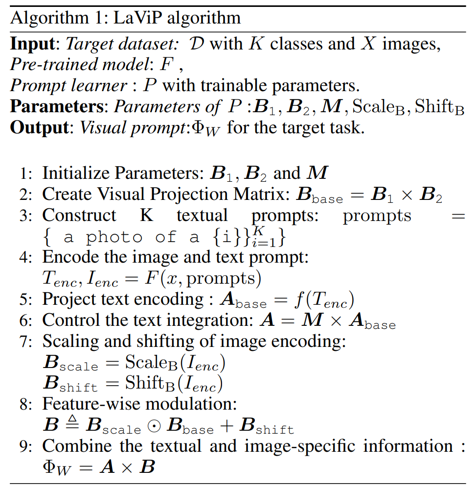
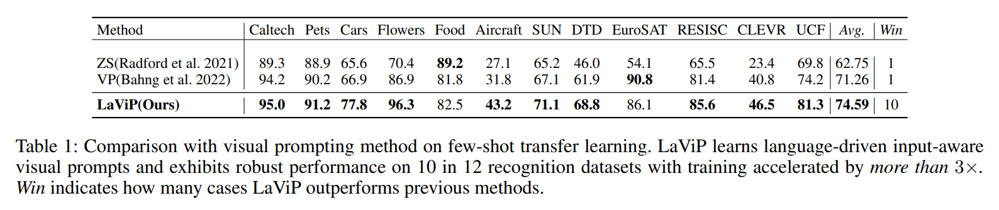
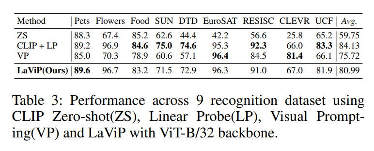

논문 및 이미지 출처 : <https://arxiv.org/pdf/2312.10945>

# Asbtract

저자는 vision-language model 의 visual encoder 를 downstream task 에 adapting 하기 위해 language-grounded visual prompting 방법을 소개한다.

language intergration 을 활용하여, model parameter 수정이나 추가할 필요 없이 visual encoder 의 input 을 조정하는 parameter-efficient strategy 를 고안.

이러한 설계 선택 덕에, 저자의 알고리즘은 model parameter 에 대한 접근이 제한된 blackbox scenario 에서도 작동할 수 있다.

저자는 기존 방법과 비교했을 때, grounding visual prompting with language 가 adaptation 의 accuracy 및 speed 모두 향상시킨다는 것을 실험적으로 입증.

더욱이, 저자의 알고리즘은 base-to-novel class generalization 도 뛰어나, visual prompting 의 한계를 극복하고 unseen class generalization 능력도 뛰어남을 보인다.

저자는 EuroSAT, UCF101, DTD, CLEVR 같은 다양한 image recognition dataset 을 통해 few-shot learning, base-to-novel class generalization, transfer learning 을 포함한 다양한 learning situations 에서 저자의 방법을 철저히 평가하고 검토.

# 1. Introduction

Large-scale pre-trained models (PTMs)은 massive data 와 복잡한 optimization 으로 학습된다.

이는 고성능 PTM 을 설계하고 개발하는 것이 매우 어렵고 비용이 많이 드는 과정이 된다. 이러한 모델들은 generalization 능력을 보여주지만, new task 에서의 optimal performance 달성을 위해선 신중한  fine-tuning 이 필요하다. 그러나 PTM 의 fine-tuning 은 근본적인 문제를 안고 있다. 특히 downstream task 에서 knowledge forgetting 과 overfitting 에 대한 위험이 있다.

이런 문제에 대응하여 _model reprogramming_ 이 등장한다. 이는 transfer learning 의 새로운 패러다임으로, 고품질 pre-trained model 을 재사용하여 _finetuning 없이_ cross-domain learning 을 원활하게 한다.

MR 은 model input 에 learnable transformation function 과 output mapping function 을 도입하여 이 objective 를 달성한다. 

(Tsai, Chen, and Ho 2020)의 선구적인 연구는 MR 을 통해 CNN initially trained on ImageNet 이 의료 이미지 분류에서도 뛰어난 성능을 발휘할 수 있음을 보여주었고, 이는 traditional fine-tuning 보다 우수한 결과를 나타냈다.

이후 여러 연구들이 다양한 domain 에서 MR 을 확장하여 finetuning 없이 성공적인 적응을 이루어냈다.

MR 을 통해 얻은 input transformation 은 일반적으로 input image 에 추가되거나 결합되는 perturbation pattern 으로 개념화된다.

---

vision task 에서 이러한 perturbation pattern 을 Visual Prompts (VP)라 한다. 

VP 를 학습함으로써 PTM 은 downstream task samples 를 latent space 의 distinct subset 에 효과적으로 포함시킨다.

따라서 MR 은 PTM 의 기능을 보존하면서도 재사용할 수 있게 한다.

그러나 MR 에는 여러 미해결 질문들이 남아 있다:

- **Unimodality in learning VPs.** 이전 연구들에서 class semantic information 과 visual encoding 을 별도로 취급하는 경우가 많다. 인간의 인식은 multimodel 로 이루어져 있어 새로운 개념을 몇 가지 예시만으로 학습할 수 있다. 
  - AI 에서 vision-language 가 있다면 language 가 MR 에 대한 VP 설계에 도움이 될까? 그렇다면 어떤 설계 질문을 답해야 할까?
- **Efficient Training.** 실질적으로 VP 를 학습하려면 많은 반복이 필요하다.
  - 예로, EuroSAT 에서 10 satellite classes image 를 분류하려면 1000 training epochs 가 필요하다. 이는 visual encoder 의 adaptation 이 high-dimensional visual input 의 complex 와 asymmetric nature 때문에 어렵기 때문.
  - language 가 이 제약을 극복할 수 있을까?
- **Generalizing beyond seen classes.** MR 은 transfer learning 의 한 형태로, adaptation 중 본 것 이상으로 generalization 하는 명시적인 메커니즘이 없다. 최근 연구들은 vision-language model 이 훌륭한 zero-shot learning 능력을 가지고 있음을 보여준다. 
  - 이는 adaptation 중에 unseen class 에 generalization 할 수 있는 MR 알고리즘을 설계할 수 있을까?
- **Adaptation without accessing model parameters.** 저자의 방법은 original foundation model 을 유지하여 API 를 통해 adaptation 을 가능하게 하고, 윤리적 제약으로 foundation model 의 구조와 weight 에 접근할 수 없는 경우에도 작동한다. 또한 foundation model 을 보존하는 것은 generalization 능력을 유지하게 한다.
  - 이는 MaPLe 와 같은 알고리즘이 보장할 수 없는 장점이다.

저자의 연구는 앞서 언급한 질문들을 해결하는 방향으로 나아간다. 특히, downstream task 에 adapting 하기 위해 language intergration 을 활용하여 pixel-space input-aware prompting 을 생성하는 Language-Ground Visual Prompting (LaViP) 를 제안한다 (Fig. 1).

- LaViP 에선 language grounded visual prompt 를 생성하기 위해 low-rank solution 을 선택하여 학습해야 하는 parameter 수를 크게 줄인다.
  - 이는 blackbox 설정에서 특히 유리.
- 또한, novel class knowledge 를 통합하는 메커니즘을 개발하여 VP retraining 필요 없이 novel 및 unseen class 에 대한 generalization 을 가능하게 한다.
- 저자의 알고리즘을 기존의 방법과 비교하기 위해 다양한 transfer learning, few-shot learning, unseen class 에 대한 generalization 실험 수행
- 실험 결과, 저자의 알고리즘은 visual prompt 에서 multimodal signals 를 활용하여 일관되게 SOTA 알고리즘을 뛰어넘는 성능을 보여줌.

요약하여, 저자는 다음과 같은 기여

1. visual encoder 를 downstream task 에 adapting 하기 위해 language-grounded MR solution 을 최초로 제안
2. seen class 외에도 visual prompt 를 확장하는 메커니즘을 제안하여, 기존의 text prompt adaptation 을 넘어선 성과를 이룸.

세 가지 학습 패러다임(few-shot learning, unseen class 에 대한 generalization, transfer learning)에서 알고리즘을 광범위하게 평가하고 검토.

# 2. LaViP

이 논문 전체에서 scalars 는 $x$, vector 는 $\boldsymbol{x}$, matrices 는 $\boldsymbol{X}$, definition 에 의한 equality 는 $≜$ 로 나타낸다.

matrix $\boldsymbol{X} ∈ \mathbb{R}^{m×n}$ 와 $\boldsymbol{Y} ∈ \mathbb{R}^{p×q}$ 의 Kronecker product, $\boldsymbol{X} ⊗ \boldsymbol{Y} ∈ \mathbb{R}^{mp × nq}$ 는 다음과 같이 정의:

$$
\begin{equation}
\boldsymbol{X} ⊗ \boldsymbol{Y} = \begin{pmatrix}
x_{11}\boldsymbol{Y} & \cdots & x_{1n}\boldsymbol{Y} \\
\vdots & \ddots & \vdots \\
x_{m1}\boldsymbol{Y} & \cdots & x_{mn}\boldsymbol{Y}
\end{pmatrix},
\end{equation}
$$

- $a_{ij}$ : $\boldsymbol{x}$ 의 $i$-th row 및 $j$-th column 의 element

아래는 저자의 input-dependent visual prompting approach 인 LaViP 설명

#### Problem Statement

training dataset $\mathcal{S} = \{(x_i, y_i)^m_{i=1}\}$ 가 distribution $\mathcal{D}$ 에서 i.i.d. 로 추출된 경우, 저자는 input vectors $\boldsymbol{x}$ 를 해당 class labels $\boldsymbol{y}$ 에 효과적으로 할당하는 model 을 모델을 학습하려고 한다.

- $\boldsymbol{x}_i ∈ \mathbb{R}^{H×W×C}$ : image
- $\boldsymbol{y}_i ∈ Δ^{K-1}$ : K-simplex 를 나타내는 Δ^{K-1} 와 함께 할당된 label

또한, 저자는 visual encoder $Φ_\text{vis} : \mathbb{R}^{H×W×C} → \mathbb{R}^d$ 와 language encoder $Φ_\text{lan} : \mathcal{X} → \mathbb{R}^d$ 를 포함하는 pre-trained VLM 이 있다고 가정하자.

- $\mathcal{X} ⊆ \mathbb{R}^{d_t}$ : language encoder 의 input space
- CLIP 의 경우, tokenizer 에 의해 정의된 integer 의 subset

이 목표를 달성하기 위해, 저자는 총 $2pC(H + W - 2p)$ parameter 를 갖는 padding-style 의 visual prompt 를 생성하는 것을 목표로 한다.

- $C$ : channel 수
- $H$ 및 $W$ : height 및 width
- $p$ : padding size
- 이전의 visual prompting (VP)과는 달리, LaViP 는 input-specific prompts 를 학습하는 접근 방식을 채택.

## 2.1 Language Grounded Visual Prompts

visual Prompts 는 learnable parameter 를 통해 pixel space 를 조작하고 PTM 을 원하는 방향으로 유도.

VP 는 pre-trained vision model 과 VLM 의 context 에서 이 개념이 첫 기여를 했지만, 1) VLM 의 multimodal nature 과 2) images 의 semantic diversity 를 간과함.

이런 격차를 해결하기 위해 저자는 LaViP 를 제안하며, 이는 이 두 가지 중요한 관찰을 활용하는 새로운 접근 방식이다. Fig. 2 는 저자의 방법 개요를 제공.

LaViP 는 input 과 context expertise 의 complex intricacies 를 결합하여 language-grounded input-aware visual prompts 를 생성하여 modality alignment 를 촉진한다.

앞서 제안한 대로, sample $\boldsymbol{x} ∈ \mathbb{R}^{H×W×C}$ 에 대한 visual prompt 는 resized $\boldsymbol{x}$ 주위의 padded $\boldsymbol{ν} ∈ \mathbb{R}^{2C(H+W-2p)p}$ 로 정의된다.

이 과정을 수학적으로, 약간의 기호 남용과 함께, 다음과 같이 나타낼 수 있다:

$$
\begin{equation}
    \tilde{x} = x \oplus ν
\end{equation}
$$

CLIP 같은 VLM 의 경우, $H = W = 224$ 및 $p = 28$ 의 값이 일반적이며, 이는 VP 를 위해 $2C(H + W - 2p)p$ parameter 를 생성한다.

input-specific visual prompts 생성을 촉진하기 위해, 저자는 이 과정을 low-rank matrix decomposition 을 통해 공식화한다.

구체적으로, 

- 저자는 two matrices $\boldsymbol{A} ∈ \mathbb{R}^{a×r}$, $\boldsymbol{B} ∈ \mathbb{R}^{r×b}$ 와 $\boldsymbol{M} ∈ \mathbb{R}^{K×r}$ 를 유도한다.
  - $\boldsymbol{A}$ 는 projection 역할을 하며, visual encoder 를 통해 문제의 class semantics 를 capture
  - $\boldsymbol{A}$ 는 all $K$ classes 의 textual description 에서 얻어진다. 이는 training 후, 저자의 알고리즘이 $\boldsymbol{A}$ 만 저장하고 language encoder 를 필요로 하지 않음을 의미한다.

반면에, 

- VP 의 $\boldsymbol{B}$ component 는 각 image 에 맞게 조정되어 LaViP 가 받은 input image 에 따라 prompt 를 동적으로 조정할 수 있도록 한다.
  - 이러한 image dependency 는 customized guidence 가 model performance 를 향상시킬 수 있다는 아이디어와 일치.
- identical class labels 를 공유하더라도 image 가 종종 distinct semantic variations 를 보인다는 점을 고려하여, universal visual prompts 에 의존하는 것은 이러한 variations 에 효과적으로 adapting 하는 model 의 능력을 제한한다. (특히, unseen classes 로 확장될 때)
- hyper-parameter $r$ 은 $\boldsymbol{A}$ 와 $\boldsymbol{B}$ 의 rank 를 제어하며 VP 생성을 위한 prior 로 간주될 수 있다.
- 결과적으로 저자는 VP 를 $ν = \text{Vec}(\boldsymbol{AB})$ 로 표현.
  - $\text{Vec}(·)$ : matrix 를 vector 로 reshape
  - 이 공식을 채택함으로써, 저자는 초기 요구되었던 $2C(H + W - 2p)p$ parameter 에서 각 instance 에 대해 $r(a + b)$ parameter 만 필요하게 된다.
  - learnable parameter 의 low-rank decomposition learning 은 all parameters 를 fine-tuning 하는 것보다 더 효과적이고 효율적임이 입증됨

#### Language-Grounded Encoding

일반적인 관행에 따라, 저자는 downstream 의 all $K$ classes 에 대해 template form: "a photo of a \<class>" 의 textual description 를 작성한다. 

그런 다음, 저자는 all $K$ prompt 에 대한 VLM language encoder 의 encoding 을 $T_{enc} ∈ \mathbb{R}^{K×d}$ 로 얻는다:

$$
\begin{equation}
   T_{enc} = \text{VLM}_\text{TextEncoder}(\text{prompts}). 
\end{equation}
$$

- representation 을 풍부하게 하기 위해, 저자는 $\boldsymbol{A} ≜ \boldsymbol{MA}_{base}$ 로 정의.
  - $\boldsymbol{A}_{base}$ : semantics $T_\text{enc}$ 에서 얻은 것으로 $\boldsymbol{A}_{base} = f(T_{enc})$ 로 나타냄
- matrix $M$ 은 learnable 하며, model 이 VP 의 일부분으로 포함될 semantics 를 측정할 수 있도록 도와줌

#### Image-dependent Encoding

유사한 개념으로, 저자는 VP 의 image-dependent part 를 matrix decomposition 으로 공식화한다.

특히, $\boldsymbol{B}$ 를 다음과 같은 형태로 구성할 것을 제안:

$$
\begin{equation}
    \boldsymbol{B} ≜ \boldsymbol{B}_{scale} ⊙ \boldsymbol{B}_{base} + \boldsymbol{B}_{shift}
\end{equation}
$$

- $\boldsymbol{B}_{scale}, \boldsymbol{B}_{shift} \in \mathbb{R}^r, \boldsymbol{B}_{base} \in \mathbb{R}^{b \times r}$
- $\odot$ : scaling function
- Eq. (4) 에서, $\boldsymbol{B}_{base}$ 는 input image 의 visual 측면을 encoding 하는 matrix 로 다음과 같이 얻어짐:

$$
\begin{equation}
    \boldsymbol{B}_{base} = \boldsymbol{B}_1 \times \boldsymbol{B}_2,
\end{equation}
$$

- $\boldsymbol{B}_1$ 및 $\boldsymbol{B}_2$ : $r_{\boldsymbol{B}}$ 를 지닌 $\boldsymbol{B}_{base}$ 의 low-rank decomposition
- 저자는 $\boldsymbol{B}_{base}$ 를 simple linear layers 로 얻은 light-way matrics 인 $\boldsymbol{B}_{scale}$ 과 $\boldsymbol{B}_{shift}$ 로 조정.
  - 저자는 light-design choices 를 선택하여 Eq. (4) 의 image-wise transformation 를 가속화하며 convenient way 를 제공하여 non-linearity 를 도입한다.
- Algorithm 1 은 저자의 방법에 포함된 단계를 요약.

## 2.2 Generalization from Base to Novel Classes

base-to-novel generalization task 의 목표는 base classes 를 학습하면서 unseen classes 에 대한 model 의 generalizability 를 평가하는 것이다. 이를 위해 base 및 novel classes 를 별도로 평가한다.

- CoOp : input differences 를 무시한 text prompt 를 학습하여 training data 의 class 외에는 잘 generalization 을 못함
- CoCoOp : 이러한 단점을 해결하기 위해, image-conditioned text prompts 를 제안하여 novel class knowledge 를 prompt 에 반영
- MaPLe : visual 및 language branches 에 token 을 주입하여 novel class knowledge 를 prompt 로 효과적으로 전환

이러한 접근 방식과 달리, visual prompt-based 기술은 novel class knowledge 를 통합하는 효율적인 방법이 부족하다.

저자는 visual prompt 에 novel-class knowledge 를 실시간으로 내장하여 retraining 없이 이를 해결

- Kronecker product 는 additional learning 없이 information 을 encapsule 
- novel classes 및 base classes 간의 similarity 를 사용하여 $\boldsymbol{A}$ 를 개선하는 기본 아이디어.
  - $\boldsymbol{A}A = \boldsymbol{MA}_{base}$ 임을 기억하자.
  - 이는 $\boldsymbol{A}$ 가 $\boldsymbol{A}_{base}$ 에 캡처된 semantic information 의 linear combination 으로 이해될 수 있다.
- novel classes 가 존재할 때, 먼저 base 및 novel classes 간의 similarity 를 다음과 같이 encoding:

$$
\begin{equation}
    T^{K_{novel}}_\text{enc} \otimes \boldsymbol{A} = \begin{pmatrix}
    t_{11}\boldsymbol{A} & \cdots & t_{1d}\boldsymbol{A} \\
    \vdots & \ddots & \vdots \\
    t_{K_{novel}1}\boldsymbol{A} & \cdots & t_{K_{novel}d}\boldsymbol{A}
    \end{pmatrix},
\end{equation}
$$

- $⊗$ : Kronecker product
- resulting product 는 $\mathbb{R}^{((aK_{novel})×(rd))}$ 에 존재하며, 이는 all base classes 에 대한 각 novel classes 의 projection 을 나타냄.
- base 및 novel classes 간의 compact 및 coherent embedding representation 을 얻기 위해, 저자는 이 class-wise projection 을 $\mathbb{R}^{(a×K_{novel}×r×d)}$ 로 변환한다.
- 그 후, VLM features (d) 와 novel classes($K_{novel}$) 수를 따라 평균을 계산.
- 평균 연산은 base classes 를 novel classes 의 more unified representation 과 align 하는 역할을 함.

# 3. Related Work

VLM 과 new tasks 에 adapting 하기 위한 제약 사항을 소개하고, 기존의 prompt learning 방법을 논의한 후, MR 이 다양한 domain task 를 위해 PTM 을 재사용하는 방법 탐구

## 3.1 Pretrained Vision-Language Models

CLIP, ALIGN, Flamingo, Flava, LiT 와 같은 VLM 은 few-shot 및 zero-shot image recognition 같은 다양한 task 에서 뛰어난 성능을 보여주었다.

이러한 model 은 web-scale training dataset 에서 vision-language representation 을 align 하는 방법을 학습한다.

pre-trained model 은 광범위한 task 에 strong foundation 을 제공하지만, 이를 downstream task 에 효율적으로 adapting 하는 것은 여전히 도전적인 연구 문제다.

downstream task 가 specialized context 를 필요로 하거나, interpretable representation 을 요구하거나, model 접근이 금지된 경우 더 어렵다.

Kumar et al. 은 overparameterized model 의 fine-tuning 이 downstream task 에서 linear probing 에 비해 유해한 결과를 초래할 수 있음을 보여준다.

## 3.2 Prompt Learning in VLMs

standard fine-tuning 과 linear probing 은 VLM 을 downstream task 에 adapting 하는 일반적인 접근 방식이다.

그러나 이러한 fine-tuning 은 embedded knowledge 의 손실과 poor adaptation 기술로 인해 유해한 결과를 초래한다.

NLP 분야에서는 LLM 을 downstream task 에 adapting 하는 효과적인 prompt 를 학습하는 연구가 많이 있다.

NLP 에서 prompt learning 의 성공에 영감을 받아, 최근 몇몇 연구들은 대규모 VLM 의 context 에서 prompt learning 을 탐구한다.

- Visual Prompt Tuning(VPT) : encoder layer 또는 embedding layer 에 prefix prompt 학습
- MaPLe : vision 과 text encoder layer 에 learnable token 을 주입하고 이를 learnable function 와 결합하는 방법 제안
- Visual Prompting(VP) : pre-trained vision 및 VLM 에 대한 input pixel space prompt tuning 을 조사
  - VP 는 fixed input agnostic perturbation 을 학습하고 이를 original image 에 attach 하여 model parameter 를 수정하지 않고 new task 에 adapting
- [Visual Prompting via Image Inpainting] : visual prompt 로서 inpainting 방법을 사용
- Context Optimization(CoOp) : CLIP 의 text encoder 를 위한 context vector set 을 optimizing
- Conditional Context Optimization(CoCoOp) : image instance 에 text prompt optimizing 을 conditioning 하여 CoOp 를 보지 못한 class 에 generalization
- cross-modal adaptation : class name 을 one-shot training example 로 재사용하여 cross-modal adaptation 을 제안
- Prompt Distribution Learning : learnable prompt 의 ensemble 제안 
- Menon and Vondrick(2023), Zhang et al.(2023), Dunlap et al.(2022) : language 가 pre-trained vision modal 을 novel domain 에 adapting 하는데 어떻게 효과적으로 사용될 수 있는지 보여줌

저자는 input-agnostic prompts 를 unimodal knowledge 를 생성하는 것은 suboptimal approach 라 주장한다.

VLM 의 large-scale pre-traning 을 고려할 때, prompting methods 는 embedded multimodal knowledge 를 효율적으로 활용하여 new tasks 를 해결해야 한다.

또한, prompting methods 가 PTM 의 기본 아키텍처와 무관해야 하는 중요성을 강조한다. 예로, VPT 와 MaPLe 는 prefix learning 을 통해 ViT encoder 를 성공적으로 적응시켰지만, 이러한 방법들은 다양한 backbone 에서 solution 이 어떻게 수행되는지에 대한 포괄적인 증거가 부족하다.

## 3.3 Model reprogamming

[Adversarial reprogramming of neural networks.] 은 adversarial attacks 에서 영감을 받아 Adversarial Reprogramming(AR)을 제안하여 pre-trained model 을 new domain 에서 수행하도록 재사용했다. 이는 Model Reprogramming (MR)이라는 새로운 학습 패러다임을 열었다.

아래에 몇 가지 주목할 만한 예를 제공한다.

- [Reprogramming language models for molecular representation learning] : 생화학적 서열을 예측하기 위해 language model 을  재사용. 
- BAR : ImageNet model 을 생의학에 대해 blackbox 설정에서 reprogramming 하기 위해 BAR 를 제안. 
- AR-SCR : low-resource spoken command recognition 을 위해 attention-based RNN speech model 을 사용. 
- V2S : 시계열 예측을 위해 speech model 을 reprogramming 
- [Cross-modal Adversarial Reprogramming] : vision model 을 text sentence 및 DNA sequence 를 분류하도록 reprogramming 
- BlackVIP : external encoder-decoder model 을 통해 input-aware visual prompts 를 생성하여 BAR 을 확장.

최대한의 knowledge 로, VLM 의 vision encoder 를 reprogramming 하기 위해 language-grounded visual prompts 를 설계하는 데 앞장서고 있다.

이전의 MR 방법이 주로 unimodality 를 사용하여 PTM 을 재사용하는 것에 초점을 맞춘 반면, 저자의 기여는 adapting 중 contex knowledge 를 강화하기 위해 multimodality 의 힘을 활용하는 데 있다.

# 4. Results

## 4.1 Experimental Setup

LaViP 의 성능을 12 benchmark dataset 에서 세 가지 시나리오로 광범위하게 평가.

1. limited data settings 에서의 transferability 는 few-shot learning 을 통해 평가. 여기선 16-shot 으로 학습하고 4-shot 으로 검증.
2. base classes 에서 학습한 내용을 unseen novel classes 에 적용할 수 있는 generalization 능력을 평가.
3. full dataset 을 사용하여 training, testing 및 validation.

이 논문에서는 CLIP ViT-B/16 을 few-shot learning 및 base-to-novel generalization 에 사용하고, CLIP ViT-B/32 를 whole-set training 에 사용한다.

## 4.2 Few-shot learning

Tab. 1 은 12 recognition dataset 에 걸쳐 few-shot transfer setting 에서 LaViP 의 성능을 보여준다. 

결과를 CLIP zero-shot (ZS) 및 이전의 pixel-space reprogramming method 와 비교.

- LaViP 는 11 dataset 에서 ZS 보다 11.84% 향상된 성능을 보여줌.
- 또한, 11 dataset 에서 VP 와 비교하여 성능이 3.3% 향상되고 수렴 속도가 3배 이상 빠름.
- Tab. 1 에서 domain 이 일반적인 개념에서 드문 개념으로 전환될 때 LaViP 는 CLIP 에 비해 일관되게 높은 성능을 보여줌.
- 이는 개념을 명시적으로 설명할 수 있는 경우 modality alignment 을 향상시키는 language guidance 를 통합하는 효과를 강조.

## 4.3 Base-to-Novel Generalization

Tab. 2 는 base-to-novel generalization setting 에서 10 recognition dataset 에 대한 LaViP 의 성능을 보여줌. 

CLIP zero-shot(ZS), CoOP, CoCoOp 및 MaPLe 와 비교

- CoCoOp 에 비해 LaViP 는 base 와 novel 개념 모두에서 강력한 성능을 보여주며, 각각 0.78%와 3.88% 의 absolute gain
- Kronecker product 를 통해 context-aware knowledge 를 확산함으로써 LaViP 는 강력한 경쟁자로서 10 dataset 중 6 에서 CoCoOp 를 능가하고, 2 dataset 에서 약간 뒤처짐.
- base 와 novel class 모두 고려할 때, LaViP 는 CoOp 및 CoCoOp 에 비해 평균 2.64%의 absolute gain
- MaPLe 는 많은 dataset 에서 현재 최고 성능을 보여주지만, MaPLe 와 달리 다른 알고리즘은 original foundation model 을 유지하므로 API 를 통한 적응이 가능하고, 윤리적 제약으로 인해 foundation model 의 구조와 weight 에 접근할 수 없는 경우에도 적용할 수 있다.
  - 또한, foundation model 을 유지하는 것은 generalization 능력을 유지하는 것을 의미하며, 이는 MaPLe 와 같은 알고리즘이 보장할 수 없는 장점.
  - LaViP 는 성능에서 MaPLe 보다 0.44% 만 뒤처지며, novel classes 를 분류하는 데 있어 약간의 성능 향상을 보여줌.

---

- novel classes 에 대한 CLIP 과 비교할 때, CoCoOp 는 3/10 classes 에서 개선을 보여주며, 평균 novel accuracy 가 74.83% 에서 71.82% 로 감소.
- LaViP 는 new classes 에 대해 CLIP 에 비해 2/10 에서만 accuracy 가 개선되지만, average accuracy 를 74.83% 에서 75.70% 로 상승시켜 강력한 경쟁자로서의 위치를 유지.
- CoOp 는 novel classes 에 대한 limited generalization capability 를 보이며, 이는 CoCoOp 가 image instance 를 기반으로 text prompt 를 contextualizing 하여 novel classes recognition 을 크게 개선하려고 노력한다.
- 그러나 2/10 base classes 에서만 성능이 향상되고, average performance 를 2.39% 감소
- LaViP 의 language integration 은 base classes 에서 경쟁력 있는 성능을 보여주며, average performance 가 1.4%만 감소.
- CoCoOp 에 비해 약간의 개선이 있더라도, high-dimensional 및 variable-rich image 와 structured text 간의 dissimilarity 를 인식하는 것이 중요하다.
- 이러한 차이는 limited data 로 학습 속도와 효율성에 영향을 미친가.
- visual domain 의 복잡성을 감안할 때, 접근 방식은 parameter-efficient 및 context-aware 이어야 함
- 이러한 dual requirement 는 LaViP 의 fundamental characteristic 과 일치.

---

또한, Tab. 2 에서 domain shift 가 pre-trained dataset 에서 증가함에 따라 LaViP 는 CLIP, CoOp 및 CoCoOp 에 비해 성능이 증가하는 것을 알 수 있다. 

이는 visual prompt 설계에서 language context 의 영향을 강조한다.

## 4.4 Full-dataset Learning

full-dataset training 의 요약된 결과는 Tab. 3 에 제시.

포괄적인 평가를 위해, 저자는 CLIP zero-shot (ZS), CLIP Linear Probing (LP) 및 VP 와의 결과를 비교한다. 모두 few-shot learning 에서 사용한 것과 동일한 hyper-parameter 로 ViT-B/32 CLIP model 을 사용한다.

- LaViP 는 7/9 recognition dataset 에서 VP 보다 notably wider margin 으로 일관되게 우수한 성능을 보여줌.
- 이러한 상당한 개선은 3배 더 효율적인 optimization process 와 결합.
- CLIP Linear Probe 로 얻은 결과와 비교할 때, VP 는 2/9 dataset 에서 향상을 보여주지만, average accuracy 는 8.91% 감소한다.- 비교적으로, LaViP 는 1/9 dataset 에서 성능을 향상시키지만, average accuracy 감소는 3.14%
- 이러한 관찰은 LaViP 의 개선된 visual prompt 가 가져온 강력한 개선을 강조.

# 5. Ablation Studies

## 5.1 Learning in gradient-free environment

language integration 의 효과를 이해하기 위해 gradient-free 환경에서 저자의 알고리즘을 적용.

SPSA 알고리즘을 사용하여 LaViP 의 gradient-free variants 인 BlackLaViP 를 평가했다. 

Tab. 4 는 10 recognition dataset 에서 few-shot learning 에 대한 BlackLaViP 의 성능을 보여준다.

- BlackVIP 는 SPSA 와 external model 을 사용하여 input-aware prompt 를 생성하고 4/10 에서 효과를 나타냄.
- 비록 BlackLaViP 가 BlackVIP 를 능가하지는 못했지만, 흥미로운 관찰이 실험에서 드러남.
  - 놀랍게도 BlackLaViP 는 BlackVIP 성능의 95% 를 달성하면서도 수렴 속도가 15배 이상 빠름.

## 5.2 Impact of hyperparameters $(a, b, r)$

VP 는 visual prompt 로 size $θ = 2pC(H + W − 2p)$ 의 padding 을 생성해야 한다.

저자는 prompt 생성을 위한 low-rank 공식화를 제안하여, $r = 32$ 일 때 generator size 를 4배, $r = 64$ 일 때 2배, $r = 96$ 일 때 1.2배 효율적으로 줄인다.

parameter $r$ (prompt 를 생성하는 matrices 의 rank) 는 설계를 규제하는 inductive bias 로 이해될 수 있다.

- 경험적으로, LaViP 는 $r$ 이 적절한 범위 내에 선택되었을 때 (e.g., $r ∈ [16, 96]$) robust performing 을 발휘함을 관찰.
- 또한, LaViP 는 padding size $p = 20$ 에서 $p = 50$ 을 생성하는 다양한 $(a, b)$ 에 대해서도 robust performing 발휘.

# 6. Discussion

LaViP 는 language 의 힘을 활용하여 pre-trained model 을 invasive fine-tuning 없이 강화하는 새로운 접근 방식이다.

textual knowledge 를 input prompt 에 통합함으로써, LaViP 는 model 을 원하는 task 로 유도하여 이전 방법의 한계를 정확도와 최적화 모두에서 능가한다.

few-shot capability 는 foundation model 을 보존한 결과이다. visual prompt 를 통해 image 와 text 를 align 하고 foundation model 의 latent space 를 변경하지 않음으로써 model 의 generalization 능력을 활용한다.

LaViP 의 다재다능함은 individual fine-tuning 없이 diverse tasks 에 걸쳐 빛을 발하며, privacy-preserving nature 덕분에 API 및 software 와 상호 작용하기에 이상적이다.

이 연구에서 다룬 reprogramming 방법론은 pre-training 시의 bias 및 fairness 문제에 대한 사용자 제어를 향상시키는 데 기여할 수 있다.

그러나 low-resolution image 및 highly diverse dataset 은 도전 과제를 제시한다.

저자는 이러한 특성이 context token 이 semantic content 를 파악하거나 class 의 full spectrum 을 capture 못하기 때문이라고 가정한다.

LaViP 의 성능은 prompt template 에 있는 context tokens 에 본질적으로 영향을 받는다.

이는 LaViP 에서 crafted template 을 사용하는 것과 비교하여 text prompt learning 의 이점이 무엇인지에 대한 질문을 자연스럽게 제기한다. (향후 연구)

# 7. Conclusion

Adaptating large-scale VLMs (CLIP) 은 large tunable parameters 로 인해 어려운 연구 문제이다.

서로 다른 동기에서 비롯되었음에도 불구하고, prompt learning 과 model reprogramming 은 VLM 을 downstream task 로 구동하는 효율적이고 확장 가능한 접근 방식을 제공한다.

- 이를 위해, 기존의 visual prompt approach 는 unimodality knowledge 를 통해 input-agnostic prompts 를 학습한다. 
- image domain 의 perceptual diversity 는 VLM 의 text encoder 와 비교하여 visual encoder 를 reprogramming 을 어렵게 만들며, 이러한 접근 방식은 context 를 제공하는 external world model 또는 large iterations 가 필요하다.
  - 저자의 연구는 VLM 내의 embedded multimodal knowledge 를 활용함으로써 이러한 가정을 반박한다.
  - 저자의 접근 방식은 이러한 multimodal representation 을 원활하게 통합하여 adaptable visual prompt 를 생성함으로써 성능을 향상시키고, 타협 없이 성능을 강화한다.
- 또한, 저자는 unseen classes 에 대한 visual prompt 방법을 generalization 하는 효율적인 전략을 제안한다.
- 저자의 방법은 pre-trained dataset 과 비교하여 domain shift 가 다양한 few-shot transfer learning, 새로운 개념에 대한 generalization 및 full-set transfer learning 을 개선