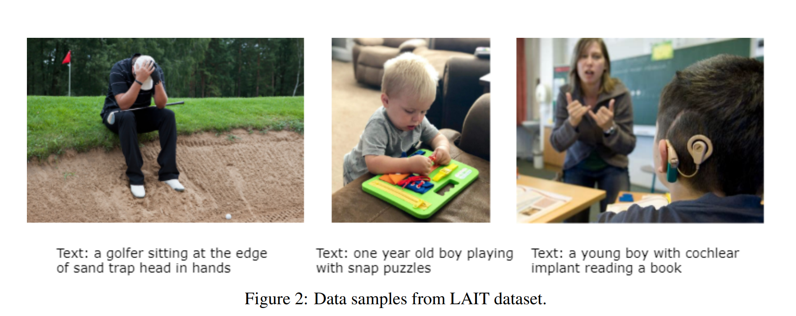
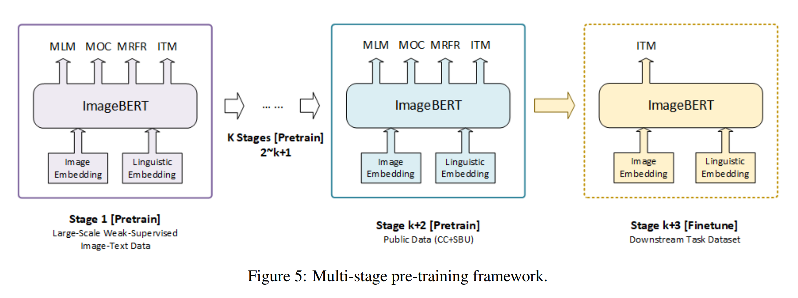
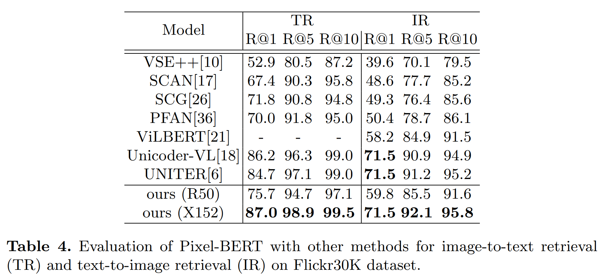
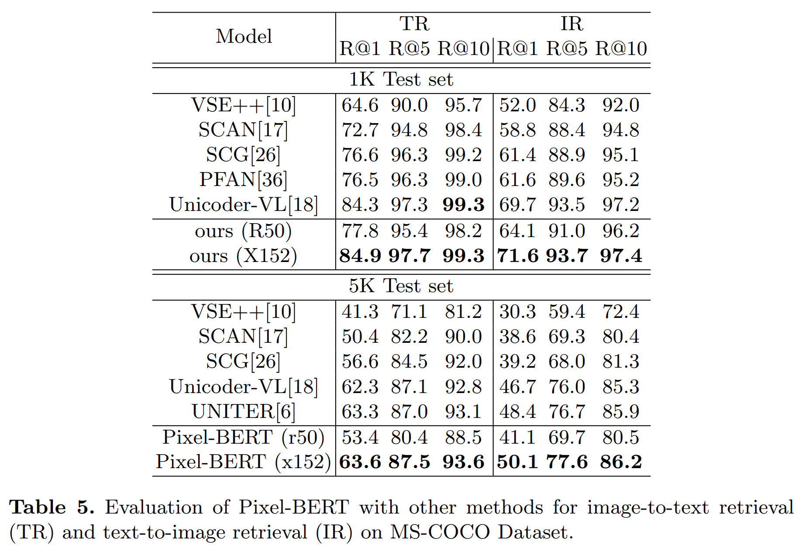

# Abstract

저자는 unified end-to-end framework 로 visual 및 language embedding 을 jointly learning 하는 deep multi-modal transformer 를 통해 image pixels 를 text 와 align 하는 Pixel-BERT 제안

- 목표는 최근의 vision 및 language tasks 에서 region-based image features 대신 image 및 sentence pairs 에서 직접 image pixels 및 language semantics 사이의 더 정확하고 철저한 연결을 구축
- pixel 및 text level 에서의 semantic connection 을 align 하는 Pixel-BERT 는 vision 및 language tasks 에 대한 task-specific visual representation 의 한계를 해결
- 또한 bounding box annotations 의 cost 를 완화하고 visual task 에서의 semantic labels 간 불균형을 극복
- downstream task 에 better representation 제공을 위해 Visual Genome 및 MS-COCO dataset 에서 image 및 sentence pairs 로 universal end-to-end model pre-training
- visual representation 의 robustness 향상을 위해 random pixel sampling mechanism 을 사용하고, pre-training task 로  Masked Language Model 및 Image-Text Matching 적용
- pre-trained model 로 downstream task 에 실험 결과, Visual Question Answering (VQA), image-text retrieval, Natural Language for Visual Reasoning (NLVR$^2$) 등 downstream task 에서 SOTA 달성
- 특히, 공정한 비교 하에 VQA task 에서 저자의 single model 성능을 SOTA 대비 2.17 points 향상

# 1. Introduction

최근 self-supervision learning 이 NLP task 에서 representation learning 에 적용되 성공하였고, 유사하게 vision 및 language 분야에서 cross-modality learning 연구가 진행되고 있다.

- pre-training 은 cross-modality domain 의 vision-language 에 strong representation 을 제공
- 이들은 BERT-based language feature 및 region-based visual feature 를 input 으로 pre-trained models 에 joint embedding learning

---

다양한 modalities 간의 semantic gap 은 cross-modality 연구에 중요하게 취급

- 초기, vision-language 에 Visual Question Answering (VQA) 및 image captioning 에 pre-trained model on image classification task 에서 추출된 CNN feature 를 활용
- 이후, Visual Genome dataset 및 Bottom-Up, Top-Down Attention model 제안
- 최근은, pre-trained model 대부분이 더 나은 성능을 위해 object detection model (e.g. Faster R-CNN) 에서 추출된 region-based visual features 를 활용
  - region-based visual feature extractors 는 specific visual tasks (e.g. object detection) 에 설계됐고, 이로 인해 언어 이해와의 information gap 발생
  - visual information 의 일부 중요 요소, object shapes, spatial relations 등이 손실
  - task-specific model 의 feature representation 능력은 scene 및 sentiment 같은 semantics 로 제한됨

몇 가지 예시로 Fig. 1 을 보여줌

- (A) : 비행기의 상태를 감지하는 것은 object detection model 에게 어려움
- (B) : "girl" 과 "ground" 는 감지하지만, 영역 겹침으로 인해 bounding box 가 주어졌을 때, actual spatial relation 을 판단하기 어려움
- (C) : "giraffe" 의 visual feature 만으로 동물의 상태를 추론하기 어려움 

---

기존 region-based visual features 및 language embedding 을 input 으로 사용하여 Transformer 에 cross-modality joint learning 을 하는 방식은 visual feature 로 표현된 visual semantics 는 제한됨

따라서 저자는 bounding box 를 벗어나 vision 및 language learning 을 위해 image 의 visual information 의 모든 힘을 발휘하기 위해 노력

이에 **Pixel-BERT** 를 제안

- visual 및 textual information 간의 semantic embedding 을 구축하여 image pixels 와 text 의 align 을 학습
- Pixel-BERT 는 세 가지 파트를 구성
  - image pixels 를 input 으로 취하여 visual embedding learning 을 위한 fully convolutional neural network (CNN)
  - BERT 에 기반한 word-level token embedding
  - visual 및 language embedding 의 jointly learning 을 위한 multi-modal transformers
- vision-language task 의 universal representation 학습을 위해, 먼저 다른 cross-modality pre-training methods 와 유사한 image-sentence pair dataset 으로 모델을 pre-training
- pre-training procedure 에는 two pre-training tasks 및 one pre-training mechanism 사용
  - language : surrounding text 및 image 와 함께 masked tokens 의 예측을 위해, 다른 pre-training words 를 따르는 Masked Language Modeling (MLM) 사용
  - vision : pixel-level feature 의 특성을 예측하는 것의 어려움을 보전하기 위해 random pixel sampling mechanism 제안
    - random pixel sampling mechanism 은 visual feature learning 의 견고성을 향상시키고 overfitting 극복
  - vision-language interaction : Image-Text Matching (ITM) 을 적용해 image 와 sentence pair 가 일치하는지 여부 분류

논문의 기여는 다음과 같다.

- Pixel-BERT 제안. 이는 CNN-based visual encoder 및 deep multi-modal transformers 로 구성되어 visual 및 language embedding 을 jointly learning. self-supervised learning 을 사용하여 pixel 및 text level 에서 visual 및 language semantics 를 align 하는 첫 번째 시도
- pre-training 방식을 사용하고, visual representation learning 의 robustness 향상을 위해 random pixel sampling mechanism 제안
- 광범위한 실험으로 저자의 접근 방식의 효과를 입증하며, VQA, Image-Text Retrieval 및 NLVR$^2$ 같은 다양한 task 에서 SOTA 달성
- 특히, 우리의 접근 방식은 공정한 비교에서 이전 SOTA 보다 VQA 의 single model 성능을 2.17 포인트 향상시키고 그보다 큰 모델보다 더 높은 성능을 보임

# 2. Related Works

## 2.1 Pre-training Mechanism

vision-language task 에서 semantics 이해를 잘 이해하는 것이 better joint representation 을 얻는데 중요

- visual-content 이해를 위해 여러 백본 모델이 제안되었고, 이런 모델은 large dataset 에서 효과 입증
- pre-trained backbone nmodel 의 generalizability 다양한 downstream task 에 fine-tuning

language 이해 측면에선 large-scale contextualized pre-training 으로 universal backbone model 을 구축하여 급속한 지전 이룸

- 이런 모델은 다양한 task 에서 상당한 수준으로 향상

cross-modality  연구에선 많은 방벙이 제안

- 서로 다른 modalities 간의 visual 및 sentence dense connection 를 학습하는데 초점
- 기존 연구들은 두 그룹으로 나눌 수 있다.
  - 일부 연구는 Transformer 기반의 two-stream network 를 활용하며, visual 및 language information 각각 을 처리하고 나중에 다른 Transformer layer 에 fuse
  - 다른 일부 연구는 single-stream network 를 적용하며, BERT 를 사용하여 detection bounding box 및 sentence embedding feature 에 bi-directional joint distribution 을 학습
  - 이들의 차이점은 training method, loss function 및 dataset 이며, Pixel-BERT 는 single-stream 에 속하지만 visual embedding 방식에서 위 방법과 다름

## 2.2 Visual Feature Embedding in Vision and Language Tasks

VQA, image captioning 같은 Cross-modality tasks 는 sentence 및 visual semantics 이해를 필요로 함

초기엔 visual representation 으로 pre-trained classification model 로 추출된 CNN features 를 채택 그 후, Visual Genome Dataset 의 도입과 Bottom-Up and Top-Down Attention model 의 제안으로, visual 및 language 연구가 더 나은 성능을 위해 object detection model 에서 추출된 region-based visual feature (e.g. Faster R-CNN)을 활용

이런 방법들은 visual feature 의 semantic 은 Visual Genome detection categories 로 제한되는 반면, language domain 에는 훨씬 더 많은 semantic information 이 포함되어 있다

저자와 다른 방법들 사이의 주요 차이점 중 하나는 visual semantic embedding methods 다.

visual 및 language embedding learning 을 위한 visual semantic representation 으로 bounding box feature 를 사용하는 대신, visual encoder representation learning network 를 하나의 framework 로 결합하고 source image 를 visual input 으로 사용

이 모델을 통해 더 풍부한 visual semantics 를 학습하기 위해 cross-modality pre-training 에 사용

# 3. Approach

## 3.1 Revisit Transformer

Pixel-BERT 는 BERT 를 cross-modality alignment module 로 채용

BERT 는 multi-layer bidirectional Transformer encoder 이며, all input elements 의 dependency 를 modeling

basic Transformer module 의 two key operation 은 self-attention 및 feed-forward 이다.

input $X \in \mathbb{R}^{n \times d}$ 가 주어졌을 때

- $n$ : element 수
- $d$ : feature dimension

먼저 input 에서 query $Q$, key $K$ 및 value $V$ 를 얻음

$$
\begin{equation}
    Q = \mathcal{W}_qX, K = \mathcal{W}_kX, V = \mathcal{W}_vX,
\end{equation}
$$

- $\mathcal{W_q}$, $\mathcal{W_k}$ 및 $\mathcal{W_v}$ : weight matrices

attention outpout $X_{att}$ 은 다음과 같이 계산

$$
\begin{equation}
    \begin{align*}
        &\mathcal{A} = \text{softmax}(\frac{QK^T}{\sqrt{d}}), \\
        &X_{att} = \mathcal{A}V,
    \end{align*}
\end{equation}
$$

- $\mathcal{A}$ : 각 input element 의 self-attention weight

output 은 feed-forward 에 의해 계산됨

$$
\begin{align}
    X_{out} = \text{FFN}(X_{att})
\end{align}
$$

- FFN 은 fully-connected layer 와 ReLU activation function 의 그롭으로 구성
- 위 계산은 각 elements 를 모두 포함하여 dense connection 구축

cross-modality tasks 에선, visual 및 language domain 으로부터 input element 를 사용

Transformer 로 intra-domain (i.e. image-image, sentence-sentence) 및 inter-domain (i.e. image-sentence) 을 dense connection 구축

## 3.2 Model Architecture

vision-language task 에선 다양한 modalities 로부터 two types input 을 갖는다.

- Natural language 는 sentence form 이며 이를 word sequence 로 분할 가능
  - 저자는 sentence 의 각 word 를 토큰화하고 vector 로 embedding 하기 위해 이전 연구를 따름. 
- visual domain input 은 image 이며, 최근의 방법들은 Faster R-CNN 같은 object detection model 로부터의 region-based visual feature 를 추출하여 visual input 으로 표현
  - 이러한 region-based visual feature extractor 는 specific visual task (i.e. object detection)을 위해 설계됐으며, 이는 language understanding information gap 으로 이어짐
  - 특히, bounding box 는 사각형으로, noisy background 를 포함하고 shape 및 spatial relation information 을 놓칠 수 있다
  - 또한, 이러한 task-specific model 로 제공된 category 에 의해 feature representation 이 제한
  - 또한, scene 및 sentiment 같은 넓은 의미의 visual information 도 object detection model 에서 손실됨
- source image 의 visual information 을 완전히 활용하기 위해, 저자는 Pixel-BERT 라는 pixel 에서 visual embedding 을 학습하기 위한 end-to-end framework 제안

#### Sentence Feature Embedding

BERT 를 따라 sentence 의 language information encoding

- input sentence 를 word sequence 로 분할하고 각 word 를 토큰화한 후, embedding matrix 를 사용하여 각 token 을 vector 로 embedding
- embedded sequence 를 $\text{w} = \{ w_1, w_2, \dots, w_n \} \in \mathcal{R}^d$ 로 표시
- $n$ : sequence length
- $d$ : embedding dimension
- 다른 BERT-based language moethds 를 따라 position information 을 인코딩하기 위해 position embedding 추가
- sentence 의 final language representation 는 $\{ \hat{w}_1, \hat{w}_2, \dots, \hat{w}_n  \}$
- 각 position $i$ 의 representation 은 다음과 같이 계산

$$
\begin{equation}
    \hat{w}_i = LayerNorm(w_i + p_i + s_w)
\end{equation}
$$
- $p_i$ : position $i$ 의 embedding vector
- $s_w$ : semantic embedding vector
- LayerNorm : normalization function
- position 및 semantic embedding 의 합은 one embedding 에 대한 수학적 동등으로, 구현에선 $s_w$ 를 생략

#### Image Feature Embedding

최근의 vision-language methods 는 pre-trained Faster R-CNN on Visual Genome dataset 을 사용하여 Bottom-Up and Top-Down Attention 을 따라 visual feature 추출

- detector 는 먼저 pre-defined category 에 따라 region 을 검출한 다음 final classifier 이전의 feature 를 output 으로 사용하여 reguion feature 추출
- 이러한 extracted feature 의 representation 은 detection categories 로 제한됨

task-specific categories 의 한계 극복을 위해, bounding box 대신 pixel 을 사용하여 이미지를 표현하기 위해 pixel 로부터 학습한다.

- pixel feature ResNet 같은 CNN visual backbone 을 사용하여 학습
- input image $I$ 가 주어지면, 먼저 CNN backbone 을 사용하여 그 feature 를 추출한 다음, spatial dimension 따라 feature 를 flatting 한다
- flatten feature 를 $\text{v} = \{ v_1, v_2, \dots, v_k \} \in \mathcal{R}^d$ 로 표시
  - $k$ : feature pixel 수
  - visual embedding feature $\{ \hat{v}_1, \hat{v}_2, \dots, \hat{v}_k \}$ 다음과 같이 계산

$$
\begin{equation}
    \hat{v_i} = v_i + s_v
\end{equation}
$$

- $s_v$ : language embedding 과의 차이를 구별하기 위한 semantic embedding vector
- all pixel 이 동일한 $s_v$ 를 공유하므로, 이 embedding vector 는 CNN backbone 과 결합할 bias term 으로 간주될 수 있음
- 저자의 구현에선, ResNet 또는 ResNeXt 를 backbone 으로 채택하고, visual feature maps 의 spatial dimension 을 줄이기 위해 $2 \times 2$ max pooling layer 추가
- input image $I$ 의 spatial size 는 총 64배 down-sampling

#### Cross-Modality Module

image pixel 과 language tokens 간의 cross-modality attention 을 학습하기 위해 Transformer 채택

- sentence embedding vectors 를 얻은 후, all vectors 를 결합하여 input sequence 로 구성
- 또한, learning joint classification feature 및 token length 지정을 위해, two special tokens [CLS] 및 [SEP] 를 추가
- joint-learning Transformer 에 대한 final input sequence 는 다음고 같이 정의

$$
\begin{equation}
    \{ [CLS], \hat{w_1}, \hat{w_2}, \dots, \hat{w_n}, [SEP], \hat{v}_1, \hat{v}_2, \dots, \hat{v}_k \}.
\end{equation}
$$

- visual representation learning 을 위한 CNN backbone 과 language representation learning 을 위한 Transformer 를 결합하여 single model 로 통합
- 이는 end-to-end 로 학습 가능
- Transformer 의 output 에 supervision learning 적용할 때, gradient 는 CNN backbone 으로 backward 되므로, learned visual feature 는 visual 및 sentence 간의 domain gap 을 깨고 target task learning 에 더 적합해질 것

## 3.3 Pre-Training

vision-language task 에 universal vision 및 sentence representation learning 을 위해 large aggregated dataset 에 self-supervised method 적용하여 pre-training

- Maske Language Modeling (MLM) 및 Image-Text Matching (ITM) 같은 two pre-training tasks 수행을 위해 이전 연구를 따름
- 기존 방법이 detection model 로 region-based visual feature 를 추출하는 반면, 저자는 source image 를 input 으로 사용하여 pre-training task 수행

#### Masked Language Modeling

token 과 visual content 간의 mapping 을 구축하고 model 을 pre-training 하기 전에 cross-modality domain 의 MLM task 수행

- language token 을 0.15 확률로 randomly masking 을 하고 모델이 masked tokens 을 non-masked tokens 및 visual tokens 를 기반으로 예측하도록 요구
- learning target $\mathcal{L}_{\text{MLM}}$ 은 다음과 같이 정의

$$
\begin{equation}
    \mathcal{L}_{\text{MLM}}(\theta) = -E_{(\text{w}, I) \sim D} \log P_\theta (w_m | \text{w}_{\backslash m}, I),
\end{equation}
$$

- $w_m$ : masked token
- $\theta$ : model parameters
- $P$ : generated likelihood function

BERT 에서 masked token 이 language domain 의 surrounding non-masked token 으로 예측되는 single-modality tasks 와 달리, 저자는 language modality 만 사용하여 ambiguity 가 발생할 수 있는 cross-modality scenario 를 처리 가능

MLM task 는 모델이 language 및 visual token 에서 masked token 을 추론하도록 장려하여 language 및 visual modality 간의 mappding 을 도움

#### Image-Text Matching

image-text retrieval 같은 일부 downstream task 는 모델이 sentence 가 image 를 잘 설명하는지 여부를 구별해야 함

다시 말해, sentence 와 image 가 matching 하는지 여부를 확인해야 함

- cross-modality matching 을 강화하기 위해, 이전 연구처럼 훈련을 위해 image-text matching (ITM) task 채택
- training 중엔, dataset 에서 제공된 all image-sentence pairs 를 sampling 하고 이를 positive sample 로 간주
- 또한 dataset 을  randomly suffle 로 unmatched image-sentence pairs 를 negative sample 로 간주
- learning bias 방지를 위해 positive 및 negative sample 수를 동일히 채택

[CLS] token 의 joint embedding feature 에 binary classifier 적용을 하여 input image 및 sentence 가 일치하는지 여부를 분류.

ITM task 는 다음과 같은 loss function 의해 주도

$$
\begin{equation}
    \mathcal{L}_{\text{ITM}} (\theta) = -E_{(\text{w}, I) \sim D}[y \log S_\theta (\text{w}, I) + (1-y)\log(1-S_\theta (\text{w}, I))],
\end{equation}
$$

- $y \in \{ 0, 1 \}$ : image 및 sentence 일치 여부
- $S$ : classification score generated function

#### Pixel Random Sampling

feature learning 의 robustness 향상과 overfitting 방지를 위해, dropout 에 영감을 받아, pre-training 중 pixel 을 randomly sample feature pixels 제안

- 각 iteration 에서, pixel feature 를 추출 후, 일부를 randomly sampling 후 Transformer 에 주입
- 이런 pixel random sampling 은 model training 을 두 방법으로 도움을 줌
  - model 이 incomplete visual input 에서 semantic knowledge 를 배우도록 장려할 수 있으며, 이로써 robustness 향상
  - input elements 수를 줄여, 계산 비용을 줄이고 training 가속화 
- 실험에서 각 input image 에 대해 feature maps 에서 fixed number 100 pixels 를 randomly sampling
- 이런 pixel random sampling 전략은 pre-training stage 에만 적용
  - 이유는 downstream task 에서의 pixel random sampling 이 information missing 을 일으킬 수 있기 때문
  - fine-tuning stage 는 few epochs 만 지속되기 때문
  - 또 다른 이유는 downstream tasks training 및 testing input 이 일관되도록 보장해야 하기 때문

# 4. Experiments

## 4.1 Pre-training

#### Datasets

two large-scale image-sentence datasets: MS-COCO, Visual Genome 에 Pixel-BERT 를 pre-training

- MS-COCO 의 image-level caption annotation 및 Visual genome 의 region-level caption annotations 를 training data 로, pre-training
- Visual Genome dataset 의 경우, _train_ 및 _val_ 모두 training 으로 사용
- MS-COCO 의 경우 _train_, _restval_, _val_ 및 _test_ 으로 분할
- 한 downstream tasks 가 image-text retrieval 은 MS-COCO dataset 에 수행하며, data 누수를 피하기 위해 _train_ 및 _restval_ 을 훈련에 사용
- training sample 통계는 Tab. 1 row 2 에 확인 가능

#### Implementation Details

pre-training 중엔 각 iteration 에서 일괄 처리된 image-sentence pairs 를 Pixel-BERT 에 입력

- 각 sentence 를 language tokens 로 분할하기 위해 BERT 에 사용된 WordPiece tokenizer 사용
- 실험 분석을 위해 ResNet-50 을 visual backbone 으로 사용하고, 더 강력한 ResNeXt-152 를 사용하여 성능 향상\
- visual backbone 의 parameter initializing 을 위해 pre-trained model on ImageNet 사용
- input image 의 shorter edge 를 800 크기로 조정하고, ResNet-50 사용할 때 longer edge 1333 보다 작게 제한
- ResNeXt-152 사용할 땐 GPU 사용량을 고려하여 shorter edge 및 longer edge 각각 600 및 1000 조정
- CNN 및 Transformer는 서로 다른 종류의 optimizer 를 선호할 수 있으므로, visual backbone 및 Transformer 에 서로 다른 optimizer setting 채택
- 구체적으로, CNN backbone learning rate 1e-2 및 weight decay 5e-4 SGD , Transformer learning rate 1e-4 및 weight decay 1e-2 AdamW 채택
- 64 NVIDIA Tesla V100 GPU 에 batch size 4096 sample 로 설정하여 40 epochs 동안 Pixel-BERT pre-training
- learning rate 를 $25^{th}$ 및 $35^{th}$ epochs 에서 10 감소

## 4.2 Downstream Tasks

저자는 downstream vision-language tasks 인 Visual Question Answering (VQA), Natural Language for Visual Reasoning on VQA 2.0 (NLVR$^2$) dataset 에서 평가

또한 image-to-text 및 text-to-image retrieval task 인 Flickr30K 및 MS-COCO 에서도 실험 수행

서로 다른 두 visual backbone setting 하에 Pixel-BERT 성능 report (r50 은 ResNet-50 및 x152 은 ResNeXt-152)

12-Layer Transformer 를 language module 로 채용하므로, 주요 비교는 Transformer setting 하에 이루어짐

#### Visual Question Answering

VQA 에선 Pixel-BERT 가 image 와 question 을 input 으로 받아 [CLS] token 을 통해 binary cross-entropy loss 로 multi-layer perceptron 을 학습하여 answer 를 예측하는 classification 문제로 모델링

- pre-training 과 동일한 optimizer setting 따름
- batch size 256 및 16 NVIDIA Tesla V100 GPU 18 epochs 동안 fine-tuning
- initial learning rate 는 pre-training 과 동일하며, $12^{th}$ 및 $16^{th}$ epochs 에서 learning rate 10 감소

VQA task 실험 결과는 SOTA 이며 Tab. 2 에 report 

- ResNet-50 사용 시, test-dev split 에서 71.35 score 를 달성했는데, 이는 ResNet-101 또는 ResNeXt-152 와 같은 더 강력한 visual backbone 을 사용하는 ViLBERT 및 VisualBERT 앞지름
- ResNeXt-152 사용 시, test-dev split 에서 74.45 score 달성했으며, test-std split 에선 74.55 score 달성
- 이는 모든 기존 연구를 능가하며, 심지어 VQA test-std split 에 73.40 score 를 얻은 24-Layer Transformer 를 language module 로 사용하는 UNITER (large) 도 능가
- 이러한 명백한 개선은 pixel-level 의 visual 및 language attention 을 학습하면 visual encoder representation 을 개선하고 그 후 visual 및 language embedding learning 을 향상시킬 수 있음을 보여줌

#### Natural Language for Visual Reasoning for Real

NLVR$^2$ task 는 주어진 image pair 과 description 을 예측해야 한다. 

저자의 모델에선 two image-language pairs 를 Pixel-BERT 에 입력하여 [CLS] token 에서 two embedding vectors 를 얻고, 이들을 결합하여 "true" 또는 "false" 에 대한 classifier 를 cross-entropy loss 로 학습

optimizer, epochs number 및 learning rate setting 모두 위에서 설명한 VQA setting 과 동일하며 batch size 는 VQA 의 절반

저자는 dev 및 test-P split 에서 평가하며, pre-training task 및 다른 downstream task 오 달리 한 번에 two image 를 받는다.

- Tab. 3 결과에서 Pixel-BERT 는 dev split 에서 76.5 accuracy 얻으며, test-P split 에서 77.2 accuracy 얻음.
- 저자가 two image-language pairs 를 조합하는 방식은 LXMERT 와 UNITER 의 "Pair" setting 과 동일하며, Tab. 3 비교에서 Pixel-BERT 가 이들보다 우수함을 알 수 있음
- 이러한 결과는 Pixel-BERT 가 다른 유사한 입력 형식에도 적용될 수 있음을 보여줌

#### Image-Text Retrieval

retrieval task 는 다른 연구들과 유사하게 ranking 문제로 고려

- training 중, image-sentence pair 에 대해, pair 내의 ground-truth caption 을 positive sample 로 사용하고, 다른 pair 에서 randomly sample 20 unrelated captions 을 negative sample 로 생성
- 모든 [CLS] token 의 representation 에 대한 fully-connected layer 에서 pair 와 관련있는지의 score 를 예측하고, positive image-caption pair 가 highest score 를 얻도록하는 softmax cross-entropy loss 를 적용
- 각 image sample 에 대한 highest loss 5 negative samples 에만 gradient backward
- retrieval task 는 pre-training ITM task 와 밀접하게 관련되어 있으므로, 저자는 Transformer parameter 만 fine-tuning
- optimizer 는 AdamW 을 사용하며 learning rate 1e−4, weight decay 1e−2 setting
- 8 NVIDIA Tesla GPU 에서 batch size GPU 당 64 sample 로 fine-tuning
- Flickr30K 의 경우, $6^{th}$ epoch 에서 learning rate 를 감소시키고 10 epochs 동안 training
- MS-COCO의 경우, $6^{nd}$ epoch 에서 learning rate 를 감소시키고 4 epochs 동안 training

---

text-to-image retrieval (IR) 및 imageto-text retrieval (TR) sub-tasks 에서 recal@1, 5, 10 report

- Tab. 4 는 Flickr30K에서 1K testing 결과, Tab. 5 는 MS-COCO 에서 5-fold 1K testing 결과 및 5K testing 결과를 보여줌
- Pixel-BERT 를 12-layers Transformer 를 language module 로 사용한 Unicoder-VL 및 UNITER 와 비교
- image-sentence retrieval subtask 에서, MS-COCO 1K test set 에서 최소 0.6 성능 향상을 얻었으며, MS-COCO 5K test set 0.3 성능 향상 얻음
- image-to-text retrieval subtask 에서, Unicoder-VL 및 UNITER 와 비교하여 MS-COCO 1K test set 에서 적어도 1.9 성능 향상 및 MS-COCO 5K test set 에서 1.7 성능 향상 달성
- 이는 text-to-image retrieval task 가 image 의 global description 에 중점을 두기 때문에, 저자의 모델이 language 및 image pixels 간의 attention 을 학습하도록 장려할 수 있기 때문

## 4.3 Ablation Study

Pixel-BERT 의 각 component 의 효과를 평가하기 위해 ablation 실험을 수행

pre-trained model 의 성능을 single metric 으로는 잘 측정할 수 없기 때문에 downstream task 에서의 평가 결과를 사용

ablation 결과는 Tab. 6 에 먼저 각 pre-training tasks 평가

- 모델 (1) (2) (3) 비교에서 MLM 과 ITM 이 거의 모든 downstream task 성능을 크게 향상시킬 수 있음을 알 수 있음
  - 특히, VQA 의 경우 MLM 과 ITM 이 각 약 7.6 과 1.6 향상
  - retrieval task 의 경우, ITM 이 더 많이 기여하여 TR 및 IR sub-tasks 에 적어도 13.0 개선
  - NLVR$^2$ 는 MLM task 에 매우 의존하며, 이 task 가 없으면 훈련이 수렴하지 않음
- pre-training 의 효과는 다른 연구에서 도출된 결론과 일관됨
  - 이러한 task 의 결합인 모델 (5) 는 single task 보다 각 task 의 성능을 더 향상
- 모델 (4), (5) 의 비교에서 pixel random sampling 방법이 VQA 에서 0.5, retrieval task 약 2.0, NLVR$^2$ 0.4 score 기여
  - 이는 pixel random sampling mechanism 이 효과적임을 보여줌
  - 모델 (6) 에서 ResNext-152 로 visual backbone 을 대체. 결과 powerful visual backbone 을 갖는 저자의 모델이 큰 폭으로 성능을 향상

## 4.4 Visualization

Pixel-BERT 가 language 와 pixel 간의 cross-modality attention 을 통해 visual representation 을 잘 학습할 수 있는지 여부를 더 자세히 확인하기 위해 MS-COCO val set 예제에서 attention maps 의 intermadiate results 를 시각화

- Case (A) : "dog", "grass", "frisbee" token 의 반응 영역이 실제 올바른 영역에 분산
- Case (B) : "cutting" 은 동사이지만, 동작이 칼을 사용하여 수행되는 관련 영역에 attending
- Case (C) : "room" token 이 image 에 올바른 영역에 attending 할 수 있음을 발견
- bounding box annotation 같은 spatial supervision 을 적용하지 않았음에도, Fig. 3 결과는 well-defined tasks 를 통해 Pixel-BERT 가 region level 에서 visual representation 을 잘 학습할 수 있음을 보여줌
- 이 결과는 cross-modality learning 이 visual information 의 semantic understanding 에 반대로 도움이 될 수 있는지를 더 많은 연구 가능성을 제공

# 5. Conclusion and Discussion

pre-training 은 vision-language 에 효과를 입증했다.

본 논문은 기존 연구에 visual embedding 에 대해 논의하고, region-based visual representation 제한을 해결하기 위해 CNN-based visual encoder 를 제안하고, multi-modal transformer 와 결합하여 Pixel-BERT 를 구성하여 pixel 및 text level 에서 visual 및 language content 간의 정확하고 철저한 embedding 구축

- image pixel 을 input 으로 사용하고 visual embedding learning 의 robustness 를 위해 random pixel sampling mechanism 적용
- Visual Genome 및 MS-COCO dataset 에 universal visual 및 language embedding learning 을 위해 Pixel-BERT 기반으로 pre-training 구축
- Masked language model 및 image-text matching 은 pre-trainng task
- pre-trained model 로 downstream vision 및 language task 를 수행하고 대부분의 task 에서 SOTA 달성
- annotated bounding box 제한 없이 pre-trained model on Pixel-BERT 은 larger image-sentence pair dataset 으로부터 더 강력한 representation 제공 가능
- 저자는 visual 및 language embedding 을 더욱 최적화하기 위해 Conceptual Caption Dataset 에 모델을 pre-training 하는 것을 고려
- 일부 연구에선 Masked visual prediction 이 제안되엇으며, 예로, Masked region modeling 의 세 가지 유형을 제안하여 가려진 영역을 예측하기도 한다. 본 논문은 pixel 재구성의 어려움으로 인해 random pixel sampling mechanism 을 사용하여 이 부분을 대체