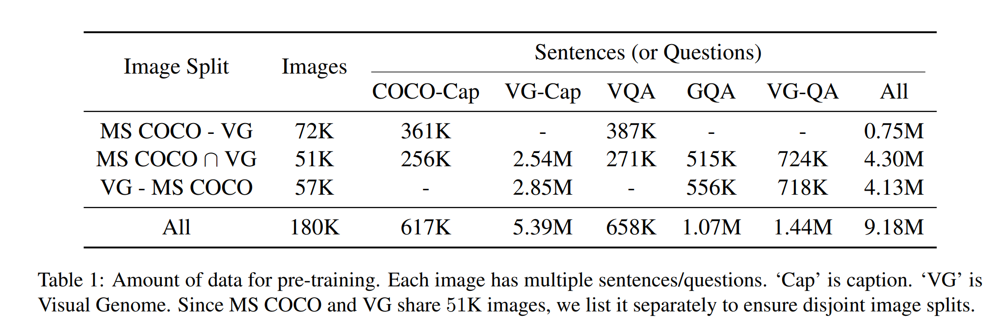
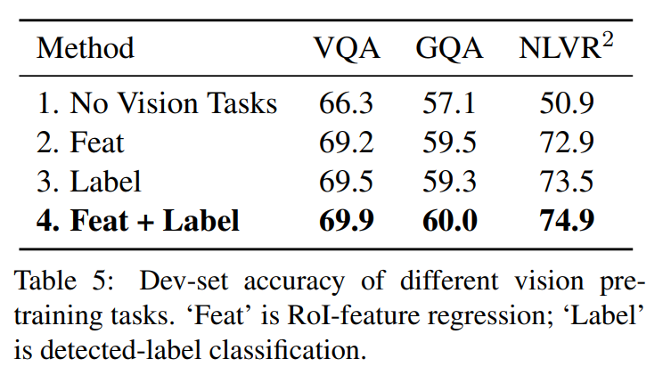

논문 및 이미지 출처 : <https://arxiv.org/pdf/1908.07490.pdf>

# Abstract

Vision-language reasoning 은 visual concepts, language semantics 두 modality 간의 alignment 와 relationship 이해가 중요

따라서 저자는 **LXMERT** (Learning Cross-Modality Encoder Representations from Transformers) 을 제안하여, 이러한 vision-language connections 를 학습

LXMERT 는 세 가지 encoder 로 구성된 large-scale Transformer model 을 구축

- object relationship encoder
- language encoder
- cross-modality encoder

이후 vision-language semantics connection 하는 모델 능력 부여를 위해, 대량의 image-sentence pairs 을 사용하여 모델을 pre-training 하며, 5 가지 representative pre-training tasks 수행:

- masked language modeling
- masked object prediction (feature regression 및 label classification)
- cross-modality matching
- image question answering

위 task 모두 intra-modality 및 cross-modality relationship 을 학습하는데 도움이 됨

- fine-tuning 을 통해 모델은 두 가지 visual question answering dataset (VQA 및 GQA) 에서 SOTA 달성
- pre-trained cross-modality model 를 visual-reasoning task 인 NLVR$^2$ 에 adapting 함으로써 일반화 능력을 보여주고 이전 best 를 22% 향상 (54% to 76%)
- 저자의 novel model components 와 pre-trained 전략으로 강력한 결과에 기여하는 것을 증명하기 위해 ablation study 를 수행하고 다양한 encoder 의 attention visualization 제시

# 1. Introduction

vision-language reasoning 은 visual content, language semantic 및 cross-modal alignment, relationship 요구하여, 여러 backbone 을 개발하여 large vision dataset 에 효과성을 보여주거나, pre-trained backbone 을 fine-tuning 하여 일반화 성능도 보여주었다.

language 이해 측면에서 large contextualized language model pre-training 으로 universal backbone 의 강력한 진전이 있어, 다양한 task 에서 성능을 크게 향상시켰다.

이와 같이 single modality task 의 발전에도 불구하고 vision-language pair modality 에 대한 pre-training 및 fine-tuning 은 여전히 개발 중

---

저자는 vision-language cross-modality framework 를 구축하였고, 여러 dataset 에서 강력한 성능을 보인다. 이를 LXMERT 라 한다.

- BERT-style 을 modeling 한 것으로 cross-modality 시나리오로 adapting
- new cross-modality model 로 vision-language interaction 을 학습하며, 특히 single image 와 descriptive sentence 의 representation 을 학습

이 모델은 세 개의 Transformer encoder 로 구성:

- object relationship encoder
- language encoder
- cross-modality encoder

vision 과 language 간의 더 나은 cross-modal alignment 학습을 위헤ㅐ, 5 가지 representative task 에 pre-training 한다.

- masked language modeling
- Roi-feature regression 을 통한 masked object prediction
- masked object prediction via detected-label classification
- cross-modality matching
- image question answering

BERT 의 masked LM (single-modality pre-training) 과 달리, multi-modality pre-training 은 동일한 modality 내의 visible elements 또는 다른 modality 의 aligned components 에서 masking 된 feature 를 추론할 수 있게 함. 이로써 intra-modality 및 cross-modality relationship 을 구축

- 경험적으로, visual question-answering dataset 인 VQA 및 GQA 에서 LXMERT 를 평가
  - 이전 연구를 능가하여 전반적인 정확도는 SOTA 달성
- pre-trained modal 의 일반화 능력을 보여주기 위해, visual reasoning task 인 NLVR$^2$ 에 fine-tuning
  - natural images 를 pre-training 에 사용하지 않고, real-world images 에 fine-tuning 하고 평가
  - 이 설정으로 정확도 22% 개선 (54% to 76%, 48% 에러 감소)과 일관성 30% 개선 (12% to 42%, 34% 에러 감소) 달성
- model components 및 다양한 pre-training tasks 의 효과를 증명하기 위해 여러 analysis 및 ablation 연구 수행
  - BERT 와 그 변형들을 사용하여 vision-language task 에서의 비효율성을 보여줌
  - new cross-modality pre-training framework 의 필요성을 입증
  - 서로 다른 language, object-relationship 및 cross-modality encoders 에 대한 여러 attention visualization 제시

# 2. Model Architecture

최근의 NLP model 의 발전으로 self-attention 및 cross-attention layer 로 cross-modality 구축

Fig. 1 처럼, 모델은 두 개의 input 을 받는다: 각 image 와 object 의 sentence (captioning 또는 qustion)

이러한 self-attention 및 cross-attention layer 를 진훙히 설계 및 결합하여,  저자의 모델은 input 에서 language 및 image representation, cross-modality representation 을 생성할 수 있다.

## 2.1 Input Embeddings

LXMERT 의 input embedding layer 는 inputs (image 및 sentence) 를 two feature sequence 로 변환: word-level sentence embedding 및 object-level image embeddings

#### Word-Level Sentence Embeddings

sentence 는 WordPiece tokenizer 를 사용하여 words $\{ w_1, \dots, w_n \}$ 로 분할

이후, Fig. 1 처럼, word $w_i$ 와 해당 index $i$ ($w_i$ 가 sentence 내의 절대 위치)는 embedding sub-layers 에 의헤해 vector 로 project 되고, 이후 index-aware word embeddings 에 추가

$$
\begin{align*}
    \hat{w_i} &= \text{WordEmbed}(w_i) \\
    \hat{u_i} &= \text{IdxEmbed}(i) \\
    h_i &= \text{LayerNorm}(\hat{w_i} + \hat{u_i})
\end{align*}
$$

#### Object-Level Image Embeddings

convolutional neural network 에 의한 feature map 사용 대신, 저자는 Anderson et al. (2018) 의 방법을 따라 detected object 의 feature 를 image 의 embedding 으로 취한다.

구체적으로, object detector 는 image 로부터 $m$ 개의 objects $\{ o_1, \dots, o_m \}$ 를 감지 한다. (Fig. 1 의 이미지 위의 bounding boxes 로 표시)

각 object $o_j$ 는 position feature (즉 bounding box coordinates) $p_j$ 와 2048-dimensional region-of-interest (RoI) feature $f_i$ 로 표현

RoI feature 를 직접 사용하는 대신, Anderson et al. (2018) 처럼 position $p_j$ 를 고려하지 않고, 
2 fully-connected layers 의 outputs 을 추가함으로써 position-aware embedding $v_j$ 를 학습

$$
\begin{equation}
    \begin{align*}
        \hat{f_j} &= \text{LayerNorm}(W_Ff_j + b_F) \\
        \hat{p_j} &= \text{LayerNorm}(W_Pp_j + b_P) \\
        v_j &= (\hat{f_j} + \hat{p_j}) / 2
    \end{align*}
\end{equation}
$$

visual reasoning 에서 spatial information 을 추가하는 것 외에도, positional information 포함은 masked object prediction pre-training task 에 필요하다.

image embedding layer 및 그 이후의 attention layer 는 input 의 absolute indices 에 대해 알지 못하기 때문에, object 의 order 는 지정되지 않는다.

마지막으로, Eq. 1 에서 두 유형의 feature 를 균형있게 조정하기 위해 summation 전에 layer normalization 을 적용한다.

## 2.2 Encoders

language encoder, object-relationship encoder 및 cross-modality encoder 로 encoder 를 구축하고, 두 attention layer 인 self-attention 및 cross-attention layer 를 구성

#### Background: Attention Layers

Attention layers 는 _query_ vector $x$ 와 관련한 _context_ vectors $\{ y_j \}$ set 에서 information 를 찾는 것이 목표

attention layer 는 먼저 _query_ vector $x$ 및 _context_ vector $y_j$ 간의 matching score $a_j$ 를 계산한다.

Score 는 이후 softmax 로 normalizing 된다.

$$
\begin{align*}
  a_j &= \text{score}(x, y_j) \\
  \alpha_j &= \exp (a_j) / \sum_k \exp(a_k)
\end{align*}
$$

attention layer output 은 softmax-normalized score: $\text{Att}_{x \rightarrow y}(x, \{ y_j \}) = \sum_j a_jy_j$ 와 같이 _context_ vector 의 weighted sun 이다.

_query_ vector $x$ 가 _context_ vector $\{ y_j\}$ set 이라면 _self-attention_ 이라 부른다.

특히, multi-head attention 은 Transformer 를 따라 사용한다.

#### Single-Modality Encoders

embedding layers 이후, 저자는 two transformer encoders 를 적용 (즉, **language encoder** 및 **object-relationship encoder**)하고, 각각을 single modality (즉, language 또는 vision) 에 포커싱

BERT 는 language inputs 에 transformer encoder 만 적용한 것과 달리, 저자는 vision inputs 도 적용

- single modality encoder 의 각 layer (Fig. 1 의 left dashed blocks) 는 self-attention ('Self') sub-layer 및 feed-forward ('FF') sub-layer 로 구성되며, feed-forward sub-layer 는 two fully-connected sub-layer 로 구성
- language 및 object-relationship encoder 에 $N_L$ 및 $N_R$ layer 사용
- 각 sub-layer 이후 저자는 residual connection 및 layer normalization 추가 (Fig. 1 에 '+' 표기)

#### Cross-Modality Encoder

cross-modality encoder 내의 각 cross-modality layer (Fig. 1 right dashed block) 는 two self-attention sub-layers, one bi-directional cross-attention sub-layers 및 two feed-forward sub-layers 로 구성

이러한 cross-modality layer 를 encoder implementation 에서 $N_X$ 번 쌓는다. (즉, $k$-th layer 의 output 을 $(k+1)$-th layer 로 사용)

$k$-th layer 내부에선 bi-directional cross-attention sub-layer ('Cross') 가 먼저 적용하며, 여기엔 two unidirectional cross-attention sub-layers 로 구성:

하나는 language to vision, 다른 하나는 vision to language 로 향산다.

query 및 context vectors 는 $(k-1)$-th layer 의 output (즉, language features $\{ h_j^{k-1} \}$ 및 vision features $\{v_j^{k-1}\}$)

$$
\begin{align*}
  \tilde{h}^k_i &= \text{SelfAtt}_{L \rightarrow L} (\hat{h^k_i}, \{ \hat{h^k_1}, \dots, \hat{h^k_n} \}) \\
  \tilde{v}^k_i &= \text{SelfAtt}_{R \rightarrow R} (\hat{v^k_j}, \{ \hat{v^k_1}, \dots, \hat{v^k_m} \})
\end{align*}
$$

마지막으로, $k$-th layer output $\{ h_j^k \}$ 및 $\{ v_j^k \}$ 은 $\{ \hat{h}_j^k \}$ 및 $\{ \hat{v}_j^k \}$ 의 top 에 feed-forward sub-layers ('FF') 에 의해 생성

또한 single-modality encoders 와 유사하게, 각 sub-layer 이후 residual connection 및 layer normalization 을 추가

## 2.3 Output Representations

Fig. 1 의 right 처럼, LXMERT cross-modality model 은 language, vision 및 cross-modality 에 대한 각각 세 개의 outputs 를 갖는다.

- language 및 vision output 은 cross-modality encoder 로 생산된 feature sequence 다.
- cross-modality output 은 BERT 를 따라 sentence words 앞에 special token [CLS] 를 추가 (Fig. 1 top yellow block)
  - language feature sequence 의 이 special token 에 대응하는 feature vector 가 cross-modality output 으로 사용

# 3. Pre-Training Strategies

## 3.1 Pre-Training Tasks

### 3.1.1 Language Task: Masked Cross-Modality LM

language 측면에선, masked cross-modality language model (LM) task 사용

Fig. 2 아래쪽처럼, task setup 은 BERT 와 거의 비슷:

단어들은 0.15 확률로 randomly masking 되고 모델은 masked words 를 예측.

BERT 는 non-masked words 에서 masked words 를 예측하는데, LXMERT 는 cross-modality architecture 를 사용하여 language modality 뿐 아니라 vision modality 로부터도 masked words 를 예측할 수 있다.

- 예로, Fig. 2 처럼 masked words "carrot" 를 language context 로 판단하는게 어렵지만 vision information 을 고려하면 명확하다.
- 따라서 vision modality 로부터 language modality 로의 connection 을 구축하는 것이 도움이됨
- 저자는 이러한 task 를 masked _cross-modality_ LM 이라 한다.
- 또한 BERT parameter 를 LXMERT 에 로드하면 pre-training procedure 에 손상을 준다는 것을 보여주는데, language modality 에서 이러한 cross-modality connections 를 학습하지 않고도 비교적 잘 수행할 수 있기 때문

### 3.1.2 Vision Task: Masked Object Prediction

Fig. 2 의 위쪽처럼, 저자는 object 를 0.15 확률로 randomly masking (즉, RoI feature 를 0 으로 masking) 하고 masked objects 를 예측하도록 하여 vision 측면을 pre-training

language task (즉, masked cross-modality LM) 과 유사하게, model 은 masked objects 를 visible objects 또는 language modality 로부터 추론할 수 있다.

vision 측면에서의 objects 추론은 object relationship 을 학습하고, language 측면에서의 추론은 cross-modality alignments 를 학습하는데 도움을 준다.

그러므로 저자는 two sub-tasks 를 수행한다.

- **RoI-Feature Regression** : object RoI feature $f_j$ 를 L2 loss 로 regress
- **Detected-Label Classification** : masked objects 의 labels 를 cross-entropy loss 로 학습
  - 대부분의 pre-training images 는 object-level annotations 가 있지만, annotated objects 의 ground truth labels 는 dataset 마다 일관되지 않음. (e.g. label classes 수가 다름)
  - 위 이유로 Faster RCNN 에서 출력된 detected labels 를 취함
  - detected labels 는 noisy 가 있지만, pre-training 에 기여함을 보여줌

### 3.1.3 Cross-Modality Tasks

Fig. 2 의 중간처럼, strong cross-modality representation 을 학습하기 위해, vision 및 language modalities 인 2 tasks 로 LXMERT model 을 pre-training

#### Cross-Modality Matching

각 sentence 의 경우, 0.5 확률로 mis-matched sentence 로 교체. 이후 image 와 sentence 가 일치하는지 예측하는 classifier 훈련

이 task 는 BERT 의 Next Sentence Prediction 과 유사

#### Image Question Answering (QA)

pre-training dataset 확대를 위해, pre-training data 의 약 3/1 은 이미지에 대한 질문이다.

이미지와 질문이 일치하는 경우 (즉, cross-modality matching task 에서 randomly replace 되지 않은 경우), model 에게 이 이미지 관련 질문에 대한 답변을 예측하도록 함

이러한 image QA 와 함께 pre-training 을 진행하면서 cross-modality representation 이 향상되는 것을 보여줌

## 3.2 Pre-Training Data

MS COCO 또는 Visual Genome 의 5 가지 vision-language dataset 에서 pre-training data 집계

captioning dataset 외에도 VQA v2.0, GQA 및 VG-QA 같은 3 개의 large image question answering 도 집계

- test 는 하지 않으므로 train 및 dev set 만 수집
- 최소한의 전처리만 수행하여 aligned image-sentence pairs 생성
- 각 image question answering dataset 에 대한 image-sentence pairs 에서 sentence 를 question 으로 취하고,  pre-training task 에서 QA 를 label 로 사용
- 이로 약 180k image 에서 9.18M image-sentence pairs 로 구성
- token 측면은 pre-training data 에는 100M words 및 6.5M image objects 포함

## 3.3 Pre-Training Procedure

- 집계한 large dataset 에 LXMERT 를 pre-training
- input sentences 는 WordPiece tokenizer 로 분할
- objectst 는 Visual Genome 에서 pre-training 된 Faster R-CNN 으로 detect 하며, feature extractor 로서 freezing 하고 fine-tuning 은 하지 않음
- Anderson et al. (2018) 의 객체 감지와 달리, 각 이미지에 일관되게 36 objects 를 유지하고 padding 은 피하고 pre-training 계산 활용도를 극대화
- model architecture 는 레이어 수를 $N_L$, $N_X$ 및 $N_R$ 을 각각 9, 5 및 5 로 설정
  - 101-layer Faster R-CNN 의 extracted visual features 를 균형있게 유지하기 위해 language encoder 에 더 많은 layer 사용
- hidden size 768 로, BERT$_{\text{BASE}}$ 와 동일
- encoder 및 embedding layer 의 all parameter 는 scratch pre-training (즉, randomly initial 또는 0)
- LXMERT 는 multiple pre-training tasks 로 pre-training 되며 따라서 multiple losses 가 관련됨
  - 이러한 loss 를 동일한 weights 로 추가
  - image QA pre-training task 의 경우, 세 가지 image QA dataset 의 90% question 을 커버하는 9500 answers 의 답변 후보로 구성된 joint answer table 생성

---

- Adam 을 optimizer 로 사용하며 linear-decayed learning-rate schedule 및 learning rate 1e-4 설정
- batch size 256 및 epochs 20 으로 훈련 (대략 670K optimization steps)
- last 10 epochs 동안 image QA task 만 pre-training
  - 이 task 는 4 Titan Xp 에서 10일 소요

#### Fine-tuning

fine-tuning 은 빠르고 견고

저자는 다른 task 에 대해 필요한 수정만 수행

- learning rate 1e-5 또는 5e-5
- batch size 32
- pre-trained parameter 를 4 epochs 동안 fine-tuning

# 4. Experimental Setup and Results

## 4.1 Evaluated Datasets

저자는 LXMERT framework 평가를 위해 세 가지 dataset 사용

- VQA v2.0
- GQA
- NLVR$^2$

## 4.2 Implementation Details

VQA 및 GQA 에선 data augmentation 없이 pre-trained snapshot 을 fine-tuning

- GQA 훈련 시 raw question 및 image 만 input 으로 사용하며 다른 supervisions (e.g. functional program 및 scene graphs)는 사용하지 않음
- NLVR$^2$ 의 각 데이터는 두 개의 natural image $img_0$, $img_1$ 와 한 개의 language statement 가 있으므로, LXMERT 를 사용하여 두 개의 image-statement pair $(img_0, s)$ 및 $(img_1, s)$ 를 인코딩한 다음 두 개의 cross-modality output 의 연결을 기반으로 classifier 훈련

## 4.3 Empirical Comparison Results

#### VQA

Pythia, DFAF 및 Cycle-Consistency 중 BAN+Counter 가 SOTA 이다.

- LXMERT 는 all _accuracy_ 를 2.1% 향상
- 'Binary/Other' question sub-categories 에서도 2.4% 개선
- BAN+Counter 처럼 counter module 을 명시적으로 적용하진 않지만, counting-related question 에 대해서도 동등하거나 더 나음

#### GQA

SOTA 결과는 리더보드의 BAN 에서 얻었다.

- 저자의 SOTA GQA 는 3.2% accuracy 향상으로 VQA 보다 높은데, GQA 가 더 많은 visual reasoning 을 필요로 하기 때문일 것
- 저자의 프레임워크는 novel encoders 및 cross-modality pre-training 으로 open domain questions 에서 4.6% 개선을 달성

#### NLVR$^2$

어려운 visual reasoning dataset 으로, MaxEnt 가 SOTA 이다.

- 기존 방식들은 실패했는데, large-scale pre-training 없이 conplex vision-language task 에서 vision 과 language 간의 연결이 학습되지 않은 것으로 나타남
- cross-modality connection 구축을 위한 저자의 novel pre-training 전략으로, accuracy 22% 개선
- _consistency_ 측정은 all related imate pairs 가 올바르게 예측된 비율을 측정. LXMERT 는 consistency 42.1% 로 개선 (약 3.5배 증가)

# 5. Analysis

## 5.1 BERT versus LXMERT

BERT 는 여러 language task 를 개선하는 pre-trained language encoder

- Tab. 3 에서 BERT$_{\text{BASE}}$ pre-trained model 을 vision-language task 에 통합하고 LXMERT 와 비교하는 분석
- NLVR$^2$ 에서 full model 이 74.9% 의 정확도를 달성하는 반면, pre-training LXMERT  가 아닌 결과는 22% 낮음

#### BERT+BUTD

BERT+BUTD Bottom-Up 및 Top-Down (BUTD) attention 은 GRU language encoder 로 question 을 인코딩한 다음 object RoI features $\{f_j\}$ 에 attending 하여 answer 예측 

저자는 BERT 를 BUTD 에 적용하여 GRU language encoder 를 BERT 로 대체한다.

- Tab. 3 첫 번째 블록에서 볼 수 있듯, BERT encoder 와 LSTM encoder 와 비교

#### BERT+CrossAtt

BUTD 는 object positions $\{p_j\}$ 와 object relationships 를 고려하지 않고 raw RoI features $\{f_j\}$ 만 사용하기 때문에, 저자는 BERT+BUTD 를 novel position-aware object embedding 및 cross-modality layers 로 향상

- Tab. 3 두 번째 블록에서 보이듯, 1 cross-modality layer 결과는 BUTD 보다 우수
- cross-modality layer 를 더 쌓으면 더 개선
- cross-modality pre-training 이 없는 결과 (BERT 는 language 만 pre-trained) 는 3 cross-modality 후 안정되고, full LXMERT framework 와 3.4% 차이남

#### BERT+LXMERT

BERT parameter 를 LXMERT 에 로드하고 이를 model training (LXMERT pre-training 없음) 또는 pre-training 에 사용해본다.

- Tab. 3 마지막 블로에서 보이듯, "from scratch" (즉, model parameter 가 무작위 초기화)와 비교하면 BERT 는 fine-tuning 결과를 개선하지만 full model 보다는 약함
- 경험적으로, BERT parameter 로 초기화된 LXMERT 의 pre-training 은 처음 3 pre-training epochs 에서 lower pre-training loss (즉, 더 나은) 를 보이지만 그 후로 "from scratch" 방식에 의해 따라 잡힘
  - 이러한 이유는 BERT 가 이미 single-modality masked language model 로 pre-training 되었으며, 따라서 vision modality 대한 connection 을 고려하지 않고도 language modality 만으로도 잘 수행될 수 있기 때문

## 5.2 Effect of the Image QA Pre-training Task

저자는 image QA pre-training task 의 중요성을 제외 또는 대안인 data augmentation 과 비교

#### Pre-training w/ or w/o Image QA

저자의 original pre-training procedure (10 epochs w/o QA + 10 epochs w/ QA) 와 공정한 비교를 위해, image QA task 없이 LXMERT 을 20 epochs 동안 pre-training

- 표 4의 2, 4 번째에서 볼 수 있듯, QA loss 과 함께 pre-training 하면 3 dataset 결과가 향상
- NLVR$^2$ 의 2.1% 개선은 image QA pre-training 으로 학습한 강력한 representations 를 보여주는데, NLVR$^2$ 의 all data(image 및 sentence)가 pre-training 에사용되지 않기 때문

#### Pre-training versus Data Augmentation

Data augmentation (DA) 은 여러 VQA 구현에 사용되는 기술

- 이는 다른 image QA dataset 에 question 을 추가하여 training data 양을 증가 
- LXMERT framework 는 대신 pre-training 에 multiple QA dataset 을 사용하고 one specific dataset 에만 fine-tuning
- pre-training 과 DA 에서 사용되는 전체 데이터 양이 유사하여 저자는 이 두 전략을 공정하게 비교 가능
- 결과, 저자의 QA pre-training 이 DA 를 능가
- 먼저 pre-training 에서 QA task 를 제외하고 DA fine-tuning 의 결과를 Tab. 4 에서 보여줌 
  - row 1 DA fine-tuning 은 row 2 non-DA fine-tuning 보다 결과가 낮다
  - QA pre-training 후 DA 를 사용하면 (row 3) 결과도 떨어짐

## 5.3 Effect of Vision Pre-training tasks

Table 5 에서 다른 vision pre-training task 의 영향도 분석

- pre-training 에 visual task 가 없는 경우 (즉, language 및 cross-modality pre-training task 만 사용하는 경우), 결과는 Tab. 3의 BERT+3 CrossAtt 와 유사
- two visual pre-training (즉, RoI-feature regression 및 detected-label classification)은 각각 합리적인 결과를 얻었으며, 이 두 task 와 함께 pre-training 을 하면 가장 높은 결과를 얻음

## 5.4 Visualizing LXMERT Behavior

Appendix 에서 LXMERT 의 visual encoder, object-relationship encoder 및 cross-modality encoder 를 시각화하여 동작을 보여줌

# 6. Related Work

#### Model Architecture

저자의 모델은 bi-directional attention, transformer 및 BUTD 와 밀접

- Lu et al. (2016) 은 bi-directional attention 을 vision-language task 에 적용
- BiDAF 는 독해 문제 해결에 modeling layer 추가
- Transformer : 기계 번역에서 처음 사용되어, 저자는 single-modality encoder 사용하고 이를 기반으로 cross-modality encoder 설계
- BUTD : object RoI features 로 image 를 embedding 하는 반면, 저자는 object positional embeddings 및 object relationship encoder 로 확장

#### Pre-training

ELMo, GPT 및 BERT 등이 large-scale pre-trained language model 로 NLU task 개선을 보여주어 cross-modality pre-training 의 발전으로 이루어짐

- XLM : monolingual data 및 parallel data 를 활용하여 cross-lingural representations  학습
- VideoBert : language words 및 visual tokens 의 connection 에 masked LM 을 수행하며, visual tokens 는 비디오 프레임에서 vector quantization 으로 변환

이러한 방법들은 여전히 single transformer encoder 및 BERT-stype token-based pre-training 을 하여, 따라서 저자는 cross-modality task 필요 충족을 위해 새로운 모델 구조와 pre-training task 개발

# 7. Conclusion

vision-language connection 을 학습하기 위한 cross-modality framework 인 LXMERT 제안

- 이 모델은 Transformer encoder 와 novel cross-modality encoder 를 기반으로 구축
- 다양한 pre-training task 를 large-scale image-sentence pairs dataset 에서 pre-training
- 실험적으로, 두 image QA dataset (VQA 및 GQA) 에서 SOTA 달성
- NLVR$^2$ 같은 challenging visual reasoning dataset 에서 22% 개선으로 일반화 능력을 보여줌
- detailed analysis 및 ablation 연구로 모델 구성 및 training 방법의 효과적임을 보여줌
