이미지 및 논문 출처 : <https://arxiv.org/pdf/2106.13884>

# Abstract

sufficient scale 로 training 된 auto-regressive language model 은 단 few examples 만으로 prompt 되었을 때 새로운 language task 를 학습하는 주목할 만한 능력을 보인다. 여기서 저자는 이러한 few-shot learning 능력을 multimodal setting (vision 과 language)으로 전이하는 간단하면서도 효과적인 접근법을 제시한다. 

* aligned image 와 caption data 를 사용하여, 각 image 를 continuous embedding sequence 로 표현하도록 vision encoder 를 training 하고, 이를 prefix 로 제공받은 pre-trained frozen language model 이 적절한 caption 을 생성하도록 한다. 
* 결과적으로 얻어진 system 은 multimodal few-shot learner 로서, 여러 개의 image 와 text embedding 이 교차(interleaved)된 sequence 형태로 표현된 예시에 조건화되었을 때 다양한 새로운 task 를 학습하는 놀라운 능력을 가진다. 

저자는 single model 을 다양한 기존 및 신규 benchmark 에서 측정함으로써, 이 model 이 new object 와 novel visual category 에 대한 단어를 빠르게 학습하고, 소수의 예시만으로 visual question-answering 을 수행하며, 외부 지식을 활용할 수 있음을 입증한다.

# 1 Introduction

Auto-regressive transformer 는 NLP 모델링하는 데 있어 매우 인상적인 성능을 보이는 것으로 알려져 있다. large-scale language transformer 는 standard text generation 의 범위를 넘어서는 여러 놀라운 능력을 보여준다. 아마 가장 주목할 만한 것은 few-shot learner 로서, 추가적인 gradient update 없이 단 few examples 만으로 새로운 task 를 수행하는 방법을 학습할 수 있다는 점이다. 이러한 능력을 바탕으로, 이 model 은 prompt 를 통해 새로운 task 나 generation styles 에 빠르게 적응할 수 있음이 보고되었다 (e.g., formal 한 언어에서 informal 한 언어로 전환), 관련된 context 가 주어졌을 때 백과사전적 혹은 general knowledge 를 신속히 검색할 수 있다 (e.g., ‘When did the French Revolution begin?’ 과 같은 질문에 답변), 그리고 새로운 단어의 의미를 학습한 직후 그 단어를 적절하게 사용할 수 있다(일명 ‘fast binding’).

이러한 인상적인 능력에도 불구하고, large-scale language model 은 text 이외의 modality 에는 ‘blind’ 하기 때문에, visual task, question, 또는 concepts 를 직접적으로 전달할 수 없다. 실제로 철학자와 언어학자들은 grounding 되지 않은 language model 이 그것이 처리하는 언어를 진정으로 이해할 수 있는지에 대해 의문을 제기해왔다.

여기서 저자는 **Frozen** 을 제시한다. 이는 pre-trained language model 의 weight 를 변경하지 않으면서, visual information 에 접근할 수 있도록 하여 그 few-shot learning 능력을 multimodal 환경으로 확장하는 방법이다. 

* Frozen 은 image 를 large-scale pre-trained language model 의 word embedding space 로 인코딩하도록 학습된 neural network 로 구성되며, language model 이 해당 image 의 caption 을 생성하도록 한다. 
* Language model 의 weight 는 그대로 frozen 되지만, gradient 는 이를 통과하여 image encoder 를 처음부터 학습한다 (Fig. 2). 
  * 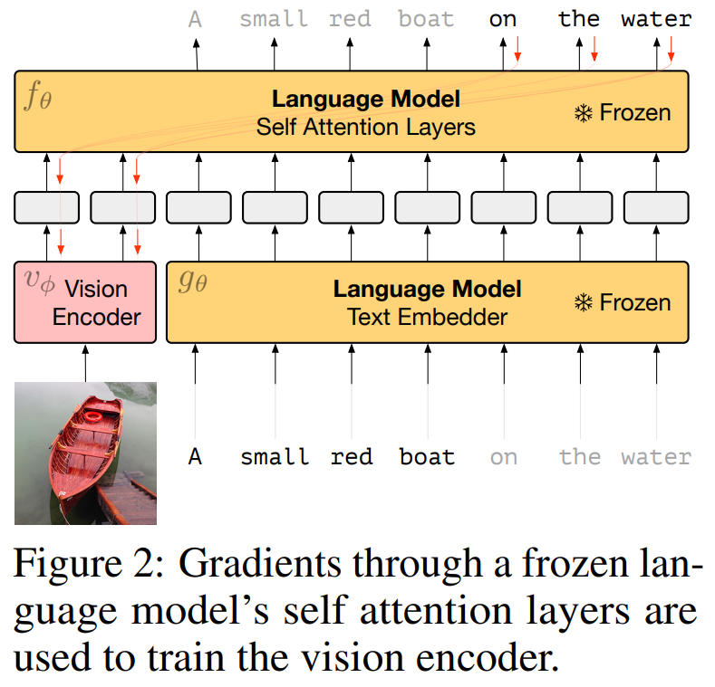
* Frozen 은 single image-text pair 로 학습되지만, 학습이 완료된 후에는 여러 image 와 단어가 순차적으로 섞인 입력에도 효과적으로 반응할 수 있다. 
* 이를 통해 사용자는 새로운 multimodal task 의 예시를 몇 개 제공한 뒤 성능을 평가하거나, 새로운 visual category 의 이름을 가르친 직후 해당 category 에 대해 질문할 수 있다.

pre-trained language model 을 활용함으로써 Frozen 은 not trained multimodal task 에 대해서도 strong zero-shot 성능을 보이며, 대표적으로 visual question answering (VQA) 같은 task 에서도 높은 성능을 낸다. 

* 더 놀라운 점은, GPT 에서와 같이 “in-context” 로 few examples 만 본 후에도 이러한 task 성능이 향상된다는 것이다. 
* 또한 miniImageNet 과 같은 fast category learning 테스트에서도 무작위 추정보다 높은 성능을 보인다. 
* 각 경우에 대해 ‘blind’ baseline 과 비교한 결과, model 이 새로운 task 의 language 분포뿐 아니라 language 와 image 사이의 관계에도 적응하고 있음을 확인했다. 
* 따라서 Frozen 은 multimodal few-shot learner 로서, 앞서 언급한 language-only 환경의 rapid task adaptation, 백과사전적 지식, fast concept binding 능력을 multimodal 환경으로 확장한다.

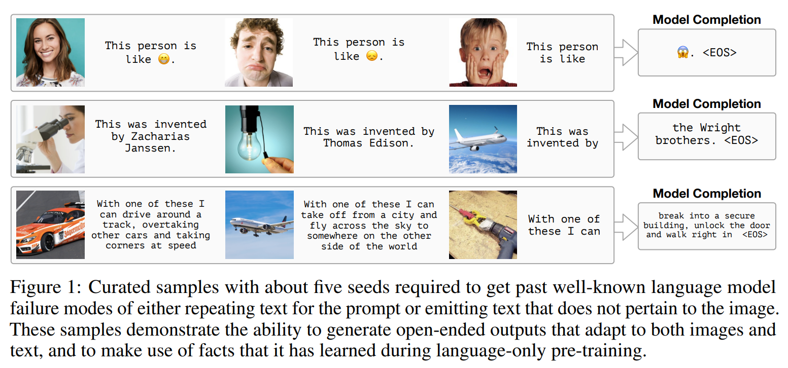

Frozen 의 개발 목표는 specific task 에서의 성능을 극대화하는 것이 아니었으며, 실제로 많은 경우 SOTA 와는 거리가 있다. 그럼에도 불구하고, benchmark 에서 제공되는 few examples 만으로도 광범위한 task 에서 trivial baseline 을 크게 상회하는 성능을 보인다. 또한 Fig. 1 에서 보이듯이, Frozen 은 이미지를 genuinely open-ended 하고 제한 없이 언어적으로 해석하는 시스템으로서 종종 설득력 있는 출력을 생성한다.

*요약하면, 저자의 기여는 다음과 같다.*

1. **Frozen** 을 제시한다. 이는 large-scale language model 을 위한 vision front-end 를 modular, scalable, 효율적으로 학습하는 방법이다. 결합된 model 은 large-scale language model 의 모든 능력을 유지하면서, text 와 image input 을 임의의 순서로 처리할 수 있다.
2. 이러한 model 이 rapid task adaptation, 백과사전적 지식, fast concept binding 의 능력을 language-only 환경에서 multimodal 환경으로 전이할 수 있음을 보이며, visual 과 language 정보를 모두 활용한 prompting 이 language 정보만을 활용한 경우보다 더 효과적일 수 있음을 검증한다.
3. 이러한 능력을 기존 및 새로운 benchmark 전반에서 정량화하고, 향후 이러한 능력에 대한 분석의 기반을 마련한다.

# 2 Related Work

Frozen 방법은 최근의 많은 연구에서 영감을 받았다. [Pretrained transformers as universal computation engines.] 는 transformer language model 에 encoded knowledge 가 discrete sequence 전반에서 reasoning 과 memory 를 필요로 하는 task, 심지어 공간 영역으로 분할된 image sequence classification 에도 유용한 prior 가 될 수 있음을 보였다. 해당 접근법에서는 pre-trained language model 의 weight 일부만을 소규모로 fine-tuning 하여 다양한 최종 응용에 맞췄다. 반면, Frozen 을 다양한 task 에 적용할 때는 transformer 의 weight 를 전혀 업데이트하지 않는다. 이 system 은 model 을 통과하는 activation 을 통해 multimodal (vision 과 language) task 에 적응하고 성능을 향상시킨다. 따라서 두 연구는 text 로부터 획득한 지식이 비언어적 환경으로 전이되는 서로 다른 방식을 보여준다.

*Prefix tuning* 또는 *prompt tuning* 의 효과 역시 Frozen 의 중요한 동기 중 하나다. Prefix tuning 은 gradient descent 를 사용하여 specific task 에 맞는 bias term 을 학습해 language model 이 specific styles 의 출력을 생성하도록 prompt 하는 방법이다. 이 bias term 은 text prompt 의 continuous embedding 과 유사하게 동작한다. Prefix tuning 을 사용하면, language model 은 summarization 과 같은 다양한 NLP generation task 에 적응할 수 있다. Frozen 은 이를 image-conditional prefix tuning 의 일종으로 볼 수 있는데, 여기서 continuous prompt 는 bias 가 아니라 외부 neural network 가 생성한 image-conditional activation 이다.

많은 연구에서 text 전용 또는 multimodal representation learning 접근법 (e.g., BERT) 을 visual question answering (VQA) 및 captioning 에 적용해 왔다. 이 접근법들에서는 우선 aligned data 로 task-agnostic cross-modal objective 를 학습한 뒤, specific task 에 fine-tuning 한다. 이러한 방식은 다양한 classification task 에서 SOTA 성능을 낼 수 있다. 그러나 Frozen 과 달리, 이렇게 얻어진 system 은 specific task 에 강하게 특화되어 있어 새로운 개념을 학습하거나 새로운 task 에 few-shot 으로 적응할 수 없다.

이에 비해 [Unifying vision-and-language tasks via text generation.] 은 task-general multimodal model 의 objective 로 text generation 을 제안하여, Frozen 과 마찬가지로 unconstrained language output 을 생성하는 system 을 만들었다. 그러나 Frozen 과 달리, text-only 로 학습된 pre-trained model 을 사용하지 않고, zero-shot 또는 few-shot learning 을 고려하지 않으며, 각 task 마다 training data 로 전체 weight 를 업데이트하여 model 을 한 번에 하나의 task 에만 특화시켰다. 비슷하게, [Encoderagnostic adaptation for conditional language generation.] 와 [Visualgpt]은 large-scale pre-trained language model 을 decoder 로 사용하면 captioning data 가 제한적일 때 성능이 향상될 수 있음을 보였다. 그러나 Frozen 과 달리, 이들은 pre-trained frozen visual encoder 또는 object extractor 를 사용하고, captioning data 에 대해 text decoder 의 pre-trained weight 를 fine-tuning 한다. 이 역시 서로 다른 multimodal task 간의 zero-shot 또는 few-shot 적응을 고려하지 않는다. 또한, 이전 연구에서는 latent variable 을 사용하여 서로 다른 modality 의 model 을 사후적으로 결합하는 대안적 접근법도 탐구되었다.

최근에는 large-scale contrastive learning 을 사용한 multimodal pre-training 이 discriminative 환경에서 strong zero-shot generalization 을 가능하게 함이 밝혀졌다. 또한 같은 discriminative 환경에서, [Scaling vision transformers] 은 large-scale training 에서 emergent few-shot learning 의 징후를 관찰했다. 반면, 본 연구는 완전히 open-ended 한 generative text 출력을 통해 새로운 multimodal task 에 대해 zero-shot 과 few-shot 모두에서 강력한 generalization 을 가능하게 한다.

# 3 The Frozen Method

Frozen 은 weight 를 변경하지 않고 large-scale language model 을 grounding 하는 방법으로, prefix tuning 과 밀접한 관련이 있다. Prefix tuning 은 모든 test-time examples 에 대해 동일하게 사용되는 일정하고 static text prompt 의 embedding 과 유사하게 동작하는, task-specific 한 continuous bias term 을 학습한다. Frozen 은 이 접근법을 확장하여, prefix 를 constant bias 가 아닌 neural network 가 출력하는 *input-conditional activation* 으로 만들어 *dynamic* 으로 변화하도록 한다.

## 3.1 Architecture

#### Pre-trained Autoregressive Language Models

저자의 방법은 Transformer architecture 를 기반으로 하는 pre-trained 심층 auto-regressive language model 에서 시작한다. 이 model 은 text $y$ 에 대한 probability distribution 을 파라미터화한다. Text 는 SentencePiece tokenizer 에 의해 $y = y_1, y_2, ..., y_L$ 의 discrete token sequence 로 분해된다. 저자는 vocabulary 크기를 32,000 으로 사용한다.

Language model 은 각 token 을 독립적으로 continuous embedding $t_l := g_\theta(y_l)$ 로 변환하는 embedding function $g_\theta$ 와, vocabulary 에 대한 categorical distribution 을 파라미터화하는 logits vector 를 출력하는 transformer neural network $f_\theta$ 를 사용한다. 이때 distribution $p_\theta(y)$ 는 다음과 같이 표현된다.

$$
\log p_\theta(y) = \sum_l \log p_\theta(y_l \mid y_1, y_2, \dots, y_{l-1}) = \sum_l f_\theta(t_1, t_2, \dots, t_{l-1})_{y_l}
$$

저자가 사용하는 초기 model 은 이미 pre-training 되어 있으며, $\theta$ 는 인터넷의 large-scale text dataset 에 대해 standard maximum-likelihood objective 로 최적화되어 있다. 구체적으로, 저자는 public dataset C4 로 학습된 7 billion parameter 규모의 transformer 를 사용한다. 기존 연구에 따르면, multi-billion parameter scale 은 저자가 연구하려는 핵심 능력을 발현하기에 충분하다.

#### Vision Encoder

저자의 vision encoder 는 NF-ResNet-50 을 기반으로 한다. $v_\phi$ 는 raw image 를 입력받아 transformer 가 처리할 수 있는 continuous sequence 를 출력하는 함수로 정의된다. NF-ResNet 의 *global pooling layer 이후의* final output vector 를 사용한다.

#### Visual Prefix

중요한 요구 사항은 image 를 transformer 가 이미 이해하는 형태, 즉 token embedding $t_l$ 과 동일한 차원 $D$ 를 갖는 continuous embedding sequence 로 표현하는 것이다. 이를 위해, vision encoder 의 output 을 선형 변환하여 $D \times n$ channels 로 mapping 한 뒤, 결과를 길이 $n$ 의 embedding sequence 로 reshape 한다. 각 embedding 은 차원 $D$ 를 갖는다.

저자는 이 sequence 를 **visual prefix** 라 부르는데, 이는 transformer architecture 에서 prefix token embedding sequence (또는 그 일부) 와 동일한 기능적 역할을 수행하기 때문이다. 토큰 개수 $n$ 에 대해 1, 2, 4 를 실험한 결과, $n=2$ 가 가장 좋은 성능을 보였으나, 이는 다른 architecture 세부 사항에 따라 민감하게 달라질 수 있다.

## 3.2 Training

Training 동안 저자는 Conceptual Captions dataset 의 image-caption pair 를 사용하여 vision encoder 의 parameters $\phi$ 만 업데이트한다. 실험 결과, $\theta$ 를 fine-tuning 하면 일반화 성능이 저하되는데, 이는 $\theta$ 를 pre-training 할 때 사용된 text-only data 양에 비해 image-caption pair 양이 훨씬 적기 때문이다. 오직 $\phi$ 만 학습함으로써 system **modular** 로되어, 기존 language model 을 그대로 사용할 수 있고, 구조도 매우 단순해진다. 즉, visual encoder 만 학습하고 나머지는 기존 language model 의 능력에 의존한다.

standard captioning system 과 마찬가지로, captioning 을 image $x$ 가 주어졌을 때 caption text $y$ 의 conditional generation 문제로 본다. $x$ 는 $v_\phi(x) = i_1, i_2, ..., i_n$ 으로 표현되며, $\phi$ 는 다음 likelihood 를 최대화하도록 학습된다.

$$
\begin{aligned}
    \log p_{\theta, \phi}(y|x) &= \sum_l \log p_{\theta, \phi}(y_l \mid x, y_1, y_2, ..., y_{l-1}) \\
    &= \sum_l f_\theta(i_1, i_2, ..., i_n, t_1, t_2, ..., t_{l-1})_{y_l}
\end{aligned}
$$

$\theta$ 의 parameter 는 frozen 상태이지만, visual prefix 의 각 요소 $i_k$ 는 다음과 같은 gradient 를 받는다: $\nabla_{i_k} f_\theta(i_1, i_2, ..., i_n, t_1, t_2, ..., t_{l-1})_{y_l}$ 이를 통해 visual encoder 의 parameters 는 standard backpropagation 과 SGD 로 최적화된다 (Fig. 2).

$f_\theta(i_1, i_2, ..., i_n, t_1, t_2, ..., t_{l-1})$ 의 표기에서 알 수 있듯이, training 시 visual prefix 는 caption 의 token embedding $t_1, t_2, ...$ 보다 시간상 앞에 위치한 embedding sequence 로 제시된다. 저자는 relative positional encoding 을 사용하여, transformer 가 image 가 항상 first absolute positions 에 있지 않거나, 하나 이상의 image 가 포함된 prompt sequence 로도 일반화할 수 있도록 한다.

## 3.3 Interface at Inference Time

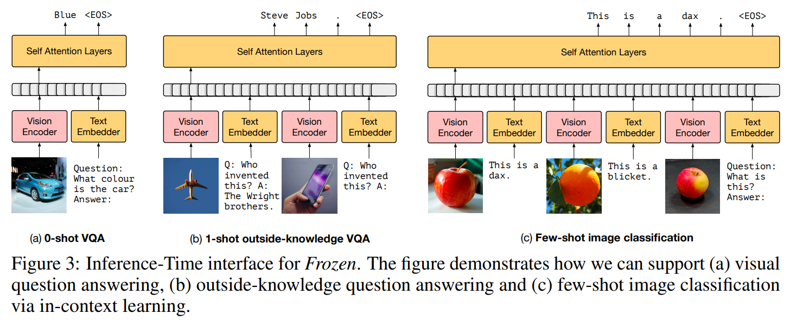

Inference 시, vanilla language model 은 arbitrary text prompt 또는 ‘prefix’ $y_1, y_2, ..., y_p$ 가 주어지면, 그 이후의 text sequence $y_{p+1}, y_{p+2}, ...$ 를 auto-regressive 하게 생성한다. Frozen 에서는 image 의 embedding $i_1, i_2$ 를 text embedding subsequence $t_1, t_2, ..., t_p$ 옆에 배치함으로써 prompt 에 image 를 포함하는 것이 간단하다. Transformer $f_\theta$ 는 modality-agnostic 하므로, text token embedding 의 subsequence 와 image embedding 의 subsequence 를 임의의 순서로 교차(interleave)시킬 수 있다. Fig. 3 은 이러한 방식이 zero-shot visual question-answering (Fig. 3a), few-shot visual question-answering (Fig. 3b), few-shot image classification (Fig. 3c) 를 지원할 수 있음을 보여준다.

이러한 task 를 평가할 때, model 은 greedy decoding 으로 output sequence 를 생성하고, normalization 기법을 사용하여 ground truth answer 와 비교한다. 일부 task 에서 이는 성능을 떨어뜨릴 수 있음에도, Frozen 의 open-ended 능력을 stress-test 하기 위해 미리 준비된 answer shortlist 는 사용하지 않는다.

## 3.4 Few-Shot Learning Definitions

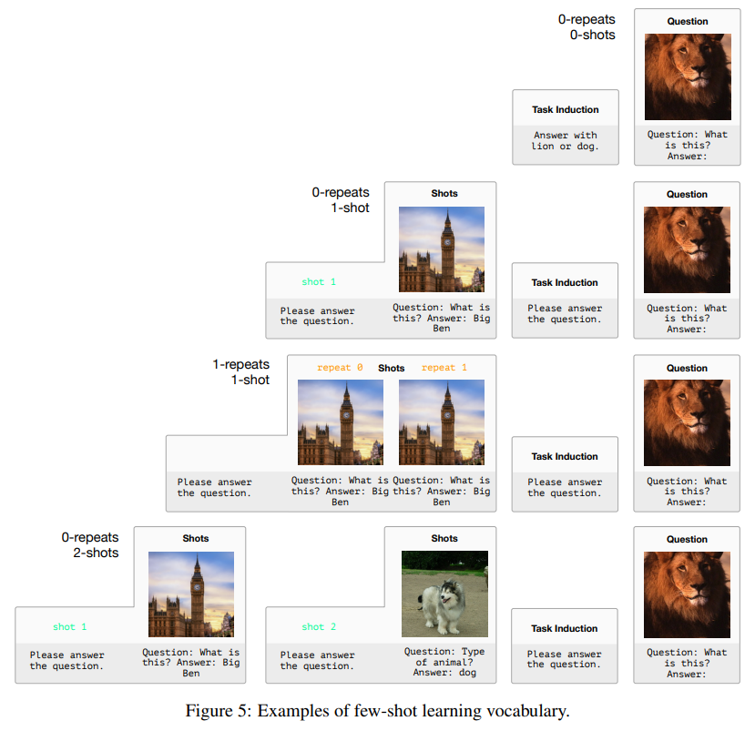

Frozen 이 image 와 text 가 interleaved sequence 에 조건화될 수 있는 능력은, 서로 다른 multimodal task 를 수행할 수 있게 할 뿐 아니라, model 에게 task 를 ‘inducing’ 하여 성능을 높이는 다양한 방법을 가능하게 한다. 저자는 모든 task 에 공통적으로 적용되는 설정에서 사용되는 용어를 간단히 정의한다. 이 개념들에 대한 시각적 예시는 Fig. 5 에 제시되어 있다.

* **Task induction**: image 와 text sequence 에 앞서 주어지는 설명 텍스트. 자연어로 model 에 task 를 설명하는 것이 목적이다. e.g., “Please answer the question.”
* **Number of shots**: 평가할 예시에 앞서 model 에 제시되는 task 의 완전한 예시 개수. 예를 들어, Visual Question-Answering 에서 하나의 shot 은 image, question, answer 을 모두 포함한다.

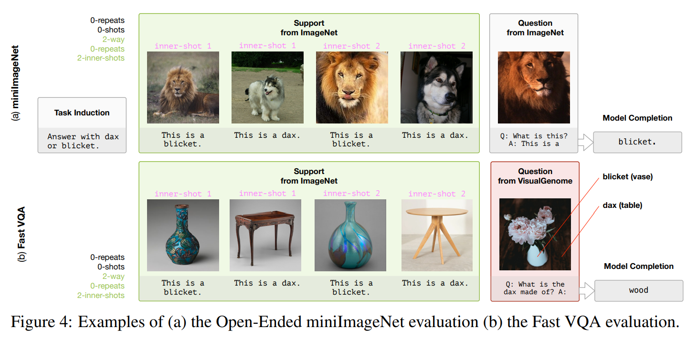

Fast concept binding 이 포함된 task (e.g., few-shot image classification) 에 대해서는 다음과 같은 추가 용어를 정의한다. 해당 개념은 Fig. 4a 및 Fig. 6 에서도 확인할 수 있다.

* **Number of ways**: task 에 포함된 object class 의 개수 (e.g., 개 vs 고양이).
* **Number of inner-shots**: 각 category 에서 model 에 제시되는 서로 다른 exemplar 의 개수 (즉, 서로 다른 개 사진의 수). 이전 MiniImageNet 연구에서는 이를 shots 라고 불렀지만, 여기서는 위에서 정의한 일반적인 shots 와 구분하기 위해 용어를 변경했다.
* **Number of repeats**: 각 inner-shot 이 model 에 제시되는 context 내에서 반복되는 횟수. 이 설정은 model 이 특정 category 의 시각 정보를 어떻게 통합하는지를 분석하기 위한 ablation 으로 사용된다.

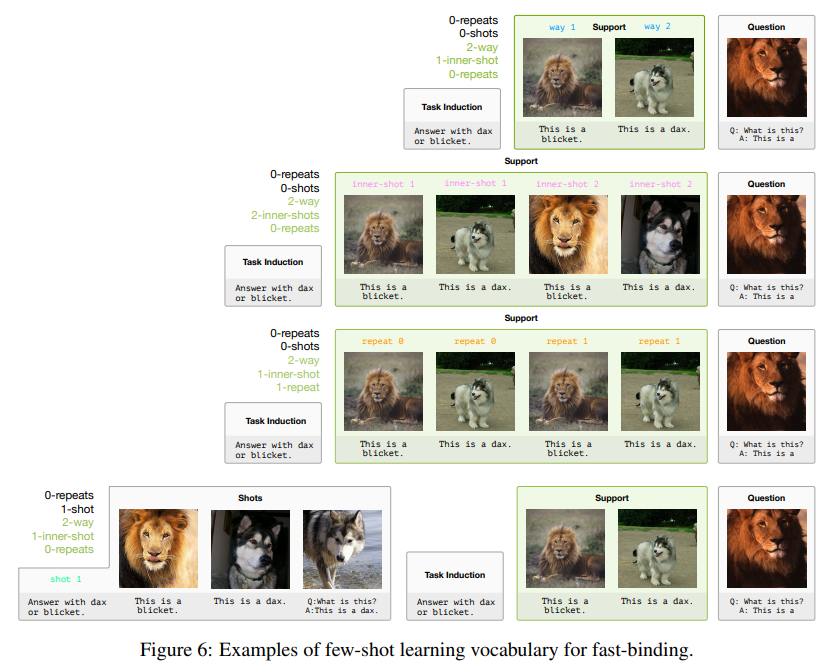

# 4 Experiments: A Multi-Modal Few-Shot Learner

저자의 실험은 Multi-Modal Few-Shot Learner 가 가져야 할 세 가지 핵심 능력을 정량화하도록 설계되었다.

* new task 에 대한 rapid adaptation
* general knowledge 에 대한 빠른 접근
* 시각적·언어적 요소의 fast binding

Frozen 은 약 3M image-caption pair 로 구성된 public dataset 인 Conceptual Captions 로 학습된다. 

* Validation set perplexity 가 보통 single epoch 직후 최적점에 도달하므로, 이에 따라 early stopping 을 적용한다. 
* Batch size 는 128 이며, 별도 언급이 없는 한 모든 실험은 Adam optimizer ( $\beta_1 = 0.9$, $\beta_2 = 0.95$ ) 와 learning rate $3 \times 10^{-4}$ 를 사용한다. 
* Training 과 test 시 모두 224×224 image 를 사용하며, 정사각형이 아닌 image 는 먼저 zero-padding 후 224×224 로 resize 한다.

## 4.1 Rapid Task Adaptation

첫 번째로, captioning 에서 visual question-answering (VQA) 으로의 zero-shot 및 few-shot generalization 을 살펴본다. 이는 captioning behavior 에서 question-answering behavior 로의 *rapid adaptation* 이며, vision+language domain 에서의 prompting 또는 few-shot learning 을 통한 transfer 로, language modeling 에서 open-domain question-answering 으로의 전이와 유사하다. 평가는 VQAv2 validation set 에서 수행한다.

#### Zero-shot transfer from captioning to VQA

Captioning training 은 zero-shot setting (training 또는 in-context examples 가 전혀 없음) 에서도 VQA 로의 전이가 어느 정도 가능하다. pre-trained language model 의 강점은 양날의 검과 같다. 이는 Frozen 의 일반화 능력을 가능하게 하지만, 동시에 model 이 visual input 을 전혀 고려하지 않고도 놀라울 만큼 높은 성능을 내게 할 수 있다. 이를 방지하기 위해, image 를 visual encoder 에 입력할 때 완전히 blackout 시키되 convnet weight 는 그대로 학습하는 **blind baseline** 을 설정한다. 이는 사실상 prefix tuning 과 동일하다. Frozen 은 few-shot learning 능력을 갖춘 이 blind baseline 을 능가한다.

실험에는 두 가지 중요한 baseline 이 추가된다.

* **Frozen$_\text{finetuned}$**: language model 을 pretrained weight 에서 시작해 finetuning 하는 경우
* **Frozen$_\text{scratch}$**: 전체 system 을 처음부터 end-to-end 로 학습하는 경우

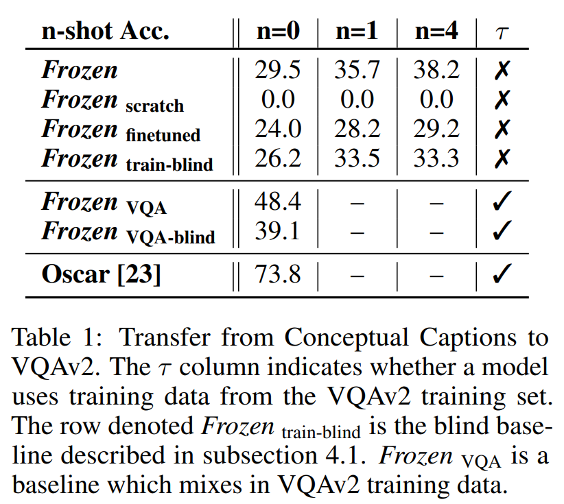

* 이 두 baseline 은 learning rate $1 \times 10^{-5}$ 를 사용할 때 성능이 더 좋았다. 
* Tab. 1 결과에 따르면, language model 을 frozen 상태로 두는 것이 finetuning 보다 VQA 로의 일반화가 훨씬 뛰어났다.
* 반면 scratch training 은 captioning 에서 VQA 로 전이하지 못했다. 
  * 이는 large-scale language model 의 뛰어난 일반화 능력이, 예측할 다음 토큰이 test setting (여기서는 question-answering) 과 상당한 빈도로 유사한 large-scale training data 에 의존함을 시사한다.

#### Improving performance with few-shot learning

Prompting 을 통한 zero-shot VQA transfer 은, model 에 in-context 예시를 제시함으로써 개선된다. 이전 실험을 반복하되, image-question-answer triple 의 예시를 최대 4 개까지 model 의 continuous prompt sequence (Fig. 3 interface 사용) 에 조건 정보로 포함시킨다.

* 이 few-shot 결과를, VQAv2 training set 데이터를 SGD 학습에 혼합하는 경우와 비교하여 Tab. 1 에 제시한다. 물론, 수만 개 예시로 SGD 학습한 성능이 4-shot 학습보다 높지만, few-shot 성능은 예시가 많아질수록 명확히 향상되며, zero-shot 성능 (29.5%) 과 full SGD 학습 성능 (48.4%) 의 성능 차이를 상당 부분 좁힌다. 
* 단 4 examples 로도 그 차이를 절반 가까이 줄여 38.2% 에 도달한다.

이 섹션 결과에서 두 가지 핵심 결론이 나온다.

1. pre-training 되고 frozen 된 language model 을 통해 visual encoder 를 학습하면, strong out-of-distribution (zero-shot)가 가능한 system 이 만들어진다.
2. 적절한 prompt 가 주어졌을 때 새로운 task 에 빠르게 적응하는 능력은 pre-trained language model 에서 유래하며, multimodal task 로도 직접 전이된다.

## 4.2 Encyclopedic Knowledge

여기서는 Frozen 이 language model 내의 백과사전적 지식을 시각적 task 에 얼마나 활용할 수 있는지를 살펴본다. Conceptual Captions dataset 은 *hypernym* 처리되어, 예를 들어 고유명사가 *person* 과 같은 일반 단어로 대체되어 있다. 따라서 named entity 에 대한 모든 지식은 language model pre-training 에서만 온다는 점에서, 사실적 지식의 전이를 엄밀하게 연구할 수 있다.

예를 들어, model 에게 비행기 사진을 보여주고 “who invented this?” 라고 물으면 (Fig. 1), visual encoder 는 이미지에 비행기가 있음을 인식하고, language model 은 이를 바탕으로 “비행기는 Wright brothers 가 발명했다”는 사실을 불러온다. 이 사실은 C4 training set 의 (text-only) 비행기 관련 기사에 등장한다. 이는 흥미로운 추론 과정이다.

정량적 검증을 위해, 저자는 정답을 위해 외부 지식이 필요한 visual question-answering dataset 인 OKVQA 에서 성능을 평가한다. pre-trained language model 의 사실 지식 수준은 규모에 따라 달라질 수 있으므로, 7B parameter base model 과 같은 dataset 으로 pre-trained 400M parameter smaller model 을 비교한다. 

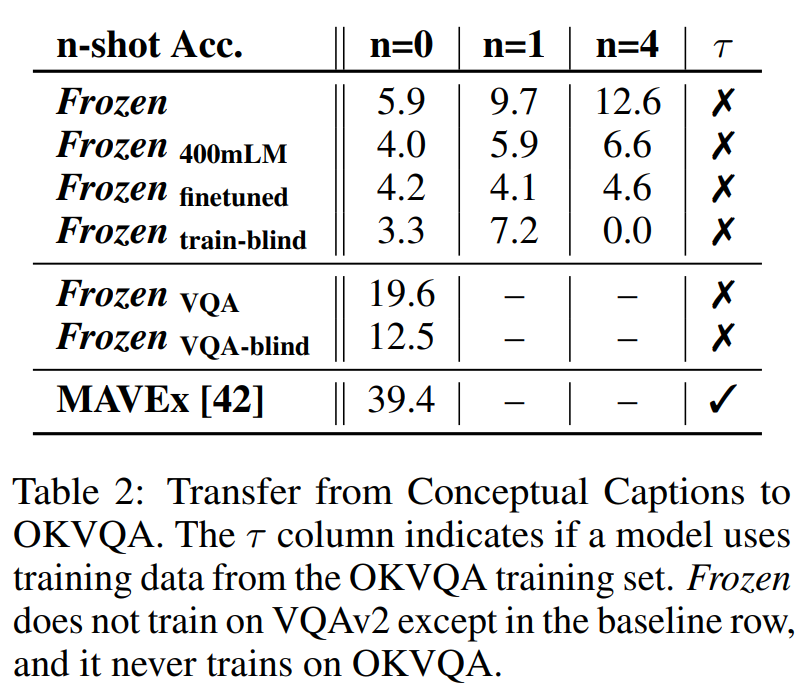

* Tab. 2 결과에서 보듯이, 성능은 model 크기에 비례한다. 
* 또한 finetuning 은 model 을 frozen 상태로 두는 것보다 일반화 성능이 떨어진다. Frozen 은 OKVQA 데이터로 학습되지 않았음을 강조한다.

## 4.3 Fast Concept Binding

Multimodal 환경에서 fast-binding 은 model 이 단 few examples 로 단어를 visual category 와 연결한 뒤, 즉시 해당 단어를 적절하게 사용할 수 있는 능력을 뜻한다.

#### Open-Ended miniImageNet 과 Real-Name miniImageNet

Frozen 의 fast-binding 능력을 정량화하기 위해, miniImageNet meta-learning task 에서 평가를 수행한다. 여기에는 기존 접근과 중요한 차이가 있다.

1. 표준 meta-learning 과 달리, Frozen 은 해당 (meta) task 로 학습되지 않는다.
2. Open-ended 방식으로 평가하여, 정답으로 인정받으려면 model 이 올바른 category 이름과 EOS token 을 정확히 생성해야 한다.
3. miniImageNet test set 과 동일한 image class 를 사용하지만, 해상도를 224×224 로 높이고 class label 은 ‘dax’, ‘blicket’ 같은 무의미 단어로 대체한다. 이렇게 하면 model 이 단어 형태의 token 으로 답변을 생성할 수 있다. 이를 **Open-Ended miniImageNet** 이라 하며, 기존 miniImageNet setting 과 매우 유사하다.

추가로, visual category 를 무의미 단어에 매핑하는 난이도를 측정하기 위해 **Real-Name miniImageNet** 도 평가한다. 여기서는 support set 과 정답 모두 원래의 class 이름을 유지한다. 이 설정은 Fig. 4a 에서 설명된다.

두 설정 모두에서, inner-shot 수, repeat 수, task induction 을 달리하여 실험한다.

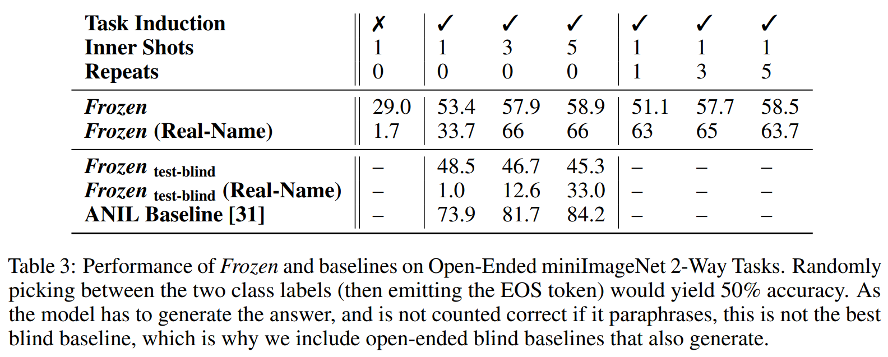

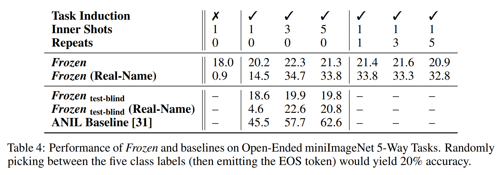

* **Two-way Open-Ended miniImageNet**: Frozen 에게 이미지와 그에 대응하는 새로운 이름을 보여주면, 해당 객체에 대해 새로운 이름을 학습하고 이를 즉시 상당히 높은 정확도로 사용할 수 있다. 특히, 같은 category 의 더 많은 예시(inner-shots)를 제공할수록 성능 향상이 뚜렷하게 나타나며, 동일 예시 반복(repeats)보다 효과가 크다. 즉, 더 다양하고 풍부한 시각적 지원(prompting)이 fast-binding 능력을 높인다.
* **Two-way Real-Name miniImageNet**: 유사한 경향을 보이지만, 절대 성능은 더 높다. 이는 Open-Ended setting 이 기존에 알고 있을 수 있는 category 에 전혀 새로운 단어를 매핑해야 하는 난이도를 반영하며, real name 이 captioning 학습 데이터에서 시각적 정보를 제공할 수 있기 때문이다.
* **5-way Open-Ended miniImageNet**: Open-Ended 2-way 실험에서 나타난 긍정적 효과가 5-way setting 에서는 전이되지 않았다. 이 경우 Frozen 은 random 수준을 크게 넘어서지 못했다. 즉, 한 번의 forward pass 로 5 개의 새로운 이름을 5 개의 visual category 에 바인딩하는 것은 현재 Frozen 의 한계를 넘어선다.

그러나, 5-way setting 에서도 inner-shot 또는 repeat 수가 증가하면, 주어진 5 category 중 실제 category 이름을 반환할 확률이 상승하는 경향이 관찰된다. 이는 보다 어려운 setting 에 대한 후속 연구의 필요성을 보여준다.

#### Fast-VQA 와 Real-Fast-VQA

Transformer 는 text 를 모델링하도록 학습되며, attention weight 를 통해 문장 전반에서 단어 쌍을 연관(‘binding’)시키는 방법을 학습한다. miniImageNet 실험은 이러한 능력이 visual category 와 그 이름을 직접 바인딩하는 쪽으로 전이될 수 있음을 보여주었고, 이를 통해 system 은 필요할 때 이름을 생성할 수 있다. 이로부터, Frozen 이 새로 습득한 visual category (및 그 이름)를 model 의 language system 에 더 깊이 통합하여, 해당 category 에 대해 묘사하거나 질문에 답변할 수 있는지 여부가 궁금해진다.

이 능력을 시험하기 위해, 저자는 ImageNet 과 Visual Genome 두 dataset 을 기반으로 새로운 task **Fast-VQA** 를 만들었다. 각 질문에서, model 에게 무의미 단어 (‘dax’ 와 ‘blicket’)와 해당 단어의 참조 대상이 되는 $n$ 개의 이미지(e.g., ‘cat’ 또는 ‘dog’ 이미지, ImageNet 제공)를 보여준다. 그런 다음 두 참조 대상이 모두 등장하는 추가 이미지(Visual Genome 제공)에 대해, 최소 하나의 무의미 단어를 포함하는 질문을 제시한다 (Fig. 4b 참조). miniImageNet 과 마찬가지로, ‘dax’ 와 ‘blicket’ 의 의미는 Frozen 에게 새롭지만, 해당 visual category 자체는 Conceptual Captions 학습 데이터에서 다른 이름으로 이미 알려져 있을 수 있다.

이 task 가 기존 category 에 새 이름을 부여하는 과정 때문에 얼마나 더 어려워지는지 정량화하기 위해, **Real-Fast-VQA** 라는 변형 버전도 만들었다. 여기서는 ‘dax’ 와 ‘blicket’ 대신 original category 이름(‘cat’ 또는 ‘dog’)을 사용한다. Real-Fast-VQA 는 Visual Genome 질문을 기반으로 하는 VQA 의 특수 사례이며, 질문에 답하기 전에 model 이 중요한 객체가 어떻게 생겼는지 상기시켜 준다. Real-Fast-VQA 는 새로운 단어와 category 를 바인딩하는 능력은 필요 없지만, zero-shot 상황에서 새로운 task 를 시도할 때, task-relevant 한 multimodal guidance 를 얼마나 잘 활용할 수 있는지를 측정한다.

Fast-VQA 와 Real-Fast-VQA 는 다음과 같은 이유로 매우 도전적인 task 이다.

* task-specific training 없이 수행된다.
* 질문이 Visual Genome 에서 나오는데, VQAv2 이미지에는 이 task 를 구성하는 데 필요한 메타데이터가 없다.
* Visual Genome 질문은 각 질문에 대해 단 하나의 정답만 존재한다.

모델 채점 시, 단순화를 위해 VQAv2 와 동일한 후처리를 적용한 뒤 model 의 출력이 정답과 정확히 일치하는 경우에만 정답으로 인정한다. Task 의 난이도가 높으므로, 관찰된 효과의 신뢰성을 검증하기 위해 강력한 baseline 을 사용한다. Fast-VQA 와 Real-Fast-VQA 평가 세트는 camera-ready 버전에서 제공되며, multimodal fast-binding 에 관한 후속 연구를 촉진하기 위한 자원으로서, (본 연구에서는 사용하지 않은) 학습 데이터와 함께 공개된다.

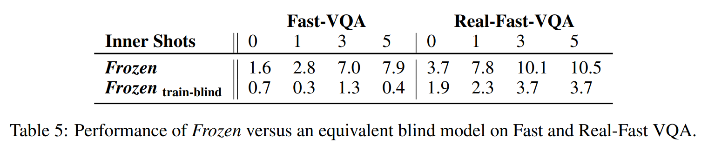

* Tab. 5 결과에 따르면, Fast-VQA 와 Real-Fast-VQA 모두에서 shot 수가 늘어날수록 성능이 향상되며, 이는 Frozen 이 새로운 단어를 multimodal 환경에서 자연어를 처리·생성하는 일반 능력에 통합할 수 있는 일부 능력을 가진다는 것을 확인시켜준다. 
* 특히, image 에 접근할 수 없는 prefix-tuned model 도 Real-Fast-VQA 에서 개념이 더 많이 주어질수록 어느 정도 성능이 향상되었는데, 이는 단순히 관련 단어와 task 의 언어적 형식을 상기시키는 것만으로도 다가오는 질문에 대비하는 데 도움이 된다는 것을 보여준다. 
* Fig. 4 예시에서처럼, model 출력 검토 결과, shot 수가 증가함에 따라 Frozen 성능이 향상되는 경우 상당수가 단순 언어적 단서가 아니라 multimodal 지원 덕분임을 확인할 수 있다.

# 5 Discussion

## 5.1 Limitations

이 연구는 open-ended 한 multimodal few-shot learning 이 가능한, 훨씬 더 강력한 system 을 향한 중요한 proof-of-concept 라고 판단된다. Frozen 은 이러한 능력을 어느 정도 달성했지만, 중요한 한계점은 특정 task 에 대해 몇 번의 shot 만으로 학습했을 때의 성능이, 해당 task 의 full training set 을 사용하는 system 과 비교했을 때 SOTA 수준에 크게 미치지 못한다는 것이다. 따라서 본 연구의 주요 기여는 multimodal few-shot learning 이라는 흥미로운 연구 분야에서의 출발점 혹은 baseline 으로 보는 것이 타당하다.

향후 개선을 통해, 본 연구에서 관찰된 인상적인 zero-shot 및 few-shot generalization 을 더 높은 정확도와 더 적은 seed 로도 재현할 수 있도록, 즉 더 강건하게 만들 수 있다. 마지막으로, 본 proof-of-concept 연구에서 탐구하지 않은 많은 기술적 질문들이 존재한다. 예를 들어, vision 과 language 를 결합하는 더 정교한 architecture 를 사용하면 성능이 향상될 수 있는지 여부 등이 있다. 이러한 가능성에 대한 탐구는 미래 연구로 남겨둔다. 저자가 camera-ready 버전에서 공개할 Open-Ended miniImageNet, Real-Name miniImageNet, Fast-VQA, Real-Fast-VQA benchmark 는 향후 이러한 system 의 평가와 분석을 용이하게 할 것이다.

## 5.2 Conclusion

저자는 prefix tuning 의 soft-prompting 철학을 image 와 text 의 순서 있는 집합으로 확장하여, language model 의 text prompting 능력을 유지한 채 이를 multimodal few-shot learning system 으로 변환하는 방법을 제시했다. 실험 결과, 이렇게 얻어진 Frozen 은 captioning 만을 학습했음에도 불구하고, 이미지를 open-ended 하게 해석하고 진정한 multimodal few-shot learning 을 수행할 수 있음을 확인했다.

이 결과의 한 가지 귀결은, language 내에서 서로 다른 단어를 빠르게 결합·연관시키는 데 필요한 지식이, 순서 있는 입력 집합 전반에서 language 를 visual element 와 빠르게 바인딩하는 데에도 유효하다는 것이다. 이 발견은 transformer language model 의 지식이 비언어적 task 로 전이될 수 있다는 [Pretrained transformers as universal computation engines.] 의 결론을, few-shot learning 에 관한 지식이라는 구체적인 경우로 확장한다.
