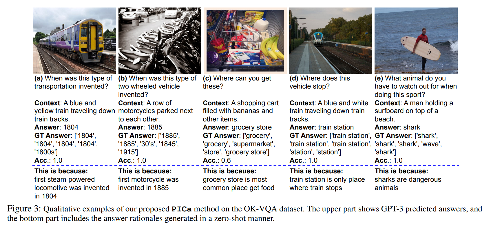

논문 및 이미주 출처 : <https://arxiv.org/pdf/2109.05014>

# Abstract

Knowledge-based visual question answering (VQA) 는 이미지에 존재하지 않는 external knowledge 가 필요한 질문에 답변하는 것을 포함한다. 기존 방법들은 먼저 외부 리소스에서 knowledge 를 검색한 후, 선택된 knowledge 와 input image, question 을 함께 reasoning 하여 answer 를 예측한다. 그러나 이러한 two-step approach 는 VQA 성능을 제한할 수 있는 mismatch 로 이어질 수 있다. 예를 들어, retrieved knowledge 가 question 과 무관하거나 noisy 할 수 있으며, reasoning 과정에서 re-embedding 된 knowledge feature 가 knowledge base (KB) 에서의 원래 의미와 달라질 수 있다.

이 문제를 해결하기 위해, 저자는 knowledge-based VQA 를 위해 Image Caption 을 활용해 GPT-3 를 prompting 하는 간단하면서도 효과적인 방법인 **PICa** 를 제안한다. 

* GPT-3 의 knowledge retrieval 및 question answering 능력에서 영감을 받아, 이전 연구에서 사용한 structured KB 대신 GPT-3 를 관련 knowledge 를 획득하고 처리할 수 있는 implicit 하고 unstructured 한 KB 로 간주한다. 
* 구체적으로, 먼저 이미지를 GPT-3 가 이해할 수 있는 caption (또는 tag) 으로 변환한 후, in-context VQA 예시 몇 개만 제공하여 GPT-3 를 few-shot 방식으로 VQA task 에 적응시킨다.

또한, 저자는 성능을 향상시키기 위해 다음 두 가지를 면밀히 조사하였다.
1. image content 를 가장 잘 설명하는 text format 은 무엇인지
2. in-context example 을 더 효과적으로 선택하고 사용하는 방법은 무엇인지

PICa 는 GPT-3 를 multimodal task 에 최초로 사용하도록 한다. 단 16 examples 만 사용하여, PICa 는 OK-VQA dataset 에서 supervised SOTA 대비 절대 +8.6 points 를 초과하는 성능을 달성한다. 또한 VQAv2 dataset 에서도 PICa 는 우수한 few-shot 성능을 보인다.

# Introduction

Knowledge-based visual question answering (VQA) 는 이미지 내용 external knowledge 가 필요한 질문을 제시함으로써 standard VQA task 를 확장한 것이다. 이러한 knowledge 를 획득하기 위해 기존 방법들은 Wikipedia article, ConceptNet concept 등의 다양한 리소스에서 external knowledge 를 먼저 검색한다. 이를 기반으로, retrieved knowledge 와 image-question pair 를 결합하여 reasoning 을 수행하고 answer 를 예측한다(Fig. 1(a)).

그러나 이러한 two-step approach 는 최적이 아닐 수 있다. 

* 예를 들어, 첫 번째 단계에서 knowledge retrieval 에 사용된 image-question feature 가 두 번째 reasoning 단계에서의 representation 과 일치하지 않아 noisy 하거나 무관한 knowledge 가 검색될 수 있다. 
* 또한, retrieved knowledge 의 re-embedded textual feature 가 원래 knowledge source 에서의 의미와 달라질 수 있다. 

이러한 mismatch 는 VQA 성능을 제한할 가능성이 있다. 게다가, 효과적인 joint knowledge-image-question representation 을 학습하기 위해서는 충분한 training data 가 필요하므로 새로운 유형의 질문으로의 전이는 어렵다.

이 연구에서는 최근 language model 의 흥미로운 특성에서 영감을 얻어 대안을 탐구한다. 특히, GPT-3 와 같은 large-scale language model 은 knowledge retrieval 과 question answering 과 같은 NLP task 에서 강력한 능력을 보여주었으며, few in-context example 만으로도 new task 에 빠르게 적응할 수 있는 strong few-shot learner 이다.

이에 영감을 받아, 저자는 GPT-3 의 도움으로 위의 knowledge retrieval 과 reasoning 단계를 통합하는 간단하면서도 효과적인 방법인 **PICa** 를 제안한다. 

* 이전 연구처럼 *explicit* 하고 *structured* knowledge bases (KBs) 대신, PICa 는 prompt engineering 을 통해 GPT-3 를 *implicit* 하고 *unstructured* KB 로 취급한다. 
* 구체적으로, 이미지를 GPT-3 가 이해할 수 있는 textual description (i.e., caption 또는 tag) 으로 변환한 뒤, question 과 textual description 을 기반으로 GPT-3 에 질의하여 직접 answer 를 예측한다.

PICa 는 supervised fine-tuning 없이, GPT-3 의 few-shot learning 능력을 그대로 계승하며 inference 시에 few in-context example 만으로 VQA task 에 적응한다. 실험적으로, GPT-3 는 관련 knowledge 를 암묵적으로 검색하고, question 과 context 를 효과적으로 reasoning 하여 answer prediction 을 수행할 수 있음을 보인다. 성능 향상을 위해 저자는 (i) image context 를 textual description 으로 효과적으로 표현하는 방법, (ii) in-context example 의 선택과 multi-query ensemble 을 통해 GPT-3 의 성능을 극대화하는 방법을 면밀히 조사하였다.

OK-VQA dataset 에서 pre-trained captioning model 인 VinVL 을 사용한 PICa 는 few-shot 방식에서 46.9% 의 accuracy 를 달성하며, supervised SOTA 대비 절대 7.5 points 향상된 성능을 보였다. 예측된 image tag 를 추가하면 성능은 48.0 으로 더 향상된다. 또한, PICa 의 효과성을 이해하기 위해 상세한 ablation study 와 qualitative analysis 를 제공한다.

저자의 주요 기여는 다음과 같다.

1. GPT-3 를 knowledge-based VQA 에 활용하는 간단하면서도 효과적인 방법 PICa 를 제안하며, GPT-3 를 multimodal task 에 최초로 적용하였다.
2. PICa 는 image 를 textual description 으로 표현하고, in-context example selection 및 multi-query ensemble 을 통해 GPT-3 의 성능을 향상시켰다.
3. PICa 는 few-shot 방식으로 OK-VQA 에서 48.0% accuracy 를 달성하며, 기존 SOTA 인 39.4% 를 크게 초과하였고, VQAv2 에서도 우수한 few-shot 성능을 보였다.

# Related Work

#### Knowledge-based VQA.

Knowledge-based VQA 는 질문에 답하기 위해 이미지 내용뿐 아니라 external knowledge 가 필요하다. 초기 연구로는 KB-VQA 와 F-VQA 가 있으며, 최근의 OK-VQA dataset 은 COCO image 에 기반하며, input question 은 광범위한 knowledge category 를 포함한다. 기존 연구들은 knowledge 를 검색하고 사용하는 다양한 방법을 제안하였으며, question 의 관련 knowledge 를 포괄하기 위해 Wikipedia, ConceptNet, Google image, 그리고 language model 의 implicit knowledge 등 여러 knowledge resource 를 활용해야 한다고 보았다.

external knowledge retrieval 이후, 연구들은 획득한 knowledge 와 image-question pair 를 결합하여 reasoning 을 수행해 answer prediction 을 하는 데 집중했으며, 이때 graph convolution network 가 multimodal fusion 에 효과적인 방법임이 제시되었다. 최근 KRISP 는 structured KB 에 추가적인 knowledge resource 로서 pre-trained language model 에 저장된 implicit knowledge 를 검색하는 방법을 제안하였다. MAVEx 는 noisy 한 검색 knowledge 를 더 잘 활용하기 위한 answer validation 접근법을 제시하였다. 그러나 이러한 two-step approach 는 retrieval 단계에서 가장 관련성 높은 knowledge 를 얻지 못하거나, reasoning 단계에서 QA 에 적합하게 knowledge 를 encoding 하지 못할 수 있다. 본 연구에서는 두 단계를 결합하여, GPT-3 를 prompting 함으로써 VQA 를 위해 knowledge 를 공동으로 획득하고 처리하는 model 을 제시한다.

#### Multimodal few-shot learning.

GPT-3 는 놀라운 in-context few-shot learning 능력을 보여주었다. 최근 Frozen 은 pre-trained language model 을 재사용하여 vision-and-language task 로 이러한 few-shot 능력을 확장하는 방법을 제안하였다. Frozen 은 대규모 text corpus 로 pre-train 된 GPT 계열 language model (약 7B parameter) 로 시작한다. 이후 language model 을 freeze 하고, input image 를 language model 이 이해할 수 있는 visual feature 로 projection 하는 visual encoder 를 학습한다. visual encoder 는 image captioning task 로 학습되며, gradient 는 frozen language model 로부터 back-propagation 된다. Frozen 은 최초의 multimodal few-shot learner 로서, VQA 와 같은 task 에서 random guess 보다 훨씬 나은 성능을 보인다. 그러나 성능은 SOTA 와 비교해 여전히 만족스럽지 않으며, 예를 들어 OK-VQA dataset 에서 accuracy 가 12.6% 에 불과하다.

저자의 pre-trained language model 활용 아이디어는 Frozen 과 밀접하게 관련되어 있다. 그러나 본 연구에서는 이를 한층 발전시켜 stronger language model 을 사용하고, knowledge-based VQA task 에 초점을 맞춘다. 이를 통해 supervised SOTA 를 초월하는 최초의 few-shot 접근법을 제시한다.

# Approach

## GPT-3 for In-context Learning

GPT-3 는 강력한 in-context few-shot learning 능력을 보여주었다. pre-trained model 을 downstream task 에 맞게 fine-tuning 하는 대신, in-context few-shot learner 는 inference 시 few example 만으로 new task 에 빠르게 적응하며 parameter update 가 필요하지 않다. 구체적으로, inference 동안 new task 의 target $y$ 는 주어진 context $C$ 와 new task 의 input $x$ 를 조건으로 한 text sequence generation task 로 직접 예측된다. 모든 $\mathcal{C}$, $x$, $y$ 는 text sequence 이며, 예를 들어 $y = (y_1, \dots, y_T)$ 일 때, 각 decoding step $t$ 에서

$$
y_t = \arg\max_{y_t} p_{\text{LM}}(y_t | \mathcal{C}, x, y_{<t})
$$

* 여기서 LM 은 pre-trained language model 의 weight 를 나타내며, new task 에 대해서는 frozen 된다. 
* context $\mathcal{C} = \{ h, x_1, y_1, \dots, x_n, y_n \}$ 는 optional prompt head $h$ 와 $n$ 개의 in-context example ($\{x_i, y_i\}_{i=1}^n$) 으로 구성된다. 
* GPT-3 의 strong few-shot 능력과 다양한 knowledge 를 활용하여, 저자는 GPT-3 를 이용한 few-shot knowledge-based VQA 방법을 제안한다.

## GPT-3 for VQA

GPT-3 를 VQA 에 사용하는 데 있어 한 가지 도전 과제는 GPT-3 가 이미지 입력을 본질적으로 이해하지 못한다는 점이다. 실험적으로, 이미지 context 를 textual description 으로 변환하는 것이 VQA 에서 강력한 baseline 이 됨을 보인다.

PICa 는 inference 시 GPT-3 에 구성된 input prompt 를 제공하여 VQA task 를 수행한다. prompt 는 context $C$ (prompt head $h$ 와 $n$ 개의 in-context example 포함) 와 VQA input $x$ 로 구성된 word sequence 이다. 먼저, 최신 captioning (또는 tagging) model 을 사용해 VQA image 를 caption (또는 tag list) 으로 변환한다.

예를 들어, VQA input $x$ 는 변환된 image context string (“`Context: People are standing in a parking lot with some umbrellas as it snows.`”) 과 question string (“`Q: What is the warmest temperature at which this weather can happen? A:`”) 을 연결한 것이다. target $y$ 는 open-ended text generation 방식으로 생성된 answer (“`32 degrees`”) 이다. answer 는 GPT-3 의 전체 vocabulary 에서 임의 길이의 word 를 포함할 수 있다.

context $\mathcal{C}$ 는 모든 sample 에 대해 고정된 string (“`Please answer the question according to the above context.`”) 인 prompt head $h$ 로 시작한다. 나머지 $\mathcal{C}$ 는 $n$ 개의 in-context example string $(x_i, y_i)$ 의 연결로 구성된다. 이렇게 구성된 $\mathcal{C}$ 와 $x$ 를 연결해 prompt 를 만들고, GPT-3 는 이를 입력으로 받아 language model 내에서 암묵적으로 knowledge 를 retrieval 및 reasoning 하여 answer $y$ 를 예측한다.

## In-context Examples

일반적으로 in-context example 수가 많을수록 few-shot 성능이 향상된다. 그러나 new task 에서 사용 가능한 example 수와 model 의 최대 입력 길이 제한이 $n$ 의 최대값을 결정한다. 실제로는, model 의 최대 입력 길이가 $n$ 을 제한하는 경우가 많다(예: $n=16$). 이를 더 잘 활용하기 위해 저자는 다음 두 가지 방법을 탐구하였다.

#### In-context example selection

In-context example selection 은 각 inference-time input $x$ 에 대해 가능한 모든 example 중에서 optimal example 을 선택한다. 특정 $x_i$ 가 좋은 example 이려면, 해당 question feature 가 $x$ 와 유사해야 한다. 이를 위해 CLIP model (ViT-B/16 variant) 의 text encoder 로 inference-time question 의 textual feature 를 추출하고, 모든 in-context example question 과의 cosine similarity 를 계산한다. 

question text similarity 와 image visual similarity 의 평균을 사용하여 example selection 을 진행하고, highest similarities $n$ 개 question 의 example 을 선택한다.

#### Multi-query ensemble

Multi-query ensemble 은 더 많은 example 을 활용하기 위한 대안이다. inference-time example $x$ 에 대해 $n \times k$ 개의 in-context example 을 사용해 $k$ 개의 prompt 를 만든다. GPT-3 에 $k$ 번 질의하여 $k$ 개의 answer prediction 을 얻고, 각 prediction 의 log-probability sum $\sum_t \log p_{\text{LM}}(y_t)$ 이 가장 높은 answer 를 최종 결과로 선택한다. 

이 방법은 in-context example selection 과 결합할 수 있으며, 상위 $n \times k$ example 을 선택한 뒤 이를 $k$ prompts 에 분배하여 두 접근법의 장점을 모두 활용한다.

# Experiments on OK-VQA

## Dataset and Setup

#### Dataset.

* OK-VQA 는 현재 가장 큰 knowledge-based VQA dataset 으로, 14,055 image-question pairs 로 구성된다. 
* question 은 external knowledge 가 필요하도록 수작업으로 필터링되며, 각 question 은 5 ground-truth answers 를 가진다. 
* 평가는 VQAv2 의 soft accuracy 를 사용한다.

#### Setup.

저자는 두 가지 방법 변형을 비교하였다.

* **PICa-Base**: Fig. 2 에 제시된 prompt 를 사용한다. image 는 VinVL 로 생성한 caption 으로 표현하거나, Microsoft Azure tagging API 로 예측한 tag 를 caption 에 추가하여 표현한다. in-context example 은 무작위로 선택된다.
* **PICa-Full**: in-context example selection 과 multi-query ensemble 을 모두 포함한 전체 model.

## Comparison with State-of-the-art

Tab. 1 은 OK-VQA dataset 의 결과를 요약한다. 표 상단은 전체 OK-VQA training set 에 대해 supervised 학습된 model 들이고, 하단은 few-shot 결과이다. 

* “Image Repr.” 은 VQA 에서 image 를 표현하는 방식을 나타낸다. 
* “Feature Emb.” 는 학습 가능한 network 로 image 를 feature vector 로 encoding 하는 기존 방식을 의미한다. 
* GPT-3 의 end-to-end fine-tuning 은 비용이 높으므로, 저자는 image 를 GPT-3 가 이해할 수 있는 text sequence 로 변환한다. 
* “Caption” 은 COCO-train14 split 에서 fine-tuning 된 VinVL-base model 이 생성한 caption 을 의미하며, 
* “Tags” 는 tagging API 가 예측한 tag 를 의미한다. 
* “Knowledge Resource” 는 사용된 external knowledge resource 를 포함한다. 
* 대부분의 기존 방법은 Wikipedia, ConceptNet 등 external knowledge resource 에서 명시적으로 knowledge 를 검색한다. 반면 few-shot 방법은 pre-trained language model 을 직접 사용하여 knowledge 를 획득 및 처리한다.

다음은 observation 을 요악한 것.

* **Fine-tuning 없이 SOTA 초과**: PICa-Full 은 16 in-context VQA examples 만으로 accuracy 48.0% 를 달성하며, OK-VQA 전체 training set 으로 학습한 supervised SOTA (39.4%) 를 초과한다. 이는 external knowledge 를 명시적으로 검색하는 대신 GPT-3 의 implicit knowledge retrieval 과 reasoning 능력의 강점을 보여준다.
* **Example selection 효과**: 무작위 example 을 사용하는 PICa-Base 대비, PICa-Full 은 in-context example 을 더 효과적으로 활용해 성능을 향상시켰다. Caption 만 사용 시 42.0% → 46.9%, Caption+Tag 사용 시 43.3% → 48.0% 로 개선되었다. 세부 ablation study 는 Tab. 5 에 제시된다.

## Few-shot Ability

Tab. 1 하단을 집중적으로 분석하기 위해, 저자는 OK-VQA dataset 에서 few-shot 성능을 Tab. 2 에 제시하였다. 표 상단은 example pool 에서 무작위로 in-context example 을 선택하는 strict few-shot setting 결과이고, 하단은 in-context example selection 과 multi-query ensemble 을 적용한 결과이다.

* $n$ 은 in-context example 개수(shot 수)이며, 
* $n=16$ 은 GPT-3 의 max input length 2049 에서 수용 가능한 최대 example 수이다. 
* prompt 가 최대 길이를 초과할 경우, 더 짧은 example 로 재선택하지만, $n=16$ 에서는 거의 발생하지 않는다.

다음은 observation

* shot 수가 증가할수록 성능이 향상된다. e.g., $n=1$ 일 때 40.8% → $n=16$ 일 때 48.0% (row e). 
  * 이는 가능한 한 많은 example 을 사용하는 것이 유리하다는 저자의 동기를 뒷받침한다.
* PICa-Full 은 모든 경우에서 PICa-Base 대비 일관적으로 약 5% 의 accuracy 향상을 보였다.

## Textual Representation for Images

저자는 GPT-3 를 위해 이미지를 textual format 으로 표현하는 최적의 방법에 대한 ablation study 를 수행하였다. 구체적으로, 다음 방법들을 비교하였다.

* **Blind**: 이미지를 빈 문자열로 표현하는 baseline 으로, 이미지를 보지 않았을 때의 VQA 성능을 나타낸다. in-context example selection 은 question similarity 만을 사용하여 blind setting 을 유지한다.
* **Tags**: 자동 tagging model 이 예측한 tag list 로 이미지를 표현하며, 모든 tag 는 콤마로 구분된 문자열로 연결된다.
* **VinVL-Caption-COCO**: Tab. 1, 2 의 결과에 사용된 caption 으로, VinVL-base pre-trained checkpoint 를 COCO 2014 training set 에 fine-tuning 하여 OK-VQA test set 이미지(COCO 2014 validation set 이미지)에 대한 caption 을 생성한다.
* **VinVL-Caption-CC**: 동일 COCO dataset 이미지 노출을 피하기 위해 Conceptual Captions dataset 으로 VinVL-base captioning model 을 학습한 경우.
* **API-Caption**: 공개 Azure API 가 생성한 caption (Footnote 2 참조).
* **GT-Caption**: ground-truth COCO caption 을 oracle 로 사용하여 이상적인 image description 을 제공한다. 1 개의 무작위 ground truth 또는 모든 5 개 caption 을 연결하여 image description 으로 사용한다.
* **Caption+Tags**: caption 문자열과 tag list 문자열을 연결하여 image 를 표현한다.

Tab. 3 은 서로 다른 textual representation 형식에서의 OK-VQA accuracy 를 보여준다. 주요 발견 사항은 다음과 같다.

* (b)\~(j) 행의 모든 textual description format 은 row (a)의 blind baseline 대비 유의미하게 높은 성능을 보이며, 이는 단순 question-answer pair 만 입력으로 사용할 때보다 이미지 표현력이 뛰어남을 나타낸다.
* COCO 이미지를 전혀 보지 않은 VinVL-Caption-CC (row c) 는 $n=16$ 에서 37.0% 의 준수한 accuracy 를 보였다. in-context example selection 과 multi-query ensemble 을 포함하면 성능이 44.0% 로 향상되며, 이는 supervised SOTA 를 초과한다.
* 예측된 caption 간 비교에서 VinVL-Caption-COCO (row e) 가 가장 높은 성능을 달성하였다. 전반적으로, 세밀하고 충분한 description 이 더 나은 VQA 성능으로 이어진다.
* Ground-truth COCO caption (row f) 은 더 정확한 이미지 설명을 제공하여 oracle accuracy 48.7% 를 달성하였다. 모든 ground-truth caption 을 연결(row g) 하면 이미지 내용에 대한 설명이 더욱 완전해져 accuracy 가 53.3% 로 향상된다.
* 여러 caption 을 연결하는 접근의 효과에 영감을 받아, 서로 다른 textual description 형식을 결합하는 실험을 수행하였다. caption 과 tag 를 결합하면 상호 보완적인 정보를 제공하여 VQA 성능이 향상되었다. 
  * 예를 들어, row (j) 에서 VinVL caption 과 tag 를 결합하면 16-shot accuracy 가 48.0% 로, row (b) 와 (e) 의 44.6% 및 46.9% 대비 성능이 상승하였다. 다른 조합(row h, i) 에서도 유사한 향상이 관찰되었다.

## Example Selection and Multi-query Ensemble

#### In-context example selection

결과는 Tab. 4 에 요약되어 있다.

* **Row (a)**: example 을 무작위로 선택한 PICa-Base 성능.
* **Row (b)**: question textual feature 의 similarity 기반으로 example 선택.
* **Row (c)**: 가장 dissimilar 한 example 을 선택한 경우로, “bad” example 이 실제로 성능을 악화시킴을 보여준다.
* **Row (d)**: example selection 시 answer similarity 까지 포함한 oracle 값으로, upper bound 역할을 하며 적절한 example selection 이 VQA accuracy 를 크게 향상시킬 수 있음을 보여준다.
* **Row (e,f)**: example selection 에 image visual feature 를 포함한 경우. row (e) 는 CLIP 으로 계산한 image feature similarity 기반 selection, row (f) 는 PICa-Full 의 방법으로 question 과 image similarity 를 모두 고려.

주요 observation 은 다음과 같다.

* row (a) → row (b) 의 향상은 in-context example selection 이 few-shot VQA 에 실질적으로 도움이 됨을 보여준다.
* dissimilar example 을 사용한 row (c) 는 accuracy 가 40.1% 로 떨어져, question similarity 기반 selection 의 중요성을 나타낸다.
* “이상적인” example 을 선택한 row (d) 의 oracle accuracy 는 49.1% 에 도달하였다.
* CLIP text encoder 로 feature 를 계산한 경우, RoBERTa 기반보다 약간 더 나은 성능을 보였다.
* image similarity 만 사용한 selection(row e) 도 random baseline 을 개선하지만, question similarity 기반(row b)보다 향상 폭은 작았다.
* PICa-Full(row f) 은 question similarity 와 image similarity 를 결합하여 accuracy 를 46.5% 로 향상시켰다.

#### Multi-query ensemble

Multi-query ensemble 은 inference 시 더 많은 in-context example 을 사용할 수 있도록 하여 성능을 추가적으로 향상시킬 수 있다. 이 방법은 in-context example selection 과 자연스럽게 결합될 수 있다.

Tab. 5 에 두 방법을 함께 사용한 결과를 제시하였다.

* **Row (a,b)**: multi-query ensemble 을 사용하지 않은 baseline 결과.
* **Row (c,d)**: prompt 수 $k$ 를 늘리면, shot 수 $n$ 전반에 걸쳐 OK-VQA accuracy 가 일관적으로 향상됨을 보여준다.

## Qualitative Analysis

#### Representative cases

Fig. 3 상단은 PICa 예측의 정성적 예시를 보여준다. PICa 는 다양한 종류의 external knowledge 가 필요한 질문에 대해 잘 동작한다.

* 예: Fig. 3(a) 에서 GPT-3 는 question 의 “`this type of transportation`” 이 image 의 “`train`” 을 가리킨다는 것을 이해하고, “`train was invented in 1804`” 라는 정답을 제공한다.
* Fig. 3(b) 에서도 model 은 “`motorcycle was invented in 1885`” 라는 사실을 알고 있다.
* 사실(encyclopedia) 기반 knowledge 뿐 아니라, Fig. 3(c) 와 같이 commonsense knowledge 가 필요한 질문에도 잘 동작한다. 여기서 model 은 사람이 grocery store 에서 banana 를 얻을 수 있다는 것을 이해한다. 이 예시에서 ground-truth answer 간 불일치는 open-ended answer generation 이 정답의 다양한 형식을 생성할 수 있음을 보여주며, 평가를 어렵게 만든다.
* Fig. 3(d,e) 에서도 model 은 “`train stops at the train station`” 과 “`there could be sharks in the sea when surfacing`” 과 같은 implicit knowledge 를 활용해 올바른 답을 도출한다.

#### Answer rationale

GPT-3 가 fine-tuning 없이 open-ended 방식으로 knowledge-based question 에 올바르게 답변할 수 있는 이유에 대해 궁금할 수 있다. GPT-3 raw model 에 접근할 수 없으므로 language model 의 동작을 심층 분석하기는 어렵다. 대신, 저자는 zero-shot 방식의 answer rationale prediction 을 수행하여, open-ended text generation task 로 rationale 을 생성하였다.

구체적으로, question string $x$, predicted answer $y$, 그리고 prompt head “This is because” 를 연결하여 prompt 를 구성한 뒤, GPT-3 가 생성한 text 를 answer rationale 로 사용한다.

Fig. 3 하단은 예측된 answer 에 대한 rationale 을 보여준다. GPT-3 는 다양한 유형의 knowledge 가 필요한 question 에 대해 합리적인 rationale 을 생성한다.

* e.g., Fig. 3(a) 에서 rationale 은 “`the first locomotive was invented in 1804`” 라는 핵심 encyclopedia knowledge 이다.
* Fig. 3(c) 에서는 “`grocery store is a common place to get food`” 라는 commonsense knowledge 를 제공한다.

# Experiments on VQAv2

knowledge-based VQA 에서의 우수한 성능에도 불구하고, 저자의 방법에는 image 가 text 로 추상화된다는 한계가 있다. caption 이나 tag 는 image 의 부분적 설명만을 제공하며, detailed visual attribute prediction 과 같이 question answering 에 필요한 중요한 시각적 세부 정보를 놓칠 수 있다. 본 절에서는 detailed image content 에 초점을 맞춘 question 이 포함된 VQAv2 dataset 에서 PICa 를 benchmark 한다.

#### Dataset and setup.

VQAv2 dataset 은 COCO image corpus 를 기반으로 question-answer pair 를 annotation 하였으며, question 은 image content 와 높은 관련성을 갖도록 설계되었다. 사람의 성능은 question 만 사용 시 40.8%, question+caption 사용 시 57.5%, question+image 사용 시 83.3% 로 보고된다. 저자는 Frozen 의 설정을 따라 validation set 에서 accuracy 를 보고한다. VQA 를 사전 선택된 answer vocabulary 기반 classification task 로 처리하는 대신, open-ended text generation 방식으로 answer 를 예측한다.

#### Results.

* Tab. 6 에 따르면, PICa-Full 은 accuracy 56.1% 를 달성하며, 기존 few-shot 성능 38.2% 를 큰 폭으로 초과한다. 
* 제안한 in-context example selection 과 multi-query ensemble 방법은 VQAv2 dataset 에서도 효과적이다(PICa-Base: 54.3%, PICa-Full: 56.1%). 
* supervised learning model Oscar 의 73.8% 와 비교하면 여전히 약 17% 낮으며, Fig. 4 에 failure case 가 제시된다. 
* 그럼에도 불구하고, 이러한 유망한 few-shot 결과는 제안 방법이 few-shot vision-language task 접근에서 강력한 baseline 임을 보여준다.

#### Limitations.

Fig. 4(a-d) 와 (e,f) 는 각각 PICa-Full 의 성공 및 실패 사례이다. VQAv2 question 의 일부는 commonsense knowledge 로 답변할 수 있으며, 이 경우 PICa 는 대체로 잘 동작한다. 예를 들어, Fig. 4(a) 의 “`the sign above doorway can be the exit sign`” 과 Fig. 4(b) 의 “`cow laying down because of being tired`” 과 같은 암묵적 knowledge 가 있다.

그러나 VQAv2 question 의 많은 부분은 object color 와 같은 detailed image content 에 관한 것이다. 성공 사례에서 PICa 는 관련 textual description 이 있는 경우 이를 사용하거나, object property 를 통해 추론한다. 예: Fig. 4(c) 의 “`a silver refrigerator`” 와 Fig. 4(d) 의 “`bedroom walls are usually white`”. 하지만 불완전한 textual description 만을 보면 많은 question 에 실패한다. 예: Fig. 4(e) 에서 정확한 색상을 예측하지 못하거나, Fig. 4(f) 에서 기린의 수를 맞히지 못한다. 이러한 질문에는 end-to-end vision encoder tuning 이 도움이 될 것으로 기대된다.

# Conclusion

저자는 GPT-3 를 활용한 few-shot knowledge-based VQA 접근법인 PICa 를 제안하였다. 명시적 structured knowledge base 를 사용해 external knowledge 를 검색·추론 하는 대신, PICa 는 GPT-3 prompting 을 통해 관련 knowledge 를 공동으로 획득·처리한다. GPT-3 의 강력한 few-shot 능력을 계승하여 OK-VQA 에서 supervised SOTA 를 큰 폭으로 초과하였다. 분석 결과, 제안 방법은 question 에 답하기 위해 관련 knowledge 를 암묵적으로 획득함을 확인하였다.
