논문 및 이미지 출처 : <https://arxiv.org/pdf/2110.08484>

# Abstract

Large pre-trained vision-language (VL) model 은 few examples 만으로 새로운 task 를 학습하고, fine-tuning 없이도 새로운 task 로 generalization 할 수 있다. 그러나 이러한 VL model 은 크기가 지나치게 크고 inference 속도가 느려 실제 응용에 배포하기 어렵다. 

이러한 한계를 해결하기 위해, 저자는 제안한 방법인 **FEWVLM** 을 사용하여 prompt-based low-resource VL task 학습을 연구한다. 

* FEWVLM 은 최근 few-shot learner 에 비해 상대적으로 작은 크기를 가진다. FEWVLM 을 위해, 저자는 sequence-to-sequence transformer model 을 prefix language modeling (PrefixLM) 과 masked language modeling (MaskedLM) 으로 pre-training 한다. 
* 또한 few-shot task 에 대해 다양한 prompt 의 효과를 분석한다. 

VQA 에 대한 실험 결과, prompt 기반 학습을 적용한 FEWVLM 은 FEWVLM 보다 31× 더 큰 Frozen 보다 18.2%p 높은 성능을 보였으며, FEWVLM 보다 246× 더 큰 PICa 와 유사한 성능을 달성하였다. 분석 결과, 

1. prompt 는 zero-shot 성능에 큰 영향을 주지만 few-shot 성능에는 미미한 영향을 준다.
2. noisy prompt 를 사용한 model 은 더 많은 training data 가 주어지면 hand-crafted prompt 와 동일한 속도로 학습한다.
3. MaskedLM 은 VQA task 에 도움을 주고 PrefixLM 은 captioning 성능을 향상시킨다.

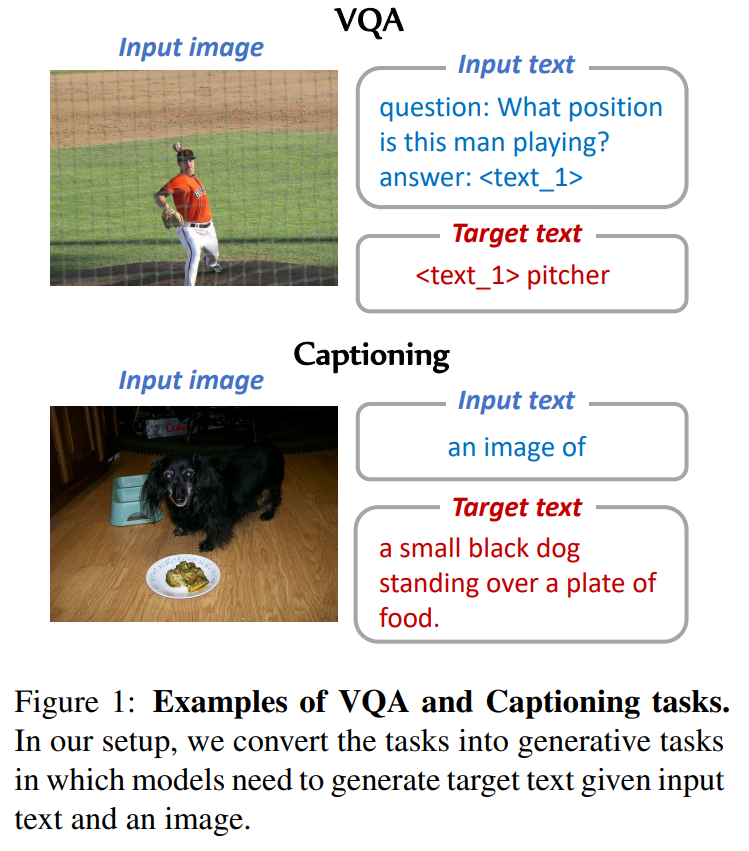

# 1 Introduction

Large pre-trained language model (PLM) 의 fine-tuning 은 vision-language task 를 포함한 다양한 domain 에서 강력한 결과를 이끌어냈다. 이러한 large PLM 은 few examples 만으로 새로운 task 를 학습하거나, 어떠한 training example 도 없이 새로운 task 로 generalization 할 수 있다. 즉, few-shot 및 zero-shot learning 이 가능하다. Few-shot learning 은 human-labeled data 수집이 비용이 크고 느리다는 data-hungry supervised learning 의 문제를 극복한다. 그러나 GPT3, Frozen, PICa 와 같은 최근의 few-shot model 은 지나치게 큰 model size 로 인해 소형 또는 중형 규모의 컴퓨팅 환경에서는 배포가 어렵다.

본 논문에서는 저자가 제안하는 moderate-sized vision-language model 인 **FEWVLM** 을 사용하여, training example 이 전혀 없거나 소수만 있는 상황에서 fine-tuning 하는 low-resource VL task 학습을 연구한다. 

* FEWVLM 을 위해, 저자는 sequence-to-sequence transformer model 을 prefix language modeling (PrefixLM) 과 masked language modeling (MaskedLM) 으로 pre-training 한다. 
* 이러한 설정은 표준 컴퓨팅 하드웨어에서 경제적으로 training 및 inference 가 가능하며, 실제 환경에서 대규모의 고품질 training example 을 확보하는 것은 비용이 크다는 점에서 더 실용적이다. 
* 이러한 few-shot setting 에서는 task-specific prompt 나 task description 이 중요하며, few-shot NLP task 에서 그 효과가 이미 입증되었다.

이러한 성공을 VL task 로 확장하기 위해, 저자는 prompt 기반 low-resource VL learning 에 대해 다음 질문에 답하고자 한다.

* Q1) prompt 설계는 새로운 task 의 zero/few-shot learning 에 어떤 영향을 미치는가?
* Q2) 더 큰 training data 가 주어졌을 때도 prompt 설계가 여전히 중요한가?
* Q3) 서로 다른 pre-training objective 가 zero/few-shot learning 에 어떤 영향을 미치는가?

이 질문에 답하기 위해, 저자는 zero/few-shot VL learning dataset 에서 hand-crafted prompt 와 noisy prompt 를 포함한 다양한 prompt format 을 탐구한다. 또한 Raffel et al. 의 연구에서 영감을 받아, prefix language modeling (PrefixLM) 과 masked language modeling (MaskedLM) 의 pre-training objective 를 few-shot task 에 적용하여 연구한다. 이를 위해, visual question answering, captioning, miniImageNet 등 다양한 few-shot VL task 에서 model 의 성능을 조사한다.

실험 분석에서, prompt 기반 학습을 적용한 FEWVLM 은 zero-shot VQAv2 에서 FEWVLM 보다 31× larger Frozen 보다 18.2%p 높은 성능을 보였으며, 246× larger PICa 와 유사한 결과를 달성하였다. 추가적으로, 

1. prompt 는 zero-shot 성능에 큰 영향을 미치지만 새로운 task 의 few-shot 성능에는 미미한 영향을 준다 (§6.2, §6.3), 
2. noisy prompt 를 사용한 model 은 더 많은 training data 가 주어졌을 때 hand-crafted prompt 와 동일한 속도로 학습한다 (§6.5), 
3. MaskedLM 은 few-shot VQA task 에 도움을 주고 PrefixLM 은 captioning 성능을 향상시킨다 (§6.6) 는 것을 관찰하였다.

# 2 Related Work

#### Vision-language few-shot learning.

최근 vision-language task 에서의 few-shot learner 들이 제안되었는데, 여기에는 GPT, Frozen, PICa, SimVLM 등이 포함된다. 

* Frozen 은 GPT-2 기반의 대규모 language model 로, soft prompting 을 확장하여 이미지와 텍스트의 집합을 통합함으로써 multimodal few-shot learner 로 변환된다. 
  * 이 접근법은 visual question answering 과 image classification task 에서 few-shot 성능을 보인다. 
* 유사하게, PICa 는 GPT-3 를 사용하여 few in-context VQA 예시를 제공함으로써 few-shot 방식으로 VQA task 를 해결한다. 
  * 이 과정에서 이미지를 textual description 으로 변환하여 GPT-3 가 이미지를 이해할 수 있도록 한다. 
* SimVLM 은 weakly-supervised dataset 에서 prefix language modeling 으로 학습되며, zero-shot captioning task 에서 효과를 입증하였다.

그러나 이러한 model 들은 few-shot task 에서 성능 향상을 이루었음에도 불구하고, model size 가 커서 실제 응용에 사용하기에는 비실용적이다.

#### Language model prompting.

Prompt 나 task description 제공은 많은 task 에서 pre-trained language model 의 성능 향상에 중요한 역할을 한다. 특히 GPT 계열 model 은 NLP task 에서 prompt 나 task demonstration 을 통해 큰 성공을 거두었다. 이러한 방향성을 바탕으로, prompt 기반 접근법은 small pre-trained model 의 few-shot text classification task 성능을 향상시킨다. 

또한 CLIP 은 image classification 에서 zero-shot 성능에 영향을 미치는 prompt template 을 탐구하였다. 

본 연구는 이러한 핵심 아이디어를 따라 vision-language task 에서 prompt 를 활용하여 zero-shot 및 few-shot 성능을 향상시키는 것을 목표로 한다.

# 3 Analysis Setup

본 연구에서는 vision-language model $\mathcal{L}$ 의 zero-shot 및 few-shot 성능을 분석한다. 이를 위해 problem formulation, analysis question, downstream task 및 dataset, evaluation metric, 그리고 baseline 을 소개한다.

## 3.1 Problem Formulation

Zero-shot task 에서는 pre-trained VL model $\mathcal{L}$ 이 training set $D_{\text{train}}$ 및 development set $D_{\text{dev}}$ 에 접근하지 못하며, test instance $D_{\text{test}}$ 에 대해 직접 inference 를 수행한다. Few-shot task 에서는 training data 로부터 dev set $D_{\text{dev}}$ 를 구성하고, Perez et al. 과 Gao et al. 의 방식에 따라 $|D_{\text{train}}| = |D_{\text{dev}}|$ 로 맞추어 hyper-parameter 조정 및 model 선택을 진행한다. 제한된 데이터로 학습하는 목표를 충족하기 위해 training set 과 development set 의 크기를 제한하며, 본 연구에서는 두 set 모두 크기를 16 으로 설정한다.

## 3.2 Analysis Questions

본 연구는 여러 VL dataset 에서의 실험을 통해 다음 세 가지 질문에 답하고자 한다.

* **Q1) Prompt 설계가 새로운 task 의 zero/few-shot learning 에 어떤 영향을 미치는가?**
  Task-specific prompt 제공은 NLP 분야에서 zero-shot 및 few-shot 성능을 크게 향상시키는 것으로 알려져 있다. 이를 위해 vision-language task 에서 다양한 ad-hoc prompt 를 실험하고, hand-crafted prompt 와 noisy prompt 가 zero-shot 및 few-shot 성능에 얼마나 영향을 미치는지 Sec. 6.5 에서 분석한다.

* **Q2) larger training data 가 주어졌을 때도 prompt 설계가 여전히 중요한가?**
  Prompt 가 zero/few-shot 성능에 영향을 주더라도, training data 의 크기에 따라 그 영향이 달라질 수 있다. 이를 검증하기 위해 training data 크기와 prompt 를 달리하여 학습한 model 의 성능을 비교한다.

* **Q3) 서로 다른 pre-training objective 가 zero/few-shot 성능에 어떤 영향을 미치는가?**
  Prefix language modeling (PrefixLM) 과 masked language modeling (MaskedLM) 두 가지 pre-training objective 를 비교한다. 이를 위해 각 objective 로 pre-training 한 model 을 zero-shot 및 few-shot task 에서 평가하며, 결과는 Sec. 6.6 에서 제시한다.

## 3.3 Downstream Tasks and Datasets

본 연구는 주로 세 가지 task 에 초점을 맞춘다: visual question answering, captioning, categorical learning.

* **Visual question answering (VQA)**: 주어진 이미지와 질문에 대해 정답을 생성하는 task 로, zero-shot 환경에서도 model 이 답변을 생성할 수 있도록 generation task 로 변환한다.
* **Captioning**: 주어진 이미지에 대한 설명을 생성하는 task.
* **Categorical learning**: 올바른 category 또는 class 를 선택하는 task 로, 다른 classification 방법과 달리 open-ended 방식으로 평가하며, 정답 label 을 직접 생성해야 한다.

Dataset 은 다음과 같다.

* **VQA**: VQAv2, OKVQA, GQA
* **Captioning**: NoCaps, Flickr30k (Karpathy split 사용: train/val/test = 29,000 / 1,014 / 1,000)
* **Categorical learning**: miniImageNet (meta learning dataset) – Tsimpoukelli et al. 의 설정을 따라 meta test data 만 사용하며, 5-way k-shot setup 으로 평가 (5 개 class 와 class 당 k 개 예시 제공).

## 3.4 Evaluation Metrics

Few-shot 성능을 평가하기 위해, training set 과 dev set 을 각각 5 가지로 무작위 샘플링하여 5 개 split 의 평균 성능을 측정한다. Few-shot 설정에서는 vision-language model 을 200 epoch 동안 fine-tuning 하며, dev set 에서 가장 좋은 checkpoint 를 선택한다. NoCaps task 의 경우, 자체 training data 가 없으므로 Wang et al. 의 방식에 따라 COCO captioning 의 training data 를 사용한다.

평가는 다음과 같이 진행한다.

* **VQAv2**: validation set
* **GQA**: test-dev
* **OK-VQA**: test set
* **Flickr30k captioning**: Karpathy split 의 test set
* **NoCaps**: validation set

평가 지표로는 VQA dataset 과 miniImageNet 에 대해 accuracy 를 사용하며, captioning 에 대해서는 CIDEr 와 SPICE 를 사용한다.

## 3.5 Baselines

비교를 위해 강력한 zero/few-shot vision-language learner 를 평가 대상으로 포함한다.

* **VQA dataset**: Frozen, PICa
* **Captioning dataset**: SimVLM
* **Few-shot VQAv2, Flickr30k**: Unified VLP 포함

또한, 각 task 에 대해 fully fine-tuned model $L_{\text{full}}$ 을 few-shot model 의 upper bound 로 비교한다. 

* Fully fine-tuned model 은 전체 dataset 으로 fine-tuning 된 반면, 
* few-shot model 은 극히 일부 데이터만 접근 가능하다. 
* $L_{\text{full}}$ 의 경우, VQAv2 는 Uniter$_\text{large}$, 
* GQA 는 Oscar, NoCaps CIDEr 는 SimVLM, SPICE 는 VinVL, Flickr30k captioning 은 Unified VLP 의 결과를 인용한다.
* 추가적으로, VQA dataset 으로 pre-training 하지 않은 baseline 인 VL-T5$_\text{no-vqa}$ 를 포함한다. 
* miniImageNet 의 경우 Frozen 과 AFHN 을 포함하며, Frozen 은 few-shot learning 용, AFHN 은 meta learning 용으로 설계되어 더 작고 빠르다.

# 4 Method

본 분석에 앞서, VL task 의 zero/few-shot learning 을 수행하고 앞서 제기한 분석 질문에 답하기 위해 제안하는 model 인 **FEWVLM** 을 소개한다. 여기서는 FEWVLM 의 architecture 와 pre-training objective 를 설명한다.

## 4.1 Encoder-decoder Vision-language Model

저자는 visual 과 text input 을 encoding 하고 target text 를 생성하기 위해 encoder-decoder architecture 를 채택한다. input image 는 Visual Genome 에서 학습된 Faster R-CNN 으로부터 추출한 36 object regions 로 표현한다. 이 region representation 집합은 text 와 함께 encoder 입력에 결합된다.

Model parameter $\theta$ 는 주어진 입력 text $x$ 와 image $v$ 에 대해 target text $y$ token 의 negative log-likelihood 를 최소화하도록 학습된다.

$$
L_{\theta} = - \sum_{i=1}^{|y|} \log P_{\theta}(y_i \mid y_{<i}, x, v) \tag{1}
$$

이 model 은 특정 task 에 종속되지 않으므로 zero/few-shot setting 에 적합하다.

## 4.2 Pre-training Objectives

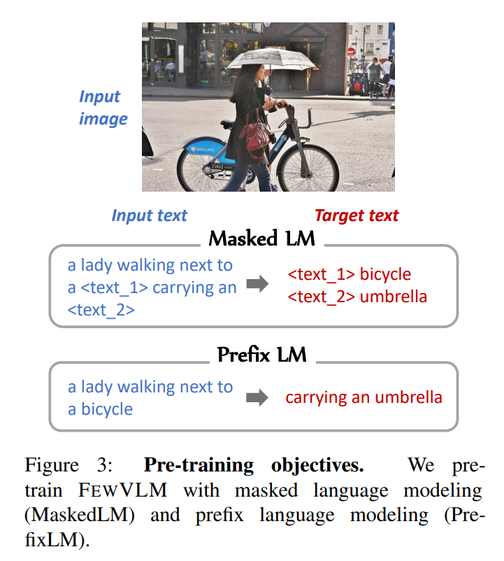

저자는 Prefix language modeling (PrefixLM) 과 Masked language modeling (MaskedLM) 두 가지 objective 로 model 을 pre-training 한다.

* **Prefix language modeling (PrefixLM)**
  Raffel et al. 의 방식을 따라, 주어진 이미지와 텍스트 span 을 임의로 두 개의 부분으로 분할한다. 전반부 텍스트와 이미지는 encoder 입력으로 사용되고, 후반부 텍스트는 decoder 가 생성해야 할 target text 로 사용된다.

* **Masked language modeling (MaskedLM)**
  Cho et al. 의 방식을 따라, 입력 텍스트에서 무작위 span 을 선택하여 sentinel token (e.g., `<text_1>`) 으로 치환한 뒤, 이를 encoder 입력으로 사용한다. Decoder 는 마스킹된 span 을 target text 로 생성한다. 입력 텍스트 token 의 15% 를 무작위로 masking 한다.

**Pre-training data**
FEWVLM pre-training 에 사용한 데이터는 MS COCO 와 Visual Genome 의 image-caption data 로, 총 9.18M image-text pair 와 180K 개의 고유 이미지를 포함한다.

# 5 Low-resource Adaptation

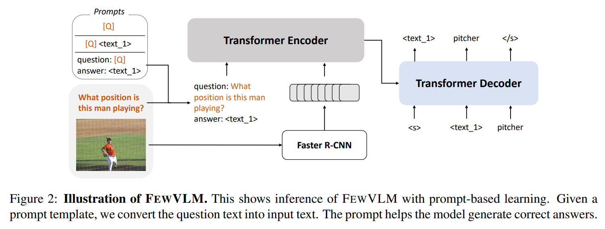

Downstream task 에서는 few examples 만을 사용하여 model 을 학습한다. Fig. 2 는 inference 시 FEWVLM 의 구조를 보여준다. Prompt template $P$ 가 주어지면, 먼저 template 을 이용해 입력 텍스트와 target 텍스트 $(x, y) = \mathcal{P}(\text{input}, \text{label})$ 을 생성한다. 이후 Eq. (1) 의 negative log-likelihood 를 최소화하여 model parameter 를 학습한다. Inference 시에는 동일한 prompt 를 사용하여 model 이 label text 를 생성하며, 최종 label 은 target prompt template 을 제거하여 얻는다.

## 5.1 Prompt Design

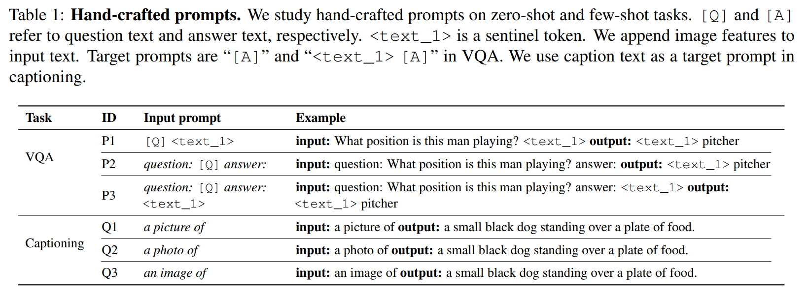

Prompt 는 vision-language model 의 성능에 영향을 미치며, 본 연구에서는 downstream task 의 zero-shot 및 few-shot 성능에 미치는 영향을 분석한다. 사용된 prompt 는 Tab. 1 과 Tab. 11 에 제시된다.

### 5.1.1 Visual Question Answering

VQA, OKVQA, GQA 와 같은 visual question answering task 는 주어진 이미지에 대한 질문에 답하는 것을 요구한다. 기존 접근법은 사전에 정의된 answer 후보 집합에 대해 multi-label classification 으로 문제를 해결하였으나, 저자는 task-specific head 를 추가하지 않고도 답변을 생성할 수 있도록 **generation task** 로 변환하였다. 이 설정에서 prompt 는 model 이 올바른 형식의 답변을 생성하도록 제약을 제공한다. Prompt 가 없을 경우, model 이 문장을 생성하여 VQA 형식에 맞지 않는 출력을 할 수 있다.

이를 위해 Tab. 1 과 Tab. 11 에 나타난 바와 같이 다양한 input/output prompt 를 실험하였다. 여기에는 hand-crafted prompt 와 ablation study 를 위한 noisy prompt 가 포함된다.

* **Hand-crafted prompt**:
  * Input prompt: "question: [Q] answer:" 또는 마지막에 `<text_1>` sentinel token 을 포함한 형태. MaskedLM 과 유사하게 sentinel token 이 단어 생성을 유도할 것으로 기대된다.
  * Target prompt: "[A]" 또는 "`<text_1>` [A]" 형식. MaskedLM 의 target text 형식을 모방하여 model 이 새로운 task 에 빠르게 적응하도록 한다. Prompt ID 는 Tab. 1 에 정의된다.
* **Noisy prompt**:
  Zero/few-shot 학습에서 noisy prompt 의 영향을 분석하기 위해, irrelevant prompt, noisy token, random sentence 를 포함하였다.
  * Irrelevant prompt: 무작위 질문이나 지시문을 사용하여 model 이 잘못된 질문에 답하거나 관련 없는 지시를 따르도록 유도.
  * Noisy token: T5 vocabulary 에서 무작위 선택된 token. Model 이 random token 에 얼마나 robust 한지 측정.
  * Random sentence: MS COCO 의 caption 을 사용하여 model 에 잘못된 정보를 제공.

### 5.1.2 Captioning

NoCaps 와 Flickr30k dataset 에서는 세 가지 hand-crafted input prompt ("a picture of", "a photo of", "an image of") 를 실험한다. 세 표현은 의미가 유사하지만, 실험 결과에서 zero-shot 및 few-shot 성능이 다르게 나타난다. Target prompt 는 별도의 추가 prompt 없이 original caption 을 그대로 사용한다.

### 5.1.3 MiniImageNet

MiniImageNet dataset 에서는 hand-crafted input prompt 로 "This is `<text_1>`" 를, target prompt 로 "`<text_1>` [A]" 를 사용한다. Prompt 사용 여부에 따른 categorical learning 성능 차이를 비교한다.

# 6 Results and Discussion

본 절에서는 zero-shot 및 few-shot task 에 대한 주요 결과를 논의한 후, 앞서 제기한 질문인 **prompt design 이 zero/few-shot learning 에서 중요한가?** 에 대해 답한다.

## 6.1 Experiment Details

Pre-training 시, FEWVLM$*\text{base}$ 는 batch size 1,280, FEWVLM$*\text{large}$ 는 batch size 800 으로 설정하고 30 epoch 동안 학습한다. Learning rate 는 $1 \times 10^{-4}$ 로 설정하며, 5% linear warmup 을 적용한다.

Few-shot learning 시, model 은 200 epoch 동안 학습하며 learning rate 는 $5 \times 10^{-5}$ 로, 5% linear warmup 을 적용한다. Dev set 에서 가장 성능이 높은 checkpoint 를 선택한다.

Prompt 설정은 다음과 같다.

* **VQA**: Input prompt — `"question: [Q] answer <text_1>"` (P3), Target prompt — "`<text_1> [A]`"
* **Captioning**: Input prompt — `"an image of"` (Q3), Target prompt — 원래 caption
* **MiniImageNet**: Input prompt — `"This is <text_1>"`, Target prompt — "`<text_1> [A]`"

VQA 및 captioning task 의 $D_{\text{train}}$ 과 $D_{\text{dev}}$ 크기는 각각 16 으로 설정하였다. MiniImageNet 의 경우, 클래스당 {1, 3, 5}-shot 환경에서 실험을 진행한다. Prompt 의 효과는 Sec. 6.5 에서 분석한다.

## 6.2 Performance on Zero-shot Learning

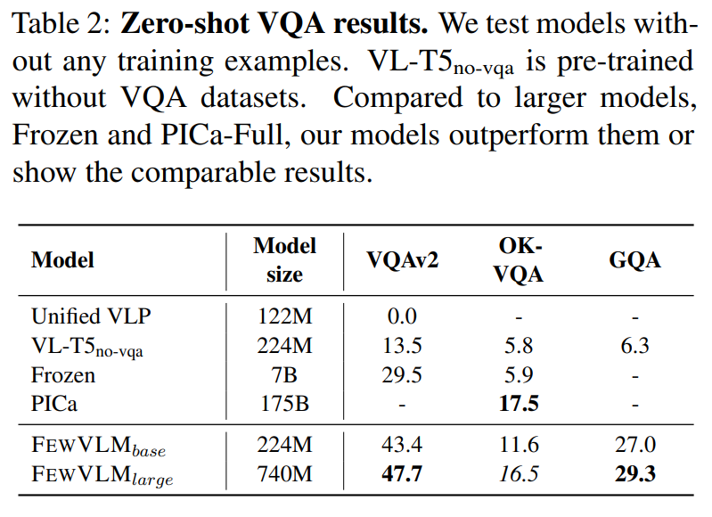

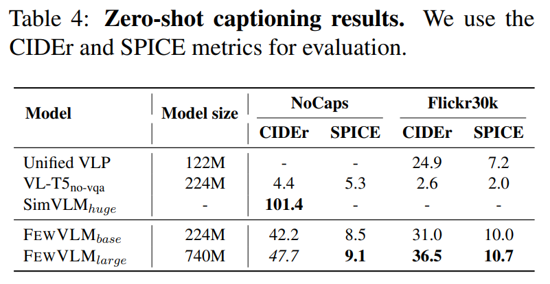

Zero-shot 환경에서는 model 이 어떤 training data 도 보지 못한 상태에서 평가를 진행한다. Tab. 2 와 Tab. 4 는 각각 VQA 와 captioning dataset 결과를 보여준다.

* FEWVLM(P3, hand-crafted prompt 사용) 은 VQA dataset 에서 다른 baseline 보다 우수한 성능을 기록하였다. 
* 특히, FEWVLM$*\text{base}$ 는 약 31× larger Frozen 을 크게 능가하였다. 
* OK-VQA 에서는 GPT-3 기반의 PICa 가 가장 높은 성능을 보였으나, FEWVLM$*\text{large}$ 는 246× 더 작은 모델임에도 PICa 와 유사한 결과를 달성하였다.

또한, 동일한 architecture 를 사용하되 VQA dataset 없이 pre-training 한 VL-T5$*\text{no-vqa}$ 와 비교했을 때, FEWVLM$*\text{base}$ 는 VQAv2 성능을 약 30%p 향상시켰다. 이는 pre-training objective 와 prompt 가 VQA 성능을 향상시킨다는 것을 시사한다.

Captioning task 인 NoCaps 에서는 SimVLM$*\text{huge}$ 가 최고 성능을 기록했으나, FEWVLM$*\text{base}$ 역시 VL-T5$_\text{no-vqa}$ 대비 성능을 크게 향상시켰다. 이 역시 pre-training objective 와 prompt 의 기여로 해석된다.

## 6.3 Performance on Few-shot Learning

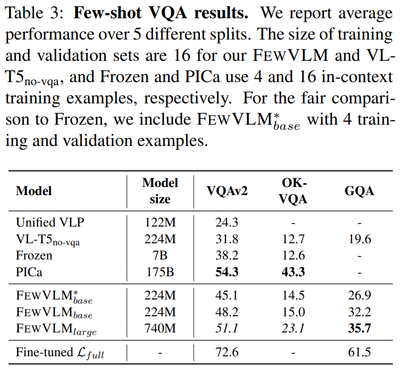

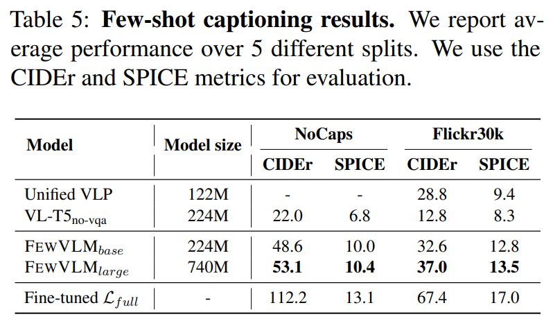

Tab. 3 과 Tab. 5 는 VQA 와 captioning dataset 에 대한 few-shot 성능을 보여준다. FEWVLM, VL-T5$_\text{no-vqa}$, Unified VLP 는 training set 과 validation set 크기를 각각 16 으로 설정하며, Frozen 과 PICa 는 각각 4 개와 16 개의 in-context demonstration example 을 사용한다.

* VQAv2 와 OK-VQA 에서 PICa 가 최고 성능을 보였으며, FEWVLM$*\text{large}$ 는 VQAv2 에서 이에 필적하는 성능을 달성하였다. 
* OK-VQA 는 다른 VQA dataset 과 달리 정답을 위해 external knowledge 가 필요하므로, larger model 과 large-scale pre-training data(prior knowledge)가 성능 향상에 중요하다. 
* 흥미롭게도, 4 training examples 만으로 학습한 FEWVLM$^\**\text{base}$ 가 Frozen 을 능가하였다.

Captioning dataset 에서 FEWVLM$*\text{base}$ 는 NoCaps CIDEr 기준 VL-T5$*\text{no-vqa}$ 대비 31.1%p 높은 성능을 기록하였다. Flickr30k captioning task 에서는 Unified VLP 가 FEWVLM 보다 약간 낮은 성능을 보였는데, 이는 Unified VLP 의 architecture 가 encoder-decoder transformer 기반이며 captioning task 로 pre-training 되었기 때문이라고 추정된다.

## 6.4 MiniImageNet

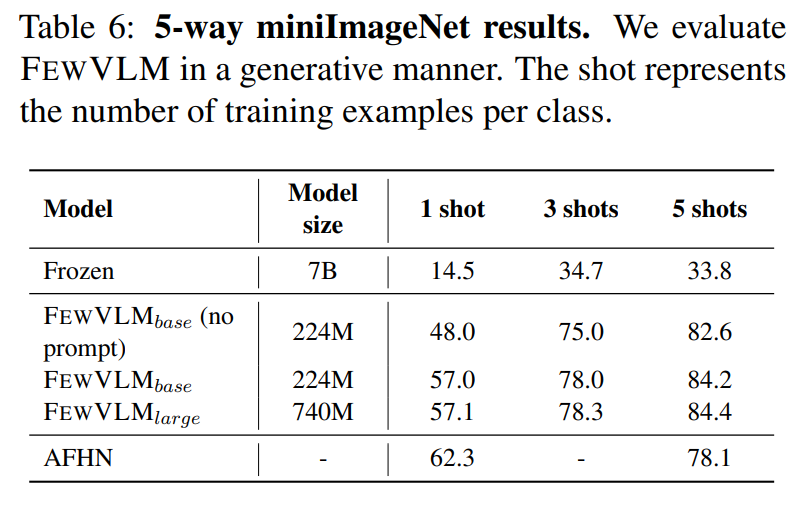

Tab. 6 은 miniImageNet 결과를 보여준다. 이 task 에서 model 은 각 이미지에 대해 올바른 class 를 선택해야 한다. 

* FEWVLM 은 generative 방식으로 학습 및 평가되며, correct label text 를 정확히 생성해야 credit 을 얻는다. 
* FEWVLM 은 all shots 환경에서 Frozen 을 크게 능가하였다. 
* FEWVLM 은 few training sample 로 학습하지만, Frozen 은 이를 in-context demonstration 으로 사용한다. 
* 흥미롭게도, hand-crafted prompt 를 사용한 FEWVLM 은 1-shot 환경에서 성능이 크게 향상되었으나, 5-shot 환경에서는 향상이 미미했다.

## 6.5 Study of Prompt Design

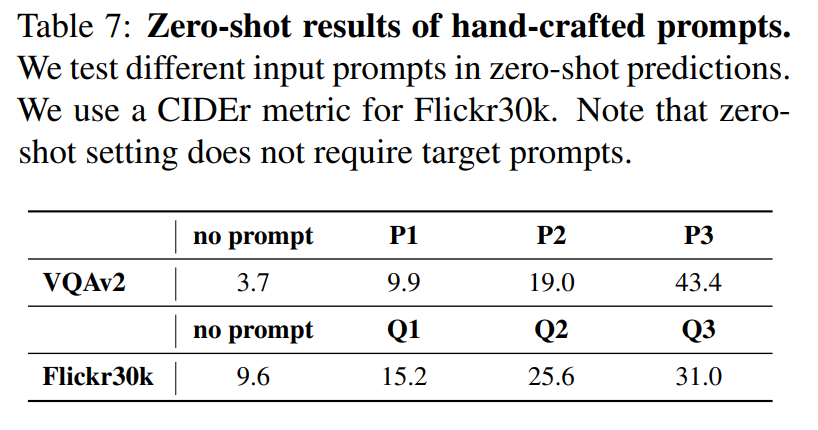

FEWVLM$_\text{base}$ 의 prompt 효과를 Tab. 7, Fig. 6, Fig. 5, Fig. 4 에서 분석하였다. 평가 dataset 은 VQAv2 와 Flickr30k 이다.

### 6.5.1 Zero-shot Predictions

* Tab. 7 에서 보듯이, 두 dataset 모두에서 zero-shot 결과는 input prompt 에 크게 영향을 받았다. 
* VQAv2 의 경우, P1 과 P3 의 `<text_1>` 은 “no prompt” 및 P2 대비 zero-shot 성능을 크게 향상시켰다. 
  * 이는 `<text_1>` 이 MaskedLM 과 유사하게 model 이 masked span 을 예측하도록 유도하기 때문으로 추정된다.

Flickr30k 에서는 prompt 의 단어 선택 차이를 분석하였다: “a picture of” (Q1), “a photo of” (Q2), “an image of” (Q3). 예를 들어, “an image of” 사용 시 no prompt 대비 21.4p 높은 성능을 보였다. 즉, 단어 선택 차이가 zero-shot 결과에 상당한 영향을 미친다.

### 6.5.2 Few-shot Predictions

VQAv2 에서 irrelevant prompt, noisy token, random sentence 를 포함한 다양한 input prompt 를 실험하였다(Fig. 4). 

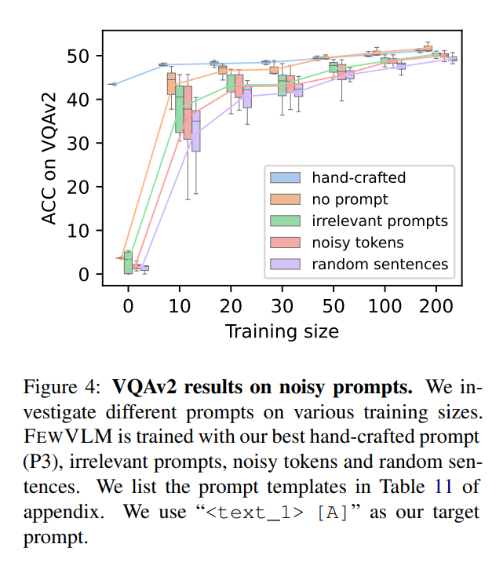

* Zero-shot 환경에서는 noisy prompt 와 no prompt 모두 거의 0 accuracy 를 기록했다. 
* 그러나 few-shot 환경에서는 noisy prompt 도 충분한 데이터가 주어지면 hand-crafted prompt 와 비슷한 속도로 학습하였다. 
  * 예를 들어, noisy prompt 사용 시 최적의 hand-crafted prompt 와 유사한 성능을 달성했다.
* Noisy prompt 중 random sentence 가 성능을 가장 많이 저하시켰는데, 이는 random sentence 가 MS COCO caption 에서 가져온 것이므로 model 이 이미지를 보지 않고 잘못된 caption 에서 정답을 선택할 수 있기 때문이다. 
* 흥미롭게도, no prompt 는 다른 noisy prompt 보다 성능이 좋았으며, 더 많은 training data 가 주어졌을 때는 hand-crafted prompt 와 유사하거나 더 나은 성능을 보였다. 

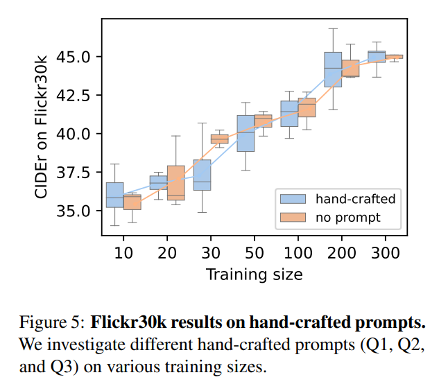

Flickr30k 에서도 유사한 현상이 관찰되었으며(Fig. 5), no prompt 가 hand-crafted prompt 와 비슷한 성능을 기록했다.

추가적으로, 저자는 두 가지 다른 target prompt 인 "`<text_1> [A]`" 와 "`[A]`" 를 실험하였다. 

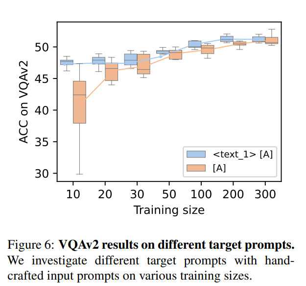

* VQA 에서 target prompt 에 "`<text_1>`" 을 추가한 것은 MaskedLM 의 target text 형식을 모방하기 위함이며, 동일한 target prompt 를 공유함으로써 model 이 새로운 task 에 빠르게 적응하도록 돕는 효과를 기대하였다. 
* Fig. 6 에 따르면, "`[A]`" 형식은 다른 경우보다 더 큰 분산을 보여주었는데, 이는 "`<text_1>`" 을 추가하는 것이 model 의 빠른 적응을 돕는다는 것을 시사한다. 
  * 그러나 training data 가 충분히 많아지는 경우(e.g., 300)에는 두 prompt 모두 유사한 결과를 보였다.

## 6.6 Pre-training Objectives

저자는 pre-training objective 가 서로 다른 task 에 어떤 영향을 미치는지 분석하였다. 이를 위해 FEWVLM 을 masked language modeling (MaskedLM) 과 prefix language modeling (PrefixLM) 각각으로 pre-training 하였다.

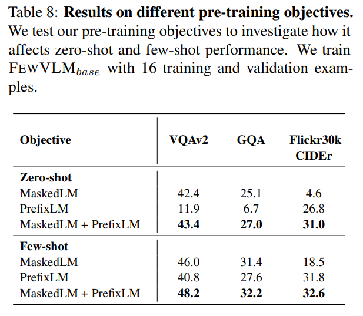

* Tab. 8 에 따르면, MaskedLM 은 zero-shot 및 few-shot 환경에서 VQA task 성능 향상에 기여하고, PrefixLM 은 captioning task 성능 향상에 기여한다. 
* 저자는 그 이유를 다음과 같이 추론한다. MaskedLM 은 span 예측을 목표로 하는데, 이는 질문에 대한 정답을 예측하는 VQA 와 유사하다. 
* 반면, PrefixLM 은 주어진 prefix 이후의 텍스트를 생성하는 방식이며, 이는 captioning task 와 유사하다. 즉, pre-training task 가 downstream task 와 유사할수록 성능 향상에 도움이 된다.

또한 두 objective 를 모두 사용하여 pre-training 할 경우, 상호 보완적 효과(synergetic effect) 가 발생하여 cross-task generalization 이 향상된다.

# 7 Conclusion

본 연구에서는 vision-language task 에서의 few-shot prompt 기반 learner 인 **FEWVLM** 을 제안하였다. 다양한 dataset 에서 FEWVLM 은 baseline 을 능가하였으며, 246× 더 큰 PICa 와 유사한 성능을 보였다. Prompt 는 zero-shot 및 few-shot task 에서 매우 중요한 역할을 하며, 각 pre-training objective 는 서로 다른 few-shot task 에 도움을 준다는 점을 확인하였다. 또한, 더 많은 training data 를 사용할 경우 noisy prompt 의 영향이 크지 않음을 발견하였다.

향후 연구로는 automatic prompt generation 과 multiple-choice VQA 와 같은 다양한 few-shot task 형식 탐구를 계획하고 있다. 최적의 prompt 를 찾는 과정은 성능 향상을 위해 상당한 엔지니어링 노력을 요구하며, 그 결과 인상적인 성능 향상을 이끌 수 있다. 이러한 방향에 대한 탐구는 향후 연구로 남긴다.
