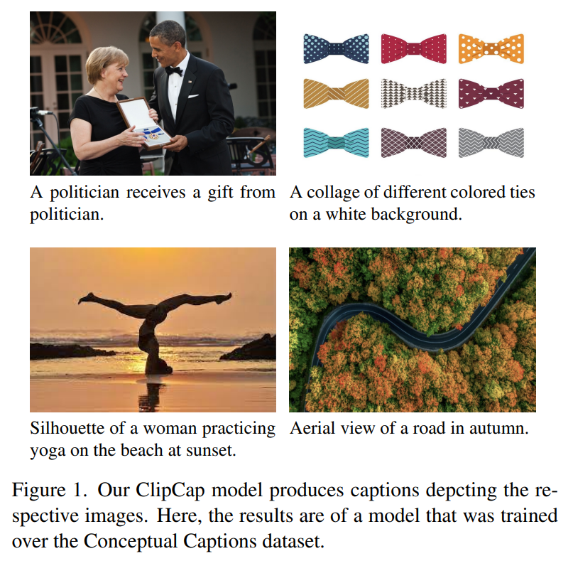
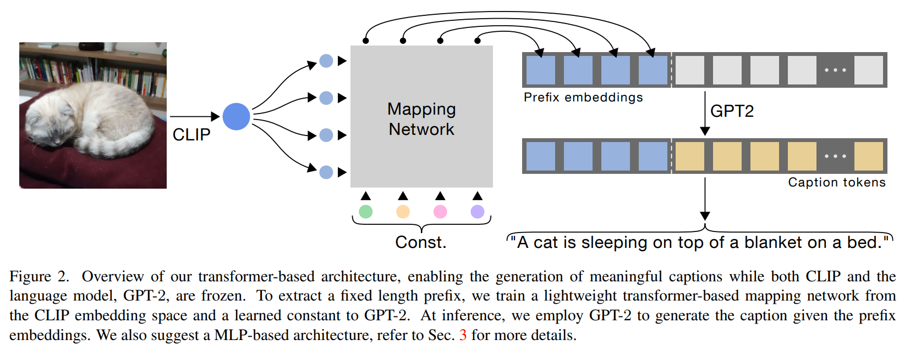
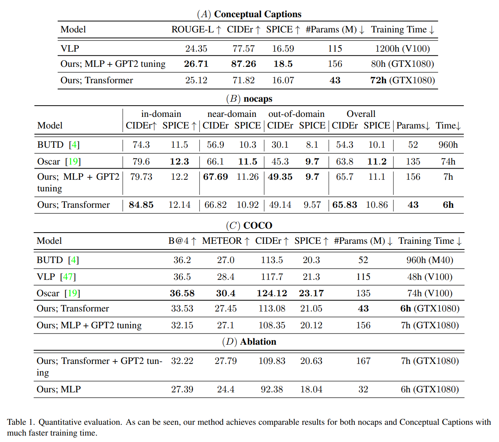
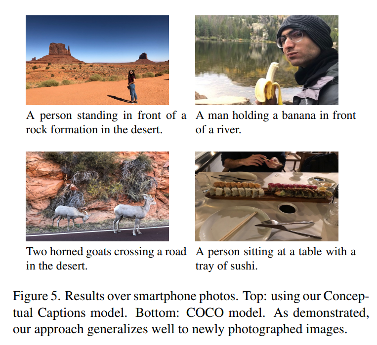

논문 및 이미지 출처 : <https://arxiv.org/pdf/2111.09734>

# Abstract

image captioning 은 vision-language understanding 의 fundamental task 로, model 이 input image 에 대해 informative caption 을 text 로 예측하는 것을 목표로 한다. 

본 논문에서는 이 task 를 해결하기 위한 simple approach 를 제시한다. 

* 저자는 CLIP encoding 을 caption 의 prefix 로 활용하며, 이를 위해 simple mapping network 를 사용하여 CLIP feature 를 prefix 로 변환하고, 이후 language model 을 fine-tune 하여 image caption 을 생성한다. 
* 최근 제안된 CLIP model 은 textual context 와 함께 training 되어 rich semantic feature 를 포함하므로 vision-language perception 에 가장 적합하다. 본 연구의 핵심 아이디어는 pretrained language model(GPT-2) 과 결합함으로써 visual 및 textual data 에 대한 폭넓은 understanding 을 얻는 것이다. 따라서 추가적인 annotation 이나 pre-training 없이도 비교적 빠른 training 만으로 competent captioning model 을 구축할 수 있다. 제안 방식은 large-scale 및 diverse dataset 에 대해서도 의미 있는 caption 을 효율적으로 생성한다. 놀랍게도, CLIP 과 language model 을 모두 frozen 시키고 mapping network 만을 학습하는 경우에도 성능이 우수하며, 이는 훨씬 적은 trainable parameter 로 가능한 lightweight architecture 를 만든다. quantitative evaluation 결과, 본 모델은 challenging 한 Conceptual Captions 및 nocaps dataset 에서 state-of-the-art method 와 유사한 성능을 보이며, 더 simple, faster, lighter 하다.

# 1 Introduction

image captioning 은 input image 에 대해 의미 있고 valid 한 natural language caption 을 생성하는 task 이다. 이 task 는 두 가지 주요 challenge 를 가진다. 첫째는 **semantic understanding** 으로, 이는 main object 를 탐지하는 단순한 문제부터 image 내 다양한 구성 요소 사이의 relation 을 이해하는 복잡한 문제까지 포함한다. 

예를 들어 Fig. 1 의 좌상단 image 에서 model 은 객체가 gift 임을 이해해야 한다. 

둘째는 **표현 다양성**으로, 하나의 image 를 묘사하는 방법은 매우 다양하며, training dataset 이 특정 표현을 선호하도록 model 을 유도한다.

기존 image captioning 연구들은 일반적으로 visual cue 를 encoding 하는 encoder 와 caption 을 생성하는 textual decoder 를 사용하는 dual-branch 구조를 채택한다. 이러한 구조는 visual representation 과 textual representation 사이의 gap 을 메워야 하므로, 많은 resource 를 요구한다. 예를 들어 long training time, 많은 trainable parameter, massive dataset, 때로는 detection 결과와 같은 추가 annotation 까지 필요하며, 이는 practical applicability 를 제한한다.

training time 이 과도하게 필요한 것은 여러 training 절차를 반복해야 하는 application 에서는 더욱 제약이 된다. 예를 들어 서로 다른 dataset 에 대해 여러 captioning model 을 training 하면, user 혹은 application 마다 동일한 image 에 대해 서로 다른 style 의 caption 을 제공할 수 있다. 또한 새로운 sample 이 등장할 때마다 model 을 주기적으로 update 할 필요도 있다. 따라서 lightweight captioning model 이 바람직하다. 특히 fast training 및 few parameter 를 가진 model 은 추가 supervision 없이도 매우 유용하다.

본 논문에서는 vision-language pretrained model 의 강점을 활용하여 captioning process 를 단순화한다. 구체적으로, **CLIP encoder** 를 활용한다. 

* CLIP 은 image 와 text prompt 간 shared representation 을 부여하도록 설계되었으며, large-scale image–text pair 에 contrastive loss 로 training 되었다. 
* 덕분에 visual representation 과 textual representation 의 correlation 이 우수하며, 이는 training time 및 data 필요량을 절약할 수 있음을 의미한다.

* 본 방법은 Fig. 2 와 같이 CLIP embedding 에 mapping network 를 적용하여 caption prefix 를 생성한다. 
* 이 prefix 는 fixed length embedding sequence 로 caption embedding 앞에 concatenation 된다. 
* language model 은 이 concatenated sequence 를 입력으로 받으며, mapping network 와 함께 fine-tune 된다. 
* inference 시 language model 은 CLIP prefix 를 시작점으로 단어를 한 단어씩 생성한다. 
* 이러한 구조는 visual–textual gap 을 줄여 simple mapping network 만으로도 captioning 이 가능하도록 한다.

더욱 lightweight 한 model 을 위해, 저자는 CLIP 과 language model 을 모두 frozen 한 채 **mapping network 만 training 하는 variant** 도 제안한다. 

* expressive transformer architecture 의 힘을 활용해, 적은 parameter 로도 meaningful caption 을 생산할 수 있다. 
* 본 접근은 learned prefix 를 language model 에 concatenation 하여 새로운 task 에 효율적으로 적응시키는 기존 연구에 영감을 받았다. 
* 사용한 language model 은 GPT-2 로, rich 하고 diverse 한 text 생성 능력이 알려져 있다.

본 접근은 rich visual-textual representation 을 가진 CLIP 의 덕분에 training time 요구량이 매우 낮다. 

* 예를 들어 저자는 massive Conceptual Captions dataset(3M sample) 을 single Nvidia GTX1080 GPU 로 80 시간만에 training 할 수 있었다. 
* 그럼에도 Fig. 1 에서 볼 수 있듯이 모델은 complex scene 에 대해서도 잘 generalize 한다. 
* 본 모델은 Conceptual Captions 와 nocaps dataset 에서 state-of-the-art 수준의 realistic 하고 meaningful caption 을 생성하며, COCO benchmark 에서도 약간만 낮은 성능을 보인다. 
* 추가적으로 prefix length, language model fine-tuning 여부, prefix representation 의 interpretability 등을 분석한다.

본 논문의 주요 기여는 다음과 같다:

* visual 및 textual processing 을 위해 pretrained frozen model 을 활용하는 lightweight captioning approach 를 제안한다.
* language model 을 fine-tune 하는 경우에도 model 은 더 simple 하고 fast 하며, challenging dataset 에 대해 state-of-the-art 와 comparable 한 성능을 달성한다.

# 2. Related Works

최근 Radford et al. 은 CLIP 이라는 새로운 접근을 제시하였다. 

CLIP 은 image 와 text description 을 joint representation 으로 학습하며, visual cue 용 encoder 와 text 용 encoder 두 개로 구성된다. CLIP 은 4억 개 이상의 image-text pair 에 대해 unsupervised contrastive loss 로 training 되어, visual data 와 textual data 모두가 공유하는 rich semantic latent space 를 생성한다. CLIP 은 auxiliary text 이해가 필요한 computer vision task, 예를 들어 자연어 조건에 기반한 image generation 또는 image editing 등에 성공적으로 활용되어 왔다. 본 논문에서는 image captioning task 를 위해 강력한 CLIP model 을 활용한다. 단, 본 접근은 input text 가 존재하지 않고 output text 는 language model 이 생성하므로 CLIP 의 textual encoder 는 사용하지 않는다.

일반적으로 image captioning model 은 입력 pixel 을 feature vector 로 encoding 하고, 이를 활용해 word sequence 를 생성한다. 초기 연구들은 pre-trained classification network 에서 추출한 feature 를 사용하였고, 이후 연구들은 object detection network 의 더 expressive 한 feature 를 활용하였다. 그러나 object detection network 는 COCO benchmark 에 대해서는 사용 가능하더라도, 다른 dataset 에는 반드시 존재한다고 보장되지 않는다. 이는 대부분의 방법이 새로운 다양한 dataset 에 적용되기 위해 추가 object detection annotation 을 필요로 함을 의미한다. visual cue 를 더 효과적으로 활용하기 위해 attention mechanism 이 자주 사용되며, 최근에는 self-attention 이나 expressive visual transformer 를 encoder 로 사용하는 model 도 등장했다. 저자의 방법은 CLIP 의 expressive embedding 을 visual representation 으로 사용한다. CLIP 은 매우 큰 규모의 image 로 training 되었기 때문에, 추가 annotation 없이도 어떤 natural image set 에든 적용 가능하다.

caption 생성을 위해 textual decoder 가 사용된다. 초기 연구들은 LSTM variant 를 사용하였고, 최근 연구들은 개선된 transformer architecture 를 채택한다. transformer 기반의 가장 대표적인 예는 BERT 로, 대규모 data collection 에 auxiliary task 로 pre-training 한 뒤, specific task 를 위해 fine-tuning 하는 paradigm 의 우수함을 보여주었다. 저자의 visual information 은 prefix 에 담기므로, powerful auto-regressive language model 인 GPT-2 를 활용한다. training loss 에 관해서, 초기 연구들은 cross-entropy 를 사용하였고, 최근 연구들은 CIDEr metric 을 최적화하는 self-critical sequence training 을 추가적으로 적용하기도 한다. 그러나 저자는 training 절차를 빠르게 유지하기 위해 이러한 추가 optimization 단계는 적용하지 않는다.

본 연구와 가장 유사한 접근들은 vision-and-language pre-training 을 통해 vision 과 text 의 shared latent space 를 만드는 방법들이다. 

* Zhou et al. 은 object detector 로부터 extracted visual token 을 caption token 의 prefix 로 사용하며, 전체 model 을 BERT architecture 로 pre-training 한다. 
* Li et al. 과 Zhang et al. 역시 BERT 를 활용하지만 object tag 의 추가 supervision 이 필요하므로, 그러한 annotation 이 존재하는 dataset 에만 적용 가능하다. 
* Wang et al. 의 접근은 이러한 supplementary annotation 의 필요성을 줄이지만, 여전히 수백만 image-text pair 에 대한 광범위한 pre-training 이 필요하므로 training time 이 매우 길어진다. 

이러한 exhaustive pre-training 은 language 와 vision 간 joint representation 의 부재를 보완하기 위해 필요하지만, 저자는 CLIP 을 활용함으로써 이러한 joint representation 을 이미 확보할 수 있다.

# 3. Method

저자는 문제 정의로부터 출발한다. paired image–caption dataset $\{x^i, c^i\}_{i=1}^N$ 이 주어졌을 때, 목표는 주어진 unseen input image 에 대해 의미 있는 caption 을 생성하는 model 을 학습하는 것이다. caption 은 token sequence $c^i = c^i_1, \dots, c^i_\ell$ 로 표현하며, token length 가 $\ell$ 이 되도록 padding 한다. training objective 는 다음과 같다:

$$
\max_\theta \sum_{i=1}^N \log p_\theta(c^i_1, \dots, c^i_\ell \mid x^i),
\tag{1}
$$

* 여기서 $\theta$ 는 trainable parameter 를 의미한다. 

본 연구의 핵심 아이디어는 rich semantic embedding 을 가진 CLIP 을 condition 으로 사용하는 것이다. 최근 연구들을 따라, 저자는 condition 을 caption 의 **prefix** 로 처리한다. prefix 에 필요한 semantic 정보가 모두 포함되므로, 저자는 **auto-regressive language model** 이 future token 을 고려하지 않고 next token prediction 을 수행하도록 활용할 수 있다. 이에 따라 objective 는 다음과 같이 표현된다:

$$
\max_\theta \sum_{i=1}^N \sum_{j=1}^\ell \log p_\theta(c^i_j \mid x^i, c^i_1, \dots, c^i_{j-1}).
\tag{2}
$$

## 3.1 Overview

본 방법의 개요는 Fig. 2 에 나타나 있다. 저자는 GPT-2(large) 를 language model 로 사용하며, caption 을 GPT-2 tokenizer 로 embedding sequence 로 변환한다. image $x^i$ 의 visual information 은 pre-trained CLIP 의 visual encoder 를 사용해 추출한다. 이후 mapping network $F$ 를 이용해 CLIP embedding 을 $k$ 개의 embedding vector 로 변환한다:

$$
p^i_1, \dots, p^i_k = F(\mathrm{CLIP}(x^i)).
\tag{3}
$$

* 각 $p^i_j$ 는 word embedding 과 동일한 dimension 을 가진다. 

다음으로, 얻어진 visual embedding prefix 와 caption token embedding 을 concatenation 하여 input sequence $Z^i$ 를 구성한다:

$$
Z^i = p^i_1, \dots, p^i_k, c^i_1, \dots, c^i_\ell.
\tag{4}
$$

* training 동안 language model 은 prefix–caption concatenation $\{Z^i\}_{i=1}^N$ 을 입력으로 받아 auto-regressive 방식으로 caption token 을 예측한다. 

이를 위해 mapping network $F$ 는 다음 cross-entropy loss 로 학습된다:

$$
L_X
= -\sum_{i=1}^N \sum_{j=1}^\ell
\log p_\theta(c^i_j \mid p^i_1,\dots,p^i_k, c^i_1,\dots,c^i_{j-1}).
\tag{5}
$$

이후 저자는 language model 의 fine-tuning 여부에 따른 두 가지 variant 와 그 영향에 대해 논의한다.

## 3.2 Language model fine-tuning

training 의 가장 큰 도전은 CLIP representation 과 language model representation 사이의 translation 이다. 

두 model 모두 rich 하고 diverse 한 text representation 을 학습하였지만, joint training 되지 않았기 때문에 latent space 는 서로 독립적이다. 또한 captioning dataset 마다 고유의 style 이 존재하며, 이는 pre-trained language model 의 natural distribution 과 다를 수 있다. 따라서 mapping network 를 학습하는 과정에서 language model 을 **fine-tune** 하는 방식을 제안하며, 이는 network 의 flexibility 를 높이고 더욱 expressive 한 결과를 제공한다.

그러나 language model 을 fine-tune 하면 trainable parameter 수가 크게 증가한다. 이를 완화하기 위해, 저자는 language model 을 **frozen** 하고 mapping network 만 학습하는 두 번째 variant 를 제시한다. 

* 이는 Li and Liang 의 연구에서 영감을 받았는데, 해당 연구에서는 language model 을 frozen 한 채 learned prefix 만으로 새로운 task 에 적응시킨다. 
* prefix 는 training 과정에서 자동으로 최적화되며 language model 을 새로운 objective 로 유도한다. 
* 이러한 방식에 따라 language model 을 fine-tuning 하지 않음으로써 더 lightweight 한 모델을 얻을 수 있다.

Section 4 에서 보이듯, language model 을 fine-tuning 하지 않아도 realistic 하고 meaningful 한 caption 을 생성하며, 일부 실험에서는 fine-tuning 없이 더 우수한 성능을 보여준다. 또한 CLIP 을 fine-tuning 하는 것은 품질 향상을 가져오지 않으며 training time 과 complexity 만 증가시키므로, 저자는 CLIP 공간이 이미 필요한 visual 정보를 충분히 포함한다고 가정한다.

## 3.3 Mapping Network Architecture

mapping network 는 CLIP embedding 을 GPT-2 space 로 변환하는 핵심 component 이다. language model 을 fine-tune 하는 경우 네트워크 전체를 조정할 수 있으므로 단순한 MLP 로도 충분하다. 실제로 CLIP 이 vision-language objective 로 pre-trained 되어 있어 single hidden layer MLP 만으로도 realistic 하고 meaningful 한 caption 을 생성할 수 있다.

반면 language model 이 frozen 인 경우에는 더 **expressive transformer architecture** 를 사용한다. transformer 는 long sequence 에 대해 parameter 수를 크게 증가시키지 않으면서 global attention 을 가능하게 한다. 이를 통해 prefix size 를 더 크게 하여 성능을 높일 수 있으며, 이는 Section 4 에서 실험적으로 확인된다.

transformer mapping network 는 두 가지 input 을 받는다: CLIP visual encoding 과 learned constant input. constant input 은 두 가지 역할을 수행한다.

1. multi-head attention 을 통해 CLIP embedding 에서 의미 있는 정보를 끌어온다.
2. fixed language model 이 새로운 data 에 적응하도록 유도한다.

Section 4 에서 보이듯 frozen language model setting 에서 transformer mapping network 는 어떤 textual 의미도 가지지 않는 정교한 embedding set 을 학습하며, 이는 language model 의 동작을 조정하기 위한 최적화된 prefix 로 기능한다.

## 3.4 Inference

inference 시에는 CLIP encoder 와 mapping network $F$ 를 통해 input image $x$ 의 visual prefix 를 계산한다. 이후 language model 은 이 prefix 를 condition 으로 사용해 caption 을 token 단위로 생성한다. language model 은 매 step vocabulary 전체에 대한 확률 분포를 출력하며, greedy decoding 또는 beam search 로 next token 을 결정한다.

# 4. Results

#### Datasets

* 저자는 COCO-captions, nocaps, Conceptual Captions dataset 을 사용한다. COCO 는 Karpathy split 을 기준으로 나누며, training set 은 120,000 개의 image 와 image 당 5 개의 caption 으로 구성된다. 
  * COCO 는 80 개 class 로 제한되므로, nocaps dataset 은 unseen class 및 concept 에 대한 generalization 을 평가하기 위해 설계되었다. 
  * nocaps 는 validation set 과 test set 만 존재하며, training 은 COCO 를 그대로 사용한다. 
    * nocaps 는 세 부분으로 구성된다: COCO class 만 포함하는 in-domain, COCO 및 novel class 가 모두 포함된 near-domain, novel class 만 포함된 out-of-domain. 
  * 저자는 기존 연구를 따라 validation set 만 평가에 사용한다. 
  * 일부 방법은 novel class 의 object tag 를 사용하지만, 저자는 practical applicability 를 위해 추가 supervision 이 없는 setting 에 한정한다. 따라서 constrained beam search 는 사용하지 않는다.
* Conceptual Captions dataset 은 웹에서 수집 및 정제된 300만 개의 image–caption pair 로 구성된다. 
  * 이 dataset 은 image 와 caption 모두 style variety 가 매우 크고 특정 class 에 제한되지 않아 COCO 보다 훨씬 challenging 하다. 
  * 특정 entity 는 general notion 으로 치환된다. 
  * 예를 들어 Fig. 1 에서 이름이 “politician” 과 같은 일반 개념으로 대체된다. 
  * test set 이 공개되어 있지 않으므로 validation set(12.5K image) 을 평가에 사용하며, 이 set 은 validation 용도로 사용하지 않는다.

#### Baselines

저자는 Li et al. 의 Oscar, Vision-Language Pre-training model(VLP), Anderson et al. 의 BUTD 등 state-of-the-art 방법과 비교한다. 이들 model 은 모두 object detection network 를 통해 visual feature 를 추출한다. 

* BUTD 는 LSTM 으로 caption 을 생성하고, VLP 와 Oscar 는 BERT 와 유사한 방식으로 training 된 transformer 를 사용한다. 
* VLP 와 Oscar 는 수백만 image-text pair 에 대한 extensive pre-training 을 수행한다. 
* Oscar 는 object tag 라는 추가 supervision 도 사용하므로 본 setting 보다 더 많은 annotation 에 의존한다.

저자의 기본 구성은 **Transformer mapping network + GPT-2 frozen** 으로, “Ours; Transformer” 로 표기한다. 또한 **MLP mapping network + GPT-2 fine-tuning** 을 사용한 variant(“Ours; MLP + GPT2 tuning”) 역시 평가한다. 다른 구성들은 Tab. 1(D) 에 보고한다.

#### Evaluation metrics

COCO dataset 에 대해서는 BLEU, METEOR, CIDEr, SPICE 를 사용한다. nocaps 에 대해서는 CIDEr 및 SPICE 를 사용하고, Conceptual Captions 에 대해서는 ROUGE-L, CIDEr, SPICE 를 사용한다.

추가적으로 저자는 training time 과 trainable parameter 개수를 측정한다. training time 감소는 새로운 data 에 대해 빠르게 model 을 구성하고, model ensemble 을 만들고, energy consumption 을 줄이는 데 중요하다. 일반 연구처럼 GPU hour 단위와 GPU 종류를 함께 보고한다. trainable parameter 수는 model feasibility 를 평가하는 지표로 사용된다.

#### Quantitative evaluation

Conceptual Captions dataset 에 대한 결과는 Tab. 1(A) 에 결과가 제시된다. 

* 저자의 방법은 VLP 의 성능을 뛰어넘으면서도 압도적으로 적은 training time 을 요구한다. 
* GPT-2 를 fine-tuning 하지 않는 lightweight variant 는 이 dataset 에서 성능이 떨어지는데, 이는 Conceptual Captions 의 style variety 가 매우 커서 더 expressive 한 model 이 필요하기 때문이라고 저자는 가정한다. 
* 다른 baseline 들은 이 dataset 에 대해 공개된 결과가 없어 VLP 와만 비교한다.

nocaps 데이터셋 결과는 Tab. 1(B) 에 제시된다.

* nocaps dataset 에서 저자의 방법은 Oscar 와 거의 동등한 성능을 보인다. 
* Oscar 가 약간 더 높은 SPICE 점수를 얻지만, 저자는 약간 더 높은 CIDEr 점수를 획득한다. 
* 중요한 점은, 저자의 model 은 Oscar 대비 매우 적은 training time, 적은 parameter, 추가 object tag 불필요라는 장점을 가지므로 실용성이 높다.

COCO 데이터셋에 대한 결과는 Tab. 1(C) 에 제시된다. 

* Oscar 가 best 성능이지만 object tag 라는 추가 input 을 사용한다. 
* 저자의 결과는 VLP 및 BUTD 에 근접하며, 이들 model 은 훨씬 더 많은 parameter 와 training time 을 필요로 한다. 
* 특히 VLP 와 Oscar 의 training time 은 pre-training 단계(예: Conceptual Captions 에서 1200 GPU hour) 를 포함하지 않는다.

Conceptual Captions 와 nocaps 는 COCO 보다 훨씬 다양한 visual concept 을 다루도록 설계되었다. 따라서 저자의 method 는 diverse data 에 대해 빠른 training 으로 잘 generalize 한다고 결론내릴 수 있다. 이는 CLIP 과 GPT-2 가 가진 rich semantic representation 을 활용하기 때문이다.

#### Qualitative evaluation

Conceptual Captions 와 COCO dataset 에 대해, test set 의 uncurated first example 에 대한 시각적 결과를 Fig. 3 과 Fig. 4 에 제시한다.

확인해 보면, 저자의 모델이 생성한 caption 은 두 dataset 모두에서 의미가 있으며 image 를 정확하게 묘사한다. Fig. 1 에는 웹에서 수집한 추가 예시도 제시한다. Conceptual Captions 모델은 매우 크고 다양한 image set 에 대해 training 되었기 때문에, 임의의 unseen image 에 대해서도 잘 generalize 한다. 

* Fig. 5 에는 smartphone image 에 대한 결과를 제시하여 새로운 상황에 대한 추가적인 generalization 을 보여준다.

또한, COCO 로만 training 했음에도, uncommon object 를 정확히 인식하는 결과를 종종 확인할 수 있다. 

* 예를 들어 Fig. 3 에서 wooden spoon 이나 candle 이 꽂힌 cake 등은 Oscar 보다 더 잘 인식한다. 이는 CLIP 자체가 매우 diverse 한 image 를 기반으로 pre-training 되었기 때문이다. 
* 반면, 일부 경우에는 실패한다. Fig. 3 의 train 옆의 bicycle 을 인식하지 못하는 경우가 대표적이다. 이는 CLIP 이 해당 bicycle 을 처음부터 인지하지 못하기 때문이다. 
* 이로부터 저자의 모델은 CLIP 의 object detection 능력 개선을 통해 더 나은 성능을 얻을 것으로 보지만, 이는 향후 과제로 남겨둔다.

* Conceptual Captions 의 경우 caption 은 대부분 정확하며, Fig. 4 의 green 3d person 과 같은 객체도 잘 인식한다. 
* 하지만 dataset bias 는 여전히 존재한다. 예를 들어 Fig. 4 의 bedroom image 는 training 동안 property advertisement 와 유사한 caption 을 자주 보았기 때문에, “The property is on the market for £ 1” 과 같이 잘못된 caption 이 생성되기도 한다.

#### Language model fine-tuning

Section 3 에서 기술했듯이, language model fine-tuning 은 모델의 표현력을 크게 높여 주지만, trainable parameter 수가 많아지기 때문에 overfitting 에 취약해진다. 

* Tab. 1 에 따르면 fine-tuning 을 한 variant 와 하지 않은 variant 는 서로 유사한 성능을 보인다. 
* 매우 복잡한 Conceptual Captions dataset 에서는 fine-tuning 이 더 좋은 결과를 보인다. 
* 반면, 널리 사용되는 COCO dataset 에 대해서는 language model 을 고정하는 편이 더 나은 성능을 보인다. 
* nocaps dataset 에서는 두 접근법이 거의 동일하므로, 더 가벼운 모델을 사용하는 것이 합리적이다.

저자는 dataset 의 style 이 대단히 복잡하거나 highly elaborated 된 경우, 즉 독특한 스타일을 갖는 경우에는 더 expressive 한 모델이 필요하므로 fine-tuning 이 이득을 주는 경향이 있다고 가정한다.

#### Prefix Interpretability

저자는 모델의 작동 방식을 더 이해하기 위해, 생성된 prefix embedding 을 단어의 sequence 로 해석하는 방법을 제안한다. prefix embedding 과 word embedding 은 동일한 latent space 에 존재하므로 동일하게 취급 가능하다. 각 prefix embedding 을 cosine similarity 기준으로 가장 가까운 vocabulary token 으로 변환하여 해석을 수행한다.

Fig. 6 은 image, 생성 caption, prefix 해석 결과를 함께 보여준다. 

* mapping network 와 GPT-2 를 모두 학습한 경우, prefix 해석은 image content 와 연관된 salient word 를 포함하며 꽤 의미 있다. 예를 들어 첫 번째 예시에서 motorcycle, showcase 와 같은 단어가 등장한다.
* 하지만 mapping network 만 학습하고 GPT-2 를 고정한 경우, prefix 해석은 사실상 읽기 어렵다. 이는 mapping network 가 고정된 lanuage model 을 조정하는 역할까지 해야 하기 때문이다. 
* 실제로 동일 모델 내에서 서로 다른 image 사이에서 일부 prefix embedding 이 공통적으로 등장하는데, 이는 GPT-2 에 대해 동일한 조정 작업을 수행하는 결과이다.

#### Prefix length

이전 연구에 따르면, prefix length 를 일정 범위까지 증가시키면 task 성능이 향상되며, saturation length 는 task 에 따라 달라진다. 저자는 COCO dataset 을 기준으로 두 가지 구성(Ours; Transformer, Ours; MLP + GPT2 tuning)에 대해 ablation 을 수행하였다. 각 prefix size 별로 5 epoch 동안 학습하고 BLEU@4 및 CIDEr 를 train/test set 에 대해 평가하였다.

* Fig. 7a 에 따르면, language model fine-tuning 을 허용할 때 prefix length 를 늘리면 trainable parameter 가 커지므로 training set 에 overfitting 하는 경향이 있다. 
* 반면 Fig. 7b 에서 보이듯이, language model 을 frozen 상태로 두면 prefix length 증가가 training/test 모두에서 성능 개선으로 이어진다.
* prefix length 가 너무 짧으면 표현력이 부족하여 성능이 저하되는 것은 자연스럽다. 또한 MLP mapping network 는 prefix size 를 크게 늘리면 parameter 수가 급증하여 scalability 가 부족하다. 
  * 예를 들어 prefix size 가 40 이면 450M 이상의 parameter 가 필요하며, 이는 단일 GPU 세팅에서 불가능하다. 
* 반면 transformer mapping network 는 attention mechanism 의 quadratic memory cost 때문에 upper bound(약 80 token) 가 존재하긴 하지만, prefix length 증가에 따른 parameter 증가가 매우 작기 때문에 훨씬 유리하다.

#### Mapping network

Tab. 1(C),(D) 에 제시된 ablation 에 따르면, language model fine-tuning 을 수행하는 경우 MLP 가 더 나은 결과를 보인다. 반면 language model 이 frozen 인 경우 transformer 가 더 우수하다. 즉, language model 을 fine-tune 할 때는 transformer 의 높은 expressive power 가 필요하지 않다.

#### Implementation details

MLP mapping network 는 prefix length K = 10 으로 설정하며 single hidden layer 를 갖는다. transformer mapping network 는 CLIP embedding 을 위해 K = 10 개의 constant token 을 사용하며, 8-layer multi-head self-attention 을 사용하고 head 수는 8 개이다. 전체 학습은 batch size 40 으로 10 epoch 진행한다. optimizer 는 AdamW 를 사용하며, learning rate 2e-5 와 5000 warm-up step 을 적용한다. GPT-2 implementation 은 Wolf et al. 의 공개 버전을 사용한다.

# 5. Conclusion

저자의 CLIP 기반 image captioning 방법은 사용이 간단하고 추가 annotation 이 필요 없으며, training 이 빠르다. 제안하는 모델은 단순한 구조임에도, dataset 이 다양하고 richer 할수록 더 큰 장점을 보인다. 

저자는 본 접근법을 새로운 image captioning paradigm 으로 보고 있으며, 목표 dataset 의 style 에 맞춰 pre-trained model 의 semantic understanding 을 적응시키기 위해 최소한의 mapping network 만 학습하는 방식이다. 이는 새로운 semantic entity 를 학습하는 것이 아니라, 기존 pre-trained model 이 이미 학습한 semantics 를 dataset style 에 맞게 재활용하는 방식이다.

이와 같은 powerful pre-trained model 의 활용 방식은 앞으로 더욱 널리 사용될 것이라고 보며, 이러한 component 를 어떻게 효율적으로 연결하고 활용할지가 중요한 연구 주제가 될 것이다. 향후 연구에서는 CLIP 과 같은 pre-trained model 을 mapping network 를 통해 visual question answering 이나 image-to-3D translation 과 같은 더 어려운 task 에 활용하는 방향을 계획하고 있다.