이미지 및 논문 출처 : <https://arxiv.org/pdf/2203.07190>

# Abstract

CLIP 은 다양한 vision task 에서 뛰어난 zero-shot 성능을 보여왔다. 기존에는 CLIP 이 powerful visual encoder 로만 간주되었다. 그러나 대량의 image-caption pair 로부터 language supervision 을 받아 pretraining 된 이후, CLIP 자체도 vision-language task 에 대해 일부 few-shot 능력을 획득했을 가능성이 있다. 

본 연구에서는 CLIP 이 language 의 힘을 활용하여 strong vision-language few-shot learner 가 될 수 있음을 실증적으로 보인다. 

* 먼저, 대표적인 visual question answering task 에서 CLIP 의 zero-shot 성능을 평가하고, visual entailment task 에서 CLIP 의 zero-shot cross-modality transfer 능력을 입증한다. 
* 이후, vqa task 의 few-shot 성능을 향상시키기 위한 parameter-efficient fine-tuning 전략을 제안한다. 
* 추가적인 pre-training 절차를 도입하지 않고도 visual question answering 과 visual entailment task 에서 경쟁력 있는 zero/few-shot 결과를 달성한다.

# 1 Introduction

Visual question answering 과 visual entailment 과 같은 vision-language understanding (VLU) task 는 시스템이 시각적 세계와 자연어의 의미를 종합적으로 이해하는 능력을 평가한다. Vision 과 language 간의 alignment 를 포착하기 위해, vision-language pre-trained model 을 구축하려는 다양한 시도가 이루어졌다. 이러한 방법들은 우수한 성능에도 불구하고 object detection dataset 이나 image-text pair 와 같이 비용이 많이 들거나 expert knowledge 가 필요한 human-annotated training data 를 광범위하게 사용해 왔다. 이러한 dataset 수집은 데이터 수집과 human annotation 에 많은 작업량이 필요하며, 규모가 수천만 개 수준에 그쳐 NLP pretraining 을 위한 Internet text corpus 에 비해 훨씬 작다.

최근 CLIP 은 Internet 에서 수집한 400M image-text pair 를 활용하여 natural language supervision 으로 visual concept 를 학습하도록 제안되었다. CLIP 은 visual encoder 와 text encoder 로 구성되며, contrastive loss 를 통해 image 와 text 를 alignment 하면서 visual representation 을 학습한다. 이를 통해 CLIP 은 ImageNet 과 같은 vision benchmark 에서 strong zero-shot 성능을 달성한다. 또한 기존 연구에서는 CLIP 이 강력한 visual encoder 로서 downstream vision-language task 에 이점을 줄 수 있음을 보였다. 그러나 CLIP 과 기존 visual encoder 간에는 두 가지 중요한 차이가 있다.

1. 훨씬 크지만 noisy 한 web data 로 학습되었다.
2. Vision 과 language 간의 상호작용이 얕다.

첫 번째 특징은 CLIP 의 generalization 능력을 보장하며, 두 번째 특징은 modality 간 alignment 능력을 부여한다. 그렇다면 CLIP 의 strong zero-shot 능력을 vision-language understanding task 로 전이할 수 있을까?

이 질문에 답하기 위해, 본 연구에서는 CLIP 의 zero-shot 능력을 VLU task 로 전이하는 방법을 실증적으로 연구하고, 나아가 CLIP 을 few-shot learner 로 전환하는 방법을 탐구한다. 이를 위해 두 가지 VLU task 에 대해 실험을 수행하였다.

1. **Visual question answering (VQA)** — 모델이 이미지와 자연어 질문의 세부 사항을 바탕으로 답변을 생성해야 한다.
2. **Visual entailment** — 모델이 이미지와 자연어 문장 간의 entailment 관계를 판별해야 한다.

Zero-shot VQA 에서 성공적인 성능 전이를 위해 핵심은 CLIP 의 pretraining task 와 QA task 형태 간의 차이를 줄이는 것이다. 이를 위해 NLP 의 few-shot learning 의 최근 발전에서 영감을 받아, 질문을 문장으로 변환해 masked template 을 생성하는 자동 변환 단계와, generative pre-trained T5 model 을 사용한 span-infilling 을 통해 candidate answers 를 생성하는 **two-step prompt generation strategy** 를 제안한다.

Zero-shot cross-modality transfer 능력은 visual entailment task 를 통해 탐구한다. 구체적으로, 학습 시 이미지 대신 해당 caption 을 사용하고 작은 classification layer 만 업데이트한다. inference 시에는 기존과 같이 image-text pair 를 사용한다. 이를 통해 CLIP model 에서 language 와 vision representation 이 얼마나 잘 aligned 되어 있는지를 조사한다.

또한 zero-shot transfer 방법을 기반으로 CLIP 의 VQA 성능을 향상시키기 위해 few-shot learning 을 적용한다. 실험 결과 bias 와 normalization (BiNor) parameter 만 최적화하는 것이 제한된 예시를 더 잘 활용하며 최신 few-shot model 인 *Frozen* 보다 더 나은 성능을 낸다는 것을 확인했다. 이는 CLIP model 이 우수한 vision-language few-shot learner 가 될 수 있음을 입증한다.

저자의 기여 사항은 다음과 같다.

* CLIP 의 zero-shot 능력을 VLU task 로 전이하는 방법을 연구하고, CLIP model 이 우수한 few-shot learner 가 될 수 있음을 확인한 최초의 연구이다.
* CLIP 의 zero-shot cross-modality transfer 능력을 입증했다.
* CLIP 의 few-shot VQA 성능을 향상시키기 위한 parameter-efficient fine-tuning 전략인 BiNor 를 제안했다.

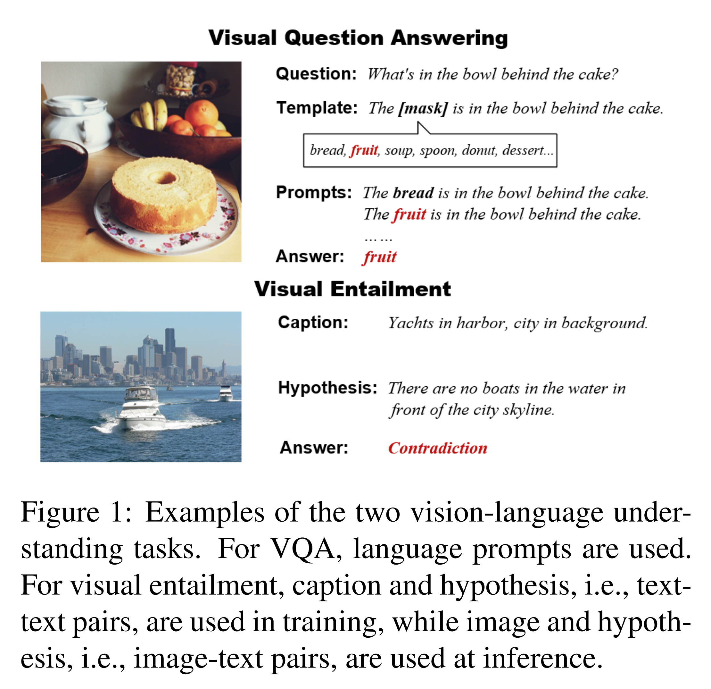

# 2 Preliminaries

## 2.1 CLIP

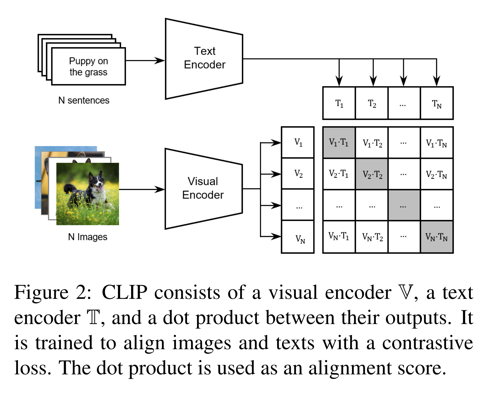

CLIP 은 Contrastive Language-Image Pretraining 의 약자로, natural language supervision 을 통해 visual representation 을 학습한다. Fig. 2 는 CLIP 의 핵심 구성 요소와 동작 방식을 보여준다. CLIP 은 visual encoder $V$ (e.g., ResNet, ViT) 와 text encoder $T$ (e.g., transformer) 로 구성되며, 두 encoder 는 image 와 text 를 독립적으로 인코딩한다. 이후 두 encoder 의 출력에 대해 dot-product 연산, 즉 $T(\text{text}) \cdot V(\text{image})$ 를 수행하여 input image 와 text 간의 alignment score 를 계산한다. CLIP 은 contrastive loss 를 통해, 올바르게 매칭된 image-text pair 와 무작위로 결합된 pair 를 구분하도록 pretraining 된다.

기존의 vision benchmark 에서 직접 학습하는 대신, CLIP 은 400M web-crawled image-text pair 로부터 abundant language supervision 을 활용하여, specific task-optimized training 없이도 다양한 image classification task 를 수행할 수 있다. 그러나 CLIP 을 직접 vision-language understanding model 로 적용하는 것은 여전히 어려운 문제이다.

## 2.2 Vision-Language Understanding Tasks

#### Visual question answering (VQA).

VQA task 는 주어진 image 의 세부 사항에 대한 질문에 답변하는 것을 요구한다. 기존 연구를 따라, VQAv2 dataset 에서 실험을 수행하며, 이를 3,129 개의 사전에 정의된 가장 빈도가 높은 답변들에 대한 classification 문제로 정의한다. VQAv2 의 image 는 Microsoft COCO dataset 에서 가져왔으며, dataset 에는 *how many*, *what color is* 와 같은 총 65 종류의 질문 유형이 포함된다. 답변 유형은 **yes/no**, **number**, **other** 의 세 가지로 구성된다.

#### Visual entailment.

Natural language inference (NLI) 와 유사하게, visual entailment task 는 premise 와 hypothesis 간의 관계를 entailment, neutral, contradiction 중 하나로 예측한다. VL 환경에서는 premise 가 NLI 의 text description 이 아니라 image 의 세부 사항에 기반한다. SNLI-VE dataset 은 SNLI dataset 에서 premise 를 Flickr30k dataset 의 image 로 대체하여 구성된다. 이러한 특성을 고려하여, 본 연구에서는 SNLI-VE dataset 을 사용해 CLIP model 의 zero-shot cross-modality (language 와 vision) transfer 능력을 검증한다. 이 zero-shot 설정은 CLIP model 에서 vision representation 과 language representation 이 얼마나 잘 aligned 되어 있는지를 조사한다.

# 3 Zero-shot VQA

## 3.1 A Two-Step Prompt Generation Method

기존 연구에서는 CLIP model 을 zero-shot VL task 에 직접 적용하는 것이 불가능하다는 것을 발견했다. 예를 들어, “question: [question text] answer: [answer text]” 와 같은 prompt template 을 직접 사용했을 때 VQAv2 dataset 에서 거의 랜덤 수준의 zero-shot 성능이 관찰되었다. Prompt engineering 의 본질을 재검토하면, VQA task 의 zero-shot 성능 전이에서 핵심은 자연어 설명과 question answering 형태 간의 간극을 줄이는 것임을 알 수 있다.

이러한 관찰에 기반하여, 저자는 pre-trained generative T5 model 의 도움을 받아 CLIP model 에 zero-shot VQA 능력을 부여하기 위한 **two-step automatic prompt generation method** 를 제안한다. Fig. 3 에 제시된 바와 같이, 이 방법의 핵심 아이디어는 다음과 같다.

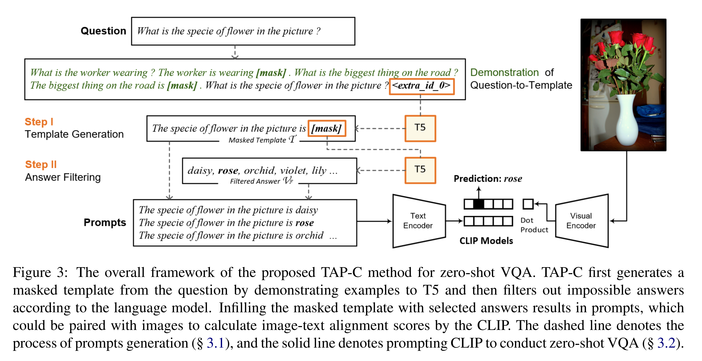

1. 질문을 masked template $T$ 로 변환한다.
2. Language model 을 사용하여 불가능한 답변을 필터링하고 후보 답변 집합 $\mathcal{V}_F$ 를 얻는다.

이렇게 생성된 infilled template 은 질문과 답변을 자연스러운 설명 형태로 연결하므로, VQA task 를 위한 ideal prompt 형태가 될 수 있다.

#### Step I: Automatic Template Generation

이 단계에서는 질문을 mask token 을 포함한 문장 형태의 template 으로 변환한다. 변환을 위해 두 가지 접근법을 사용한다.

* **Demonstration to T5**
  질문을 [mask] token 이 포함된 template 으로 변환하는 예시를 language model 에 제공하여 변환 패턴을 학습시키는 방식이다. 질문 유형별로 몇 개의 예시를 정의하고, 이에 따라 질문을 변환한다. T5 는 large pre-trained text-to-text Transformer 로, 문장에서 특정 span (e.g., `\<extra_id_0\>`) 을 채우도록 pretraining 되어 있다. 예시, 질문, `\<extra_id_0\>` token 을 연결하여 T5 에 입력하고, 생성된 span 을 masked template $\mathcal{T}_{\text{demo}}$ 로 사용한다.

* **Dependency parsing**
  T5 변환 방식이 잘 동작하더라도 일부 coverage 문제를 해결하기 위해 dependency parsing 기반 방식을 보완적으로 사용한다. 이 방식은 질문을 POS tagging 과 parsing 결과를 기반으로 statement 로 변환하며, wh-word, root word, auxiliary, copula, 그리고 wh-word 또는 root 의 dependent 인 전치사나 particle 을 식별하여 grammar rule 에 따라 변환한다. Stanza 를 사용해 POS tagging 과 parsing 을 수행하고, 답변 부분은 mask token 으로 남긴다. 변환 규칙은 Demszky et al. 의 규칙을 따른다. 이렇게 얻은 template 을 $\mathcal{T}_{\text{parsing}}$ 이라 한다.

#### Step II: Answer Filtering

예를 들어 “the specie of a flower” 가 vase 가 될 수 없다는 것은 상식이다. Pre-trained language model 은 이러한 개념을 이미 학습했으므로, 가능성이 낮은 답변을 필터링하면 최종 QA 성능에 긍정적인 영향을 준다.

주어진 masked template $\mathcal{T}$, language model $\mathcal{L}$, answer vocabulary $\mathcal{V}$ 에 대해, filtered answers $\mathcal{V}_F$ 는 다음과 같이 얻는다.

$$
\mathcal{V}_F = \text{Top-}k_{v \in V} \{ \log P_\mathcal{L}([\text{mask}] = v \mid \mathcal{T}) \} \tag{1}
$$

* 여기서 $[\text{mask}]$ 는 template $T$ 내의 답변 위치이며, 
* $P_\mathcal{L}$ 은 language model 의 output distribution 이다.
* answers infilling 에는 T5 를 사용한다. 
* Template $T$ 와 filtered answers $\mathcal{V}_F$ 를 얻은 후, 각 선택된 답변을 $\mathcal{T}$ 의 $[\text{mask}]$ token 위치에 삽입하여 prompts $\mathcal{P}$ 를 생성한다.

## 3.2 TAP-C Method for VQA

제안한 방법은 **Template → Answer → Prompt → CLIP discrimination** 파이프라인을 따르므로 **TAP-C** 라 명명한다. $\mathcal{T}_{\text{parsing}}$ 과 $\mathcal{T}_{\text{demo}}$ 를 더 효과적으로 사용하기 위해, T5 생성 confidence threshold 를 설정하여 앙상블한다. Confidence 가 높으면 $\mathcal{T}_{\text{demo}}$ 를, 낮으면 $\mathcal{T}_{\text{parsing}}$ 을 사용한다.

image $i$ 와 생성된 prompts $\mathcal{P}$ 가 주어졌을 때, TAP-C 의 zero-shot VQA 예측은 다음과 같이 계산된다.

$$
\max_{v \in \mathcal{V}_F, \, p_v \in \mathcal{P}} \{ V(i) \cdot T(p_v) \}\tag{2}
$$

* 여기서 $V$ 와 $T$ 는 CLIP model 의 visual encoder 와 text encoder 이다. $p_v$ 는 TAP-C 에 의해 생성된 prompt 로, masked template 에서 $\mathcal{V}_F$ 의 answer $v$ 로 채워진 형태이다.

# 4 Zero-shot Cross-modality Transfer

최근 pre-trained multilingual language model 들은 서로 다른 언어 간에 representation 을 전이하는 데 성공적인 성과를 보였다. 예를 들어, 특정 source language 로만 fine-tuning 하고, 별도의 학습 없이도 다양한 target language 에 대해 좋은 성능을 낼 수 있다.

한편, CLIP model 은 vision 과 language representation 간의 dot product 만으로도 image-to-text, text-to-image retrieval task 에서 strong zero-shot 성능을 달성한다. 이는 두 modality 가 CLIP model 내에서 잘 aligned 되어 있다는 직관을 준다. 그렇다면 multilingual model 이 언어 간 전이를 수행하듯, CLIP model 에서도 language 와 vision 간 cross-modality capability 가 존재하는가?

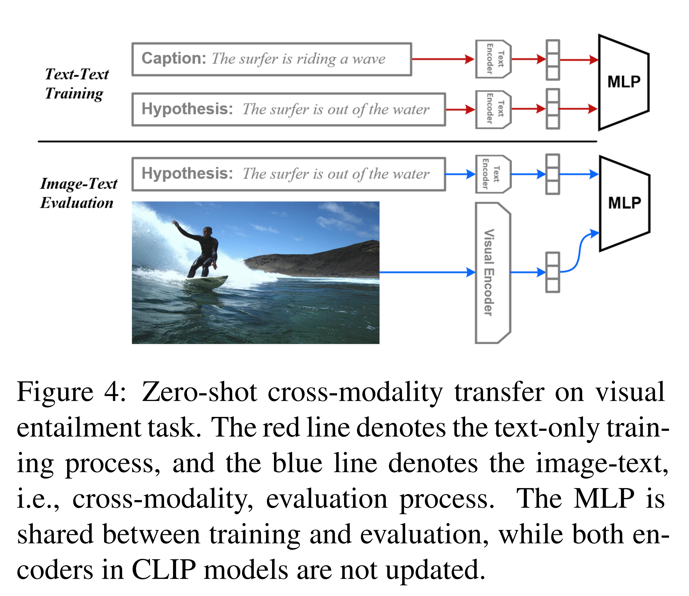

이 질문에 답하기 위해, 저자는 Sec. 2.2 의 visual entailment task 를 활용하여 zero-shot cross-modality 성능을 탐구한다. Fig. 4 는 핵심 아이디어를 간단히 나타낸다. 구체적으로, premise 와 hypothesis 의 fused representation 위에 MLP classifier 를 학습하며, fusion function 은 다음과 같이 정의된다.

$$
\text{fuse}(v_1, v_2) = [v_1, v_2, v_1 + v_2, v_1 - v_2, v_1 \cdot v_2]
$$

여기서 $v_1$ 과 $v_2$ 는 두 개의 입력 벡터이다.

**Training 단계**에서는 text-only premise 와 hypothesis 를 CLIP text encoder 의 입력으로 사용한다.

$$
\text{MLP}\{\text{fuse}(T(\text{pre}_t), T(\text{hyp}_t))\} \tag{3}
$$

여기서 $T$ 는 CLIP text encoder 로, 학습 중 업데이트되지 않는다. $\text{pre}_t$ 와 $\text{hyp}_t$ 는 text premise 와 text hypothesis 이다. Inference 단계에서는 premise 가 image 형태로 주어지고, CLIP visual encoder 에 입력된다. 학습된 MLP 는 다음과 같이 예측에 사용된다.

$$
\max \{ \text{MLP}\{\text{fuse}(V(\text{pre}_i), T(\text{hyp}_t))\} \} \tag{4}
$$

여기서 $\text{pre}_i$ 는 image premise 이고, $V$ 는 CLIP visual encoder 이다.

# 5 Few-shot Learning for VQA

본 절에서는 CLIP model 이 *few-shot* learning 에서 이점을 얻을 수 있는지 여부를 조사하며, 이를 위해 visual question answering (VQA) task 를 대상으로 연구를 수행한다.

## 5.1 Setup of Few-shot VQA

Few-shot VQA 설정에서 사용되는 용어를 다음과 같이 정의한다.

* **Number of ways**
  원래는 task 내의 서로 다른 class 수로 정의되지만, 본 연구에서는 answer vocabulary 에 따른 3,129-way 가 아닌, question type 과 answer type (Sec. 2.2) 의 곱으로 정의한다. 즉, $65 \times 3 = 195$ ways 로 설정하여, 모델이 특정 question type 에 답변할 수 있는 generalization 능력을 보장한다.
* **Number of shots**
  각 way 에서의 서로 다른 예시 수를 의미한다. 여기서 shot 은 이미지, 질문, 정답으로 구성된 하나의 예시를 뜻한다.
* **Support set 과 query set**
  학습 전, VQAv2 training set 에서 195-way K-shot subset 을 샘플링하여, few-shot learning 에 사용 가능한 예시 수를 $195 \times K$ 로 설정한다. 각 학습 epoch 에서 195 ways 중 $C$ ways 를 선택하여 parameter optimization 을 수행하며, 각 way 의 $K$ shots 를 일정 비율로 support set 과 query set 으로 나눈다. Support set 은 모델 학습에, query set 은 성능 평가(일종의 dev set 역할)에 사용된다.

## 5.2 Parameter-efficient Fine-tuning

Few-shot 환경에서의 목표는 CLIP model 이 $N$-way $K$-shot 예시로부터 학습하여 zero-shot VQA 성능을 향상시키는 것이다. 이를 위해 CLIP model 의 전체 100M parameter 중 약 0.3M 만 최적화 대상으로 설정한다. 최적화되는 parameter 는 bias term 과 normalization term 으로, normalization 은 BatchNorm (ResNet) 과 LayerNorm (Transformer) 모두 다음과 같이 통일적으로 표현할 수 있다.

$$
y = \frac{x - E(x)}{\sqrt{\text{Var}(x) + \epsilon}} \cdot \gamma + \beta
\tag{5}
$$

* 여기서 $x$ 와 $y$ 는 mini-batched input/output 이고, 
* $\gamma$ 와 $\beta$ 는 learned parameter 이다.

CLIP model 의 모든 linear layer 와 projection layer 는 다음과 같이 표현된다.

$$
o = w \cdot h + \text{bias}
\tag{6}
$$

여기서 $h$ 와 $o$ 는 각각 input 과 output vector 이다. 따라서 learnable parameter set 은 다음과 같이 정의된다.

$$
P_{\text{learn}} = \{\text{bias}, \gamma, \beta\}
\tag{7}
$$

저자는 **Bi**as 와 **Nor**malization (BiNor) parameter 를 few-shot 예시에서 최적화하며, 각 image-prompt pair 의 dot product (Eq. 2) 에 대해 standard cross-entropy loss 를 사용한다.

또한, 예시 수가 적은 경우, TAP-C (Sec. 3.1) 의 answer filtering 과정에서 **in-context demonstration** 방식을 활용하여 성능을 개선할 수 있다. 이를 위해 식 (1)을 다음과 같이 수정한다.

$$
\mathcal{V}_{\text{demo}} = \text{Top-}k_{v \in \mathcal{V}} \{ \log P_\mathcal{L}([\text{mask}] = v \mid [\mathcal{D}, \mathcal{T}]) \}
\tag{8}
$$

* 여기서 $\mathcal{D}$ 는 demonstration 으로, template $\mathcal{T}$ 와 유사하지만 답변이 채워져 있으며, few-shot 예시 중 동일 question type 에서 샘플링된다. 
* 이 과정을 통해 필터링된 vocabulary 를 $\mathcal{V}_{\text{demo}}$ 라 한다.

# 6 Experiments

## 6.1 Experimental Settings

#### Datasets.

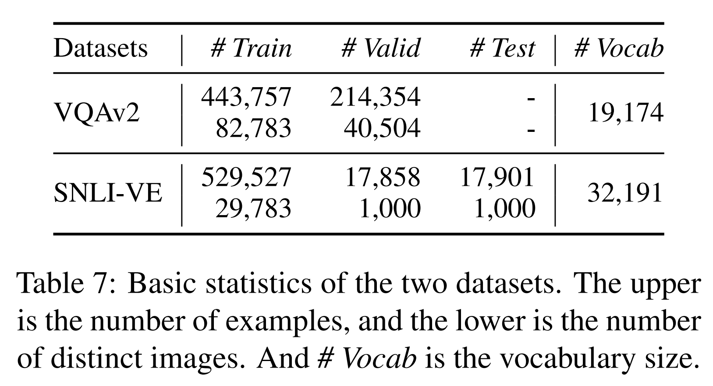

Visual question answering 과 visual entailment 에 대해 각각 VQAv2 와 SNLI-VE dataset 에서 실험을 수행한다. 두 dataset 의 통계치는 Tab. 7 에 보고한다. 

* VQA task 평가는 Frozen model 을 따라 VQAv2 validation set 에서 vqa score 를 계산한다. 
* Visual entailment 평가는 sklearn toolkit 을 사용하여 validation set 과 test set 의 accuracy 를 계산한다.

#### CLIP models.

Visual encoder 종류(e.g., ResNet, ViT)에 따라 CLIP model 은 여러 variant 가 있으며, learnable bias 및 normalization parameter 의 수가 크게 달라진다. CLIP variant 의 learnable parameter 수는 Tab. 11 에 보고한다. 

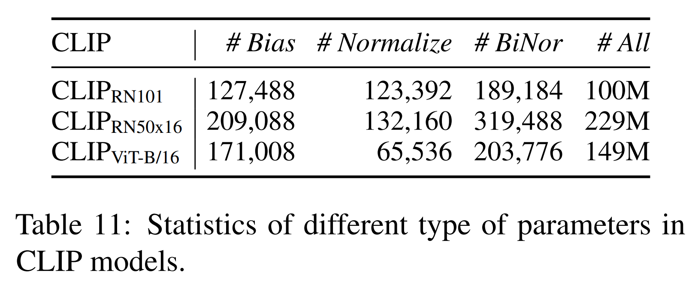

본 연구에서는 ResNet 기반의 CLIP Res50x16 과 ViT 기반의 CLIP ViT-B/16, 두 가지 성능 우수 variant 를 선택하여 제안한 전이 방법(§§ 3–5)을 적용한 zero-shot 및 few-shot vision-language understanding 성능을 실증적으로 연구한다.

## 6.2 Results of Zero-shot VQA

기존 VL model 은 object detection sub-module 에 크게 의존하므로 zero-shot 환경에서 직접 적용하기 어렵다. 본 연구에서는 최신 연구 두 가지를 zero-shot VL baseline 으로 설정한다.

* **Frozen**
  Frozen 은 7B parameter, 32-layer language model 에 image representation 을 prompt 로 제공하는 방식이다. Aligned image-caption data 로 학습되었으며, zero-shot 및 few-shot VQA 성능을 처음으로 보여준 모델이다.
* **Question irrelevant prompt (QIP)**
  Shen et al. 은 CLIP model 을 직접 prompt 하여 VQA task 를 수행하는 방법을 탐구했다. “question: [question text] answer: [answer text]” template 과 image classification prompt engineering 을 결합해 prompt 를 준비했다. 그러나 이렇게 생성된 prompt 는 질문과 무관하므로 QIP 로 표기한다.

Table 1 의 zero-shot VQA 결과는 Sec. 3.1 의 가설을 검증한다. 즉, CLIP 의 prompt 는 task 설명이 아니라 label 을 설명하는 형태여야 한다. 

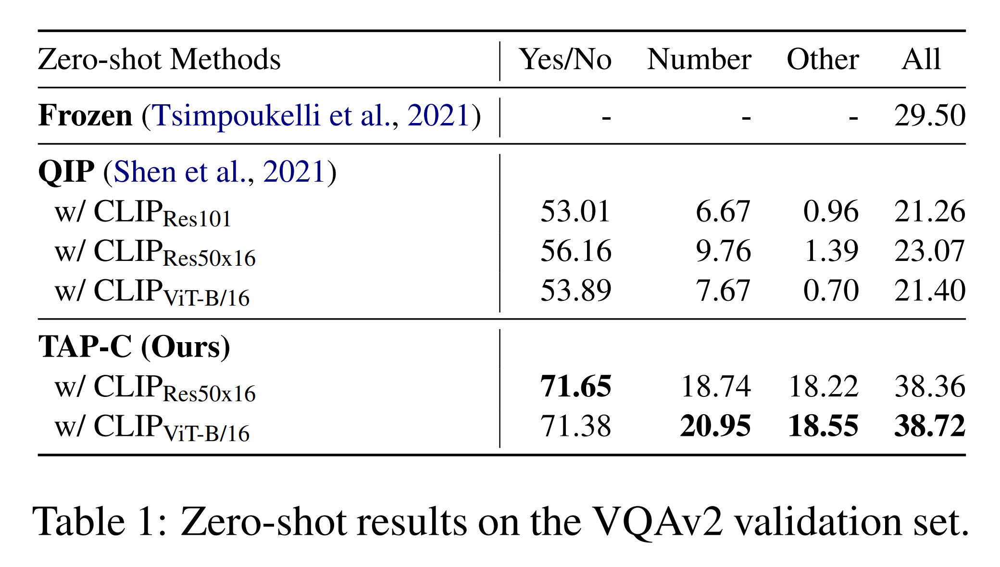

* QIP 방식은 단순히 task 설명과 정답을 CLIP model 에 제시하며, 랜덤 추측보다 약간 나은 수준에 그친다. 
* 반면, 저자의 TAP-C 방법은 질문을 template 으로 변환하고, pre-trained language model 로 답변을 필터링함으로써, 7B parameter Frozen zero-shot model 과 비교해도 강력한 zero-shot 성능을 달성한다.

## 6.3 Zero-shot Cross-modality Transfer

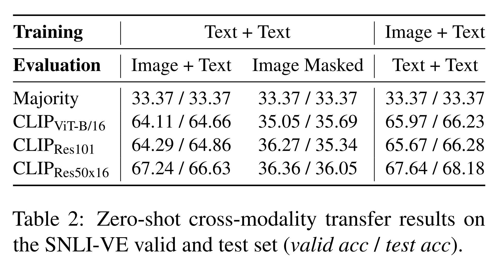

Table 2 는 zero-shot cross-modality transfer 결과를 보여준다. 먼저 **language → vision transfer** 를 조사한다. 

* Sec. 4 에서 설명한 대로, image 를 caption 으로 대체한 text-only SNLI-VE dataset 에서 classifier 를 학습한 뒤, 추론 시 image-text 를 입력으로 평가한다. 
* 첫 번째 결과 그룹에서 보이듯, text-text (caption 을 premise 로 사용) entailment data 로만 학습했음에도, 서로 다른 CLIP variant 는 image-text 환경에서도 유사한 판별 능력을 유지한다.

위 결과가 실제로 language → vision 전이임을 확인하기 위해, 추론 시 이미지를 masking 하여 평가했으며(Image Masked), 결과는 3-class 무작위 추측 수준과 유사했다. 이는 이미지가 cross-modality 평가에서 중요한 역할을 한다는 것을 의미한다.

다음으로 **vision → language transfer** 여부를 조사한다. 이를 위해 original SNLI-VE dataset(image premise + text hypothesis) 으로 classifier 를 학습하고, 추론 시 text-only valid/test data 로 평가했다. 

* Table 2 결과는 vision → language 전이 능력을 확인시켜 준다. 
* 실제 응용에서 text data 는 visual data 보다 훨씬 저렴하므로, practical 관점에서는 language → vision 전이가 더 유망하다.

## 6.4 Results of Few-shot VQA

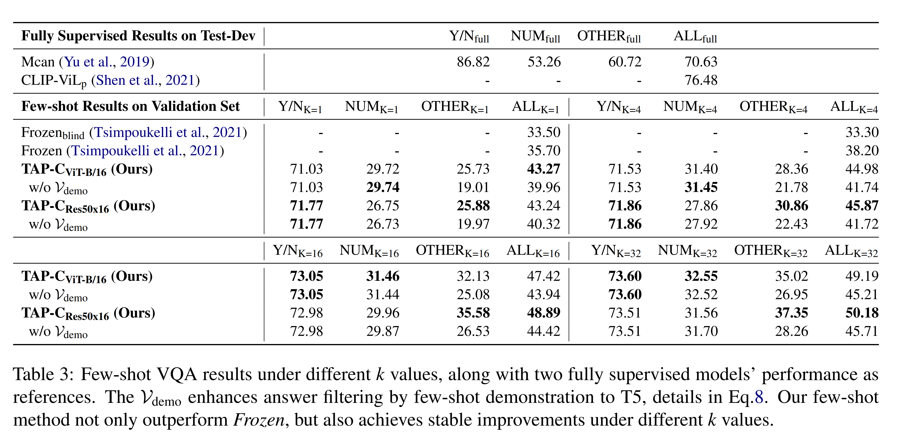

Table 3 은 few-shot VQA 결과를 보여준다. 

* Baseline 으로 Frozen model 과 이미지가 가려진 Frozenblind 를 사용했다. 
* 서로 다른 $k$ 값에서 제안한 방법은 항상 제한된 학습 예시로부터 학습하여 zero-shot 성능을 향상시켰으며, 이는 CLIP model 이 VL few-shot learner 가 될 수 있음을 확인시켜 준다.
* Shot 수가 증가함에 따라 **other** category 에서 큰 성능 향상이 관찰되는데, 이는 question type 별로 예시를 샘플링하므로 other category 의 많은 답변이 학습 초기에 모델에 노출되지 않았기 때문이다. 
* 예시가 추가되면 모델이 계속 학습하여 향상되는 경향을 보인다. 또한, T5 에 예시를 제공하는 것은 answer filtering 과정 성능을 높여 other category 성능 향상으로 이어졌다.
* 반면, **number** category 는 학습 초기 일부 예시만 보아도 성능이 빠르게 향상되지만, $k$ 가 계속 증가하면 개선 속도가 둔화된다.

## 6.5 Analyses and Discussion

#### The effects of template generation methods.

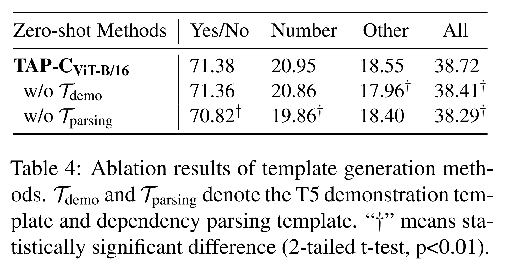

TAP-C 방법은 dependency parsing 기반 template $T_{\text{parsing}}$ 과 T5 demonstration 기반 template $T_{\text{demo}}$ 의 앙상블을 사용한다. 여기서는 이러한 앙상블 사용이 필수적인지 조사한다. Table 4 의 ablation 결과에 따르면, 두 template 은 질문 유형에 따라 서로 다른 장점을 가지며, 앙상블은 이들의 장점을 최대한 활용할 수 있음을 보여준다.

#### The effects of two steps in TAP-C.

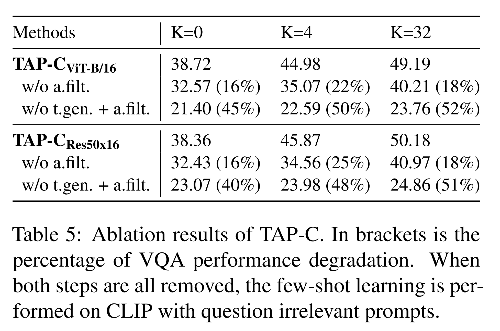

TAP-C 는 template generation (t.gen.) 과 answer filtering (a.filt.) 을 통해 prompt 를 생성한다. 각 단계가 zero/few-shot VQA 최종 성능에 기여하는 정도를 정량적으로 분석하기 위해 Table 5 의 ablation 결과를 보고한다. 

* Answer filtering 단계를 제거(w/o a.filt.)하면 zero-shot 및 few-shot 성능이 약 20% 감소하지만, 모델은 여전히 일부 few-shot 학습 능력을 유지한다. 
* Template generation 단계마저 제거하고 question irrelevant template 만 사용하면 성능이 절반 수준으로 떨어지며, 이는 zero-shot 과 few-shot 환경 모두에서 질문 반영이 매우 중요함을 시사한다.

#### Comparisons of fine-tuning methods.

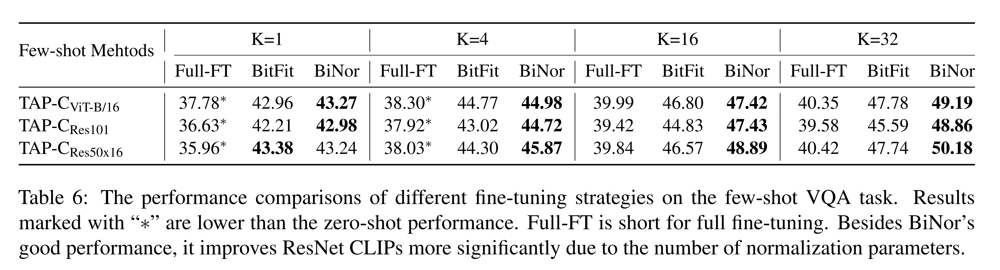

Few-shot 학습 시 저자는 bias 와 normalization parameter 만 업데이트한다(§ 5.2). BiNor fine-tuning 전략의 효과를 검증하기 위해 다음 두 방법과 비교한다.

1. **Full-FT (Full fine-tuning)** — 모델의 모든 parameter 업데이트
2. **BitFit** — 모든 layer 에서 bias term 만 업데이트

* Table 6 결과, BiNor 와 BitFit 은 모두 Full-FT 를 크게 상회하는 성능을 보였다. 이는 수백만 개 parameter 전체를 학습하면 few-shot 환경에서 쉽게 overfitting 되기 때문이다. 
* $k$ 가 작을 때 BiNor 와 BitFit 간 성능 차이는 작지만, $k$ 가 커지면 BiNor 가 BitFit 을 확연히 앞선다. 
* BiNor 는 BitFit 과 유사하지만 normalization parameter 도 업데이트하여, 특히 batch normalization parameter 가 많은 ResNet 기반 CLIP model 에서 새로운 예시에 더 잘 적응하도록 한다. 

#### Limitations of TAP-C.

제안한 TAP-C 방법은 CLIP model 의 zero/few-shot VQA 수행 가능성을 탐구했으나, few-shot 성능 향상을 저해하는 몇 가지 한계도 확인되었다. 이러한 한계는 CLIP model 자체에 기인할 수 있다.

1. **정밀 객체 수 세기 어려움** — 특히 이미지의 작은 영역에서 객체 수를 세는 경우, CLIP model 은 어려움을 겪으며, 이는 language knowledge 로 보완하기 어렵다.
2. **미묘한 의미 구분 실패** — 예를 들어, “what is the man in the background doing?” 질문에 대해 모든 실험 CLIP model 이 전경(foreground) 인물의 행동을 예측했다.

이러한 경우 TAP-C 가 질문을 prompt 로 완벽하게 변환하더라도 최종 결과는 여전히 잘못될 수 있다. 그럼에도, 저자는 더 강력한 text encoder 로 CLIP model 을 강화하면 이 문제가 상당 부분 해결될 수 있다고 보고, 향후 연구에서 이를 탐구할 계획이다.

# 7 Related Work

#### Vision-language few-shot learning.

Aligned caption data 를 활용하여 image-text discriminative loss 로 pretraining 된 vision-language model 은 최근 image classification 과 cross-modality retrieval task 에서 강력한 zero-shot generalization 성능을 보였다. Discriminative 방식과 달리, Tsimpoukelli et al. 은 vision prefix 를 사용해 large frozen language model 을 generative 방식으로 prompt 하였으며, 이는 최초의 vision-language few-shot model 이다.

#### Language model prompting.

본 연구는 language model prompting 연구 흐름에서도 영감을 받았다. GPT series 로 시작된 prompting 은 pre-trained language model 로부터 zero-shot 또는 few-shot 방식으로 knowledge 를 추출하는 방법으로 널리 사용되고 있다. PET 연구는 few-shot language understanding 성능 향상을 위한 semi-supervised prompting 방법을 제시하였다.

# 8 Conclusions

본 연구에서는 CLIP model 을 vision-language understanding task 로 전이하는 방법을 실증적으로 연구하였다. 

*먼저, language prompt 를 활용하여 CLIP model 의 zero-shot VQA 성능을 탐구하고, few-shot 성능 향상을 위한 parameter-efficient fine-tuning 방법을 제안하였다. 
또한 visual entailment task 에서 CLIP model 의 zero-shot cross-modality transfer 능력을 입증하였다. VQAv2 와 SNLI-VE dataset 에서의 실험 및 분석을 통해 CLIP model 이 우수한 VL few-shot learner 가 될 수 있음을 확인하였다.

