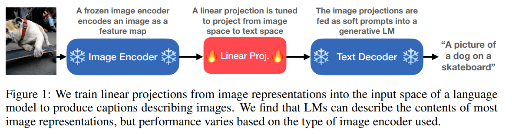
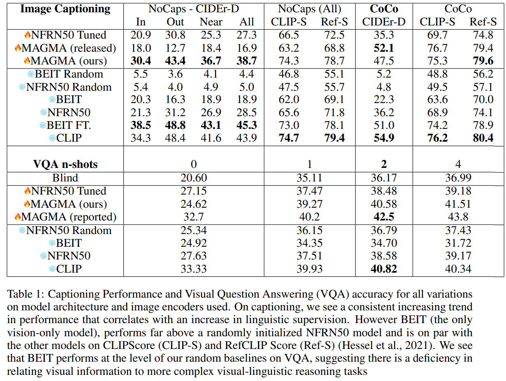
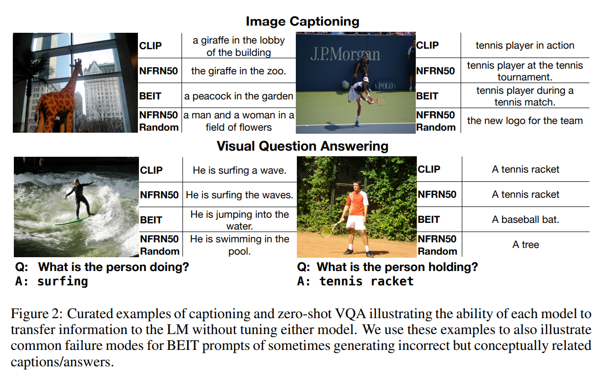
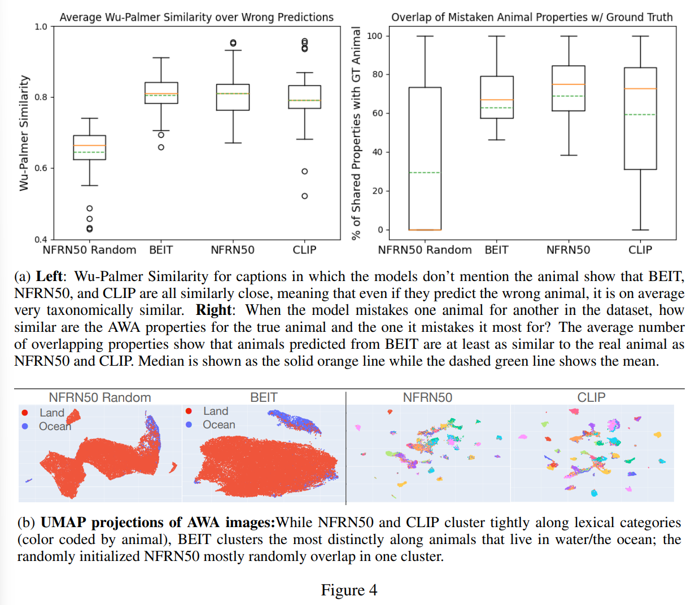

논문 및 이미지 출처 : <https://arxiv.org/abs/2209.15162>

# Abstract

텍스트만 사용하는 language model (LM) 이 비언어적 세계의 특성을 얼마나 학습하여 표현하는지는 여전히 열린 질문이다. 기존 연구에서는 pre-trained LM 이 vision model 의 parameter 를 최적화하여 이미지를 language space 에 인코딩하도록 하면 image captioning 을 학습할 수 있음을 보였다. 

저자는 더 강한 가설을 검증한다. 즉, frozen text-only model 과 vision-only model 이 학습한 conceptual representation 이 충분히 유사하여, 단순한 linear map 만으로 이를 달성할 수 있다는 것이다. 

* 저자는 vision model 의 image representation 을 single linear projection 만 학습하여 frozen LM 에 continuous prompt 로 전달할 수 있음을 보인다.
* 이를 이용해 LM 을 prompting 하면, image encoder 와 text decoder (e.g., MAGMA model) 를 모두 튜닝하는 방법과 비교하여 captioning 및 visual question answering task 에서 경쟁력 있는 성능을 달성한다. 

저자는 pre-training 과정에서 서로 다른 수준의 linguistic supervision 을 받은 세 가지 image encoder 를 비교한다: BEIT (linguistic 정보 없음), NF-ResNET (lexical category 정보), CLIP (자연어 설명 전체). 

세 encoder 모두 크기와 같은 visual property information (e.g., 동물이 크거나 작은지) 를 LM 에 효과적으로 전달하지만, linguistic supervision 으로 pre-trained image encoder 는 category information (e.g., 하마 vs. 코끼리 구분) 를 더 뚜렷하게 인코딩하여 language-and-vision benchmark task 에서 유의하게 더 좋은 성능을 보였다. 이러한 결과는 LM 이 이미지로만 학습된 model 을 포함한 vision-based model 과 구조적으로 유사한 방식으로 개념 정보를 인코딩함을 시사한다.

# 1 Introduction

최근 NLP 연구의 많은 부분은 오직 text data 의 형식적 특성에만 기반한 학습이 representation capacity 에 어떤 한계를 부과하는지에 초점을 두고 있다. 이러한 논의는, 명시적인 grounding 이 없다면 language model 은 인간이 물리적이고 비언어적인 세계와 상호작용하면서 습득하는 풍부한 conceptual knowledge 를 반영하는 conceptual representation 을 학습하지 못할 것이라는 주장과 연결된다. 그럼에도 불구하고, large language model 이 비언어적 현상에 대해 일반화하고 추론하는 능력에서 놀라운 발견들이 있었다. 따라서 이 분야의 열린 질문은, 오직 text-only data 로 학습된 language model 이 물리적 세계의 측면을 어느 정도까지 학습할 수 있는가 하는 것이다.

이 논문에서는 language model 과 image encoder 의 representation 사이의 관계에 대한 특정 가설을 검증한다. 즉, 이러한 conceptual representation 이 linear transformation 을 통해 서로 근사적으로 대응될 수 있다는 것이다. 이를 위해 저자는 image representation space 에서 generative LM 의 language space 로 사영하는 single linear layer 를 학습한다. 다른 model parameter 는 전혀 튜닝하지 않으며, 이를 LiMBeR (Linearly Mapping Between Representation spaces) 라고 부른다. 구체적으로, image representation 을 discrete language token 과 대응되지 않는 embedding space 상의 vector 인 “soft prompts” 로 linear transformation 한다. 이 linear projection 의 weight 는 image captioning task 를 통해 학습된다 (Fig. 1 참조). 이후 vision-language (VL) task 에 대해 LM 이 생성하는 텍스트를 탐구함으로써 성능을 평가한다. linear transformation 의 단순성 때문에, 두 model 의 conceptual representation space 가 구조적으로 유사하다면 이 transfer 는 성공적일 것이며, LM 은 이미지 내용을 기술하는 데 큰 어려움이 없을 것이라 예상된다.

저자는 pre-training 과정에서 서로 다른 수준의 linguistic supervision 을 받은 세 가지 image encoder 를 사용하여 LM 으로 projection 을 학습한다: BEIT, Normalizer Free ResNet50 (NFRN50), CLIP. 

* 여기서 linguistic supervision 은 image encoder 가 pre-training 중 language data 에 어느 정도 노출되었는지를 의미하며, 이는 LM 과의 representation 유사성에 영향을 미친다. 
* CLIP 은 이미지와 자연어 caption 을 shared image-text representation space 에 맞추도록 pre-training 되었지만, 
* BEIT 은 language 에 전혀 노출되지 않고 이미지의 masked 영역 내용을 예측하는 방식으로 학습되었다. 
* NFRN50 은 두 극단의 중간에 위치한다. ImageNet1k class 집합에서 이미지 subject 를 식별하는 image classification task 로 pre-training 되었기 때문이다. 
* 이 task 에는 자연어가 포함되지 않지만, WordNet hierarchy 에서 유래한 lexical category 개념 (image class) 에 따라 시각적 feature 를 매핑하도록 model 을 유도한다.

실험 결과, 세 encoder 중 어느 것을 사용하든 LM 에 prompt 로 입력하면 이미지의 semantic content 가 효과적으로 전달되어 LM 이 자연어로 기술할 수 있음을 보인다. 그러나 성능은 image encoder 가 가진 linguistic supervision 의 강도에 비례하는 것으로 나타났다. CLIP 과 NFRN50 은 자유롭게 model 을 튜닝하는 방법과 비교해도 경쟁력 있는 성능을 보였지만, BEIT 은 주로 거친 수준의 visual properties 만 전달하며 LM 이 정확한 lexical category 를 생성하도록 유도하는 데는 어려움을 보였다. 이는 language data 또는 vision data 로 학습된 model 이 개념 공간을 구조적으로 유사하게 학습한다는 증거로 해석되지만, 정확한 유사도의 정도는 image encoder 가 받은 supervision 의 종류에 달려 있음을 시사한다.

요약하면, 저자는 다음을 보인다.

1. visual semantic information 은 어떤 model parameter 도 튜닝하지 않고 soft prompts 의 형태로 language model 에 linear mapping 될 수 있다.
2. 이러한 mapping 은 generative model 이 이미지를 설명하고 이미지에 관한 질문에 답할 수 있도록 하며, 이는 image 와 language representation 을 공동으로 튜닝하는 multimodal model 과 비교해도 경쟁력 있는 수준이다.
3. 서로 다른 image encoder backbone 을 사용하여 prompting pipeline 을 학습함으로써, pre-training 에서의 linguistic supervision 이 model 의 개념 형성에 핵심적인 역할을 하며, 따라서 vision-to-text 공간 간 visual feature 의 transferability 에도 중요한 영향을 미친다는 것을 보인다.

# 2 Related Work

저자의 접근법은 pre-trained language model 을 image representation 을 입력으로 받을 수 있도록 적응시키려는 최근 연구들에서 영감을 얻었다. 특히 Frozen 과 MAGMA model, 그리고 Sung et al., Alayrac et al., Mokady et al., Luo et al., Lin et al., Zhai et al. 등의 연구는, pre-trained image network 와 text network 을 함께 image captioning task 에서 튜닝한 뒤 downstream vision-language (VL) task 에 적용할 수 있음을 보였다. 이러한 접근법은 pre-trained model 을 fine-tuning 하거나, modality 간에 non-linear MLP projection/fusion network 을 학습하는 방식을 택한다. 이는 저자의 접근법과 달리 representation 의 해석을 어렵게 만든다. 

Scialom et al. 은 trained linear transformation 만으로도 BERT 가 image region representation 을 인코딩하여 text decoder 로 전달해 이미지에 대한 질문을 생성할 수 있음을 보였으나, 이러한 transformation 을 통해 LM 이 어떤 abstraction 을 전달받을 수 있는지는 충분히 이해되지 않았으며, text decoder 가 visual encoding 의 linear transformation 만으로도 직접 동작할 수 있는지 역시 불분명하다.

과거에는 pretrained LM 또는 scratch 에서 trained LM 이 주로 image captioning 에 사용되었으며, 이때는 image representation 을 LM 의 입력으로 직접 전달하였다. 

* Gui et al., Yuan et al. 은 image-caption data 로부터 vision-language model 을 scratch 에서 학습하였다. 
* Zeng et al., Xie et al., Wang et al. 은 LM training 을 통해 습득된 knowledge 를 활용하기 위해 VL model 로부터 파생된 text prompt 를 LM 에 주입하여 multimodal 성능을 향상시켰다. 
* 이러한 연구들은 LM 이 text 로 기술된 visual input 과 상호작용할 수 있음을 보여준다. 
* 그러나 저자의 연구는, visual input 이 language 를 거치지 않고 직접 LM 에 입력될 수 있는가를 묻는다. 앞선 model 들이 VL task 에서 성공한 사실은 text model 과 image model 이 독립적으로 학습하더라도 representation 유사성을 가지게 됨을 시사하며, 저자는 이를 본 논문에서 탐구한다.

저자의 연구는 또한 model “stitching” 개념과 밀접하게 관련된다. stitching 은 두 서로 다른 model 을 특정 layer 에서 연결하는 방식이다. 

* LiMBeR 는 image encoder output 을 soft prompt 형태로 LM 의 입력에 연결하는 stitching 으로 설명할 수 있다. 
* stitching 은 RSA 나 CKA 와 같은 기존 방법보다 두 model 간 representation similarity 를 평가하는 데 뚜렷한 장점을 제공한다. 
* 예를 들어, LiMBeR 는 CLIP encoding 이 BEIT representation 보다 text encoding 에 더 유사하다는 것을 보여줄 뿐 아니라, BEIT representation 역시 LM 으로 visual property 정보를 transfer 할 수 있음을 보여준다 (Sec. 5.3).

최근 연구에서는 LM 이 언어를 모델링하기 위해 비언어적 세계의 측면을 모델링하는지에 대한 관심이 크다. 

* Lu et al. 은 pretrained LM 의 weight 가 서로 다른 modality 의 task 에 일반화될 수 있음을 보였다. 
* Hao et al. 역시 LM 이 여러 modality 의 인터페이스로 동작할 수 있음을 보였다. 
* Li et al. 은 entity 와 situation model 이 contextual word representation 으로부터 도출될 수 있음을 보였다. 
* Patel & Pavlick 은 매우 large LM (GPT-3 scale) 이 text 로 표현된 non-linguistic conceptual domain 을 in-context 학습할 수 있음을 보였다. 

저자의 연구는 이러한 연구들과 달리, LM 이 model weight 를 전혀 변경하지 않고 non-text data 와 직접적으로 인터페이스하도록 하며, text-only LM 의 representation space 가 여러 vision-based model 의 representation space 와 비자명한 유사성을 공유함을 보인다는 점에서 차별화된다.

# 3 Method: Linearly Mapping from Image to Text Representations

기존 연구에서는 image 를 language model 의 soft prompt 로 mapping 하여 multimodal pretraining 을 수행하는 방법이 성공적으로 사용되었지만 (e.g., Frozen, Magma; Sec. 2 참조), 이 mapping 의 메커니즘을 제한하여 그 작동 방식을 이해하려는 시도는 없었다. 저자의 기본 접근법은, pre-trained image encoder 의 hidden size $h_I$ 로부터 generative language model 의 input space $e_L$ 로 project 하는 single linear layer $P$ 를 학습하는 것이다. 이때 학습은 image captioning task 에 기반한다. projected input 은 discrete language token 에 대응되지 않으며, image 를 나타내는 soft prompt (Lester et al., 2021) 로 생각할 수 있다. 편의상, 저자는 $P$ 의 학습을 **Linearly Mapping Between Representation spaces (LiMBeR)** 라고 부른다.

이 접근법은 Tsimpoukelli et al. 과 Eichenberg et al. 의 방법을 단순화한 것으로, projection $P$ 만 학습되는 구조이다. projection 양쪽의 image encoder $E$ 와 LM 은 frozen 상태로 두기 때문에, LM 이 image 입력을 설명하거나 관련 task 를 수행할 수 있는 능력의 함수로 두 representation space 간의 유사성을 탐구할 수 있다. 저자는, 만약 language model 이 vision encoder 가 학습한 visual conceptual information 을 구조적으로 유사하게 표현한다면, 단순한 linear transformation 만으로도 visual feature 를 language model 로 transfer 할 수 있을 것이라고 기대한다.

훈련 절차를 설명하기 전에, model 의 기본 구성 요소와 선택된 변형을 설명한다.

#### Language Model LM & Image Encoders E

저자는 LM 이 학습한 conceptual representation 이 linear transformation 을 거쳐 image encoder $E$ 가 learned representation 과 동등하다고 가정한다. 사용된 language model 은 6 billion parameter 를 가진 decoder-only GPT-J (Wang & Komatsuzaki, 2021) 이다. $P$ 는 $h_I$ 로부터 $e_L = 4096$ 의 LM input space 로 projection 되도록 학습된다.

저자는 서로 다른 $E$ 를 사용해 여러 model 을 학습하고, encoding 간의 호환성을 평가한다. 특히, pre-training 에서 $E$ 가 받은 linguistic supervision 정도가 성능에 어떤 영향을 미치는지 실험한다 (Sec. 1 참조). $E$ 로부터 얻은 image encoding (dimention $h_I$) 은 $e_L \times k$ 의 soft prompt sequence 로 projection 되며, 이를 image prompt 라고 부른다. $k$ 값은 $E$ 의 구조에 의해 결정된다.

예를 들어, MAGMA model 과의 일관성을 위해 CLIP 에서는 pooling 이전의 $12 \times 12 \times 3072d$ feature map 을 사용하고, 이를 flatten 하여 $k = 12 \times 12 = 144$ 로 설정한다.

#### Encoders

1. **CLIP RN50x16** (Radford et al., 2021)
   * $k = 144$, $h_I = 3072$
   * CLIP 은 multimodal image-text embedding 을 학습하도록 훈련되었기 때문에, vision-only encoder 보다 language space projection 학습이 더 용이할 것으로 예상된다.
2. **NFRN50** (Brock et al., 2021)
   * $k = 2$, $h_I = 2048$
   * NF-ResNet50 을 세 가지 변형으로 실험한다:
     * NFRN50: pre-trained model 을 caption training 동안 frozen
     * NFRN50 Tuned: caption training 동안 encoder 는 튜닝, LM 은 frozen 유지
     * NFRN50 Random: 무작위 초기화
   * NFRN50 은 WordNet hypo/hypernym 구조에 따라 labeling 된 image classification task 로 pre-training 되었다. 이 과정에서 object class 가 lexical category 개념에 따라 구분되므로, 간접적인 linguistic supervision 을 받았다고 볼 수 있다.
3. **BEIT-Large** (Bao et al., 2021)
   * $k = 196$, $h_I = 1024$
   * BEIT 은 self-supervised masked visual token modeling task 로 pre-training 되었으며, linguistic 구조에 대한 inductive bias 를 줄 수 있는 label data 에 전혀 접근하지 않았다. 여기서는 16-pixel patch 버전을 사용하며, ImageNet22k 만으로 pre-trained model 을 사용한다.
   * 추가적으로 두 가지 변형을 실험한다:
     * BEIT Random: 무작위 초기화
     * BEIT FT: 동일한 pre-training 후, 동일한 dataset 으로 image classification 에 finetuning 된 모델
   * 이를 통해 captioning task 에서 성능 향상을 이끄는 요인이 pretraining objective 의 linguistic supervision 임을 보인다.

## 3.1 TRAINING PROCEDURE

MAGMA 와 Frozen model (Eichenberg et al., Tsimpoukelli et al.) 을 따라, 저자는 image captioning task 를 통해 projection 을 학습하여 $E$ 와 LM 의 representation space 를 정렬하도록 한다. 모든 model 은 MAGMA 논문에서 기술된 기본 hyperparameter 및 설정을 동일하게 사용하며, Conceptual Captions 3M dataset (CC3M) 에서 15,000 training step 동안 학습된다.

#### Baselines

* **NFRN50 Random**
* **NFRN50 Tuned**
* 저자가 학습한 **MAGMA_base**

여기서 NFRN50 Tuned 는 Frozen model 을 대체하는 baseline 으로 사용된다. 구조적으로는 동일하지만, MAGMA model 학습에 사용된 hyperparameter 를 적용한 점이 다르다. NFRN50 Random 은 image encoder backbone 이 유용한 visual feature 를 학습하지 않은 경우 LiMBeR 의 효용성을 검증하기 위한 것이다.

저자가 학습한 MAGMA 는 CLIP RN50x16 image encoder, GPT-J LM, 그리고 attention block 내에 downsample factor 4 를 가지는 adapter sequence 를 사용한다.

## 3.2 LIMITATIONS

계산 자원 제약으로 인해, 각 image encoder 의 prompt 길이 $k$ 는 통제되지 않았다. Tsimpoukelli et al. 은 Frozen model 에 대해 작은 범위의 $k$ 값을 실험하였고, 일부 차이는 있으나 $k$ 는 주로 hyperparameter tuning 의 요소이며 model 간 비교에 큰 영향을 주지 않는다고 보였다. 본 연구에서는 CLIP 과 BEIT 에 대해 훨씬 더 큰 $k$ 값을 사용했으므로, 이는 엄밀하게 통제되지 않은 변수로 남는다.

또 다른 잠재적 교란 요인은 **LM runoff** 현상이다. 즉, LM 이 어떤 개념과 관련된 단어 (e.g., "the beach") 를 인식하고 생성하기 시작하면, 해당 개념에 강한 linguistic prior 가 존재하기 때문에 추가적인 관련 정보를 생성할 수 있다 (e.g., "building a sandcastle"). 이 경우 LM 이 실제로는 보지 못한 요소 ("the sandcastle") 도 인식하는 것처럼 보일 수 있다. 그러나 이 문제의 범위는 매우 제한적이며, 여러 large dataset 에 걸친 실험에서 여전히 이미지 정보의 회수가 가능함을 보인다. 다만, 그 정확하고 완전한 범위는 알 수 없다.

추가적으로, 저자는 visual question answering 분석에서 ‘blind’ model 을 포함시켜 이 문제를 더 잘 통제한다.

# 4 Performance on Vision-Language Tasks

저자는 먼저, image representation 이 LM 의 input space 로 linear projection 되었을 때 LM 이 해당 이미지의 semantic information 을 이해할 수 있는지 검증한다. projection 은 image encoder 와 text decoder 사이의 single layer 만 학습되므로, LM 내의 prompt token 은 결국 image representation 을 linear transformation 한 것과 동등하다. 만약 LM 이 비언어적이고 순수하게 시각적 공간을 반영하는 image encoder 의 conceptual spaces 를 유사하게 학습한다면, LM 은 image 정보를 포착하고 이를 텍스트로 기술할 수 있어야 한다.

#### Data

평가는 각 image encoder 로부터 생성된 image prompt 를 기반으로 수행하며, 사용된 dataset 은 다음과 같다.

* **Image captioning**: MSCOCO, NoCaps
* **Visual question answering**: VQA2

SimVLM 및 MAGMA 의 convention 을 따라, 각 image 입력 뒤에 “A picture of” 라는 prefix 를 추가하여 model 을 prompting 한다. 기존 연구들과 동일하게, 이 prompt 가 성능을 향상시키는 데 유리함을 확인하였다.

#### Metrics

* **Image captioning**: CIDEr-D, CLIPScore, RefCLIPScore 를 보고한다.
  * CIDEr-D 는 시각적으로 유의미한 정확한 단어 생성을 보상한다.
  * CLIPScore 는 reference 가 없어도 image 와 caption 간의 semantic similarity 를 측정할 수 있다. 따라서 ground truth 와 표현이 크게 달라도 의미적으로 유사하다면 (e.g., pool 을 lake 로 기술), 정당하게 점수를 부여할 수 있다.
  * 추가 captioning metric 은 Appendix B 에 포함된다.
* **Visual question answering**: Eichenberg et al. 의 few-shot 절차를 따른다. model 은 “[image] Q: [q] A:” 형식으로 prompting 된다. 생성된 output 의 첫 번째 단어를 사용하며, MAGMA 논문과 같이 ground truth answer 중 가장 긴 길이에 맞추어 잘라낸다. 또한 VQA repo 에서 정의한 normalization 절차와 accuracy metric 을 사용한다.

#### Results

주요 결과는 Tab. 1 에 제시된다.

* MAGMA 와 CLIP, NFRN50 tuned 와 frozen 을 비교하면, encoder 나 decoder 의 parameter 를 학습하는 것이 상대적으로 큰 이점을 주지 않는다는 것을 확인하였다.
* 저자가 구현한 MAGMA model 은 frozen CLIP model 과 동일하지만, MAGMA 는 image encoder 와 LM 을 모두 튜닝한다. 그러나 captioning 및 VQA task 에서 공동 튜닝된 model (MAGMA, NFRN50 Tuned) 의 성능은 일관되게 더 좋지 않았으며, 오히려 projection 만 학습한 frozen model 보다 성능이 낮은 경우도 많았다. 이 경향은 Appendix B 에 기술된 10 개 이상의 자동 captioning metric 전반에서 동일하게 나타났다.
* 저자의 결과는 pre-training task 의 linguistic supervision 정도가 LM 으로 transfer 성능에 직접적으로 관련됨을 보여준다. 
  * 즉, CLIP > NFRN50 > BEIT 순으로 성능이 나타났다. 
  * 이를 확인하기 위해 저자는 image classification 으로 finetuning 된 BEIT (BEIT FT) 에 LiMBeR 를 적용하였다. 
  * 그 결과, 성능이 크게 향상되었으며 NoCaps 에서는 CLIP 을 능가했고, CLIP-Score 를 포함한 모든 metric 에서 원래 BEIT 보다 9–10 점 더 높은 성능을 기록했다. 
  * 이는 성공적인 transfer 에서 architecture 보다는 **pretraining task 의 linguistic supervision** 이 더 중요한 요인임을 시사한다.

흥미롭게도, pre-training 에서 전혀 linguistic supervision 을 받지 않은 vanilla BEIT 도 여전히 captioning task 에서 LM 으로 잘 transfer 되었으며, 시각적 feature 를 학습하지 않은 random NFRN50 보다 월등히 높은 성능을 보였다. 다만 BEIT caption 은 더 모호한 언어를 사용하거나, 의미적으로는 유사하지만 객체에 대한 잘못된 설명을 생성하는 경우가 있었다 (Fig. 2). 

* 이는 CLIPScore 에도 반영되었는데, caption 과 reference 의 정확한 lexical 일치보다 semantic similarity 를 보상하기 때문이다. 
* BEIT caption 은 NoCaps 와 COCO 에서 각각 62, 63.6 점을 기록했으며, 평균적으로 NFRN50 보다 4.5 점 낮지만 random NFRN50 보다는 14.3 점 높았다.
  * 그러나 BEIT 의 가장 큰 한계는 LM 이 이미지를 기반으로 질문에 답할 수 있도록 transfer 할 수 있는 세부 정보를 제공하지 못하는 점이다. 
  * 예를 들어, 4-shot VQA 에서 BEIT 은 31.72% 를 기록했지만, image 입력이 없는 ‘blind’ LM 은 36.99% 를 기록했다. 저자는 이것이 BEIT representation 이 lexical category 와 잘 대응되는 visual information 을 인코딩하지 못하기 때문이라고 가설을 세운다. 

Sec. 5 에서 저자는 이 가설을 지지하는 증거를 제시하고, frozen encoder 별로 LM 으로 transfer 되는 prompt detail 의 granularity 를 탐구한다.

# 5 TRANSFER OF VISUAL CONCEPTS

image prompt 이 LM 으로 성공적으로 transfer 되는 조건과 실패하는 조건을 분석하면 text 와 image representation space 의 차이를 이해하는 데 도움이 된다. 또한 이는 BEIT prompt 가 captioning 에서는 어느 정도 성능을 보이지만 VQA 에서는 매우 낮은 성능을 보이는 이유를 설명하는 데도 기여할 수 있다. Sec. 5.1 에서는 이미지에 특정 lexical category 가 등장할 때 이를 caption 에 정확히 생성할 수 있는 능력을 분석한다 (e.g., 다람쥐 사진이 주어졌을 때 “squirrel” 이라는 단어를 언급하는 경우).

이후 Sec. 5.3 에서는 model 이 생성한 잘못된 caption 을 분석한다. 즉, LM 이 잘못된 caption 을 생성할 때, 실제 entity 와 시각적 속성이 유사한 entity 를 기술하는 경향이 있는지 확인한다. 예를 들어, “small”, “woodland”, “furry” 동물의 이미지를 보고 LM 이 실제 대상(다람쥐)을 언급하지 못한다면, 대신 비슷한 털이 있는 동물(토끼 등)을 언급하는지 살펴본다.

저자의 분석에 따르면, **linguistic supervision 을 받은 image encoder (NFRN50, CLIP) 만이 lexical category 와 정렬되는 개념을 강하게 인코딩**하는 경향이 있었다. 그러나 BEIT 을 포함한 모든 pretrained model 은 property information 을 대체로 비슷한 수준으로 인코딩하였으며, 무작위로 초기화된 image encoder baseline 보다 훨씬 뛰어났다.

## 5.1 TRANSFER OF LEXICAL CATEGORICAL CONCEPTS

COCO validation set 을 사용하여, ground truth caption 에 나타나는 상위 50 개의 **명사, 수식어(형용사 등), 관계(동사, 전치사구 등)** 를 집계한 후, Table 1 의 점수 산출에 사용된 generated caption 에서 이들이 얼마나 자주 등장하는지를 계산하였다.

#### Metrics

* 각 단어에 대해 precision / recall / F1 을 conceptual category 별로 계산하였다.
* BEIT 이 더 거친 정보만 transfer 한다는 가설을 검증하기 위해, ground truth 단어와 generated caption 에 등장한 가장 유사한 단어 간의 **Wu-Palmer similarity (Wup)** 도 측정하였다. Wup score 는 WordNet taxonomy 상에서 두 단어 간 거리를 계산하여, 정답 단어와 생성 단어가 ‘얼마나 가까운지’를 측정하는 방법이다.

#### Results

* Fig. 3 에서 보이듯이, BEIT 의 **명사 recall** 은 ‘people’, ‘environment’, ‘vehicles’, ‘objects’ 와 같은 category 에서 NFRN50 이나 CLIP 보다 낮았다. 
* 그러나 많은 category 에서 **Wup similarity** 는 두 encoder 와 비교할 만한 수준이었다. 
  * 이는 BEIT 의 pretraining 이 NFRN50 과 CLIP 의 pretraining 과 달리, 서로 다른 단어로 표현되는 시각적으로 유사한 객체 간 개념적 차이를 학습하도록 유도하지 않았기 때문이다.
* 그러나 무작위 초기화된 NFRN50 prompt 와 비교하면, BEIT prompt 는 여전히 LM 이 폭넓은 개념적 의미를 추출할 수 있도록 하였다. 이는 높은 Wup similarity 와 Table 1 의 CLIPScore 결과로도 확인된다.

이 결과는 BEIT prompt 가 순수한 visual space 로부터 순수한 text space 로 개념 정보를 transfer 한다는 가설을 뒷받침한다. 다만 이는 lexical category 가 아니라 시각적 속성에 대응되는 거친 수준(coarse-grained)의 개념 정보에 한정된다.

## 5.2 PROBING

BEIT representation 이 lexical concept information 을 인코딩하고 있음에도 불구하고, representation 차이로 인해 단순히 LM 으로 linear transfer 되지 못하는 가능성을 배제하기 위해, 저자는 여러 image classification dataset 에 대해 linear probe 를 학습하였다. 그 결과, BEIT 은 NFRN50 이나 CLIP 만큼 fine-grained information 을 잘 인코딩하지는 못하지만, 무작위로 초기화된 NFRN50 baseline 보다는 훨씬 뛰어난 성능을 보였다.

## 5.3 TRANSFER OF COARSE-GRAINED PERCEPTUAL CONCEPTS

BEIT 이 단어 category 정보가 아닌 무엇을 인코딩하는지 더 잘 이해하기 위해, 저자는 오류가 발생하는 지점과 각 frozen image encoder 의 embedding space 구조 차이를 조사하였다. 분석의 편의를 위해 task 를 **동물 사진 caption 생성** 으로 한정하였다. 이렇게 좁은 범위를 택한 이유는, caption 분석이 더 용이하기 때문이다. 즉, 동물 사진을 설명하는 caption 은 해당 동물의 이름을 언급해야 하며, 사용되는 단어는 대체로 모호하지 않다.

#### Data

이 task 에는 **Animals With Attributes 2 (AWA)** dataset 을 사용하였다. 이 dataset 은 총 37k 개의 이미지와 50 개 동물 class 를 포함한다. 각 class 는 동물을 설명하는 85 개의 속성(annotation) (e.g., ‘claws’, ‘stripes’, ‘jungle’) 과 함께 제공되며, 이를 통해 특정 encoder 의 prompt 가 특정 차원에서 일관되게 오류를 발생시키는지를 분석할 수 있다.

#### Metrics

image prompt 가 caption 을 생성했을 때, caption 에 등장한 동물이 ground truth animal label 의 WordNet synset 과 얼마나 유사한지를 측정할 수 있다. 또한 AWA dataset 의 속성 annotation 을 활용하여 유사도를 측정할 수 있다. 예를 들어, ground truth 가 “squirrel” 일 때, 가장 자주 잘못 인식되는 다른 동물 (“rabbit”) 과의 속성 공유 비율을 비교할 수 있다.

#### Results

각 image 에 대해 각 frozen image encoder 로부터 prompt 를 생성하고 caption 을 얻었다. caption 이 해당 동물의 이름을 포함하면 ‘정답’으로 간주하였다.

* CLIP: 59% 정답
* NFRN50: 43% 정답
* BEIT: 13% 정답
* Random NFRN50: 0.4% 정답

이는 BEIT 이 fine-grained lexical 개념을 인코딩하는 데 어려움을 겪는다는 이전의 관찰과 일치한다.

각 model 의 failure case 를 살펴본 결과, model 이 잘못된 동물을 예측할 때, 그 동물은 ground truth 와 매우 유사한 동물인 경우가 많았다. Fig. 4a 에 따르면, 잘못 분류된 동물은 다음과 같이 높은 유사도를 보였다.

* Wu-Palmer similarity 평균: BEIT 0.8, NFRN50 0.81, CLIP 0.8
* AWA 속성 overlap 평균: BEIT 0.62, NFRN50 0.68, CLIP 0.59

즉, BEIT prompt 는 LM 으로 정확한 동물 개념을 transfer 하지는 못하지만, **coarse-grained perceptual information** 는 transfer 되어 LM 이 이를 ‘이해’할 수 있었다.

Fig. 4b 에서 저자는 AWA 의 각 image encoding 을 UMAP projection 으로 시각화하였다. 그 결과,

* NFRN50 과 CLIP 은 lexical category (동물 종류) 에 따라 밀집 cluster 를 형성하였다.
* BEIT 은 habitat, flippers 보유 여부 등 **perceptual feature** 를 기준으로 더 강하게 cluster 되었다.

# 6 DISCUSSION & FUTURE WORK

저자는 image representation 을 LM 의 입력으로 연결하기 위해 극도로 단순한 변환, 즉 linear projection 을 사용하였다. 이 접근법으로 이미지와 관련된 텍스트를 성공적으로 생성할 수 있다는 사실은 language representation 과 vision representation 사이에 충분히 탐구되지 않은 representation similarity 가 존재함을 보여준다.

pre-training 과정에서 image encoder 가 받은 linguistic guidance 의 정도에 따라 성능이 달라진다. vision-only encoder (BEIT) 를 사용할 경우, LM 이 생성하는 텍스트는 종종 부정확하지만 perceptual relatedness 기준에서는 근접한 경우가 많았다. image classification 으로 finetuning 되지 않는 한, BEIT 은 pre-training 에서 서로 지각적으로 유사하지만 언어적으로는 다른 개념을 구분하도록 하는 inductive bias 를 가지지 않는다. 오직 linguistic supervision 을 받은 image encoder 만이 이러한 구분을 학습할 수 있다는 사실은, 언어가 category 형성에서 어떤 역할을 하는지에 대한 향후 연구 가능성을 제시한다.

linear transformation 으로도 강력한 성능을 보였음에도 불구하고, 이러한 model 의 representation space 는 language space 로 근사할 수 없는 차이를 포함한다. 이상적인 multimodal model 은 이러한 차이를 활용하여 더 풍부한 representation 을 학습할 수 있어야 한다. 따라서 현재 multimodal pretraining objective 가 이러한 점을 어떻게 성공하거나 실패하는지 이해하는 것이 중요하다. LiMBeR 는 vision 과 language 간의 최소한의 mapping 을 기준으로 비교할 수 있는 강력한 baseline 이 될 수 있다.

저자는 LiMBeR 가 서로 다른 modality 로부터 학습된 representation 이 얼마나 유사하거나 다른지를 이해하는 데 유용한 도구라고 본다.

* representation 이 유사한 개념의 경우, 이를 활용해 좋은 text representation 을 학습하는 데 필요한 data 양을 줄일 수 있는가?
* representation 이 다른 개념의 경우, multimodal model 은 양쪽 정보를 통합하여 더 풍부한 representation 을 학습할 수 있는가?

예를 들어, vision data 는 text corpus 에 내재된 reporting bias 를 완화하는 데 도움을 줄 수 있다. 이러한 질문에 답하는 것은 text-only pretraining 의 한계를 이해하고, LM 을 비언어적 data 에 더 잘 grounding 하는 방법을 탐구하는 데 기여할 수 있다.

# 7 CONCLUSION

이 논문에서는 pretrained image representation 과 text representation 이 얼마나 유사한지를 검증하기 위해, image representation 을 LM 의 입력 공간으로 projection 하는 linear map 을 학습하였다. 이를 통해 LM 이 이미지의 내용을 정확히 설명할 수 있도록 하였다.

LiMBeR (Linearly Mapping Between Representation spaces) 로 학습된 model 은, image 와 text network 을 모두 튜닝하는 MAGMA 와 같은 기존 model 과 비교하여 image captioning 과 visual question answering benchmark 에서 경쟁력 있는 성능을 보였다. 그러나 이러한 transfer 성능은 image encoder backbone 이 pre-training 중 받은 linguistic supervision 의 정도에 크게 의존함을 발견하였다. vision-only image encoder 인 BEIT 은 image classification 으로 학습된 ResNet model 보다 성능이 낮았고, ResNet 은 다시 자연어 caption 과 함께 pre-trained CLIP 보다 성능이 낮았다.

저자는 어떤 개념 정보가 성공적으로 transfer 되는지를 탐구하였으며, 생성된 텍스트, clustering, probing 분석을 통해 LM 과 vision-only image representation 사이의 유사성은 주로 coarse-grained perceptual feature 개념에 국한됨을 보였다. 반면, linguistic supervision 을 받은 vision model 은 lexical concept transfer 가 가능하였다.

이러한 발견은 LM 과 vision model 이 개념적으로 유사한 representation space 를 학습하며, 최소한의 linear transformation 으로도 image 정보를 transfer 하는 데 충분히 근사할 수 있음을 시사한다. 다만, 이러한 representation similarity 의 범위는 아직 잘 이해되지 않았으며, 이는 향후 탐구할 만한 흥미로운 연구 방향이다.
