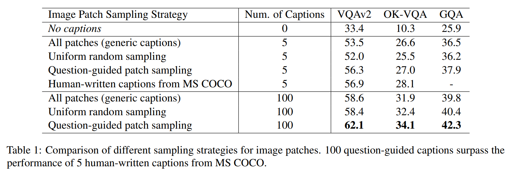
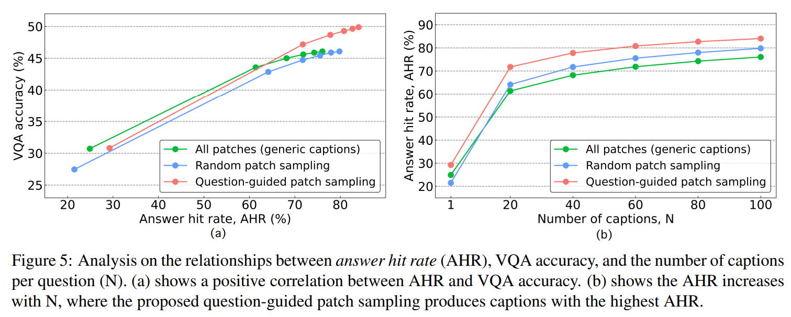
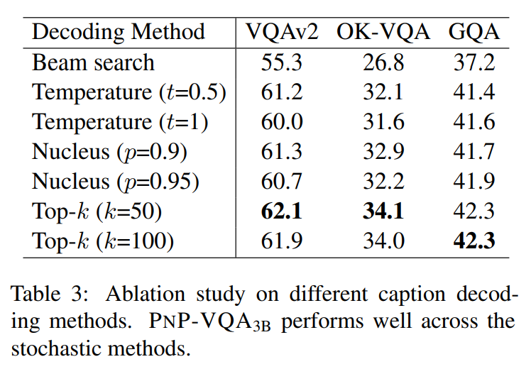
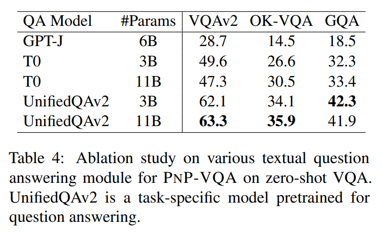

논문 및 이미지 출처 : <https://arxiv.org/pdf/2210.08773>

# Abstract

visual question answering (VQA) 은 vision 과 language reasoning 의 대표적 과제이며, zero-shot setting 에서 특히 challenging 하다. 

본 연구는 zero-shot VQA 를 위한 modular framework 인 **Plug-and-Play VQA (PNP-VQA)** 를 제안한다. 

대부분의 기존 연구가 pretrained language model (PLM) 을 vision modality 에 적응시키기 위해 상당한 양의 추가 adaptation 을 요구하는 것과 달리, PNP-VQA 는 PLM 의 추가 training 을 전혀 요구하지 않는다. 대신 natural language 와 network interpretation 을 pretrained model 들을 연결하는 intermediate representation 으로 사용한다. 

저자는 먼저 question-guided informative image caption 을 생성하고, 이 caption 을 question answering 을 위한 context 로 PLM 에 전달한다. 

end-to-end training baseline 을 능가하며, PNP-VQA 는 zero-shot VQAv2 와 GQA 에서 state-of-the-art 성능을 달성한다. 

11B parameter 환경에서는, PNP-VQA 가 80B-parameter Flamingo model 보다 VQAv2 에서 8.5% 더 높은 성능을 보인다. 738M PLM parameter 환경에서는, PNP-VQA 가 740M parameter FewVLM 대비 GQA 에서 9.1% 향상을 달성한다.

# 1 Introduction

최근 몇 년간 PLM 과 training data 규모의 증가를 기반으로, 특히 zero-shot 및 few-shot setting 에서 다양한 natural language reasoning task 의 성능이 전례 없이 향상되었다. 이러한 성공에 영감을 받아, PLM 을 vision-language reasoning task 에 적용하면 zero-shot 성능 역시 향상될 것이라는 자연스러운 기대가 등장한다.

그러나 vision-language task 에 PLM 을 적용하기 위해서는, 대부분의 기존 방법에서 PLM 을 vision modality 에 맞게 복잡한 adaptation 이 필요하며, 이는 새로운 network component 및 training objective 의 설계를 요구한다. 예를 들어 일부 연구는 PLM 내부에 새 layer 를 추가하여 scratch 부터 training 하거나, frozen PLM 에 question-dependent soft prompt 를 vision encoder 가 출력하도록 training 하거나, vision encoder 와 PLM 에 삽입된 layer 를 함께 training 한다. zero-shot setting 에서는 image captioning 혹은 image-conditioned masked language modeling 등의 vision-language pretraining objective 가 사용된다.

general-purpose AI 관점에서 보면, architecture 변경이나 추가 training 없이, 단지 large-scale pretrained model (foundation model) 들을 재조합하여 새로운 task 를 수행할 수 있다면 매우 바람직하다. 이러한 시스템은 소수의 foundation model 을 재배치(rewiring) 하는 것만으로 unseen task 에도 동적으로 적응할 수 있다. 하지만 end-to-end training 없이 높은 performance 를 얻는 것은 어려운 문제이다.

본 논문은 Plug-and-Play VQA (PNP-VQA) 를 제안하며, 

* 이는 zero-shot visual question answering 을 위해 large pretrained model 들을 **추가 training 없이 결합**하는 framework 이며, zero-shot VQAv2 및 GQA 에서 state-of-the-art 성능을 달성한다. 
* vision 과 language modality 를 연결하기 위해 pretrained vision-language model (PVLM) 을 사용하여 visual information 을 textual caption 으로 변환한다. 
* question-relevant 한 caption 을 생성하기 위해, network interpretability technique 을 적용하여 question 과 관련된 image patch 를 검출한다. 
* 그 후 해당 image patch 에 대해 stochastic caption 을 생성한다. 마지막으로 PLM 을 이용해 caption 으로부터 question 에 답하도록 한다.

cognitive science 및 neuroscience 분야의 연구는 인간의 cognitive system 이 상당히 modular 하다는 것을 시사한다. 예컨대 인간의 low-level cognition 은 빠르고 자율적이며 domain-specific 한 여러 module 로 구성된다는 관점이다. practical 측면에서 modular 설계는 artificial general intelligence 의 각 component 를 독립적으로 교체·업데이트 할 수 있으므로 시스템 유지 및 발전에 유리하다. 

본 논문에서는 PLM 및 PVLM 의 최근 발전과 network interpretability 의 결합을 통해 zero-shot VQA 를 위한 modular design 을 제안한다.

저자의 기여는 다음과 같다:
* zero-shot VQA 를 위한 training-free modular framework 인 PNP-VQA 를 제안하며, pretrained model 의 발전에 따라 PNP-VQA 역시 공동으로 진화할 수 있는 flexibility 를 가진다.
* natural language 뿐 아니라, pretrained LM 과 VLM 을 연결하는 interface 로 network interpretation 을 활용한다. interpretability technique 을 사용해 question-relevant 정보를 폭넓게 담은 image caption 을 생성하여 accurate QA 를 가능하게 한다.
* 다양한 benchmark 에서 state-of-the-art zero-shot VQA 성능을 보여준다. VQAv2 에서 PNP-VQA$_\text{11B}$ 는 extensive end-to-end V-L pretraining 을 적용한 Flamingo$_\text{80B}$ 대비 8.5% 향상되며, GQA 에서 PNP-VQA$_\text{large}$ 는 FewVLM$_\text{large}$ 대비 9.1% 더 높은 성능을 보인다.

# 2 Related Work

large-scale image-text pretraining of neural networks 는 활발한 연구 방향이다. image-conditioned language modeling, masked language modeling, prefix language modeling, image-text matching, image-text contrastive learning 등 다양한 vision-language pretraining task 가 제안되었다. pretraining 이후 일부 model 은 image-text retrieval 및 image captioning 에서 zero-shot capability 를 보인다. 그러나 zero-shot VQA 는 model 의 reasoning ability 에 대한 요구가 높아 여전히 challenging 한 task 로 남아 있다.

zero-shot VQA 를 위해 PLM 을 adapting 하는 방식은 유망한 성과를 보여 왔다. PLM 에 vision information 을 통합하기 위해, 대부분의 기존 방법은 image-text data 에 대한 추가 vision-language training 을 수행한다. 

* *Frozen* 은 vision encoder 를 training 하되 거대한 PLM 은 frozen 상태로 유지하여 question answering 에 필요한 knowledge 를 보존한다. vision encoder 의 output 은 frozen language model 의 prompt 로 사용된다. 
* *FewVLM* 은 prefix language modeling 및 masked language modeling objective 로 PLM 을 fine-tune 한다. 
* *VLKD* 는 finetuning 동안 CLIP 을 teacher 로 사용하여 PLM 에 multimodal knowledge 를 distill 한다. 
* *Flamingo* 는 pretrained vision model 과 PLM 모두에 새로운 layer 를 추가하고, 수십억 개의 image-text pair 에 대해 이 layer 들을 training 한다.

위 접근들과 달리, 

* *PNP-VQA* 는 architectural modification 이나 추가 training 없이 pretrained model 을 직접 활용한다. 
* 가장 유사한 연구는 *PICa* 로, image 를 single caption 으로 변환하고 GPT-3 을 사용해 zero-shot VQA 를 수행한다. 
* 그러나 PNP-VQA 는 question-guided caption 을 multiple 하게 생성하며, encoding 이후 caption 통합(fusion) 을 수행하여 많은 caption 을 효과적으로 활용하고, 그 결과 상당한 성능 향상을 얻는다.

또 다른 orthogonal 연구 방향은 caption 으로부터 생성된 synthetic VQA example 로 VLM 을 training 하는 것이다. 그러나 PNP-VQA 는 추가 training 을 필요로 하지 않는다.

natural language 를 서로 다른 model 간 혹은 reasoning 의 여러 step 사이의 intermediate representation 또는 interface 로 사용하는 전략은 최근 부상한 machine learning 접근이다. 이는 오래전 제안된 아이디어이며, PLM 의 확산과 함께 최근 다시 관심을 얻고 있다. 

* 일부 연구는 natural language description 을 학습하여 image-text matching model 내부의 few-shot classifier 로 활용한다. 
* 다른 연구는 finetuned PLM 으로 intermediate reasoning step 을 생성하거나, 복잡한 문제를 subproblem description 으로 분해하여 PLM 이 hierarchical 하게 해결하도록 한다. 
* 일부 연구는 PLM 의 output 과 input 을 chaining 한다. language-conjoined LM 과 VLM 이 captioning 과 retrieval 은 수행할 수 있으나 VQA 에 대해서는 평가되지 않은 연구도 있다.

이에 비해 PNP-VQA 는 **natural language 와 network interpretation** 을 모두 pretrained model 간 interface 로 사용한다.

# 3 Method

Plug-and-Play VQA (PNP-VQA) 의 중심 아이디어는 pretrained language model 과 pretrained vision-language model 사이에 **training 없이 작동하는 interface** 를 구축하는 것이다. 

저자는 natural language image caption 과 network saliency map 이 효과적인 interface 로 작동함을 보인다. 이상적으로, 생성되는 caption 은 image 에 존재하는 정보 전체를 충분히 coverage 하면서, question 과의 관련성도 갖추어야 한다. 

본 연구는 *saliency map-based interpretability technique* 을 사용해 question 과 가장 관련된 image patch 를 식별하고, 해당 patch 들로부터 caption 을 생성함으로써 relevance 를 확보한다. 또한 relevant image patch 의 random sampling 및 caption 생성 과정의 *token-level stochasticity* 를 주입하여 coverage 를 높인다.

전체 시스템 architecture(Fig. 1) 는 세 가지 module 로 구성된다:

1. question 에 대해 relevant 한 image patch 를 식별하는 **image-question matching module**,
2. 선택된 image patch 집합으로부터 diverse caption 을 생성하는 **image captioning module**,
3. 생성된 caption 과 question 을 입력받아 answer 를 출력하는 **question answering module**.

본 절에서는 세 module 을 상세히 소개한다.

## 3.1 Matching Image Patches and Questions

image 는 풍부한 정보를 포함하지만, 주어진 question 은 특정 object 또는 region 에만 초점을 둘 가능성이 크다. 따라서 PNP-VQA 가 무목적의 generic caption 이 아니라, *question 에 실제로 관련된 region 을 묘사하는 caption* 을 생성하도록 유도한다.

이를 위해 저자는 large-scale pretrained vision-language model 인 BLIP 을 활용한다. 

* BLIP 은 image $v$ 와 text $t$ 간 similarity score $\mathrm{sim}(v, t)$ 를 출력하는 network branch 를 포함하며, 이를 **Image-grounded Text Encoder (ITE)** 라 한다. 
* ITE 는 vision transformer 를 이용해 image 를 encoding 하고, textual encoder 가 cross-attention 을 통해 image feature 에 attend 한다. 
* image encoder 의 입력으로 image 는 $K$ 개 patch 로 균등 분할된다.

question 과 관련된 image patch 를 식별하기 위해, image $v$ 와 question $t$ 를 ITE 에 입력하고, GradCAM 기반 feature-attribution interpretability 기법을 적용한다. 이 기법은 gradient weight 와 cross-attention map 을 결합하여 중요한 patch 를 도출한다.

image patch feature 를 $X \in \mathbb{R}^{K \times D_v}$, textual feature 를 $Y \in \mathbb{R}^{M \times D_t}$ 라 하자. 모든 cross-attention head 에 대해 parameter matrix $W_Q \in \mathbb{R}^{D_t \times D_t}$, $W_K \in \mathbb{R}^{D_v \times D_t}$ 가 존재한다. 

cross-attention score $A \in \mathbb{R}^{M \times K}$ 는 다음과 같이 계산된다:

$$
A
=
\mathrm{softmax}
\left(
\frac{
Y W_Q W_K^\top X^\top
}{
\sqrt{D_t}
}
\right).
\tag{1}
$$

* $A$ 의 $j$ 번째 row 는 $j$ 번째 textual token 이 각 image patch 에 할당한 attention 양을 의미한다. 
* 특정 layer 에서 similarity score 의 gradient $\partial \mathrm{sim}(v,t) / \partial A$ 를 계산하고, 이를 cross-attention score 와 element-wise 로 곱한다. 

image patch $i$ 의 relevance 는 모든 attention head $H$ 및 textual token $M$ 에 대해 다음과 같이 평균한다:

$$
\mathrm{rel}(i)=
\frac{1}{H}
\sum_{j=1}^{M}
\sum_{h=1}^{H}
\max\left(
0,
\frac{\partial \mathrm{sim}(v,t)}{\partial A^{(h)}_{ji}}
\right)
A^{(h)}_{ji},
\tag{2}
$$

* 여기서 $(h)$ 는 attention head index 이다.
* caption 을 생성할 때마다, relevance 에 비례하는 확률로 $K_0$ 개의 image patch 를 sampling 하여 captioning module 에 전달한다.

이 기술의 motivation 은 다음과 같다. 

* attention matrix $A$ 자체가 patch importance 를 나타낼 수 있지만, attention head 간 redundancy 가 크고 많은 head 가 제거되어도 성능 손실이 적다는 연구 결과가 있다. 
  * 이는 일부 attention score 가 informative 하지 않음을 의미한다. 
* GradCAM 에서 영감을 얻어, 저자는 gradient 를 곱하여 실제 similarity 증가에 기여하는 informative 한 attention score 만 강조한다.

Fig. 2 는 generic caption 과 question-guided caption, 그리고 relevance heatmap 예시를 보여준다. question-guided caption 이 더 많은 relevant 정보를 포함하여 올바른 answer 생성에 도움이 됨을 확인할 수 있다.

Table 1 은 서로 다른 patch selection 방법에 따른 zero-shot VQA 성능 변화를 정량적으로 분석한다. 

* question-guided patch sampling 은 전체 patch 를 사용한 generic captioning 및 random patch sampling 을 크게 능가하며, 특히 caption 수가 많은 경우 성능 향상이 더욱 두드러진다. 
* 100 개의 question-guided caption 은 MS COCO 의 human-written caption 5 개보다 VQAv2 에서 5.2%, OK-VQA 에서 6.0% 더 높은 성능을 보이며, 제안 기법의 장점을 보여준다.

## 3.2 Informative Image Captioning

relevant image region 이 주어지더라도, 이를 서술하는 방식은 여전히 여러 가지가 존재할 수 있다. 어떤 description 은 question 에 대한 정답을 포함할 수 있지만, 다른 description 은 그렇지 않을 수 있다. 사전에 answer 를 식별할 수 없으므로, 저자는 가능한 answer space 를 폭넓게 coverage 하기 위해 다양성이 최대화된 caption 을 생성하는 것을 목표로 한다.

이를 위해 BLIP 의 image captioning network branch 를 사용하고, beam search 대신 **stochastic top-k sampling** 을 적용한다. 

* beam search 는 dull 하고 반복적인 caption 을 생성하는 것으로 알려져 있기 때문이다. 
* network input 은 relevance 에 따라 sampling 된 $K_0$ 개의 image patch 이며(§3.1), 저자는 text decoder 의 입력에 “a picture of ” 라는 짧은 prompt 를 prepend 한다. 
* 이러한 방식으로 *한 image 당 $N$ captions* 를 반복 생성하여 caption 의 다양성과 visual content coverage 를 확보한다.
* 또한 repetition 을 방지하기 위해, 새로 생성된 caption 이 이전에 생성된 caption 의 exact substring 으로 포함될 경우 해당 caption 은 폐기한다.

## 3.3 Answering the Question

question-answering encoder-decoder model 은 text-only data 로 pretraining 되어 있으며 text 입력만 처리할 수 있다. 따라서 question 과 생성된 caption 들을 함께 model 의 입력으로 제공한다. §3.2 에서 언급했듯 image captioning module 은 다양한 caption 을 여러 개 생성하므로, 이를 효율적으로 처리하기 위해 **Fusion-in-Decoder (FiD)** 전략을 채택한다.

FiD 전략은 Fig. 3 에 FiE(Fusion-in-Encoder) 와 비교하여 설명된다.

* **FiE 방식**: question 과 모든 caption 을 하나의 long paragraph 로 concatenation 하여 encoder 입력으로 사용한다.
* **FiD 방식**: question 과 각 caption 을 *별도로 encoding* 하고, encoder 가 출력한 token representation 들을 모두 concat 하여 decoder 의 cross-attention 입력으로 사용한다.

self-attention 의 시간 복잡도는 입력 길이에 대해 제곱으로 증가하는 반면, *cross-attention 은 encoder output 길이에 대해 선형*으로 증가한다. 따라서 FiD 는 FiE 보다 훨씬 효율적이다. 또한 FiE 는 encoder 의 positional encoding 으로 인해 maximum input length 제약을 받지만, FiD 는 이러한 제약이 없다. 그 결과 PNP-VQA 는 FiD 를 통해 훨씬 많은 caption 의 이점을 활용할 수 있다.

Fig. 4 는 caption 수에 따른 FiD 와 FiE 의 성능 변화를 나타낸다. 

caption 수가 증가하면 두 방법 모두 초기에는 성능이 향상되지만, FiE 는 encoder 입력 길이 한계를 넘어서는 약 40 caption 부근에서 성능 향상이 정체된다. 반면 FiD 는 caption 수 증가에 따라 성능이 계속 상승한다.

# 4 Experiments

## 4.1 Datasets and Evaluation

저자는 여러 zero-shot VQA benchmark 를 사용한다. 여기에는 VQAv2 의 validation set (214,354 questions) 및 test-dev set (107,394 questions), OK-VQA 의 test set (5,046 questions), GQA-balanced 의 test-dev set (12,578 questions) 이 포함된다. 일부 최근 연구들은 VQAv2 validation set 에 대해서만 평가를 수행하므로, 본 연구 역시 해당 set 을 포함한다.

answer 는 open-ended generation 방식으로 생성하며, exact matching 기반으로 평가한다. VQAv2 및 OK-VQA 에 대해서는 multiple ground truth answer 를 반영하기 위해 soft-accuracy 를 보고하며, GQA 에 대해서는 standard accuracy 를 보고한다.

## 4.2 Implementation Details

image-question matching module 및 image captioning module 을 구축하기 위해 저자는 BLIP 을 사용하며, 이는 129M image-text pair 로 pretrained 된 ViT-L/16 architecture 기반이다. 공개된 BLIP-ITM 과 BLIP-Caption model 은 COCO Captions 2017 train split 에 대해 추가로 finetune 되어 있는데, 이는 VQAv2 및 OK-VQA 와 부분적 overlap 을 가진다. 

data leak 을 방지하기 위해, 저자는 COCO Captions 2014 train split 에 대해 finetune 한다. 이러한 조치는 공개된 BLIP 보다 *추가 training 을 줄이는 방식*임을 강조한다. 

question answering module 로는 diverse textual QA dataset 에 대해 training 된 UnifiedQAv2 를 사용한다. UnifiedQAv2 는 training 동안 visual modality 를 전혀 보지 않았으므로, VQA dataset 과의 overlap 은 존재하지 않는다.

별도 언급이 없는 한, question 당 총 100 개의 caption 을 사용한다. GradCAM 을 위해 ITE network 의 8번째 cross-attention layer 를 선택한다. caption 생성 시 patch sampling 크기는 $K_0 = 20$ 이며, top-k decoding 에는 $k=50$ 을 사용한다.

VQAv2 및 OK-VQA 에 대해서는 FiD 를 적용하며 question 을 caption 하나씩과 함께 encoding 한다. 하지만 GQA 는 compositional visual reasoning 이 필요하므로 더 많은 contextual information 이 유리하여, question 을 5 개 caption 그룹과 함께 encoding 한다.

실험은 8개의 Nvidia A100 GPU 위에서 LAVIS framework 를 사용하여 수행하였다.

## 4.3 Comparison with State of the Arts

저자는 zero-shot VQA 를 open-ended answer generation 문제로 정식화하는 state-of-the-art 방법들과 비교한다. 비교는 pretrained network 를 어떻게 결합(conjoin)하는지를 기준으로 분류된다.

1. Group 1: VE → PLM 으로 결합 + end-to-end VL training

이 그룹의 방법들은 vision encoder(VE) 가 image 를 dense matrix 로 embedding 하고, 이를 PLM 에 전달한다. 이후 image captioning 등의 task 로 end-to-end vision-language(VL) training 을 수행한다.

이 그룹에는 VL-T5no-vqa, FewVLM, VLKD, Flamingo, Frozen 등이 포함된다.

* VL-T5no-vqa, FewVLM: VE 를 freeze 하고 PLM 을 finetune
* Frozen: PLM 을 freeze 하고 VE 를 training
* VLKD: PLM 과 VE 일부를 함께 finetune
* Flamingo: VE 와 PLM 모두에 새 layer 를 추가하고, 대규모 image-text pair 로 training

2. Group 2: caption 을 intermediate representation 으로 사용 (joint training 없음)

이 그룹은 두 foundation model 을 joint training 하지 않으며, image 를 caption 형태의 natural language 로 변환하여 PLM 에 전달한다. 

이 그룹에는 PICa 와 본 연구의 PNP-VQA 가 속한다.

Tab. 2 결과를 정리하면 다음과 같다.

* PNP-VQA 는 VQAv2 와 GQA 에서 기존 모든 방법을 큰 폭으로 능가한다.
  * VQAv2 test-dev 기준, PNP-VQA$_\text{11B}$ 는 두 번째로 좋은 Flamingo$_\text{80B}$ 보다 8.5% 더 높다.
  * PNP-VQA3B 는 Flamingo$_\text{80B}$ 대비 7.2% 더 높으며, 유사 규모의 Flamingo3B 보다 14.3% 더 높다.
  * GQA 기준, PNP-VQA$_\text{large}$ 는 FewVLM$_\text{large}$ 보다 **9.1%** 높으며, end-to-end training 없이 달성한 결과이다.
* OK-VQA 에 대해서는 Flamingo 가 PNP-VQA 보다 성능이 높다. 
  * OK-VQA 는 image 에 존재하지 않는 external knowledge 를 요구하며, 단순히 caption 품질이 좋아도 해결할 수 없는 경우가 많다. 
* 저자는 Flamingo 의 massive VL pretraining 이 image 와 knowledge concept 간 mapping 을 형성하여 OK-VQA 성능을 높였을 것이라고 가정한다. 
  * 그럼에도 PNP-VQA 는 Flamingo 의 거대 training data 없이도 다른 모든 baseline 보다 OK-VQA 에서 우수하다.
* 175B parameter 를 가진 PICa 대비하여, PNP-VQA$_\text{11B}$ 는 18.2% 개선을 보인다.
  * 이 결과는 VL training 없이 pure language model 기반 zero-shot VQA 가 얼마나 어려운지 보여준다. 
* PICa 는 PLM 규모가 175B 임에도 FewVLM$_\text{large}$ 와 유사한 성능을 보이며, 후자는 VL data 로 finetune 되었다. 
  * 반면 billion-scale PLM 을 finetune 하는 것은 computational cost 가 크며 catastrophic forgetting 위험이 존재한다.

PNP-VQA 는 이러한 문제를 피하면서도, 아무 training 없이 billion-scale PLM 을 사용해 VQA 를 수행할 수 있음을 보여주는 새로운 패러다임임이 실험을 통해 확인된다.

# 5 Analysis

## 5.1 Are PNP-VQA captions informative?

직관적으로 caption 이 correct answer 를 포함한다면, QA model 이 정답을 생성할 가능성이 높아진다. caption 의 utility 를 측정하기 위해 저자는 **answer hit rate (AHR)** 를 계산한다. 이는 적어도 하나의 caption 이 ground-truth answer 를 verbatim 형태로 포함하는 question 의 비율이다. yes/no question 은 “yes”, “no” 가 caption 에 거의 등장하지 않으므로 제외한다.

* Fig. 5(a) 는 VQAv2 validation set 에 대해, 세 가지 image patch sampling 방식(질문 기반 sampling, uniform random sampling, 전체 patch 사용)별로 AHR 과 VQA accuracy 사이의 correlation 을 보여준다. 
  * 각 sampling 방식 내에서, AHR 이 증가할수록 VQA accuracy 또한 증가한다. 
  * 이는 caption 이 answer 를 포함할수록 correct answer 생성이 용이하다는 저자의 가설을 뒷받침한다.
* AHR 은 answer accuracy 에 영향을 미치는 모든 요소를 포착하지는 못한다(e.g., 문장 내 answer 의 위치, 등장 횟수 등). 그러나 caption 의 정보 품질을 평가하는 데 쉽고 유용한 지표를 제공한다.
* Fig. 5(b) 는 caption 수 증가에 따른 AHR 변화를 보여준다. 
  * 세 방식 중 question-guided sampling 이 가장 높은 AHR 을 제공한다. 따라서 PNP-VQA 의 우수한 성능은 question-guided caption 이 실제로 correct answer 를 포함하는 비율이 높기 때문이라는 점을 부분적으로 설명할 수 있다. 
  * caption 수가 20 에서 100 으로 증가할 때, question-guided AHR 은 71.8%에서 84.0%로 상승한다. 
    * 이는 PNP-VQA 가 많은 caption 을 활용할 수 있게 하는 Fusion-in-Decoder 의 장점을 보여준다.

## 5.2 How sensitive is PNP-VQA to the caption decoding method?

caption content 은 PNP-VQA 성능에 핵심적이므로, caption decoding 방법의 민감도를 분석한다. 저자는 네 가지 decoding 방법을 비교한다: deterministic beam search 와 세 가지 stochastic 방법–temperature sampling, nucleus sampling, top-k sampling. 각 방법으로 100 개 caption 을 생성하고 Tab. 3 에 결과를 제시한다.

* stochastic decoding 방법들 사이에서는 PNP-VQA 성능이 유사하지만, beam search 는 명확한 성능 저하를 보인다. 
* 분석 결과 beam search 는 반복적이고 다양성이 부족한 caption 을 생성하여 image 의 다양한 측면을 충분히 cover 하지 못하는 것으로 나타났다.

## 5.3 Can PNP-VQA work with other textual QA models?

저자는 question answering module 로 두 가지 PLM 을 추가로 실험한다: T0 및 GPT-J.

* **T0**: multi-task 기반으로 사전학습된 encoder-decoder model
* **GPT-J**: large-scale text corpus 로 사전학습된 decoder-only model

* Tab. 4 결과를 보면, UnifiedQAv2 가 VQA task 에서 T0 및 GPT-J 보다 우수한 성능을 보인다. 
  * 이는 UnifiedQAv2 가 task-specific QA model 로서 textual QA 성능이 뛰어나기 때문이라고 저자는 해석한다. 
  * 결과적으로 zero-shot VQA 에서는 PLM 선택이 매우 중요함을 시사한다. 
* 또한 PNP-VQA 의 modular 한 설계는 향후 더 우수한 PLM 이 등장할 때 이를 쉽게 도입할 수 있는 여지를 남긴다.

# 6 Conclusion

저자는 zero-shot VQA 를 위해 off-the-shelf pretrained model 을 결합하는 **zero-training framework** 인 PNP-VQA 를 제안한다. 

PNP-VQA 는 image-question matching module 로 question 과 관련된 image patch 를 식별하고, image captioning module 이 question-guided caption 을 생성하며, question answering module 이 이를 기반으로 answer 를 생성한다. 

PNP-VQA 는 여러 VQA benchmark 에서 state-of-the-art 성능을 달성한다. 본 연구가 vision-language task 를 해결하기 위한 flexible 하고 modular 한 AI system 개발에 영감을 제공하기를 기대한다.

# 7 Limitations

PNP-VQA 의 장점과 한계는 모두 zero-training modular system 설계에서 비롯된다. PNP-VQA 는 pretrained model 의 강점을 활용하지만, 동시에 해당 model 들의 bias 를 그대로 물려받는다. 

training 이 없기 때문에 효율적이지만, multi-step 과정으로 인해 inference cost 가 증가한다. 그럼에도 저자는 PNP-VQA 의 장점이 한계를 압도한다고 판단하며, pretrained model 의 bias 완화 및 inference 속도 개선을 위한 후속 연구를 환영한다.