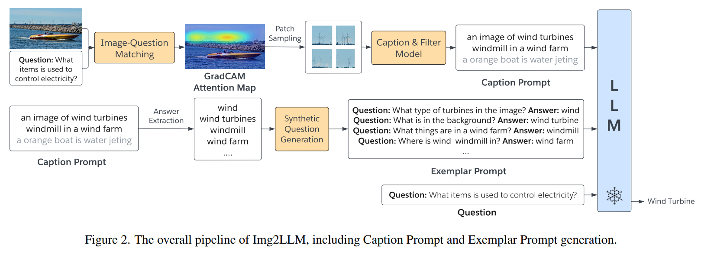
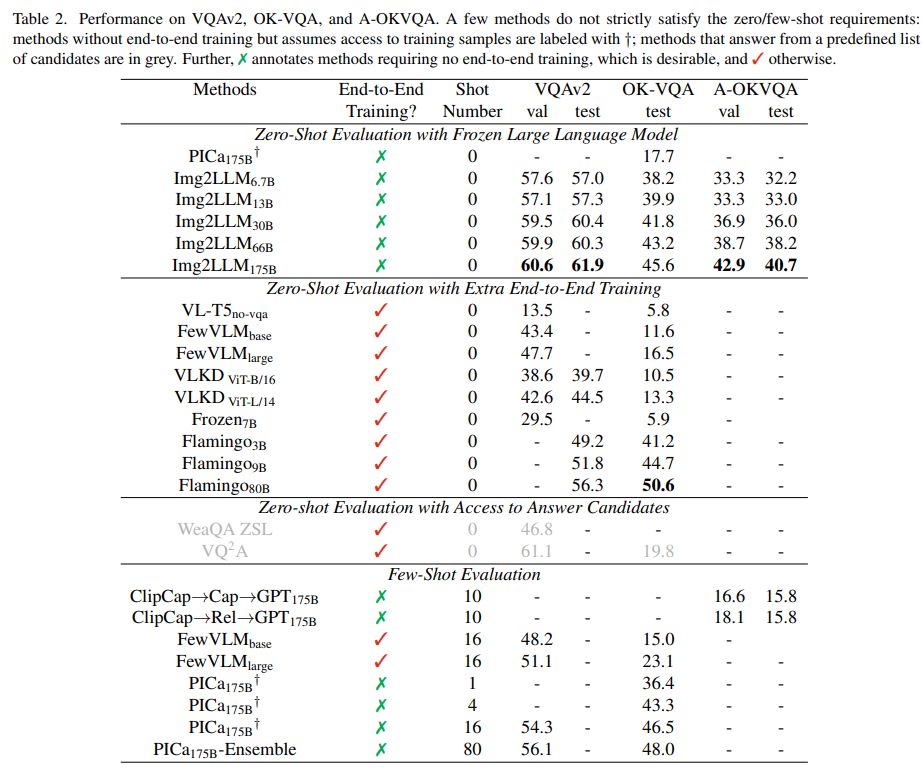

논문 및 이미지 출처 : <https://openaccess.thecvf.com/content/CVPR2023/papers/Guo_From_Images_to_Textual_Prompts_Zero-Shot_Visual_Question_Answering_With_CVPR_2023_paper.pdf>

# Abstract

Large language models (LLMs) 은 새로운 language task 에 대해 뛰어난 zero-shot generalization 을 보여왔다. 그러나 LLM 을 zero-shot visual question-answering (VQA) 에 효과적으로 활용하는 것은 여전히 도전적인 문제로 남아있다. 이는 주로 LLM 과 VQA task 간의 modality disconnect 와 task disconnect 때문이라고 할 수 있다. Multimodal data 에 대한 end-to-end training 은 이러한 disconnect 를 완화할 수 있지만, 유연성이 떨어지고 computation cost 가 매우 크다.

이 문제를 해결하기 위해 저자는 **Img2LLM** 을 제안한다. 이는 plug-and-play module 로서, end-to-end training 없이도 LLM 이 zero-shot VQA task 를 수행할 수 있도록 LLM prompt 를 제공한다. 저자는 LLM-agnostic model 을 개발하여 image content 를 exemplar question-answer pair 로 기술하고, 이를 효과적인 LLM prompt 로 활용한다.

Img2LLM 은 다음과 같은 이점을 제공한다:

* End-to-end training 에 의존하는 방법들보다 동등하거나 더 나은 성능을 달성한다. 예를 들어, VQAv2 에서 Flamingo 보다 5.6% 높은 성능을 보인다. 또한 도전적인 A-OKVQA dataset 에서 저자의 방법은 few-shot 방법보다 최대 20% 더 우수한 성능을 보인다.
* 다양한 LLM 과 유연하게 연결되어 VQA 를 수행할 수 있다.
* End-to-end finetuning 을 통한 LLM 의 특수화를 제거하고, highly specialized LLM 을 end user 에게 제공할 필요가 없어져 비용을 절감할 수 있다.

# 1. Introduction

Visual question answering (VQA) 는 시각장애인이 주변 환경을 이해하도록 돕는 것과 같은 다양한 실제 응용을 가진 대표적인 vision-language task 이다. 지금까지 다양한 VQA dataset 이 제안되었는데, 일부는 image recognition 에 초점을 맞추고, 다른 일부는 logical reasoning 에 초점을 맞춘다. 그러나 human annotation 은 비용이 많이 들고 다양한 human bias 를 유발할 수 있어 VQA system 이 새로운 답변 스타일과 질문 유형에 취약하게 된다. 이러한 문제로 인해 ground-truth question-answer annotation 을 필요로 하지 않는 zero-shot VQA 방법들이 제안되었고, 이를 통해 보다 generalizable VQA system 이 가능해졌다.

최근 large language models (LLMs) 은 in-domain data 가 전혀 없는 상황에서도 task 수행, logical reasoning, commonsense knowledge 활용 등의 능력을 보여주었다. 이에 따라 최근 접근법들은 zero-shot VQA 를 위해 LLM 을 활용하고 있다. 그러나 LLM 을 VQA task 에 적용하는 것은 단순하지 않다. 그 이유는 (1) vision 과 language 간의 modality disconnect 와 (2) language modeling 과 question answering 간의 task disconnect 때문이다. 일반적인 접근법은 vision encoder 와 LLM 을 함께 finetune 하여 vision 과 language representation space 를 정렬하는 것이다. 하지만 이는 막대한 computation 및 data cost 를 요구한다. 예를 들어, Flamingo 는 수십억 개의 image-text pair 를 사용해 수천 개의 TPU 로 finetune 을 수행한다. 게다가 finetuning 은 vision encoder 와 LLM 사이의 강한 상호 의존성을 초래하여, 새로운 버전의 LLM 으로 교체할 때 전체 model 을 다시 고비용 training 해야 한다.

이에 반해, 저자는 LLM 을 end-to-end 로 VQA system 에 통합하는 대신, frozen off-the-shelf LLM 에 기반한 modular VQA system 을 제안한다. 이는 두 가지 장점을 가진다. 

1. deployment cost 를 줄이고 과정을 단순화할 수 있다. 
2. LLM upgrade 가 용이하다. 그러나 end-to-end training 없이 modality disconnect 와 task disconnect 를 해소하는 것은 도전적이다. 
   * PICa 는 이미지를 caption 으로 변환하고, training data 로부터 얻은 exemplar QA pair 를 LLM 의 prompt 로 제공한다. 
   * 하지만 이는 annotation 된 training data 의 존재를 전제로 하며, few-shot exemplar 선택에 따라 성능이 민감하게 변한다.

저자는 **Img2LLM** 을 제안한다. 

* 이는 plug-and-play module 로서 off-the-shelf LLM 이 zero-shot VQA 를 수행할 수 있도록 한다. 
* Img2LLM 의 핵심 통찰은 vision-language model (e.g., BLIP) 과 question-generation model 을 활용하여 image content 를 synthetic QA pair 로 변환하고, 이를 LLM prompt 의 일부로 제공하는 것이다. 
* 이러한 exemplar QA pair 는 이미지 내용을 언어로 설명함으로써 modality disconnect 를 해소하고, LLM 에 QA task 를 시연함으로써 task disconnect 를 해소한다. 
* 특히, exemplar QA pair 는 전적으로 test image 와 question 에 기반하여 구성되므로, PICa 가 요구하는 few-shot 예제가 필요하지 않다. 
  * 이는 practical zero-shot 환경에서 매우 유리하다. 
* Open-source OPT language model 에 적용했을 때, Img2LLM 은 비용이 큰 end-to-end training 방법들과 비교해 동등하거나 더 우수한 zero-shot VQA 성능을 달성한다.

본 논문의 기여는 다음과 같다.

* 저자는 Img2LLM 을 제안한다. 이는 현재 주어진 image 와 question 만으로 synthetic QA pair 를 생성하는 plug-and-play module 이다. Img2LLM 은 language 와 vision 간의 modality disconnect 와, language modeling 과 VQA 간의 task disconnect 를 동시에 해소한다.
* Img2LLM 은 off-the-shelf LLM 이 zero-shot VQA 를 수행할 수 있게 하며, 비용이 큰 end-to-end training 이나 특수한 textual QA network 를 필요로 하지 않는다. 따라서 저비용, 유연한 model deployment 와 손쉬운 LLM upgrade 가 가능하다.
* 실험 결과, Img2LLM 을 장착한 OPT model 은 end-to-end trained model 과 비교해 경쟁력 있는 성능을 보이며, 일부 경우에는 더 우수하다. 예를 들어, VQAv2 에서 Flamingo 보다 5.6% 더 높은 성능을 달성하며, 다수의 few-shot VQA 방법보다도 성능이 뛰어나다.

# 2. Related Work

## 2.1. Recent Advances in VQA Methods

Visual Question Answering (VQA) 는 주어진 image 를 기반으로 natural language question 에 답해야 하는 multi-modal evaluation benchmark 로, 활발한 연구의 초점이 되어왔다. 최근 몇 년 동안 large-scale image-text pretraining 과 그 후 VQA dataset 에 대한 finetuning 을 통해 성능이 빠르게 향상되었다. Knowledge-based VQA 를 다루기 위해 최근 연구들은 ConceptNet, Wikipedia 와 같은 external knowledge 를 통합하기도 했다. 그러나 실험 결과, 이러한 방법들은 여전히 복잡한 reasoning 을 필요로 하는 질문에는 어려움을 겪고 있음이 보고되었다.

## 2.2. LLM for Zero/Few-Shot VQA Tasks

Large language models (LLMs) 는 web-scale corpus 로 학습되어 natural language 이해와 reasoning 에서 강력한 성능을 보인다. 일반적으로 LLM 은 task data 에 대해 target token 을 autoregressive 하게 생성한다. 구체적으로, prompt $C$ 와 task input $x$ 가 주어졌을 때, LLM 은 $Y = \{ y_i \}_{i=1}^n, \quad y_i = \arg \max p_\theta(y_i \mid y_{<i}, C, x)$ 를 생성하며, 여기서 $\theta$ 는 model parameter 를 의미한다. LLM 을 활용한 기존 VQA 방법들은 크게 **multi-modal pretraining** 과 **language-mediated VQA** 두 가지 범주로 나뉜다.

* **Multi-modal pretraining**
  이 접근법은 vision 과 language embedding 을 정렬하기 위해 추가 alignment module 을 학습한다 (Fig. 1(a)). LLM 은 너무 커서 효율적으로 finetune 하기 어렵기 때문에, 일부 연구는 visual encoder 만 finetune 하거나, Flamingo 와 같이 cross-modality interaction 을 학습하기 위해 cross-attention layer 를 추가 학습한다. 그러나 이 paradigm 은 두 가지 단점이 있다:
  1. **Compute-inefficient**. Vision backbone 과 LLM 을 함께 정렬하는 것은 막대한 연산 자원이 필요하다. 예를 들어, Flamingo 학습에는 1536 TPUv4 가 2 주간 필요하다. 따라서 다른 LLM 으로 전환하는 것이 사실상 불가능할 정도로 비용이 크다.
  2. **Catastrophic forgetting**. Visual model 과 함께 joint training 하면 alignment 단계가 LLM 의 reasoning 능력을 저해할 수 있다.
* **Language-mediated VQA**
  이 접근법은 vectorized representation 대신 natural language 를 image 의 intermediate representation 으로 사용하여, 고비용 pretraining 을 요구하지 않는다 (Fig. 1(b)). 즉, 현재 image 를 language description 으로 변환하고, 이를 in-context exemplar 와 함께 frozen LLM 에 입력한다. Few-shot setting 에서 PICa 는 image caption 을 생성하고 training data sample 을 in-context exemplar 로 선택하지만, exemplar 가 생략되면 성능이 크게 저하된다. 동시에 제안된 zero-shot 접근법은 question-relevant caption 을 생성한다. 그러나 zero-shot 조건에서는 in-context exemplar 를 제공할 수 없으므로 in-context learning 의 이점을 활용할 수 없다. 그 결과, UnifiedQAv2 와 같은 QA-specific LLM 에 의존해야 높은 성능을 얻을 수 있다.

# 3. Method

LLMs 를 zero-shot VQA 에 효과적으로 활용하는 데에는 주로 두 가지 장애가 존재한다. (i) **Modality disconnection**: LLM 은 이미지를 직접 처리하지 못하며, visual information 을 LLM 이 처리할 수 있는 형식으로 변환하는 것은 도전적이다. (ii) **Task disconnection**: LLM 은 일반적으로 generative 또는 denoising objective 를 기반으로 language modeling task 에 대해 pretrain 되어 있다. 따라서 LLM 은 question answering 또는 VQA task 자체를 알지 못하며, 답변을 생성할 때 contextual information 을 충분히 활용하지 못한다.

Language-mediated VQA 접근법에서는 (§2.2), modality disconnection 을 dense vector 대신 intermediate language description 으로 변환함으로써 해결한다. 그러나 task disconnection 은 few-shot in-context exemplar 또는 textual QA 에 직접 finetune 된 LLM 을 필요로 한다. 따라서 zero-shot 환경에서 generic LLM 의 task disconnection 을 어떻게 다룰 수 있는지는 명확하지 않다.

저자는 이 문제를 해결하기 위해 새로운 zero-shot 기법 **Img2LLM** (Fig. 1(c)) 을 제안한다. 

* Img2LLM 은 image-relevant exemplar prompt 를 LLM 에 제공한다. 
* question $Q$ 와 이미지가 주어졌을 때, 저자의 핵심 아이디어는 현재 이미지로부터 synthetic QA pair 를 in-context exemplar 로 생성하는 것이다. 
* 이 exemplar 는 LLM 에게 QA task 자체를 시연할 뿐만 아니라, 이미지의 내용을 전달하여 question $Q$ 에 답할 수 있도록 한다. 즉, 한 번에 두 가지 문제(modality disconnection 과 task disconnection)를 해결한다. 
* Img2LLM 은 LLM-agnostic 으로, off-the-shelf LLM 의 knowledge 와 reasoning 능력을 활용할 수 있어 강력하면서도 유연한 zero-shot VQA 해법을 제공한다.

## 3.1. Answer Extraction

이미지 내용을 in-context learning 의 exemplar 에 통합하기 위해, 주어진 VQA image 로부터 synthetic question 의 잠재적 답변으로 사용할 수 있는 단어를 먼저 추출한다. 저자는 off-the-shelf question-relevant caption generation module (§3.3) 을 사용해 여러 caption 을 생성한다. 이어서 noun phrase (named entity 포함), verb phrase, adjective phrase, number, "yes", "no" 와 같은 boolean type 단어를 잠재적 answer 로 추출한다. Fig. 2 와 Appendix A.3 에 일부 예시가 제시되어 있다.

## 3.2. Question Generation

추출된 answer candidate 집합 ${\hat{a}*j}*{j=1}^U$ 가 주어졌을 때, 저자는 question generation network 를 사용하여 각 answer candidate 에 대한 구체적 질문을 생성한다. 본 논문에서는 template-based 방법과 neural 방법을 모두 실험하였다. 중요한 점은, zero-shot 조건을 위반하지 않기 위해 본 방법은 오직 textual data 만 사용하며 어떠한 VQA data 도 사용하지 않는다는 것이다.

* **Template-based Question Generation**
  Off-the-shelf parser 를 이용해 각 answer 의 part-of-speech 를 얻고, POS type 별로 특정 질문 template 을 설계한다. 예를 들어, noun answer 의 경우 "What object is in this image?" 를 사용하고, verb answer 의 경우 "What action is being taken in this image?" 를 사용한다. 전체 template 목록은 Appendix A.5 에 포함된다.

* **Neural Question Generation**
  최근 연구에서 영감을 받아, 저자는 textual QA dataset 에서 neural question generation model 을 학습하였다. 구체적으로, pretrained T5-large model 을 finetune 하여 answer 로부터 question 을 생성하도록 한다. Model input 은 "Answer: `[answer]`. Context: `[context]`" 로 구성되며, `[answer]` 는 추출된 answer text, `[context]` 는 textual QA dataset 의 context text 이다. Inference 시에는 `[answer]` 를 추출된 answer candidate 로, `[context]` 를 해당 answer 가 추출된 caption 으로 대체한다. Model 은 SQuAD2.0, MultiRC, BookQA, CommonsenseQA, Social IQA 등 다섯 개 textual QA dataset 으로 finetune 된다.

위 과정을 통해 synthetic QA pair 집합 $\{\hat{q}_j, \hat{a}_j\}_{j=1}^U$ 를 얻을 수 있으며, 이를 LLM 의 in-context learning exemplar 로 사용한다. 이 과정은 LLM 이 QA task 를 수행하도록 유도하며, language modeling 과 VQA 사이의 task disconnection 을 해소한다.

미리 결과를 보여주자면, Tab. 1 에서 exemplar QA pair 의 효과를 확인할 수 있다. 세부 instruction 은 §3.4 에 설명된다. Exemplar QA prompt 는 caption 만 사용하는 경우보다 훨씬 나은 성능을 보이며, 이는 LLM pretraining 과 VQA task 사이의 task disconnection 을 해소하는 데 효과적임을 보여준다. 또한 exemplar prompt 는 image 의 많은 내용을 이미 설명하므로, caption 을 추가해도 새로운 정보가 거의 없고 성능 향상은 제한적이다.

## 3.3. Question-relevant Caption Prompt

Synthetic exemplar QA pair 와 더불어, 저자는 question-relevant image caption 도 LLM 에 제공한다. 질문은 종종 image 내 특정 object 나 region 을 대상으로 하지만, 기존 network 가 생성하는 generic caption 은 관련 정보를 포함하지 않을 수 있다. 예를 들어, Fig. 2 의 질문 “What items are spinning in the background which can be used to control electricity?” 는 wind turbine 과만 관련이 있다. 그러나 전체 image 로부터 생성된 caption 은 눈에 띄는 orange boat 에 초점을 맞출 가능성이 높아, LLM 이 질문에 답할 수 있는 정보가 부족하게 된다. 이를 해결하기 위해, 저자는 image 의 question-relevant 부분을 대상으로 caption 을 생성하여 LLM 의 prompt 에 포함시킨다.

이를 위해 먼저 BLIP 의 Image-grounded Text Encoder (ITE) 를 사용하여 image region 과 textual question 의 유사도 점수 $\text{sim}(v, q)$ 를 계산한다. 이어서 GradCAM 을 활용하여 주어진 질문과 매칭되는 image region 을 coarse localization map 으로 생성한다. 간단히 말해, GradCAM 은 Transformer network 의 cross-attention score 에 대한 ITE similarity function $\text{sim}(v, q)$ 의 gradient 를 활용하여 cross-attention score 를 보정한다.

Patch relevance $r$ 을 얻은 후, patch relevance $r$ 에 비례하는 확률로 image patch subset 을 sampling 한다. Sampling 된 image patch 로부터 caption 을 생성할 때는 text decoder 에 짧은 prompt (“a picture of,”) 를 함께 제공하고, top-k sampling 을 통해 caption 을 생성한다. 이를 각 image 에 대해 $M$ 번 반복하여 $M$ 개의 다양한 caption 을 생성한 뒤, 다른 caption 의 substring 인 경우는 제외한다.

그러나 top-k sampling 의 비결정적 특성 때문에 caption model 이 noisy caption 을 생성할 수 있으며, 이는 성능에 부정적 영향을 미칠 수 있다. 이를 방지하기 위해, 저자는 ITE 를 사용하여 생성된 caption 과 question-relevant image patch 간의 유사도를 계산하고, similarity score 가 0.5 미만인 caption 은 제거한다. 전체 과정은 question-relevant 하면서도 다양하고 noise 가 적은 synthetic caption 을 산출하며, visual 정보와 language 정보 사이의 연결고리를 제공한다.

## 3.4. Prompt Design

저자는 synthetic question-relevant caption 과 QA pair 를 결합하여 LLM prompt 를 구성한다. Prompt 는 instruction, caption, QA exemplar 로 이어붙인다. Instruction 은

* **Instruction text**: “Please reason the answers of question according to the contexts.”
* **Caption prompt**: “Contexts: `[all captions]`”
* **QA exemplar**: “Question: `[question]` Answer: `[answer]`”

형태로 작성된다. 마지막에 현재 question 을 배치하며,

* **Current question**: “Question: `[question]`. Answer:”

형태로 마무리한다. 최종 답변은 LLM 에 greedy decoding 을 수행해 얻으며, Flamingo 와 같이 의미 없는 token 은 제거한다.

또한, LLM 의 입력에는 최대 길이 제한(e.g., OPT, GPT-3 의 경우 2048 token) 이 있기 때문에, question-relevant caption 과 QA pair 의 subset 을 선택하여 prompt 를 구성해야 한다. 이를 위해, 먼저 100 개의 caption 을 생성하고 synthetic answer candidate 의 등장 빈도를 집계한다. 이어서 등장 빈도가 가장 높은 30 개 answer candidate 를 선택하고 각각에 대해 질문을 생성한다. 또한, 등장 빈도가 가장 낮은 30 개 answer candidate 와 각 answer 를 포함하는 caption 도 함께 포함시킨다. Caption selection 전략에 대한 분석은 §4.5 에 제시된다.

# 4. Experiment

본 섹션에서는 먼저 Img2LLM 의 효과를 검증하기 위해 다른 zero-shot 및 few-shot VQA 방법과 비교한다. 이어서 prompt pattern 과 caption selection 전략 등 중요한 설계 선택에 대한 ablation study 를 수행하여 그 영향을 분석한다. 또한 qualitative example 을 제시하고, 관찰된 실패 사례에 대한 논의를 포함한다.

## 4.1. Environment Setup

#### Datasets

저자는 Img2LLM 을 VQAv2, OK-VQA, A-OKVQA dataset 에서 검증한다. 

이들은 perception, reasoning, commonsense 를 필요로 하는 질문들을 포함한다. VQAv2 는 validation set 에 214,354 개, test-dev set 에 107,394 개의 질문을 포함한다. OK-VQA 는 5,046 개의 test question, A-OKVQA 는 1,100 개의 validation question 과 6,700 개의 test question 을 포함한다.

#### Implementation details

Question-relevant caption prompt 를 얻기 위해 BLIP 을 사용하여 caption 을 생성하고 image-question matching 을 수행한다. 이어 BLIP image-grounded text encoder 의 cross-attention layer 로부터 GradCAM 을 생성하여 question-relevant region 을 localization 한다. GradCAM 기반으로 $K’=20$ 개의 image patch 를 sampling 하고, 이를 사용해 100 개의 question-relevant caption 을 생성한다. LLM 으로는 open-source OPT model 의 여러 사이즈를 주로 사용한다. Ablation study 에서는 다양한 다른 LLM 도 실험하여 저자의 방법의 generalization 능력을 보인다. 답변 생성은 LLM 의 autoregressive decoding 으로 수행하며, answer list 나 training sample 은 사용하지 않으므로 완전한 zero-shot VQA 를 이룬다. Official evaluation protocol 을 따라 각 dataset 의 VQA score 를 보고한다.

#### Competing methods

비교 대상은 세 가지 범주로 나눌 수 있다.

1. **Zero-shot + frozen LLM**: PICa. 본 연구도 여기에 속하나, PICa 와 달리 Img2LLM 은 training sample 없이 prompt 를 구성한다.
2. **Zero-shot + multi-modal pretraining**: Flamingo, Frozen, VL-T5, FewVLM, VLKD 등이 있으며, 이들은 large-scale vision-language dataset 이 필요하고 update 비용이 크다. 또한 VQ2A, WeaQA 도 포함되지만, 이들은 answer candidate 접근을 가정하므로 실제 적용성에 제약이 있다.
3. **Few-shot methods**: 비교를 위해 PICa, FewVLM, ClipCap 의 few-shot 결과도 포함한다.

## 4.2. Main Results

주요 정량적 결과는 Tab. 2 에 제시된다. 요약은 다음과 같다.

#### State-of-the-art results on zero-shot evaluation with plug-in frozen LLMs.

* Img2LLM 은 PICa 대비 큰 폭으로 향상된 성능을 보인다 (e.g., OK-VQA 에서 45.6 vs 17.7). 
* PICa 는 frozen LLM 을 사용했지만 prompt 를 구성하기 위해 training sample 이 필요하다. 
* 반면 저자의 방법은 VQA sample 접근 없이 QA pair 를 생성하므로, 완전한 zero-shot 조건을 충족한다.

#### Scaling effect of LLMs and their emergent capabilities on VQA.

* LLM parameter 규모를 6.7B 에서 175B 로 확장하면 dataset 전반에서 3~10 점 성능 향상이 나타난다. 
  * 이는 language modeling 능력이 강할수록 질문 이해가 향상되고 정확한 답변이 가능함을 보여준다. 
* 특히 commonsense reasoning 과 external knowledge 가 필요한 OK-VQA 와 A-OKVQA 에서 이러한 추세가 더욱 명확하다. 
* 또한 LLM scaling 효과는 model 이 충분히 커졌을 때(e.g., 30B 이상) 명확히 드러나며, 소규모 모델(6.7B, 13B)에서는 일관적이지 않다. 
  * 이는 LLM 의 emergent ability 가 language task 에서 보고된 최근 결과와 일치하며, frozen LLM 을 vision(-language) task 에 적용했을 때도 동일한 현상이 처음 확인된 것이다.

#### Competitive performance with end-to-end pretraining and few-shot models.

* Img2LLM 은 대부분의 end-to-end pretrained model 및 few-shot 방법보다 우수하다. 
  * 예를 들어, VQAv2 에서 저자의 방법은 Flamingo-80B (500K TPU-hour 와 수십억 scale dataset 을 사용하여 학습됨) 보다 5.6 점 더 높다. 
* A-OKVQA 에서는 기존 best 모델인 ClipCap 대비 성능을 2 배 이상 개선하였다. 
* 예외적으로 OK-VQA 에서는 Flamingo-9B 보다는 낫지만 Flamingo-80B 와는 비슷한 수준에 도달하지 못했다. 그러나 Img2LLM 은 추가 training cost 없이 강화된 LLM 으로 쉽게 교체 가능하므로, practical VQA system 적용에 더 현실적인 해법이라 할 수 있다.

## 4.3. Experimental Results of Different LLMs

* Tab. 3 은 OPT 이외의 open-source LLM, 즉 GPT-J, GPT-Neo, BLOOM 에 Img2LLM 을 적용한 성능을 보여준다. 
* 결과에 따르면 Img2LLM 은 다양한 LLM 이 zero-shot VQA task 를 수행할 수 있도록 하며, 모든 경우에서 zero-shot PICa 와 Frozen 보다 우수한 성능을 달성한다. 
* 이는 제안된 방법이 서로 다른 LLM 에서도 강력한 generalization 능력을 가진다는 강력한 증거이다.

## 4.4. Analysis on Question Generation Methods

Tab. 4 는 Sec. 3.2 에서 설명한 question generation 전략의 성능을 비교한다. 

세 가지 question generation 기법을 평가했는데, 

* **Image-agnostic**: 다른 image 에서 샘플링된 질문을 사용하는 방식, 
* **Template-based**: POS 에 따라 설계된 template question 을 사용하는 방식, 
* **Neural-based**: neural model 로 생성된 질문을 사용하는 방식이다. 또한 두 가지 synthetic QA selection 전략을 비교한다. 
* **Random**: QA pair 를 무작위로 선택하는 방식.
* **Max Freq.**: caption 에 가장 자주 등장하는 answer candidate 를 선택하고, 해당 synthetic question 을 함께 가져오는 방식이다.

* 세 기법 중 **Agnostic** 이 가장 성능이 낮고, **Neural** 이 가장 높았다. 
  * 그 이유는 QA pair 의 품질 차이에 있다. 
* Agnostic QA pair 는 현재 image 와 무관한 정보를 포함해 LLM 을 혼란시킬 수 있다. 
* Template question 은 언어적 다양성이 부족해 서로 다른 QA 전략을 시연하지 못한다. 
* 반면 Neural 은 가장 관련성 있는 정보를 포함하고 언어적 다양성도 가장 크다. 
* 또한 Max Freq. 기반 QA pair 는 Random 보다 더 나은 성능을 보였다. 이는 caption 에서 가장 빈번하게 등장하는 answer 가 image 의 핵심적이고 중요한 요소를 묘사하기 때문이라고 가정할 수 있다.

저자는 exemplar prompt 의 visual information 품질을 평가하기 위해 **Answer Hit Rate (AHR)** 와 **Answer Noise Rate (ANR)** 를 도입했다.

* AHR 은 QA pair 가 ground-truth answer 를 포함하는 비율이다.
* ANR 은 exemplar prompt 전체 token 수 대비 ground-truth answer 의 비율이다.

* Tab. 7 은 question-relevant caption 기반 exemplar prompt 가 더 높은 AHR 을 가지며, 이로 인해 VQA 성능이 향상됨을 보여준다. 
* 또한 caption filtering 과정이 noisy caption 을 제거하여 더 높은 ANR 을 달성하게 한다. 
* 이는 AHR 과 ANR 모두를 개선하는 것이 prompt 품질과 VQA 성능을 향상시키는 데 중요함을 보여준다.

## 4.5. Ablation on Caption Selection

Tab. 6 은 caption selection 전략의 성능을 비교한다. 

* **Max Frequency** 전략은 가장 자주 등장하는 30 개 answer 를 포함하는 caption 을 선택하고, **Min Frequency** 전략은 가장 드물게 등장하는 answer 를 포함하는 caption 을 선택한다. 
* Exemplar prompt 자체가 이미 가장 빈번한 answer 를 사용하므로 Max Frequency 전략은 추가 정보를 제공하지 못한다. 
* 반대로 Min Frequency 전략은 QA pair 에 포함되지 않은 정보를 제공할 수 있어 성능 향상을 가져온다.

## 4.6. Ablation Study on Prompt Design

LLM prompt 를 구성하는 데 두 가지 선택지가 있다.

1. caption 과 해당 caption 으로부터 생성된 synthetic QA pair 를 연속으로 붙이는 방식이다. 이는 `CQA-CQA-CQA` 로 표현할 수 있으며, 여기서 $C$, $Q$, $A$ 는 각각 caption, synthetic question, synthetic answer 를 의미한다.
2. 모든 caption 을 먼저 제시한 뒤, 이어서 모든 QA pair 를 제시하는 방식으로, `CCC-QAQAQA` 로 나타낼 수 있다.

* 실험적으로(Tab. 5), 두 번째 설계가 첫 번째보다 훨씬 좋은 성능을 보였다. 
* 저자는 첫 번째 설계가 LLM 이 single caption 만 읽고 답변하도록 유도할 수 있다고 가정한다. 
* Prompt 상에서 이 caption 하나에 이미 질문에 필요한 모든 정보가 들어 있기 때문이다. 
* 실제 메커니즘을 정확히 특정하기는 어렵지만, 결과는 QA prompt 와 그 위치가 매우 중요함을 보여준다.

## 4.7. Examples and Failure Case Analysis

Fig. 3 에서는 caption, exemplar prompt, 그리고 예측 결과의 예시 네 가지를 성공 및 실패 사례와 함께 보여준다. 

* Fig. 3(a) 에서는 caption 과 synthetic QA pair 가 "a man is making drinks at a bar" 는 정보를 제공한다. 
* LLM 은 background knowledge 를 활용하여 그의 직업이 bartender 임을 정확히 추론한다. 
* 반면 Fig. 3(c) 에서는 예측이 이해 가능하지만(비록 문법적으로 완벽하지 않더라도), LLM 이 정성적 물리학적 추론을 하지 못하여 정답을 맞히지 못한다. 
* 이러한 결과는 open-ended VQA 에 적절한 commonsense knowledge 를 적용하는 것이 중요함을 보여준다.

# 5. Limitation

제안된 접근법의 한계 중 하나는 image caption 과 QA pair 를 생성하는 과정이 추가적인 inference overhead 를 발생시킨다는 점이다. 8×A100 머신에서, 저자의 구현은 175B OPT inference time 대비 약 24.4% 의 추가 연산 시간을 필요로 한다. Prompt 를 더 짧게 하여 속도를 높이는 대신 정확도를 일부 희생함으로써 overhead 를 줄일 수 있다. 그러나 본 방법은 Flamingo 의 경우처럼 500K TPU hour 이상이 소요되는 고비용 end-to-end multimodal representation alignment 를 피한다는 점에서 여전히 효율적이다.

# 6. Conclusion

본 논문에서는 zero-shot VQA task 를 위해 off-the-shelf large language models (LLMs) 의 knowledge 와 reasoning 능력을 활용할 수 있는 plug-and-play module 인 **Img2LLM** 을 제안하였다. Img2LLM 은 visual information 과 task guidance 를 LLM 이 쉽게 처리할 수 있는 prompt 형식으로 제공한다. 이를 통해 고비용의 end-to-end vision-language alignment 필요성을 제거하며, model deployment 의 유연성을 높이고 비용을 낮춘다.

실험 결과, Img2LLM 은 서로 다른 LLM 이 zero-shot VQA 에서 성능을 발휘하도록 하며, 비싼 end-to-end training 이 필요한 기존 방법과 비교해 동등하거나 더 나은 성능을 달성함을 보여준다.

