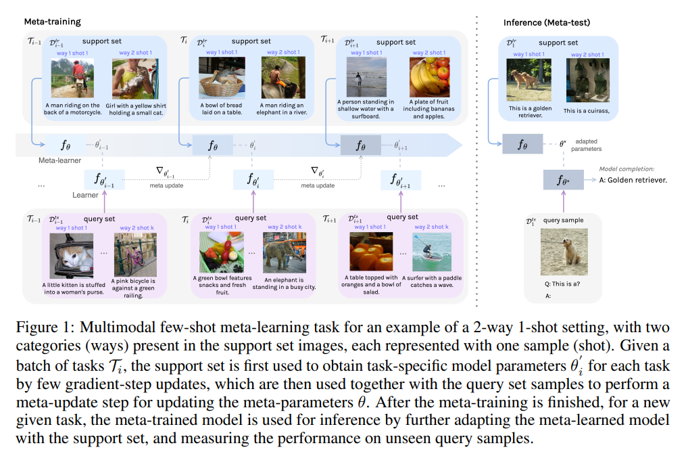
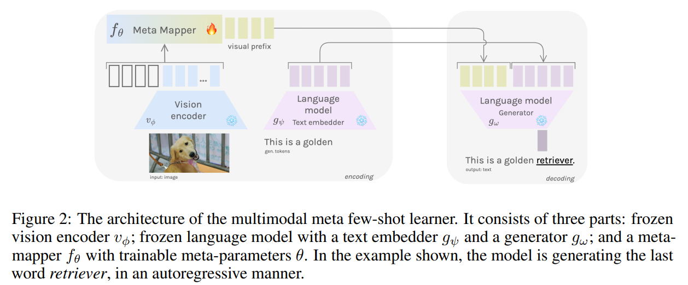
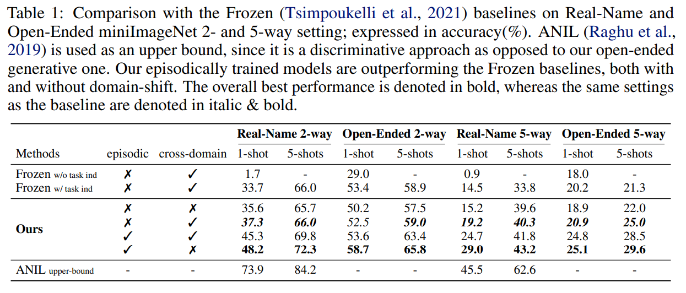
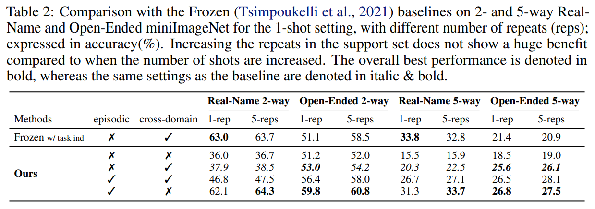
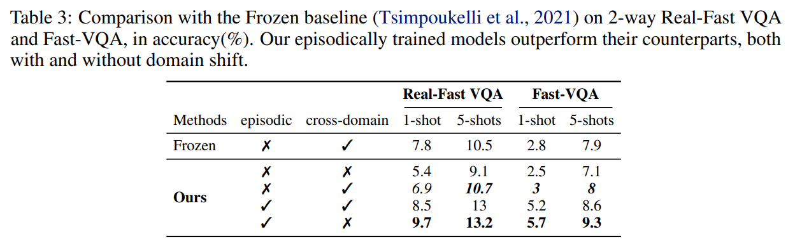
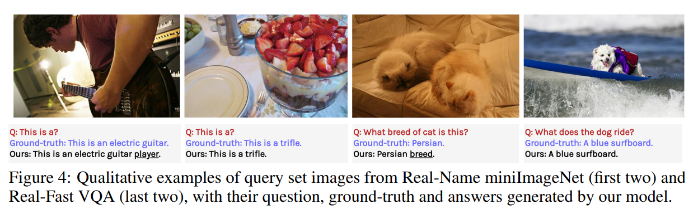
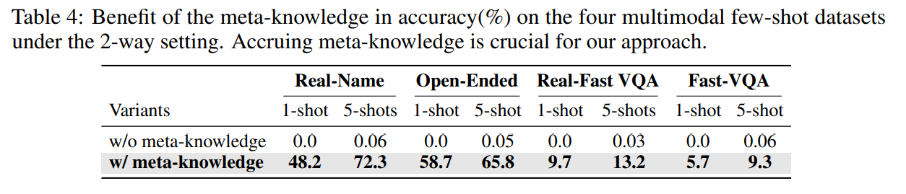
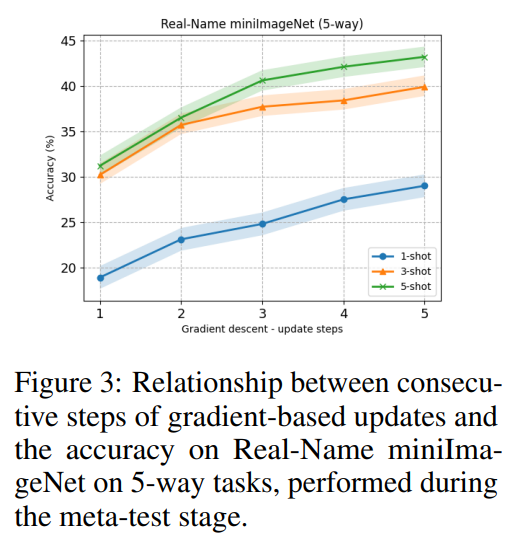
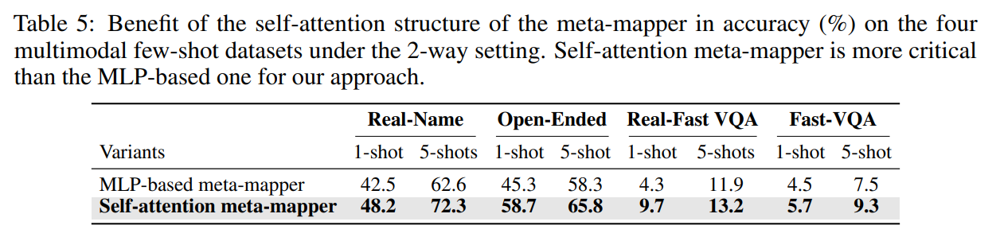
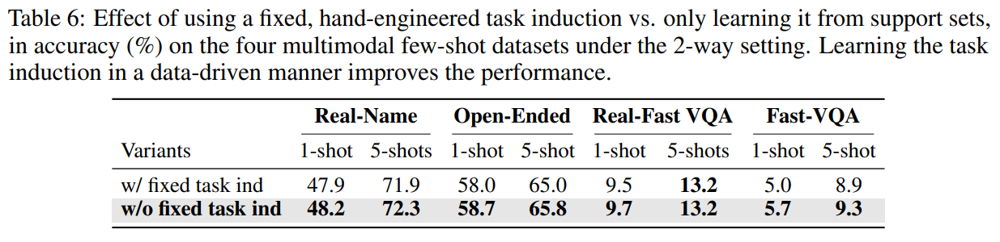

논문 및 이미지 출처 : <https://arxiv.org/pdf/2302.14794>

# Abstract

Multimodal few-shot learning 은 vision 과 language modality 사이의 큰 domain gap 때문에 도전적이다. 기존 방법들은 visual concept 을 prompt 로 frozen language models 에 전달하려고 시도하지만, hypothesis space 를 줄이기 위해 hand-engineered task induction 에 의존한다. 전체 과정을 learnable 하게 만들기 위해, 저자는 **multimodal meta-learning** 접근을 소개한다. 

* 구체적으로, 저자의 접근은 model 의 training 을 서로 관련된 multimodal few-shot task 들의 집합으로 분해한다. 
* 저자는 meta-learner 로 동작하는 **meta-mapper** network 를 정의하여, frozen large-scale vision 및 language models 를 효율적으로 연결하고 이미 학습된 capacity 를 활용한다. 
* Meta-mapper 의 learnable parameter 만을 업데이트함으로써, 이 network 는 이러한 task 전반에 걸친 shared meta-knowledge 를 축적하도록 학습된다. 
* 따라서, few gradient updates 만으로도 새롭게 제시된 sample 에 신속히 적응할 수 있다. 
* 중요하게도, 이 방법은 hand-engineered task induction 이 필요 없는 완전히 data-driven 한 방식으로 task 를 유도한다. 

저자는 최근 제안된 multimodal few-shot benchmark 들에서 접근법을 평가하며, 제한된 수의 labeled example 만을 관찰하고도 model 이 새로운 visual concept 을 단어에 결합하고 visual question 에 답하는 속도를 측정한다. 실험 결과는 저자의 meta-learning 접근이 여러 dataset 과 다양한 training setting 전반에서 baseline 을 능가하면서도 computation 측면에서 더 효율적임을 보인다.

# 1 Introduction

few examples 만 관찰하고도 multimodal 환경에서 빠르게 학습하는 것은 인간 지능의 필수적인 부분이다. 그러나 현재 vision 과 language model 이 multimodal few-shot learning 을 수행할 때 제한된 labeled space 를 다루는 것은 상당히 어렵다. 반면, language-only model 은 지난 수년간 특히 제한된 labeled space 로 전이될 때 크게 발전했는데, 이는 large-scale pre-training 과 거대한 model capacity 덕분이다. 이러한 NLP 분야의 발전은 vision 영역에서도 유사한 시도를 촉발하여, few-shot 및 zero-shot image classification 에서 인상적인 성능을 보이는 large vision model 을 탄생시켰다. 그러나 vision 과 language modality 사이의 큰 domain gap 때문에 이러한 few-shot 능력을 multimodal 설정에 직접 적용하는 것은 간단하지 않으며, 이것이 본 연구의 주요 동기이다.

이 gap 을 메우는 주요 과제 중 하나는 multimodal task sequence 로부터 shared knowledge 를 축적하여 visual concept 을 language model 에 전달하는 적절한 메커니즘을 찾는 것이다. Frozen model 은 in-context learning 이 가능한 language model 에서 영감을 받아 이러한 문제를 해결하려 한 최초의 multimodal few-shot learner 이다. 이 방법은 개방형 image interpretation 에서 hypothesis space 를 줄이기 위해, 문장 형태의 task induction 뒤에 context data sample 을 제공해야 한다. 이는 binary decision 과 같은 단순한 task 에서는 문제가 되지 않지만, 복잡한 task 에서는 task induction 을 매번 hand-engineer 해야 하므로 장애물이 된다. 저자는 task 가 data 자체로부터 완전히 learnable 한 방식으로 유도될 수 있다고 가정한다.

Meta-learning 또는 learning to learn 은 본질적으로 few-shot 환경에 적합한 자연스러운 해결책이다. 

* Meta-learning 은 unimodal 환경, 특히 few-shot image classification 에 대해서는 광범위하게 연구되었지만, multimodal few-shot 환경에서는 거의 탐구되지 않았다. 
* Unimodal 환경과 마찬가지로, multimodal few-shot learner 가 task 간 knowledge 를 축적할 수 있도록 하면, 다양한 task 에 폭넓게 적합한 내부 multimodal representation 을 구축하는 데 도움이 된다. 

이러한 representation 은 서로 다른 modality 간의 bridge 역할을 하며, 제한된 labeled example 만 관찰하고도 새로운 task 를 빠르게 학습하도록 돕는다.

이러한 동기에 기반하여, 저자는 vision 과 language modality 간 gap 을 메우기 위한 새로운 multimodal few-shot meta-learning 접근을 정의한다. 

* 구체적으로, 저자의 접근은 이미 학습된 reasoning capability 를 활용하기 위해 공개적으로 사용 가능한 pre-trained large vision encoder 와 language model 을 frozen 상태로 사용한다. 
  * 이를 통해, 본 방법은 training 중 이들 model 이 요구하는 막대한 computation resource 와 large-scale dataset 의 의존성을 피한다. 
* 기존 multimodal few-shot learner 와 달리, 저자의 접근은 meta-learning 방식에 따라 model 의 training 을 sequential multimodal few-shot task 관찰로 분해한다. 
* Meta-training 단계에서 model 은 lightweight meta-mapper network 를 사용하여 visual representation 을 language model 의 visual prefix 로 변환한다. 
  * 이 network 는 전적으로 self-attention layer 로 구성된 multimodal bridge 역할을 한다. 
  * Meta-mapper 의 목적은 visual representation 을 language model 의 latent space 로 매핑하여, 관련된 task 로부터 shared meta-knowledge 를 수집하는 것이다. 
  * 이후 meta-learning 용어로 inference (또는 meta-test) 단계에서는, model 이 소수의 labeled example 만 관찰하고도 완전히 data-driven 방식으로 task 를 유도할 수 있어 hand-engineered task induction 의 필요성을 완전히 제거한다.

정리하면, 본 연구의 기여는 다음과 같다.

* **Conceptual**: Multimodal few-shot learning 에 meta-learning 을 도입하여 multimodal few-shot task 의 빠른 적응과 효율적인 학습을 가능하게 한다. 이를 위해 기존 dataset 을 재구성하고 적합한 benchmark 를 따르는 새로운 multimodal few-shot learning 설정을 설계한다.
* **Methodological**: Lightweight meta-mapper 를 사용하는 multimodal meta-learner 를 제안하며, 이는 frozen 상태의 large vision 과 language backbone 을 연결하는 방법을 학습한다. 저자의 지식으로는, 이는 multimodal few-shot task 를 해결하는 최초의 meta-learning 기반 model 이다.
* **Empirical**: Frozen backbone 과 작은 trainable meta-mapper 만을 사용하여, 제안한 model 이 benchmark 에서 강력한 multimodal few-shot 성능을 보이며, computation 효율성도 뛰어남을 체계적인 실험을 통해 입증한다.

# 2 Related Work

#### Large-scale language models

Large-scale language model 은 attention 과 Transformer 가 도입되면서 sequence 내 long-range dependency 를 성공적으로 처리하게 되었다. 최근 수년간 이 분야는 큰 발전을 이루었으며, vision 및 multimodal model 에 대해서도 유사한 전략 개발을 촉발했다. 현재 few-shot 시나리오에서 language model 은 prompting 개념을 사용하여 원하는 출력을 생성하도록 유도된다. 이 접근은 소수의 예시와 함께 fixed task induction 을 prompt 로서 앞에 붙이고, 그 뒤 language model 로부터 출력을 생성하는 방식이다. 저자는 in-context learning 으로 알려진 fixed task induction 과 예시의 최적화 대신, meta-learned visual prefix 형태의 context representation 을 최적화하는 것을 목표로 한다.

#### Meta-learning for few-shot learning

Few-shot learning 을 위한 meta-learning 은 제한된 labeled data 로 task 전반에 일반화하는 근본적인 문제를 다룬다. 그 목표는 inductive bias 를 습득하고 새로운 task 에 빠르게 적응하는 것이다. Meta-learning 알고리즘은 일반적으로 다음과 같이 분류된다.

* **Metric-based**: 공통 embedding space 를 학습하고 prototype 을 meta-knowledge 로 도출하는 방식
* **Memory-based**: 외부 memory 를 meta-knowledge 로 사용하여 새로운 task 에 빠르게 적응하는 방식
* **Optimization-based**: task 전반에 걸쳐 좋은 model initialization 을 meta-knowledge 로 학습하여 새로운 sample 에 효율적으로 적응하는 방식

저자의 접근은 modality-agnostic 하면서도 유연성이 큰 마지막 범주(optimization-based)에 속한다.

#### Multimodal few-shot learning

Vision 과 language modality 전반의 multimodal few-shot learning 은 Frozen 의 등장과 함께 최근 부상했으며, 이후 다양한 prompting 및 in-context learning 전략이 제안되었다. Frozen 은 in-context learning 을 수행하며, 이는 multimodal few-shot learning 을 다루는 가능한 접근 중 하나로 간주된다. 최근 제안된 Flamingo 는 700억 개 parameter 의 visual-language model 을 사용하여 유사한 in-context learning paradigm 을 따르며, scale 덕분에 성공을 거두었다. 

저자의 목표는 대규모 model 이 아닌 200만 개 미만의 trainable parameter 를 가진 lightweight model 로 task 전반의 meta-knowledge 를 습득하여 새로운 task 에 빠르게 적응하는 것이다. 이를 위해, 저자는 optimization-based meta-learning 절차를 정의하고, context sample 을 사용해 작은 trainable mapper 를 적응시키고 query sample 에 대해 평가한다.

# 3 Methodology

저자의 목표는 meta-learning 설정에서 제한된 labeled data 로도 새로운 multimodal task 를 학습하고 빠르게 적응할 수 있는 model 을 학습하는 것이다. 이후 섹션에서는 먼저 multimodal meta-learning 설정을 정의하고, 이어서 저자의 architecture 를 설명하며, 마지막으로 이 model 이 training 및 inference 시 어떻게 사용되는지 기술한다.

## 3.1 Problem Formulation

저자의 접근은 meta-learning 방식을 따르는 multimodal few-shot 설정에서 시작된다. 표준 supervised learning 과 달리, meta-learning 에서는 meta-dataset 들의 집합을 다루며, 이를 서로 다른 $\mathcal{D}_{\text{meta-train}}$ 과 $\mathcal{D}_{\text{meta-test}}$ partition 으로 나눈다.

* **Meta-training stage**: model 이 $\mathcal{D}_{\text{meta-train}}$ partition 에서 학습된다.
* **Meta-test stage**: model 의 성능이 $\mathcal{D}_{\text{meta-test}}$ partition 에서 측정된다.

구체적으로, meta-train $\mathcal{D}_{\text{meta-train}}$ set 은 meta-dataset $\mathcal{D}_i$ 로 구성되며, 각 $\mathcal{D}_i$ 는 **inner-train set** $D^{\text{tr}}_i$ (support set) 와 **inner-test set** $D^{\text{ts}}_i$ (query set) 의 쌍을 가진다. 즉,

$$
\mathcal{D}_{\text{meta-train}} = \{(D^{\text{tr}}_1, D^{\text{ts}}_1), \dots, (D^{\text{tr}}_n, D^{\text{ts}}_n)\}
$$

각 meta-dataset 쌍 $(D^{\text{tr}}_i, D^{\text{ts}}_i)$ 을 meta-task $\mathcal{T}_i$ 라 한다.

**$k$-shot, $N$-way 설정**을 고려하면, meta-task $\mathcal{T}_i$ 의 support set $D^{\text{tr}}_i$ 는 $N$ 개 class 각각에 대해 $k$ 개의 labeled sample 을 포함한다. 여기서 $N$ 은 object category 의 개수이며, few-shot 용어에서 ways 라고 부른다. 이때

$$
D^{\text{tr}}_i = \{ (x^i_1, y^i_1), \dots, (x^i_k, y^i_k) \}
$$

여기서 $x^i_j$ 는 image 를, $y^i_j$ 는 caption 을 나타낸다.

Query set $D^{\text{ts}}_i$ 는 다음과 같이 정의된다: $D^{\text{ts}}_i = \{ (x^i_1, q^i_1, a^i_1), \dots, (x^i_m, q^i_m, a^i_m) \}$. 여기서 $x^i_j$ 는 image, $q^i_m$ 은 question 과 같은 optional input text representation, $a^i_m$ 은 그 question 에 대한 answer 와 같은 output text representation 이다.

저자는 task distribution $p(\mathcal{T})$ 를 고려하며, $k$-shot $N$-way 문제에 대한 single batch 의 task $\mathcal{T}_i \sim p(\mathcal{T})$ 는 다음과 같이 sampling 된다.

* 전체 meta-train $\mathcal{D}_{\text{meta-train}}$ 의 sample pool 에서 $N$ 개 object category 를 무작위로 선택
* Support set 은 각 category 당 $k$ 개 sample 선택
* Query set 은 각 category 당 $m$ 개 sample 선택 ($m > k$)

## 3.2 Model Architecture

저자가 제안하는 architecture 는 모듈형 구조로, **vision encoder**, **meta-mapper**, **language model** 의 세 가지 구성 요소로 이루어진다. 이 model 은 완전한 autoregressive 방식으로 학습되므로 downstream generative multimodal task 선택에 유연성을 제공한다.

#### Vision encoder network

Vision encoder 는 $v_{\phi}$ 로 정의되며, 파라미터 $\phi \in \mathbb{R}^{d_v}$ 는 pre-trained vision encoder 로부터 가져온 고정값이다. 입력은 original image $x$ 이고, 출력은 추출된 visual feature 이며, $v_{\phi}(x) = x_1, \dots, x_n$ 으로 표현된다.

#### Meta-mapper network

Multimodal few-shot 환경에서 visual encoding 을 language model 의 latent space 로 매핑하기 위해, 저자는 $l$ 개의 learnable parameter $p_i \in \mathbb{R}^{d_e}$ 를 사용한다. 이들은 language model 의 **visual prefix** 라 불리며, dimension $d_e$ 는 language embedding 과 동일하다. 이 visual prefix 를 encoded visual feature 앞에 붙여, 다음과 같은 sequence 를 생성한다: $[p_1, \dots, p_l, x_1, \dots, x_n]$

이 representation 을 ordered element set 으로 보고, self-attention 을 사용하여 전체를 동시에 인코딩한다. 이를 위해 set multi-head attention block 을 채택하며, trainable meta-parameter $\theta$ 를 가진 meta-mapper 로 정의한다.

$$
\text{MetaMap}_\theta(Q, K, V) = \sigma(QK^\top) \ast V \tag{1}
$$

* 여기서 $QK^\top$ 의 pairwise dot-product 는 feature 간 유사도를 측정하며, 
* activation function $\sigma$ 를 통해 weighting 에 사용된다. 
* 직관적으로, $Q$ 와 $K$ 의 dot-product 가 클수록 $V$ 의 해당 feature 가 더 큰 weight 를 받는다.

Eq. (1)에서 $Q = K = V = [p_1, \dots, p_l, x_1, \dots, x_n]$ 이므로, meta-mapper 의 입력은 feature sequence 이고 출력은 학습된 visual prefix 이다.

$$
p^*_1, \dots, p^*_l = \text{MetaMap}_\theta([p_1, \dots, p_l, x_1, \dots, x_n]) \tag{2}
$$

Self-attention layer 는 sequence 내 element 간 pairwise similarity 를 기반으로 하는 weighting 메커니즘 덕분에, visual feature $x_1, \dots, x_n$ 에서 의미 있는 정보를 추출하고 이를 $p^*_1, \dots, p^**l$ 에 축적할 수 있다. Meta-mapper 의 meta-parameter 는 $D*{\text{meta-train}}$ 내 모든 task $\mathcal{T}$ 에 대해 학습되고 공유된다.

#### Language model

Language model 은 $g_\omega$ 로 정의되며, text sequence $y$ 에 대한 probability distribution 을 매개변수화한다. 이 model 은

* word token $y_i$ 를 word token embedding $t_i$ 로 변환하는 embedding function $g_\psi$, $\psi \in \mathbb{R}^{d_e}$
* Autoregressive text generation 을 수행하는 Transformer block

으로 구성된다.

Language model 은 visual prefix $p^*_1, \dots, p^*_l$ 와 token embedding $t_1, \dots, t_m$ 을 입력받아, autoregressive 방식으로 다음 token 을 예측한다.

$$
t_{i+1} = g_\omega([p^*_1, \dots, p^*_l, t_1, \dots, t_i]), \quad i < m \tag{3}
$$

저자의 접근은 제한된 labeled space 에서 학습하므로, pretrained large-scale language model 의 $\omega$ parameter 를 그대로 초기화하고 frozen 상태로 유지한다.

## 3.3 Meta-Training & Inference

Meta-training 시, 저자는 $p(\mathcal{T})$ 에서 샘플링한 multimodal few-shot learning task $\mathcal{T}_i \sim p(\mathcal{T})$ batch 를 사용한다. 각 task 는 support set $D^{\text{tr}}_i$ 와 query set $D^{\text{ts}}_i$ 로 구성된다.

편의상, Section 3.2 의 full model 을 $f_\theta$ 로 정의하며, 이는 image $x$ 를 입력받아 $y$ 를 출력한다. Training 중 task 별로 최적화되는 loss function 은 cross-entropy loss 이다.

$$
\mathcal{L}_{\mathcal{T}_i}(f_\theta) = \sum_{x^j, y^j \sim D^{\text{tr}}_i} y^j \log f_\theta(x^j) + (1 - y^j) \log (1 - f_\theta(x^j)) \tag{4}
$$

새로운 task $\mathcal{T}_i$ 에 적응할 때, trainable meta-parameter $\theta$ 는 task-specific parameter $\theta'_i$ 가 된다. 이 값은 $N$ 번의 gradient-step update 로 계산되며, 한 번의 update 는 다음과 같다: $\theta'_i = \theta - \alpha \nabla_\theta \mathcal{L}_{\mathcal{T}_i}(f_\theta)$. 여기서 $\alpha$ 는 step size hyperparameter 이다. 이를 **inner-loop update** 라 한다.

다음으로, model meta-parameter $\theta$ 는 query set $D^{\text{ts}}_i$ 와 초기화된 $\theta'*i$ 를 사용해 $f*{\theta'_i}$ 의 성능을 기준으로 최적화된다.

$$
\min_\theta \sum_{x^j, y^j \sim D^{\text{ts}}_i} \mathcal{L}_{\mathcal{T}_i}(f_{\theta'_i}) 
= \sum_{x^j, y^j \sim D^{\text{ts}}_i} \mathcal{L}_{\mathcal{T}_i}(f_{\theta - \alpha \nabla_\theta \mathcal{L}_{\mathcal{T}_i}(f_\theta)}) \tag{5}
$$

이는 **outer-loop optimization** 이며, 모든 task $\mathcal{T}_i$ 에 대해 stochastic gradient descent 로 meta-optimization 이 수행된다: $\theta \leftarrow \theta - \beta \nabla_\theta \sum_{x^j, y^j \sim D^{\text{ts}}_i} \mathcal{L}_{\mathcal{T}_i}(f_{\theta'_i})$. 여기서 $\beta$ 는 outer-loop step size hyperparameter 이다.

Meta-test 단계에서는 이전에 보지 못한 object 가 포함된 새로운 multimodal few-shot task $\mathcal{T}_i$ 를 고려한다. 이 task 는 빠른 적응을 위한 support set $D^{\text{tr}}_i$ 와 성능 평가를 위한 query set $D^{\text{ts}}_i$ 를 포함한다. Query set sample 의 answer 생성은 open-ended autoregressive 방식으로 이루어지며, 특히 image 의 visual prefix 를 기반으로 top-k nucleus sampling 을 사용해 language model 에서 생성한다.

# 4 Experiments

## 4.1 Experimental Setup

#### Datasets

Multimodal few-shot learning 을 위한 meta-learning 설정을 설계하기 위해, dataset 은 Sec. 3.1 에서 설명한 것처럼 task sequence 로 구조화되어야 한다. Frozen 에서 사용된 dataset 들은 이러한 multimodal few-shot dataset 유형의 대표적인 예이며, 각 task 는 labeled instance 몇 개로 이루어진 support set 과 unlabeled instance 로 구성된 query set 을 가진다. 실제로, task 구성이 가능한 object 정보가 존재한다면 어떤 dataset 도 few-shot meta-learning 에 적합하다.

따라서 meta-training 에는 COCO2017 captioning dataset 을 사용하고, 이미지에 존재하는 $N$ 개 object category 를 기반으로 N-way, k-shot 방식의 task 로 재구성한다. Meta-test 에는 Real-Name miniImageNet, Real-Fast VQA, Open-Ended miniImageNet, Fast-VQA 의 네 가지 dataset 을 사용한다. 이들은 visual concept 을 단어에 빠르게 결합하고 새로운 task 에 적응하는 multimodal few-shot learner 의 핵심 특성을 평가한다.

#### Training & inference procedures

두 가지 training 절차를 고려한다.

1. **Non-episodic**: 표준 mini-batch training
2. **Episodic**: 제안 방식으로, multimodal task batch 를 관찰하며 학습

이 두 절차는 training 과 inference 시 발생하는 domain shift 에 따라 두 가지 시나리오로 나뉜다.

* **Cross-domain multimodal few-shot learning**: Training 과 test dataset 의 분포가 다른 경우. 여기서는 COCO2017 에서 (episodic 과 non-episodic 모두로) 학습하고, 전체 multimodal few-shot dataset 에서 성능을 측정한다.
* **In-domain multimodal few-shot learning**: Training 과 test partition 이 같은 domain 인 경우 (표준 meta-learning 설정). 즉, meta-training 과 meta-test task 가 동일한 multimodal few-shot dataset 에서 구성된다.

#### Implementation details

* **Vision encoder**: CLIP + ViT/B-32 backbone, visual feature size = 512
* **Language model**: GPT-2, word embedding size = 768
* **Learnable visual prefix**: 길이 4, dimension 768 (language model 에 맞춤)
* **Meta-mapper 초기화**: Xavier uniform initialization 사용
* **Meta-learning hyperparameter**:
  * Inner-loop gradient update: 5 회
  * Inner-loop learning rate = 0.01
  * Meta-update optimizer: AdamW, meta-learning rate = 0.001
  * Meta-batch 당 task 수 = 4
* 모든 hyperparameter 는 meta-training partition 의 query set (validation 역할) 을 사용하여 조정

#### Computational resources

저자의 model 은 NVIDIA GTX 1080Ti GPU 1 대에서 end-to-end 학습이 가능하며, 2 시간 이내에 완료된다. 이는 lightweight framework 의 장점을 보여준다. Trainable parameter 총 수는 약 200 만 개로, Frozen model 보다 수십 배 작다. 전체 구현은 PyTorch 와 HuggingFace 기반으로 작성되었다.

## 4.2 Results & Discussion

#### Binding of visual concepts and words

Real-Name 및 Open-Ended miniImageNet 실험은 multimodal meta-learner 가 visual concept 을 단어에 얼마나 잘 결합할 수 있는지를 측정한다. Tab. 1 은 두 dataset 에서 1-shot 및 5-shot, 2-way 및 5-way accuracy 를 보여준다.

* 저자의 multimodal meta-learner 는 engineered task induction 없이도 Frozen 보다 훨씬 높은 성능을 보였다. 
  * 이는 vision encoder 출력 단순 재구성 대신, **meta-learned visual prefix** 를 사용하여 language model 에 연결하는 접근의 장점을 보여준다.
  * Meta-learned prefix 는 task 내 관련 instance 로부터 shared meta-knowledge 를 수집하여, engineered task instruction 없이도 learnable 한 방식으로 search space 를 좁히는 데 도움을 준다. 
  * 이러한 adaptable component 는 모델이 명시적인 지시 없이도 새로운 visual concept 에 더 쉽게 적응하도록 만든다.
* 또한 Frozen 과 마찬가지로, 2-way 및 5-way 설정 모두에서 shot 수가 증가하면 성능이 향상되는 경향을 보였다. 
  * 이는 task 의 다양한 예시가 많을수록 성능이 향상된다는 점을 확인시켜 준다. 
* 저자는 open-ended 접근이 사전에 정의된 closed set 개념에 의존하지 않고 visual concept 에 대해 자유롭게 reasoning 할 수 있는 유연성 덕분에 유망하다고 본다. 그러나 open-ended text generation 은 finite set 을 사용하는 기존 classifier (e.g., ANIL) 에 비해 hypothesis space 가 훨씬 크므로, 직접적인 공정 비교는 불가능하며, 이들의 결과를 upper bound 로 참고한다.

#### Increasing the number of repeats of support samples

추가 분석으로, meta-test 시 support set 내 각 shot 의 반복 횟수를 변경하여 실험했다. 

* Tab. 2 에 따르면, support set 반복 횟수를 늘리는 것은 distinct shot 수를 늘리는 것만큼의 효과를 보이지 않았다. 
* 이는 meta-learner 가 동일 이미지를 여러 번 보는 것보다, 서로 다른 이미지를 한 번씩 보는 것이 더 많은 meta-knowledge 를 축적할 수 있음을 의미한다. 
* 반면, Frozen 은 engineered task induction 과 결합되므로, 이러한 반복으로부터 더 큰 이득을 얻는다.

#### Visual question-answering with limited labeled samples

Real-Fast 와 Fast-VQA 2-way benchmark (Tab. 3, 1-shot 및 5-shot) 실험의 목적은 multimodal meta-learner 가 이미지 내 객체에 대해 더 복잡한 질의를 얼마나 잘 처리할 수 있는지를 평가하는 것이다. 이 실험은 간접적으로 visual concept 과 단어의 결합 능력을 테스트하는데, query sample 이 query image 내에 support set 의 두 category 를 모두 포함하도록 설계되고, 질문은 그 중 하나에 대해 제기되기 때문이다. 또한, meta-learner 가 명시적으로 해당 능력에 대해 meta-training 되지 않았음에도, 특정 객체 속성에 대해 reasoning 할 수 있는지를 중점적으로 본다.

결과에서 확인할 수 있듯이, 저자의 multimodal meta-learner 는 Frozen baseline 대비 향상된 성능을 보였으며, 이는 task 전반에서 meta-knowledge 를 축적하는 접근의 이점을 다시 한 번 입증한다. Shot 수가 증가할 때 성능이 상승하는 경향도 동일하게 관찰되었다.

#### Episodic training of multimodal few-shot learners

* Tab. 1 과 Tab. 3 에서 또 하나의 중요한 관찰은 **episodic training** 이 전체 성능을 향상시킨다는 점이다. 
* 이는 standard supervised learning 과 마찬가지로, training 과 inference 조건이 일치하기 때문이다. 
* 구체적으로, inference 시 사용되는 multimodal few-shot dataset 은 task 단위로 구성되므로, training 시에도 task 를 관찰하는 형태로 학습하면 성능이 개선된다.

#### Learning across domains

Tab. 1 과 Tab. 3 은 cross-domain multimodal few-shot 설정의 더 어려운 측면을 보여준다. COCO2017 captioning dataset 에서 meta-training 을 수행하면, multimodal few-shot dataset (caption 이 더 단순함) 에서 학습할 때보다 더 풍부한 의미적 설명과 함께 visual concept 을 결합하는 데 도움이 된다.

그러나 Frozen 과 동일하게 따르는 평가 절차에서는 모델이 정답과 **완전히 동일한 단어**를 생성해야 하며, 단어의 paraphrasing 은 오답으로 처리된다. 따라서 COCO2017 로 meta-training 한 모델은 miniImageNet 기반 dataset 으로 전이할 때 정량적인 accuracy 는 낮게 나타날 수 있다. 하지만 많은 경우, 생성된 문장은 질적으로 더 낫고 세부적이며, 이에 대해서는 다음 단락에서 논의한다.

#### Qualitative analysis

Fig. 4 에는 Tab. 1 과 Tab. 3 에서 최고의 성능을 낸 저자 접근법 버전이 inference 시 생성한 query image, 질문, 답변 예시가 제시된다. 

* 예시에서 multimodal meta-learner 가 visual concept 을 단어에 결합하는 능력이 명확하게 드러난다. 
  * 예를 들어, 모델은 ground-truth 에 명시된 *electric guitar* 뿐 아니라 *player* 라는 단어까지 연결할 수 있었다. 
  * 이는 meta-learned visual prefix 가 모델을 올바르게 유도하여, ground-truth 에 반드시 포함되지 않은 이미지의 추가 정보를 활용하게 한다는 것을 보여준다.
* 이 예시에서 주목할 점은, 생성된 답변이 ground-truth 와 일부 차이를 보인다는 것이다. 
* 그러나 Frozen 과의 비교를 위해 단어가 정확히 일치하는 경우만 정답으로 처리하므로, 이는 평가에서 불이익을 받는다. 향후 연구에서는 ground-truth 참조 없이 생성 문장이 이미지와 의미적으로 일치하는지를 평가하는 방식(e.g., Hessel et al., 2021)이 필요하다.

## 4.3 Ablation Study

#### What is the benefit of accruing meta-knowledge?

Meta-knowledge 의 유용성을 검증하기 위해, 이전 task batch 에서 축적한 meta-knowledge 를 다음 batch 를 관찰하기 전에 삭제하는 ablation 실험을 수행했다. 구체적으로, meta-knowledge 를 수집하는 meta-mapper 를 매번 무작위로 초기화한다. 

Tab. 4 에 따르면, 이러한 초기화는 모든 dataset, way, shot 설정에서 성능 저하를 초래했다. 이는 연속된 task 로부터 유용한 representation 을 축적하도록 meta-mapper 를 학습하는 것이 meta-approach 의 성공에 필수적임을 보여준다.

#### What is the effect of the multimodal inner loop optimization?

Test 시 gradient 기반 update, 즉 inner-loop optimization 의 효과를 분석하기 위해, Fig. 3 에 5-way Real-Name miniImageNet task 의 {1, 3, 5}-shot 설정에서 update step 수와 accuracy 의 관계를 나타냈다. 

Gradient step 수가 증가할수록 성능이 향상되었으며, 이는 support sample 에 대해 meta-parameter 를 적응시키는 meta-learning 메커니즘이 새로운 task 에 빠르게 대응하도록 하여 query sample 성능을 높인다는 것을 보여준다.

#### Does the structure of the meta-mapper influence the performance?

Meta-mapper 구조의 영향을 검증하기 위해, 제안한 self-attention 기반 구조 대신 hidden layer 하나를 가진 MLP 를 사용해 실험했다. 

Tab. 5 에 따르면, self-attention meta-mapper 가 MLP 대비 눈에 띄는 성능 향상을 보였다. 이는 self-attention layer 가 MLP 와 달리 입력 representation 에서 가장 관련성 높은 feature 를 선택·추출할 수 있기 때문이다.

#### Is there an effect of fixed task induction in the meta-learning setting?

fixed hand-engineered task induction 이 성능에 미치는 영향을 분석했다. 구체적으로, Tab. 1 에서 가장 성능이 좋은 meta-learner variant 에 natural language 로 task 를 설명하는 문장(e.g., *"Answer with lion or dog."*)을 Frozen 과 유사하게 추가했다. 

Tab. 6 에 따르면, 성능은 유의미하게 증가하지 않았으며, support set 에 대해 meta-mapper 를 fine-tuning 하는 것만으로도 task 유도가 충분하다는 것을 알 수 있다.

# 5 Conclusion

저자는 multimodal few-shot learning 을 위한 새로운 meta-learning 접근을 제안했다. 제안한 model 은 large frozen vision model 과 language model 사이를 연결하는 lightweight trainable meta-mapper 를 도입하여 설계되었다. 이 meta-mapper 는 task 를 순차적으로 관찰하며 shared meta-knowledge 를 learnable visual prefix 형태로 축적하고, 이를 사용해 language model 이 관련 있는 언어적 해석을 생성하도록 유도한다.

기존 연구와 달리, 저자는 support sample 을 사용해 model 을 unseen task 에 적응시키며, 이는 hand-engineered task induction 없이도 성능을 향상시키는 것으로 나타났다. 또한, large pre-trained model 을 처음부터 학습할 필요 없이 효율적으로 결합하므로 computation cost 가 낮다. 이러한 구조는 추가 modality 를 통합할 수 있을 만큼 유연하며, 이는 향후 연구로 남겨둔다.

마지막으로, 여러 benchmark 에서 baseline 을 능가하는 성능을 보임으로써 제안한 접근의 효과성을 입증했고, multimodal few-shot meta-learning 에 대한 추가 연구 가능성을 열었다.
