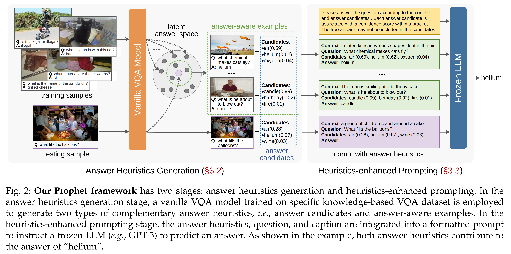
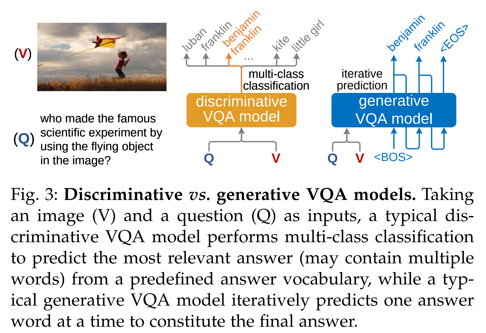
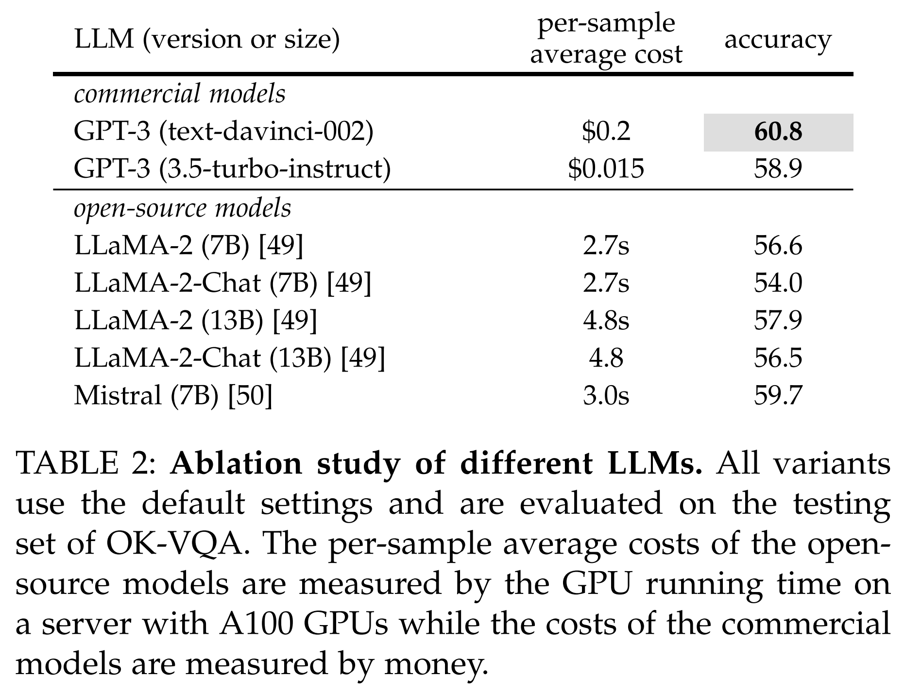
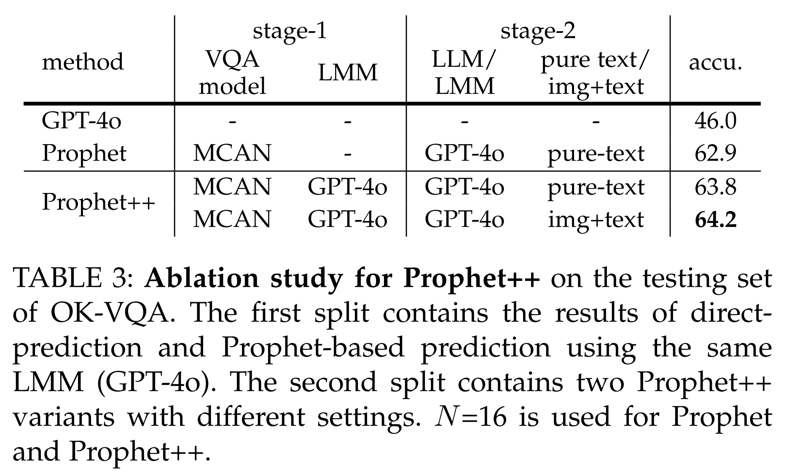
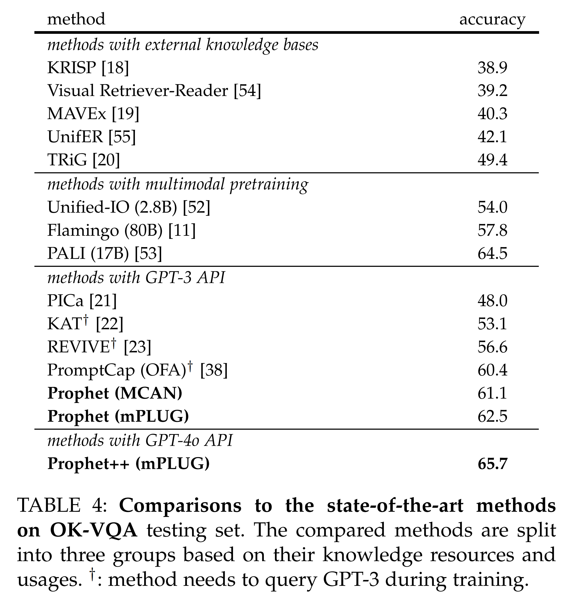
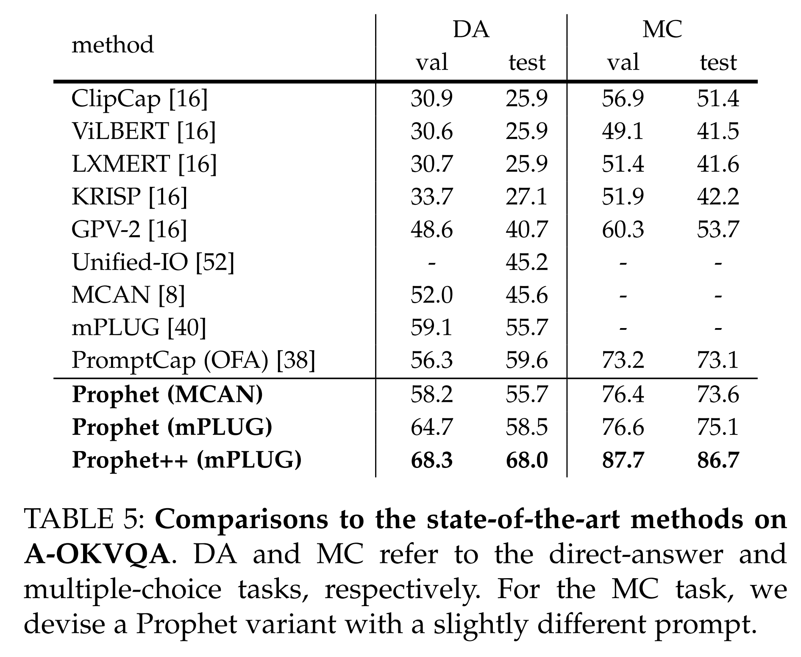

slug: Prophet
title: "Prophet: Prompting Large Language Models with Complementary Answer Heuristics for Knowledge-based Visual Question Answering"
tags: [Vision-Language, Multimodal, VQA, meta-tuning, Prophet]

논문 및 이미지 출처 : <https://arxiv.org/pdf/2303.01903>

# Abstract

Knowledge-based visual question answering (VQA) 는 질문에 답하기 위해 이미지 외부의 external knowledge 를 요구한다. 초기의 연구들은 explicit knowledge bases (KBs) 에서 필요한 knowledge 를 retrieve 하는 방식을 사용하며, 이 과정에서 질문과 무관한 information 이 자주 포함되어 model 의 성능이 제한된다. 최근의 연구들은 powerful large language model (LLM) 을 implicit knowledge engine 으로 사용하여 정답에 필요한 knowledge 를 획득하는 방향을 채택한다. 이러한 방법들이 고무적인 결과를 달성했음에도 불구하고, 저자는 주어진 textual input 이 질문에 답하기 위해 필요한 visual information 을 충분히 묘사하지 못하기 때문에, blind LLM 의 capacity 가 충분히 활성화되지 않았다고 주장한다.

본 논문에서 저자는 knowledge-based VQA 를 위해 LLM 을 answer heuristics 로 prompt 하도록 설계된, 개념적으로 simple 하고 flexible 하며 general 한 framework 인 **Prophet** 을 제안한다. 

* 구체적으로, 먼저 external knowledge 없이 specific knowledge-based VQA dataset 에 대해 vanilla VQA model 을 training 한다. 
* 그 후, VQA model 로부터 상호 보완적인 두 종류의 answer heuristics, 즉 answer candidates 와 answer-aware examples 를 추출한다. 
* 이 두 종류의 answer heuristics 는 formatted prompt 로 함께 encoding 되어, LLM 이 image 와 question 을 모두 더 잘 이해하도록 돕고, 이를 통해 더 정확한 answer 를 생성하게 한다.

State-of-the-art LLM 인 GPT-3 를 도입함으로써, Prophet 은 4 challenging knowledge-based VQA dataset 에서 기존 SOTA 방법들을 크게 능가한다. 

* Prophet 은 다양한 VQA models (i.e., discriminative model 과 generative model 모두) 과 다양한 LLMs (i.e., commercial 모델과 open-source 모델 모두) 의 조합으로 instantiate 될 수 있을 정도로 general 하다. 
* 더 나아가 Prophet 은 현대의 large multimodal models 와 서로 다른 stage 에서 결합될 수 있으며, 이렇게 확장된 framework 를 **Prophet++** 이라 부르며 knowledge-based VQA tasks 에서의 capability 를 한층 더 향상시킨다.

# 1. Introduction

최근 multimodal learning 의 발전으로 visual captioning, visual grounding, visual question answering (VQA) 를 포함한 다양한 vision-language task 에서 눈에 띄는 progress 가 이루어졌다. 이러한 task 들 중 VQA 는 주어진 image 에 대해 reasoning 을 수행하여 free-form question 에 답해야 한다는 점에서 고유한 challenge 를 제기한다. Large-scale vision-language pretraining 의 이점을 바탕으로 SOTA 방법들은 몇몇 대표적인 benchmark 에서 human 수준을 이미 능가했다.

그러나 이러한 방법들의 성과에도 불구하고, 특히 질문에 답하기 위해 external knowledge 가 필요할 때 reasoning ability 는 아직 만족스럽지 못하다. 이러한 상황에서 model 이 external knowledge 를 활용하는 능력을 검증하기 위해 *knowledge-based VQA task* 가 도입되었다. 

* 초기의 knowledge-based VQA benchmark 들은 추가로 structured knowledge bases (KBs) 를 제공하고, 
* 모든 question 에 대해 필요한 knowledge fact 를 annotation 한다. 

더 최근에는 *open-domain knowledge* 에 초점을 둔 benchmark 들이 제안되었으며, 

* 이는 더 이상 KBs 가 제공되지 않고 answer 를 위해 임의의 external knowledge resource 를 사용할 수 있음을 의미한다. 
* 본 논문에서 저자는 open-domain knowledge 를 사용하는 task 에 초점을 맞춘다.

Knowledge-based VQA 에 대한 직접적인 solution 은 explicit KBs, e.g., Wikipedia 와 ConceptNet 에서 knowledge entry 를 retrieval 하는 것이다. 그 다음 KB-augmented VQA model 이 retrieval 된 knowledge, image, question 에 대해 joint reasoning 을 수행하여 answer 를 예측한다. 그러나 이러한 retrieval-based 접근법의 성능은 두 가지 이유로 제한된다.

* (i) 필요한 knowledge 가 KBs 로부터 성공적으로 retrieval 되지 않을 수 있다.
* (ii) 필요한 knowledge 가 retrieval 되더라도, 많은 irrelevant knowledge 가 불가피하게 포함되어 VQA model 의 학습을 방해한다.

Explicit KBs 를 사용하는 연구들과는 별도로, 또 다른 연구 방향에서는 pretrained large language models (LLMs), e.g., GPT-3 를 knowledge acquisition 을 위한 implicit knowledge engine 으로 활용한다. 

* 선구적인 연구인 *PICa* 는 frozen GPT-3 model 에 formatted prompt 를 입력으로 제공하여 question 에 답하도록 한다. 
  * 주어진 testing image-question pair 에 대해, PICa 는 먼저 off-the-shelf captioning model 을 사용하여 image 를 caption 으로 변환한다. 
  * 그 다음 question, caption, 그리고 몇 개의 in-context example 을 하나의 textual prompt 로 통합하여 GPT-3 가 직접 answer 를 prediction 하도록 유도한다. 
  * 강력한 knowledge reasoning ability 를 지닌 GPT-3 덕분에, PICa 는 explicit KBs 를 사용하는 retrieval-based 방법들에 비해 유의미한 성능 향상을 달성한다.
* PICa 에서 영감을 받아, *KAT* 와 *REVIVE* 는 answer prediction 을 위해 LLMs 로부터의 implicit knowledge 와 KBs 로부터의 explicit knowledge 를 모두 활용하는 KB-augmented VQA models 를 학습한다. 
  * 두 종류의 knowledge resource 의 시너지는 이러한 models 의 성능을 한층 더 향상시킨다. 
  * 이러한 방법들이 유망한 결과를 달성했음에도 불구하고, 다음과 같은 한계로 인해 LLMs 의 capability 를 완전히 끌어내지는 못했다.

* (i) Caption 이 image 에 포함된 모든 필요한 information 을 포괄하지 못한다. 
  * 예를 들어 Fig. 1 의 사례에서, caption “a group of people walk in a city square” 는 “what fruit comes from these trees” 라는 question 에 답하는 데 아무런 도움을 주지 않는다. 
  * 이러한 상황에서는 LLM 이 question 에 답하기 위해 목적 없는, 편향된 guess 를 할 수밖에 없다.
* (ii) GPT-3 와 같은 LLMs 는 새로운 task 에 적응하기 위해 몇 개의 in-context example 이 필요한 few-shot learning paradigm 을 사용한다. 따라서 이러한 example 의 선택은 model performance 에 매우 중요하다. 
  * PICa 에서 보고된 바와 같이, 기존의 example selection strategy 들은 testing sample 의 ground-truth answer 와의 유사도에 기반하여 example 을 선택하는 oracle strategy 에 비해 훨씬 열등한 성능을 보이는데, oracle strategy 는 testing 시점에는 사용할 수 없다.

저자는 다음과 같이 묻는다: *knowledge-based VQA 를 위해 LLM 에 어떤 heuristics 를 부여하여 그 capacity 를 향상시키는 것이 가능할까?*

본 논문에서 저자는 knowledge-based VQA 를 위해 LLMs 를 answer heuristics 로 prompt 하도록 설계된 개념적으로 simple 하지만 효과적인 framework 인 **Prophet** 을 제안한다. 여기서 answer heuristics 란 prompt 안에서 적절한 방식으로 제시되는, 유망한 answer 들을 의미한다. 구체적으로, 저자는 (i) 와 (ii) 에서의 한계를 각각 극복하기 위해 **answer candidates** 와 **answer-aware examples** 라는 두 종류의 **complementary answer heuristics** 를 도입한다.

* Image 와 question 으로 이루어진 testing input 이 주어졌을 때, *answer candidates* 는 이 input 에 대한 유망한 answer 들의 list 를 의미하며, 각 answer 는 confidence score 와 함께 주어진다. 
* *Answer-aware examples* 는 in-context example 의 list 를 의미하며, 각 example 은 testing input 과 유사한 answer 를 가진다. 
* 다행히도 이러한 두 종류의 answer heuristics 는 specific knowledge-based VQA dataset 에 대해 training 된 어떤 vanilla VQA model 에서도 동시에 얻을 수 있다. Prophet 의 개략도는 Fig. 1 에 제시된다.

별다른 bells and whistles 없이도 Prophet 은 challenging 한 OK-VQA 와 A-OKVQA dataset 에서 이전 SOTA single-model 결과를 능가하며, 여기에는 1.8B image-text pairs 로 training 된, 강하게 engineering 된 Flamingo-80B model 도 포함된다. 또한 Prophet 은 single GPU 와 일정 수의 GPT-3 호출만으로 저자의 결과를 재현할 수 있기 때문에 대부분의 연구자에게 친숙한 방법이다.

저자는 Prophet 의 capability 와 generality 를 한층 향상시키기 위해 다음과 같은 기여를 추가로 수행한다.

* (i) Scratch 부터 training 된 classical discriminative models 와 large-scale corpus 에서 pretraining 된 최신 generative VQA models 를 포함하여 다양한 유형의 VQA models 를 탐구한다.
* (ii) 사용되는 LLM 을 commercial GPT-3 model 에서 다양한 open-source models 로 확장한다.
* (iii) OK-VQA 와 A-OKVQA 에 더해, ScienceQA 와 TextVQA 라는 두 개의 다른 knowledge-based VQA dataset 에 대해서도 더 많은 experiment 를 수행한다.

더 나아가 저자는 Prophet 에 large multimodal models (LMMs) 를 도입하여 개선된 Prophet++ framework 를 제시하는데, 

* 이는 첫 번째 stage 에서 새로운 종류의 answer heuristic (i.e., answer-aware rationales) 을 생성하고, 
* 두 번째 stage 에서 추가적인 visual input 을 가능하게 한다.

# 2 Related Work

#### Visual Question Answering (VQA)

VQA 는 지난 몇 년간 빠르게 관심이 증가해 온 분야이다. 최근의 VQA 연구는 대략 다음과 같은 category 로 나눌 수 있다:

* 더 나은 visual feature
* 더 강력한 model architecture
* 더 효과적인 learning paradigm

현재 SOTA VQA 방법의 대부분은 Transformer architecture 를 사용한다. Large-scale dataset 에 대한 vision-language pretraining 을 결합함으로써, 여러 대표적인 benchmark 에서 human-level performance 에 근접하거나 이를 초과하는 수준에 도달했다. 이러한 general-purpose VQA 연구 외에도, neural-symbolic reasoning 과 knowledge utilization 과 같은 특정 reasoning skill 을 요구하는 보다 세분화된 VQA task 를 탐구하는 연구 또한 증가하고 있다.

#### Knowledge-based VQA

Knowledge-based VQA 의 핵심은 knowledge acquisition 과 integration 이다. 초기 연구들은 input 을 structured query 로 parsing 하고, fixed knowledge bases (KBs) 로부터 supporting knowledge 를 retrieve 하여 answer 를 획득한다. 하지만 제공된 knowledge resource 만으로는 general knowledge 를 충분히 표현할 수 없기 때문에, 이후 연구들은 ConceptNet, Wikipedia, Google Images 와 같은 다양한 open-domain knowledge resource 로부터 explicit knowledge 를 획득하는 데 초점을 맞추었다. 이렇게 retrieval 된 knowledge 는 image-question pair 와 함께 integration 되어 answer prediction 에 활용된다.

최근에는 GPT-3 와 같은 LLM 이 지닌 강력한 knowledge reasoning 능력에 힘입어, LLM 을 implicit knowledge engine 으로 이용하는 접근이 SOTA 로 자리 잡았다. 이러한 연구들은 LLM 을 활용하여 question 과 caption 으로부터 answer 를 직접 prediction 하거나, evidence 와 함께 *answer candidate* 를 추출하여 *answer prediction* 을 향상시킨다. 그러나 question 에 답하는 데 필요한 visual information 이 정확하게 표현되지 않기 때문에, 이러한 방법들은 LLM 의 reasoning capability 를 완전히 이끌어내지 못한다.

이러한 한계는 LLM 을 question-aware information (i.e., answer heuristics) 으로 prompt 하는 전략을 탐구하도록 동기를 부여한다. Prophet 과 유사하게, 동시대 연구인 PromptCap 은 question-aware captioning model 을 학습하여 LLM 의 input information 을 강화하는 것을 목표로 한다. 그러나 PromptCap 은 training phase 와 testing phase 모두에서 LLM 을 사용해야 하므로, 일반적으로 큰 규모의 training set 에 대해 매우 높은 computation cost 를 초래한다. 반면 Prophet 은 testing phase 에서만 LLM 을 사용하기 때문에 훨씬 경제적이다.

#### In-context learning

BERT 와 같은 language model 이 pretrain-then-finetune paradigm 을 사용하는 것과 달리, GPT-3 는 few-shot in-context learning paradigm 을 도입하여 subsequent LLM 들의 사실상 표준이 되었다. GPT-3 는 새로운 task 에 적응하기 위해 inference 시 prompt 에 해당 task 의 예시를 input 과 함께 단순히 concatenation 하기만 하면 되며, parameter update 가 필요 없다.

이러한 특성은 multimodal few-shot learner training 연구에 영감을 주었다. Empirical study 에 따르면 Flamingo 와 같이 80B parameters 규모의 huge model 이 effective few-shot learning 에 필요하며, 이는 대부분의 사람이 reproduction 하기에는 비현실적일 정도로 비용이 크다.

# 3 The Prophet and Prophet++ Frameworks

Fig. 2 에 나타난 것처럼 Prophet 은 개념적으로 simple 한 two-stage framework 이다. Answer heuristics generation stage 에서는 vanilla VQA model 을 학습하여 두 종류의 answer heuristics, 즉 answer candidates 와 answer-aware examples 를 생성한다 (Sec. 3.2). Heuristics-enhanced prompting stage 에서는 answer heuristics, question, caption 을 formatted prompt 로 통합하여 frozen LLM 이 answer 를 prediction 하도록 한다 (Sec. 3.3). 또한 저자는 Prophet 의 서로 다른 stage 에 modern large multimodal models (LMMs) 를 도입하여 더 강력한 Prophet++ framework 를 구축하며, 이는 Sec. 3.4 에 자세히 설명된다.

## 3.1 Preliminaries

Prophet 을 소개하기에 앞서, GPT-3 가 개발한 in-context learning paradigm 및 이를 knowledge-based VQA 에 적용한 PICa 를 간략히 소개한다.

GPT-3 는 방대한 dataset 에 대해 pretrained 된 autoregressive language model 이다. Inference 시, in-context few-shot learning 은 새로운 downstream task 를 frozen model 상의 text sequence generation task 로 구성한다. Testing input $x$ 가 주어졌을 때, target $y$ 는 formatted prompt $p(h, \mathcal{E}, x)$ 를 conditioning 하여 prediction 된다. 여기서 $h$ 는 task 를 설명하는 instruction 역할을 하는 prompt head 를 의미하며, $\mathcal{E}=\{e_1,\dots,e_n\}$ 은 $n$ 개의 in-context example 을 의미한다.

Target $y=(y^1,\dots,y^L)$ 을 length $L$ 의 token sequence 라 하자. 편의를 위해 자연수 집합 $[l] = {1,\dots,l}$ 로 표기하고, $y^{[l]} = (y^1,\dots,y^l)$ 로 first $l$ token 을 의미하는 subsequence 를 나타낸다. Decoding step $l$ 에서 우리는 다음을 가진다:

$$
\begin{equation}
  y^l = \argmax_{\hat{y}^l}p_\text{GPT-3}(\hat{y}^l)|p,y^{[l-1]})
\end{equation}
$$

각 in-context example $e_i = (x_i, y_i)$ 는 input-target pair 로 구성되며, 수작업 또는 training set 에서 sampling 하여 구성된다.

Knowledge-based VQA 를 해결하기 위해 GPT-3 와 같은 LLM 을 adapt 하는 핵심은 적절한 prompt 설계이다. Question $q$ 와 image $v$ 가 주어지면 목표는 answer $a$ 를 예측하는 것이다. LLM 은 image 를 직접 이해하지 못하므로, image 는 captioning model 을 통해 caption $c$ 로 변환되어야 한다.

PICa 는 testing input $x$ 를 다음 template 으로 구성한다:

> Context: c \n Question: q \n Answer:

각 c 와 q 는 texting input 이며, \n 은 line break 를 의미한다. In-context example $e_i$ 는 다음과 같은 template 으로 구성된다:

> Context: $c_i$ \n Question: $q_i$ \n Answer: $a_i$

PICa 의 전체 prompt 는 fixed prompt head, 몇 개의 in-context example, testing input 으로 구성되며, 이는 frozen LLM 에 전달되어 answer 를 prediction 한다.

Prophet 은 PICa 의 pipeline 을 계승하되, prompt structure 에 answer heuristics 를 추가하여 LLM 의 reasoning capability 를 더 강하게 활성화하여 더 정확한 answer 를 가능하게 한다.

## 3.2 Stage-1: Answer Heuristics Generation

저자는 두 종류의 *answer heuristics* — **answer candidates** 와 **answer-aware examples** — 를 도입한다. Testing input (image, question) 이 주어졌을 때,

* **Answer candidates**: testing input 에 대한 유망한 answer 의 list, 각 answer 는 confidence score 와 함께 제공된다.
* **Answer-aware examples**: testing input 의 answer 와 유사한 answer 를 가진 in-context example 의 list.

흥미롭게도, 이러한 두 가지 answer heuristics 는 specific knowledge-based VQA task 에 대해 학습된 어떤 vanilla VQA model 에서도 동시에 획득할 수 있다.

Fig. 3 에 나타난 것처럼 기존 VQA 방법은 answer 를 얻는 방식에 따라 크게 **discriminative** 모델과 **generative** 모델로 구분된다. 이 차이는 answer heuristics 를 생성하는 전략에도 차이를 유발한다. 아래에서는 각 VQA model class 에 대해 사용하는 전략을 설명한다.

### 3.2.1 Discriminative VQA models

VQA training dataset 을 $\mathcal{D}=\{(v_i, q_i, a_i)\}_{i=1}^M$ 라 하자. 여기서 $v_i, q_i, a_i$ 는 각각 image, question, answer 이다. Training set 에서 가장 빈도가 높은 answer 들이 answer vocabulary $\mathcal{V}={w_j}_{j=1}^S$ 를 형성하며, $S$ 는 vocabulary size 이다.

Discriminative VQA model $\mathcal{M}_{\text{disc}}$ 는 $\mathcal{D}$ 로부터 학습되며, $S$-way classification 을 수행한다. 일반적으로 model $\mathcal{M}_{\text{disc}}$ 는 다음 두 부분으로 구성된다:

* Backbone $\mathcal{M}_{\text{disc}}^B$: input $(v,q)$ 를 encoding 하여 fused feature $z$ 를 생성
* Prediction head $\mathcal{M}_{\text{disc}}^H$: $z$ 를 answer score 로 projection

Backbone 은 다음과 같이 multimodal input 을 fuse 한다:

$$
\begin{equation}
  z = \mathcal{M}_\text{disc}^B (v, q)
\end{equation}
$$

* Prediction head $\mathcal{M}_H$ 는 linear layer 와 sigmoid function 을 사용하여 fused feature $z$ 를 answer vocabulary 상의 score vector $y\in\mathbb{R}^S$ 로 변환한다:

$$
\begin{equation}
  y = \mathcal{M}_\text{disc}^H(z)
\end{equation}
$$

* $y$ 의 $i$-th element 는 answer $w_i$ 에 대한 confidence score 를 의미한다.

이제 위 정의를 기반으로 두 종류의 answer heuristics 를 어떻게 생성하는지 설명한다. 학습된 model $\mathcal{M}_{\text{disc}}$ 는 external knowledge 를 사용하지 않지만, 적절히 training 된다면 knowledge-based VQA task 에도 활용될 수 있다. 저자는 이를 reference model 로 사용하여 Prophet 의 효과를 실험적으로 비교한다.

#### Answer candidates

Testing input $(v, q)$ 가 주어졌을 때, Eq.(3) 을 통해 모든 answer 에 대한 score vector $y$ 를 얻는다. Score vector 의 $i$-th element $s_i \in \mathbb{R}^+$ 를 이용하여 다음과 같이 top-$K$ answers 를 선택한다:

$$
\begin{equation}
  \mathcal{I}_\text{AC}=\arg \underset{j\in\{1,2,\dots,S\}}{\text{⁡Top}K} s_j  
\end{equation}
$$

여기서 $\mathcal{I}_{\text{AC}}$ 는 top-K answer candidate 의 index set 이다.

Answer candidates $C$ 는 아래와 같이 정의된다:

$$
\begin{equation}
  \mathcal{C} = \{(w_j, s_j)|j\in\mathcal{I}_\text{AC}\}
\end{equation}
$$

즉, 각 candidate 는 answer $w_j$ 와 confidence score $s_j$ 의 pair 이다.

In-context example $e_i$ 의 format 을 testing input 과 일관되게 유지하기 위해, example $e_i$ 에 대해서도 동일한 방식으로 answer candidates $C_i$ 를 계산하여 제공한다.

#### Answer-aware examples

여러 이전 연구들은 in-context example 의 선택이 LLM 의 few-shot learning 에 매우 중요함을 보여준다. 이러한 결과는 저자가 answer-aware example selection strategy 를 설계하도록 동기를 부여한다.

Testing input $(v, q)$ 와 임의의 training input $(v_i, q_i)$ 가 주어졌을 때, 저자는 학습된 model 을 사용하여 Eq.(2) 로부터 두 input 에 대응하는 fused feature $z$ 와 $z_i$ 를 얻을 수 있다. Fused feature 가 answer prediction 을 위해 linear projection 된다는 점을 고려하면, 이러한 fused feature 들은 image-question pair 의 answer semantics 를 풍부하게 포함한 latent answer space 에 위치한다고 저자는 가정한다. 따라서 $z$ 와 $z_i$ 가 latent space 에서 가까울수록 two inputs 은 더 유사한 answer 와 image-question input 을 공유할 가능성이 높다.

저자는 testing input 과 모든 training input 간의 fused feature cosine similarity 를 계산한 후, latent space 에서 가장 가까운 top-$N$ answer-aware examples 로 선택한다:

$$
\begin{equation}
  \mathcal{I}_\text{AE} = \underset{i\in\{1,2,\dots M\}}{\arg \text{TopN}} \frac{z^T z_i}{\|z\|_2\|z_i\|_2}
\end{equation}
$$

* 여기서 $I_{\text{AE}}$ 는 dataset $\mathcal{D}$ 에서 top-$N$ similar sample index set 을 의미한다. 
* Answer-aware examples $E$ 는 다음과 같이 정의된다:

$$
\begin{equation}
  \mathcal{E} = \{(v_i, q_i, a_i)|i\in\mathcal{I}_\text{AE}\}
\end{equation}
$$

Training input 의 fused feature 는 미리 계산하여 저장할 수 있기 때문에, answer-aware example selection 은 효율적으로 수행될 수 있다.

### 3.2.2 Generative VQA models

최근 SOTA VQA model 들은 뛰어난 scalability 와 generalizability 덕분에 generative model architecture 를 채택하는 추세이다.

앞서 정의한 동일한 VQA training dataset $\mathcal{D}=\{(v_i, q_i, a_i)\}_{i=1}^M$ 이 주어졌을 때, generative VQA model $\mathcal{M}_{\text{gen}}$ 은 pre-defined word vocabulary $V={w_j}_{j=1}^S$ 에 기반하여 answer 를 단어 단위로 생성하도록 학습된다. 여기서 $S$ 는 word vocabulary size 이다. 각 answer 는 dynamic length $L$ 을 갖는 word sequence 로 표현된다:

$$
\begin{equation}
  w = (w^1, w^2, \dots, w^L)
\end{equation}
$$

* $w^1 = \text{[BOS]}$ 는 start-of-sentence token 을 의미하고, 
* $w_L = \text{[EOS]}$ 는 end-of-sentence 를 의미한다.

Discriminative model 과 유사하게, $\mathcal{M}_{\text{gen}}$ 은 backbone $\mathcal{M}_{\text{gen}}^B$ 와 prediction head $\mathcal{M}_{\text{gen}}^H$ 로 구성된다. Backbone $\mathcal{M}_{\text{gen}}^B$ 는 encoder-decoder 또는 pure decoder architecture 로 구성되며 multimodal input $(v, q)$ 를 fuse 하고 autoregressive manner 로 각 answer word 에 대한 latent feature 를 생성한다:

$$
\begin{equation}
  z^l = \mathcal{M}_\text{gen}^B (v, q, w^{[l-1]})
\end{equation}
$$

여기서 $z^l$ 은 $l$-th answer word 의 latent feature 를 의미한다.

Prediction head $\mathcal{M}_{\text{gen}}^H$ 는 latent feature $z^l$ 에 linear projection (또는 MLP) 및 softmax 를 적용하여 word vocabulary 전체에 대한 score distribution $y^l \in \mathbb{R}^S$ 을 생성한다:

$$
\begin{equation}
  y^l = \mathcal{M}_\text{gen}^H (z^l)
\end{equation}
$$

$l$-th answer word $w^l$ 은 $y^l$ 에서 가장 높은 score 를 갖는 word 를 greedy 방식으로 선택하여 얻는다. [EOS] token 이 생성될 때까지, 생성된 단어는 $w^{[l-1]}$ 에 append 되어 $w^{[l]}$ 를 형성하고, 이는 다음 단어를 생성하기 위해 반복적으로 model 에 입력된다.

#### Answer candidates

Testing input $(v, q)$ 에 대해 greedy decoding 으로 가장 가능성 높은 answer 하나를 생성할 수 있다. 그러나 top-$K$ answer 와 그 confidence score 로 구성된 answer candidates 를 얻는 것은 단순하지 않다. 저자는 neural machine translation 과 visual captioning 에 널리 사용되는 **beam search** algorithm 을 사용하여 이를 해결한다.

Top-$K$ answer candidates $\mathcal{C}$ 는 다음과 같이 정의된다:

$$
\begin{equation}
  \mathcal{C} = \{ (w_1, s_1), (w_2, s_2), \dots, (w_k, s_k) \}
\end{equation}
$$

* 여기서 각 $w_j$ 는 word sequence 로 구성된 answer 이며, 
* $s_j \in \mathbb{R}^+$ 는 해당 answer 의 모든 단어에 대한 누적 confidence score 이다. 
* Answer candidates $C$ 는 beam search 를 적용한 $M_{\text{gen}}$ 으로부터 얻어진다.

Beam search 절차는 다음과 같다:

* 모든 answer $w_j$ 를 동일한 [BOS] token 으로 초기화
* * 

* 모든 answer $w_j$ 를 동일한 [BOS] token 으로 초기화
* 각 decoding step $l$ 에 대해, 각 $w_j$ (length $l$) 를 model 에 입력하여 top-$K$ candidate word 를 얻음
  1. **Expand step**: 각 $w_j$ 를 top-$K$ 단어와 결합하여 $K \times K$ 개의 new candidates answers
  2. **Reduce step**: 생성된 $K \times K$ 후보 중 accumulated score $s = \sum^l_{i=1} \log y^i$ 가 가장 높은 top-$K$ 만 유지하고, 다음 decoding step 에 대한 input 으로 간주함

#### Answer-aware examples

Discriminative model 의 경우와 마찬가지로, generative model 의 answer-aware examples 역시 latent answer space 에서의 kNN search 로 얻어진다. 그러나 두 model 의 latent feature granularity 는 다르다:

* Discriminative model: latent feature 하나가 vocabulary answer entry 에 대응
* Generative model: latent feature 하나가 answer word 에 대응

Testing input $(v,q)$ 와 $i$-th training input $(v_i, q_i)$ 에 대해 multi-word answer 의 latent feature 는 다음과 같이 표현된다:

* Testing input: $Z = [z^1, z^2, \dots, z^L] \in \mathbb{R}^{L \times d}$
* Training input: $Z_i = [z^l_i, z^2_i, \dots, z^{L_i}_i] \in \mathbb{R}^{L_i \times d}$
  * 여기서 $d$ 는 latent answer space 의 dimensionality
  * $L$ 과 $L_i$ 는 $Z$ 와 $Z_i$ 의 answer length

저자는 각 paried features $z_j \in Z$ 와 $z^k_l\in Z_i$ 의 average dot-product similarity 를 계산하는 간단한 score function 을 정의한다:

$$
\begin{equation}
  \pi_i = \frac{1}{L \times L_i}\sum^L_{j=1}\sum^{L_i}_{k=1}\frac{z^j z^k_i}{\|z^j\|_2 \|z_i^k\|_2}
\end{equation}
$$

Eq.(12) 를 기반으로 training set 에서 top-$N$ nearest neighbors 를 선택하고, 이를 다음과 같이 answer-aware examples $\mathcal{E}$ 로 formatting 한다:

$$
\begin{equation}
  \begin{aligned}
    \mathcal{I}_\text{AE} &= \underset{i\in\{1, 2, \dots, M\}}{\arg \text{TopN}}\pi_i \\
    \mathcal{E} &= \{(v_i, q_i, a_i)|i\in\mathcal{I}_\text{AE}\}
  \end{aligned}
\end{equation}
$$

* 여기서 $\mathcal{I}_{\text{AE}}$ 는 training set $D$ 의 top-$N$ neighbor index set 이다.

## 3.3 Stage-2: Heuristics-enhanced Prompting

Stage-1 에서 answer heuristics (i.e., answer candidates $\mathcal{C}$ 와 answer-aware examples $\mathcal{E}$) 를 얻은 후, 저자는 이를 heuristics-enhanced prompt 로 encoding 하여 knowledge-based VQA 에 대한 LLM 의 few-shot learning capacity 를 향상시킨다.

하나의 prompt 는 prompt head, in-context examples set, 그리고 testing input 으로 구성된다.

* Prompt head 는 natural language 로 VQA task 를 설명한다. 저자는 PICa 에서 설계된 prompt head 를 참조하고, 여기에 answer candidates 에 대한 새로운 설명을 보완한다. 
* 저자는 LLM 이 answer candidates 에 따라 answer 를 생성하도록 유도하지만, 동시에 candidate 바깥의 answer 를 자유롭게 탐색하고 생성하는 것도 허용한다. 

저자의 prompt head 전체 형식은 Fig. 2 의 노란색 박스에 제시된다.

저자의 in-context examples 는 얻어진 $N$ 개의 answer-aware examples $\mathcal{E} = \{e_1, e_2, \dots, e_N\}$ 에서 유도된다. Sec. 3.1 에서 설명한 PICa 의 template 를 기반으로, example $e_i$ 에 대해 저자는 다음과 같이 한 줄을 추가하여 그 example 의 answer candidates $C_i$ 를 포함시킨다:

> Context: $c_i$ \n Question: $q_i$ \n \
> Candidates: $\boldsymbol{w}_{j_1}(s_{j_1}), \boldsymbol{w}_{j_2}(s_{j_2}), ..., \boldsymbol{w}_{j_K}(s_{j_K})$ \n \
> Answer: $a_i$

* 여기서 $j_1, j_2, \dots, j_K$ 는 $\mathcal{C}_i$ 의 element index 에 해당한다.
* 각 answer candidate $w_{j_k}$ 는 bracket 안의 confidence score $s_{j_k}$ 와 pair 로 표현된다. 
* Confidence score 는 각 answer candidate 의 신뢰도를 추가적으로 제공하며, 이를 통해 LLM 이 더 유망한 candidate 에 집중하고, 덜 관련된 candidate 에 대해서는 더 관대하게 처리할 수 있도록 돕는다.

Testing input 의 template 는 in-context examples 의 template 와 유사하지만, 마지막 Answer 부분은 LLM 이 채우도록 비워 둔다. 사용 가능한 example 들을 더 잘 활용하기 위해, 저자는 multiquery ensemble strategy 를 사용한다. 구체적으로,

* 먼저 answer-aware examples 의 수를 $N \cdot T$ 로 늘려, 서로 병렬적인 $T$ 개의 prompt 를 구성한다.
* 각 prompt 는 여전히 $N$ 개의 example 을 포함한다.
* LLM 을 $T$ 번 호출하여 $T$ 개의 answer prediction 을 얻는다.
* 마지막으로 이 $T$ 개의 prediction 에 대해 majority voting 을 수행하여 최종 answer 를 결정한다. 서로 다른 $N$ 과 $T$ 값의 효과는 실험에서 검증한다.

## 3.4 Prophet++ with Frozen Large Multimodal Models

original Prophet 의 설계는 image 를 직접 perception 할 수 없는 pure-text LLM 에 기반한다. 최근 GPT-4V, GPT-4o, LLaVA 와 같은 large multimodal models (LMMs) 가 제안되어 다양한 multimodal task 에서 뛰어난 capability 를 보여주고 있다. 이는 자연스럽게 다음과 같은 질문을 제기한다:

> 이러한 강력한 LMM 들을 Prophet 에 활용하여 그 capability 를 더 향상시킬 수 있을까?

이를 위해 저자는 Prophet 의 두 stage 모두에서 LMM 을 활용하는 확장 framework 인 **Prophet++** 를 제안하며, 전체 구조는 Fig. 4 에 나타나 있다.

첫 번째 stage 에서 Prophet++ 은 우선 기존 Prophet 과 동일하게 VQA model 을 사용하여 앞에서 설명한 두 종류의 answer heuristics 를 추출한다. 여기에 더해, 최신 LMM 이 지닌 강력한 reasoning capability 에서 영감을 받아, 저자는 새로운 유형의 answer heuristic 인 **answer-aware rationales** 를 추가로 추출한다. Answer-aware rationales 는 question 에 답하기 위한 reasoning 과정 자체를 포함한다.

Answer-aware rationales 를 생성하기 위한 prompt 는 다음과 같다:

> You are provided with an image and a question. Please
> think step by step to generate the rationale to help
> answering the question.

여기에 몇 개의 example 을 함께 제공하여 output format 을 제어한다. 생성된 rationale 은 이후 두 번째 stage 에서 사용하기 위해, 추출된 image caption 에 append 된다.

두 번째 stage 에서 Prophet++ 은 Prophet 에서 사용하던 frozen LLM 을 LMM 으로 대체하여 multimodal input 을 직접 처리하도록 한다. 일반적인 LMM 으로 image 를 encoding 하는 데는 상당한 수의 token 이 필요하다는 점에 주의해야 한다. Multimodal input 의 전체 길이를 제한하기 위해, Prophet++ 에서는 **testing image 만** LMM 에 입력하고, in-context examples 에 해당하는 image 들은 생략한다.

# 4 EXPERIMENTS

저자는 Prophet 의 성능을 두 가지 대표적인 knowledge-based VQA dataset 인 OK-VQA 와 A-OKVQA 에서 주로 평가한다. Prophet 의 효과를 탐구하기 위해 광범위한 ablation 실험을 수행하고, 그 결과를 토대로 SOTA 방법들과의 비교를 진행한다. 또한 Prophet 의 generalization ability 를 검증하기 위해 external science knowledge 와 OCR knowledge 를 요구하는 두 가지 상이한 knowledge-based VQA dataset 인 ScienceQA 와 TextVQA 에서도 추가 실험을 수행한다.

## 4.1 Datasets

**OK-VQA** 는 널리 사용되는 knowledge-based VQA dataset 이다. 이 dataset 은 9K training, 5K testing image-question pair 로 구성되며, 모든 question 은 질문에 답하기 위해 outside knowledge 가 필요하도록 manual filtering 되어 있다.

**A-OKVQA** 는 현재 가장 큰 knowledge-based VQA dataset 이며, 17K training, 1K validation, 7K testing 으로 구성되어 있다. Direct answering (DA) 와 multiple choice (MC) 평가가 모두 제공된다.

**ScienceQA** 는 약 21K 개의 high school-level science topic question 으로 이루어진 dataset 이다. 이 중 10.3K (48.7%) 의 image 포함 sample 로 구성된 ‘IMG’ subset 만 실험에 사용한다.

**TextVQA** 는 28K image 와 45K question 으로 구성되며, 각 question 은 image 내 text 를 읽고 reasoning 해야 한다. Dataset 은 34.6K training, 5K validation, 5.7K testing 으로 구성된다. 저자는 기존 연구에 따라 ST-VQA 의 augmented VQA sample 을 training set 에 추가한다.

## 4.2 Implementation Details

#### Default settings on OK-VQA

저자는 answer heuristics 생성을 위해 **MCAN-large** 를 기본 VQA model 로 사용한다. Model capability 를 더 향상시키기 위해 기존 MCAN 을 다음과 같이 수정한다:

* (i) 기존 region-based bottom-up-attention feature 를 CLIP visual encoder 의 RN50×64 backbone 에서 추출한 grid-based feature 로 대체
* (ii) 기존 LSTM network 를 pretrained BERT-large model 로 대체

저자는 model capability 를 더 강화하기 위해 transfer learning paradigm 도 적용한다. Model 은 먼저 VQAv2 dataset 과 Visual Genome dataset 에 대해 pretraining 된다. Data contamination 을 피하기 위해, OK-VQA testing split 에 사용된 image 들을 포함하는 sample 은 pretraining dataset 에서 제거한다. 이후 pretrained model 을 OK-VQA training split 에 대해 finetuning 하여 최종 VQA model 을 얻는다.

Pretrained model 의 answer vocabulary (3,129 answers) 는 OK-VQA vocabulary 와 크게 다르므로, 두 vocabulary 를 merge 하여 4,477 answer 로 구성된 expanded answer vocabulary 를 생성하고 이를 기반으로 model 을 finetuning 한다. 이 model 은 단일 Nvidia RTX 3090 GPU 로 training 되며, 대부분의 연구자가 감당할 수 있는 수준이다.

Prompting stage 에서 저자는 PICa 와 동일하게 *OSCAR+* 를 captioning model 로 사용한다. 별도 언급이 없는 한, default setting 은 다음과 같다:

* answer candidates 의 수: $K = 10$
* in-context examples 의 수: $N = 16$
* query 수: $T = 5$
* LLM 은 GPT-3 (text-davinci-002), sampling temperature = 0

#### Settings on other datasets

OK-VQA 에 대한 setting 과 strategy 는 A-OKVQA 의 DA task 에 그대로 적용할 수 있다.

MC task 의 경우, 저자는 기존 연구의 전략을 따라 predicted answer 를 가장 가까운 answer choice 로 projection 한다. 또한 MC task 를 위한 Prophet variant 를 설계하여, prompt 에 choice list 를 삽입하고 LLM 에게 네 개의 choice 중 정답을 고르도록 instruct 한다.

**ScienceQA** 에서는 OK-VQA default setting 을 재사용한다. Training sample 에 추가 textual hint 가 제공되는 경우, 이를 caption 뒤에 append 하여 새로운 image context 로 사용한다.

**TextVQA** 에서는 이전 연구에서 검증된 Amazon commercial OCR system 을 사용하여 image 에서 text 를 추출한다. Extracted OCR text 는 in-context examples 와 testing input 둘 모두에 제공되어 LLM 을 보조한다.

#### Settings for other Prophet and Prophet++ variants

MCAN 외에도 저자는 generative VQA model 인 *mPLUG* 에 대해 Prophet 을 실험한다. mPLUG 은 massive image-text pair 에 대해 pretrained 된 후 특정 VQA dataset 에 대해 finetuning 된다. MCAN 에 사용된 two-stage transfer learning paradigm 과 동일하게, pretrained mPLUG model 을 VQAv2 dataset 에 대해 먼저 finetuning 하고, 이후 specific knowledge-based VQA dataset 에 대해 추가 finetuning 한다.

Prophet++ 에 대해서는, 저자는 두 stage 모두에서 SOTA LMM 인 *GPT-4o* 를 사용한다.

## 4.3 Ablation Studies

저자는 별도 언급이 없는 한 위의 default setting 을 사용하여 OK-VQA 에서 Prophet 및 Prophet++ 에 대한 ablation 실험을 수행한다. Tab. 1 과 Fig. 5 에 제시된 결과를 아래에서 상세히 논의한다.

#### Prompting vs. retrieval

Prophet 은 promising 한 answer candidates 집합을 기반으로 answer 를 예측하는 prompting-based paradigm 을 사용한다. 반면 이전 연구인 MAVEx 는 answer candidates 를 활용하지만 retrieval-based paradigm 을 채택하여 external KBs 로부터 knowledge 를 검색하여 answer 를 결정한다. Prophet 과 MAVEx 모두 stage-1 에서 VQA model 을 학습하여 answer candidates 를 생성하므로, 두 paradigm 을 stage-2 관점에서 공정하게 비교할 수 있다.

Tab. 1a 에서는 stage-1 accuracy 와 final accuracy 를 각각 비교한다. 

* 공정한 비교를 위해, 저자는 MAVEx 에서 사용된 VQA model (ViLBERT) 을 재구현하여 Prophet 의 answer heuristics 생성에 동일하게 사용한다. 
* 결과에서 확인할 수 있듯이, 동일한 VQA model 을 기반으로 할 때 Prophet 은 MAVEx 대비 큰 폭의 향상(44.97% vs. 40.28%)을 보이며, prompting-based paradigm 이 retrieval-based paradigm 보다 external knowledge acquisition 및 integration 측면에서 우수함을 보여준다.

#### Capability of VQA models

Tab. 1b 는 서로 다른 capability 를 가진 VQA model 이 Prophet 의 성능에 어떤 영향을 미치는지 분석한다. Model capability 를 통제하기 위해, 저자는 동일한 MCAN model 을 사용하되 네 가지 visual feature (region-based Bottom-Up, region-based VinVL, CLIP ViT-L/14 grid feature, CLIP RN50×64 grid feature) 를 적용하여 비교한다.

결과는 다음을 보여준다:

* More powerful VQA models (stage-1 accuracy 가 높을수록) → Better Prophet performance
(더 높은 quality 의 answer heuristics 제공 때문)
* 하지만 VQA 능력이 높을수록 GPT-3 로부터의 상대적 향상폭은 작아진다
→ diminishing return 특성 때문
* 추가적으로, visual feature 의 중요성도 확인된다. CLIP 기반 feature 를 사용하는 model 은 region-based feature 를 사용하는 model 대비 큰 폭으로 우수한 성능을 보인다. 
  * 이는 large-scale pretraining 을 통해 CLIP visual feature 가 더 풍부한 visual knowledge 를 담고 있음을 시사하며, 이는 기존 관찰과도 일관된다.
* 또한 generative VQA model (e.g., mPLUG) 로 MCAN 을 대체할 수도 있으며, 이에 대한 결과는 main results 에서 보고한다.

#### Answer candidates

Tab. 1c 는 answer candidates 의 수 $K$ 를 0 에서 10 까지 변화시키며 Prophet 에 미치는 영향을 탐구한다. 각 testing sample 에 대해, ground-truth answer 가 top-$K$ candidate 중 하나와 일치할 경우 그 soft score 를 누적한다. 이 누적 score 를 전체 sample 수로 나누어 hit rate 를 계산한다.

결과는 다음을 보여준다:

1. Answer candidates 가 없을 경우 Prophet 성능이 크게 하락한다
(K=0 대비 K=1 에서 accuracy 가 6.4 포인트 감소)
→ answer candidates 가 Prophet 에 매우 중요함을 보여준다.
2. K 증가 시 hit rate 와 최종 accuracy 가 증가하지만, 곧 포화 현상을 보인다
→ K 증가에 따라 candidate quality 가 더 이상 향상되지 않기 때문.
3. 흥미롭게도 K=1 에서 final accuracy(56.04%)가 hit rate(53.04%)보다 높다
→ GPT-3 가 잘못된 candidate 를 바로잡고, 올바른 candidate 는 유지할 수 있는 강한 correction capability 를 지님.

#### Example selection strategy

Answer-aware example selection strategy 의 효과를 검증하기 위해, 저자는 Tab. 1d 에서 다양한 selection 전략을 비교한다:

* (a) rand: 무작위 example 선택
* (b) ques + img: question 및 image feature joint similarity 기반 선택 (PICa 방식)
* (c) fused: 저자의 기본 방식, fused feature similarity 기반 선택
* (d) fused + ques + img: (c) 와 PICa 전략의 결합
* (e) answer logits: Eq.(3) 에서 얻은 answer logits similarity 기반 선택

각 전략에 대해 final accuracy 와 example 내부에 포함된 정답의 hit rate 를 보고한다.

결과는 다음을 보여준다:

* Accuracy 는 hit rate 와 강하게 양의 상관관계
→ answer-aware examples 가 Prophet 성능에 크게 기여한다는 저자의 가설을 검증
* 저자의 기본 전략 (c) 가 가장 높은 accuracy 와 hit rate 를 달성
* (d) 의 경우 ques + img 정보를 추가하면 오히려 성능 하락
→ irrelevant / noisy information 이 추가되기 때문
* (e) 는 (c) 보다 약간 낮은 성능
→ answer logits 이 question 및 image 정보의 상당 부분을 잃기 때문
(GPT-3 의 knowledge reasoning 에 필요한 정보)

#### Numbers of examples and queries

Tab. 1d 는 example 수 $N \in \{0, 1, 8, 16, 20\}$ 및 query 수 $T \in \{1, 5\}$ 에 대한 ablation 도 포함한다.

주요 관찰은 다음과 같다:

* Prophet 의 성능은 N, T 증가에 따라 향상된다
→ PICa 의 결과와 일관됨
* T 를 1 → 5 로 늘릴 경우, 큰 N 을 가진 setting 에서 더 큰 성능 향상이 나타남
→ 하지만 computation overhead 는 선형 증가
* Remarkably, N=0 일 때 Prophet 은 stage-1 VQA model 보다 성능이 낮다
(49.97% vs. 53.04%)
→ answer candidates 만으로는 부족함
* N=1 만으로도 stage-1 model 을 즉시 능가한다
(56.75% vs. 53.04%)
→ GPT-3 가 knowledge-based VQA task 에 적응하기 위해
few-shot in-context example 이 필수적임을 강하게 시사

#### Prompt contents

Tab. 1f 은 default setting 에서 prompt contents 를 변경하며 ablation 을 수행한 결과이다. 구체적으로 다음 구성 요소를 제거하거나 추가한다:

* (b) prompt head 제거
* (c) answer candidates 의 confidence score 제거
* (d) image caption 제거
* (e) external model 이 예측한 tag 추가

결과는 다음과 같은 관찰을 가능하게 한다:

1. confidence score 는 Prophet 의 성능에 결정적으로 중요하다.
   * 이는 confidence score 가 GPT-3 가 answer candidates 를 이해하는 데 필요한 정보를 제공하기 때문이다.
2. image caption 이 없어도 Prophet 은 안정적으로 동작한다.
  * 이는 prompt 내부에 포함된 answer heuristics 만으로도 Prophet 이 task 를 해결하기에 충분한 정보를 제공한다는 점을 반영한다.
3. prompt head 의 중요성은 상대적으로 낮다.
  *이는 GPT-3 가 in-context examples 만으로도 task 를 직접 이해할 수 있음을 의미한다.
4. 마지막으로, 추가 정보(e.g., object tags) 를 포함시키면 약간의 성능 하락이 발생한다.
  * 이는 PICa 의 결과와는 반대된다. 저자는 이러한 정보가 이미 answer heuristics 내부에 implicit 하게 encode 되어 있기 때문이라고 추측한다.

#### Prediction behaviors in different stages

Tab. 1b 에서 Prophet(stage-2) 이 해당 MCAN model(stage-1) 대비 큰 성능 향상을 달성함을 관찰할 수 있다. 이러한 향상을 더 잘 이해하기 위해 Prophet 의 prediction behavior 에 대한 통계적 분석을 수행한다.

Prophet 은 MCAN 으로부터 top-$K$ answer candidates 를 입력으로 받는다. 이에 기반하여 Prophet 의 prediction behavior 를 다음 세 클래스로 정의한다:

* “keep top 1”: LLM prediction 이 MCAN 의 top-1 candidate 와 동일
* “in top 2–K”: LLM prediction 이 top-2 부터 top-K candidate 중 하나
* “beyond top K”: LLM prediction 이 K 개 candidate 모두와 다른 새로운 answer

모든 testing sample 은 위 3 개 클래스 중 하나에 해당한다.

Fig. 5 의 통계 결과는 다음을 보여준다:

1. 68.1% (green) — Prophet 은 MCAN 의 top-1 answer 를 그대로 유지
   * 해당 sample 은 대부분 easy sample
   * MCAN accuracy: 69%, Prophet accuracy: 동일하게 높음
2. 21.8% (blue) — Prophet 은 top-2–K candidate 중 하나를 선택
   * 해당 sample 은 상대적으로 어려움
   * MCAN accuracy: 24%
   * Prophet accuracy: 40% 로 크게 향상
3. 10.1% (yellow) — Prophet 은 candidate 밖의 새로운 answer 를 선택
   * 가장 challenging sample
   * MCAN accuracy: 12%
   * Prophet accuracy: 42% 로 압도적 향상

#### Different LLMs

Tab. 2 는 default GPT-3(text-davinci-002) 대신 다양한 commercial 및 open-source LLM 을 사용하여 Prophet 성능 변화를 분석한 결과이다. 결과로부터 다음을 관찰한다:

1. default GPT-3 의 성능이 비교된 모든 LLM 을 지속적으로 능가한다.
  * 이는 accelerated variant(3.5-turbo-instruct) 보다도 우수하다.
2. 동일 계열의 LLM 에서 model size 가 클수록 성능이 더 좋다.
  * 예: LLaMA-2 7B < 13B
   * 하지만 running time 은 거의 선형으로 증가한다.
3. instruction tuning 및 human feedback(RLHF) 으로 alignment 된 chat-oriented variant 는 비-chatty 버전보다 성능이 낮다.
→ alignment tax 때문이라고 설명할 수 있다.
4. Mistral 7B 는 매우 작은 size 임에도 GPT-3 에 근접한 성능을 달성한다.
→ open-source LLM 의 강력한 잠재력을 보여준다.

#### Effect of LMMs in Prophet++

Tab. 3 은 Prophet++ 에서 다양한 전략의 효과를 분석한 결과이다. 주요 결론은 다음과 같다:

1. GPT-4o 를 direct-prediction 방식으로 사용하는 것은 Prophet 기반 방식보다 훨씬 낮은 성능(46.0 vs. 62.9)을 보인다.
→ Prophet 의 two-stage prompting paradigm 이 매우 효과적임을 입증한다.
2. stage-1 에서 세 번째 종류의 answer heuristic(i.e., answer-aware rationales) 를 도입하면 Prophet 대비 0.9 point 성능이 향상된다.
→ rationale heuristic 의 효과 및 상호 보완성 입증
3. stage-2 에서 visual signal 을 LMM 에 추가로 제공하면 추가로 0.4 point 향상을 얻는다.
→ multimodal prompting 이 Prophet++ 에서 효과적임을 검증

## 4.4 Main Results

아래의 비교 실험에서는, 별도 언급이 없는 한 모든 default setting 을 사용한다. 단, example 수 $N$ 만 dataset 특성에 맞게 조정한다. OK-VQA 와 A-OKVQA 에서는 $N = 20$, ScienceQA 와 TextVQA 에서는 각각 추가적인 hint token 과 OCR token 공간을 확보하기 위해 $N = 7$, $N = 16$ 을 사용한다. Prophet 을 두 가지 VQA model 로 instantiate 하여 Prophet (MCAN) 과 Prophet (mPLUG) 을 얻는다. 마지막으로 Prophet++ (mPLUG) 의 결과를 모든 dataset 에 대해 함께 보고하여 Prophet (mPLUG) 과 비교한다.

#### Comparative results on OK-VQA

Tab. 4 는 Prophet 과 기존 SOTA 방법들을 비교한 결과이다. 표는 세 부분으로 나뉜다.

1. Retrieval-based methods: external KB 를 활용하는 방법
2. Large-scale multimodal pretraining 기반 방법
3. GPT-3 또는 GPT-4o 를 활용하는 online API 기반 방법

Prophet 은 3번 그룹에 해당하며, 모든 비교 방법을 큰 margin 으로 능가한다.

* Prophet 은 PICa 와 동일하게 GPT-3 만을 knowledge resource 로 사용함에도 불구하고 PICa 대비 13.1 point 높다.
→ 이는 기존 연구들이 GPT-3 의 capability 를 충분히 activate 하지 못했음을 뒷받침한다.
* KAT, REVIVE, PromptCap 은 GPT-3 와 external KB 를 함께 사용하거나 training 전 과정에서 GPT-3 를 호출하는 복잡한 시스템을 구성하지만, Prophet 은 inference 단계에서만 GPT-3 를 사용하며 훨씬 단순하고 비용 효율적이다.
* Flamingo-80B (32 in-context examples 사용) 대비 Prophet (MCAN) 은 유의미한 성능 향상을 보인다.
* Prophet (MCAN) 은 PALI-17B 대비 낮은 성능을 보이나, Prophet 은 재현 가능성과 자원 효율성 측면에서 훨씬 유리하다.
* MCAN 대신 pretrained generative model 인 mPLUG 을 사용하면 추가적으로 1.4 point 향상이 발생하여 VQA model 의 강력함이 Prophet 에 직접적으로 기여함을 확인할 수 있다.
* Prophet++ (mPLUG) 은 modern LMM 을 결합함으로써 Prophet (mPLUG) 대비 추가적으로 3.2 point 향상을 달성한다.

#### Comparative results on A-OKVQA

A-OKVQA 에 대한 비교 결과는 Tab. 5 에 제시된다.

* Prophet (MCAN) 은 base VQA model 인 MCAN 자체보다 크게 향상된 성능을 보이며, 기존 method 전반을 능가한다.
* Pretrained VQA model OFA 와 GPT-3 를 함께 사용하는 PromptCap 과 비교하면, Prophet (MCAN) 은 weaker VQA model 을 사용함에도 유사한 수준의 성능을 달성한다.

저자는 MC task 를 위해 Prophet variant 를 구성한다. Prompt 에 choice 4개를 삽입하여 GPT-3 가 해당 choice 중 정답을 고르도록 instruct 한다.

* Prophet (MCAN) 은 모든 기존 방법을 능가하여 Prophet 의 **flexibility 와 scalability** 를 입증한다.
* mPLUG 으로 model 을 교체하면 Prophet (mPLUG) 은 Prophet (MCAN) 대비 지속적인 향상을 보인다.
* Prophet++ (mPLUG) 은 Prophet (mPLUG) 을 추가적으로 능가한다.

#### Results on ScienceQA and TextVQA

Prophet 의 generalization ability 를 검증하기 위해 ScienceQA (IMG) 와 TextVQA dataset 에 대해 추가 실험을 수행한다. 이 두 dataset 은 각각 과학 지식 및 OCR 지식을 필요로 하며 OK-VQA, A-OKVQA 와는 다른 유형의 knowledge 를 요구한다.

Tab. 6 의 결과는 다음과 같다:

* Prophet (mPLUG) 은 base VQA model mPLUG, average human performance, 최신 LMM LLaVA 를 모두 능가한다.
→ Prophet 의 general-purpose reasoning 능력이 robust 함을 보여준다.
* Prophet (mPLUG) 은 text-aware / layout-aware pretraining 을 large-scale scene-text dataset 에 대해 수행한 기존 SOTA 방법을 모두 능가한다.
* 모든 dataset 에서 Prophet++ 모델은 Prophet 대비 뚜렷한 추가 향상을 보인다.

# 5 Conclusion

본 논문에서 저자는 knowledge-based VQA 를 위해 LLM 을 knowledge engine 으로 활용하는 개념적으로 simple 한 framework 인 Prophet 을 제안한다. 

LLM 의 few-shot learning capacity 를 더 효과적으로 activate 하기 위해, 저자는 상호 보완적인 answer heuristics 로 LLM 을 prompt 하는 새로운 paradigm 을 도입한다. 

네 가지 서로 다른 knowledge-based VQA dataset 에 대한 광범위한 ablation, 비교 실험, 그리고 정교한 분석은 Prophet 이 기존 SOTA 방법들을 모두 능가함을 보여준다. 특히 Prophet 은 다양한 VQA model, LLM, 그리고 LMM 의 조합과도 쉽게 통합될 수 있어, 저자의 framework 가 높은 flexibility, scalability, generalizability 를 가진다는 점을 입증한다.