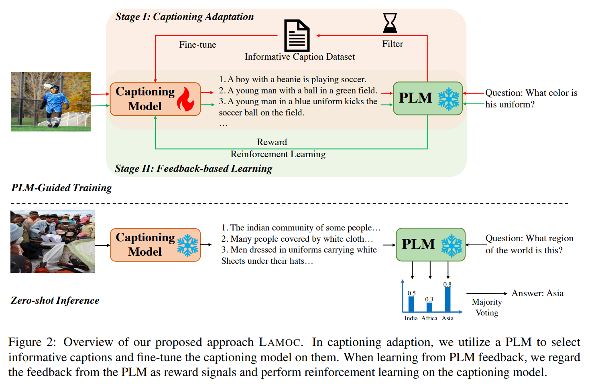
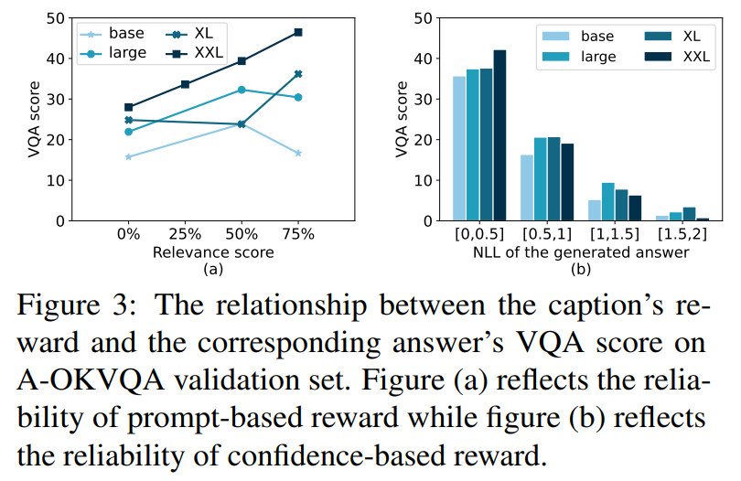
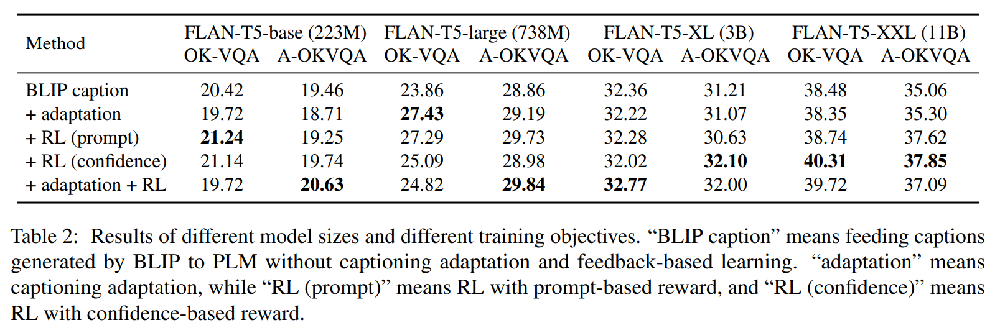
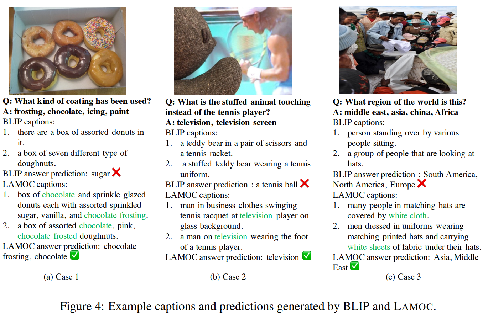

논문 및 이미지 출처 : <https://arxiv.org/pdf/2305.17006>

# Abstract

본 논문은 knowledge-based visual question answering (VQA) 를 위해 novel language model guided captioning approach 인 **LAMOC** 을 제안한다. 

* 본 접근법은 captioning model 이 생성한 caption 을 answer prediction model 의 context 로 사용하며, 이 prediction model 은 pre-trained language model (PLM) 이다. 
* 주요 기여로서, 저자의 방법은 prediction model 의 guidance 와 feedback 을 활용하여 captioning model 의 capability 를 향상시킨다. 
* 이를 통해 captioning model 은 PLM 으로부터 task goal 과 information need 를 인지할 수 있다. 

본 접근법을 개발하기 위해 두 단계의 specific training stage 를 설계한다. 

* 첫 번째 stage 는 captioning model 이 prediction model 에 적응하도록 하여 (training 에 더 적합한 caption proposition 을 선택), 
* 두 번째 stage 는 PLM 의 feedback 으로부터 학습함으로써 captioning model 을 task goal 에 따라 tuning 한다. 

Extensive experiment 결과, 제안하는 접근법이 knowledge-based VQA task 에서 효과적임을 확인한다. 특히 challenging A-OKVQA dataset 에서 LAMOC 은 여러 competitive zero-shot method 보다 우수하며, fine-tuned VLP model 에 필적하는 결과에 도달한다.

# 1 Introduction

최근 pre-trained language models (PLMs), 특히 large language models 이 background knowledge 혹은 complex reasoning 이 요구되는 task (e.g., commonsense reasoning, logical reasoning) 를 해결하는 데 뛰어난 capability 를 보이는 것이 입증되었다. 이러한 성과에 영감을 받아, 최근 연구들은 PLM 을 활용하여 complex vision-language task 를 해결하는 방안을 제안했으며, 그 대표 사례가 outside knowledge 에 기반해 image 와 open-ended question 을 주었을 때 답을 생성하는 knowledge-based visual question answering (VQA) task 이다. 기존 연구에서는 pure vision-language pre-trained (VLP) model 에 비해 PLM-enhanced approach 가 knowledge-based VQA task 에서 일반적으로 더 향상된 performance 를 보이는 것으로 나타났다.

기존 PLM-enhanced VQA approach 는 크게 두 가지 라인으로 나눌 수 있다.
1. 첫 번째 라인은 PLM 이 vision modality 에 적응하도록 specific modular network 또는 training objective 를 도입하는 방식이다. 
   * 하지만 이러한 방식은 vision encoder 를 PLM 에 효과적으로 통합하기 위해 pre-training 단계에서 높은 computational cost 를 요구한다.
2. 두 번째 라인은 PLM 을 zero-shot 또는 few-shot 방식으로 활용하여 vision-language task 에서 PLM tuning cost 를 줄이려는 연구들이다. 
   * 이 방식은 captioning model (e.g., fine-tuned VLP model) 을 사용해 image 에 대한 caption 을 생성하고, 생성된 caption 을 PLM 의 question answering 을 돕는 context (e.g., prompt) 로 사용한다. 
   * 이러한 접근은 training-free 이며 다양한 PLM 에 일반적으로 적용 가능하다.

그러나 기존 zero-shot·few-shot 방식에서는 captioning model 이 integrated PLM 의 task goal 과 information need 를 인지하지 못한다. 즉, 기존 방식은 caption dataset 에 fine-tuned captioning model 을 그대로 재사용한다. 그 결과, 생성 caption 은 VQA task 에 충분히 informative 하지 않거나 question 과 무관할 수 있다. 


Fig. 1 의 예시에서 볼 수 있듯, question 은 “icing” 혹은 “frosting” 과 같은 keyword 와 강하게 관련되지만, captioning model 은 이를 포착하지 못하고 일반적인 description 만을 생성하여 PLM 의 answer prediction 이 잘못되도록 만든다.

이 문제를 해결하기 위해, 저자는 VQA task 를 위한 novel LAnguage MOdel guided Captioning approach 인 **LAMOC** 을 제안한다. 핵심 아이디어는 prediction model (i.e., PLM) 의 guidance 와 feedback 을 활용하여 captioning model 의 capability 를 강화하고, captioning model 이 task goal 과 information need 를 인지하여 prediction model 의 answer prediction 을 지원할 수 있게 만드는 것이다. 본 접근법은 두 단계의 gradual training stage 로 구성된다.

* 첫 번째 stage 에서 captioning model 은 prediction model 에 align 되도록 학습된다. 
  * 이때 prediction model 은 captioning model 이 생성한 multiple proposition 중 question 과 더 관련된 caption 을 선택한다. 
  * 이 selected caption 들은 informative 하며, captioning model 을 fine-tune 하는 데 사용되어 informative caption 을 생성하도록 만든다.
* 두 번째 stage 에서는 PLM 이 generated caption 을 VQA 의 direct evidence 로 사용하므로, PLM 의 feedback 을 reward signal 로 활용하여 reinforcement learning 으로 captioning model 을 학습한다. 
  * Training 동안 captioning model 만 tuning 되며 PLM 은 고정되므로 computational cost 가 크게 절감된다. 
  * 동시에 feedback 이 PLM 에 기반하므로 두 stage 모두 labeled data 를 요구하지 않는다.

저자의 기여는 다음과 같이 요약된다.

1. 저자는 VQA task 에서 PLM 을 지원할 informative caption 을 생성하도록 captioning model 을 training 하는 novel approach 인 LAMOC 을 제안한다.
2. 적은 수의 무작위로 sampling 된 unlabeled (image, question) pair 만을 사용하여, LAMOC 은 OK-VQA 및 A-OKVQA 의 두 knowledge-based VQA dataset 에서 PLM feedback 이 없는 여러 competitive zero/few-shot baseline 보다 일관되게 뛰어난 성능을 보인다.
3. 저자는 223M 에서 11B 규모까지 다양한 PLM 에 대해 본 방법의 효과를 입증했다. 이는 접근법의 robustness 를 보여줄 뿐 아니라 large language model (LLM) 로의 generalization 가능성 또한 시사한다.

# 2 Related Work

#### PLMs for VQA

large corpus 로 training 된 이후, PLM 은 vision-language pre-training 으로는 얻기 어려운 chain-of-thought reasoning, in-context learning, instruction following 등의 surprising ability 를 보인다. 따라서 일부 연구는 PLM 을 활용하여 VQA 를 수행하며 promising result 를 얻는다. 

한 연구 라인은 PLM 과 vision encoder 를 결합하여 end-to-end 로 training 한다. 

* *Frozen* 과 Liang et al. 은 visual encoder 혹은 modular network 를 training 하고 PLM 을 frozen 상태로 유지하여 PLM 의 powerful ability 를 보존한다. 
* *Flamingo* 는 vision model 과 language model 을 결합하는 model architecture 를 정교하게 설계하고 model size 를 80B 까지 scale 한다. 

또 다른 연구 라인은 few-shot/zero-shot 방식으로 PLM 을 VQA task 에 적용하려는 시도이다. 

* *PICa* 와 *Img2Prompt* 은 image 를 caption 또는 tag 로 변환하고 GPT-3 을 사용하여 in-context learning 방식으로 question 에 대한 answer 를 생성한다. 
* *PNP-VQA* 는 question-related caption 을 생성하고 QA model 을 활용하여 answer prediction 을 수행한다. 이러한 유형의 연구는 추가 training 을 요구하지 않으며, 새로운 PLM 에 쉽게 적응할 수 있다. 

저자의 연구는 두 번째 paradigm 을 따르며, 해당 연구들의 extension 이다.

#### Learning from Feedback

일반적인 model training paradigm 은 loss function 을 정의하고 이를 optimize 하는 방식이다. 그러나 text generation 에서 coherence, diversity, toxicity 등의 특정 objective 는 loss function 에 쉽게 통합하거나 end-to-end 로 학습하기 어렵다. 따라서 model output 에 대한 explicit feedback 이 training 을 보조하는 learning signal 로 활용된다. 

* Campos and Shern 은 PLM 의 refinement 와 human feedback 을 사용하여 summary model 을 fine-tune 한다. 
* Wang et al. 은 compiler feedback 을 활용하여 language model 이 생성한 program 의 compilability 를 향상시킨다. 
* Ouyang et al. 은 human feedback 기반 reinforcement learning 을 통해 language model 을 user intention 에 align 시킨다. 

저자는 이러한 연구들로부터 아이디어를 차용하지만, 저자의 feedback 은 human 이 아닌 PLM 에서 오므로 annotation cost 를 절감한다.

# 3 Method

본 절에서는 제안하는 LAMOC: LAnguage MOdel guided Captioning method for VQA 를 제시한다. LAMOC 의 전체 architecture 는 Fig. 2 에 나타나 있다.



## 3.1 Overview of Our Approach

본 연구는 visual question answering (VQA) task 를 다룬다. 

image-question pair $x : \langle x_{i}, x_{q} \rangle$ 가 주어졌을 때, image $x_{i}$ 를 기반으로 question $x_{q}$ 에 대한 correct answer $y$ 를 예측하는 것이 task goal 이다. 기존 연구들을 따라, 본 연구는 captioning-based approach 를 채택하며, captioning model 이 answer prediction 을 돕기 위한 auxiliary caption 을 생성한다. 이를 probabilistic 방식으로 표현하면 다음과 같다:

$$
p(y \mid x_{i}, x_{q}) = \sum_{z \in \mathcal{Z}} \underbrace{p(z \mid x_{i}, x_{q}; \Theta_{C})}_\text{caption generation}
\cdot
\underbrace{p(y \mid x_{q}, z; \Theta_{P})}_\text{answer prediction},
\tag{1}
$$

* 여기서 captioning model $\Theta_{C}$ 은 auxiliary caption $z$ 를 먼저 생성하고, 
* prediction model $\Theta_{P}$ 는 question $x_{q}$ 와 caption $z$ 를 바탕으로 answer candidate $y$ 를 예측한다.
* 본 연구는 생성된 caption 집합에 대해 위 확률을 평가한다.

본 연구는 **unsupervised setting** 을 고려한다: labeled answer data 는 사용하지 않는다. 다만 소량의 image-question pair 를 training 용으로 사용할 수 있다고 가정하며, 이 pair 는 task dataset 과 겹치지 않는다.

본 probabilistic approach 를 구현하기 위해, vision-language pre-trained (VLP) model 인 *BLIP* 을 captioning model 로 사용하고, pre-trained language model (PLM) 인 *FLAN-T5-XXL* 을 prediction model 로 사용한다. prediction model $\Theta_{P}$ 은 answer 를 정확히 예측하는 역할을 하며, captioning model $\Theta_{C}$ 은 $\Theta_{P}$ 에 informative evidence 를 제공하는 보조 역할을 수행한다. 

본 접근법에서는 captioning model $\Theta_{C}$ 만 tuning 되며 prediction model $\Theta_{P}$ 는 최적화 과정에서 고정된다. labeled answer 가 없는 image-question pair 를 활용하여 두 모델을 협력하도록 설계한다: captioning model 은 informative evidence 를 생성하고, prediction model 은 captioning model 의 개선을 위한 task-specific guidance 와 feedback 을 제공한다.

본 접근법을 최적화하기 위해 두 단계의 gradual training process 를 설계한다:

1. **captioning adaptation** 단계에서는 $\Theta_{C}$ 가 $\Theta_{P}$ 에 적합하도록 informative caption 을 생산하도록 조정한다 (§3.2.1).
2. **feedback-based learning** 단계에서는 $\Theta_{P}$ 로부터의 task-specific feedback 에 따라 $\Theta_{C}$ 를 최적화한다 (§3.2.2).

captioning model 이 충분히 training 되면, 최종 answer prediction 은 Eq. (1) 에 따라 captioning model 이 제공하는 caption 을 기반으로 prediction model 을 사용하여 수행한다 (§3.3). 이후 각 구성 요소를 상세히 설명한다.

## 3.2 Language Model Guided Captioning

본 접근 (Eq. (1)) 의 핵심은 prediction model $\Theta_{P}$ 의 capability 를 향상시키기 위해 effective captioning model $\Theta_{C}$ 를 training 하는 것이다. labeled answer 가 없으므로, prediction model 의 guidance 와 feedback 을 captioning model 최적화에 활용한다.

## 3.2.1 Captioning Adaptation

captioning model 은 원래 image 를 묘사하기 위해 설계되었으므로 prediction model 을 보조하는 형태의 caption 을 바로 생성하지 못할 수 있다. 따라서 저자는 captioning model 을 prediction model 에 맞추어 tuning 하는 captioning adaptation 전략을 제안한다.

#### Caption Propositions

1. 먼저 VQAv2 에서 $n$ 개의 image-question pair 를 sample 한다. VQAv2 는 1M 개 이상의 question 을 포함하는 큰 VQA dataset 이며, 본 task dataset 과 겹치지 않는다. 
2. 이후 captioning model 을 사용해 각 image 에 대해 nucleus sampling 을 활용하여 $k$ 개의 caption proposition 을 생성한다. 이 중 일부 caption 은 prediction model 에 더 적합하다. 

저자는 이러한 caption 을 식별하고 captioning model 을 refinement 하는 데 활용하고자 한다.

#### Instruction-based Captions Selection

prediction model 로 사용되는 FLAN-T5-XXL 은 방대한 parameter 를 통해 많은 knowledge 를 내재하고 있다. 저자는 다음과 같은 instruction 을 설계하여 FLAN-T5-XXL 이 question 과 caption 의 관련성을 식별하도록 한다:

```
Question: [QUESTION] Caption: [CAPTION]
To what degree does the caption relate to the question:
A: 0%
B: 25%
C: 50%
D: 75%
```

이 prompt 에 대해 FLAN-T5-XXL 은 {A, B, C, D} 중 하나를 출력한다. 이 option 은 caption 과 question 의 correlation 정도를 반영하며, “D:75%” 로 예측된 caption 이 가장 관련성이 높다. prediction model 이 직접 선택한 caption 이므로 answer prediction 에 더 유용할 가능성이 크다. 따라서 “D:75%” 로 판단된 caption 만 유지하고 나머지는 제거한다.

#### Captioning Model Fine-tuning

위 selection 을 거쳐 prediction model 이 판단한 informative caption 집합을 얻게 된다. 이를 활용하여 captioning model 을 다음 cross-entropy loss 로 fine-tune 한다:

$$
\mathcal{L}_{FT} = -
\frac{1}{T}
\sum_{t=1}^{T}
\log p(z_{t} \mid x_{i}, z_{<t}),
\tag{2}
$$

* 여기서 $T$ 는 caption length, 
* $z_{t}$ 는 FLAN-T5-XXL 이 선택한 informative caption 의 $t$-th token, 
* $z_{<t}$ 은 $(t-1)$ 번째까지의 token 을 의미한다. 
* fine-tuning 이후 captioning model 은 prediction model 에 더 적합해진다.

### 3.2.2 Feedback-based Learning

prediction model 에 대한 adaptation 이후에도, captioning model 은 여전히 VQA 의 answer prediction task 자체를 인지하지 못한다. 따라서 저자는 prediction model 로부터의 PLM feedback 에 기반하여 pseudo supervision signal 을 구성하는 방법을 추가로 제안한다. 

captioning model 은 answer prediction 을 위한 intermediate component 로만 참여하므로, 저자는 이를 최적화하기 위한 reinforcement learning 방법을 설계한다.

#### Reward From PLM Feedback

reinforcement learning 에서 핵심 설계 요소는 reward function 의 정의이다. 본 접근에서 captioning model 은 단순히 image 와 관련된 caption 을 생성하는 것뿐 아니라, *answer 를 얼마나 잘 찾도록 돕는지*로 성능이 평가되어야 한다. 이를 위해 두 가지 종류의 reward signal 을 설계한다.

* **Prompt-based Reward:**
  heuristic 한 방법으로, §3.2.1 에 사용된 prompt 를 다시 활용하여 FLAN-T5-XXL 이 relevance score 를 생성하게 하고, 이를 reward 로 사용한다:
  $$
  r(x_q, z)
  =
  \argmax_{s \in \{0, 0.25, 0.5, 0.75\}}
  p(s \mid x_q, z; \Theta_P).
  \tag{3}
  $$
  score 가 높을수록 보다 informative 한 caption 임을 의미하며, 더 높은 score 가 장려된다.
* **Confidence-based Reward:**
  training 동안 ground-truth answer 가 존재하지 않기 때문에, Eq. (1) 을 따르며 prediction model 이 출력하는 predicted answer (가장 confident 한 candidate) 의 probability score 를 reward 로 사용한다:
  $$
  r(x_q, z)
  =
  p(\hat{y} \mid x_q, z; \Theta_P),
  \tag{4}
  $$
  * 여기서 $z$ 는 captioning model 이 생성한 caption 이고, 
  * $\hat{y}$ 는 prediction model 이 예측한 answer 이다. 
  * 이 방식으로 PLM 은 생성 caption 의 informativeness 를 captioning model 에 전달한다: probability score 가 클수록 caption 이 informative 하며, 작을수록 informative 하지 않다. 

저자는 §5.1 에서 이러한 reward 설계의 reliability 를 검증한다.

#### Policy Gradient

reinforcement learning framework 에서 caption generation 은 vocabulary space 전체에 걸쳐 이루어지는 sequential decision-making process 로 볼 수 있다. $T$ tokens 으로 구성된 caption 하나는 length $T$ 의 episode 로 간주된다. $t$-th step 에서 state $(x_i, z_{<t})$ 는 image 와, $(t-1)$-th token 까지 생성된 caption 의 조합이며, action $z_t$ 는 생성할 $t$-th token 이다.

저자는 policy gradient algorithm 을 사용하며 다음 objective function 을 gradient descent 로 최적화한다:

$$
\mathcal{L}_{RL}=-\sum_{t=1}^T
r(x_q, z)
\log p(z_t \mid x_i, z_{<t}; \Theta_{\text{cap}}),
\tag{5}
$$

* 여기서 $z = \langle z_1, \ldots, z_t, \ldots, z_T \rangle$ 는 caption 전체이며, 
* $r(x_q, z)$ 는 PLM 이 제공하는 reward 이다. 

최종적으로 두 loss function 을 joint optimization 한다:

$$
\mathcal{L}=(1 - \alpha) \cdot L_{FT}+\alpha \cdot \mathcal{L}_{RL},
\tag{6}
$$

* 여기서 $\alpha$ 는 두 부분의 균형을 맞추는 weight factor 이다. 
* FLAN-T5-XXL 이 제공하는 online feedback 을 충분히 활용하기 위해, training 초기 epoch 에서는 captioning adaptation loss $\mathcal{L}_{FT}$ 만을 최적화하고, reinforcement learning loss $L_{RL}$ 은 전체 training 과정에 걸쳐 지속적으로 최적화한다.

## 3.3 Answer Prediction

inference 시점에서, 저자는 updated captioning model 을 활용하여 prediction model 이 question 에 answer 하도록 돕는다. 구체적으로 $p(y \mid x_q, z; \Theta_P)$ 를 계산한다. caption 의 diversity 와 answer coverage 를 높이기 위해, image 전체에서 20% patch 를 random sampling 하여 updated captioning model 로 top-k sampling 을 수행해 caption 을 생성한다. 이 절차를 $m$ 회 반복하여 $m$ 개의 diverse caption 을 얻는다.

그다음 각 caption 을 question 과 연결하여 다음 prompt 를 구성한다:

```
Please answer the following question.
[CAPTION]. [QUESTION]
```

이 prompt 를 기반으로 FLAN-T5-XXL 은 greedy decoding 을 사용하여 answer 를 제안한다. 최종 answer 는 모든 생성 answer 에 대해 max-voting 전략을 사용할 수 있다.

기존의 learning-from-feedback 연구들과 달리, 본 접근법은 human annotation 이 아닌 prediction model 로부터의 guidance 와 feedback 을 활용한다. §5.1 의 empirical study 에 따르면 PLM 이 부여하는 negative log likelihood 와 generated answer 의 VQA score 사이에는 negative correlation 이 존재한다. 이 결과는 PLM 의 reward $r(x_q, z)$ 가 labeled data 의 대체로 사용되어 VQA task 를 위한 captioning model 을 향상시키는 데 도움이 될 수 있음을 시사한다.

# 4 Experiment

본 절에서는 experimental setup 을 제시한 뒤, 실험 결과로부터 도출되는 주요 결론을 강조한다.

## 4.1 Experimental Setup

#### Task Datasets

본 연구의 목표는 visual commonsense task 에서 PLM 의 performance 를 향상시키는 것이므로, 저자는 제안한 방법을 평가하기 위해 두 개의 knowledge-based VQA dataset 을 선택한다.

1. **OK-VQA** 는 5,046 개의 test question 을 포함하며, 문제 해결을 위해 external knowledge resource 가 필요한 dataset 이다.
2. **A-OKVQA** 는 OK-VQA 기반으로 확장된 dataset 으로, OK-VQA 와 비교해 더욱 다양한 유형의 world knowledge 를 요구한다. A-OKVQA 의 test set 은 공개되어 있지 않기 때문에 validation set 에 대해 평가한다.

저자는 VQAv2 는 사용하지 않는다. 이 dataset 의 대부분의 question 은 recognition 과 simple visual detection task 에 초점이 맞춰져 있으며, logical reasoning 또는 external knowledge 가 크게 필요하지 않고, fine-tuned VLP model 이 매우 높은 성능을 보일 수 있기 때문이다. 또한 다른 방법들과의 fair comparison 을 위해 training data 를 사용하지 않는다.

#### Baselines

기존 방법은 다음 두 범주로 구분한다.

1. extra large-scale V-L pre-training 을 사용하지 않는 방법\
   이 범주에 속하는 모델들은 large-scale V-L dataset 에서 pre-training 되지 않았으며, 다음과 같은 방법들이 포함된다: PICa, PNP-VQA, Img2Prompt. LAMOC 또한 이 범주에 속한다.
2. extra large-scale V-L pre-training 을 사용하는 방법\
   이 범주의 방법들은 PLM 과 vision encoder 가 V-L dataset 에 대해 joint training 되어 있으며(PLM 이 frozen 일 수 있으나 image 이해 능력은 획득한다), 다음과 같은 모델들이 포함된다: VL-T5, FewVLM, VLKD, Frozen, Flamingo.
   이들 방법은 labeled data 를 사용하지 않거나 매우 적게 사용하며(zero-shot/few-shot), baseline 으로 포함한다.

추가적으로, large amount 의 labeled data 로 fine-tune 된 BLIP 및 PromptCap 을 비교 방법에 포함한다.

#### Implementation Details

image captioning 을 위해 저자는 446M parameter 를 가진 BLIP 을 채택하며, COCO 2014 training set 에서 fine-tune 된 공개 checkpoint 를 사용한다. COCO 2014 dataset 은 OK-VQA 및 A-OKVQA 와 어떤 overlap 도 없다.

PLM 으로는 instruction 기반으로 1,800 개 이상의 task 에 대해 fine-tune 되어 world knowledge 를 다량 보유한 FLAN-T5-XXL 을 사용한다. 또한 PLM 규모가 223M 에서 11B 까지 다양하게 달라지는 경우에 대해서도 실험을 수행하여, 제안 방법의 robustness 및 다양한 규모의 PLM 에 대한 generalizability 를 확인한다.

captioning adaptation stage 에서 informative caption dataset 을 선정할 때, relevance score 의 reliability 문제 때문에 작은 PLM 대신 FLAN-T5-XXL 을 사용한다. 이 점은 §5.1 에서 다시 논의된다.

captioning model 을 training 할 때, label 이 없는 VQAv2 의 1,000 개 image-question pair 를 사용한다(이는 target dataset 의 training data 대비 약 10% 수준이다). 이는 OK-VQA 및 A-OKVQA 와 겹치지 않는다. 또한 이 1,000 개 pair 는 임의의 dataset 혹은 생성된 데이터에서도 sampling 가능하며, reproducibility 를 위해 VQAv2 에서 sampling 한다.

answer 는 pre-defined answer list 를 사용하지 않고 PLM 이 auto-regressive 하게 생성한다.

저자는 5 개 random seed 로 실험을 수행하며, official evaluation protocol 에 따라 평균 VQA score 를 보고한다.

## 4.2 Main Results

Table 1 은 OK-VQA 와 A-OKVQA 에서 저자의 방법과 baselines 의 결과를 보여준다.


* 첫째, LAMOC 은 large-scale V-L pre-training 없이도 strong zero-shot baseline 인 PNP-VQA 를 두 dataset 모두에서 능가한다. 
  * 유사한 model size 를 갖는 PNP-VQA 및 Img2Prompt 와 비교할 때, LAMOC 은 challenging 한 A-OKVQA dataset 에서 두드러진 향상을 보인다 (38.2 vs 36.0, 그리고 38.2 vs 33.3). 
    * 이러한 유의미한 성능 향상은 제안 방법의 effectiveness 를 명확히 보여준다. 반면 OK-VQA 에서의 개선은 미미하다. 
    * 이는 OK-VQA 의 question 은 복잡한 reasoning 을 크게 요구하지 않으며, answer 가 일반적인 caption 에 포함되어 있을 가능성이 높기 때문이다. 따라서 feedback 기반 training 없이도 일부 baseline 들은 유사하거나 더 나은 결과를 얻을 수 있다.
  * 한편 Flamingo 는 massive V-L dataset 으로 training 되었기 때문에 zero-shot 방법 중 가장 우수한 성능을 보인다. 
    * large-scale V-L pre-training 은 image 와 knowledge concept 사이의 mapping 을 형성할 수 있어 knowledge-based VQA 를 지원할 수 있음이 보고된 바 있다. 
    * 이러한 baseline 과 비교하면, 저자의 접근은 추가적인 image-question matching 또는 question generation module 을 요구하지 않아 inference 속도가 더 빠르다.
* 둘째, LAMOC 은 fine-tuning 을 수행한 방법과 수행하지 않은 방법 사이의 성능 격차를 줄이며, fine-tuned VLP model 인 BLIP 과도 유사한 결과에 도달한다. 
  * 예를 들어 PNP-VQA11B 와 BLIP 간 성능 차이는 2.5 이지만, LAMOC 적용 이후 이 차이는 0.3 으로 감소한다. 이는 language model feedback 의 중요성을 시사한다.
* 마지막으로, Table 2 는 서로 다른 model size 에 대한 저자의 방법의 결과를 보여준다. 
  * model scale 을 223M 에서 11B 로 증가시키면, challenging 한 A-OKVQA dataset 에서 VQA score 가 1–4 point 향상됨을 관찰한다. 
  * 이는 larger PLM 이 question answering 을 돕기 위해 더 많은 world knowledge 를 저장할 수 있을 뿐 아니라, captioning model 의 refinement 를 위한 feedback 역시 더 정확하게 제공할 수 있음을 의미한다. 
  * 이러한 관찰은 §5.1 의 ablation study 에서 추가로 뒷받침된다.

# 5 Analysis

## 5.1 The Reliability of Feedback From PLM

본 연구의 핵심 아이디어는 PLM 의 feedback 을 활용하여 caption generation 을 guide 하는 것이므로, feedback 의 reliability 가 매우 중요하다. 



LAMOC 은 두 종류의 feedback 을 사용하며, 각각 독립적으로 평가한다:

(1) prompt-based reward, \
(2) confidence-based reward.

* 첫 번째 유형의 feedback 의 reliability 를 평가하기 위해, 저자는 A-OKVQA validation set 에서 PLM 이 제공한 relevance score 와 VQA score 의 관계를 분석하였다(Fig. 3(a)). 
  * FLAN-T5-XXL 이 제공하는 relevance score 가 증가함에 따라 VQA score 또한 증가하는 경향을 보인다. 
  * 이는 FLAN-T5-XXL 이 정확한 feedback 을 제공하기에 적합한 prediction model 임을 보여주며, relevance score 가 reward signal 로 사용될 수 있음을 의미한다. 
  * 반면 다른 세 모델은 이러한 추세가 나타나지 않아 feedback 이 unreliable 함을 시사한다. 따라서 captioning adaptation 단계에서 informative caption 을 선택할 때 FLAN-T5-XXL 만 사용한다.
* 두 번째 유형의 feedback 의 reliability 를 평가하기 위해, 저자는 caption 을 conditioning 하여 FLAN-T5 가 question 에 답하도록 prompt 하고, 생성된 answer 의 negative log-likelihood (NLL) 과 해당 answer 의 VQA score 간의 관계를 분석하였다. 
  * Fig. 3(b) 에 따르면, NLL 과 VQA score 사이에는 negative correlation 이 존재한다. 이는 NLL 이 낮을수록 caption 이 더 informative 하고 question 과 더 관련성이 높다는 것을 의미한다. 
  * 따라서 answer probability 는 reliable feedback 이며 reinforcement learning 의 reward signal 로 사용할 수 있다.

## 5.2 The Effectiveness of Two-stage Training

captioning model 을 training 할 때, 저자는 두 가지 gradual training stage 를 채택하였다: captioning adaptation 과 feedback-based learning. 본 절에서는 이러한 training strategy 의 효과를 분석하고, 두 단계 중 어떤 단계가 더 영향력이 있는지 탐구한다. 



* Tab. 2 에서 볼 수 있듯, 서로 다른 모델은 training objective 에 따라 다양한 이득을 보인다. 예를 들어 captioning adaptation 단계는 FLAN-T5-large 에 특히 유리하며 OK-VQA 에서 약 4 point 의 향상을 가져온다. 
* 반면 FLAN-T5-XXL 은 prompt-based reward 를 사용하는 reinforcement learning 에서 가장 큰 성능 향상을 보이며 A-OKVQA 에서 4 point 이상 향상된다. 
* 또한 두 objective 를 joint training 할 경우 performance 가 추가적으로 향상되며, 이는 제안한 two-stage training approach 의 효과를 강조한다.

## 5.3 Case Study

Fig. 4 는 BLIP 과 LAMOC 이 생성한 caption 과, FLAN-T5-XXL 이 생성한 answer 의 세 가지 예시를 보여준다. 



* LAMOC 은 BLIP 을 기반으로 training 되었기 때문에, 두 결과의 차이는 제안 방법의 효과를 반영한다. 
* 관찰해 보면, LAMOC 이 생성한 caption 은 더 길고 comprehensive 하며, question 과 관련된 key information 을 포함한다. 
  * 예를 들어 Fig. 4(a) 에서 LAMOC 은 “frosting”, “chocolate” 과 같은 구체적인 detail 을 포함하는 caption 을 생성하지만, BLIP 은 “donuts”, “box” 와 같은 일반적 표현만 생성하여 question 을 answer 하는 데 필요한 정보를 충분히 제공하지 못한다. 
  * 이는 PLM 의 guidance 아래 captioning model 을 training 하는 것이 중요함을 보여준다.
* 한 가지 우려는 PLM 이 caption 의 정보가 아니라 language bias 때문에 correct answer 를 생성할 가능성이다. 
  * 예를 들어 Fig. 4(a) 에서 caption 이 chocolate 을 언급하지 않아도 PLM 이 “chocolate” 을 answer 로 생성할 수 있다. 
  * 이는 chocolate 이 training corpora 에서 donuts 와 자주 co-occur 하기 때문에 PLM 이 이러한 연관성을 통해 answer 를 생성했을 가능성이 있다. 
  * 이러한 상황이 얼마나 자주 발생하는지 확인하기 위해, 저자는 prediction model 이 correct answer 를 생성한 100 개 question 을 random sampling 하여, answer 가 caption 에 기반한 것인지 manual assessment 를 수행하였다. 
  * 그 결과 100 개 중 6 개의 caption 만이 question 과 무관한 것으로 나타났으며, 이는 caption 의 reliability 를 뒷받침한다.
* 또한 LAMOC 이 생성한 문장은 문법적으로 incoherent 하거나 incomplete 한 경우가 있다. 
  * 이는 PLM prompting 이 항상 human language pattern 에 부합하지 않을 수 있음을 의미하며, 기존 연구들과도 일치한다. 
  * relevance 수준, caption 개수, prompt design 의 영향 등 추가적인 ablation 결과는 Appendix B 에 있다.

# 6 Conclusion

본 논문은 LAMOC 을 제안하며, 이는 image 에 대해 comprehensive caption 을 생성하여 question answering 을 돕는 captioning model 을 개선하는 language model guided captioning method 이다. 이를 위해 저자는 FLAN-T5-XXL 이 filtering 한 self-generated dataset 을 활용한 captioning adaptation 을 수행하고, 이후 PLM feedback 기반 reinforcement learning 을 통해 captioning model 을 추가로 fine-tune 한다.

제안 방법 LAMOC 은 informative 하며 PLM 의 VQA task 성능을 향상시키는 caption 을 생성함을 두 knowledge-based VQA dataset 을 통한 실험에서 확인하였다. 특히 challenging 한 A-OKVQA dataset 에서 LAMOC 은 기존 zero-shot method 를 크게 능가하며, fine-tuned VLP model 과도 유사한 결과를 달성한다. 

또한 LAMOC 은 223M 에서 11B parameter 규모까지 다양한 PLM 에 대해 generalizable 함을 보여주었으며, LLM 적용 가능성 역시 확인되었다. 이는 future work 로 남긴다.

# 7 Limitations

본 연구에서는 서로 다른 규모의 FLAN-T5 모델에서 제안 방법의 효과를 확인하였다. 그러나 더 큰 규모의 parameter 를 가진 LLM 에 대해서는 아직 평가를 수행하지 않았으며, LLM 은 더 방대한 corpus 로 pre-training 되어 있어 caption adaptation 및 reinforcement learning 과정에서 더 정확한 feedback 을 제공할 수 있을 가능성이 있다. 

또한 PLM 은 특정 bias 를 포함할 수 있으며, 이들의 feedback 에 기반한 training 은 이러한 bias 를 증폭시킬 위험이 있다. future work 에서는 LLM 에 대한 scalability 와, PLM 에 존재하는 잠재적 bias 의 negative effect 를 완화하는 전략을 탐구하고자 한다.