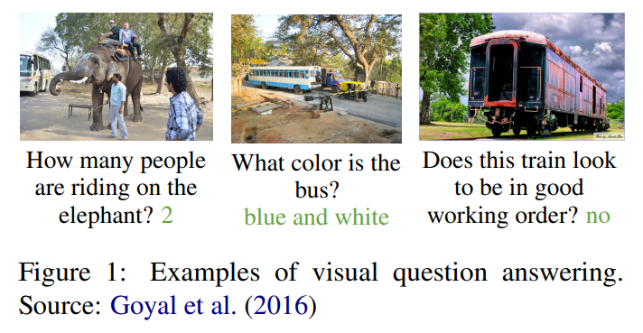
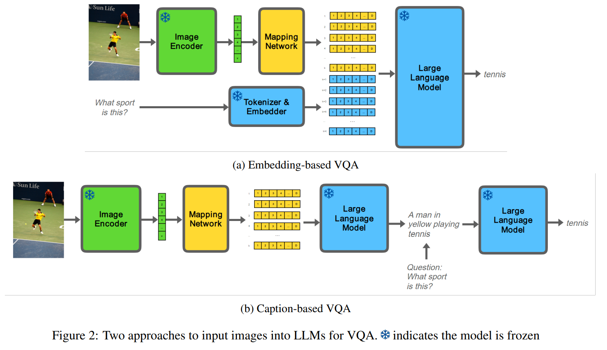
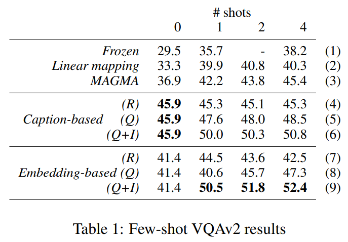

논문 및 이미지 출처 : <https://arxiv.org/pdf/2403.11317>

# Abstract

이미지를 large language models (LLMs) 에 입력하는 두 가지 접근 방식이 등장했다. 첫 번째는 이미지를 caption 으로 변환하여 자연어로 입력하는 방식이다. 두 번째는 image feature embedding 을 LLM 의 domain 으로 매핑하고, 매핑된 embedding 을 직접 LLM 에 전달하는 방식이다.

최근 few-shot multimodal 연구의 대부분은 이 두 가지 접근 방식 중 하나의 변형을 사용하는 architecture 를 통해 성능을 보고한다. 그러나 이러한 연구들은 두 접근 방식 간의 중요한 비교를 간과하고 있다. 저자는 few-shot visual question answering (VQA) 와 LLM 에 대한 이 두 가지 접근 방식을 비교하기 위해 통제되고 집중된 실험을 설계하였다.

실험 결과, 3B parameter LLM 인 Flan-T5 XL 에 대해서는 visual embedding 을 LLM 의 embedding space 에 직접 연결하는 것이 image caption 을 사용하는 것보다 항상 성능 향상을 보장하지 않는다는 것을 확인하였다. Zero-shot 환경에서는 textual image caption 을 사용하는 것이 더 우수한 결과를 보였다. Few-shot 환경에서는 in-context examples 가 어떻게 선택되는지가 어떤 접근 방식이 더 나은지를 결정하는 핵심 요인임을 발견하였다.

# 1 Introduction

인공지능의 근본적인 특징 중 하나는 multiple modality 를 통합하는 능력이다. 이는 많은 모호성을 줄이고 knowledge 획득을 지원한다. 특히, 근본적인 multimodal task 는 visual question answering (VQA) 이다. VQA 는 이미지를 활용하여 질문에 답하는 task 이다. Fig. 1 은 세 가지 예시를 보여준다.

vision 과 language 의 modality 를 통합하기 위한 노력에서, 이 두 분야의 대표적인 architecture 인 large language models (LLMs) 과 vision transformers 를 결합하려는 시도가 활발히 이루어지고 있다. LLM 은 text-to-text task 를 위한 범용 interface 이다. Vision transformer 는 이미지를 일반적인 feature representation 으로 변환할 수 있다. 그러나 이 두 모델은 별도로 학습되었기 때문에, 한 모델의 representation 을 다른 모델에서 직접 사용할 수 없다.

이를 해결하기 위해 Mokady et al. 은 image representation 을 language representation 의 domain 으로 변환하는 network 를 학습하였다. 이 변환 과정을 통해, 변환된 image representation 이 LLM 에 입력될 경우 image caption 을 생성하도록 한다. Tsimpoukelli et al. 은 이러한 변환된 image representation 을 LLM 에 전달할 때 질문을 함께 추가하여 VQA 를 수행하였다. 이 접근 방식은 Fig. 2a 에 시각화되어 있다.

VQA 의 또 다른 접근 방식은 이미지를 caption 으로 변환한 후, 이 caption 을 질문과 함께 LLM 에 자연어로 입력하는 것이다. 이 접근 방식은 Fig. 2b 에 시각화되어 있다.

few-shot VQA 에서는 in-context example 또한 LLM 의 prompt 에 함께 제공된다. 이는 올바른 응답과 함께 제시된 입력 예시로서, 원하는 동작을 나타낸다. In-context example 을 포함하면 few-shot VQA 성능이 향상된다는 것이 실험적으로 입증되었다.

최근 VQA architecture 들은 일반적으로 embedding-based 접근 방식 또는 caption-based 접근 방식의 변형을 사용한다. 그러나 이 두 접근 방식의 비교는 그동안 간과되어 왔다. 본 연구의 기여는 이 두 접근 방식을 통제된 환경에서 집중적으로 비교하는 것이다. 추가적으로, 저자는 in-context example 을 선택하는 방법이 각 접근 방식의 prediction 동작에 어떤 영향을 미치는지를 분석하였다.

# 2 Background

LLM 은 transformer 기반 model 로서, task-specific training 없이도 text-to-text task 를 수행할 수 있음이 입증되었다. 이는 주어진 context 에 기반하여 질문에 답하도록 prompt 를 받는 extractive question–answering 을 포함한다.

vision–language 연구에서 VQA 는 근본적인 task 이다. 한 가지 접근 방식은 image caption 의 형태로 시각적 정보를 LLM 에 전달하는 것이다. 이 경우 VQA task 는 extractive QA task 로 재구성된다.

한편, computer vision 분야에서 Dosovitskiy et al. 은 vision transformer (ViT) 를 제안하였다. 

* Radford et al. 은 ViT 를 위한 training objective 를 제시했는데, 이는 인코딩된 이미지와 caption 사이의 contrastive loss 를 최소화하는 것이다. 
* 이들은 이미지를 일반적인 feature representation 으로 변환할 수 있는 CLIP model 을 배포하였다.

LLM 과 ViT image encoder 를 통합하는 주요 도전 과제는 image space 와 text space 의 feature 를 정렬(alignment)하는 것이다. 

* Tsimpoukelli et al. 은 image encoder 의 출력을 frozen LLM 에 전달하는 방식으로 image encoder 를 finetune 하였다. 
* 여기서 frozen model 이란 training 과정에서 weight 가 업데이트되지 않는 model 을 의미한다. 
* 이들은 image–caption training data 를 활용하여 image encoder 의 weight 를 업데이트하였다. 

이후 embedded question 을 image embedding 에 append 하여 LLM 에 입력하는 방식으로 VQA task 를 평가하였다.

* Merullo et al. 은 CLIP image space 와 GPT-J text space 사이의 단순한 linear mapping 만으로도 유사한 결과를 달성하였다. 
* Yi-Lin Sung 과 Eichenberg et al. 은 LLM 에 few trainable parameter 를 추가하였으며, 이를 adapter 라고 한다. 
* Adapter 는 LLM transformer block 에 삽입되는 trainable MLP network 이다. 
* Alayrac et al. 은 LLM 내부에 masked cross-attention layer 를 추가하여, 각 질문이 마지막 image embedding 집합에만 attention 하도록 하였다. 
* Li et al. 은 querying transformer network 에 prompt question 을 포함하는 system 을 제안하였다. 이 두 system 은 모두 방대한 training data 를 필요로 한다.

위의 system 들은 모두 image captioning task 학습으로 시작한다. 따라서 embedding-based VQA 접근 방식을 동일한 system 이 생성한 image caption 을 사용하는 방법과 비교하는 것이 자연스러운 baseline 이 된다. 그러나 앞서 언급한 system 들 중 어느 것도 이러한 결과를 보고하지 않았다.

# 3 Two approaches to VQA

여기서는 embedding-based 접근 방식과 caption-based 접근 방식의 VQA 방법을 설명한다. 두 접근 방식을 통제된 조건에서 비교하기 위해 동일한 image feature representation 을 사용한다. 유일한 차이는 이 visual feature representation 을 먼저 image caption 으로 변환할지, 아니면 직접 LLM 에 전달할지 여부이다.

두 설정 모두 하나의 trained model 을 사용한다. 이 model 은 image encoder 와 LLM 을 연결하는 ‘mapping network’ 이다. Image encoder 와 LLM 은 frozen 상태로 두고, mapping network 의 parameter 는 입력 image 가 주어졌을 때 target caption token sequence $y$ 의 likelihood 를 최대화하도록 학습된다. Image encoder 가 frozen 이므로, 이 likelihood 는 image encoder feature embedding $x$ 가 주어졌을 때 target 의 likelihood 와 동일하다. 이 objective 는 autoregressive language model 에 대해 전개하면 Eq. 1 과 같다.

$$
\log p(y|x) = \sum_l \log p(y_l \,|\, x, y_{1:l-1})
\tag{1}
$$

1. **Image encoder (image to feature embedding)**
   Image encoder 는 image pixel value matrix $i \in \mathbb{R}^{W \times H \times 3}$ 를 $v$ 차원의 vector $x$ 로 인코딩한다.

2. **Mapping network (feature embedding to LLM image representation)**
   Mapping network 은 이 feature embedding 을 $k$ 개의 $D$-dimensional embedding 으로 매핑한다. 각각의 embedding 은 단일 textual token embedding 과 동일한 차원을 가진다.

3. **LLM (image representation to text output)**
   이 embedding 들은 LLM 에 전달되어 output token sequence $y$ 를 생성하며, 이는 groundtruth caption 과 비교된다.

저자의 두 가지 VQA 접근 방식은 다음과 같다.

#### Embedding-based

LLM 의 tokenizer 와 embedder 는 질문을 $t$ 개의 embedding 으로 변환한다. 이미지는 image encoder 와 mapping network 을 통해 $k$ 개의 LLM embedding 으로 변환된다. 이렇게 매핑된 image embedding 과 question embedding 을 concatenate 하여 함께 LLM 에 전달한다.

#### Caption-based

Caption-based VQA 에서는 LLM image embedding 만을 LLM 에 전달하여 image caption 을 생성한다. 이렇게 얻은 textual image caption 을 textual question 과 concatenate 하고, 이 prompt 를 LLM 에 전달한다.

# 4 Experimental Setup

#### Models

저자는 Flan-T5 XL, 즉 3B parameter 를 가진 autoregressive encoder–decoder LLM 을 사용한다. 이 model 은 in-context learning 에서 좋은 성능을 보이는 것으로 실험적으로 입증되었기 때문에 선택되었다. 이미지를 인코딩하기 위해서는 pretrained CLIP ViT-G model 을 사용한다. 이 두 component 는 하나의 hidden layer mapping network 으로 연결되며, 이 network 는 1280-D input, 크기가 $20 \times 2048 / 2$ 인 hidden layer, 그리고 20 개의 2048-D output embedding 으로 구성된다.

#### Datasets

training data 로는 conceptual captions dataset 을 사용한다. 이 dataset 이 제공하는 3M+ 개의 image URL 중에서 2.7M 개가 active 상태임을 확인하였다.

#### Training

* 학습 과정에서는 cross-entropy loss 를 최소화한다. 
* Frozen LLM 을 통해 loss 를 backpropagation 하고, AdamW optimizer 로 mapping network 를 업데이트한다. 
* Optimizer 는 $\beta = (0.9, 0.98)$, weight decay = 0.01 을 사용한다. 
* Learning rate 는 375 step 동안 선형적으로 $2 \times 10^{-4}$ 까지 증가한 후, 2 epoch 동안 batch size 32 로 학습하면서 선형적으로 0 까지 감소한다.

#### In-context example selection

Prompt 에 올바른 응답과 함께 입력 예시를 포함하는 것은 성능 향상에 효과적임이 입증되었으며, 이를 in-context learning 이라고 한다. 특히, "shots" 는 포함되는 sample 의 개수를 의미한다.

가장 유사한 in-context example 을 찾기 위해, train 과 validation VQAv2 image 와 question 의 CLIP embedding 을 추출한다. 저자는 최대 4 개의 in-context example 을 선택하며, 선택 방법은 무작위 선택 (R), question similarity 만 사용 (Q), 그리고 question 과 image similarity 를 50-50 으로 결합한 방법 (Q+I) 을 비교한다. 유사도 측정에는 inner product 를 사용하고, in-context example 은 FAISS index 를 통해 효율적으로 사전 계산한다.

#### Metrics

시스템은 VQA v2 benchmark 의 few-shot 환경에서 검증된다. 이 benchmark 는 214K 개의 image–question–answer validation triplet 을 포함한다. 평가에는 공식 metric 을 사용하며, 이는 예측된 답과 10 개의 human-annotated 답 사이에서 exact match 의 개수를 계산한다. 예측된 답이 최소 3 개 이상의 human annotated 답과 정확히 일치하면 점수를 획득한다. 저자는 최근 접근 방식과 동일하게 open-ended generation setting 에서 평가를 수행한다.

본 실험 설정은 Lin and Byrne 의 framework 을 기반으로 구현되었다.

모든 실험은 단일 random seed 로 한 번씩 실행된다. 저자는 system, competitor, baseline 사이의 차이를 검정하기 위해 양측(two-tailed) paired permutation test 를 수행하며, 이는 $R = 10{,}000$ 으로 근사하고, 임계값은 $\alpha = 0.01$ 로 설정한다.

#### Systems, competitors and baselines

저자는 embedding-based 와 caption-based VQA 접근 방식의 결과를 Frozen, Linear mapping, MAGMA 세 가지와 비교한다. 이 system 들은 data 와 computation 수준이 유사하다. 이러한 competitor 와의 비교는 저자의 experimental setup 의 적절성을 검증하기 위한 sanity check 역할을 한다.

# 5 Results

Tab. 1 은 VQAv2 benchmark 결과를 보여준다.

* 저자의 system 은 sanity check 를 통과함을 확인할 수 있다. 
* Few-shot VQA 에 대한 두 접근 방식 각각의 best 결과 (line 6, 9) 는 모든 shot 수에서 세 가지 competitor system (line 1-3) 보다 우수하다.
* 저자의 결과 (line 4-6 vs. line 7-9) 는 0-shot 상황에서 caption-based VQA 가 embedding-based VQA 보다 유의미하게 우수함을 보여준다 (+4.5%). 
  * 이는 동일한 visual representation 을 사용했음에도 나타나는 놀라운 결과이다. 
  * 유일한 차이는 caption-based VQA 에서 embedding 이 먼저 LLM 에 단독으로 전달되어 caption 을 생성한 후, question 과 concatenate 된다는 점이다. 
  * 이 결과는 image–text space mapping 을 image captioning task 로 학습하는 system 에 대해, caption-based 접근 방식이 반드시 비교되어야 함을 명확히 보여준다.
* 저자의 결과 (line 9) 는 zero-shot 에서 1-shot embedding-based VQA 로 갈 때 큰 성능 향상 (+9.1%) 이 있음을 보여준다. 
  * 이는 in-context example 하나만 포함되어도 task 가 명확히 제시되며, LLM 의 VQA 능력이 크게 향상된다는 것을 의미한다. 
  * 이는 task-specific training 없이도 VQA task 에 적응할 수 있게 하는 in-context learning 접근 방식이 효과적임을 보여주는 증거이다.
* 또한, question (line 5, 8) 또는 question + image (line 6, 9) similarity 기반으로 in-context example 을 선택한 모든 결과가 무작위 선택 (line 4, 7) 보다 유의미하게 우수하다. 
  * 이는 test question/image 와 유사한 example 을 제공하는 것이 단순히 무작위 example 을 제공하는 것보다 낫다는 것을 보여준다. 
  * 이는 in-context learning 접근 방식이 의도대로 작동하고 있다는 추가적인 증거이다.
* 1-shot 환경에서 embedding-based 접근 방식 (line 9) 은 caption-based 접근 방식 (line 6) 보다 우수하다 (+0.5%). 
  * 이 추세는 이후에도 이어지며, 결과는 소폭 개선되고 2-shot 과 4-shot 에서는 embedding-based 접근 방식이 caption 기반보다 약간 더 낫다. 
  * 결과는 shot 수가 증가함에 따라 plateau 에 도달하며, 이는 기존 연구와 일치한다.

저자는 caption-based 와 embedding-based 접근 방식의 prediction 동작을 비교하기 위해 다양한 분석을 수행하였다. 그중 하나는 in-context example selection 방법을 변화시키는 것이었다. 주요 발견은 두 접근 방식이 in-context example 에 대한 반응성에서 차이를 보인다는 점이다.

* 가장 두드러진 결과는 embedding-based VQA 에서, in-context example 이 question similarity 기준으로 선택될 때 나타난다 (line 8). 
  * 이 경우 task 를 적절히 보여주기 위해 최소 두 개의 shot/example 이 필요하며, 이때도 성능 향상은 이전보다 작은 수준 (+4.3%) 에 그쳤다. 
* 또한 caption-based 접근 방식은 in-context example 을 question similarity 만으로 선택했을 때, 모든 shot 수에서 embedding-based VQA (line 5 vs. line 8) 보다 항상 우수하였다.

추가적으로 저자는 color 나 counting 정보와 같은 특정 question category 에서 system 의 정확도를 분석하였다. 

* 분석 결과, embedding-based 접근 방식의 4-shot VQA 는 caption-based 접근 방식보다 세부적인 visual detail 이 요구되는 질문에서 더 많은 정답을 맞췄다 (e.g., color +4.2%, counting +2.7%). 
* 반면, 단순한 질문 (e.g., yes/no) 에서는 약간 뒤처졌다 (-0.5%). 복잡한 "why" 질문이나 location "where" 질문처럼 system 이 약한 영역에서는 두 접근 방식 모두 유사한 prediction 동작을 보였다.

# 6 Limitations

저자의 발견은 Flan-T5 XL LLM 에 한정되며, 이는 다른 closed-source LLM 만큼 크지 않다. 더 큰 model 에 대해서는 다른 결과가 나왔을 수도 있다. 또한 저자는 Li et al. 이 제시한 방식과 같은 다른 방법이 아닌, 비선형 network 를 사용하여 image–text space 사이의 mapping 을 학습하였다. 대신 저자는 caption-based 와 embedding-based 접근 방식의 few-shot VQA 를 탐구하기 위한 통제되고 집중된 실험 환경을 제시하였다.

# 7 Conclusion

본 연구에서는 few-shot VQA 의 두 가지 접근 방식을 집중적으로 비교하였다. 이 두 접근 방식의 비교는 기존 연구에서 간과되어 왔다. 저자는 CLIP 과 Flan-T5 XL embedding space 사이의 비선형 mapping 을 학습하였으며, 이를 통해 동일한 system 에서 image caption 과 embedding-based LLM image representation 을 모두 생성할 수 있었다.

저자의 결과는 비선형 mapping 과 비교적 작은 frozen LLM 을 사용할 때, visual embedding 을 LLM embedding space 에 직접 연결하는 것이 image caption 을 사용하는 것보다 반드시 성능 향상을 보장하지 않는다는 것을 보여준다. 오히려 관련성 있는 in-context example 의 선택이 훨씬 더 중요한 요인임을 확인하였다.

결론적으로 본 연구는 embedding-based visual representation 을 LLM 에 전달하는 multimodal system 에서, system-generated caption 을 활용한 결과를 보고하는 것이 반드시 수행되어야 할 중요한 비교임을 보여주었다.
