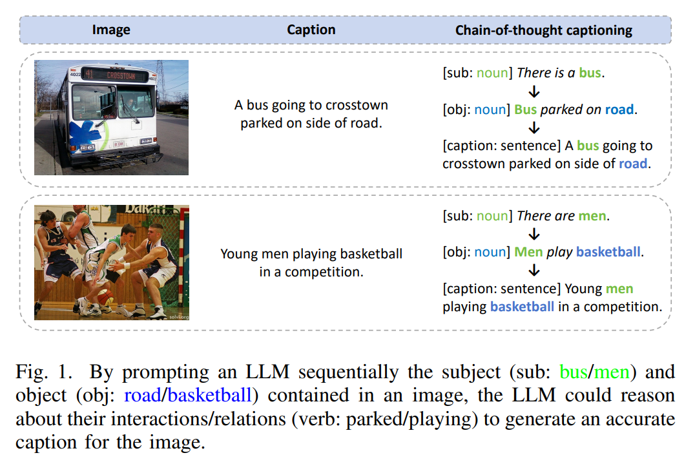
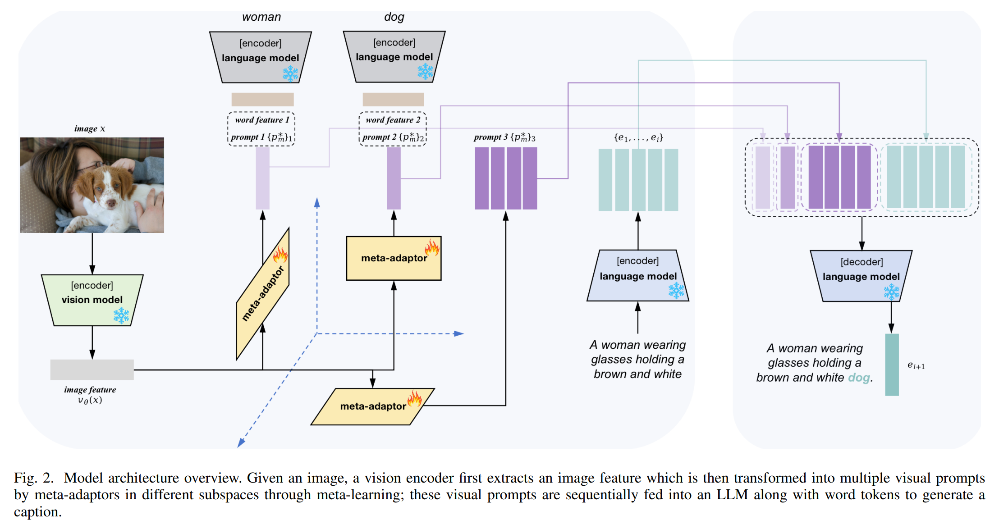
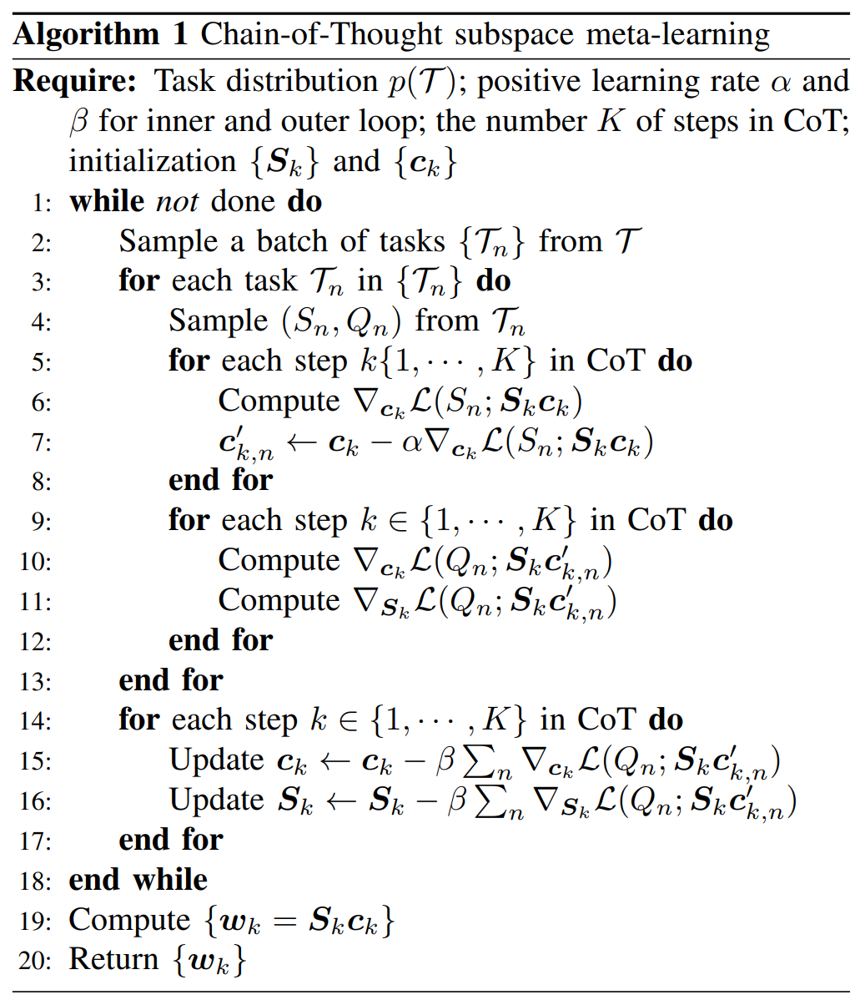
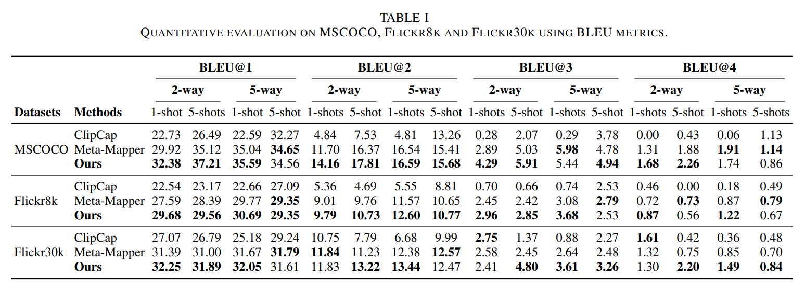
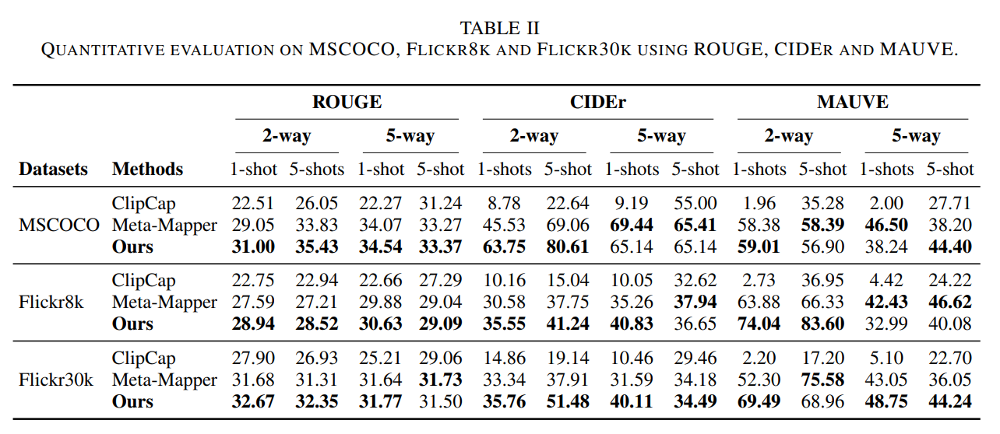
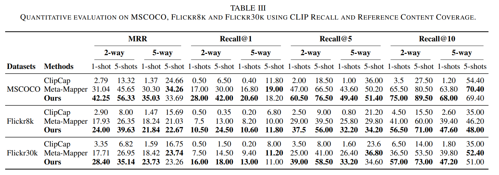
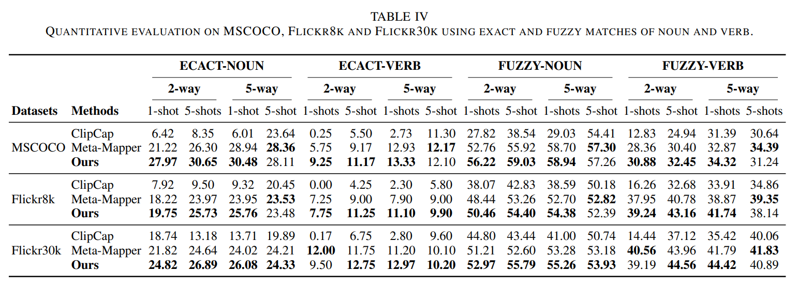
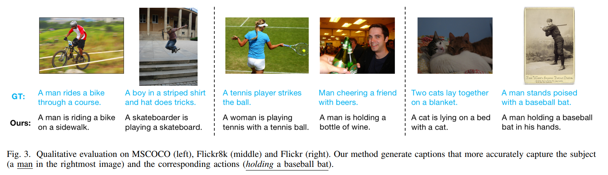
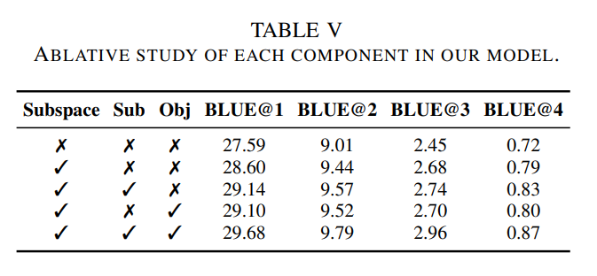

논문 및 이미지 출처 : <https://arxiv.org/pdf/2502.13942>

# Abstract

massive data 로 pretrain 된 vision 및 language model 은 visual 및 linguistic prior 를 인코딩하므로, 더 자연스럽고 사실적인 image 및 language 를 생성하기 용이하다. 그럼에도 불구하고 vision 과 language modality 간에는 여전히 상당한 domain gap 이 존재하며, 특히 few-shot setting 에서 training data 가 부족할 경우 그 간극은 더욱 두드러진다. 이러한 문제를 완화하기 위해, two frozen pretrained large vision 및 language model 을 연결하는 tunable prompt 를 도입하여 두 model 간의 gap 을 줄이는 **multi-modal meta-learning framework** 가 제안되었다.

* 기존의 multi-modal meta-learning framework 는 few-shot image captioning 에서 one-step prompting scheme 을 사용하여 input image 의 visual feature 를 축적하고 이를 language model 의 생성 과정에 반영한다. 
* 그러나 이 방식은 few training sample 만을 가지고는 정확한 image description 생성을 제대로 수행하지 못한다. 

이에 저자는 인간이 image 를 설명하는 방식을 더 잘 모방하기 위해, 

* **multi-step image captioning scheme** 로서 **chain-of-thought (CoT) meta-learning scheme** 을 제안한다.
* 또한, 각 CoT step 에 해당하는 model 의 meta-parameter 를 구분된 subspace 에서 학습하도록 하여 서로 간의 간섭을 방지하는 방법을 추가적으로 제안한다. 

저자의 방법은 MSCOCO, Flickr8k, Flickr30k 의 세 가지 일반적으로 사용되는 image captioning dataset 에 대해 few-shot setting 에서 평가되었다. 실험 결과, 저자의 chain-of-thought subspace meta-learning 전략은 다양한 metric 으로 측정된 성능에서 baseline 을 능가함을 보여준다.

# I. INTRODUCTION

Meta-learning 은 흔히 “learning to learn” 이라고 불리며, 다양한 task 로부터 meta-knowledge 를 획득하여 학습 과정을 더 효율적으로 만드는 것을 목표로 하는 성장 중인 분야이다. Meta-learning 의 주요 목적은 특히 training data 가 제한적인 상황에서도 새로운 unseen task 에 효과적으로 적응할 수 있는 algorithm 혹은 model 을 설계하는 것이다. 이러한 목적은 보통 training set 과 validation set 으로 구성된 다양한 task 들에 대해 meta-learner 를 학습시킴으로써 달성된다. Meta-learner 는 validation set 에서의 성능을 기반으로 parameter 를 최적화하고, 이를 통해 새로운 unseen task 에 빠르게 적응하여 정확한 prediction 을 할 수 있게 된다. 이러한 접근 방식은 각 task 에 대해 training data 가 부족한 few-shot learning 시나리오에서 특히 유용하다.

hardware 및 algorithm 의 한계로 인해 기존의 deep meta-learning 접근 방식은 주로 small- 에서 medium-scale neural network 의 최적화에 집중하였다. 최근에는 자연어를 이해하고 생성하도록 설계된 large language model (LLM) 이 일관되고 문맥적으로 적절한 text 를 생성할 수 있는 능력 덕분에 상당한 주목을 받고 있다. 방대한 text corpus 로 학습된 LLM 은 언어 내의 패턴과 관계를 학습하며, 기계 번역, text generation, 질의응답 등 다양한 NLP 분야에 적용되어 왔다. 유사하게, large vision model (LVM), 흔히 vision Transformer 라 불리는 model 은 다양한 vision task 에서 뛰어난 성능을 보여주었다. 이러한 model 은 원래 NLP 를 위해 제안된 Transformer architecture 를 기반으로 하며, self-attention mechanism 을 활용하여 image patch 간의 전역적 의존성을 포착하고, image 내의 다양한 영역 및 객체 간의 관계를 이해한다. Massive image dataset 으로 pretrain 하면 풍부한 visual representation 을 학습하게 되며, 이를 그대로 사용하거나 특정 downstream task 에 대해 fine-tuning 하여 다양한 CV benchmark 에서 state-of-the-art 성능을 달성한다. 그러나 LLM 과 LVM 의 training 과정은 막대한 계산 자원을 필요로 하므로 시간과 하드웨어 cost 가 매우 크다는 단점이 있다.

이러한 계산적 제약에도 불구하고 pretrained LLM 과 LVM 은 NLP 와 CV 분야를 크게 발전시켰다. 예를 들어, Brown et al. 은 GPT-3 에게 단순히 text 로 few-shot demonstration 을 제공했을 때, gradient update 나 fine-tuning 없이 대부분의 language task 를 수행할 수 있음을 보여주었다. 그러나 LLM 과 LVM 을 모두 포함하는 multi-modality model 에 few-shot learning 능력을 확장하는 것은 여전히 도전적이다. 그 이유는 LLM 과 LVM 의 embedding space 간의 불일치 때문이다. 이전 연구는 LLM 의 parameter 를 고정한 채 LVM 의 parameter 만을 업데이트하여 visual feature 를 학습하거나, frozen pretrained LVM 의 visual feature 를 조정하기 위해 lightweight 한 learnable meta-mapper 를 도입하여 frozen LLM 과 LVM 의 embedding space 간의 간극을 줄이고, few-shot visual question answering 을 수행하였다.

위의 연구들은 학습되거나 조정된 visual feature 를 “prompt” 로 간주하여 LLM 이 특정 task (e.g., image captioning, visual question answering) 의 출력을 생성하도록 유도하였다. Prompt 가 LLM 이 response 를 생성하기 위한 context 를 제공하는 조건으로 사용될 수 있다는 점에서 영감을 얻은 것이다. 그러나 저자는 복잡한 multi-modality task 에 대해 single-stage prompting 만으로는 LLM 이 정확한 응답을 생성하기에 충분하지 않다고 본다. 예를 들어, image captioning 에서 input image 의 단일 global visual feature 만 LLM 에 제공하는 것은 LLM 이 보유한 언어 prior knowledge 를 충분히 활용하지 못한다. Image 는 보통 여러 상호작용하는 객체를 포함하는데, LLM 은 이러한 객체를 명시적으로 식별하고 주목하지 않는 한, 그들의 상호작용을 추론하여 정확한 description 을 생성하지 못할 수 있다.

Chain-of-Thought (CoT) prompting 은 LLM 에서 reasoning 을 유도하기 위한 전략이다. 이는 최종 응답을 생성하기 전에 multi-stage reasoning path 를 삽입하는 방식으로, LLM 이 일련의 논리적 단계를 거쳐 원하는 답에 도달하도록 하여 더 정교한 reasoning 능력을 발휘하게 한다. 이 접근 방식은 논리적 사고를 필요로 하는 task 에서 LLM 의 성능을 향상시킬 수 있다.

저자는 meta-learning framework 에서 multi-modal few-shot image captioning 을 위해 LLM 과 LVM 을 연결하는 과정에 **CoT** 를 도입한다. 

* 이는 인간이 image 를 설명하는 과정 역시 논리적 사고 과정으로, image 내의 객체를 식별하고 그들의 관계를 구분하여 시각적 단서와 공간적 배열에 기반한 일관된 서사를 구성하는 과정과 유사하기 때문이다. 
* 구체적으로, 저자는 few-shot 시나리오에서 LLM 을 sequential 하게 prompt 하여 image 내 주체의 visual feature, 객체의 visual feature, 그리고 최종적으로 image 의 global visual feature 를 제공하여 caption 을 생성하도록 한다. 
* 저자는 image 내의 주체와 객체에 조건을 두면, LLM 이 보유한 언어 prior knowledge 를 활용하여 그들의 상호작용을 추론하고 정확한 description 을 생성할 수 있다고 가정한다.

이러한 CoT 학습 과정은 MAML 과 같은 meta-learning framework 에 embedding 된다. 

* 더 나아가, CoT 의 각 단계는 서로 다른 정보를 prompt 로서 image 로부터 추출하므로, 저자는 각 subspace 가 해당 CoT 단계의 고유한 meta-knowledge 를 담도록 하는 subspace parameter 구조를 제안한다. 
* 각 subspace 의 basis 는 meta-parameter 로 사용되며, CoT 의 각 단계에서 meta-learner 는 각 subspace 로부터 파생된 prompt-specific model 을 구성한다. 
* 이후 meta-learner 는 task model 과 관련된 weighted validation loss 를 최소화하여 subspace basis 를 refinement 한다.

저자의 방법은 MSCOCO, Flickr8k, Flickr30k 의 세 가지 널리 사용되는 image captioning dataset 에 대해 few-shot 시나리오에서 평가되었으며, 실험 결과 제안된 방법이 비교된 접근 방식보다 우수함을 보여준다.

# II. RELATED WORK

## Large-scale language and vision models

Attention mechanism 과 Transformer 의 등장은 large-scale language model 의 출현을 이끌었으며, 이는 sequence 내 long-range dependency 문제를 효과적으로 해결하였다. 대표적인 예로 BERT, GPT-2, GPT-3, ChatGPT, GPT-4 가 있다. BERT 는 Transformer 의 encoder 를 활용하여 입력 text 전체를 동시에 읽고, text 내 단어 간 관계를 학습하여 bidirectional context 를 이해하도록 설계되었다. 반면 GPT 계열 model 은 Transformer 의 decoder 를 사용하여 text 를 unidirectional 하게 처리하며, 주어진 모든 이전 단어를 기반으로 문장의 다음 단어를 예측하도록 학습된다.

한편, large vision model 또한 CV 및 multi-modal 분야에서 등장하였다. Vision Transformer (ViT) 는 Transformer architecture 를 image patch 와 word token 간의 유사성으로 확장하였다. 

* 이후 Swin Transformer, MAE, IPT, BeiT 등 다양한 변형 model 이 제안되었으며, 이들은 ViT 를 다양한 vision task 에 적응시켜 탁월한 성능을 보였다. 
* 동시에 multi-modal 분야에서도 Transformer 는 cross-modal data interaction 을 위해 활용되었다. 
  * 예를 들어, CLIP 은 text-image alignment 를 위해, Coca 와 ClipCap 은 image captioning 을 위해, DALL-E 는 text-to-image generation 을 위해, PALI 는 visual question answering 을 위해 사용되었다. 
* 또한 BLIP 은 noisy web data 의 caption 을 bootstrap 하여 large language-vision model 을 학습하였으며, BLIP-2 는 lightweight Querying Transformer 를 통해 modality 간의 간극을 줄였다.

## Prompt and chain-of-thought

Prompting 은 pretrained LLM 을 knowledge base 로 간주하고, downstream task 에 유용한 정보를 추출하여 원하는 응답을 생성하도록 유도하는 방식이다. 이 방법론은 few examples 를 prompt 로 사용하고 고정된 task induction 과 결합하여 LLM 이 정확한 출력을 생성하도록 한다. 

* Prompt 는 보통 사람이 직접 설계하지만, prompt tuning 이 도입되면서 수동 설계 대신 soft prompt 를 학습하여 frozen LLM 이 특정 downstream task 를 수행하도록 하였다. 
* 이 방식은 pretrained LLM 의 embedding space 구조를 유지하면서도 특정 task 에 적응하게 한다. 
* 이후 L2P, AutoPrompt 와 같은 연구는 잠재적인 prompt 집합에서 가장 효과적인 prompt 를 선택하는 방법을 제안하였다. 
* Prompt tuning 개념은 CV 에서도 주목받았다. Adaptformer 는 pretrained ViT 를 효율적으로 적응시키기 위해 prompt tuning 을 적용하였으며, CoOp 및 CoOpOp 은 pretrained large vision-language model 에 prompt tuning 을 적용하여 context word 를 learnable vector 로 변환하였다.

최근에는 Chain-of-Thought (CoT) prompting 이 LLM 의 multi-step intermediate reasoning 능력을 추출하는 데 널리 사용되고 있다. 

* CoT 는 LLM 이 복잡한 문제를 해결하기 위해 intermediate reasoning chain 을 생성하도록 유도한다. 
* 예를 들어, language model 의 reasoning 과정을 활용하여 robot interaction 및 question answering 을 수행하는 연구가 제안되었다. 
* EmbodiedGPT 는 embodied AI 를 위한 end-to-end multi-modal foundation model 을 제안하며, CoT 를 사용하여 효과적인 embodied planning 을 구현하였다. 최근 연구는 CoT 의 경험적 성공을 바탕으로 circuit complexity theory 를 사용해 그 기저 메커니즘을 설명하였다.

## Meta-learning and few-shot learning

Meta-learning 의 목적은 inductive bias 를 습득하고 새로운 unseen task 에 빠르게 적응하는 것이다. Meta-learning algorithm 은 일반적으로 세 가지 범주로 구분된다.

* **Metric-based approaches**: 공통 embedding space 를 학습하고 prototype 을 meta-knowledge 로 생성하는 방법
* **Memory-based approaches**: 외부 memory 를 meta-knowledge 로 활용하여 새로운 task 에 빠르게 적응하는 방법
* **Optimization-based approaches**: 다양한 task 에서 좋은 model initialization 을 meta-knowledge 로 학습하여 새로운 sample 에 효율적으로 적응하는 방법

Meta-learning 은 소수의 training sample 만으로도 일반화가 가능하게 하여 few-shot learning 문제를 해결하는 데 효과적임이 입증되었다. 이 접근 방식은 다양한 learning task 에 대해 model 을 학습시켜, 제한된 data 로 새로운 task 에 빠르게 적응할 수 있게 하며, 이는 인간 학습의 효율성과 유사하다. 

* 최근 vision 과 language modality 를 아우르는 multimodal few-shot learning 도 주목받고 있다. 
* 첫 번째 multimodal few-shot learner 가 제안된 이후, prompting 및 in-context learning 기반의 다양한 전략이 제안되었다. 
* Flamingo 는 700억 개의 parameter 를 가진 초대형 vision-language model 을 활용하여 in-context learning 을 수행하였다. 
* MiniGPT-4 는 frozen visual encoder 와 frozen LLM 을 단일 projection layer 를 통해 정렬하였다. 
* 그러나 저자의 목표는 이러한 초대형 model 과 달리, 훈련 가능한 parameter 수가 훨씬 적은 lightweight model 을 사용하면서도 다양한 task 로부터 meta-knowledge 를 획득하여 새로운 unseen task 에 빠르게 적응하는 것이다.

## Image captioning

Image captioning task 는 image 의 시각적 data 에 담긴 content 와 context 를 해석하고 기술하기 위해 서술적 text 를 생성하는 것이다. 이 task 는 크게 retrieval-based 와 generation-based 두 가지 방식으로 해결된다.

* **Retrieval-based approaches**: corpus 에서 주어진 image 를 가장 잘 설명하는 완전한 문장을 검색
* **Generation-based approaches**: visual encoder 로 image feature 를 추출한 뒤, LSTM 이나 Transformer 와 같은 sequence-to-sequence model 을 사용하여 caption 을 단어 단위로 생성

정확한 image feature 추출을 위해, 기존 연구는 object detector 로 생성된 Region-of-Interest (RoI) feature 를 사용하였다. 

* Text generation 측면에서는 초기 연구들이 LSTM 을 주로 사용했으며, 이후 Transformer 기반 attention model 이 caption 예측에 활용되었다. 
* 최근 연구들은 retrieval-based 와 generation-based 접근을 통합하여, in-context captioning 개념과 일치하는 방식으로 발전하였다. 
* Pretrained LLM 의 generalization 능력을 활용하기 위해 LLM 의 weight 를 부분적으로 또는 완전히 고정하여 catastrophic forgetting 을 방지하기도 한다. 
* ClipCap 과 I-Tuning 은 lightweight tunable image captioning model 로, CLIP 을 pretrained vision encoder 로, GPT-2 를 language decoder 로 사용한다. 
* ClipCap 은 input image 의 fixed-length CLIP embedding 을 GPT-2 language space 로 매핑하기 위해 prefix-tuning 을 사용하며, I-Tuning 은 CLIP 으로부터 visual memory embedding 을 추출하여 GPT-2 의 hidden state 출력을 조정한다. 
* SMALLCAP 은 retrieval augmentation 을 통해 성능을 유지하면서도 trainable parameter 수를 크게 줄였다. 
* 또한 Yang et al. 은 임의로 in-context image-caption pair 를 선택하는 대신, image 와 caption 을 전략적으로 선택하여 in-context pair 를 구성하는 방법을 제안하였다.

# III. METHOD

이 절에서는 few-shot image captioning 을 위한 multi-modal chain-of-thought subspace meta-learning 방법을 설명한다. 

먼저 Sec. III-A 에서 few-shot image captioning 문제를 정의하고, 이어서 Sec. III-B 에서 저자의 meta-learning vision-language model architecture 를 설명한다. 이후 Sec. III-C 에서 chain-of-thought caption generation 절차를 기술하며, 마지막으로 Sec. III-D 에서 subspace meta-learning 방법을 상세히 다룬다. 

저자의 목표는 meta-learning 의 맥락에서 제한된 image-caption pair data 만으로도 새로운 captioning task 에 빠르게 적응할 수 있는 vision-language model 을 개발하는 것이다.

## A. Problem Formulation

traditional supervised learning 과 달리, meta-learning 은 meta-dataset 의 집합을 포함하며, 이는 상호 배타적인 meta-train set 과 meta-test set 으로 분할된다. 

* Meta-train 단계에서 model 은 meta-train set 에 대해 학습되고, 별도의 meta-test 단계에서 meta-test set 으로 평가된다. 
* 구체적으로, meta-train set 은 서로 다른 inner-train set (또는 support set) $\{\mathcal{S}_n\}$ 과 inner-test set (또는 query set) $\{\mathcal{Q}_n\}$ 으로 구성된 meta-dataset $\{\mathcal{D}^{tr}_n\}$ 로 이루어진다. 
* 따라서 meta-train set 은 다음과 같이 정의된다: $\{(\mathcal{S}_1, \mathcal{Q}_1), \cdots, (\mathcal{S}_n, \mathcal{Q}_n), \cdots\}$
- 각 pair $\{(\mathcal{S}_n, \mathcal{Q}_n)\}$ 은 task $\mathcal{T}_n$ 을 의미한다. 

Few-shot $N$-way $K$-shot setting 에서, individual task $\mathcal{T}_n$ 의 $S_n$ 은 $N$ 개의 object category 혹은 class 마다 $K$ 개의 labeled sample 을 포함한다. 즉, $S_n = \{(x^n_1, y^n_1), \cdots, (x^n_{KN}, y^n_{KN})\}$. 여기서 $x^n_j$ 는 image 를 나타내고 $y^n_j$ 는 대응되는 caption 을 나타낸다. 

유사하게 query set 은 $\mathcal{Q}_n = \{(x^n_1, y^n_1), \cdots, (x^n_{LN}, y^n_{LN})\}$ 으로 정의되며, $L$ 은 각 object category 혹은 class 당 sample 의 수를 의미한다. $L$ 은 $K$ 와 다를 수 있다.

* Task distribution $p(\mathcal{T})$ 가 주어졌을 때, 먼저 batch of tasks $\{\mathcal{T}_n\} \sim p(\mathcal{T})$ 를 sampling 하고, 각 task $\mathcal{T}_n$ 에 대해 $N$ 개의 object category 를 무작위로 선택한 뒤, 각 category 에 대해 $K$ 개와 $L$ 개의 image-caption pair 를 선택하여 $\mathcal{S}_n$ 과 $\mathcal{Q}_n$ 을 구성한다. 
* Meta-test set $\{\mathcal{D}^{te}_m\} = \{(\mathcal{S}_1, \mathcal{Q}_1), \cdots, (\mathcal{S}_m, \mathcal{Q}_m), \cdots\}$ 역시 유사한 방식으로 구축된다. Few-shot setting 에서 $N$ 은 상대적으로 작으며, 보통 1 에서 5 사이의 값으로 설정된다.

위의 notation 을 사용하면, meta-train 단계는 다음과 같이 수식화된다.

$$
\omega^{*} = \argmin_{\omega} \log p(\omega \mid \{\mathcal{D}^{tr}_n\}), \tag{1}
$$

- 여기서 $\omega$ 는 meta-train set 으로부터 learned *across-task* knowledge, 즉 *meta-knowledge* 로 정의된다.
* Meta-test 단계에서 학습된 meta-knowledge 는 각 unseen task 의 captioning 을 위한 predictive model 학습에 사용된다. 
* $m$-th meta-test task 에 대해, meta-knowledge 에 조건부인 optimal model parameter 는 다음과 같이 구한다.

$$
\theta^{*}_m = \argmax_{\theta} \log p(\theta \mid \omega^{*}, \mathcal{S}_m) \tag{2}
$$

* 그리고 $\theta^{*}_m$ 의 성능은 $Q_m$ 에 대해 평가된다. 
* 여기서 $(\mathcal{S}_m, \mathcal{Q}_m) \in \{\mathcal{D}^{te}_m\}$ 이다.
* 이때 $\omega$ 는 저자의 경우와 같이 initial neural network parameter 일 수도 있고, parameterized loss function 이나 regularization term 의 hyper-parameter 일 수도 있다.

## B. Model Architecture

Fig. 2 에 나타난 바와 같이, 저자의 model 은 세 가지 구성 요소로 이루어진다: frozen LVM encoder, 여러 개의 learnable meta-adaptor, 그리고 encoder 와 decoder 로 이루어진 frozen LLM 이다. input image 가 주어지면, LVM encoder 가 먼저 image feature 를 추출하고, 이 feature 는 meta-adaptor 를 통해 여러 visual prompt 로 변환된다. 이후 이 visual prompt 들은 순차적으로 LLM 에 입력되어 caption 을 생성한다. Meta-adaptor 의 parameter 는 서로 다른 subspace 에서 meta-learning 을 통해 학습된다.

#### Vision encoder

Pretrained LVM encoder 를 $v_{\phi}$ 로 표기하며, 학습 과정에서 parameter $\phi$ 는 고정된다. 주어진 image $x$ 에 대해 vision encoder 는 image feature $v_{\phi}(x)$ 를 추출한다.

#### Meta-adaptor

CoT 의 $k$-th step (다음 subsection 에서 설명)에서, image feature $v_{\phi}(x)$ 를 LLM 의 latent space 로 변환하여 visual prompt 로 사용하기 위해, $c$ 개의 learnable parameter $\{p_1, \cdots, p_c\}_k$ 를 image feature 앞에 붙인다. 

* 결과적으로 $k$-th step 에서의 sequence 는 $[\{p_{1\cdots c}\}_k, v_{\phi}(x)]$ 가 된다. 
* 그런 다음 multi-head attention block 을 적용하여 전체 sequence 를 동시에 인코딩한다. 
* 이 block 은 trainable meta-parameter $\theta$ 를 가지는 meta-adaptor $f_{\theta}$ 로 작동하며, 다음과 같이 정의된다:

$$
f_{\theta}(Q, K, V) = \sigma(QK^\top)V, \tag{3},
$$

* 여기서 $\sigma$ 는 softmax function 을 의미한다. 
* Eq. (3) 에서 $Q = K = V = [\{p_{1\cdots c}\}_k, v_{\phi}(x)]$ 로 설정되며, 
* output 은 learned parameter vector $\{p^\ast_{1\cdots c}\}_k$ 로 표현된다:

$$
\{p^\ast_{1\cdots c}\}_k = f_{\phi}([\{p_{1\cdots c}\}_k, v_{\phi}(x)]). \tag{4}
$$

* Self-attention block 은 image feature $v_{\phi}(x)$ 로부터 의미 있는 정보를 추출하고, 이를 여러 visual prompt $\{p^\ast_{1\cdots c}\}_k$ 로 축적한다. 
* Meta-adaptor 의 meta-parameter 는 meta-train set $\{D_n^{tr}\}$ 의 모든 task 에 대해 학습되고 공유된다. 
* Meta-adaptor 의 parameter 수는 LVM 의 parameter 수보다 수십~수백 배 작기 때문에, training 은 빠르고 효율적이며, task 당 training data 가 부족한 상황에서도 더 빠른 수렴을 가능하게 한다.

#### Language model

* Language model 은 $l_{\psi}$ 로 표기되며, parameter $\psi$ 를 가지고 text sequence $y$ 에 대한 probability distribution 을 model 한다. 
* 구체적으로, caption 의 $i$-th token 을 예측하기 위해 language model 은 visual prompt 의 chain $\left\{ \{p^\ast_{1\cdots c}\}_1, \cdots, \{p^\ast_{1\cdots c}\}_k \right\}$ 와 token embedding $\{e_1, \cdots, e_{i-1}\}$ 를 입력으로 받아 auto-regressive 방식으로 다음 token 을 생성한다:

$$
e_i = l_{\psi}([\{p^\ast_{1\cdots c}\}_1, \cdots, \{p^\ast_{1\cdots c}\}_k, e_1, \cdots, e_{i-1}]). \tag{5}
$$

* Few-shot 시나리오에서는 task 당 이용 가능한 sample 이 제한적이므로, $\psi$ parameter 는 pretrained LLM 의 parameter 로 초기화하고 학습 과정에서 고정한다. 
* 이 초기화는 language prior 로 작용하여, LLM 에 방대한 knowledge base 를 처음부터 내재화한다. 
* 이러한 parameter 는 학습 전체 과정 동안 고정되어, LLM 의 generalization 능력을 활용하면서도 task-specific data 에 과적합되는 것을 방지한다.

## C. Chain-of-Thought: Prompt Chaining

저자는 image captioning scheme 를 순차적 인지 추론 메커니즘으로 분해할 것을 제안한다. 이를 위해 일련의 causal prompt 를 chain 으로 구성하며, 각 prompt 는 순차적으로 정보를 받아 전달한다. 인간의 captioning scheme 를 모방한 CoT image captioning 을 구현하기 위해, 저자는 Subject-Verb-Object (SVO) 개념을 reasoning mechanism 으로 활용한다. Fig. 1 에 나타난 것처럼, SVO 는 다음과 같이 정의된다:

$$
\text{SVO} = \{\mathrm{sub}, \textit{verb}, \mathrm{obj}\}, \tag{6}
$$

* 여기서 `verb` 는 image 내의 주요 action/activity 를 포함하는 술어를 의미하며, 
* `sub` 는 `verb` 와 연관된 주체 역할을, 
* `obj` 는 주체와 대응되는 객체 역할을 나타낸다. 

언어학적 유형론에서 SVO 구조는 문장에서 주어가 먼저, 동사가 두 번째, 목적어가 세 번째로 오는 것을 의미한다. SVO 는 image sentence 에 포함되는 정보의 세분화를 정밀하게 제어할 수 있는 메커니즘을 제공한다.

SVO 의 구성은 자동화되거나 manual annotation 을 통해 달성될 수 있다. 

* `sub` 와 `obj` 는 일반적으로 image 내의 객체를 지칭하는 명사이므로, 기존 pretrained image classification model 이나 image tagging model 을 통해 높은 정확도로 식별할 수 있다. 
* `verb` 의 경우, 정확한 action/activity recognition 을 위한 pretrained model 이 존재하지 않으므로, pretrained LLM 에 저장된 language prior 를 활용하여 caption 내에서 생성한다.

주어진 image $x$ 에 대해, 목표는 $x$ 를 text sequence $y$ 로 설명하는 것이며, 이는 본질적으로 확률 $p(y|x)$ 를 추정하는 문제이다. 위에서 논의한 인간의 인지 추론 방식을 기반으로, 이 task 를 CoT 의 세 단계로 분해한다:

1. `sub` 생성
2. `obj` 예측
3. `sub` 와 `obj` 를 포함하고 그들을 연결하는 `verb` 가 포함된 caption 생성

즉,

$$
p(y|x) = p(\textrm{sub}|x) \, p(\textrm{obj}|\textrm{sub}, x) \, p(y|\textrm{obj}, \textrm{sub}, x). \tag{7}
$$

* Eq. (7) 의 우변에 있는 세 항은 $k=3$ reasoning step 을 형성한다. 
* 이러한 접근 방식을 통해 각 단계는 이전 reasoning 의 결과를 흡수하고 현재 단계의 인지 과정을 수행한다. 
* 따라서 저자의 sequential prompt 는 captioning 을 위한 내재적 reasoning 능력을 유지한다.

## D. Subspace MAML

Model-Agnostic Meta-Learning (MAML) 은 model parameter 를 최적화하여, 최소한의 추가 학습만으로 새로운 task 에 빠르게 적응할 수 있도록 설계되었다. MAML 에서 meta-parameter 는 새로운 task 에 적응하기 이전에 model 이 시작하는 initial parameter set 을 의미한다. 목표는 적은 gradient step 과 제한된 data 만으로도 새로운 task 를 빠르고 효과적으로 학습할 수 있게 하는 initial parameter set 을 찾는 것이다. 따라서 이러한 meta-parameter 는 다양한 task 에 최소한의 학습으로 fine-tuning 될 수 있는 범용적인 출발점을 제공한다. MAML 에서는 모든 meta-parameter 가 shared parameter space 에서 학습된다.

그러나 CoT 의 각 단계는 image 에서 상이한 수준의 정보를 포착한다. 예를 들어,

* subject level $\leftrightarrow p(\textrm{sub}|x)$
* subject + object level $\leftrightarrow p(\textrm{obj}|\textrm{sub}, x)$
* image content level $\leftrightarrow p(y|\textrm{obj}, \textrm{sub}, x)$

따라서 meta-parameter 를 shared parameter space 에서 학습하는 것은 비합리적이다. 이에 저자는 각 CoT step 의 meta-parameter 를 서로 다른 subspace 에서 학습할 것을 제안한다.

* Meta-adaptor 의 single layer 를 예로 들면, 이는 all layers 로 쉽게 확장 가능하다. CoT 의 $k$-th step ($k \in \{1, \cdots, K\}$)에서 이 layer 의 meta-parameter 는 $w_k \in \mathbb{R}^{d \times p}$ 로 표현된다. 
* 여기서 각 column $w_k[:, i] \in \mathbb{R}^d$ 는 subspace $S_k$ 에 속한다. 
* 또한 각 subspace $S_k$ 는 동일한 차원 $D$ 를 가진다고 가정한다. 
* $S_k \in \mathbb{R}^{d \times D}$ 는 $S_k$ 의 basis 를 의미하며, 각 column $S_k[:, j] \in \mathbb{R}^d$ 는 base vector 를 나타낸다. 
* 따라서 $w_k$ 는 $S_k$ 의 column 들의 선형 결합으로 계산될 수 있다:

$$
w_k = S_k c_k, \tag{8}
$$

* 여기서 $c_k \in \mathbb{R}^{D \times p}$ 는 계수이다. 
* $\{c_1, \cdots, c_K\}$ 와 $\{S_1, \cdots, S_K\}$ 는 학습해야 할 meta-parameter set 을 이룬다.

형식적으로, CoT 의 $k$-th step 에서 base learner 는 fixed subspace $S_k$ 내에서 model parameter $w_k$ 를 탐색한다. 각 subspace $S_k$ 내에서 subspace basis 의 최적 선형 결합 $c_k^\ast$ 는 다음과 같이 정의된다:

$$
c_k^\ast = \argmin_{c_k \in \mathbb{R}^{D \times p}} \mathcal{L}(\{D^{tr}_n\}; S_k c_k). \tag{8}
$$

* 결과적으로 $S_k c_k^\ast$ 는 CoT 의 $k$-th 단계에서 해당 subspace 와 연관된 meta-parameter 를 나타낸다. 
* 저자는 $S_k c_k^\ast$ 의 해를 gradient descent iteration 으로 근사하며, 이는 MAML 및 그 변형과 유사하다. 초기값에서 시작하여,

$$
c_k' = c_k - \alpha \nabla_{c_k} \mathcal{L}(S_n; S_k c_k), \tag{10}
$$

여기서 $\alpha$ 는 양의 learning rate 를 의미한다. 이 학습 과정은 Algorithm 1 에 기술된다.

# IV. EXPERIMENTS

이 절에서는 제안한 model 을 few-shot image captioning task 에 대해 세 가지 널리 사용되는 dataset 상에서 다양한 setting 과 여러 metric 으로 평가한다. Sec. IV-A 에서 실험 setup 을 설명하고, Sec. IV-B 에서 실험 결과를 제시하고 분석한다.

## A. Experimental Setup

#### Datasets.

Multi-modal few-shot meta-learning framework 을 평가하기 위해, dataset 은 episode scheme 에 따라 task sequence 로 구성되어야 한다. Meta-train 단계에서는 MSCOCO-2017 captioning dataset 의 training set 을 사용하며, 각 image 는 약 5 개의 crowd-sourced caption 을 가진다. 이 dataset 을 기반으로 image 내 object category $N$ 을 기준으로 $N$-way $K$-shot 방식으로 task 를 구성한다. Meta-test 단계에서는 다음을 사용한다:

1. MSCOCO-2017 captioning dataset 의 validation set,
2. 8,000 장의 image 로 이루어진 Flickr8k,
3. 31,000 장의 image 로 이루어진 Flickr30k.

이들 dataset 역시 각 image 가 5 개의 crowd-sourced caption 으로 annotation 되어 있다. Flickr8k 와 Flickr30k dataset 에 대해서는 pretrained RAM 을 사용하여 각 image 를 tagging 하고, exact match 및 fuzzy match 를 통해 MSCOCO-2017 dataset 이 제공하는 80 개 category 중 하나로 분류하였다. Object category 는 meta-train set 과 meta-test set 사이에서 disjoint group 으로 분리된다.

#### Metrics.

전통적인 n-gram-based score 인 BLEU, METEOR, ROUGE, CIDEr 를 사용한다. 추가적으로, n-gram 기반 score 의 한계를 극복하기 위해 caption 품질을 평가하는 automated measure 두 가지를 도입한다: CLIP Recall 과 Reference Content Coverage. CLIP Recall 은 CLIP 을 recall model 로 사용하여 생성된 caption 의 specificity 를 측정한다. 이를 위해 각 image 와 해당 caption 의 CLIP embedding 을 계산한 후, image 와 모든 caption 간의 CLIP-Score 를 산출하고, mean reciprocal rank (MRR) 및 recall\@1, 5, 10 을 구한다. MRR 값이 높을수록 meta-test set 내에서 더 구별 가능하고 상세한 caption 을 의미한다. Reference Content Coverage 는 생성된 caption 과 ground-truth caption 간의 명사와 동사의 exact/fuzzy match 비율을 계산하여, image 의 정보를 caption 이 얼마나 유지하는지를 정량화한다.

#### Train and inference.

두 가지 학습 절차를 평가한다:

1. 전통적인 mini-batch 기반 학습 (non-episodic)
2. multi-modal task batch 로 학습하는 episodic 학습 (제안 방법)

이 두 절차는 train-test 간 domain shift 여부에 따라 두 가지 context 에서 평가된다:

1. cross-domain multi-modal few-shot learning: MSCOCO-2017 에서 학습(episodic 및 non-episodic)하고 Flickr8k, Flickr30k 에서 평가
2. in-domain multi-modal few-shot learning: train/test partition 모두 MSCOCO-2017 에서 구성

#### Implementation details.

Vision encoder 는 CLIP 기반 ViT/B-32 를 사용하여 512 차원의 visual feature 를 생성한다. Language model 은 GPT-2 로, word embedding dimension 은 768 이다. Vision 및 language model 모두 학습 중에 고정된다. Learnable visual prefix 는 실험적으로 CoT 의 세 단계에서 각각 {1, 1, 4} 길이로 설정되며, 차원은 768 이다. Meta-adaptor 는 Xavier uniform initialization 으로 초기화된다. Meta-learning hyperparameter 는 inner-loop gradient update 1 회, learning rate 0.01 로 설정된다. Meta-update 는 AdamW optimizer 를 사용하여 meta-learning rate 0.001 로 수행되며, meta-batch 당 32 개의 task 가 포함된다.

## B. Results & Discussion

MSCOCO-2017, Flickr8k, Flickr30k dataset 에서 수행된 실험은 제안한 multi-modal chain-of-thought subspace meta-learning 의 few-shot image captioning 성능을 평가한다. 

* Tab. 1 ~ Tab. 4 에 나타난 바와 같이, 1-shot 과 5-shot setting 의 2-way 및 5-way 정확도를 ClipCap 과 Meta-Mapper baseline 과 비교하였다. 
* 저자의 방법은 대부분의 경우 다양한 metric 에서 baseline 을 능가하였다.

특히, Meta-Mapper 는 meta-learning framework 를 사용하지만 global visual prompt 하나만을 사용하는 반면, 저자의 방법은 image captioning scheme 를 CoT 방식의 여러 단계로 분해하여 더 우수한 성능을 보였다. 

* Tab. 4 에서 주목할 점은, `verb` 에 해당하는 visual prompt 를 명시적으로 추출하지 않았음에도 불구하고, 제안된 방법이 exact/fuzzy `verb` match 성능에서 가장 좋은 결과를 달성했다는 것이다. 
* 이는 저자의 visual CoT 가 pretrained LLM 에 내재된 language prior 를 효과적으로 활용할 수 있음을 의미한다. 정성적 결과는 Fig. 3 에 제시된다.

#### Non-episodic and episodic scheme.

ClipCap 역시 pretrained LVM encoder 와 LLM 의 embedding space 를 정렬하기 위해 attention module 을 채택하며, 저자의 model 과 동일한 architecture 를 사용한다. 그러나 non-episodic, 즉 meta-learning framework 없이 학습되므로, Tab. 1 ~ Tab. 4 에서 보이는 것처럼 대부분의 경우 가장 낮은 성능을 보였다. 이는 학습 단계와 추론 단계에서 scheme 의 불일치가 meta-learning framework 부재로 인해 성능 저하로 이어졌음을 보여준다.

#### In-domain and cross-domain learning.

저자의 model 은 MSCOCO-2017 training set 으로 학습되고, in-domain set (MSCOCO-2017 validation set) 및 cross-domain set (Flickr8k, Flickr30k) 에서 평가되었다. 그 결과,

1. MSCOCO 에서의 성능이 Flickr8k 및 Flickr30k 보다 높았으며, 이는 저자의 예상과 일치한다.
2. Cross-domain setting 에서도 저자의 방법은 ClipCap 및 Meta-Mapper 를 능가했으며, 이는 제안된 CoT captioning scheme 의 견고함을 나타낸다.

# V. ABLATION STUDY

이 절에서는 제안한 model 의 각 구성 요소의 효과를 평가하며, 결과는 Tab. 5 에 제시된다. 모든 실험은 MSCOCO-2017 dataset 으로 학습하고 Flickr8k dataset 에 대해 2-way 1-shot setting 에서 평가되었다.

* Tab. 5 에서 확인할 수 있듯이, subspace, subject prompt, object prompt 를 추가하는 것은 final caption 성능에 유리하다. 
* 또한 subject prompt 와 object prompt 를 결합하여 완전한 SVO chain 을 형성하면 성능이 더욱 향상됨을 알 수 있다.

# VI. CONCLUSION

본 논문에서는 인간의 image description 과정을 밀접하게 모방하기 위해 chain-of-thought meta-learning 을 도입하였다. 더 나아가, 각 CoT 단계에서 model 의 meta-parameter 를 별도의 subspace 에서 개별적으로 학습함으로써 간섭을 최소화하는 방법을 제안하였다. 제안된 방법은 few-shot setting 에서 널리 사용되는 image captioning dataset 에 대해 평가되었으며, 다양한 metric 으로 측정 시 benchmark 방법들을 능가하는 성능을 보였다.

