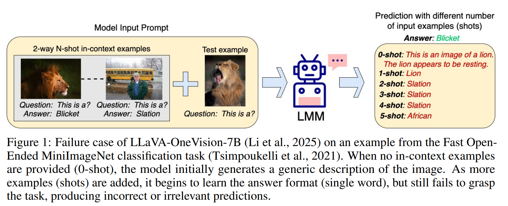
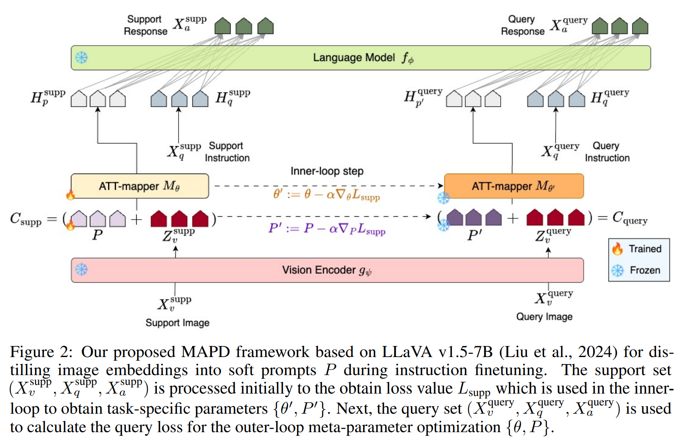
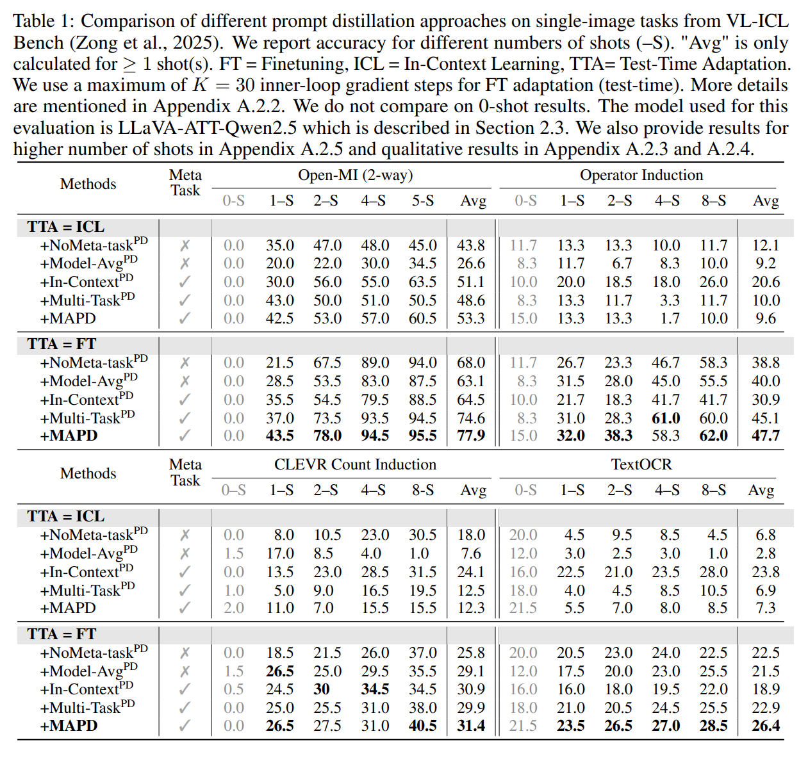
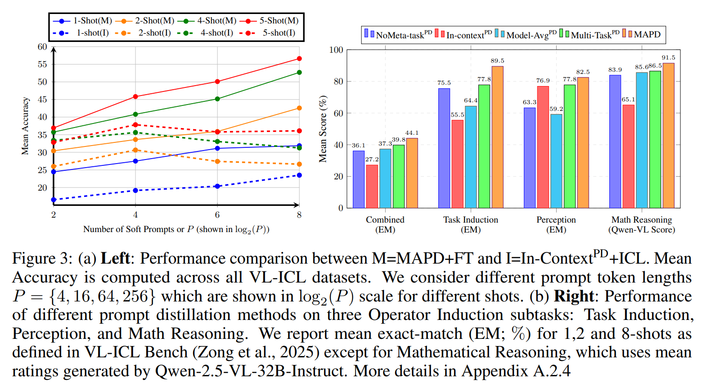
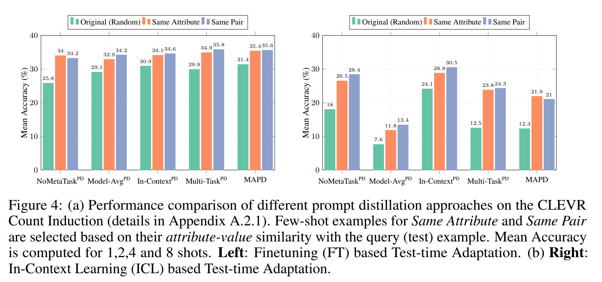
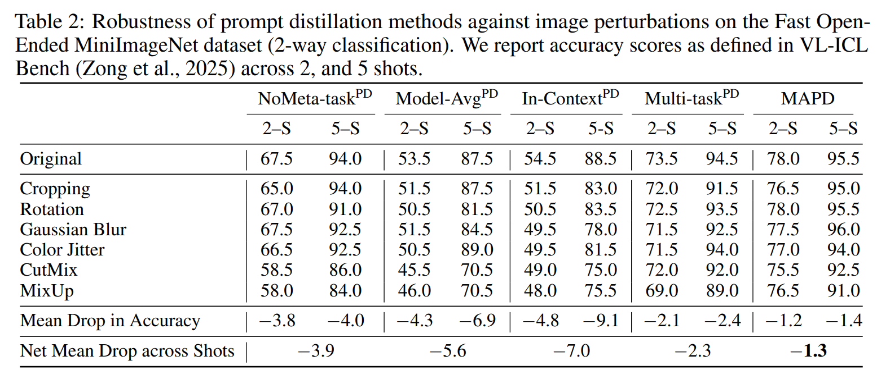

논문 및 이미지 출처 : <https://arxiv.org/pdf/2506.06905>

# Abstract

Large Multimodal Models (LMMs) 은 일반적으로 in-context learning (ICL) 에 의존하여 최소한의 supervision 으로 새로운 task 를 수행한다. 그러나 ICL 성능은 특히 smaller LMMs 에서 일관되지 않으며, examples 수가 증가한다고 해서 항상 단조롭게 개선되지 않는다. 저자는 이러한 현상이 downstream task 에 필요하지 않은 추가적인 image embedding 정보로 인해 LMM 이 과부하되는 데에서 비롯된다고 가정한다. 

이를 해결하기 위해 저자는 **meta-learning** 접근법을 제안하며, 이는 LMMs 에 few-shot 능력을 유도하는 대안으로, task 관련 image feature 로부터 **distillation 된 fixed soft prompt set** 을 사용하고, 이를 test 시점에 few examples 만으로도 적응할 수 있게 한다. 

* 이러한 distillation 을 가능하게 하기 위해 저자는 **attention-mapper module** 을 도입하는데, 이는 널리 사용되는 LLaVA v1.5 architecture 와 쉽게 통합될 수 있으며 soft prompt 와 함께 joint learning 되어, low-data regimes 에서도 few gradient step 만으로 LMMs 의 task adaptation 을 가능하게 한다. 
* VL-ICL Bench 에서의 평가 결과, 저자의 방법은 ICL 과 관련된 prompt-tuning 접근법들을 이미지 교란 상황에서도 지속적으로 능가하며, visual question answering task 전반에서 task induction 과 reasoning 을 향상시킨다.

# 1 Introduction

인간은 multimodal 환경에서 few trial-and-error 만으로도 new tasks 를 빠르게 학습할 수 있는 놀라운 능력을 지닌다. 인지과학의 광범위한 연구는 이러한 능력이 계층적 추상화를 학습하고, 과거 경험을 바탕으로 관련 task 전반에서 공유되는 구조적 prior 를 유지하는 데에서 비롯된다고 제안한다. 이러한 prior knowledge 를 활용하면 새로운 상황에서 빠른 학습이 가능해지고, task-specific demonstration 이 대규모로 필요하지 않게 된다.

Large Multimodal Models (LMMs) 은 reasoning 에서 세밀한 image 이해 및 visual question answering 까지 다양한 task 를 수행할 수 있다. LMMs 는 일반적으로 Large Language Model (LLM) 을 기반으로 하고, vision encoder 와 서로 다른 modality 간의 상호작용을 연결하는 module 을 추가하여 구축된다. sufficient scale 로 (pre)training 되고, language instruction 과 함께 다양한 multimodal task 로 finetuning 되면, LMMs 는 in-context learning (ICL) 을 통해 *new* task 를 학습할 수 있다. 즉, few input-output examples prompt 로 제공받음으로써 model parameter 업데이트 없이도 new task 수행이 가능하다. 

* ICL 의 training-free 특성은 task 와 domain 전반에서 빠르게 채택되었지만, 그 근본적인 메커니즘은 여전히 명확히 이해되지 않았고, 경험적 행위는 일관되지 않다. 
* 또한 최근 연구는 ICL 이 large-scale LMMs (약 72B parameters) 에서 가장 효과적인 반면, smaller model (<7B parameters) 은 in-context 예시 수가 증가할수록 성능이 정체되거나 악화되며, context length 확장이나 상세한 instruction 제공에도 개선되지 않는다는 것을 보여준다. 
* Zong et al. 은 이러한 한계를 작은 model 이 긴 sequence 의 많은 image token 을 처리하기 어렵기 때문이라고 설명한다. 
* 그 결과, 작은 model 은 혼란스러워지며 task 를 엉뚱하게 수행하거나 in-context 예시를 무시한 채 parametric knowledge 에 의존하는 기본 동작으로 회귀한다. 

Fig. 1 은 LLaVA-OneVision-7B LMM 이 Fast Open-Ended MiniImageNet dataset 의 task 에 실패하는 사례를 보여준다. 해당 model 은 parametric knowledge 에 기반해 이미지에 대한 일반적인 설명만을 출력하며, 몇 개의 예시가 prompt 로 주어졌음에도 불구하고 정답을 제시하는 데 실패한다.

이러한 관찰에 기반하여, 저자는 test 시점에서의 효과적인 few-shot adaptation 이 image embedding 에 포함된 추가 정보로 인해 손상될 수 있다고 가정한다. 더 정밀한 embedding 이 바람직하겠지만, image embedding 이 연속적 특성을 가지므로 그 안에서 task-specific information 을 distillation 하는 것은 어렵다. 대안으로, 저자는 test 시점에서 쉽게 finetuning 될 수 있는 fixed *new* embedding set 을 학습하는 방법을 제안한다. 이러한 task adaptation 개념은 *prompt tuning* 을 통해 문헌에서 주목받아 왔다. 

* Prompt tuning 은 language model 을 frozen 한 채, continuous *soft* prompt set 을 finetuning 하며, test 시점에서 context 에 prepend 되어 model 을 desired task 로 유도한다. 
* 저자는 learnable soft prompt 를 사용하여 new task 를 학습하는 접근법을 제안한다. 
* Soft prompt 는 finetuning 중 LLM 으로부터 loss gradient 형태로 task 정보를 받아 업데이트되며, image embedding 과 결합될 때 관련 feature 를 distillation 할 수 있다. 
* 이러한 결합을 용이하게 하기 위해 저자는 multi-head attention 구조를 사용하는 attention-mapper 를 제안한다. 
* 이 모듈은 task-specific image information 을 추출하는 역할을 한다. 
* Base LMM 으로 LLaVA v1.5 를 채택하고, 기존의 naive MLP projection layer 를 attention-mapper 와 learnable soft prompt 로 대체한다.

앞서 설명한 접근법은 test 시점에서 few examples 만으로도 새로운 task 에 빠르게 적응할 수 있어야 한다. *individual* tasks 에 대해 finetuning 절차를 설계하는 것은 비현실적이기 때문이다. 기존 연구는 task 분포에 노출된 후 새로운 task 에 대한 최적 학습 전략을 추론할 수 있는 meta-learner 를 학습함으로써 이 문제를 해결해왔다. 저자는 이러한 meta-learning 절차를 저자의 multimodal prompt distillation 설정에 적용할 것을 제안한다. 구체적으로, 잘 알려진 MAML 알고리즘을 채택하고, attention-mapper 와 soft prompt 를 학습하기 위해 가벼운 first-order approximation 을 사용한다. 저자의 접근법은 fast-concept binding 및 classification 같은 task 에서 small vision-language model 에 MAML 의 장점을 강조한 선행연구를 기반으로 한다. 저자는 visual question answering (VQA; Fig. 1 예시 참고) 에 초점을 맞추며, 이는 LMMs 의 image 이해 능력을 평가하는 데 자주 사용되는 일반 목적 task 이다. 그리고 LLaVA v1.5 에 MAML 을 적용했을 때의 장점을 입증한다.

저자의 기여는 다음과 같이 요약된다.

* 저자는 LMMs 내에서 distillation 을 통해 고정된 soft prompt 집합을 meta-learning 하는 방식으로 in-context learning (ICL) 의 대안을 제안한다. 저자의 방법인 MAPD (Meta-Adaptive Prompt Distillation) 는 test 시점에서 소수의 예시만으로도 빠르게 새로운 task 에 적응할 수 있으며, shot 수가 증가할수록 일관되게 단조로운 성능 향상을 보인다. 저자의 지식으로는, 이는 저자 학계에서 low-data setting 하의 LMMs cross-task generalization 을 위한 meta-learned prompt distillation 의 최초 탐구이다.
* 저자는 Najdenkoska et al. 에서 영감을 받은 attention-mapper 를 LLaVA-v1.5 7B architecture 에 통합한다. 이는 soft prompt 와 joint training 되며, task-specific image 정보의 distillation 을 용이하게 한다. Soft prompt 의 품질은 기본 LLM 의 성능에 크게 의존하므로, 저자는 LLaVA 의 원래 LLM 을 보다 강력한 Qwen2.5-7B-Instruct 로 교체한다.
* Image perception 과 mathematical reasoning 을 위한 다양한 benchmark 인 VL-ICL Bench 에서의 광범위한 평가 결과, 저자의 접근법은 다른 prompt distillation 방법들을 능가하며, image perturbation 이 존재하는 상황에서도 우수한 성능을 보인다.

# 2 Problem Formulation

저자는 few-shot VQA 학습 문제를 정의하고, LLaVA v1.5 에서 영감을 받은 visual instruction tuning pipeline 을 논의한다. 다만 projection layer 에 새로운 attention-mapper 를 사용하고, base LLM 으로 Qwen2.5-7B-Instruct 를 채택한다. 또한 저자는 prompt distillation 을 위해 이 pipeline 의 finetuning 단계에 first-order meta-learning 을 통합한 새로운 접근법 MAPD 를 소개한다.

## 2.1 Few-shot Visual Question Answering

Visual Question Answering (VQA) 는 vision-language model 이 이미지를 이해하는 능력을 평가하는 핵심 task 로, 시각적 콘텐츠의 다양한 측면에 관한 질문에 정확하게 답변하는 것을 목표로 한다. 질문은 bounding box 안의 object 에 대한 설명부터, 고등학교 수준의 기하 문제 해결까지 다양하지만, 대부분은 이미지에 존재하는 시각적 정보에 기반한다.

VQA 에서는 일반적으로 dataset $\mathcal{D} = {(X_v^i, X_q^i, X_a^i)}_{i=1}^{|\mathcal{D}|}$ 를 가진다. 여기서 $X_v \in \mathcal{I}$, $X_q \in \mathcal{Q}$, $X_a \in \mathcal{A}$ 이며, $\mathcal{I}$ 는 모든 image set, $\mathcal{Q}$ 는 모든 question set, $\mathcal{A}$ 는 모든 answer set 이다. 목표는 parameter $\theta$ 로 정의된 함수 $f_\theta$ 를 학습하여 image 와 question 이 주어졌을 때 answer 의 likelihood 를 최대화하는 것이다: $\prod_{i=1}^{|\mathcal{D}|} p_\theta(X_a^i | X_v^i, X_q^i)$

Deep learning 의 일반적인 train-test paradigm 에 따라, dataset $D$ 를 $(D_{train}, D_{test})$ 로 나누어 $D_{train}$ 에서 위 likelihood 를 최대화했을 때 $D_{test}$ 에서도 answer likelihood 가 최대화되는지를 평가한다. 일반적인 가정은 $D_{train}$ 의 크기가 충분히 커서 function $f_\theta$ 가 $D_{train}$ 에 overfit 하지 않는 것이다.

Few-shot VQA 에서는 LMM 이 ICL 과정에서 제공받는 in-context 예시 (i.e., shots) 를 $D_{train}$ 으로 간주한다. 하지만 $D_{train}$ 의 예시는 매우 적으며 (최소 1-shot), 이 경우 overfitting 을 피하면서도 $D_{test}$ 에서 좋은 성능을 내기가 어렵다. 저자는 이 문제를 $D_{train}$ 으로 표현되는 underlying task 를 학습하는 문제로 개념화하고, meta-learning 을 채택한다. Meta-learning 은 task 분포 전반에 걸친 공유 구조를 활용하여 model parameter 에 대한 prior 를 학습함으로써, 제한된 데이터로도 새로운 task 로 안정적으로 transfer 할 수 있도록 한다. 이어지는 부분에서는, 저자가 few-shot 을 포함하는 meta-task 를 구성하고, meta-learning 기반의 제안 model architecture 와 training 절차를 통해 parameter prior 를 부여하는 방법을 설명한다.

## 2.2 Improving Task Understanding with Meta-tasks

Optimization-based meta-learning 의 핵심 아이디어는 meta-parameter 의 좋은 initialization 을 학습하는 것이다. 이는 특정 task 에 대해 finetuning 되었을 때, few gradient step 만으로 stable transfer 를 가능하게 한다. 이를 촉진하기 위해 학습 과정에서는 underlying task 를 대표하는 few-shot dataset batch 를 처리한다. 저자는 이러한 few-shot dataset 을 meta-task 라 부르며, original LLaVA dataset 을 기반으로 한 저자의 finetuning data mixture 로부터 이를 생성할 것을 제안한다.

보다 형식적으로, $p(\mathcal{D})$ 를 저자의 data mixture 라 하자. Dataset $D_i \sim p(\mathcal{D})$ 로부터 예시의 fixed subset 을 random sampling 하여 meta-task $T^j$ 를 생성한다. 그리고 이 example 을 support set 과 query set 으로 분할하여 $T^j = \{D^\text{supp}, D^\text{query}\}$ 를 구성한다. Sec. 2.1 의 표기와 일관성을 위해, support set 을 $D^\text{supp} \equiv D^\text{train}$, query set 을 $D^\text{query} \equiv D^\text{test}$ 로 취급한다. 이 과정을 $D^i$ 의 모든 sample 이 적어도 하나의 meta-task 에 할당될 때까지 반복한다. 이러한 meta-task 구성은 $p(\mathcal{D})$ 의 각 dataset 에 대해 수행되며, meta-task 분포 $p(\mathcal{T}^\text{meta})$ 를 얻게 된다. 다음 절에서는 이러한 meta-task 를 처리하기 위해 설계된 저자의 model architecture 를 설명한다.

## 2.3 Model Architecture

Fig. 2 는 저자의 model architecture 를 보여주며, 이는 LLaVA v1.5 의 visual instruction tuning framework 에 기반한다. 

* 명확성을 위해, 본 절에서는 support set 과 query set 의 구분을 생략하며, 두 집합은 동일한 방식으로 처리된다. 
* Fig. 2 에서 보듯이, model 은 pretrained CLIP ViT-L/14 visual encoder $g_\psi$ (aspect ratio 336px) 를 포함한다. 
* input image $X_v$ 가 주어지면, encoder 는 hidden visual feature $Z_v$ 를 출력하며, 이들은 attention-mapper $M_\theta$ 로 구성된 projection layer 에 전달된다. 
* Attention-mapper 는 $Z_v$ 로부터 유용한 feature 를 추출하는 역할을 수행한다.

#### Attention Mapper

저자는 LLaVA v1.5 의 projection layer 를 재설계하여, soft prompt $P$ 를 포함하도록 하고, task-specific feature extraction 을 향상시키기 위해 attention-mapper $M_\theta$ 를 도입한다. 구체적으로, $Z_v$ 앞에 $m$ 개의 learnable prompt token $P$ 를 prepend 하여 $C = (P, Z_v)$ sequence 를 얻고, 이를 attention-mapper 에 입력한다 (Fig. 2 참조). Prompt token $P$ 와 weight $\theta$ 는 Xavier Uniform initialization 으로 초기화된다. Mapper 는 다음과 같이 정의된다:

$$
H_{p+v} = M_\theta(Q, K, V) = \sigma(QK^T) \ast V \tag{1}
$$

* 여기서 query 는 $Q = M^q_\theta \cdot C$, 
* key 는 $K = M^k_\theta \cdot C$, 
* value 는 $V = M^v_\theta \cdot C$ 이며, 
* 이들의 matrix 는 $\{M^q_\theta, M^k_\theta, M^v_\theta\}$ 로 표시된다. 
* Mapper 는 query 와 key vector 의 내적을 계산한 후 softmax function 을 통해 vector $V$ 의 각 feature 에 대한 activation score 를 계산한다. 
* 마지막으로, learnable prompt token 에 해당하는 $m$ 개의 embedding 을 $H_{p+v}$ 로부터 추출하여 task-specific image embedding $H_p$ 를 얻는다. 
* 이 embedding 은 이후 $\text{LLM}(f_\phi)$ 에 prompt 로 전달되어 추가 처리를 받는다. 
* Attention-mapper 의 학습 가능한 parameter 는 $\theta_p = \{\theta, P\}$ 로 표기한다.

#### Language Model

learned prompt 의 품질은 underlying language model 의 성능에 크게 의존한다. 이를 위해 저자는 수학적 reasoning, coding 등 복잡한 task 에서 강력한 성능을 보였으며 최대 8K tokens 생성을 지원하는 SOTA Qwen2.5-7B-Instruct LLM 을 사용한다. $\text{LLM}(f_\phi)$ 는 image token 과 text token 을 결합한 sequence 를 입력받아 answer $X_a = f_\phi(\[H_p, H_q])$ 를 생성한다. 이 pipeline 에서는 attention-mapper parameter $\theta_p$ 만 학습되므로, 저자의 접근법은 cross-task generalization 에 대해 parameter-efficient 하다. trainable parameter 의 수는 약 24M 이다. Training objective 는 다음 likelihood function 을 최대화한다: $p_{\theta_p}(X_a \mid X_v, X_q)$, 여기서 $X_a$ 는 answer, $X_v$ 는 image, $X_q$ 는 question 이다. 본 논문에서는 이 model 을 LLaVA-ATT-Qwen2.5 라 칭한다.

## 2.4 Model Training

저자는 LLaVA v1.5 와 유사한 curriculum learning 절차를 따라 attention-mapper parameter 를 두 단계로 학습하여 image-conditioned soft prompt 를 학습한다.

* **1단계 (feature alignment)**: Attention-mapper 는 LAION/CC/SBU dataset 에서 개념 분포가 균형 있게 필터링된 LCS-558K subset 으로 pretraining 된다. 이는 feature alignment 를 목적으로 하며, pretraining 세부사항은 Appendix A.1.3 에 설명한다.
* **2단계 (task-specific feature distillation)**: Attention-mapper parameter $\theta_p$ 는 다양한 task-specific instruction 으로 finetuning 되어, task-specific image feature 를 prompt $H_p$ 에 distillation 한다.

이후 절에서 저자는 MAML 기반 finetuning 절차를 설명하고, 실험에서 비교 대상으로 삼은 대체 방법도 소개한다.

### 2.4.1 Learning to Distill Prompts with First-order Meta Learning

저자의 prompt distillation 절차 MAPD 는 MAML 의 model-agnostic first-order approximation 을 사용한다. 이 방법은 few gradient update 만으로도 새로운 task 에 효율적으로 적응할 수 있는 meta-parameter 의 robust initialization 을 학습하는 것을 목표로 한다. 저자는 Antoniou et al. (2019) 의 구현을 차용하여 first-order version 과 (learnable) per-step learning rate $\alpha$ 를 사용해 학습 과정을 최적화한다.

Meta-task 분포 $p(\mathcal{T}^\text{meta})$ 로부터 batch $B$ 를 sampling 하고, 각 task 의 support set 을 이용해 $\theta_p$ 를 few gradient step 으로 task-specific parameter $\theta_p'$ 로 변환한다. Inner loop 의 *single* step 은 식 (2) 와 (3) 과 같다:

$$
L^{supp}_{\theta_p} = \frac{-1}{|D^\text{supp}|} \sum_{i=1}^{|D^\text{supp}|} \log\big(p_{\theta_p}(X_a^i \mid X_v^i, X_q^i)\big) \tag{2}
$$

$$
\theta_p' = \theta_p - \alpha \nabla_{\theta_p} L^\text{supp}_{\theta_p} \tag{3}
$$

*Outer* loop 에서는 query set 을 사용하여 meta-parameter 를 최적화한다. 저자의 경우 meta-parameter 는 attention-mapper 의 original parameter $\theta_p$ 이며, task-specific parameter $\theta_p'$ 로 update 된다:

$$
L^\text{query}_{\theta_p'} = \frac{-1}{|D^\text{query}|} \sum_{i=1}^{|D^\text{query}|} \log\big(p_{\theta_p'}(X_a^i \mid X_v^i, X_q^i)\big) \tag{4}
$$

$$
\theta_p := \theta_p - \beta \sum_{j=1}^{|B|} \nabla_{\theta'_{p,j}} L^\text{query}_{\theta'_{p,j}} \tag{5}
$$

* Eq. (5) 는 MAML 의 meta-update 에 대한 first-order approximation 이며, 
* meta-task 에 대해 $\theta'_{p,j}$ 의 gradient 를 $\theta_p$ 에 대한 상수로 취급한다. 
* 이 근사는 inner loop 의 전체 computation graph 를 통한 backpropagation 을 피하게 하며, query loss 의 Hessian-vector product 추정을 필요로 하지 않는다. 
* 따라서 GPU memory 를 크게 절약하면서도 실제 MAML gradient 와 동일한 방향의 gradient 를 근사할 수 있다.
* Fig. 2 는 MAPD 학습의 개략을 보여준다.

### 2.4.2 Alternative Methods for Prompt Distillation

저자는 MAPD 와 비교하기 위해 model architecture 기반의 다른 prompt distillation 방법들을 구현하였다. 아래에서 각 방법을 공식적으로 설명하며, 저자의 framework 와의 주요 차이점을 강조한다.

#### Multi-Task Prompt Distillation

저자는 MAPD 의 bi-level optimization 을 제거한 multi-task baseline 을 정의한다. 즉, 각 iteration 에서 meta-task batch 를 $p(T_{meta})$ 로부터 sampling 하고, task 별로 다음 loss 를 최적화한다:

$$
L_{\theta_p} = -\frac{1}{N} \sum_{i=1}^N \log\big(p_{\theta_p}(X_a^i \mid X_v^i, X_q^i)\big) \tag{6}
$$

* 여기서 $N = |D^\text{supp}| + |D^\text{query}|$ 이다. 
* 이 loss 는 batch 전체에 걸쳐 누적되어 $\theta_p$ 를 update 한다. 
* 이 baseline 은 **Multi-Task$^\textbf{PD}$** 라 부른다.

#### In-Context Prompt Distillation

선행연구는 pretrained LLM 의 도움으로 MAML 의 bi-level optimization 을 in-context examples 에 대한 sequence prediction 문제로 단순화하여 task information 을 meta-learning 할 수 있음을 제안했다. 이에 따라 저자는 **In-Context$^\textbf{PD}$** 방법을 개발하였다. Meta-task 에서 support set 을 각 query exampel 과 concatenate 하고, 다음 loss function 을 최적화하여 LLM 으로부터 soft prompt 로 task informatio 을 distillation 한다:

$$
L_{\theta_p} = -\frac{1}{|D^\text{query}|} \sum_{i=1}^{|D^\text{query}|} \log\big(p_{\theta_p}(X_a^i \mid X_v^i, X_q^i, D^\text{supp})\big) \tag{7}
$$

#### Methods without Meta-tasks

Meta-task 를 curate 하는 이점 (Sec. 2.2 참조) 을 더 잘 이해하기 위해, 저자는 LLaVA-v1.5 7B 의 original finetuning 절차와 비교한다. 단, meta-task 없이 $\theta_p$ 만 학습하는 방식이다. 이 방법은 **NoMeta-task$^\textbf{PD}$** 로 지칭된다.

또한 저자는 model averaging 과도 비교한다. Model averaging 은 계산 효율성이 높으며, out-of-distribution dataset 에서 성능 향상을 보이는 것으로 알려져 있다. 구체적으로 attention-mapper 를 각 dataset $D_i \sim p(\mathcal{D})$ 에 대해 별도로 finetuning 한 후, dataset 크기 비율로 가중합을 취한다:

$$
\theta_p^{avg} = \sum_{i=1}^{|\mathcal{D}|} \theta_p^i \cdot w_i \tag{8}
$$

* 여기서 $w_i = |D_i| / |\mathcal{D}|$ 이다. 
* 이 baseline 은 **Model-Avg$^\textbf{PD}$** 로 부른다.

## 2.5 Test-Time Adaptation

MAPD 와 대체 distillation 방법들로 optimal parameter 를 학습한 후, 저자는 attention-mapper 를 new (test) task 에 적응시키기 위해 $K$ 개의 gradient step 으로 finetuning 한다. 여러 $K$ 값에 대해 실험하고, test task 에 최적의 $K$ 값을 선택하는 방법은 Appendix A.2.2 에서 설명한다.

$K$ step 이 주어졌을 때, test task $T^j_\text{test}$ 의 support set $D^\text{supp}_\text{test}$ 으로 parameter $\theta_p$ 를 finetuning 하고, 동일 task 의 query set $D^\text{query}_\text{test}$ 에서 model 성능을 평가한다. 또한 모든 방법에 대해 test-time ICL adaptation 과도 비교한다.

# 3 Experimental Results

## 3.1 Evaluation Datasets

평가를 위해, 저자의 test dataset 은 Sec. 2.2 에서 소개된 meta-task 와 동일한 구조를 따르며, support 예시와 query 예시로 구성된다. 저자는 최근 소개된 VL-ICL benchmark (Zong et al., 2025) 를 사용한다. 이 benchmark 는 LMMs 의 ICL 능력을 fast concept binding, multimodal reasoning, fine-grained perception 등 다양한 task 에 대해 검증하도록 설계되었다.

Test 를 위한 meta-task 는 VL-ICL dataset 의 training split 에서 support set 을 무작위로 sampling 하고, 해당 dataset 의 testing split 에서 test/query set 을 sampling 하여 생성한다. 저자의 training pipeline 은 예시당 단일 image 만 포함하는 dataset 만을 사용하므로 (Sec. A.1.1 참조), 저자는 single image-to-text 시나리오에만 초점을 맞추며, multi-image 설정은 후속 연구로 남겨둔다.

저자는 VL-ICL 의 네 가지 task 에 대해 결과를 보고한다:

* **Fast Open MiniImageNet (Open-MI)**: 소수의 예시를 바탕으로 새로운 object 의 이름을 맞추는 task
* **Operator Induction**: 예시 (e.g., $1 , ? , 3 = 4$) 를 보고 $2 , ? , 7 = ?$ 와 같은 image 연산 문제를 해결하는 task
* **CLEVR Count Induction**: "shape: sphere" 와 같이 주어진 속성을 만족하는 object 개수를 세는 task
* **TextOCR**: 이미지 안에 강조 표시된 text 를 transcription 하는 task

각 task 의 자세한 내용은 Appendix A.2.1 에 제시한다. 최종 성능은 모든 meta-task 에 걸친 평균으로 계산한다.

## 3.2 Model Comparisons

저자의 결과는 Tab. 1 에 요약되어 있으며, 여기서 MAPD 는 LLaVA-ATT-Qwen2.5 를 base LMM 으로 사용한 대체 prompt distillation 방법들(Sec. 2.4.2 참조)과 비교된다. Tab. 1 은 두 가지 유형의 test-time adaptation 방법을 비교한다: in-context learning (ICL) 과 finetuning (FT). 또한, training 시 meta-task 사용 여부에 따라 구분하여 비교한다. 본 절에서는 최대 8-shot 까지의 결과를 보고하며, 더 많은 shot 에 대한 결과는 Appendix A.2.5 에 제시한다.

#### Prompt distillation improves task induction in LMMs at test-time.

* Tab. 1 의 결과에 따르면, 소수의 support 예시를 활용한 FT adaptation 은 query 예시를 활용한 ICL 대비 크게 우수하며, 전체 dataset 에서 평균 21.2% 의 성능 향상을 보인다. 
  * 이는 image embedding 에서 task-specific 정보를 distillation 하여 targeted prompt 를 생성하는 것이 underlying LLM (저자의 경우 Qwen-2.5-7B-Instruct) 의 few-shot 능력을 개선한다는 저자의 가설을 강력히 뒷받침한다. 
* 또한 결과는 attention-mapper parameter 를 test-time 에 소수의 gradient step 으로 finetuning 하는 것이 overfitting 으로 이어지지 않으며, 적절한 hyperparameter (Appendix A.2.2) 설정하에 cross-task generalization 을 촉진할 수 있음을 보여준다. 
* 일대일 비교를 위해 In-Context$^\text{PD}$ 를 보면, 이는 ICL 보다는 FT 에서 4 개 중 3 개 task 에서 더 나은 성능을 보였다. 
  * 즉, ICL 은 LLM 에게 소수의 예시 sequence 를 그대로 prompt 로 제공하는 반면, FT 는 학습된 task-specific embedding 집합을 prompt 로 사용하여 더 나은 성능을 낸다.

#### Learning using meta-tasks is beneficial for few-shot adaptation

다음으로 meta-task 기반 학습 방법과 그렇지 않은 방법을 비교한다. 

* Tab. 1 에서 볼 수 있듯이, 두 가지 test-time adaptation 절차(ICL, FT) 모두 meta-task 기반 학습이 분명히 더 우수하다. 
* ICL-based adaptation 에서는 In-Context$^\text{PD}$ 가 가장 좋은 성능을 보였고, FT 기반 적응에서는 저자가 제안한 MAPD 가 4 개 dataset 모두에서 최고의 성능을 달성했다. 
  * 이는 training 중 meta-task 를 구성하여 task 당 균등한 예시로 batch 를 만드는 과정이 single task 에 대한 overfitting 을 방지하며, cross-task generalization 에 유리함을 시사한다.

#### Meta-learning improves few-shot learning for FT-based adaptation. 

* Tab. 1 은 또한 저자의 meta-learning 방법 MAPD 가 모든 dataset 에서 test-time finetuning 시 최고의 성능을 달성했음을 보여준다. 
  * 이는 first-order MAML 이 attention-mapper parameter $\theta_p$ 의 최적 initialization 을 학습했음을 의미한다. 
* 이후 이 parameter 는 test task 에 대해 소수의 gradient step 과 few-shot 예시로 적응되어, 정확한 soft prompt 집합을 생성하고 해당 task 에 대한 LMM 예측을 향상시킨다. 
* 특히 Operator Induction 의 2-shot 경우에서 MAPD 는 Multi-TaskPD 보다 10% 높은 성능을 보였으며, TextOCR dataset 에서는 평균적으로 Multi-TaskPD 보다 3.5% 더 우수했다. 
* 마지막으로, FT 기반 MAPD 는 shot 수가 증가함에 따라 일관되게 단조로운 성능 향상을 보인 유일한 방법으로, 더 나은 scaling behavior 를 보여준다.

## 3.3 Ablation Studies and Analysis

본 절에서는 test-time finetuning (FT) 을 기본 adaptation 전략으로 사용하여(특별히 명시되지 않는 한), MAPD 를 더 깊이 이해하기 위한 ablation study 를 수행한다.

#### MAPD benefits from the addition of soft prompts in contrast to In-context$^\text{PD}$.

저자는 MAPD (가장 우수한 FT 접근법) 와 In-Context$^\text{PD}$ (가장 우수한 ICL 접근법) 를 모든 VL-ICL dataset 에 걸쳐 soft prompt $P$ 의 수를 늘려가며 비교하였다 (다양한 shot 시나리오에서). 

* Fig. 3(a) 는 MAPD 가 prompt 가 추가될수록 유리하게 scale 된다는 것을 보여준다. 
  * 또한 shot 수가 많을수록 prompt token 1 개당 성능 향상이 훨씬 크다. 
* 반면 In-Context$^\text{PD}$ 의 성능은 1-shot 을 제외하면 prompt 가 많아질수록 일반적으로 악화된다. 
* MAPD 는 gradient update 를 통해 더 일관된 task 정보를 제공하는 추가 shot 의 이점을 활용하는 반면, ICL 은 더 많은 예시와 긴 prompt 를 동시에 attend 하는 데 어려움을 겪는다.

#### MAPD is best in mathematical task induction, perception and reasoning.

저자는 Operator Induction task 에 초점을 맞추어, 이 문제를 해결하는 데 필요한 단계를 분석한다. 간단히 말해, 이 task 는 이미지 속 두 숫자 간의 올바른 수학 연산을 소수의 예시로부터 파악하고, 이를 활용해 test/query 예시의 답을 계산하는 것이다 (Fig. 6 참조). 이를 해결하기 위해 model 은 다음을 수행할 수 있어야 한다:

(a) query 에서 피연산자 식별 (Perception),  
(b) 소수의 예시로부터 연산 규칙 식별 (Task Induction),  
(c) (a) 와 (b) 에서 얻은 지식을 활용하여 답을 계산하는 적절한 절차 수행 (Mathematical Reasoning).

이러한 subtask 를 분리하기 위해, 저자는 LLaVA-ATT-Qwen2.5 가 원래 연산 결과를 계산하는 대신 특정 질문에 답하도록 prompt 를 설계하였다. 처음 두 subtask 에 대해서는 정확히 일치하는 방식으로 피연산자와 연산을 식별한다. Mathematical Reasoning 의 경우, test time 에 model 이 single answer token 에 적응하는 경향 때문에 충분히 긴 답변을 얻지 못하는 문제가 있었다. 이를 완화하기 위해, 저자는 원래 dataset 에서 few examples 를 뽑아 reasoning step 이 포함된 상세한 답변으로 수정하여 few-shot 예시를 구성했다. 이 데이터로 finetuning 하자 model 은 test-time adaptation 시 충분한 reasoning 을 제공할 수 있었다.

수학적 reasoning 응답을 평가하기 위해, 저자는 Qwen-2.5-VL-32B-Instruct 를 judge 로 활용하여 0–3 점 척도로 model 의 응답을 평가했다 (3 은 정답을 의미). Prompt 와 scoring 방식은 Appendix A.2.4 에 예시와 함께 설명한다. Fig. 3(b) 는 test-time finetuning 하에 세 가지 subtask 와 전체 성능에서 prompt distillation 방법들의 결과를 보여준다. 여기서는 1, 2, 8-shot 에 걸친 평균 점수만 보고한다.

* 저자의 관찰에 따르면, MAPD 는 모든 subtask 에서 다른 prompt distillation 접근법보다 우수하다. 이는 저자의 접근법이 다양한 문제 유형에 빠르게 적응하고, task 의 여러 구성 요소를 효율적으로 이해한다는 것을 시사한다. 
* 따라서 MAPD 는 여러 하위 구성 요소와 reasoning 단계가 존재하는 복잡한 시나리오에도 적용될 수 있는 가능성을 보여준다. 
* 또한 meta-task 로 학습한 방법들은 일반적으로 더 좋은 성능을 보였지만, In-Context$^\text{PD}$ 는 task induction 과 reasoning 에서 취약하여 전반적으로 낮은 성능을 보였다.

MAPD 와 다른 prompt distillation 접근법은 query (test) 예시와 유사한 few-shot 예시에서 이점을 얻는다. 저자는 CLEVR Count Induction task (Appendix A.2.1 참조) 에서 few-shot 예시 선택에 따라 성능이 어떻게 달라지는지를 평가하였다. 

* 저자는 query (test) 예시의 attribute 와 그 값의 유사성에 기반한 두 가지 selection 방법을 제안한다. 
  * 예를 들어 query 가 `shape: sphere` 라는 attribute 와 value 를 가진다면, few-shot 예시를 다음 기준으로 선택한다:  
  (a) Same Attribute – shape,  
  (b) Same Pair – shape: sphere. 
  * 그리고 이를 VL-ICL benchmark (Zong et al., 2025) 에서 제안된 무작위 예시 선택과 비교한다.

* Fig. 4(a) 에서 보듯, finetuning 기반 (FT) adaptation 에서는 모든 baseline 의 성능이 평균적으로 Same Attribute 에서 4.8%, Same Pair 에서 5.3% 증가하였다. 
  * MAPD 는 Same Attribute setting 에서 가장 높은 성능을 보였으며 (Mean Acc = 35.4%), Multi-TaskPD 는 Same Pair setting 에서 가장 좋은 성능을 보였다 (Mean Acc = 35.8%).
* Fig. 4(b) 에 따르면, In-Context Learning (ICL) adaptation 에서는 similarity 기반 few-shot selection 방법이 성능에 더 큰 영향을 미쳤으며, 모든 baseline 의 평균 정확도를 Same Attribute 에서 7.7%, Same Pair 에서 8.6% 향상시켰다. 
  * In-Context$^\text{PD}$ 는 두 setting 모두에서 가장 좋은 성능을 보였으며, ICL adaptation 에서 각각 28.8%, 30.5% 의 평균 정확도를 달성했다. 
  * 또한 Same Pair setting 이 일반적으로 모든 접근법에서 가장 좋은 few-shot selection 방법임을 알 수 있었다. 
    * 이는 query 예시와 유사한 few-shot 예시를 선택하는 것이 test-time adaptation 중 더 나은 task 이해를 유도함을 보여준다. 
  * 또한 few-shot selection 의 성능 분산은 ICL adaptation 보다 FT adaptation 에서 더 작았으며, 이는 FT adaptation 이 더 높은 강건성을 보임을 시사한다.

#### MAPD and other prompt distillation approaches benefit from few-shot examples that are similar to query (test) example

저자는 support set 이미지에 perturbation 을 적용했을 때 prompt distillation 방법들이 얼마나 robust 한지를 Tab. 2 에서 평가하였다. 

* MAPD 는 다른 distillation 방법들과 달리 support 예시에 noise 가 추가되더라도 성능 저하가 가장 적었으며, 가장 robust 했다. 
* CutMix, MixUp 과 같은 고급 기법은 original image distribution 을 크게 변화시키므로 모든 방법의 성능에 부정적 영향을 미쳤지만, MAPD 는 2-shot 과 5-shot 모두에서 원래 성능에 가까운 결과를 유지했다. 
* 이러한 강건성은 MAPD 가 meta-task 로부터 task 의 근본 구조를 학습하는 meta-learned initialization 덕분으로 보인다. 
* MAPD 는 허위적인 시각적 패턴에 overfitting 하지 않으며, noisy visual artifact 에 영향받지 않고 새로운 task 에 빠르게 적응할 수 있게 한다.

# 4 Limitations

본 연구에서는 단일 이미지 기반 few-shot VQA task 와 비교적 단순한 수학 문제에만 초점을 맞췄다. 향후 연구에서는 다중 이미지 task, 더 복잡한 reasoning 문제(여러 이미지 간 또는 단일 이미지 내)를 다루는 방향으로 확장할 수 있다. 또한 MAPD 는 FT 기반 adaptation 에서 가장 효과적이다. 따라서 gradient update 를 수행하지 않는 ICL 에 비해 test time 에 상당히 많은 계산 자원이 필요하다. Fig. 23 에서는 shot 수가 늘어남에 따라 computation 이 어떻게 증가하는지를 보여준다. 따라서 MAPD 는 극도로 자원이 제한된 환경이나 빠른 on-device adaptation 에는 적합하지 않을 수 있다.

# 5 Conclusion

본 연구는 Meta-Adaptive Prompt Distillation (MAPD) 를 소개한다. 이는 LMMs 에 few-shot 능력을 유도하는 새로운 meta-learning 접근법이다. MAPD 는 task 관련 image feature 로부터 distillation 된 고정된 soft prompt 집합을 사용하며, test time 에 소수의 예시만으로도 효율적으로 적응할 수 있다. 저자의 방법의 핵심 구성요소는 attention-mapper module 로, 이는 LLaVA v1.5 와 통합되어 soft prompt 와 함께 joint learning 되어 distillation 을 용이하게 한다.

VL-ICL benchmark 에 대한 광범위한 평가 결과, MAPD 는 다양한 VQA task 전반에서 기존 ICL 및 다른 prompt tuning 접근법을 일관되게 능가했으며, noisy image 환경에서도 cross-task generalization 을 크게 향상시켰다. 또한 shot 수가 늘어날수록 strictly monotonic 한 성능 향상을 보여 더 나은 scaling behavior 를 입증했다.