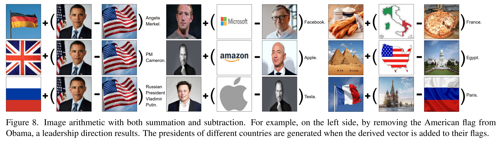
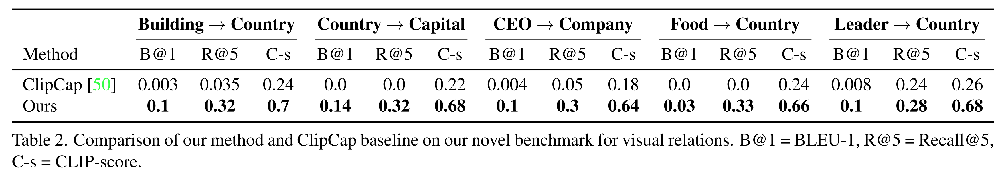

논문 및 이미지 출처 : <https://openaccess.thecvf.com/content/CVPR2022/papers/Tewel_ZeroCap_Zero-Shot_Image-to-Text_Generation_for_Visual-Semantic_Arithmetic_CVPR_2022_paper.pdf>

# Abstract

최근 text-to-image matching model 은 uncurated image–sentence pair 의 large corpus 에 contrastive learning 을 적용한다. 이러한 model 은 matching 및 이후 zero-shot task 에 강력한 score 를 제공할 수 있지만, 주어진 image 로부터 caption 을 생성하는 것은 할 수 없다. 

* 본 연구는 이러한 model 을 inference time 에서 image 가 주어졌을 때 descriptive text 를 생성하는 용도로 재사용하며, 추가적인 training 또는 tuning 단계는 전혀 필요하지 않다. 
  * 이는 visual-semantic model 과 large language model 을 결합하여, web-scale model 이 가진 knowledge 를 모두 활용하는 방식으로 이루어진다. 
  * 생성되는 caption 은 supervised captioning method 로 얻어지는 것보다 훨씬 덜 제한적이다. 
* 더 나아가 zero-shot learning method 로서 극도로 flexible 하며, 입력이 image 또는 text 중 어느 쪽이든 가능하고 출력은 sentence 가 되는 image arithmetic 을 수행할 수 있음을 보인다. 
  * 이는 두 image 를 비교하거나 visual analogy test 를 해결하는 등 새로운 high-level vision capability 를 가능하게 한다.

# 1. Introduction

Deep learning 은 computer vision 에서 최소 세 가지 주요 혁신을 가져왔다:

* (i) 여러 domain 에서 예측보다 빠르게 human-level 성능에 도달한 machine 의 등장
* (ii) 새로운 domain 의 rapid modeling 을 가능하게 하는 effective transfer learning
* (iii) adversarial 및 self-supervised learning 을 통한 unsupervised learning 의 도약

현재 진행 중인 네 번째 혁명은 zero-shot learning 이다. OpenAI 의 seminal work 는 transformer 기반 GPT-3 model 을 제시하였다. 이 model 은 매우 large text corpora 로 training 되며, prompt 가 주어지면 text 를 생성할 수 있다. prompt 에 instruction 이 포함되어 있으면 GPT-3 는 종종 이를 수행할 수 있다. 예를 들어, prompt 가 “Translate English to French: typical → typique, house → …” 인 경우 “maison” 을 생성한다.

이후 OpenAI 는 computer vision 분야에서도 impressive zero-shot capability 를 보여주었다. 기존 state-of-the-art computer vision model 은 종종 fixed number of labels 를 infer 하는 task-specific model 로 training 되지만, Radford et al. 은 CLIP image-text transformer model 을 제시하여 추가 training 없이도 tens of downstream task 를 state-of-the-art 에 근접한 accuracy 로 수행할 수 있음을 보였다. 이는 image 가 주어졌을 때 “This is an image of X.” 형태의 sentence 집합 중 best match 를 선택하는 방식이다. 이어서 Ramesh et al. 은 unseen domain 에서 주어진 description 과 일치하는 image 를 이전에는 볼 수 없던 성능으로 생성하는 bimodal Transformer 인 DALL-E 를 제시하였다.

본 연구는 CLIP 을 사용하여 DALL-E 의 inverse task, 즉 **zero-shot image captioning** 을 수행한다. image 가 주어지면 CLIP 과 GPT-2 language model 을 함께 사용하여 input image 의 textual description 을 생성한다. 이는 Radford et al. 이 보여준 fixed-prompt zero-shot learning 을 넘어서는 새로운 image-analysis capability 를 CLIP 에 부여한다.

zero-shot method 로서 본 접근법은 어떠한 training 도 포함하지 않는다. CLIP 의 underlying model 이 image captioning method 가 사용하는 것과 동일한 형태의 supervision, 즉 matching image–caption pair 로 training 된다는 점은 사실이다. 그러나 captioning method 는 MS-COCO 또는 Visual Genome 같은 curated source 로 training 되는 반면, CLIP 은 자동으로 수집된 web-scale dataset 인 WebImageText(WIT) 로 training 된다. 이전에 WIT 로 captioning model 을 training 하려는 시도는 image 내 object 인식 성능이 매우 낮은 결과를 보였으며, 이는 Sec. 2 에서 다룬다.

methodology 와 underlying data 의 차이 결과로, 본 방법이 생성하는 caption 은 supervised captioning method 로 얻어지는 것과 매우 다르다. supervised method 는 human annotator 를 모방하여 ground-truth sentence 와 conventional NLP metric(BLEU 등) 측면에서 유사한 문장을 제공하지만, 본 연구의 결과는 훨씬 더 자유롭고 visual-semantic CLIP embedding space 에서 image 와 더 잘 맞는다(본 방법은 이를 최적화한다). 또한 CLIP 과 GPT-2 에 내재된 semantic knowledge 는 생성된 caption 에 드러난다.

본 방법은 생성되는 caption 의 특성뿐 아니라 inference time 에서 모든 computation 이 이루어진다는 점에서도 더 flexible 하다. 

* 구체적으로, 본 연구는 새로운 형태의 arithmetic 을 사용하여 image space 에서 semantic analysis 를 수행할 수 있음을 보인다. 
* NLP 의 well-known concept arithmetic 예로, embedding vector 에서 ‘king’ − ‘man’ + ‘woman’ 과 가장 가까운 word 로 ‘queen’ 이 retrieval 되는 현상이 있다. 
* 본 연구는 단어 대신 image 로 동일한 작업을 수행하고, 결과를 단일 단어가 아닌 짧은 sentence 로 생성하는 새로운 capability 를 제시한다.

결과적으로, 예를 들어 두 scene 간 차이가 무엇인지 질문하는 것도 가능하다. 이러한 두 image 를 semantic 하게 비교하는 capability 는 zero-shot learning 의 강력함을 다시 한 번 보여주는 novel computer vision capability 이다.

# 2. Related work

초기 deep captioning method 는 RNN 을 적용하여 word sequence 를 생성하였다. 이후 attention 이 추가되어 salient object 를 식별하였다. Graph neural network 와 scene graph 는 object 간 spatial, semantic 관계를 모두 포함하였다. 이후 Transformer 는 self-attention 으로 모든 image element 간 interaction 을 modeling 하였다. text modeling 측면에서는, language model (LM) 이 LSTM, CNN, Transformer 의 발전과 함께 개선되었다. language 측면의 향상에는 더 나은 image grounding 고안, non-visual word (e.g., ‘the’, ‘and’) 의 decoding, fine·novel·diverse sentence 생성, 다양한 semantic tagger 로부터 정보 통합 등이 있다.

최근 수년간 large-scale vision–language dataset 의 활용으로 큰 발전이 이루어졌다. unsupervised data 는 pre-training phase 로 사용되어, image–text correspondence 로 model 을 초기화한다. 이 방식으로 web 에서 수백만 개의 image–text pair 를 사용할 수 있다. 그러나 저자가 알고 있는 이전 연구에서는, 모든 captioning model 이 training 의 마지막 단계에서 human-annotated dataset (MS-COCO, Visual Genome 등) 을 사용한다.

curated caption 으로 구성된 database 를 충분히 large 하게 구축하는 것은 사실상 불가능하며, 이는 bias 를 초래한다. 이에 따라 여러 접근은 training 중 external unsupervised data 에 model 을 conditioning 하여 novel object 를 기술하는 데 초점을 맞추었다. 또 다른 방식으로는 external object tagger 를 pre-training, training, inference 등 다양한 단계에서 사용하는 방법이 있다. semi-supervised method 또한 존재한다. unsupervised 접근은 visual concept detector 로 training 하거나 joint image–language embedding space 를 학습함으로써 이루어질 수 있다. 이에 반해, 본 연구의 방법은 training 없이도 기존 image–text alignment score 를 사용하여 기존 large-scale LM 을 주어진 image 방향으로 유도한다.

CLIP 은 web 에서 수집된 4억 개의 image–sentence pair 로 training 되었으며, 강력한 text–image matching score 를 제공한다. CLIP 의 저자들은 이 training set 으로 image-to-caption language model 을 training 하는 실험을 수행했으나, zero-shot transfer 에 어려움을 겪었다. 16 GPU-day 실험에서 language model 은 ImageNet 에서 16% accuracy 만 달성했다. CLIP 은 동일한 수준의 accuracy 를 약 10배 빠르게 달성한다.

prompt 를 사용하면 text generation 의 일부 capability 를 흉내낼 수 있다. 예를 들어 CLIP 기반 application 은 이전에 본 적 없는 다양한 scenario 에서 zero-shot solving capability 를 보인다. prompt 를 carefully engineering 하면 unseen object 의 detection 을 개선할 수 있다. zero-shot prompt engineering 은 VQA 같은 higher-level task 에도 사용되었으나, supervised method 수준과는 큰 차이가 있다.

CLIP 은 GAN 또는 기타 generative model 을 사용한 text-driven image manipulation 을 강력하게 지원하기도 한다. 본 연구는 반대 방향을 탐구한다: image 를 사용하여 text 를 생성하는 것으로, large-scale LM 을 CLIP 으로 guide 한다.

guided language modeling 은 연구자들이 large-scale LM (e.g., GPT-2) 의 prior knowledge 를 조정하려고 노력함에 따라 주요 challenge 가 되었다. fine-tuning 은 종종 attribute 별로 Reinforcement Learning 또는 GAN 을 사용해 이루어진다. latent representation 을 style 과 content 로 disentangle 하는 것은 text style transfer 측면에서 관련이 있다. controllable LM 은 fixed control code 로도 구성될 수 있다. 이상적으로는 fine-tuning 없이 기존 large-scale LM 에 직접 conditioning 이 적용되어야 한다. 여러 연구는 small neural network 를 사용해 LM 을 steering 하는 아이디어를 탐구하였다. 이어서 PPLM 은 간단한 attribute classifier 로도 추가 training 없이 model 을 steering 할 수 있음을 보였다. 본 연구는 visual cue 로부터 novel visual LM guidance 를 제시한다.

# 3. Method

Visual captioning 은 image 에 대한 descriptive sentence 를 생성하는 과정이다. 이는 input image $I$ 가 주어졌을 때 sequence generation 문제로 formalize 될 수 있으며, sentence 의 $i$-th word $x_i$ 에 대한 conditional probability $p(x_i \mid [x_t]_{t<i}, I)$ 를 추론하는 것으로 표현된다.

이는 일반적으로 supervised 방식으로 수행되며, ground truth sentence 를 재현하도록 weight 를 optimize 한다. 그러나 carefully curated dataset 은 규모가 작고 모든 image 를 적절히 설명할 수 없기 때문에, 생성된 sentence 는 scene 에 존재하는 object 의 basic level 내용만을 설명하며 부자연스러워지는 경향이 있다. 이러한 문제는 web-scale dataset 을 사용하여 완화할 수 있다.

본 연구는 large-scale text-image alignment model 을 large-scale language model(LM) 의 guidance 로 활용하는 zero-shot method 를 제시한다.

#### Overview

* 저자의 접근은 transformer 기반 LM(GPT-2 등) 을 사용하여 Fig. 2 에 나타난 것처럼 “Image of a,” 와 같은 initial prompt 로부터 다음 word 를 추론한다. 
* image-related knowledge 를 auto-regression 과정에 통합하기 위해 calibrated CLIP loss $\mathcal{L}_{\text{CLIP}}$ 이 model 이 주어진 image 를 기술하는 sentence 를 생성하도록 자극한다. 
* 또한 loss term $\mathcal{L}_{\text{CE}}$ 를 추가하여 다음 token distribution 이 original LM 과 유사하게 유지되도록 한다. 
* optimization 은 auto-regression 동안 이루어지며, 각 token 에 대해 반복된다.

더 나아가 본 방법의 flexibility 는 CLIP embedding space 의 visual cue 를 simple arithmetic 으로 처리하여 semantic relation 을 포착할 수 있게 한다. 또한 multi-modal encoder 를 본 방법과 결합하면 text 와 image 를 혼합하는 새로운 방식으로 knowledge 를 추출할 수 있다.

#### Language models

최근 LM 은 크게 발전하였으며, broad external knowledge 와 limited supervision 으로 다양한 task 를 해결하는 AI-complete 수준에 가까워지고 있다. Transformer 기반 LM 은 각 time-step 마다 generated token 과 past token 간 interaction 을 modeling 한다.

Transformer block 은 embedding function $K$, $Q$, $V$ 를 가진다. $K$ 와 $Q$ 는 token interaction 을 학습하여 $V$ 에 대한 분포를 결정한다. attention mechanism 은 query 와 key 의 similarity 를 기반으로 value 를 pooling 한다.

구체적으로, token $i$ 의 pooled value 는 token 에 대한 query $Q_i$ 에 의존하며, 이는 해당 token 의 embedding 에 function $Q$ 를 적용하여 계산된다. 결과는 모든 token 의 key $K_j$ 와의 cosine similarity 기반 가중치를 활용한 value vector 의 weighted average 로 얻어진다.

$K$ 와 $V$ 는 function 이지만, 생성된 key $K_j$ 와 value $V_j$ 는 text 를 한 단어씩 생성할 때 반복적으로 사용된다. 따라서 이들은 context cache 에 저장되어 과거 embedding output 을 추적한다.

sequence generation 과정은 다음과 같이 표현된다:

$$
x_{i+1} = \text{LM}\left(x_i, [(K_j^l, V_j^l)]_{j<i, 1\le l \le L}\right),
\tag{1}
$$

* 여기서 $x_i$ 는 $i$-th word, 
* $K_j^l$, $V_j^l$ 은 transformer layer $l$ 의 $j$-th token 의 key, value 이며, 
* GPT-2 에서는 $L = 24$ 이다.

저자는 LM 을 변경하지 않은 채 inference 중 context cache $C_i = [(K_j^l, V_j^l)]_{j<i, 1\le l \le L}$ 의 값을 수정하여 input image 와 LM 을 alignment 한다.

#### CLIP-Guided language modelling

목표는 LM 이 각 generation step 마다 desired visual direction 으로 향하도록 guide 하는 것이다. 이는 두 가지 목표를 가진다:

1. 주어진 image 와 alignment
2. language attribute 유지

첫 번째는 CLIP 을 사용하여 token 의 image 관련성을 평가하고 cache 를 조정함으로써 이루어진다. 두 번째는 original LM 의 target output 과 유사하도록 objective 를 regularize 한다.

각 time point 에서 context cache $C_i$ 를 조정하는 optimization 은 다음과 같이 정의된다:

$$
\arg\min_{C_i} ; \mathcal{L}_{\text{CLIP}}(\text{LM}(x_i, C_i), I)

+ \lambda \mathcal{L}_{\text{CE}}(\text{LM}(x_i, C_i), \hat{x}_{i+1}),
  \tag{2}
  $$

* 여기서 $\hat{x}_{i+1}$ 는 original(수정되지 않은) context cache 로 LM 이 예측한 token 분포이다. 
* 두 번째 term 은 modified context 로 생성된 token distribution 이 original LM 과 가까워지도록 CE loss 를 사용한다. 
* $\lambda$ 는 loss 간 balance 를 조절하며, 실험에서는 초기에 0.2 로 설정된 후 변경되지 않았다.

다음으로 CLIP loss term 계산 방식을 설명한다.

#### CLIP loss

time $i$ 에 possible token 들에 대한 image relevance 를 계산한다. 효율성을 위해 top 512 token candidate 에 대해서만 potential 을 계산하고 나머지 token 은 zero potential 로 둔다. candidate token $k$ 에 대한 sentence 는 $s_i^k = (x_1, \ldots, x_{i-1}, x_i^k)$ 이며 image $I$ 와 matching 한다.

token $k$ 의 clip potential 은 다음과 같다:

$$
p_i^k \propto \exp\left(
\frac{D_{\text{CLIP}}(E_{\text{Text}}(s_i^k), E_{\text{Image}}(I))}{\tau_c}
\right),
\tag{3}
$$

* 여기서 $D_{\text{CLIP}}$ 은 CLIP 의 text embedding $E_{\text{Text}}$ 와 image embedding $E_{\text{Image}}$ 간 cosine distance, 
* $\tau_c > 0$ 는 distribution 의 sharpness 를 조절하는 temperature hyperparameter 이다. 
* 모든 실험에서 $\tau_c = 0.01$ 을 사용한다.

CLIP loss 는 clip potential distribution 과 LM 이 예측한 next token $x_{i+1}$ 간 cross-entropy 로 정의된다:

$$
\mathcal{L}_{\text{CLIP}} = \text{CE}(p_i, x_{i+1}).
\tag{4}
$$

이 loss 는 image–sentence matching score 를 높이는 단어 선택을 장려한다.

#### Inference

본 방법은 zero-shot 이므로 training 을 수행하지 않는다. inference 시 Eq. (2) 의 문제를 gradient descent 다섯 단계로 optimize 한다. 즉:

$$
C_i \leftarrow C_i + \alpha \frac{\nabla_{C_i} p(x_{i+1}\mid C_i)}
{|\nabla_{C_i} p(x_{i+1}\mid C_i)|^2}.
\tag{5}
$$

이 update rule 은 단순화된 형태이다. 각 token 생성마다 새롭게 optimization 을 수행한다. 구현에서는 gradient 를 transformer layer 별로 Euclidean normalization 하여 사용한다. learning rate $\alpha$ 는 0.3 으로 설정한다.

#### Beam search

byte-level tokenizer 는 256 byte 의 base token 을 사용하여 모든 단어를 표현한다. 하나의 단어는 여러 subword 로 split 될 수 있다. 예를 들어 ‘zebra’ 는 ‘zeb’ + ‘ra’ 로 tokenized 된다. 이 때문에 zebra image 가 striped animal 로 기술되는 문제가 생긴다(‘zeb’ token 이 선택되지 않음).

beam search inference 는 탐색이 단기적(myopic) 으로 흐르는 것을 방지하여 이 문제를 완화한다.

# 4. Visual-Semantic Arithmetic

최근 연구에서는 CLIP multi-modal representation 이 정교한 concept taxonomy 를 내포하고 있다고 제안한다. 이러한 직관에 부합하게, 저자의 방법은 CLIP 의 embedding 을 text 로 표현할 수 있음을 보인다. 예를 들어, CLIP 으로 encoding 된 image 간의 subtraction 을 수행한 후 저자의 방법을 적용하면, 두 image 사이의 관계를 text 로 transcription 할 수 있다. 더 나아가, vector 의 summation 을 통해 생성되는 caption 을 특정 concept 방향으로 steer 할 수 있다.

CLIP 의 embedding space 에서 arithmetic 을 수행하기 위해, 먼저 image/text 를 CLIP 의 image/text encoder 로 encoding 한다. 예를 들어, $I_1, I_2$ 를 두 개의 image 라 하자. 이들을 CLIP encoder 로 encoding 하면 $E_{\text{image}}(I_1)$, $E_{\text{image}}(I_2)$ 를 얻는다. 다음으로, 원하는 arithmetic 연산을 수행한다. 예를 들어, $E_{\text{image}}(I_1) + E_{\text{image}}(I_2)$ 와 같은 addition 을 수행한다. 마지막으로, Eq. (3) 에서 image encoding $E_{\text{image}}(I)$ 대신 이렇게 얻은 결과를 사용하여, 생성되는 sentence 를 steer 한다.

이와 같은 방식으로, 저자의 방법은 conceptual direction 으로 이동함으로써 외부 세계에 대한 detailed knowledge 를 생성할 수 있다. 이를 통해 “who is the president of Germany?” 와 같이 시각적으로 표현된 질문에도 답할 수 있다. 이를 달성하기 위해, “Obama” image 에서 “America’s flag” image 를 subtract 하여 presidential-direction 을 얻고, 여기에 두 번째 국가의 flag image 를 더하는 식으로 사용할 수 있다.

저자의 접근은 purely visual interaction 을 넘어선다. CLIP 의 textual encoder 를 사용하면 natural language 와의 interaction 이 가능하다. 이 경우, embedding space 에서 image embedding 과 text embedding 이 동시에 포함되도록 expression 을 구성한 뒤, 그 위에서 arithmetic operation 을 수행한다.

# 5. Experiments

본 섹션의 모든 결과에서, 저자는 repetition 감소 전략을 사용하였다. 이는 최근 4 time-step 에서 생성된 token 의 생성 확률을 절반으로 감소시키는 방식이다. 또한 generated text 의 길이를 직접 제어하기 위해, time-step $t_e$ 이후 end token 의 확률에 factor $f_e$ 를 곱하는 메커니즘을 적용하였다. image captioning 에는 $f_e = 1.04$, $t_e = 3$ 을, image arithmetic 에는 $f_e = 1.06$, $t_e = 1$ 을 사용하였다. single Titan X GPU 환경에서 5 beams 와 512 candidate token 을 사용할 경우 약 3 초의 inference time 이 소요된다. inference time 은 candidate 및 beam 수에 비례한다.

## 5.1. Image Captioning

저자는 zero-shot 기반 caption generation 을 먼저 분석하였다. 생성된 caption 은 human-like characteristic 을 보이며, diverse caption 생성, reading 능력, wide external knowledge 활용, abstract concept 처리 등의 특성을 나타낸다. Tab. 1 에 COCO test set 에 대한 결과를 제시한다. 

* 비교 대상으로는 CLIP embedding 을 사용하는 최근 baseline 인 ClipCap 과 CLIP-VL 이 있다. 
  * ClipCap 은 image 를 CLIP 으로 encoding 한 후, 그 representation 을 fine-tuned GPT-2 의 token 으로 투입한다. 
  * CLIP-VL 은 CLIP 의 spatial grid feature 를 transformer network 에 통합한다. 또 다른 baseline 인 VinVL 은 state-of-the-art technique 이다.
* BLEU, METEOR, CIDEr, SPICE, 그리고 아래에서 설명하는 CLIPScoreRef 를 포함한 supervised metric 에서, 저자의 방법은 supervised captioning method 에 비해 낮은 성능을 보인다. 
  * ground truth human annotation 이 training set 과 동일한 annotator 그룹이 유사한 용어를 사용해 수집되었기 때문에, COCO annotation 기반으로 training 된 method 가 명백히 유리하다.
* 저자의 vocabulary 크기는 이전 접근 방식보다 훨씬 크다 (8681 vs. 2464). 또한 생성된 sentence 중 COCO training set 에 존재하는 문장은 하나도 없었다 (%Novel = 100%).
* CLIPScore 는 CLIP alignment score 를 사용하여 image–caption 관련성을 reference 없이 평가하는 방식이다. 이 metric 에서 저자의 방법은 supervised method 보다 훨씬 우수하다 (87% vs. 77%).
  * supervised reference 와 정확한 correspondence 대신, semantic distance 를 측정하기 위해 CLIPScoreRef 를 사용한다. 
  * supervised method 가 여전히 더 높은 성능을 보이지만, vocabulary 및 sentence style 측면의 similarity 가 여전히 이들에게 유리하게 작용함에도 불구하고, gap 은 다른 supervised metric 에 비해 더 좁다.

#### Qualitative Analysis

Fig. 3 은 zero-shot 접근을 baseline 과 비교한 결과로, 저자의 방법이 human-like caption 을 생성함을 보여준다. 생성된 caption 은 linguistic richness, image reasoning, object grounding 측면에서 월등하다.

각 image 를 왼쪽에서 오른쪽 순서로 요약하면 다음과 같다:

* 첫 번째 image 에서 CLIP-VL 은 toilet 을 bathroom 에 있다고 가정하고, VinVL 은 background building 을 무시하고 sidewalk 로 추정하지만, 저자의 method 는 rooftop 임을 올바르게 판단한다.
* 다음 image 에서 저자의 method 는 boat 측면의 written text 를 생성하려고 시도한다.
* flight meal image 의 경우 baselines 는 일반 음식 tray 로 기술하지만, 저자의 model 은 이를 flight meal 로 정확히 인식한다.
* bar restroom image 는 bathroom 이 아닌 restroom with portraits 로 기술된다.
* bird image 의 경우, 저자의 method 와 VinVL 은 특정 bird species 를 구체적으로 기술한다.
* mesh tile pattern 을 baseline 은 무시하지만, 저자의 method 는 이 pattern 을 언급한다.
* 다음 image 에서 저자의 method 는 일반 group 이 아니라 family 임을 정확히 식별한다.
* 마지막 image 에서 저자의 method 는 bedroom with posters 로 interior 를 기술하고, poster 가 band 를 depict 한다는 inference 도 수행한다.

baseline 의 caption 은 전체적으로 매우 similar pattern 을 반복하지만, 저자의 method 는 novel sentence 를 생성한다. 또한 사용된 image 는 CLIP-VL 과 VinVL 이 fine-tune 된 COCO dataset 에 속한다는 점을 주목해야 한다.

#### OCR

CLIP 은 closed-set prompt 기반 image text classification 에서 impressive 성능을 보인다. Fig. 4 는 이러한 capability 를 generative 방식으로도 활용할 수 있음을 보여준다. 

* 이를 위해 prefix prompt 를 “Image of a” 대신 “Image of text that says” 로 변경하였다. 
* 결과는 매우 뛰어난 이해 능력을 보인다. 예: 신문 이미지로부터 “The president Kennedy’s death”, 학교 이름이 적힌 sign 이미지에서 “The University of Stanford”.

#### External knowledge

생성된 caption 은 다양한 topic 에 대한 real-world knowledge 를 포함한다. Fig. 5 예시는 유명인(Trump), 애니메이션(Simpsons), 도시(Manhattan), 영화(Avengers), 게임(Mario driving), 장소(Stanford) 등 폭넓은 external knowledge 를 활용함을 보여준다.

## 5.2. Visual-Semantic Arithmetic Study

저자의 방법이 subtraction 을 통해 semantic direction 을 설명하는 text 를 생성할 수 있음을 먼저 보인다. 이어서 summation operator 가 visual cue 를 통해 생성되는 text 를 guidance 할 수 있음을 보인다. 위 두 insight 를 조합하여 visual analogy puzzle 도 해결할 수 있다.

#### Subtraction

vector subtraction 은 직관적으로 두 vector 사이의 방향을 의미한다. Fig. 6 은 저자의 방법이 여러 예시를 통해 이러한 relation 을 표현할 수 있음을 보여준다. 

* 예를 들어, caricature airplane 에서 real airplane 을 subtract 하면 “A caricature illustration” 이라는 concept 이 남는다. 
  * 다시 말해, real airplane image 에 “A caricature illustration” concept 을 더하면 caricature airplane image 와 일치하는 방향으로 caption 이 생성된다.
* quantity 와 color 개념도 subtraction 으로 드러난다. 예를 들어, green apple 에서 red apple 을 subtract 하면 “Red” 가 나오고, 반대로 subtract 하면 “Green” 이 나온다. 
  * 많은 basketball 에서 하나의 basketball 을 subtract 하면 “a bunch” 가 된다. geographic area 와 관련된 direction(e.g., ‘Snow’, ‘Desert’) 도 드러난다. 또한 day/night 개념이나 prison(‘Jailed’) 개념 direction 도 나타난다.
* subtraction operator 는 symmetric 하지 않으며, 항상 text 와 직접적으로 aligned 되지 않는다. 
  * 예를 들어, skateboard → skateboard tournament direction 은 “The event” 로 생성되지만, 반대 방향(tournament → skateboard) 은 “schematic fossil view” 와 같이 irrelevant 한 caption 이 생성될 수 있다.

#### Summation

addition operation 을 통해, 생성되는 text 는 visual semantic 에 의해 steer 될 수 있다. Fig. 7 은 이러한 guidance 의 예시를 보여준다.

* Concrete examples
  * 남자 이미지 + 경찰 모자 이미지 → “A police officer …”
  * 남자 이미지 + hammer 이미지 → “The judge”
* Abstract concept
  * Apple 회사는 사과 이미지로 표현될 수 있다. 따라서 smartphone 이미지 + apple 이미지 → “Apple’s iPhone released.”
  * 국가 개념도 flag 로 표현할 수 있다. 캐나다 국기 + tree → “Toronto Maple”

#### Guidance with Visual-Relations

natural language processing 분야에서는 semantic relation 을 오래전부터 연구해 왔다. 이전 vision 연구는 annotated language-prior 가 필요했지만, CLIP 의 등장으로 large-scale data 에서 더 rich 한 visual concept 이 가능해졌다.

저자의 visual arithmetic 은 이러한 embedding space 를 활용한다. Fig. 8 은 subtraction 을 통해 direction 을 얻고 이를 다른 image 에 적용하는 구조를 보여준다.

* Leadership direction example
  * Obama 이미지 − 미국 국기 → ‘leadership’ direction
  * 이 direction + 독일 국기 → “Angela Merkel”
* CEO→company direction
  * Bill Gates + Microsoft
  * Jeff Bezos + Amazon
    → 이 direction 을 Mark Zuckerberg, Steve Jobs 에 적용하면 각각 ‘Facebook’, ‘Apple’ 생성
* Country–food direction
  * pizza + Italy 로부터 country→food direction 를 얻고
  * baguette 이미지에 적용하여 ‘France’ 생성

#### The Visual Relations benchmark (VR)

저자의 relation capability 를 정량적으로 평가하기 위해 VR benchmark 를 구축하였다. 총 320 relation 으로 구성되며 다음 template 을 따른다:

* buildings → country
* countries → capital
* foods → country
* leaders → country
* CEO → company

이 relation 은 roughly many-to-one 구조이며, visual relation modeling 과 real-world knowledge 를 함께 요구한다.

Benchmark 구축 과정은 다음과 같다.

1. visual pair 간 subtraction 으로 semantic direction 생성
2. 해당 direction 을 다른 pair 의 visual element 에 더해 caption 생성

   * 예: (‘japan’, ‘sushi’) 로 food→country direction 생성
   * 이를 pizza 이미지에 적용하여 generated text 에 Italy 등장 여부 평가

사용된 Evaluation metric 은 다음과 같아.

* **BLEU-1**: unigram precision
* **Recall@5(R@5)**: 생성 text 의 첫 5 단어 안에 정답 word 등장 여부
* **CLIP-score**: semantic relatedness
  * ground truth 에 “Image of” prefix 를 붙이고
  * CLIP textual encoder 로 cosine distance 계산

Tab. 2 에 relation 별 성능이 나타난다. 

* 이 task 는 challenging 하지만, 저자의 방법은 대부분 relation 에서 R@5 기준 약 30% 의 성과를 보인다.
* benchmark 가 reference 수가 부족하다는 한계가 있으며, 예를 들어 ‘USA’ 대신 ‘US’ 를 생성하면 miss 로 처리된다. 생성된 text 를 살펴보면 이해 가능한 mistake 도 존재한다(e.g., Canberra 대신 Sydney). 반면 일부는 truncated sentence 또는 general concept(e.g., “flag”, “flickr image”) 이 생성되기도 한다.
* semantic distance 기반 softer metric 인 CLIP-score 를 사용하면 약 70% correlation 이 관찰된다.

저자는 ClipCap 과 비교하였다. 

* ClipCap 은 CLIP image encoder 출력을 GPT-2 initial token 으로 사용하며 COCO dataset 으로 fine-tune 된다. 
* 그러나 동일한 CLIP embedding space 에서 arithmetic 을 수행함에도, ClipCap 은 올바른 relation 을 거의 찾지 못하였다.

CLIP-VL 및 supervised captioning method 는 spatial grid feature 를 사용하므로 VR benchmark 에 적용할 수 없다.

#### Multi-modal Arithmetic

저자의 방법은 multi-modal reasoning, 즉 image 와 text 를 동일 embedding space 에서 동시에 조작하는 능력을 제공한다. CLIP textual encoder $E_{\text{Text}}$ 를 사용하면 text 입력 간 direction 도 생성할 수 있다.

Fig. 9 예시는 text 기반 direction 생성 예이다:

* “image of a night” − “image of a day” → day-to-night direction
* 이 direction 을 breakfast 이미지에 적용 → “Nighttime dinner”

# 6. Discussion and Limitations

CLIP 이 제시한 zero-shot capability 는 computer vision 에 새로운 길을 열었지만, 그 기능은 multiclass classification 에 국한된다. DALL-E 는 training image 와 매우 다른 image 도 생성할 수 있는 remarkable zero-shot generation 능력을 보여준다. 그러나 이는 DALL-E 가 training 과정에서 학습한 generative task 를 unseen domain 에서 수행하는 것일 뿐이다. 저자가 아는 한, 기존 computer vision 연구 중 NLP 분야에서 GPT-3 와 같은 transformer 로 혁신을 일으킨 semantic zero-shot *generative* capability 를 제시한 사례는 없다. 본 연구는 최초로 generative visual-semantic zero-shot 능력을 제시한다.

pre-trained model(GPT-2, CLIP 등)에 의존함으로써 새로운 capability 를 얻을 수 있었지만, 이는 AI 분야의 불균형도 드러낸다. GPT-2 는 GPT-3 와 최근 LM 들에 비해 크게 열세이며, 그 격차는 대부분의 연구 기관이 감당할 수 없는 자원 규모에서 비롯된다.

유사한 맥락에서, zero-shot 과 supervised training 을 결합하면 captioning metric 전반에서 baseline 을 능가하는 method 를 만드는 것도 가능할 것이다. 그러나 supervised captioning method 를 training 하는 데 필요한 자원량은 이제 그 방향으로 연구를 진행하기 어렵게 만들 정도가 되었다. 예를 들어 UNITER 은 V100 GPU 3645 시간의 비용을 요구한다.

LM 과 image-language matching model 이 web-scale data 로부터 학습되었다는 점은 필연적으로 bias 를 유발한다. 본 연구에서 사용하는 model 은 Western knowledge 에 강하게 편향되어 있으며, Western media 에서 잘 알려진 사람, 장소, object, concept 등은 잘 인식하지만 다른 문화권 관련 정보에는 현저히 약하다. 예를 들어, 중국의 국가주석인 시진핑과의 relation 은 model 이 제대로 형성하지 못한다.

# 7. Conclusions

language model 과 visual-semantic matching model 의 결합은 매우 강력하며, zero-shot captioning 이 가능해지고 text 의 real-world variability, category 에 제한되지 않는 recognition ability, web-scale dataset 으로 embedding 된 real-world knowledge 등을 하나로 통합한다.

저자는 두 model 을 결합하는 zero-shot method 를 제안하며, 여기에는 model weight 를 optimize 하는 과정이 포함되지 않는다. 대신, inference 의 각 단계까지 LM 이 생성한 token 의 key–value pair 를 모든 layer 및 attention head 에 대해 수정한다.

captioning model 로서 저자의 방법은 supervised captioning method 가 사용하는 dataset 의 human annotator 가 제공하는 것보다 덜 restrictive 한 caption 을 생성한다. 이는 word-to-word metric 을 낮추지만, 생성된 caption 은 semantic level 에서 image 와 잘 align 되었고 real-world 정보를 포함한다. 더 나아가 embedding-space zero-shot method 의 flexibility 로 인해 visual-semantic arithmetic 도 가능해진다.

저자는 두 image 의 차이를 text 로 설명할 수 있고, 여러 image 의 concept 을 결합할 수도 있음을 보였다. 이는 모두 새롭고 high-level recognition task 에 속한다. 두 capability 를 결합하면 image analogy machine 이 만들어지며, 이는 “A is to B as C is to X” 형태의 질문을 해결한다($X \sim C + B - A$). 이때 A, B, C 는 각각 text 또는 image 일 수 있다.
