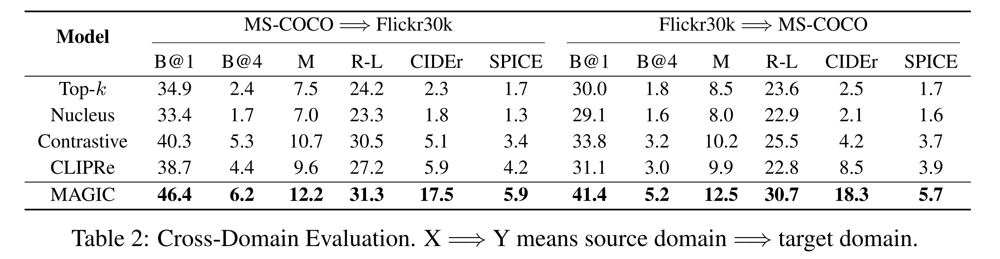
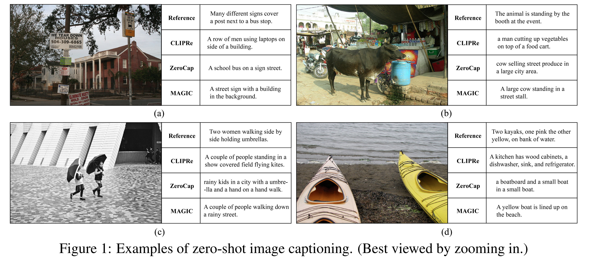

논문 및 이미지 출처 : <https://arxiv.org/pdf/2205.02655>

# Abstract

GPT-2/3 와 같은 generative language models (LMs) 는 prompt 를 통해 높은 품질의 text 를 생성할 수 있다. 이러한 models 은 text-prompted generation 을 위해 설계되었지만, generation process 가 image 와 같은 text 이외의 modality 에 의해 어떻게 guide 될 수 있는지는 여전히 열린 문제이다. 

본 연구에서 저자는 training-free framework 인 **MAGIC** (iMAge-Guided text generatIon with CLIP) 을 제안하며, generation process 에 visual control 을 plug-in 하고 LMs 가 zero-shot 방식으로 multimodal task (e.g., image captioning) 를 수행할 수 있도록 한다.

* MAGIC 은 plug-and-play 가 가능하면서도 효율적인 간단한 framework 로, image-grounded text generation 을 위해 off-the-shelf LM (i.e., GPT-2) 과 image-text matching model (i.e., CLIP) 을 직접 결합한다. 
* decoding 동안 MAGIC 은 magic score 라 불리는 CLIP 에 의해 유도된 score 를 도입함으로써 LM 의 generation 에 영향을 주는데, 이 magic score 는 생성된 결과가 주어진 image 와 의미적으로 관련되도록 하면서 동시에 이전에 생성된 context 와의 일관성을 유지하도록 regularization 역할을 한다. 
* 특히, 제안된 decoding scheme 은 어떠한 gradient update operation 도 포함하지 않으므로 computation 측면에서 효율적이다.

challenging task 인 zero-shot image captioning 에서 MAGIC 은 state-of-the-art method 를 상당한 margin 으로 능가하며, decoding 속도는 거의 27 배 빨라진다. MAGIC 은 flexible 한 framework 로, 이론적으로 image grounding 을 포함하는 어떠한 text generation task 와도 호환된다. 실험에서 저자는 하나의 image 와 text prompt 가 함께 주어졌을 때 visually grounded story generation 을 수행할 수 있다는 점도 보여준다.

# 1 Introduction

GPT-2 가 소개된 이후, 방대한 양의 비구조적 text 로 pre-training 된 generative language models (LMs) 은 다양한 NLP task 에서 뛰어난 성능을 보여 왔다. text prompt 가 주어지면 LMs 은 next-token prediction decoding scheme 을 통해 연속적으로 text 를 생성할 수 있다. text prompt 를 삽입함으로써 LMs 의 output 을 어느 정도 control 하는 것이 가능해졌지만, decoding process 가 image 와 같은 text 이외의 정보에 의해 어떻게 guide 될 수 있는지는 여전히 알려져 있지 않다.

최근 text 와 image 의 multimodal representation learning 은 CLIP 과 ALIGN 같은 pre-trained image-text joint embedding models 에 의해 다시 주목받고 있다. 이들은 weak correspondence 를 가진 large-scale noisy image-text pairs 를 이용한 contrastive embedding learning 을 수행하며, 학습된 joint model 은 image classification, image-text retrieval 과 같은 task 에서 supervised model 과 경쟁할 만한 impressive 한 zero-shot performance 를 달성한다. 그러나 이러한 models 은 여전히 image-grounded text generation 에 대해 충분히 탐구되지 않았다.

pre-trained LMs 과 image-text embedding models 의 장점을 결합하여 visually grounded text generation 을 수행하려면 어떻게 해야 하는가? 기존의 supervised 방법들은 human-annotated paired image-text data 로 multimodal encoder 를 추가로 training 하여 결합한다. 반면 weakly supervised approaches 는 pre-trained object detector 를 활용해 visual concept 를 식별하고 pseudo image-text pair 를 생성한다. 이러한 방법들은 annotated data 없이 pseudo data 로 직접 training 하지만, fixed set of labels 로 training 된 object detector 의 한계에 의해 성능이 제약되는 문제가 있다.

저자의 proposal 과 가장 가까운 방법은 ZeroCap 으로, frozen CLIP 과 GPT-2 를 결합한 unsupervised image captioning 방법이다. ZeroCap 의 장점 중 하나는 CLIP 과 GPT-2 를 re-training 또는 fine-tuning 하지 않은 채 activation space 에서 ex post facto 방식으로 작동한다는 점이다. 그러나 ZeroCap 은 gradient update 와 context cache 에 대한 optimization 에 의존하며, 이는 inference 를 크게 느리게 만들고 real-world scenario 에서의 사용을 어렵게 한다.

본 연구에서 저자는 **MAGIC** (iMAge-Guided text generatIon with CLIP) 이라는 새로운 text decoding scheme 을 설계함으로써 이 어려운 문제를 완전히 새로운 관점에서 해결할 것을 제안한다. 

* inference 동안 MAGIC 은 어떠한 추가 training 또는 parameter 도 필요로 하지 않으며, GPT-2 와 CLIP model 양쪽의 guidance 를 따르도록 원하는 output 을 선택하는 explicit “**control knobs**” 를 활용한다. 
* 기존 GPT-2 decoding process 와 달리, 저자는 next-token search 에 CLIP 에 의해 유도된 **magic score** 라는 항을 삽입하여 predicted result 가 주어진 image 와 의미적으로 가까운 정보를 반영하도록 유도한다. 
* 실험 결과 이러한 framework 는 단순한 plug-and-play principle 아래 zero-shot image captioning 과 visually grounded story generation 을 가능하게 함을 보여준다.

제안된 MAGIC 방법의 qualitative, quantitative 성능을 검증하기 위해 저자는 두 개의 commonly used benchmark 인 MS-COCO 와 Flickr30k 에서 광범위한 실험을 수행한다 (Sec. §4). 

* 놀랍게도 MAGIC 은 다양한 evaluation metric 에서 state-of-the-art (SOTA) 성능을 달성하며, 특히 모든 unsupervised 및 weakly supervised baseline 을 크게 능가한다. 
  * 또한 MAGIC 은 gradient update 를 포함하지 않기 때문에 inference 속도는 기존 zero-shot image captioning SOTA 대비 약 27 배 빨라진다. 
* image captioning 을 넘어 저자는 visually grounded story generation (Sec. §5) 에 대해서도 접근법을 평가한다. 
  * 이 task 에서, image 와 text prompt 가 함께 주어졌을 때 MAGIC 은 human 및 automatic evaluation 모두에서 강력한 baseline 들을 능가하는 high-quality story 를 생성한다.

정리하면 저자의 기여는 다음과 같다:

* 저자의 지식에 따르면, MAGIC 은 pre-trained GPT-2 와 CLIP model 양쪽의 guidance 를 따르도록 원하는 output 을 효율적으로 선택하기 위해 explicit “control knobs” 를 활용하는 첫 zero-shot 방법이다.
* MAGIC 은 zero-shot image captioning 에서 매우 뛰어난 효과를 보이며, 다양한 benchmark 에서 SOTA 를 달성한다.
* MAGIC 은 창의적인 방식으로 활용될 수 있음을 보여주며, visually grounded story generation 과 같은 복잡한 multimodal generation task 를 수행할 수 있고 다양한 evaluation metric 에서 near-human performance 에 도달한다.

# 2 Background

## 2.1 Image Captioning

본 연구는 image 를 의미 있고 문법적으로 올바른 sentence 로 기술하는 것을 목표로 하는 image captioning 분야와 밀접한 관련이 있다. 지난 수년 동안 이 주제는 광범위하게 연구되었지만, 여전히 완전히 해결된 task 로 간주되기에는 부족하다. training strategy (e.g., training data 의 종류) 에 따라 기존 방법들을 대략 (1) Supervised, (2) Weakly-/Un-Supervised 접근으로 분류할 수 있다. 전자는 수작업으로 label 된 image-text dataset 에 크게 의존한다. 반면 후자는 pseudo image-text pair (i.e., weakly supervised) 를 생성하거나, paired image-text data 를 전혀 사용하지 않는 방식 (i.e., unsupervised) 을 추구한다.

#### Supervised Approaches

deep learning 의 발전에 따라 대부분의 기존 model 은 하나의 CNN 으로 input image 를 encode 하고 하나의 RNN 으로 image 를 설명하는 sentence 를 generate 한다. 이러한 model 들은 input image 가 주어졌을 때 ground-truth caption 을 생성할 조건부 확률을 최대화하도록 training 된다. 

이후 연구들은 attention mechanism 을 이용하여 visual, textual cue 간의 interaction 을 model 함으로써 더 충실하고 풍부한 caption 을 얻는 데 집중하였다. 한편 controllable image captioning 방법들은 label, text 와 같은 다양한 control signal 을 입력하여 다양한 description 을 생성하는 방식을 제안하지만, training 을 위해 추가적인 annotation 이 필요하다. 이미지 전체가 아닌 sub-region 의 visual object 를 기술하는 dense captioning 방법들 또한 연구되었다. 

최근에는 large-scale dataset 에서 pre-training 된 visual-textual representation 의 이점을 활용하기 위해 vision-language pre-training 방법들이 제안되었으며, downstream task 에 대해 re-training 또는 fine-tuning 을 수행한다. 그러나 이러한 supervised 계열은 일정량의 paired image-text data 가 필수적이라는 한계가 있다.

#### Weakly-/Un-Supervised Approaches

paired image-text data 에 대한 의존도를 낮추기 위한 다양한 시도가 존재한다. weakly-supervised 방법에서는 pseudo-captions, 즉 주어진 image 에서 object detector 가 탐지한 label 을 포함하는 sentence 를 활용하는 방식이 일반적이다. 그러나 weakly supervised cross-modal alignment 가 필요하며, pseudo-caption 은 종종 image 와 무관한 단어를 포함하기 때문에 noise 를 줄이기 위한 특별한 constraint 나 learning schema 가 요구된다. 더욱이 이러한 방법들은 고정된 label set 을 갖는 pre-trained object detector 에 의존하므로 out-of-domain concept, scene 에 대해 비효율적이다.

그렇다면 pseudo-caption 생성 없이 진정한 unsupervised 방식으로 image captioning 을 수행할 수 있을까? 최근 CLIP 은 4억 개의 noisy web-collected image-sentence pair 로 training 되어 강력한 vision-language alignment 를 달성하였으며, 다양한 vision-language task 에서 impressive 한 zero-shot capability 를 보이며 앞선 질문에 대한 가능성을 열어주었다. ZeroCap 은 본 연구와 가장 밀접하며, pre-trained CLIP model 과 GPT-2 language model 을 결합한 unsupervised image captioning 방법이다. 이전 연구와 달리 ZeroCap 은 진정한 zero-shot 방식으로, model parameter 를 re-training 또는 fine-tuning 하지 않고 activation space 에서 “ex post facto” 방식으로 optimization 을 수행한다. ZeroCap 은 매 prediction step 마다 self-attention module 의 모든 K, V 로 구성된 context cache 를 CLIP 과 GPT-2 의 guidance 로 업데이트한다. 이로 인해 language model 규모가 커질수록 optimization overhead 가 급격히 증가한다.

본 연구의 MAGIC framework 는 ZeroCap 과 달리 주어진 image 에 대응하는 desired output 을 선택하기 위한 explicit “control knobs” 를 사용한다. MAGIC 의 procedure 는 gradient update 나 optimization 을 전혀 포함하지 않으므로 decoding process 가 약 27 배 빨라진다 (Sec. §4.1).

## 2.2 Plug and Play Generative Models

large-scale pre-trained generative models 은 최근 몇 년 간 자연어 처리와 computer vision 분야를 혁신시켰다. 기존 연구들은 이러한 model 들이 학습한 feature 안에 의미적으로 풍부한 정보가 존재함을 보여주었다. 이는 기존의 generative models 을 "plug and play" 방식으로 해석함으로써 원하는 output 을 synthesis 할 수 있는 가능성을 제시한다. 즉 re-training, fine-tuning 없이 off-the-shelf big models 의 강력한 capability 를 활용하면서 lightweight task-specific optimization 에 집중할 수 있다.

예를 들어 image generation 분야에서, DGN-AM 은 classifier 의 특정 neuron 을 활성화하는 hidden code 를 찾아 class 에 조건부된 image 를 생성한다. 이후 PPGN 은 MALA algorithm 을 도입하여 생성된 image 의 다양성과 품질을 향상시킨다. 

* Shen et al. 은 pre-trained unconditional GAN 의 latent space 를 직접 조작하여 input image 의 attribute 를 변경하는 방식을 제안하였다. 
* Patashnik et al. 은 CLIP 을 사용하여 text prompt 와 image 를 연결하고 gradient descent optimization 을 통해 StyleGAN 의 latent code 를 탐색함으로써 image attribute manipulation 을 수행한다. 
* text generation 분야에서는 PPLM 이 GPT-2 language model 을 사용하여 topic, sentiment editing 같은 task 를 수행하도록 이전 방식들을 확장하였다. 최근 ZeroCap 은 CLIP 과 GPT-2 를 직접 결합하여 image captioning task 가 처리될 수 있음을 보였다.

일반적으로 이러한 "plug and play" 방법들은 hidden code (또는 latent code, context cache) 를 gradient descent optimization 으로 반복적으로 조정하는 절차를 필요로 한다. 반면 본 연구의 MAGIC 방법은 generative LMs 의 decoding strategy 를 최적화함으로써 plug and play paradigm 을 확장한다. MAGIC 은 inference 동안 gradient update 를 포함하지 않기 때문에 computation 측면에서 매우 효율적이다 (e.g., ZeroCap 대비 약 27 배 빠름).

GPT-2 는 전례 없는 품질의 synthetic text sample 을 생성할 수 있지만, 특정 task 에 특화된 text 에 대해서는 자연스럽지 않을 수 있다는 점이 관찰된다. 이러한 관찰을 따라, 저자는 end task 의 textual domain 에 적응하도록 task-specific text corpus 에 대해 GPT-2 model 을 unsupervised 방식으로 추가 fine-tuning 한다. 이러한 adaptation 의 computational cost 는 매우 작으며 (e.g., MS-COCO 기준 1 NVIDIA 1080Ti GPU 로 2 시간 미만), decoding 동안 fine-tuned GPT-2 와 CLIP model 은 고정된다.

# 3 Methodology

## 3.1 Unsupervised Language Modelling

이전 연구를 따라, 저자는 end task 의 textual domain 에 적응하도록 text corpus 에 대해 *unsupervised language model* 을 먼저 학습한다. 일반적으로 variable-length text sequence $x$ 가 주어지면, language model $\theta$ 를 학습하기 위해 *maximum likelihood estimation (MLE) objective* 를 사용하며, 이는 다음과 같이 정의된다:

$$
\mathcal{L}_{\text{MLE}}
=

-\frac{1}{|x|}
\sum_{i=1}^{|x|}
\log p_\theta(x_i \mid x_{<i}).
\tag{1}
$$

최근 Su et al. 은 language model 의 representation space 를 보정하고 더 나은 perplexity 를 얻기 위해 contrastive objective 를 training 에 도입할 것을 제안하였다. text sequence $x$ 가 주어졌을 때, contrastive objective $\mathcal{L}_{\text{CL}}$ 은 다음과 같이 정의된다:

$$
\mathcal{L}_{\text{CL}}
=

\frac{1}{|x|\times (|x| - 1)}
\sum_{i=1}^{|x|}
\sum_{\substack{j=1,j \neq i}}^{|x|}
\max\{0, \rho - s(h_{x_i}, h_{x_i}) + s(h_{x_i}, h_{x_j})\},
\tag{2}
$$

* 여기서 $\rho$ 는 model 의 representation space distribution 을 regularize 하는 pre-defined margin 이다. 
* $h_{x_i}$ 는 token $x_i$ 의 representation 이며, 
* similarity function $s$ 는 다음과 같은 cosine similarity 를 계산한다: $s(h_{x_i}, h_{x_j})=\frac{h_{x_i}^\top h_{x_j}}{\|h_{x_i}\|\cdot\|h_{x_j}\|}$.

language model 의 overall objective $\mathcal{L}$ 은 다음과 같이 정의된다:

$$
\mathcal{L}
=
\mathcal{L}_{\text{MLE}}
+
\mathcal{L}_{\text{CL}}.
\tag{3}
$$

## 3.2 MAGIC Search

저자는 language model 의 decoding process 를 원하는 visual direction 으로 유도하기 위한 새로운 decoding scheme 인 **MAGIC Search** 를 제안한다. formally, text prefix $x_{<t}$ 와 image $I$ 가 주어졌을 때, 시간 step $t$ 에 출력 token $x_t$ 의 선택은 다음과 같이 정의된다:

$$
\begin{aligned}
x_t=&
\arg\max_{v \in V^{(k)}}
\Big\{
(1-\alpha) \times \underbrace{p_\theta(v \mid x_{<t})}_\text{model confidence}
- \\
&\alpha \times
\underbrace{\big(\max\{s(h_v, h_{x_j}):1 \le j \le t-1\}\big)}_\text{degeneration penalty}
+
\beta \times
\underbrace{f(v \mid \mathcal{I}, x_{<t}, V^{(k)})}_\text{magic score}
\Big\},
\end{aligned}
\tag{4}
$$

* 여기서 $V^{(k)}$ 는 model probability distribution $p_\theta(\cdot \mid x_{<t})$ 에서 top-$k$ prediction 의 집합이다. 
* 또한 $h_v$ 는 $x_{<t}$ 와 후보 $v$ 의 concatenation 을 model 에 입력했을 때 얻는 token representation 이다.

Su et al. 의 연구에서 영감을 받아, 위 식에서 *model confidence* 와 *degeneration penalty* 를 함께 사용하여 model 이 plausible output 을 decode 하도록 하면서 불필요한 반복이나 collapse 를 줄인다.

---

**MAGIC Search** 의 핵심은 decoding 과정에 visual control 을 직접 삽입하는 *magic score* 이다. candidate $v$, prefix $x_{<t}$, image $\mathcal{I}$ 가 주어졌을 때 magic score 는 CLIP 기반 image-text similarity 를 다음과 같은 확률 분포 형태로 계산한다:

$$
f(v \mid \mathcal{I}, x_{<t}, V^{(k)})
=
\frac{e^{\text{CLIP}(\mathcal{I}, [x_{<t} : v])}}
{\sum_{z \in V^{(k)}} e^{\text{CLIP}(\mathcal{I}, [x_{<t} : z])}}
=
\frac{e^{h_\mathcal{I}^\top h_{[x_{<t}:v]}}}
{\sum_{z \in V^{(k)}} e^{h_\mathcal{I}^\top h_{[x_{<t}:z]}}},
\tag{5}
$$

* 여기서 $h_\mathcal{I}$ 는 CLIP image encoder 가 생성한 image embedding,
* $h_{[x_{<t}:v]}$ 는 CLIP text encoder 가 생성한 text embedding,
* $[:]$ 는 concatenation operation 을 의미한다.

*magic score* 는 language model 이 image 와 의미적으로 관련된 token 을 선택하도록 유도하며, hyper-parameter $\beta$ 를 통해 visual control 의 강도를 조정한다. 특히 $\beta = 0$ 이면 MAGIC Search 는 vanilla contrastive search 로 환원된다.

MAGIC Search 는 visual control 을 decoding 과정에 직접 삽입할 수 있으면서, supervised training 이나 추가 feature 에 대한 gradient update 를 필요로 하지 않는다. 이 속성 덕분에 MAGIC 은 이전 접근법보다 훨씬 더 computationally efficient 하며, 실험에서 약 27 배 이상의 decoding 속도 향상을 확인하였다 (Sec. §4.1).

# 4 Zero-Shot Image Captioning

#### Evaluation Benchmarks

저자는 두 개의 널리 사용되는 benchmark 인 MS-COCO 와 Flickr30k 에서 실험을 수행한다. 두 dataset 모두 Karpathy et al. 이 제공한 protocol 에 따라 training, validation, test split 을 설정한다.

#### Implementation Details

Sec. §3.1 에서 설명했듯이, 각 benchmark 에 대해 저자는 training text corpus 에 대해 GPT-2 model 을 3 epoch 동안 fine-tuning 한다. Eq. (3) 의 contrastive loss margin $\rho$ 는 0.5 로 설정한다. optimizer 는 Adam 을 사용하고 learning rate 는 $2 \times 10^{-5}$ 로 설정한다. 주목할 점은 이 fine-tuning 과정이 계산적으로 매우 작다는 점이며, 즉 1 NVIDIA 1080Ti GPU 로 2 시간 미만이 소요된다.

decoding 동안 language model 의 generation 은 special start-of-sequence token (i.e., [sos]) 으로 시작한다. MAGIC Search (Eq. (4)) 의 hyper-parameter 인 $k, \alpha, \beta$ 값은 MS-COCO 의 경우 validation set 의 성능을 기반으로 각각 45, 0.1, 2.0 으로 설정한다. Flickr30k 의 경우 25, 0.1, 2.0 으로 설정한다.

#### Baselines

저자는 다음과 같은 zero-shot baseline 을 포함한다:

1. **Image-conditioned 하지 않은 decoding baselines**
   * start-of-sequence token 에서 시작하여 top-k sampling (k = 40),
     nucleus sampling (p = 0.95),
     contrastive search (MAGIC Search 와 동일한 k, α).
     이러한 방법들은 image input 을 사용하지 않으므로 language model 성능의 lower bound 로 활용된다.
2. **CLIP 기반 retrieval 방법 (CLIPRe)**
   * image 를 기준으로, CLIP 이 산출하는 image-text similarity 로 training text corpus 중 가장 관련 있는 caption 을 retrieve 한다.
3. **ZeroCap**
   * 현재 SOTA zero-shot 방법이며, decoding 동안 CLIP-guided gradient update 를 수행한다.
   * fair comparison 을 위해 저자의 접근법과 동일한 language model 을 사용한다.

#### Evaluation Metrics

평가는 통상적인 metric 들을 사용한다:\
BLEU-1 (B@1), BLEU-4 (B@4), METEOR (M), ROUGE-L (R-L), CIDEr, SPICE.\
추가로, 다른 generation-based baseline 과 비교하여 decoding 속도를 평가하는데, 이는 image instance 당 평균 inference 시간으로 측정한다.

## 4.1 Results

Tab. 1 은 zero-shot image captioning 결과를 제시한다. 또한 비교를 위해 supervised 방법들 (BUTD, GVD, UniVLP, ClipCap, Oscar, LEMON) 과 weakly supervised 방법들 (UIC, IC-SME, S2S-SS, S2S-GCC) 도 포함한다.

* Top-k, Nucleus, Contrastive 의 결과로부터, image input 없이 unsupervised language model 만 사용할 경우 의미 있는 caption 을 생성하기 어렵다는 점을 확인할 수 있다. 
  * 반면 CLIPRe 는 image-text similarity 를 활용해 training text corpus 로부터 test image 와 더 잘 관련된 caption 을 retrieve 할 수 있다. 하지만 training/test 간 data discrepancy 로 인해 CLIPRe 의 성능은 SOTA 인 ZeroCap 에 크게 못 미친다.
* 마지막으로, 두 benchmark 모두에서 MAGIC 은 13 개 metric 중 11 개에서 최고 성능을 달성함을 확인한다. 
  * 특히 ZeroCap 대비 13 개 중 12 개의 metric 을 능가하면서도 약 27× 의 decoding speedup 을 달성한다. 
  * decoding 동안 MAGIC 은 gradient update 와 같은 비효율적인 연산을 포함하지 않기 때문에 이러한 속도 향상이 가능하며, 이는 MAGIC 의 실제적 유용성을 강하게 뒷받침한다.

## 4.2 Cross-Domain Experiment

저자의 접근법의 generalization ability 를 평가하기 위해 cross-domain experiment 를 수행한다. 구체적으로, source domain (e.g., MS-COCO) 의 training text corpus 로 fine-tuning 된 unsupervised language model 을 target domain (e.g., Flickr30k) 의 test set 에 직접 적용하여 inference 를 수행한다.

저자는 MAGIC 을 Top-k, Nucleus, Contrastive, CLIPRe 를 포함한 여러 zero-shot 방법들과 비교한다. CLIPRe 의 경우, target domain 의 test image 가 주어졌을 때, source domain 의 training text corpus 로부터 CLIP 이 측정한 image-text similarity 에 기반하여 가장 관련 있는 caption 을 retrieval 한다.

Tab. 2 는 cross-domain evaluation 의 결과를 보여주며, 여기서 모든 방법에서 성능 하락이 관찰된다. 이는 in-domain evaluation 결과를 보여주는 Tab. 1 과 비교했을 때 확인할 수 있다.

그럼에도 불구하고 MAGIC 은 여전히 비교된 모든 방법 중 최고 성능을 보이며, robustness 와 generalization ability 측면에서 뚜렷한 이점을 보여준다.

## 4.3 Qualitative Evaluation

Fig. 1 은 저자의 접근법과 두 개의 강력한 zero-shot baseline, 그리고 reference caption 을 함께 시각적으로 비교한 결과를 보여준다.

* 결과로부터 MAGIC 이 유창한 caption 을 생성할 뿐만 아니라 주어진 image 에 더욱 효과적으로 grounding 할 수 있음을 확인할 수 있다. 
  * 예를 들어 Fig. 1(a) 에서 CLIPRe 의 결과는 image 와 부분적으로만 관련된 “building” object 만을 포함한다. 
  * ZeroCap 의 경우, image 에 존재하지 않는 “school bus” object 를 잘못 기술한다. 
  * 반면 MAGIC 은 image 속 “street sign” object 와 배경의 building 을 모두 정확히 설명한다.
* 또 다른 예로 Fig. 1(d) 를 살펴보면, CLIPRe 의 결과는 image 와 명백히 무관하다. 
  * ZeroCap 의 경우 “boatboard”, “small boat” 등 image 와 관련된 object 를 생성하긴 하지만, 생성된 문장은 유창하지 않고 문법적으로도 부자연스럽다. 
  * 이에 비해 MAGIC 은 “yellow boat”, “beach” 등 올바른 object 와 이들의 위치 관계 (i.e., lined up on) 까지 함께 기술하면서도 fluency 와 grammaticality 를 모두 유지하는 caption 을 생성한다.

# 5 Story Generation

MAGIC 의 versatility 와 extensibility 를 검증하기 위해, 저자는 대표적인 text generation task 인 *story generation* 에 대해 실험을 수행한다. 이 task 에서는 story title (i.e., text prompt) 이 주어졌을 때, language model 이 해당 title 과 관련된 흥미롭고 일관된 story 를 생성하는 것이 목표이다.

#### Evaluation Benchmark

저자는 널리 사용되는 ROCStories dataset 에서 접근법을 평가한다. 이 dataset 에서 각 story title 은 사람이 작성한 5 문장으로 이루어진 commonsense story 와 함께 제공된다. 저자는 공식 split 을 따라 training, validation, test set 을 구성한다.

#### Model and Baselines

저자는 ROCStories benchmark 에 대해 fine-tuning 된 공개 GPT-based language model 을 사용한다. MAGIC Search 는 language model decoding scheme 이므로, 다양한 강력한 text decoding 방법들과 비교를 수행한다:

1. Greedy search
2. Beam search (beam width = 10)
3. Top-k sampling (k = 40)
4. Nucleus sampling (p = 0.95)
5. Typical sampling (τ = 0.2)
6. Contrastive search (k = 5, $\alpha = 0.6$)

각 방법의 hyperparameter 는 validation set 에서의 MAUVE 성능 (Sec. §5.1 에서 상세 설명) 이 최적이 되도록 선택한다.

#### Implementation Details of MAGIC

MAGIC Search 를 story generation 에 사용하기 위해, 먼저 story title 이 주어지면 CLIP 이 측정한 similarity 를 기준으로, 미리 구축된 image index 에서 title 과 가장 관련 있는 image 를 retrieval 한다.

image index 는 web 에서 수집된 330 만 개 이상의 image 를 포함하는 공개 ConceptualCaptions dataset 으로 구성한다. 실제 구현에서는 CLIP 으로 모든 image representation 을 미리 계산한 뒤, FAISS 를 사용해 image index 를 구축하여, “story title–image” retrieval 을 sub-linear time complexity 로 빠르게 수행한다.

그 후, retrieval 된 image 에 대해 visual grounding 을 수행하면서, MAGIC Search 를 사용해 story title 로부터 story 를 생성한다 (이때 hyperparameter 는 $k = 5$, $\alpha = 0.6$, $\beta = 0.15$ 로 설정한다).

#### 5.1 Automatic Evaluation

이전 연구를 따라, 저자는 다양한 automatic evaluation metric 을 사용해 각 방법이 생성한 결과의 quality 를 평가한다. 사용된 metric 은 다음과 같다.

* (1) n-gram repetition (rep-n)
* (2) generation diversity (div.)
* (3) generated story 와 story title 간 semantic coherence (coh.)
* (4) MAUVE score: generated text 와 human-written text 사이의 token 분포 closeness 를 측정

추가로, MAGIC 이 주어진 image 와 의미적으로 관련된 story 를 생성하는지를 검증하기 위해, story title 로 retrieval 된 image 와 생성된 story 간 semantic similarity 를 측정하는 CLIPScore 를 사용한다.

* Tab. 3 의 automatic 결과에서, MAGIC 이 대부분의 evaluation metric 에서 최고 성능을 보임을 확인할 수 있다. 
  * rep-n, diversity, MAUVE score 의 결과는 MAGIC 이 가장 다양한 story 를 생성하면서도 token distribution 관점에서 human-written story 에 가장 가깝다는 점을 보여준다.
* 또한 coherence (coh.) metric 에서 MAGIC 은 다른 baseline 들을 눈에 띄게 능가한다. 
  * 저자는 story title 로 retrieval 된 image 가 풍부한 visual concept 과 feature 를 포함하며, 이를 통해 더 많은 grounding information 을 제공한다고 가정한다. 
  * 이러한 visual knowledge 를 활용함으로써, MAGIC 은 story title 과 더 의미적으로 coherent 한 story 를 생성할 수 있다.
* 마지막으로 CLIPScore metric 에서 MAGIC 은 다른 방법들을 큰 차이로 능가하며, 생성된 story 가 image 와 더 잘 연관되어 있음을 시사한다. 
  * 정리하면, MAGIC 이 생성한 text 는 text prompt (i.e., story title) 와 image 양쪽의 guidance 를 효과적으로 반영하는 반면, 다른 방법들은 text prompt 에서만 정보를 활용할 수 있다.

## 5.2 Human Evaluation

저자는 third-party grading platform 에서 영어 능숙 평가자들의 도움을 받아 human evaluation 을 수행한다. test set 에서 200 개 instance 를 샘플링하고, 생성된 모든 결과와 reference 를 무작위로 섞은 뒤 5 명의 평가자가 평가하도록 하여 총 8,000 개의 annotated sample 을 수집하였다.

평가는 다음 두 feature 에 대해 1–5 점의 Likert scale 로 이루어진다:

* **Coherence (coh.)**: 생성된 story 가 title 과 의미적으로 일관적인가?
* **Fluency (flu.)**: 생성된 story 가 유창하고 이해하기 쉬운가?

Tab. 3 은 human evaluation 결과를 보여주며, 첫 번째 row 에는 Fleiss’ kappa coefficient 로 측정한 strong inter-annotator agreement 를 제시한다.

* 먼저 fluency (flu.) 와 informativeness (inform.) metric 에서 MAGIC 이 다른 방법보다 더 좋은 성능을 보인다. 이는 visual guidance 의 도입이 grammaticality 와 fluency 를 유지하면서도 더 흥미로운 content 를 생성하도록 도움을 준다는 것을 의미한다.
* 또한 coherence metric 에서 MAGIC 은 다른 baseline 대비 유의미하게 더 높은 성능을 보이며 (Sign Test, p-value < 0.05), story title 과 생성된 story 간의 consistency 를 더 잘 유지한다. 이는 automatic evaluation (Sec. §5.1) 의 coherence score 결과와도 일치한다.
* 마지막으로 story-image relevance (si-rel.) metric 에서도 MAGIC 은 다른 방법보다 유의미하게 높은 성능을 보이며, 주어진 image 에 기반해 visually grounded text 를 생성할 수 있음을 보여준다.

## 5.3 Qualitative Evaluation

Fig. 2 에서는 가장 강력한 baseline 인 contrastive search 와 저자의 접근법을 비교하며, story title 로 retrieval 된 image 를 좌측에 표시한다.

MAGIC 은 image 의 visual concept 에 conditioning 하여 text (blue 로 강조된 부분) 를 생성한다.

* 첫 번째 예에서는 MAGIC 이 세 가지 종류의 ice cream 에 대한 상세 묘사를 포함하여, contrastive search 가 생성한 story 보다 이야기의 흥미와 story title (ice cream tasting) 과의 관련성을 높였다.

* 두 번째 예에서 contrastive search 는 명백히 topic 에서 벗어난 결과를 생성한다. 반면 MAGIC 은 image 에 기반하여 topic 을 잘 유지하며 sand volleyball game 에 대한 흥미로운 세부 사항을 묘사한다: \
(i) 게임은 beach 에서 열렸고, \
(ii) 게임은 두 시간 동안 진행되었으며, \
(iii) 친구가 게임에서 승리했다.

정리하면, MAGIC 은 image 로부터 visual guidance 를 활용함으로써, 의미적으로 coherent 하면서도 흥미로운 content 를 가진 story 를 생성할 수 있다.

# 6 Conclusion and Future Work

본 연구에서는 language model 의 generation 과정에 visual control 을 plug-in 하는 새로운 decoding scheme 인 MAGIC 을 제안한다. MAGIC 은 training-free framework 로, decoding 속도를 희생하지 않으면서 LM 이 도전적인 multimodal task 를 zero-shot 방식으로 처리할 수 있게 한다. 

MAGIC 의 versatility 와 extensibility 를 검증하기 위해, 저자는 두 가지 image-grounded text generation task 에 대해 접근법을 포괄적으로 평가한다: (i) image captioning, (ii) visually grounded story generation. 실험 결과, 저자의 접근법은 automatic, human evaluation 모두에서 기존 state-of-the-art 방법들을 눈에 띄게 능가함을 보여준다.

## Future Work

본 연구의 초점은 language model 을 이용한 zero-shot image grounded text generation 이지만, MAGIC Search 는 model architecture 에 대해 agnostic 한 decoding scheme 임을 강조하고자 한다. 다시 말해, image 와 text 를 함께 input 으로 받는 어떤 기존 multimodal generative model 에도 자연스럽게 결합될 수 있다. 그러나 이 방향은 본 논문의 범위를 벗어나며, 향후 연구로 남겨둔다.

더 나아가 이론적으로 MAGIC 은 text 와 image 를 넘는 modality 에도 확장 가능한 generic framework 이다. control 과 generated text 사이의 관련성을 측정할 similarity metric 만 정의할 수 있다면, 어떤 modality, 어떤 형태의 control 이든 language model 에 plug-in 할 수 있다. 향후 연구에서는 image 를 넘어 audio, video 와 같은 다른 modality 에 MAGIC 을 적용하는 가능성을 탐구함으로써, language model 이 보다 일반적인 multimodal intelligence 에 기반한 text 를 생성할 수 있도록 하는 방향을 추구하고자 한다.

