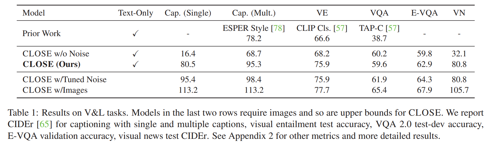
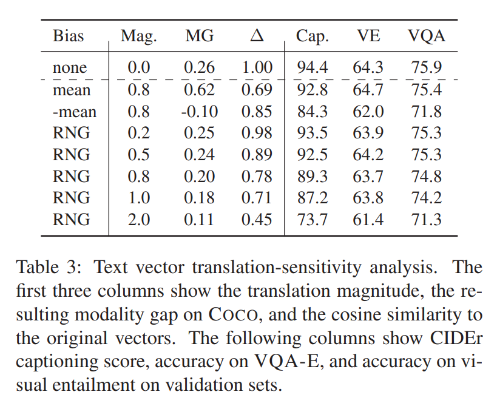
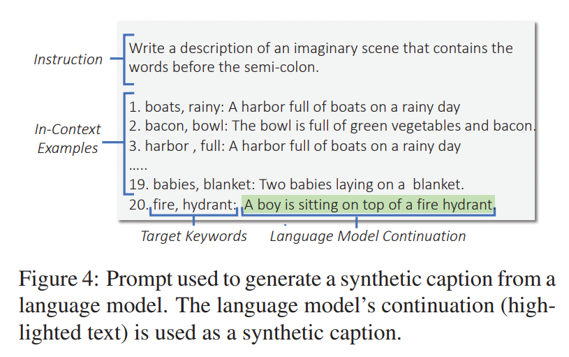

논문 및 이미지 출처 : <https://openaccess.thecvf.com/content/ICCV2023/papers/Gu_I_Cant_Believe_Theres_No_Images_Learning_Visual_Tasks_Using_ICCV_2023_paper.pdf>

# Abstract

질문을 parsing 하는 것, semantics 를 비교하고 대조하는 것, description 을 작성하는 것과 같은 computer vision task 에 필요한 많은 high-level skill 은 natural language processing 과 같은 다른 domain 에서도 필요하다. 

본 논문에서 저자는 이러한 skill 을 text data 로부터 학습한 뒤, visual training data 로는 전혀 training 하지 않고도 그것을 vision task 로 transfer 할 수 있는지 질문한다. 

* 저자의 approach 의 핵심은 contrastive 로 training 된 vision encoder 와 language encoder 의 joint embedding space 를 활용하는 것이다. 
* 실제에서는 contrastive model 에서 modality 가 다른 embedding space 사이에 systematic difference 가 존재할 수 있으며, 저자는 이러한 difference 가 저자의 approach 에 어떤 영향을 미치는지 분석하고, 이 우려를 완화하기 위한 strategy 를 연구한다.

저자는 image captioning, visual entailment, visual question answering, visual news captioning 의 네 가지 representative task 에 대해 오직 text training data 만을 사용하여 model 을 만들고, image 를 사용하는 standard benchmark 에서 이를 evaluation 한다. 

이러한 model 은 image 로 training 된 model 에 근접한 performance 를 보이며, text-only setting 에서 captioning 과 visual entailment 에 대해 기존 work 보다 9 point 이상 높은 성능을 보이고, visual news 에서는 모든 기존 work 보다 30 point 이상 높은 성능을 보인다는 것을 확인한다. 또한 저자는 image data 와 human-curated language data 를 전혀 사용하지 않고, 대신 book, web, language model 로부터 얻은 readily-available 한 text data 를 사용해 training 된 다양한 스타일의 image captioning model 을 보여준다.

# 1. Introduction

vision task 와 natural language processing (NLP) task 는 보통 매우 다른 것으로 간주되지만, 이를 수행하기 위해 필요한 skill 은 종종 높은 정도의 overlap 이 존재한다. visual question answering 과 reading comprehension question answering 은 모두 question 을 parsing 하고 이해하는 능력을 필요로 하며, visual entailment 와 textual entailment 은 서로 다른 semantic meaning 을 비교하는 능력을 요구하고, captioning 과 summarization 은 input 의 semantics 를 요약하는 text 를 작성하는 능력을 요구한다. 

이는 흥미로운 가능성을 제기한다. 즉, model 이 input text 의 high-level semantic representation 을 사용하여 이러한 task 중 하나를 수행하는 법을 학습했다면, input image 가 동일한 semantic representation 으로 encoding 되기만 한다면 이론적으로 해당되는 visual task 도 즉시 수행할 수 있다는 것이다. 

저자는 이를 *zero-shot cross-modal transfer* 라고 부르는데, 이는 한 modality 에서 학습한 skill 을 다른 modality 에 적용해야 하기 때문이다. 이를 달성하는 것은 각 modality 마다 expensive 한 training data 를 필요로 하지 않고 modality 간에 skill 을 generalization 할 수 있는 multimodal model 을 구축하는 방향으로 나아가는 한 단계이며, visual training data 는 부족하지만 text data 는 비교적 쉽게 수집할 수 있는 task 에 활용 가능성을 가진다.

이를 위해서는 image 와 text 를 shared semantic space 로 encoding 해야 한다. 저자는 contrastive loss 로 training 된 vision and language (V&L) model 을 이 목적에 사용한다. 이러한 model 은 matching 되는 image 와 caption 의 vector 가 서로 가깝고, 관련 없는 image 와 caption 의 vector 는 멀어지도록 text 와 image 를 vector 로 embedding 한다. 이 loss 는 원래 representation learning 과 zero-shot classification 용도로 고안되었지만, 여기서는 cross-modal transfer 를 가능하게 한다는 것을 보인다.

이를 위해 저자는 **Cross modaL transfer On Semantic Embeddings (CLOSE)** 라는 방법을 제안한다. CLOSE 의 개요는 Fig. 1 에 나타나 있다. 

* training 동안, text input 은 contrastive model 의 (frozen) text encoder 로 vector 로 encoding 되고, 이는 model 의 input 으로 사용된다. 
* testing 동안에는, visual input 이 (frozen) image encoder 로 embedding 되어 text embedding 대신 사용된다. 
* 이러한 encoder 들은 semantics 를 비슷한 방식으로 encoding 하도록 명시적으로 training 되었기 때문에, text vector 를 읽고 처리하는 법을 배우는 것은 자연스럽게 image vector 를 읽고 처리하는 능력으로 이어진다. 
* 본 논문에서는 text-to-image transfer 에 초점을 맞추지만, 저자의 approach 는 video, point cloud, audio 와 같은 다른 contrastive model 에도 적용 가능하여 더 많은 modality 간의 transfer 를 가능하게 한다.

이 접근에서 한 가지 잠재적 어려움은 contrastive embedding 이 modality 간에 어느 정도 구조를 공유하긴 하지만, 실제로는 image vector 와 text vector 사이에 여전히 상당한 difference 가 존재할 수 있다는 점이다. 이를 완화하기 위해 저자는 training 동안 사용되는 text vector 를 수정하는 adapter 를 추가적으로 사용할 것을 제안한다. Gaussian noise 를 더하는 것이 performance 를 boosting 하는 데 매우 효과적임을 발견했으며, 분석에서 다른 방법도 고려한다.

* text-to-image transfer 는 비교적 미개척된 setting 이기 때문에, 저자는 CLOSE 가 text-to-image domain shift 를 major performance drop 없이 처리할 수 있는지 확인하기 위해 광범위한 실험을 수행한다. 
* 저자는 CLOSE 로 text 만 사용해 training 된 model 과 image 와 text 를 모두 사용해 training 된 model 을 세 가지 standard V&L task (captioning, visual questioning answers (VQA), visual entailment) 와 더 복잡한 visual news captioning task 와 비교한다. 
* text-only model 은 일반적으로 image 로 training 된 version 에 reasonably close 한 performance 를 보이며, CLOSE 가 modality 간에 여러 skill 을 효과적으로 transfer 할 수 있음을 보여준다. 
* text-only setting 에서 captioning 은 기존 best method 보다 17 CIDEr (78.2 vs. 95.4), visual entailment 은 9 point (66.6 vs. 75.9) 향상되며, 이 setting 에서 큰 margin 으로 state-of-the-art 를 달성한다. 
* VQA 와 visual news 에 대해서는 prior result 가 없지만, visual news 에 대해서는 image 를 사용한 기존 best reported result 보다도 우수한 성능을 기록한다 (50.5 vs. 80.8 CIDEr).

이 실험들은 efficient 한 text-to-image transfer 가 가능하다는 것을 보여준다. 이는 text training data 는 annotator 가 직접 구성하거나 기존 text dataset 에서 mining 하거나 GPT-3 와 같은 large language model 이 생성할 수 있어 visual training data 를 구성하는 것보다 훨씬 적은 비용으로 가능하기 때문에 중요한 practical implication 을 갖는다. 

* 저자는 prompt construction 만 human annotation 이 필요한 setting 에서도 large language model 이 생성한 text 로 CLOSE captioning model 을 효과적으로 training 할 수 있음을 보여준다. 
* 또한 labeled image 없이도 stylistic captioning model 여러 개를 training 한다. 
* 저자는 internet review, book, GPT-3 generation 등 다양한 source 로부터 style 이 다른 text 를 수집하고, 이러한 text 로 training 된 CLOSE model 이 image 에 대해 정확하면서도 style 이 잘 반영된 caption 을 생성할 수 있음을 보여준다 (Fig. 2 참조).

마지막으로 두 가지 분석을 수행한다. 

1. text vector 와 image vector 가 constant offset 만큼 다른 경우에도 CLOSE 가 robust 하다는 sensitivity analysis 로, 이는 image/text embedding 사이에 겉보기에는 큰 difference 가 존재하더라도 CLOSE 가 작동할 수 있음을 보여준다. 
2. auxiliary vision and language corpus 를 사용해 더 나은 adapter 를 구축하는 것의 효과를 연구한다. 
   * 이러한 data 의 source 에 따라 improvement 는 달라지지만, auxiliary data 로 structured covariance matrix 를 계산해 Gaussian noise 추가에 사용하는 것이 특히 효과적인 방법임을 확인한다.

요약하면, 저자의 contribution 은 다음과 같다:

1. zero-shot cross-modal transfer 를 위한 CLOSE model 을 소개한다.
2. 네 가지 V&L task 에 대해 text data 만으로 CLOSE 를 training 했을 때 image 와 text 모두로 training 된 model 에 근접한 결과를 보임을 보인다.
3. 세 개 task 에서 text-only setting 의 SoTA 결과를 달성한다.
4. stylistic captioning 에 CLOSE 를 적용하는 사례를 보인다.
5. contrastive model 의 image/text vector 간 difference 와 adapter 의 종류가 CLOSE 의 performance 에 미치는 영향을 분석한다.

# 2. Method

#### Model

저자의 approach 는 contrastive model 의 image/text encoder 를 사용해 input 을 encoding 하고, 그 후 많은 prior work 을 따라 pre-trained language model 을 fine-tuning 하여 input vector 와 추가 input text 를 처리해 output text 를 생성한다. 

* 먼저, input image 또는 text vector 는 contrastive loss 에서 사용되는 것과 일치하도록 unit length 로 normalized 된다. 그다음, 이 vector 는 language model 의 embedding layer 와 동일한 dimensionality 를 갖는 여러 개의 vector 로 변환되는데, 저자는 실험에서 4 개를 사용한다. 
* 이 변환은 linear layer 를 사용해 수행된다. 이후, 다른 input text (e.g., visual entailment 에서의 hypothesis, VQA 에서의 question) 는 tokenization 되고 language model 의 embedding layer 로 embedding 된다. 
* 이러한 embedding 들은 input vector 로부터 생성된 embedding 들과 concatenation 되어 language model 의 input sequence 를 구성한다.

단순화를 위해 저자는 모든 task 에 대해 generative 하게 model 을 training 한다. 

* model 은 captioning, VQA, visual entailment task 에 대해 각각 caption, free-form question answer, class name 을 생성한다. 
* training 동안 language model 과 linear layer 는 fine-tuning 되지만, text encoder 는 pre-training 동안 학습된 text 와 image vector 간의 correspondence 를 보존하기 위해 frozen 상태로 유지된다.

#### Modality Gap

실제 contrastive model 에서 text vector 와 image vector 는 상당히 멀리 떨어질 수 있으며, 이는 modality gap 으로 알려져 있다. 예를 들어, COCO caption 에서 image 와 paired caption 의 평균 cosine similarity 는 0.26 에 불과한 반면, 무관한 caption 두 개의 평균 similarity 는 0.35 이다. 

Fig. 3a 는 이러한 gap 때문에 image vector 와 text vector 가 vector space 에서 서로 다른 cluster 로 분리되는 모습을 보여준다. 근본 원인은 contrastive model 에서 사용하는 cross-entropy loss 가 paired image-text pair 가 random pair 에 비해 상대적으로 가깝기만 하면 되지, absolute distance 가 가깝도록 요구하지 않기 때문이다.

저자는 이를 해결하기 위해 간단하면서도 효과적인 방법을 사용한다. 

* 즉, standard normal distribution 에서 sampling 한 Gaussian noise 를 hyper-parameter $w$ 로 scaling 하여 training 중 text vector 에 추가한다. 
* 직관적으로 이 noise 는 text vector 를 퍼뜨려 modality gap 을 줄이고 image vector 와 overlap 을 형성하도록 돕는다. 

Fig. 3b 는 적은 양의 noise 만으로도 image vector space 와 text vector space 의 overlap 이 크게 개선되는 것을 시각적으로 보여준다. 또한 noise 는 input vector 의 작은 변화나 variation 에 대해 model 을 더욱 robust 하게 만들어, text vector 에서 image vector 로 switching 할 때의 shift 에 더 잘 대비하도록 한다.

---

random noise 를 사용하는 두 번째 motivation 은 image vector 가 lighting, background, camera position 과 같이 text vector 에는 반영되지 않는 subtle 한 visual detail 을 포함한다는 관찰에서 비롯된다. Appendix 5 의 작은 case study 예시에서 보이듯, semantic change (e.g., caption 이나 image 의 subject 를 “dog” 에서 “cat” 으로 변경) 는 text vector 에는 비교적 일관된 directional shift 를 유발하지만 image vector 에는 훨씬 더 erratic 한 영향을 준다. text embedding 에 noise 를 추가하면 semantic 이 유사하더라도 image 와 text vector 간에 여전히 작은 차이가 존재할 수 있다는 사실을 simulation 하여 이 문제를 완화한다.

noise 를 추가한 뒤에는 evaluation 에서 사용될 image vector 와 일치하도록 다시 unit length 로 re-normalization 한다. modality gap 및 이를 처리하기 위한 다른 approach 에 대한 보다 자세한 분석은 Sec. 4 에서 논의한다.

# 3. Experiments

저자는 네 가지 V&L task — captioning, visual entailment, VQA, visual news — 그리고 language model 이 생성한 text 만을 사용해 CLOSE 를 training 하는 setting 에서의 결과를 보고한다.

## 3.1. Setup

저자는 이러한 task 들을 위해 관련 training dataset 의 text annotation 과, 일부 task 에 대해서는 training image 의 text caption 을 활용하여 순수 text training dataset 을 구성한다. 주요 비교 대상은 training 에 image 를 사용하는 CLOSE model 이며, 이 경우 testing 때와 동일하게 image encoder 로 image 가 encoding 된다. 

이 model 은 domain shift 를 경험하지 않기 때문에 upper bound 로 간주된다. 실제에서는 text training data 가 다른 source 에서도 얻어질 수 있지만, 저자는 image 를 사용하는 model 이 학습한 data 와 가장 근접한 text source 를 사용하여 image-text domain shift 에 의해 손실되는 성능만을 고립해 분석한다. Sect. 5 와 Sect. 3.3 에서 이러한 text source 에 대한 추가 실험을 제시한다.

저자는 모든 task 에 대해 동일한 hyper-parameter 세트를 사용하며, T5base 와 CLIPViT-L/14, noise level 0.08 을 사용한다. image/text validation set 없이도 효과적인 성능을 보이는 것을 목표로 한다. hyper-parameter 세부 내용은 Appendix 1 에 제시한다. 또한 validation set 에서 noise level 을 tuning 했을 때와 noise 를 제거했을 때의 결과도 함께 제시하여 noise 의 효과를 분석한다.

## 3.2. Results

결과는 Tab. 1 에 제시된다. 지면 한계로 각 task 당 하나의 metric 만 기재하고, 추가 metric 은 Appendix 2 에 포함한다. 또한 image 를 사용하지 않은 prior work 중 best method 도 함께 비교한다.

#### Image Captioning

captioning 에서는 text caption 을 input text 와 target output text 로 사용한다. 그러나 하나의 scene 에 대해 여러 caption 이 존재할 경우, 동일한 image 를 설명하는 여러 caption 중 하나를 input 으로, 다른 하나를 target 으로 사용하는 것이 유리하다는 점을 발견했다. 이를 captioning (single) 과 captioning (multiple) 로 구분하여 평가한다. COCO Captioning dataset 에 대해 Karpathy split 을 사용한다.

* CLOSE (text-only) 는 multiple-caption setting 에서 95.3 CIDEr 를 기록하며, image 없이도 매우 높은 captioning 능력을 보여준다. single-caption setting 에서는 성능이 감소하지만 noise level 을 높이면 95.4 까지 상승한다.
* 저자의 approach 는 MAGIC (49.3), Socratic Models (44.5) 등 최근 zero-shot 방법들뿐 아니라 text caption 을 사용하는 ESPER Style (78.2) 보다도 17 point 이상 우수하다.

#### Visual Entailment

visual entailment 은 premise image 가 hypothesis sentence 를 entail / contradict / neutral 중 어느 것으로 만드는지를 판별한다. training 은 image 대신 text premise 를 사용한다. hypothesis sentence 는 항상 text 로 language model 로 encoding 된다.

* 저자는 SNLI (language-only dataset) 로 training 하고, SNLI-VE (vision-language dataset) 로 evaluation 한다. 
* image 를 사용하지 않음에도 CLOSE 는 image model 과 유사한 성능을 달성한다. Song et al. 의 결과보다 Gaussian noise 추가를 통해 9 point 이상 향상된다.

#### VQA

VQA model 을 training 하기 위해 scene 을 묘사하는 sentence (text encoder 로 encoding), question (language model 로 encoding), target answer 가 포함된 data 를 사용한다. 두 dataset 을 고려한다.

* COCO caption 과 VQA 2.0 question 을 pairing
* VQA-E (answer 가 caption 에 포함된 subset)

VQA 2.0 에서는 caption 에 질문의 답이 포함되지 않은 경우가 있어 text-only model 이 답할 수 없기 때문에 alignment 문제로 더 어려움을 겪는다. 따라서 VQA-E 로도 별도 training/evaluation 한다.

training set 의 question distribution 이 크게 다르기 때문에, VQA 2.0 으로 training 한 경우 VQA 2.0 test-dev 에서 평가하고, VQA-E 로 training 하면 VQA-E validation set 에서 평가한다.

text-only setting 의 prior work 은 없지만, CLOSE 는 CLIP 기반 zero-shot 방법인 TAPCViT-B/16 보다 우수하다. VQA-E 에서는 image training 대비 accuracy 가 3.5 point 감소하는 수준에 그치며 baseline 을 초과한다. VQA 2.0 에서는 caption-question alignment 문제로 gap 이 더 크지만 image model 대비 5 point 내로 근접한다.

#### Visual News

visual news 는 image 를 captioning 하되 article 의 context 를 반영해야 하므로 사람, 장소, 사건 등을 article 과 결합해 기술해야 한다. CLOSE 는 caption 을 image text 및 target output 으로 사용하고, article 을 language model 의 추가 context 로 활용함으로써 자연스럽게 확장된다.

* dataset 이 매우 크기 때문에 training 시 epoch 당 15% training data 를 random sampling 한다. 또한 성능 향상을 위해 CLIP 대신 OpenCLIP 을 사용한다.
* CLSE (with images) 는 105 CIDEr 이상을 기록하며 기존 best benchmark (50.5 CIDEr) 를 크게 뛰어넘는다. image 없이 training 해도 기존 SoTA 보다 높은 80.8 CIDEr 를 기록한다.

#### Discussion

전체적으로 CLOSE 는 image 로 training 한 model 과 매우 유사한 성능을 달성하며, modality 간 skill transfer 가 효과적임을 보여준다. noise level tuning 은 몇몇 task 에 추가적인 이득을 줄 수 있으며, 더 나은 heuristic 이나 소규모 image/text validation set 을 사용할 경우 성능이 더 개선될 수 있다. 반면 noise 를 제거하면 거의 모든 task 에서 성능이 크게 하락하는데, 이는 noise 가 modality gap 을 해결하는 데 핵심적 역할을 하기 때문이다.

## 3.3. Training with Data from a Language Model

다음으로 저자는 language model 이 생성한 synthetic data 로 CLOSE 를 사용해 captioning model 을 training 한다. 

먼저, natural language instruction 과 몇 개의 예시 caption 을 포함하는 prompt 를 in-context learning 방식으로 구성한다. Fig. 4 에 예시가 제시된다. 다양한 caption 을 생성하기 위해, 각 caption 앞에는 해당 caption 에 등장하는 두 개의 keyword 를 prefix 로 붙이고, prompt 의 끝에는 생성될 caption 에 포함되어야 하는 두 개의 새로운 keyword (“fire”, “hydrant” 등) 를 배치한다. ending keyword pair 를 바꾸어주면 다양한 caption 을 생성할 수 있다.

정량적 evaluation 에서 caption style 이 영향을 주는 것을 줄이기 위해 COCO caption 의 style 과 유사하도록 일부 조치를 취하지만, style 이 중요하지 않은 setting 에서는 이러한 과정이 반드시 필요하지는 않다. 저자는 다음 세 가지 generation 방법으로부터 총 100k example 을 생성한다.

* **GPT-J RNG.**\
  6 billion parameter open-source language model 인 GPT-J 를 사용한다. 50 개의 in-context example 을 포함한다. keyword 는 COCO training data 의 keyword 로부터 uniform sampling 한다.
* **GPT-J Unigram.**\
  keyword 를 COCO caption 의 unigram distribution 에 맞춰 sampling 한다는 점을 제외하면 위와 동일하다.
* **Curie Unigram.**\
  OpenAI Curie model 에서 generation 하며, 20 개 example 과 unigram-matching sampling 을 사용한다.

COCO dataset 에 대한 결과는 Tab. 2 에 나타난다. 

* best result 는 78.9 CIDEr 를 기록한다. 
* 생성된 caption 을 inspection 해보면 keyword sampling 전략에도 불구하고 많은 error 가 style issue 에서 비롯됨을 확인할 수 있으며, 특히 Curie model 의 성능 감소는 style 차이로 설명된다. 
* 예를 들어 Curie model 이 생성한 synthetic caption 은 COCO 및 GPT-J caption 보다 “opens” 라는 단어를 23 배 더 자주 사용하며 (“a living room that opens onto the balcony” 등), COCO 에서 더 흔한 표현인 “cell phone” 대신 “cellphone” 을 사용하는 경향이 있다. 보다 자세한 내용은 Appendix 3 에 있다.

이러한 observation 은 language model 을 사용할 때 caption style 에 subtle 한 영향을 미칠 수 있음을 보여준다. 그럼에도 불구하고 본 방법은 여전히 매우 강력한 결과를 나타내며 zero-shot 방법인 MAGIC 을 능가한다.

# 4. Analysis

저자의 approach 는 두 가지 흥미로운 질문을 제기한다:\
(1) text vector 와 image vector 가 일반적으로 매우 멀리 떨어져 있음에도 embedding substitution 은 왜 잘 작동하는가?\
(2) modality gap 을 더 잘 줄이기 위해 추가 data 를 활용하는 방법은 성능을 향상시킬 수 있는가?

저자는 이 질문에 답하기 위해 두 가지 분석을 수행하고, contrastive embedding model 또는 language model 선택이 성능에 어떤 영향을 주는지도 연구한다.

## 4.1. Sensitivity Analysis

첫 번째 질문에 답하기 위해 저자는 input text vector 에 대한 sensitivity analysis 를 수행한다. 실험에서는 normalized text vector 에 일정한 constant vector 를 더한 뒤 다시 re-normalization 하고, 이러한 변형된 vector 로 training 하되 testing 은 기존과 동일하게 unaltered image vector 를 사용한다. 이 변화는 text vector 가 image vector 에 대해 어떤 분포를 형성하는지만 바꾸며, text vector 간 상대적 분포는 그대로 유지한다.

저자는 다음 세 가지 변형을 평가한다.

* **Random vector (RNG):** 무작위 vector 를 사용하되, training 동안 모든 sample 에 대해 동일한 vector 를 사용한다. magnitude 를 여러 수준으로 변화시킨다.
* **Mean difference (mean):** text vector 와 image vector 의 평균 차이를 사용하여 text vector 가 image vector 쪽으로 shift 되도록 한다.
* **Negated mean (-mean):** 평균 차이에 음수를 취해 image vector 로부터 멀어지도록 만든다.

모든 경우에서 Gaussian noise 는 기존과 동일하게 추가된다.

결과는 Tab. 3 에 제시된다. 

* random vector 사용 시 매우 큰 shift 를 사용하지 않는 한 성능 감소가 미미하여 CLOSE 가 training 중 text vector 의 shift 에 상당히 insensitive 함을 보여준다. 
* vector 를 image 방향으로 shift (mean) 하면 약간의 성능 향상이 발생하고, 반대로 shift (-mean) 하면 비교적 큰 감소가 발생하여 완전히 insensitive 한 것은 아님을 보여준다. 
* 그러나 text vector 의 absolute position 이 크게 변해도 모델이 여전히 잘 작동한다는 점은 주목할 만하다.

저자는 이러한 insensitivity 의 원인을 두 가지로 가설한다.

1. text vector 의 relative position 은 변하지 않기 때문에, shifted feature space 의 대부분의 방향은 여전히 output 예측에 동일한 방식으로 predictive 하다.
2. Gaussian noise 가 feature space 에서 중요하지 않은 방향의 shift 에 model 을 insensitive 하도록 학습시키며, shift 방향이 종종 이러한 unimportant direction 중 하나로 포함된다.

이는 질문 (1) 의 일부 답을 제공한다. modality gap 의 주요 원인은 image vector 와 text vector 사이의 constant shift 이지만, CLOSE 는 text vector 의 absolute positioning 에 매우 민감하지 않으므로 이러한 shift 를 정교하게 맞추는 것이 생각보다 덜 중요하다.

## 4.2. Learned Adapter Analysis

Fig. 3c 가 시사하듯 mean shift 는 text vector 와 image vector 를 완벽하게 align 하지 못한다. 따라서 더 정교한 adaptation 방법이 성능을 향상시킬 수 있다는 가설을 세운다. 이러한 adapter 는 일반적으로 paired image/text corpus 를 필요로 하므로 기본 CLOSE 방법에서는 사용하지 않는다. 그러나 여기서는 adapter 가 어느 정도의 잠재적 성능 향상을 줄 수 있는지 이해하기 위해 연구한다.

저자는 annotation 품질이 높은 COCO caption 과 web-scale dataset 인 CC3M (3M) 두 가지 auxiliary corpus 를 사용한다. COCO 에서는 Karpathy split 의 “restval” set 에 해당하는 30k caption 을, CC3M 에서는 100k image/text pair 를 random sample 하여 사용한다. 다음 두 가지 adapter 를 고려한다.

#### Linear Adapter

text vector 를 image vector 에 더 잘 align 하기 위해, text vector 를 image vector 에 매칭시키는 Euclidean distance 를 최소화하는 linear model 을 학습한다. 학습 후에도 Gaussian noise 는 동일하게 추가한다.

#### Structured Noise with Covariance Matrix

본질적으로 text vector 와 image vector 간에 완전한 1:1 mapping 이 존재한다고 기대하기 어렵다. 하나의 image 는 서로 다른 부분이나 detail 을 묘사하는 다양한 text 와 유사한 embedding 을 갖기 때문이다. 이는 단순 mapping function 대신 text vector 가 image vector 주변에 어떻게 분포하는지를 더 잘 이해해야 한다는 동기를 제공한다.

Appendix 4 에서 COCO image-caption pair 의 vector difference 가 특정한 “shape” 을 따르는 경향이 있음을 보여준다. 이를 기반으로 저자는 text-image vector difference 의 mean 과 covariance 를 학습하고, 이를 이용해 text vector 에 structured Gaussian noise 를 추가한다. 이는 evaluation 시 발생할 text-image shift 를 더 잘 simulation 한다.

#### Results

결과는 Tab. 4 에 제시된다. 

* COCO 기반 adapter 사용 시 captioning 에서는 큰 개선, VQA 와 visual news 에서는 중간 수준의 개선, visual entailment 에서는 유사한 성능을 보인다. 
* 특히 structured noise 방법은 captioning 에서 linear adapter 보다 훨씬 효과적이며, 다른 task 에서는 약간 더 낮은 성능을 보인다. CC3M base adapter 도 소규모 개선을 제공하지만 COCO 기반보다 덜 효과적이다.
* 이는 adapter 를 학습할 때 사용하는 data source 가 매우 중요함을 보여주며, Fig. 3c 및 Fig. 3e 에서 이러한 qualitative 차이를 확인할 수 있다.

## 4.3. Performance Analysis of Different CLIP and T5 Models

마지막으로 contrastive embedding model 또는 language model 의 선택이 CLOSE 의 성능에 어떤 영향을 미치는지 연구한다. captioning, visual entailment, E-VQA 에 대한 결과는 Tab. 5 에 제시된다. 

* 이 실험에서는 best-case 성능을 비교하기 위해 tuned noise value 를 사용한다. 전체적으로 noise level 의 최적값은 model 구성 요소가 달라져도 거의 변하지 않았기 때문에, 본 실험에서는 main result 와 동일한 noise level 을 사용한다.
* CLIP 의 version 을 변경하면 ViT-L/14 를 사용할 때보다 일관되게 성능이 감소하며, RN50×64 만이 비교 가능한 성능을 보인다. 
  * 이는 contrastive model 이 더 powerful 할수록 CLOSE 의 효과가 증가한다는 것을 보여준다. 
* T5 model size 에 대한 의존성은 상대적으로 적으며, large model 은 VQA 에서만 성능 향상을 보이고 다른 task 에서는 증가 효과가 크지 않다. 
* OpenCLIP 은 전반적으로 더 효과적이며 captioning 결과를 100 CIDEr 에 근접하게 끌어올린다. 
* EVA-CLIP model 은 VQA 점수를 더욱 향상시키며, image 를 사용한 main result (67.9) 에 가까운 수준까지 도달한다. 
  * 이는 contrastive model 자체의 성능이 향상되면 CLOSE 의 성능도 함께 증가할 수 있음을 시사한다.

# 5. Stylistic Captioning

저자는 특정 writing style 을 갖는 caption 을 생성하는 task 에 CLOSE 를 적용해 그 활용 가능성을 시연한다. 전체적인 approach 는 다음과 같다:

1. 특정 style 을 가진 text-only training data 를 수집한다.
2. 이를 Sec. 3.2 와 동일한 방식으로 text caption 으로 취급해 model 을 training 한다.
3. 이후 image 에 model 을 적용하여 해당 style 의 caption 을 생성한다.

저자는 다양한 natural language data source 를 활용해 서로 다른 style 을 학습한 네 가지 captioning style 을 제시한다.

#### Ego-Centric

Sec. 3.3 에서 language model 로 생성된 data 만으로 training 이 가능함을 보였다. 여기서는 이를 ego-centric style 에 적용한다. Fig. 4 와 동일한 prompt format 을 사용하되, manually authored 된 first-person 관점의 caption 20 개를 예시로 포함한다. 

* COCO training caption 에서 keyword 를 random sampling 하여 diverse prompt 를 생성하고, GPT-3 로부터 20k caption 을 생성한다. 
* COCO validation image 에 적용한 결과는 Fig. 5 top row 에 제시되며, model 은 이미지 내용을 정확히 묘사하면서 다양한 first-person 표현을 사용한다.

#### Uplifting

uplifting style caption 을 위해 publicly available dataset 에서 image 없이 6k 예시를 수집한다. Fig. 5 second row 에 나타난 결과에서 model 이 따뜻하고 긍정적인 detail 을 caption 에 추가하는 것을 볼 수 있다.

#### Character-Based

다음으로 proper noun 을 활용해 story 의 일부처럼 caption 을 생성하는 character-based style 을 목표로 한다. 기존 system 은 image/name paired data 가 부족해 proper noun handling 이 어려우나, CLOSE 는 CLIP 의 유명 인물 인식 능력 덕분에 이 문제를 해결할 수 있다.

절차는 다음과 같다:

* Harry Potter 캐릭터 33 명을 선택한다.
* Harry Potter book 또는 fan fiction 의 일부 excerpt 를 수동으로 수집해 GPT-3 prompt 로 사용한다.
* 이 prompt 와 캐릭터 이름을 기반으로 GPT-3 로 13k caption 을 생성한다.

relevant photo 에 대한 결과는 Fig. 5 third row 에 제시되며, model 은 이름과 image content 를 정확히 사용하고, 때때로 책이나 영화의 한 장면처럼 plausible 한 event 를 덧붙인다.

#### Reviews

마지막으로 product review 형식의 caption 을 생성하는 model 을 training 한다. 

* training data 로는 publicly available Amazon product review 를 사용하며, length 가 최대 40 token 이면서 긍정적인 review 를 선택한다. 
* Fig. 5 bottom row 에 나타난 결과에서 model 이 다양한 표현을 사용해 사진 속 물건에 대한 positive review 형태의 caption 을 생성하는 것을 확인할 수 있다.

# 6. Related Work

#### Using Contrastive Models

vision–language contrastive model 은 CLIP, ALIGN, UniCL, OpenCLIP 등 다양한 형태로 구축되어 왔다. 최근에는 contrastive training component 를 포함하는 multi-modal model 도 등장하고 있다. 이러한 model 은 일반적으로 image classification 과 같은 task 에서는 zero-shot 으로 효과적이지만, captioning 이나 visual entailment 과 같은 더 복잡한 task 에서는 어려움을 겪는다. 또는 down-stream task 를 위한 feature extractor 로 사용되기도 한다. 저자의 work 는 zero-shot 과 fine-tuning 사이의 절충점을 제공하며, image annotation 없이 text-only data 만으로 training 할 수 있어 zero-shot 대비 큰 성능 향상을 제공한다.

#### Zero-Shot Vision Using Language Models

최근 large language model 과 pre-trained vision model 을 결합하여 vision task 를 zero-shot 으로 수행하는 방법들이 제안되었다. 예를 들어, reinforcement learning 으로 CLIP embedding 에 잘 맞는 text 를 생성하도록 학습하거나, CLIP 을 LLM 의 inference 에 활용하거나, image 를 설명하는 text 를 다른 model 로 생성해 language model 에 입력하는 방식 등이 있다. 그러나 이러한 완전 zero-shot 방식은 caption style 과 같은 task-specific detail 을 학습하기 어렵고, 매우 큰 language model 이 필요해 computation cost 가 크다. CLOSE 는 text-only data 로 세부적이고 task-specific 한 요소를 학습할 수 있으며, 220M parameter 규모의 상대적으로 작은 model 로도 효과적이다.

#### Cross-Modal Transfer Learning

전통적 transfer learning 은 거의 항상 동일 modality 내에서 skill 을 전이한다. 예외적으로 CROMA 는 modality-invariant feature space 를 활용해 cross-modal transfer 를 시도하였으나, classification 에만 적용되고 few-shot setting 이다. pre-trained language model 이 modality 를 넘어 일부 skill 을 전이할 수 있다는 연구도 있으나, caption style 같은 task-specific skill 을 학습하지는 못한다. multi-modal/multi-task model 은 여러 modality 에 걸쳐 task 를 학습함으로써 skill transfer 가능성을 보이지만, 본 논문이 다루는 zero-shot cross-modal setting — 즉 target modality 의 training data 자체가 없는 경우 — 은 훨씬 더 어렵다.

* Song et al. 은 CLIP 을 활용한 vector-substitution 을 visual entailment 에 적용했으나, modality gap 을 완화하기 위한 noise 등을 사용하지 않았다. 
* Yu et al. 은 CLIP 이 image 와 가까운 text 를 잘 선택하도록 RL 기반 학습을 수행했으며, caption style 학습도 시도했으나 vision task 의 text-only training 은 수행하지 않았다. 
* Nukrai et al. 과 Wei et al. 은 CLOSE 와 유사한 Gaussian noise 또는 text embedding projection 방식의 text-only 접근을 제안했으나, 저자는 더 다양한 task, language-model-generated data, 상세한 분석을 포함하며 captioning 성능도 더 우수하다.

#### Domain Invariant Representations

domain-invariant feature 를 사용해 domain shift 를 극복하는 연구는 오래되었다. 

multi-domain training, target domain 의 소량 label, unsupervised data 등 다양한 방식으로 invariant feature 를 구축해왔다. adversarial learning, maximum mean discrepancy, data augmentation 등 다양한 기법이 사용되었다. Gaussian noise 의 domain shift robustness 제고 효과도 알려져 있다. 그러나 본 논문이 다루는 domain shift 는 modality 자체가 바뀌는 훨씬 더 극단적인 경우이며, 저자는 large-scale contrastive model 이 적절히 활용될 경우 효과적인 invariant feature source 가 될 수 있음을 보여준다.

#### Stylistic Captioning

stylistic captioning model 은 원하는 style 의 caption 을 직접 작성해 training 하거나, 다른 style 의 caption 으로부터 style 을 transfer 하는 방법을 사용한다. adversarial learning, multi-tasking, style/context factorization 등 다양한 방식이 있다. 

* Tan et al. 은 image 와 text 모두에서 text 를 생성하는 model 을 shared encoding space 와 style embedding 과 함께 학습하였으나 paired image/caption data 를 필요로 한다. 
* 반면 CLOSE 는 paired image/caption data 없이도 stylistic captioning 이 가능하다.

# 7. Conclusion

contrastive model 이 학습하는 multi-modal semantic vector space 는 CLOSE 를 통해 cross-modal generalization 에 사용할 수 있음을 보였다. 또한 sensitivity 분석 및 adapter 학습을 통해 modality gap 에 대한 이해를 높였으며, 다수의 vision–language task 에 대한 실험과 stylistic captioning 응용을 제시했다.

CLOSE 는 한 modality 에서는 data 가 풍부하지만 다른 modality 에서는 data 가 부족한 상황에서 매우 유용하다. 예를 들어:

* image captioning data 로 3D scene captioning model 을 training
* text summarization data 로 video summarization model 을 training
* table, graph, sensor 등 덜 연구된 modality 에 대해 VQA 나 captioning model 을 annotation 없이 training

더 강력하고 다양한 modality 를 포함한 contrastive model 이 개발될수록 CLOSE 의 성능과 활용 가능성은 더욱 커질 것이다.

