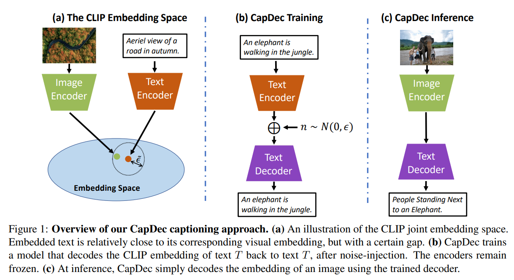
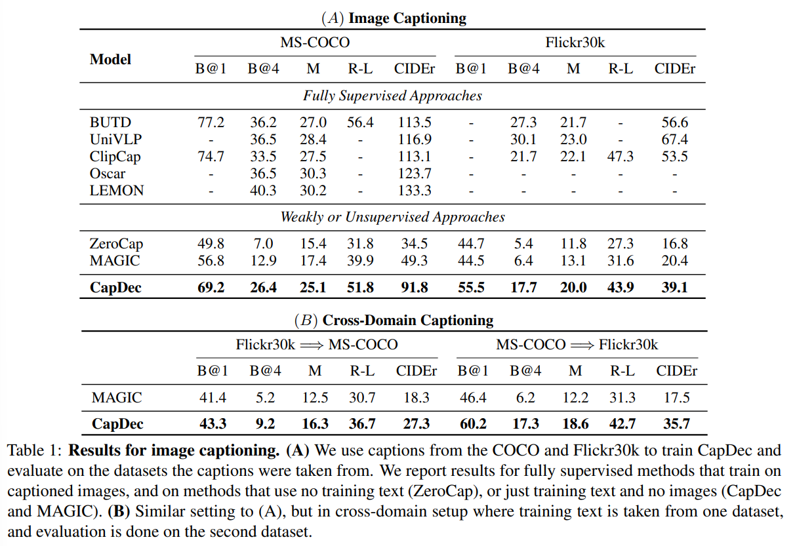
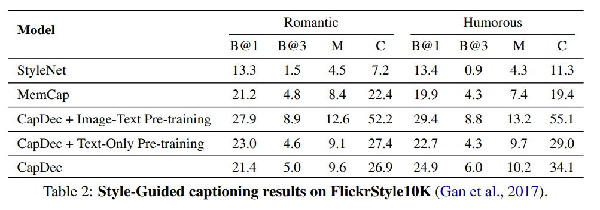
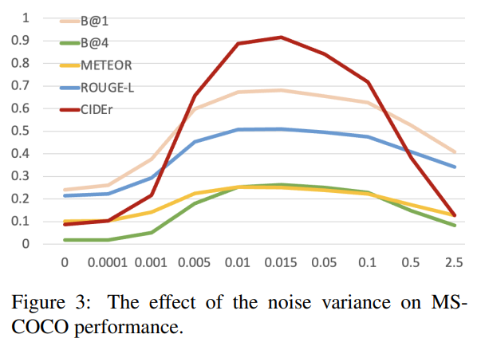
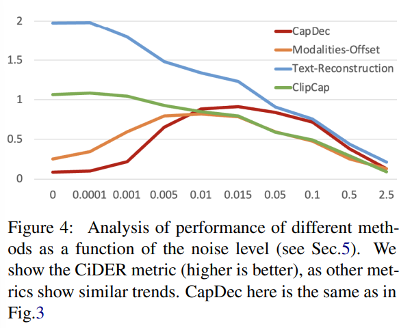

논문 및 이미지 출처 : <https://aclanthology.org/2022.findings-emnlp.299.pdf>

# Abstract

본 연구는 CLIP model 과 additional text data 만을 사용하고, additional caption 이 포함된 image 없이 image-captioning task 를 수행하는 문제를 고려한다. 

저자의 접근 방식은 CLIP 이 visual embedding 과 textual embedding 을 유사하게 만들도록 training 된다는 사실에 기반한다. 따라서 CLIP textual embedding 을 text 로 다시 변환하는 방법만 학습하면 되고, 이는 text 만을 사용하여 frozen CLIP text encoder 를 위한 decoder 를 학습함으로써 달성될 수 있다. 

저자는 이러한 직관이 embedding space 간의 gap 때문에 “거의 정확하다” 라고 주장하며, training 과정에서 noise injection 을 통해 이를 보정할 것을 제안한다. 

저자는 네 가지 benchmark 에서 style transfer 를 포함한 SOTA zero-shot image captioning 결과를 제시함으로써 저자의 접근 방식의 효과성을 입증한다.

# 1 Introduction

Vision 과 language 는 세계를 서술하는 두 가지 방식이기 때문에 서로 밀접하게 얽혀 있다. 이는 image 와 text 를 shared semantic space 로 사상하는 model 을 개발할 수 있는 가능성을 제기한다. 실제로 이러한 접근법은 CLIP 과 ALIGN 같은 model 들을 통해 최근 큰 성공을 거두었다. 이들 model 은 image-text *parallel* data 를 사용해 joint representation 을 학습하며, 여기서 image-text pair 의 embedding 은 서로 유사하다. 이러한 model 들은 다양한 vision-language task 에 활용되어 왔다.

Image captioning 은 vision-language perception 에서 핵심적인 task 이다. 그러나 image captioning model 을 training 하려면 일반적으로 대규모 caption 이 달린 image dataset 이 필요하며, 이를 수집하는 것은 쉽지 않다. 더 나아가, pretrained vision-language model 을 새로운 스타일의 caption 을 생성하도록 어떻게 적응시킬 수 있는지도 명확하지 않다. 

본 연구에서는 CLIP 과 text data 만을 필요로 하고, 특정 스타일에서 온 unpaired textual example 만을 사용하여 styled caption 을 생성하는 captioning 접근법을 제시한다. 이는 paired text-image data 의 필요성을 줄여 주며, 간단한 style transfer 도 가능하게 한다.

* 이 설정에서 고려해 볼 수 있는 첫 번째 접근법은 decoder model 을 training 하여 CLIP embedding 으로부터 해당 text 를 복원하도록 한 뒤, inference 시에는 이 decoder 를 사용해 image embedding 을 decode 하는 것이다. 
  * 그러나 저자는 이 접근법이 inference 시 실패한다는 것을 관찰했으며, 이는 image 와 text modality 사이에 존재하는 well-known domain gap 때문이라고 추측한다. 
* 저자는 이를 완화하기 위한 간단한 접근법으로, training 중 embedding 에 noise 를 주입하는 방법을 제안한다. 
  * 이는 embedding space 안에서 동일한 caption 으로 사상되는 ball 을 형성하는 효과를 가지며, Fig. 1.a 에서 묘사된 것처럼, 대응되는 image embedding 이 이 ball 내부에 포함될 가능성을 더 높여 준다.

저자는 **“Captioning via Decoding” (CapDec)** 방법을 다양한 image captioning task 에 대해 광범위하게 평가하며, standard, cross-domain, style-guided captioning 을 포함한 여러 task 에서 CapDec 이 잘 동작함을 보인다. 전반적으로 저자의 주요 기여는 다음과 같다.

1. CLIP 과 추가적인 text training data 에 기반하면서도 training 시 image 가 전혀 필요하지 않은 captioning model 을 학습하는 간단하고 직관적인 접근법을 제안한다.
2. 다양한 스타일의 caption 을 생성하는 image captioning task 에 대한 CapDec 의 평가를 통해, 동일한 supervision 을 사용하는 다른 방법들보다 우수한 성능을 보인다는 것을 입증한다.

# 2 Related Work

Image captioning 방법들은 일반적으로 pre-trained network 를 사용해 visual feature 를 추출한다. 이러한 feature 는 textual decoder 로 전달되어 최종 caption 을 생성한다. Vision 과 language 사이의 gap 을 줄이기 위해, 다른 연구들은 vision 과 text 의 shared latent space 를 구성하기 위한 pre-training 을 활용한다. 그러나 이러한 접근법들은 모두 large-scale paired dataset 과 광범위한 training 을 필요로 하며, 이는 수집이 어렵다. Gan et al. (2017) 과 Zhao et al. (2020) 은 style-guided captioning 을 제안했지만, 이 역시 paired data 위에서 training 을 수행한다.

CLIP 은 vision-language perception 에 전환점을 마련했으며, 다양한 distillation technique 을 통해 vision 관련 task 에 활용되어 왔다. 최근 captioning 방법들은 CLIP 을 training 시간 감소, caption 품질 향상, zero-shot setting 등에 활용한다. 그러나 zero-shot 기법들은 종종 성능이 떨어지는데, 생성된 caption 이 dataset 이 규정하는 target style 과 호환되지 않기 때문이다.

본 연구는 새로운 setting 을 제안하며, 오직 textual data 만을 사용하여 CLIP 을 image captioning 에 맞게 adapt 한다. 그 결과, 특정 스타일의 text 예시만 주어지면 caption 을 원하는 caption style 로 쉽게 적응시킬 수 있다. 

* Su et al. (2022) 의 동시 연구는 CLIP-induced score 를 inference 에 활용하여 text-only pre-training 만으로 높은 품질의 caption 을 효율적으로 생성한다. 
  * 저자의 접근 방식은 이보다 더 간단하며, Su et al. (2022) 보다 경험적으로 우수한 성능을 보인다. 
* 한편, Zhou et al. (2021) 역시 noise-injection 을 활용했지만, 이는 CLIP 기반 text-free text-to-image generation 이라는 정반대 문제를 위한 것이다.

# 3 Method

#### Text-Only Training

본 연구의 목표는 주어진 image $I$ 에 대해 caption 을 생성하는 model 을 학습하는 것이다. Supervised 접근법과 달리, 저자는 training 동안 text set $\mathcal{T}$ 만을 사용할 수 있다고 가정한다. 이러한 text 는 text corpus 로부터 수집될 수 있다. 

다음으로 CLIP model 을 위한 notation 을 소개한다. 

* Image $I$ 가 주어지면 그 embedding 을 $\phi(I) \in \mathbb{R}^d$ 로 두고, text $T$ 가 주어지면 그 embedding 을 $\psi(T) \in \mathbb{R}^d$ 로 둔다. 
* Vector $v \in \mathbb{R}^d$ 를 caption 으로 변환하기 위해 저자는 lightweight mapping network 와 pretrained auto-regressive language model 로 구성된 textual decoder $C(v)$ 를 사용한다. 
  * 이는 ClipCap 이 제안한 구조를 따른다.

저자는 다음과 같이 decoder 를 training 한다 (아래에서 소개할 noise-injection 제외). 

* 각 text $T \in T$ 를 CLIP space 에서 $\psi(T)$ 로 사상하고, 이를 다시 $C(\psi(T))$ 를 통해 text 로 decode 한다. 
* 이 decoding 은 original text $T$ 와 유사해야 한다. 즉, training objective 는 CLIP 의 textual embedding 으로부터 input text 를 reconstruction 하는 것이다. 
* Inference 시에는 image $I$ 가 주어지면 단순히 decoder 를 $\phi(I)$ 에 적용하여 caption $C(\phi(I))$ 을 반환한다.

#### Noise-Injected CLIP Embeddings

저자는 위 training scheme 이 inference 시 부정확한 caption 을 산출한다는 것을 관찰하였다. 이는 text 와 image modality 의 embedding 사이에 domain gap 이 존재하기 때문이라고 추측한다. 그 결과, training 중에는 text reconstruction 이 성공하지만 inference 에서는 image embedding 사용 시 실패한다. Image-text pair 가 있다면 이러한 domain 간 mapping 을 학습할 수 있지만, 본 연구는 text-only training 을 목표로 하기 때문에 다른 접근이 필요하다.

구체적으로, 저자는 text embedding 과 대응되는 visual embedding 이 text embedding 을 중심으로 하는 small raduius $\epsilon$ 의 ball 내부 어딘가에 위치한다고 가정한다 (Fig. 1 참고). 

* 저자는 이 ball 내부의 모든 text embedding 이 동일한 caption 으로 decode 되기를 원하며, 이는 해당 ball 로 사상되는 visual content 와도 일치해야 한다. 
* 이를 구현하기 위해 저자는 text embedding 에 decoding 전에 평균이 zero 인 Gaussian noise (표준편차 $\epsilon$) 를 더한다.

$\epsilon$ 값은 동일한 image 에 대응하는 caption 들의 embedding spread 를 추정하여 계산한다. 

* 구체적으로, 저자는 동일한 image 에 대응하는 다섯 개 caption 사이의 embedding difference 의 평균 $\ell_\infty$ norm 을 $\epsilon$ 으로 설정한다. 
* 이는 15 개 MS-COCO image 의 caption 으로부터 추정되었으며, caption 이 매우 적게 필요하고 새로운 dataset 마다 다시 계산할 필요가 없기 때문에 추가적인 supervision 으로 보지 않는다.

최종 training objective 는 다음을 최소화하는 것이다:

$$
\sum_{T \in \mathcal{T}} \ell \big( C(\psi(T) + n),, T \big),
$$

* 여기서 $n \in \mathbb{R}^d$ 는 표준편차 $\epsilon$ 인 zero-mean Gaussian noise, 
* $\ell$ 은 text $T$ 의 모든 token 에 대한 auto-regressive cross-entropy loss 이다. 

저자는 textual decoder $C$ 의 parameter 만을 training 하며 encoder $\psi()$ 는 frozen 상태로 유지한다. Noise 는 encoder 를 적용할 때마다 독립적으로 sampling 된다.

# 4 Results

다음으로 CapDec 을 여러 captioning task 에 대해 평가하며, state-of-the-art 결과를 보인다는 것을 보인다.

#### Image Captioning

저자는 Tab. 1(A) 에 제시된 바와 같이, 서로 다른 supervision level 을 갖는 여러 baseline 과 CapDec 의 caption 품질을 비교한다. 

* 여기서 모든 방법은 동일한 dataset 에 대해 training 및 evaluation 을 수행하며, 일반적으로 사용되는 MS-COCO 와 Flickr30k 를 사용한다. 
* 먼저 fully supervised 기법들인 BUTD, UniVLP, ClipCap, Oscar, Lemon 을 평가한다. 
---
* 예상대로, 이 방법들은 image-text pair 에 대한 추가 supervision 을 활용하기 때문에 CapDec 보다 더 높은 점수를 얻는다. 
* 그럼에도 불구하고, MAGIC 과 ZeroCap 같은 unsupervised 접근법과 비교하면, CapDec 이 더 우수한 score 를 달성한다. 
* ZeroCap 은 어떠한 training data 도 필요로 하지 않는 반면, MAGIC 은 저자의 setting 과 유사하게 text data 를 필요로 한다는 점에 유의한다.

#### Cross-Domain Captioning

저자는 Su et al. (2022) 과 같이, 한 dataset 에서 training 하고 다른 dataset 에서 평가하는 방식으로 generalization ability 를 테스트한다. 

* Tab. 1(B) 에서 볼 수 있듯이, 동일한 supervision 을 사용하는 MAGIC 보다 CapDec 이 더 우수한 성능을 보인다.

#### Style-Guided Captioning

여러 연구는 “romantic”, “humorous” 와 같은 새로운 style 로 captioning model 을 adapt 하는 task 를 다루어 왔다. 각 style 에 대해 paired example 을 수집하는 데는 큰 노력이 필요하기 때문에, 이러한 연구들은 새로운 style 이 text 에 의해서만 학습되는 setting 을 고려한다. 

저자의 setting 에서는 decoder 를 임의의 style text 로 training 하면 되므로 이것이 매우 간단하다. Fig. 2 는 동일한 image 에 대해 CapDec 이 여러 style (Zhao et al. 과 동일한 setting 및 data) 로 생성한 caption 을 보여 준다. 

Tab. 2 는 이 setting 에 대한 정량적 결과를 보고하며, CapDec 이 다른 baseline 보다 우수함을 보여 준다.

* 저자는 접근법을 더 분석하기 위해, pre-training 없이 (즉, style 이 있는 data 로만 training), COCO 에 대한 text-only pre-training, 그리고 COCO 에 대한 text-image pre-training (Zhao et al. 와 유사) 을 적용한 결과를 함께 제시한다. 
* 이들 결과에서 볼 수 있듯이, 저자는 pre-training 에서 훨씬 적은 supervision 을 사용하고도 Zhao et al. 보다 더 나은 성능을 낸다. 
* 또한 두 가지 다른 variation 모두 결과를 향상시키며, 이는 CapDec 이 추가 training data 를 사용할 수 있을 때 이를 효과적으로 활용할 수 있음을 보여 준다.

#### The Effect of Noise Level

CapDec 의 핵심 요소 중 하나는 decoding 이전의 noise injection 이다. Noise 의 효과를 보여 주기 위해, 저자는 Fig. 3 에 noise variance $\epsilon^2$ 의 함수로 결과를 보고한다. 

* 너무 작은 noise 나 너무 큰 noise 모두 suboptimal 하다는 것을 확인할 수 있다. 
* 저자가 선택한 noise variance $\epsilon^2 = 0.016,^1$ 는 Fig. 3 의 결과를 기반으로 한 것이 아니라 오직 text 에 근거한 값이라는 점을 언급한다. 
* Fig. 3 의 결과는 분석 목적으로만 제시된다.

# 5 Noise Injection Analysis

Noise-injection 은 generalization 을 향상시키는 well-known technique 이며, data augmentation mechanism 으로도 해석될 수 있다. 

본 연구에서는 noise 의 사용이 Liang et al. 에서 관찰된 modality-gap 을 해결하기 위한 목적도 있었다. Noise 의 구체적인 효과를 분석하기 위해, 저자는 COCO 에 대해 추가 평가를 수행하고 Fig. 4 에 결과를 제시한다.

#### Text-Reconstruction

COCO caption 을 CLIP text embedding 으로 encoding 한 뒤, 학습된 CapDec model 을 사용해 이를 decoding 한다. 이는 image 를 전혀 포함하지 않으며, noise injection 이 단순히 text auto-encoding 을 위한 regularization 역할만 하는지 확인하기 위한 실험이다. 

Fig. 4 는 noise 를 추가해도 도움이 되지 않음을 보여 주며, noise 가 augmentation 으로만 기능하는 것이 아님을 시사한다.

#### ClipCap

ClipCap 은 joint text-image pair 로 training 된다. 여기서는 ClipCap 을 training 할 때 image embedding 에 noise 를 추가하여 학습시켰다. 

그 결과 noise 가 성능을 향상시키지 않으며, 이는 noise 의 개선 효과가 domain-gap correction 이라는 특정 역할 때문임을 다시 시사한다.

#### Modalities Offset

충분한 paired training data 가 있다면 modality-gap 을 학습하여 보정할 수 있다. 본 연구에서는 paired data 없이 gap 을 근사하는 단순한 방법을 실험한다. 

COCO dataset 에서 text embedding 의 mean 과 image embedding 의 mean 간 shift 를 계산하고, image 가 주어지면 해당 shift 를 embedding 에 더해 gap 을 “보정”한 뒤 CapDec decoder 를 적용한다. 만약 이 mapping 이 완벽했다면 CapDec 은 noise injection 이 필요 없었을 것이다. 

Fig. 4 결과는 offset-correction 이 $\epsilon^2 < 0.01$ 에서는 CapDec 을 능가하지만 전체적으로는 뒤처진다는 것을 보여 준다. 이는 gap 이 완벽하게 추정되지 않았음을 의미하며, noise injection 이 여전히 이를 완화하는 데 도움을 준다는 점을 시사한다. 

저자는 modality-gap 을 명시적으로 학습하는 보다 복잡하거나 fully-supervised model 을 future work 로 남긴다.

# 6 Conclusion

Image captioning task 는 최근 몇 년간 광범위하게 연구되며 큰 발전을 이뤘다. 그러나 image-text pair 를 포함하는 training dataset 의 수는 여전히 제한적이다. 따라서 image captioning model 은 training data 의 편향이나 neutral style 에의 제한과 같은 한계를 그대로 이어받는다. 

본 연구는 generic vision-language model (e.g., CLIP) 을 text-only dataset 을 사용해 image captioning 으로 adapt 하는 새로운 paradigm 을 제안한다. 또한 저자는 CLIP 의 고유한 domain gap 을 극복하기 위한 간단하고 직관적인 technique 을 제시한다. Future work 로, visual question answering, visual scene graph generation 과 같은 다른 task 에 text-only training 을 적용하는 것을 계획한다.

# 7 Ethics Statement

Image captioning model 은 내부 편향으로 악명이 높으며, 이러한 편향은 보통 training data 로부터 그대로 유입된다. Text-only dataset 은 balanced 하게 구성하기가 text-image pair 를 모으는 것보다 훨씬 용이하다는 점에서, CapDec 은 이러한 편향을 완화하는 데 사용될 수 있다. 

예를 들어 snowboarding 남성 image 가 여성 image 보다 훨씬 많은 dataset 을 고려할 때, 더 많은 image 를 수집하는 것은 상당한 노력이 필요하지만 caption 에서 “man” 을 “woman” 으로 교체하는 것은 매우 간단하다. 따라서 저자의 text-only training 은 data 로부터 유입되는 특정 편향을 완화하는 데 기여할 수 있다.

# 8 Limitations

CapDec 은 training 에 text 만 사용하는 baseline 에 비해 우수한 성능을 보이지만, fully supervised baseline 에 비해서는 아직 뒤처진다는 점을 관찰한다. 

CLIP 이 latent space 에 rich semantics 를 포함하고 있다는 점을 고려할 때, text-only training 은 앞으로 supervised technique 과 거의 동일한 품질까지 더 향상될 수 있을 것이라 기대된다. 또한 CapDec 은 large English corpus 로 pre-trained 된 CLIP 과 language model 에 의존한다. 따라서 CapDec 의 능력을 다른 언어로 확장하는 것은 중요한 도전 과제로 남아 있다.

