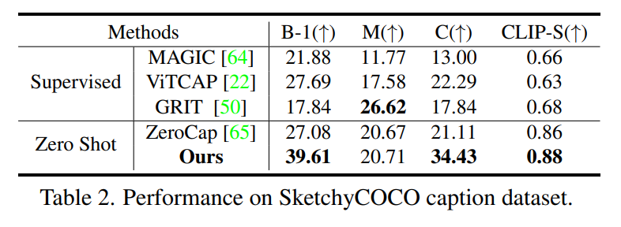
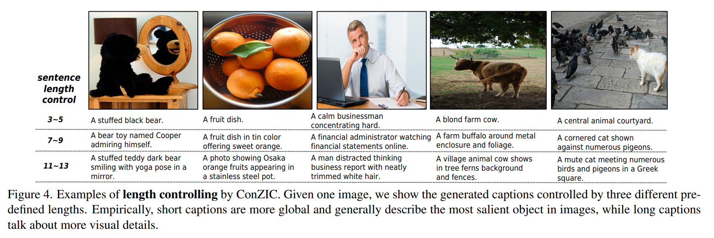
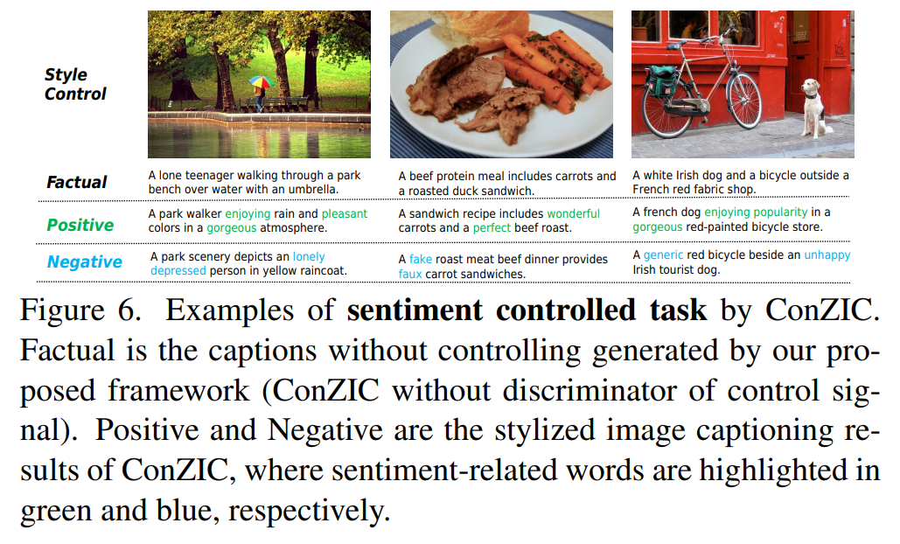
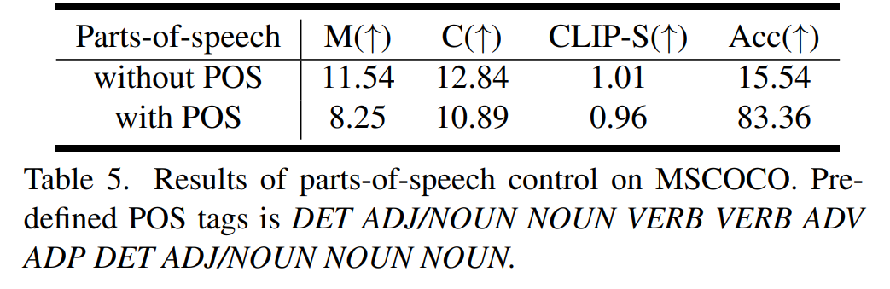
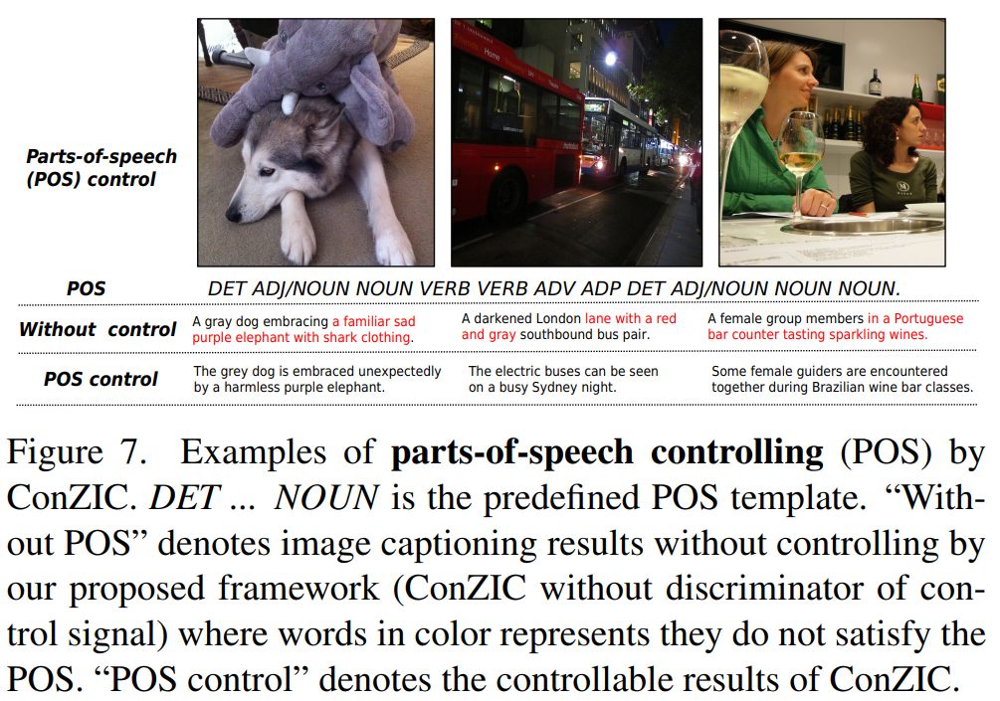

논문 및 이미지 출처 : <https://arxiv.org/pdf/2303.02437>

# Abstract

Zero-shot capability 는 curated training data 없이도 machine 이 task 를 수행할 수 있게 하는 것으로, deep learning 의 새로운 revolution 으로 간주되어 왔다. 좋은 출발점이자 zero-shot image captioning (IC) 의 현재까지 유일한 outcome 인 ZeroCap 은, supervised training 을 버리고 large-scale pre-trained model 의 knowledge 를 사용하여 caption 의 모든 단어를 sequential 하게 search 한다. 

effective 하지만, autoregressive generation 과 gradient-directed searching mechanism 은 각각 caption 의 diversity 와 inference speed 를 제한한다. 또한, ZeroCap 은 zero-shot IC 의 controllability issue 를 고려하지 않는다. 

이를 발전시키기 위해, 저자는 Controllable Zero-shot IC 를 위한 framework 인 **ConZIC** 을 제안한다. 

* ConZIC 의 core 는 *GibbsBERT* 라 불리는 새로운 sampling-based non-autoregressive language model 로, 모든 단어를 generate 하고 지속적으로 polish 할 수 있다. 
* 다양한 quantitative 및 qualitative result 는 zero-shot IC 와 controllable zero-shot IC 모두에서 저자가 제안한 ConZIC 의 우수한 performance 를 보여준다. 
* 특히, ConZIC 은 다양한 control signal 이 주어졌을 때도 정확한 generation 을 유지하면서 ZeroCap 보다 약 5× 더 빠른 generation speed 와 약 1.5× 더 높은 diversity score 를 달성한다. 

# 1. Introduction

Image captioning (IC) 은 visual-language task 로, image 를 coherent 한 sentence 로 자동으로 서술하는 것을 목표로 한다. MS-COCO 와 같은 human-annotated dataset 에 대해 supervised learning 을 수행함으로써, 많은 method 들은 BLEU, METEOR, CIDERr, SPICE 와 같은 metric 에서 인상적인 evaluation score 를 달성해 왔다. 그러나 이러한 method 들은 여전히 zero-shot IC 에서의 human capability 에 비해 뒤처진다.

구체적으로, 이러한 supervised method 들은 잘 설계된 image-caption pair 에 극도로 의존한다. 그러나 다양한 style 과 content 를 포괄하는 high-quality caption 과 paired image 를 포함하는, 충분히 큰 dataset 을 구성하는 것은 사실상 불가능하다. 그 결과, 실제 application 에서 흔히 나타나는, training distribution 관점에서 outlier 인 image 들에 대해 machine 이 caption 을 생성하는 것은 어렵다 (예시는 Fig. 1a 참조). 반면, human 은 어떠한 specific training 없이도 IC 를 수행할 수 있는데, 즉 zero-shot IC 를 실현한다. 이는 human 이, 보는 것(즉 image) 과 알고 있는 것(즉 knowledge) 을 통합할 수 있기 때문이다.

최근 large-scale pretraining model 들은 super-large-scale data 로부터 knowledge 를 학습하는 강력한 capability 를 보이며, 다양한 downstream task 에서 큰 potential 을 보여주고 있다. CLIP 이 학습한 visual-language knowledge 와 GPT-2 의 linguistic knowledge 를 함께 활용하여, ZeroCap 은 첫 번째이자 현재까지 유일한 zero-shot IC method 로, searching-based strategy 를 제안하며 추가 supervised data 에 대한 training 이 필요 없다. 구체적으로, ZeroCap 은 CLIP 에 의해 유도된 image-text matching score 와 caption fluency 를 위한 GPT-2 word distribution 의 guidance 를 받아, caption 의 단어를 왼쪽에서 오른쪽으로, 한 단어씩 search 한다. ZeroCap 은 좋은 출발점이며, optimal caption 을 더 나은 방식으로 search 하는 방법을 탐구하도록 저자에게 영감을 준다.

저자는 ZeroCap 이 다음과 같은 측면에서 더 나아질 수 있다고 본다.

* **More flexible.** ZeroCap 은 GPT-2 를 이용하여 left-to-right autoregressive generation 을 수행한다. 한 번 단어가 결정되면, 다음 position 으로 이동할 때 그 단어를 수정할 수 있는 기회가 없다. 다시 말해, 이러한 generation order 는 전체 context 정보를 충분히 고려하기에 충분히 flexible 하지 못하다.
* **More efficient.** 각 position 에서의 searching 은 GPT-2 의 parameter 를 반복적으로 update 하는 방식으로 구현되는데, Fig. 3c 에서 보이듯이 이는 time-consuming 하다.
* **More diverse.** IC 는 open problem 이다. 하나의 image 에 대해서도 사람마다 서로 다른 visual attention 과 language describing style 을 가질 수 있으며, 그 결과로 다양한 description 이 나온다. ZeroCap 은 여러 개의 candidate sentence 를 생성하기 위해 beam search 를 사용하지만, 이들은 유사한 syntactic pattern 을 갖는 경향이 있다 (Appendix 참조).
* **More controllable.** captioning model 에 human 과 유사한 controllability (예: sentiment, personality 등) 를 부여하기 위해, 최근 많은 연구는 생성되는 caption 의 constraint 로 작용하는 추가 control signal 을 도입하는 Controllable IC 에 주목하고 있다. 그러나 controllable zero-shot IC 는 아직 탐구되지 않았다.

이러한 네 가지 측면의 concern 을 모두 고려하여, 저자는 Fig. 2 에 나타낸 것처럼 controllable zero-shot IC 를 위한 새로운 framework 인 ConZIC 을 제안한다. 

* 구체적으로, 저자는 Gibbs sampling 과 masked language model (MLM, 현재는 BERT 를 사용) 사이의 관계를 분석한 뒤, sampling-based search 를 통해 zero-shot IC 를 실현하기 위한 새로운 language model (LM) 인 Gibbs-BERT 를 먼저 개발한다. 
* autoregressive model 과 비교했을 때, Gibbs-BERT 는 더 flexible 한 generation order 를 가지며, bidirectional attention 을 통해 self-correct capability 를 가지면서도, 더 빠르고 더 diverse 한 generation 을 가능하게 한다. 
* 여기에 image 와 text 사이의 similarity 를 평가하는 CLIP 을 결합함으로써, 저자가 제안하는 framework 는 zero-shot IC 를 수행할 수 있다. 
* 더 나아가, control signal 을 위한 task-specific discriminator 를 framework 에 도입함으로써, 저자의 framework 는 controllable zero-shot IC 도 수행할 수 있다.

이 논문의 주요 contribution 은 다음과 같다.

* 저자는 controllable zero-shot IC task 를 polishing 방식으로 해결할 것을 제안한다. Gibbs sampling 과 MLM 을 결합함으로써, caption 을 random 하게 초기화한 후, caption 내의 전체 context (bidirectional information) 를 기반으로 각 단어를 순차적으로 polish 할 수 있다.
* ConZIC 은 parameter update 가 필요 없으며, SOTA method 인 ZeroCap 보다 약 5× 더 빠른 generation speed 를 달성한다.
* Gibbs-BERT 를 탑재한 ConZIC 은 flexible 한 searching 을 수행할 수 있어, Tab. 1 에서 보이듯이 더 높은 diversity 를 가지는 sentence 를 생성한다.
* 저자의 알기로, ConZIC 은 최초의 controllable zero-shot IC method 이다. length, infilling, styles, parts-of-speech 를 포함하는 네 가지 class 의 controllable signal 이 실험에서 평가된다.

# 2. Related work

## 2.1. Supervised Image captioning

input image 가 주어졌을 때 text description 을 생성하기 위해, 전통적인 image captioning (IC) 은 종종 curated 된 image-caption pair 에 의존하여 encoder-decoder model 을 training 한다. 예를 들어, 일부 early attempt 들은 CNN 기반 encoder 를 구성하여 visual feature 를 추출하고, RNN/LSTM 기반 decoder 로 output sentence 를 생성한다. 

더 나은 visual understanding 을 위해, 몇몇 method 는 object detector 를 사용하여 attentive 한 image region 을 추출한다. 두 modality 간의 상호작용을 더 강화하기 위해, attention mechanism 과 graph neural network 가 널리 사용되어 왔다.

최근 일련의 large-scale visual-language pretraining model 들이 구축되었으며, 다양한 downstream task 에서, IC 를 포함하여, 뛰어난 performance 를 보여준다. 이러한 pre-trained model 을 탑재한 method 들은 SOTA performance 를 보여준다. 그러나 이러한 method 들 역시 MS-COCO 와 같은 human-annotated dataset 에 대해 supervised fine-tuning 이 필요하다.

## 2.2. Zero-shot Image Captioning

large-scale pretrained model 의 zero-shot capability 는 computer vision 과 natural language processing 의 광범위한 research field 에서 많은 관심을 받으며, supervised training data 없이도 task 로 knowledge 를 transfer 할 수 있는 큰 potential 을 보여준다. 그러나 IC 에 대해서는, zero-shot ability 가 충분히 탐구되지 않았다. 

저자의 알기로, 유일한 성과는 Tewel et al. 이 제안한 ZeroCap 이다. 추가로, 여러 접근법들은 external unsupervised data 나 object tagger 를 결합하여, paired image-sentence training data 에 존재하지 않는 novel object 를 서술하는 task 를 다루며, 이를 novel object image captioning (NOIC) 이라고 부른다. 일부 경우에는 NOIC 를 zero-shot IC 라고 부르기도 하지만, 이는 본 논문에서 다루는 것과는 매우 다르다. 자세한 비교는 Appendix A 에 제시된다.

구체적으로, ZeroCap 은 pre-trained GPT-2 를 사용한다. 그리고 각 position 에서의 generation 을 위해, inference stage 에서 CLIP 이 측정하는 image-text matching loss 를 최소화함으로써 context cache 를 update 한다. 주목할 점은, CLIP 이 human-annotated IC dataset 이 아니라 자동으로 수집된 noisy web-scale dataset 에 대해 training 된 visual-language pretraining model 이라는 것이다. 

그 결과, ZeroCap 은 training 없이 gradient-directed searching 을 통해 zero-shot IC 를 실현한다. 그러나 autoregressive 특성 때문에, 현재 position 의 단어를 search 할 때 왼쪽의 정보만 고려하고 전체 context 는 고려하지 못한다. 게다가 autoregressive 특성은 mode collapse problem 을 야기하기 쉽고, 그 결과 caption 의 diversity 가 떨어진다. 더 나아가, iterative gradient-update 의 time-cost 는 특히 긴 caption 에 대해 매우 크다. 또한 ZeroCap 은 controllable zero-shot IC task 에 대해서는 고려되지 않았다.

## 2.3. Diversity and Controllability

Diversity 와 controllability 는 이전 IC 연구들에서 많은 관심을 받아온 두 가지 중요한 property 이다.

최근 연구에 따르면, supervised method 가 생성한 caption 은 “average” caption 에 편향되는 경향이 있으며, 이는 training corpus 에서 가장 일반적인 linguistic pattern 과 단어를 포착하는, 소위 mode collapse problem 으로 이어진다. 다시 말해, 의미론적 관점에서 “diversity” 는 다양한 단어를 의미하고, 통사론적 관점에서 “diversity” 는 풍부한 sentence pattern 을 의미한다. supervised data 의 limitation 없이 CLIP 의 knowledge 를 사용하는 ZeroCap 은, 생성된 caption 의 vocabulary size 를 증가시킨다. 그럼에도 불구하고, autoregressive nature 로 인해, 주어진 image 에 대해 생성되는 candidate sentence 들은 종종 유사한 syntactic pattern 을 갖는 현상이 나타나며, 즉 syntactical diversity 가 낮다.

human 의 controllability 를 모방하기 위해, 많은 연구가 control signal 을 supervised training process 에 도입하여 caption generation 을 control 하는 데 초점을 맞추어 왔다. 예를 들어, sentiment, emotion, personality 와 같은 subjective signal 이나, length level, parts-of-speech, object region, visual relation 과 같은 objective signal 들이 사용된다. 그러나 training 없이 control signal 을 도입하여 controllable zero-shot IC 를 실현하는 방법은 아직 탐구되지 않았다.

# 3. Method

## 3.1. Framework of ConZIC

image $I$ 가 주어졌을 때, zero-shot image captioning (IC) 의 목표는 supervised database 에 대한 training 없이, $n$ 개의 단어를 포함하는 linguistic description $x_{<1,n>}$ 을 생성하는 것이다. 이 과정은 data likelihood $p(x_{<1,n>} \mid I)$ 를 최대화하는 $x_{<1,n>}$ 을 search 하는 문제로 formalize 할 수 있다.

control signal $C$ 의 영향을 추가로 고려하면, controllable zero-shot IC 는 $p(x_{<1,n>} \mid I, C)$ 를 최대화하는 $x_{<1,n>}$ 을 search 하는 데 초점을 맞춘다. Bayes rule 에 따르면, log data likelihood 는 다음과 같이 쓸 수 있다:

$$
\begin{aligned}
    &\log p(x_{<1,n>} \mid I, C) \\
    \propto &\log p(x_{<1,n>}, I, C) \\
    = &\log p(I \mid x_{<1,n>}) + \log p(C \mid x_{<1,n>}) + \log p(x_{<1,n>}),
\end{aligned} \tag{1}
$$

이는 각각 세 개의 module 로 구현되는, searching process 를 안내하는 세 가지 기본 rule 을 내포한다. 구체적으로,

* i) language model (LM) 은 $p(x_{<1,n>})$ 를 평가하여, fluency 가 높은 caption 을 search 하는 데 도움을 준다.
* ii) matching network 는 입력 image 와 생성된 caption 의 similarity, 즉 $p(I \mid x_{<1,n>})$ 를 측정하여, 입력 image 와 강하게 관련된 caption 을 search 하는 데 도움을 준다.
* iii) discriminator 는 $p(C \mid x_{<1,n>})$ 를 측정하여, 주어진 control signal 을 만족하는 caption 을 search 하는 데 도움을 준다.

이 세 module 이 저자가 제안하는 controllable zero-shot IC framework 인 ConZIC 을 구성하며, 이후 subsection 에서 더 자세히 소개한다. ConZIC 은 각 position 의 단어를 iterative 하게 polishing 하는 방식으로 controllable zero-shot IC 문제를 해결하고자 한다.

## 3.2. Sampling-based language model for $p(x_{<1,n>})$

$p(x_{<1,n>})$ 를 model 하기 위해, 기존 IC method (zero-shot 및 supervised method 모두 포함) 들은 종종 다음과 같은 sequential autoregressive generation 을 채택한다:

$$
p(x_{<1,n>}) = p(x_n \mid x_{<n}) \cdots p(x_2 \mid x_1)p(x_1). \tag{2}
$$

그러나 이러한 autoregressive generation 은 sequential error accumulation 과 diversity 부족과 같은 문제를 야기하는 경우가 많다. 더 나아가, zero-shot IC 의 경우 sequential searching-order 가 충분히 flexible 하지 않다. 보다 자세한 논의는 관련 연구 부분에서 다룬다. 이를 넘어가기 위해, 저자는 Gibbs sampling 과 masked language model (MLM) 의 설계 사이의 관계에 대한 분석에서 영감을 받아, $p(x_{<1,n>})$ 을 위한 sampling-based LM 을 개발한다.

구체적으로, Gibbs sampling 은 Markov chain Monte Carlo (MCMC) algorithm 으로, joint data distribution $p(x_{<1,n>})$ 에서 sample 을 수집하는 것을 목표로 하며, 각 variable $x_i$ (여기서는 단어) 를, $x_i$ 를 제외한 모든 random variable 을 의미하는 $x_{-i}$ 에 대한 conditional probability $p(x_i \mid x_{-i})$ 로부터 iterative 하게 sampling 한다. 실제로 Gibbs sampling 은 다음과 같은 flexible 한 sampling order 를 가진다:

$$
\begin{aligned}
    &p(x_n \mid x_{-n}) \rightarrow p(x_{n-1} \mid x_{-(n-1)}) \rightarrow \cdots \rightarrow p(x_1 \mid x_{-1}) \\
    &p(x_1 \mid x_{-1}) \rightarrow p(x_2 \mid x_{-2}) \rightarrow \cdots \rightarrow p(x_n \mid x_{-n}) \\
    &p(x_t \mid x_{-t}) \rightarrow \cdots \rightarrow p(x_j \mid x_{-j}).
\end{aligned}
\tag{3}
$$

이와 같은 flexible 한 order 는, IC 에서 diversity 부족의 핵심 문제인 collapsed mode 로부터 벗어날 수 있는 능력을 Gibbs sampling 에 부여하여, 더 diverse 한 generation 을 가능하게 한다.

Eq. (3) 을 다른 관점에서 보면, 각 항은 MLM 의 학습과 연결된다. 구체적으로, 하나의 sentence 가 주어졌을 때, MLM 은 몇몇 단어를 $x_M$ 으로 표시되는 [MASK] 로 설정하고, 나머지 단어 $x_{-M}$ 을 사용해 이 masked 된 단어들을 예측한다. 수학적으로, MLM 의 target 은 corpus 로부터 conditional distribution $p(x_M \mid x_{-M})$ 을 학습하는 것이다. 따라서 $i$-th word $x_i$ 만 [MASK] 로 설정하면, MLM 과 Gibbs sampling 은 모두 $p(x_i \mid x_{-i})$ 를 예측한다는 점에서 동등하다.

현재 저자는 MLM 으로 BERT 를 사용하며, 따라서 $p(x_{<1,n>})$ 을 model 하기 위한 이 새로운 LM 을 Gibbs-BERT 라고 부른다.

Gibbs-BERT 가 $p(x_{<1,n>})$ 으로부터 sentence $x_{<1,n>}$ 을 sampling 하는 구체적인 algorithm 은 Appendix B 의 Algorithm 2 에 제시된다. generation order 를 random 하게 선택한 뒤, Gibbs-BERT 는 (예: 모든 token 이 [MASK] 인) 완전히 noisy 한 sentence 로부터 시작한다. 각 iteration 에서, Gibbs-BERT 는 현재 position 에 [MASK] 를 두고, BERT 가 예측한 vocabulary 상의 word distribution 에서 top-1 단어를 선택하는 방식으로 각 단어를 순차적으로 sampling 한다. $t$-th iteration 의 결과는 $(t+1)$-th iteration 의 initialization 으로 사용된다.

## 3.3. Image-text matching network for $p(I \mid x_{<1,n>})$

생성된 caption 이 image 와 강하게 관련되도록 하기 위해, 저자의 framework 는 image 와 text 사이의 similarity 를 측정할 수 있는 matching network 가 필요하다. 최근 충분히 large-scale 한 image-text pair 로 pre-trained 된 CLIP 은, 이들의 similarity 를 측정하기 위한 풍부한 world knowledge 를 학습한다. 따라서 저자는 $p(I \mid x_{<1,n>})$ 을 model 하기 위해 pre-trained CLIP 을 framework 에 도입한다.

구체적으로, 각 단어를 $p(x_i \mid x_{-i}; I)$ 로 sampling 할 때, Gibbs-BERT 는 먼저 vocabulary 전체에 대한 자신의 predicted word distribution 에 따라 top-$K$ 개의 candidate word 를 제공한다. 그런 다음, $i$-th position 의 [MASK] token 을 이 $K$ 개의 candidate word 로 각각 교체하여, $K$ 개의 candidate sentence $\{ s_k = (x_1, \ldots, x_{ik}, \ldots, x_n) \}_{k=1}^K$ 를 만든다. 여기서 $x_{ik}$ 는 해당 position 에 들어가는 단어이고, 원래는 [MASK] 였다.

CLIP matching score $p(I \mid s_k)$ 는 $\text{CLIP}(s_k, I)$ 로 계산할 수 있으며, score 가 높을수록 image 와 text 가 더 잘 aligned 되어 있음을 의미한다. Softmax 를 사용하면, 이 $K$ 개 candidate word 에 대한 예측 분포를 다음과 같이 얻는다.

$$
p(I \mid \{ s_k \}_{k=1}^K) \propto \text{Softmax}[\text{CLIP}(s_k, I)]. \tag{4}
$$

Eq. (4) 에 따라, 저자는 가장 큰 확률을 갖는 top-1 word 를 $x_i$ 로 선택하여, 다른 단어들 $x_{-i}$ 와 함께 sentence 를 형성한다.

여기까지로, control signal 이 없는 경우에 대해 저자의 framework 는 이미 zero-shot IC 를 실현한다. 다음으로, controllable zero-shot IC 를 위해 control signal $C$ 의 discriminator $p(C \mid x_{<1,n>})$ 를 어떻게 통합하는지 소개한다.

## 3.4. Discriminator for control signal $p(C \mid x_{<1,n>})$

controllable IC 의 경우, image 와 주어진 control signal $C$ 모두와 관련된 text 를 생성해야 한다. sentiment 나 parts-of-speech (POS) 와 같은 일부 type 의 control signal 에 대해서는, caption 과 control signal 간의 상관성을 평가하기 위한 추가적인 discriminator $p(C \mid x_{<1,n>})$ 이 필요하다.

구체적으로, $p(I \mid x_{<1,n>})$ 에 대해 했던 것과 유사하게, Gibbs-BERT 가 top-$K$ 개의 sentence $s_k$ 를 선택한 뒤, pre-trained classifier 와 Softmax function 을 사용하여 $p(C \mid \{ s_k \}_{k=1}^K)$ 를 다음과 같이 model 한다.

$$
p(C \mid \{ s_k \}_{k=1}^K) \propto \text{Softmax}[\text{Classifier}(s_k)]. \tag{5}
$$

classifier 는 task 에 따라 달라지며, 이에 대한 자세한 내용은 실험 부분에서 설명한다.

## 3.5. Overall algorithm

controllable zero-shot IC 를 위한 framework 의 전체 algorithm 은 Algorithm 1 에 제시된다. 

* 먼저 caption 을 초기화해야 하며 (현재는 모든 token 을 [MASK] 로 사용하는 방법을 쓴다), 몇 가지 hyper-parameter 를 설정해야 한다. 
* 이전 iteration 의 output 에서 시작하여, 이번 iteration 의 각 position $i$ 에 대해 Gibbs-BERT 는 먼저 top-$K$ 개의 candidate word 를 제공하고, 이들로 다른 단어들과 함께 $K$ 개의 sentence $\{ s_k \}_{k=1}^K$ 를 형성한다.

그 다음, Eq. (4) 와 Eq. (5) 에 따라 text-image 와 text-control matching score 인 $p(I \mid x_{<1,n>})$ 과 $p(C \mid x_{<1,n>})$ 를 얻는다. 이러한 두 분포를 Gibbs-BERT 의 predicted distribution $p(x_i \mid x_{-i})$ 와 trade-off parameter $\{ \alpha, \beta, \gamma \}$ 로 결합하면, 최종 분포를 얻을 수 있고, 여기에서 가장 큰 확률을 갖는 단어를 $x_i$ 로 선택한다.

저자가 제안한 framework 에 대해 명확히 해야 할 점이 세 가지 있다.

* i) 항 $p(C \mid x_{<1,n>})$ 를 제거하면, 저자의 framework 는 control signal 이 없는 standard zero-shot IC 를 수행할 수 있다.
* ii) length control 과 같은 일부 controllable IC task 의 경우, $p(C \mid x_{<1,n>})$ 을 사용할 필요가 없으며, 이에 대한 세부 사항은 실험 부분에서 다룬다.
* iii) 저자의 framework 는 특정 module 에 종속되지 않는다. 향후 연구로, BERT 를 RoBERTa 로, CLIP 을 ALIGN 으로 교체하는 등 더 나은 pre-trained model 을 사용하면 ConZIC 의 performance 를 추가로 향상시킬 수 있는지를 탐구할 예정이다.

# 4. Experiments

## 4.1. Datasets

#### MSCOCO caption

MSCOCO caption 은 large IC dataset 이다. 저자는 이전 대부분의 work 에서 결과 보고에 널리 사용되어 온 ‘Karpathy’ split 을 사용한다. 이 split 은 training 및 validation 용 image 113,287 장과 testing 용 5,000 장을 포함한다. 각 image 는 5 개의 caption 을 가진다.

#### SentiCap

SentiCap 은 MSCOCO dataset 에서 개발된 sentiment IC dataset 이다. 각 image 는 3 개의 positive 및/또는 3 개의 negative sentiment caption 으로 label 된다. 그 결과, positive (negative) set 은 training (testing) 용 image 가 각각 998 (673) 장과 997 (503) 장을 포함한다.

#### FlickrStyle10k

FlickrStyle10k 은 stylized caption 을 가진 10,000 개의 Flickr image 를 포함하며, 이 중 7,000 개 image 만 public 이다. 각 image 는 factual (특정 style 이 없음), humorous, romantic style 에 대해 각각 5, 1, 1 개의 caption 을 가진다. 이에 따라, 저자는 선행 work 를 따라 이들 중 6,000 장과 1,000 장을 무작위로 선택하여 training set 과 testing set 을 구성한다.

#### SketchyCOCO caption

SketchyCOCO 는 3 개의 background class 와 14 개의 foreground class 를 포함하는 instance freehand sketch 를 수집하여 구성된다. 그러나 SketchyCOCO 는 classification label 만 존재하므로 IC 용 dataset 은 아니다. sketch-style image 에서의 IC performance 를 정량적으로 평가하기 위해, 저자는 다음 단계들을 통해 SketchyCOCO 기반의 작은 benchmark 를 구성한다.

* i) 각 foreground class 에 대해 sketch image 100 장을 무작위로 sampling 한다.
* ii) 이 image 들을 “A drawing of a [CLASS]” 와 같은 simple prompt 로 label 한다. 여기서 [CLASS] 는 class name 이다. 예를 들어, cat image 는 “A drawing of a cat.” 으로 label 된다. 더 자세한 내용은 Appendix C 에 기술된다.

## 4.2. Implementation Details

Sec. 3 에서 설명한 것처럼, 모든 experiment 는 fine-tuning 없이 frozen pre-trained model 에 기반하여 수행한다. 구체적으로, 저자는 image-text matching network 로 CLIP-ViT-B/32 를, LM 으로 BERT-Base 를 선택한다. 서로 다른 controllable IC task 에 대해서는, 해당 task 에 맞는 discriminator 를 선택하며, 이에 대한 세부 사항은 Sec. 4.4 에서 소개한다.

Sec. 4.3 에서는 먼저 control signal 없이 standard IC 에서의 performance 를 평가한다. 이후 Sec. 4.4 에서는 length, infilling, style, parts-of-speech (POS) 를 포함하는 4 가지 controllable IC task 에 대해 저자 method 의 controllability 를 탐구한다. 마지막으로 Sec. 4.5 에서는 generation speed 를 분석한다.

모든 experiment 에서 $K, T, \alpha, \beta$ 는 각각 200, 15, 0.02, 2 로 설정한다. MSCOCO caption 과 SketchyCOCO caption 에 대해서는 sentence length $n$ 을 각각 12 와 5 로 설정한다. stylized IC 및 POS controlled IC 의 경우, $\gamma$ 를 5 로 설정한다. 모든 experiment 는 단일 RTX3090 GPU 에서 수행된다.

## 4.3. Evaluation on Accuracy and Diversity

저자는 먼저 control 이 없는 standard IC task 를 기반으로 framework 의 accuracy 와 diversity 를 평가한다.

#### Evaluation Metrics

기존 method 들은 보통 accuracy 기반 metric 으로 IC performance 를 평가한다. 저자는 선행 work 를 따라 human reference 를 필요로 하는 supervised metric 인 BLEU-4 (B-4), METEOR (M), CIDEr (C), SPICE (S), 그리고 RefCLIPScore (RefCLIP-S) 를 사용한다. RefCLIPScore 는 reference 와 prediction 사이의 semantic similarity 를 측정한다.

또한 저자는 unsupervised metric 인 CLIPScore (CLIP-S) 도 사용한다. CLIPScore 는 reference 가 필요 없는 metric 으로, image 와 해당 caption 사이의 similarity 를 측정하며, zero-shot IC 에서 가장 중요한 metric 이다.

IC 의 또 다른 중요한 성능 지표는 생성된 caption 의 diversity 를 평가하는 것이다. 저자는 선행 work 를 따라 세 가지 metric, Vocab, Self-CIDEr (S-C), Div-n 을 사용한다. Vocab 은 testing set 에서 생성된 모든 caption 의 vocabulary size 로, 서로 다른 method 들의 word richness 를 반영한다. Self-CIDEr 와 Div-n 은 caption 간 pairwise similarity 에 기반한, 널리 사용되는 diversity metric 이다.

#### Quantitative Results

정량적 결과는 MSCOCO dataset 을 기반으로 한 Tab. 1 에 보고된다. 

* 명백하게도, ZeroCap 과 저자 방법을 포함한 zero-shot method (어떠한 fine-tuning 도 수행하지 않는) 들은 supervised metric 인 B-4, M, C, S 에서 다른 supervised method 들에 비해 성능이 떨어진다. 
  * 이는 supervised method 가 MSCOCO 에서 training 되었기 때문에, training 과 testing set 이 동일 annotator 에 의해 label 되고 유사한 caption style 을 갖는 domain bias 의 이점을 얻을 수 있기 때문에 자연스러운 결과이다. 
  * 그러나 앞서 논의했듯이, IC 는 정답이 고정된 task 가 아니다.
* 한편, 하나의 dataset 에 대해 training 또는 fine-tuning 을 수행하는 것은 model 이 training data 와 유사한 caption 을 생성하도록 돕지만, word vocabulary size 를 제한하여 생성된 caption 의 diversity 를 감소시키는 효과를 갖는다. 
  * 구체적으로, Diversity column 에 나타난 것처럼, diversity 향상에 초점을 맞춘 기존 supervised method 인 Div-BS, AG-CVAE, POS, ASG2Caption 과 비교하더라도, 저자 method 는 상당한 차이로 이들을 능가한다.
* 더 나아가, 저자 framework 는 semantic 관련 metric 인 RefCLIPScore 및 CLIPScore 에서 SOTA method 와 비슷하거나 더 우수한 performance 를 달성하며, 이는 저자 method 가 image 와 잘 매칭되는 caption 을 생성할 수 있음을 의미한다.

* 또한, Tab. 2 는 이전 SOTA method 와 비교하여 sketch-style image (SketchyCOCO caption dataset) 에서의 zero-shot 성능을 보고한다. 
* MSCOCO 에서 training 된 supervised method 들은 MSCOCO 와 SketchyCOCO 사이의 domain gap 때문에 대부분의 metric 에서 저자 framework 에 뒤처진다. 
* 동시에, 저자 method 는 또 다른 zero-shot method 인 ZeroCap 을 모든 metric 에서 능가한다.

#### Qualitative Results

Fig. 1 과 Fig. 2 에 나타난 것처럼, 저자 framework 는 더 많은 단어와 풍부한 sentence pattern 을 사용하여 정확하고 diverse 한 caption 을 생성한다. 더 많은 예시는 Appendix D 에 제시된다.

## 4.4. Evaluation on controllable IC tasks

저자는 4 가지 controllable task 를 고려한다.

첫 두 task, i.e., length 와 infilling 은 classifier-free 이고, 마지막 두 task, i.e., style 과 parts-of-speech 는 off-the-shelf classifier 에 의존한다.

각 control task 를 아래와 같이 상세히 설명한다.

#### Length

length controlling 은 caption 의 길이를 사전에 지정하는 것을 의미한다.

저자의 framework 인 ConZIC 이 length-control IC 를 수행할 때는, 추가 classifier 없이 caption 의 initial length 만 설정하면 된다. 이 실험은 MSCOCO 에서 수행한다. MSCOCO 에서 annotated caption 의 평균 sentence length 가 약 10 이라는 점을 고려하여, 저자는 4 가지 다른 length 를 시도한다: 5, 8, 12, 15.

qualitative result 는 Fig. 4 에 제시된다. 

* 경험적으로, 주어진 target length 에 대해 ConZIC 은 BERT 의 WordPiece 기반 tokenizer 때문으로 인해, 길이가 약 $\pm 2$ 범위 안에 드는 accurate 한 description 을 생성할 수 있다. 

* ConZIC 에서 iteration step 과 caption length 의 효과를 이해하기 위해, Fig. 3a 와 Fig. 3b 는 ZeroCap 을 baseline 으로 두고, iteration step 이 증가함에 따라 CLIPScore 와 RefCLIPScore 가 어떻게 변하는지 보여준다. 
* 이 두 score 는 iterative update 와 함께 증가하며, polishing mechanism 의 효과를 입증한다.

---

* Fig. 4 와 Fig. 3a 의 결과를 비교해 보면, 일반적으로 sentence 가 길수록 image 의 더 많은 detail 을 포함하게 되고, 이는 더 높은 CLIPScore 로 이어짐을 관찰할 수 있다. 
* RefCLIPScore 의 경우, Fig. 3b 에서 Length 12 와 Length 8 이 Length 5 와 Length 15 보다 더 좋은 유사한 성능을 보이는데, 이는 MSCOCO 에서 caption 의 평균 길이가 약 10 이고, RefCLIPScore 가 생성 caption 과 reference caption 사이의 similarity 를 평가하기 때문이라고 저자는 본다.

#### Infilling

human-annotated caption 에서 일부 단어가 비어 있을 때, infilling task 의 목표는 image content 에 조건을 두고 적절한 단어를 채우는 것이다. 

* Fig. 5 에서 보이듯이, 저자는 이 task 를 image content 뿐만 아니라 고정된 left / right context 에도 조건을 두고 text 를 생성해야 한다는 점에서, 특별한 controllable IC task 로 간주한다. 
* 기존의 대부분 IC model, 예를 들어 ZeroCap 은, 사용하는 autoregressive LM 이 left context 에만 기반해 단어를 생성할 수 있기 때문에 이 task 를 수행할 수 없다. 
* 반면, ConZIC 은 LM, 즉 Gibbs-BERT 가 bidirectional attention 에 기반해 model 되므로, classifier 없이 이 task 를 수행할 수 있다.

먼저, 단 하나의 단어만 결손된 setting 에 대해 정량적 실험을 수행한다. 

* 구체적으로, 저자는 MSCOCO reference caption 에서 무작위로 하나의 verb 또는 noun 을 masking 하고, ConZIC 이 이를 infill 하도록 요구한다. 
* 원래 단어를 ground truth 로 보고, accuracy 를 평가하기 위한 metric 으로 BLEU-1 (B-1) 을 사용한다. 

그러나 이 위치에 적합한 다른 단어도 많이 존재할 수 있으므로 (diversity), 저자는 예측 단어와 reference 단어 사이의 semantic similarity 를 측정하기 위해 두 가지 metric 을 사용한다: WordNet word similarity (WSim), BERT embedding cosine similarity (BSim). 

결과는 Tab. 3 에 제시되며, ConZIC 이 ZeroCap 보다 큰 차이로 우수한 성능을 보인다.

* 또한 Fig. 5 에서 보이듯이, 저자는 ConZIC 의 infilling 결과 예시를 제공한다. 
* 각 image 와 reference caption 에 대해, 무작위로 손상된 query 를 세 개 준비하고, ConZIC 에게 단어를 infill 하도록 요청한다. 더 많은 단어를 masking 했을 때의 결과는 Appendix E 를 참조한다.

#### Style

특정 linguistic style, e.g., positive, negative, romantic, humorous 가 주어진 image 에 대해, style-controlled task 의 목표는 이에 상응하는 description 을 생성하는 것이다. 이 task 에 대해 ConZIC 은 caption 의 style 을 구분하기 위한 pre-trained classifier 가 필요하다. 현재 저자는 sentiment (positive 또는 negative) control 을 위해 SentiwordNet 을 사용하고, romantic–humorous control 을 위해 TextCNN 을 사용한다.

먼저, 저자는 SentiCap dataset 에서 ConZIC 의 sentiment-controlled capability 를 평가한다. 정량적 결과는 Tab. 4 에 제시된다. 

* baseline 으로, StyleNet, MSCap, Memcap 은 supervised 방식으로 이 task 에서 SOTA performance 를 달성하며, 더 높은 B-3 와 M 을 보인다. 
* 이들을 따라, 저자는 생성된 caption 을 sentiment classifier 에 입력해 얻은 accuracy (Acc) 를 ConZIC 에 대해 측정하며, 이 값은 baseline 보다 높다.
* 더 나아가, 저자는 image 와 caption 사이의 correlation 을 평가하기 위해 CLIP-S 를 사용하며, 결과는 ConZIC 이 생성한 caption 이 image 와 강하게 관련되어 있음을 보여준다. 
* 세 baseline 은 public code 를 제공하지 않기 때문에, CLIP-S 에 대해 직접 평가할 수는 없고, 논문에서 보고된 나머지 세 metric 만 인용한다.

ConZIC 의 sentiment controlling 을 더 잘 시각화하기 위해, Fig. 1b, Fig. 2, Fig. 6 에 여러 결과를 보여준다. romantic–humorous style 에 대한 FlickStyle10k 결과와 분석은 Appendix E 에 있다.

#### Parts-of-speech (POS)

POS-control IC 의 task 는 주어진 POS tag 를 만족하는 caption 을 생성하는 것이다. 예를 들어, caption “a cat sitting in the bed” 의 POS 는
DET NOUN VERB ADP DET NOUN 이다. 이 task 에 대해 저자는 기존 work 에서 개발된 POS classifier 를 사용한다.

human 이 일반적으로 “somebody/something doing something at someplace” 와 같은 몇 가지 공통 template 아래에서 image 를 서술한다는 사실을 고려하여, 저자는 다음과 같은 POS tag sequence 를 설계한다:

DET ADJ/NOUN NOUN VERB VERB ADV ADP DET ADJ/NOUN NOUN NOUN.

이러한 template 하에서, ConZIC 의 결과를 Tab. 5 에 보고한다. 

* 분명히, 저자의 method 는 이 POS tag template 에 대해 높은 accuracy 를 달성한다. 그러나 모든 image 가 이 POS tag 에 적합한 것은 아니기 때문에, METEOR (M), CIDEr (C), CLIPScore (CLIP-S) 는 약간 낮아진다. Fig. 7 에서 몇 가지 예시도 시각화한다. 

## 4.5. Evaluation on generation speed

generation speed 는 zero-shot IC 에서 매우 중요하다. ZeroCap 과 ConZIC 에 대해, 경험적으로 저자는 speed 가 주로 sentence length 와 관련되어 있음을 관찰한다. 

* Fig. 3c 는 MSCOCO 에서 서로 다른 sentence length 에 대해 ConZIC 과 ZeroCap 의 generation speed 를 보여준다. 
* 저자의 method 는 15 iteration 기준으로 ZeroCap 보다 약 5 배 정도 빠르며, 이는 저자가 제안한 sampling-based Gibbs-BERT 덕분이라고 할 수 있다.

# 5. Conclusion and future work

이 논문에서 저자는 controllable zero-shot IC 를 위한 flexible 하고 efficient 한 framework 인 ConZIC 을 제안한다. 먼저, MLM 과 Gibbs sampling 사이의 관계를 발견함으로써, 저자는 Gibbs-BERT 라 불리는 새로운 sampling-based language model 을 개발하였다. 널리 사용되는 autoregressive model 과 비교했을 때, Gibbs-BERT 는 flexible 한 generation order 를 가지며, bidirectional attention 을 통해 self-correct capability 를 제공한다.

Gibbs-BERT 를 image-text matching 을 위한 CLIP 과 control 을 위한 pre-trained discriminator 와 통합함으로써, ConZIC 은 control signal 이 있는/없는 상황 모두에서 더 나은 zero-shot IC 를 실현할 수 있다. 그러나 Appendix F 에서 ConZIC 과 ZeroCap 의 failure example 에 대한 저자의 분석에서 볼 수 있듯이, zero-shot IC 연구는 여전히 초기 단계에 있으며, 앞으로 나아갈 여지가 크다. 예를 들어, ConZIC 과 ZeroCap 은 종종 image 내의 small target 을 무시하는 경향이 있는데, 이는 image 의 small target 을 포착하는 detector 를 도입함으로써 완화될 수 있다.

또한, 특히 controllable IC 에 대해, 현재와 같은 supervised metric 이 아닌 보다 적절한 metric 을 개발하는 것 역시 zero-shot IC 의 발전에 매우 중요하다.
