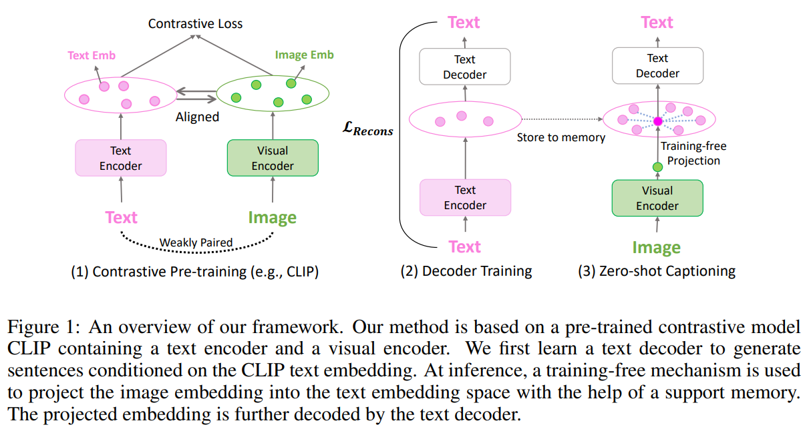
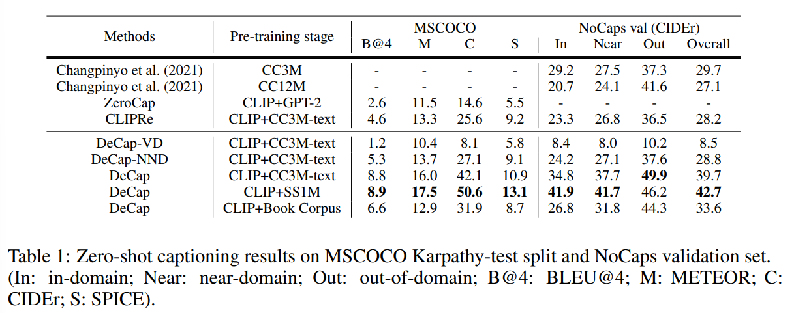
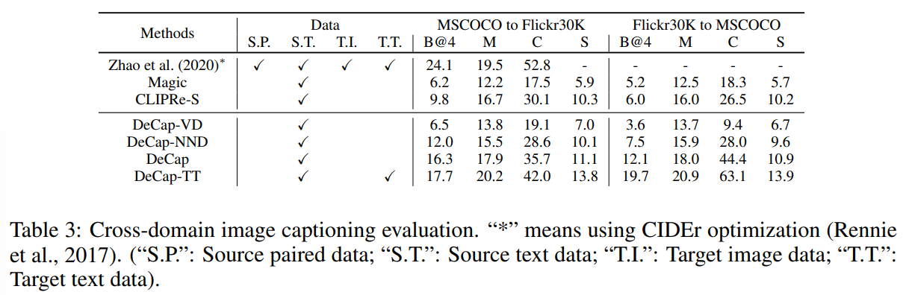

논문 및 이미지 출처 : <https://arxiv.org/pdf/2303.03032>

# Abstract

Large-scale pre-trained multi-modal model (e.g., CLIP) 은 image classification 등 많은 discriminative task 에서 strong zero-shot transfer capability 를 보여준다. zero-shot image-conditioned text generation task 로의 adaptation 은 점점 더 많은 관심을 받고 있다. 

기존 연구는 zero-shot captioning 을 위해 기존 large language model (e.g., GPT-2) 을 활용하거나, encoder-decoder network 를 end-to-end 방식으로 pre-training 하는 접근을 취한다. 그러나 large language model 은 captioning 과 language modeling 사이의 task discrepancy 때문에 합리적인 description 을 생성하지 못할 수 있고, end-to-end pre-training 은 paired data 와 막대한 computational resource 를 필요로 한다.

이 논문에서는 zero-shot captioning 을 위한 간단한 framework 인 **DeCap** 을 제안한다. 저자는 lightweight 한 visual-aware language decoder 를 도입한다. 이 decoder 는 data-efficient 하고 computation-efficient 하다.

1. training 에 text data 만 필요하여, paired data 수집에 대한 부담을 줄인다.
2. end-to-end training 을 요구하지 않는다.

text-only data 로 training 할 때, decoder 는 off-the-shelf CLIP encoder 에서 추출한 text embedding 을 prefix embedding 으로 사용한다. 도전 과제는 decoder 가 text corpus 로 training 되지만, inference 단계에서는 visual input 에 기반해 caption 을 생성해야 한다는 점이다. CLIP text embedding 과 visual embedding 이 서로 상관관계가 있긴 하지만, multi-modal contrastive model 에서 널리 관찰되는 modality gap 문제로 인해 visual embedding 을 prefix embedding 으로 직접 사용할 수 없다.

저자는 training-free mechanism 을 제안하여 modality gap 을 줄인다. visual embedding 을 CLIP text embedding space 로 projection 하는데, 이때 projected embedding 은 visual input 의 정보를 유지한다. projected embedding 을 prefix embedding 으로 사용하면, decoder 는 visual input 과 잘 부합하는 high-quality description 을 생성한다.

실험 결과 DeCap 은 대표적인 image captioning benchmark 인 MSCOCO 와 NoCaps 에서 다른 zero-shot captioning 방법 및 unpaired captioning 방법들을 큰 폭으로 능가한다. 또한 DeCap 을 video captioning 에 적용하여 MSR-VTT 와 ActivityNet-Captions 에서 state-of-the-art zero-shot performance 를 달성한다.

# 1 Introduction

image captioning 의 목표는 주어진 image 에 대해 자동으로 description 을 생성하는 것이다. human-annotated image-text pair 로 training 된 model 은 typical image captioning benchmark 에서 impressive 한 결과를 달성했다. 그러나 human-annotated dataset 의 small size 와 제한된 visual concept 때문에, 이러한 model 은 wild 환경의 image 에 대해 generalization 이 낮게 나타난다. 본 논문에서는 human-annotated paired data 에 대한 의존을 줄이고 real-world captioning scenario 에서의 generalization 을 개선하기 위해, training 시 text-only data 만을 요구하는 새로운 zero-shot captioning framework 를 제안한다.

web-scale noisy paired data 로 pre-training 하는 것은 robust multi-modal representation 을 학습하는 데 효과적임이 입증되어 왔다. Changpinyo et al. 과 Wang et al. 은 web-scale image-text pair 를 사용하여 captioning model 을 training 하고, pretraining-finetuning paradigm 을 통해 MSCOCO 와 NoCaps 에서 큰 향상을 달성했다. 그러나 이러한 model 은 MSCOCO zero-shot captioning 에서는 성능이 낮게 나타나, 여전히 fine-tuning 을 위해 human-annotated paired data 에 의존하고 있음을 보여준다. 또한 web-scale data 에서 captioning objective 로 training 하는 것은 효율적이지 않으며, 예를 들어 Wang et al. 은 ALIGN 과 C4 에서 약 1M step 을 512 TPU v3 chip 으로 training 했다.

web-scale image-text pair 를 end-to-end 방식으로 captioning model 로 직접 training 하는 것 대신, 또 다른 연구 흐름은 기존 pre-trained model 을 결합하여 zero-shot captioning 을 달성한다. 

* 구체적으로, pre-trained multi-modal model 인 CLIP 을 사용해 pre-trained language model (PLM) 인 GPT-2 를 guide 하여 주어진 image 와 일치하는 sentence 를 생성한다. 
* 그러나 이러한 방법은 word 를 하나 생성할 때마다 CLIP text encoder forward 가 필요하므로 inference 속도가 매우 느리다. 
* 또한 웹에서 수집된 다양한 문서로 pre-training 된 language model 은 image 내 visual concept 과 그 관계를 묘사하는 captioning task 와 잘 맞지 않아 captioning benchmark 에서 성능이 떨어진다.

본 논문에서는 zero-shot captioning 을 위한 새로운 framework 인 **DeCap** 을 제안한다. 

* 저자는 CLIP multi-modal embedding space 로부터 sensible 한 visual description 을 decoding 하는 것을 목표로 한다. 
* decoder pre-training 에 paired image-text data 를 사용하지 않고 text data 만을 활용한다. 
  * 이는 image 와 text 의 alignment 가 noisy 해질수록 더 flexible 하고 efficient 하다. 

DeCap framework 는 다음과 같다. 

* pre-training 동안 text decoder 는 scratch 에서 training 된다. 목적은 CLIP text encoder 를 invert 하는 것이다. 
  * 즉, sentence 를 CLIP text encoder 가 embedding 으로 encode 하고, text decoder 가 이를 reconstruct 한다. 
* decoder 는 CLIP text encoder 로부터 얻은 text embedding 을 prefix embedding 으로 사용한다. 
* zero-shot inference 동안에는 input image 와 잘 맞고 decoder 가 잘 decode 할 수 있는 prefix embedding 을 얻는 것이 핵심 문제이다. 
* multi-modal contrastive model 에서 modality gap phenomenon 이 관찰되며, 이는 visual embedding 을 prefix embedding 으로 직접 사용하는 것을 어렵게 만든다. 
  * Ramesh et al. (2022) 은 paired data 로 text embedding 을 대응하는 image embedding 으로 map 하는 model 을 학습했다. 
* 저자는 이러한 학습 대신, training-free mechanism 을 제안하여 image embedding 을 CLIP text embedding space 로 projection 한다. 
* text decoder 와 projection mechanism 을 결합해 주어진 image 에 대한 high-quality description 을 생성한다.

저자의 주요 contribution 은 다음과 같다.

1. zero-shot captioning 을 위한 새로운 framework 를 제안한다. DeCap framework 는 pre-trained contrastive model (i.e., CLIP) 과 CLIP embedding 을 input 으로 받는 lightweight visual-aware language decoder 로 구성된다. 
   * decoder 는 text corpus 로만 training 되었음에도, CLIP embedding space 에 encode 되어 있는 multi-modal correlation 덕분에 visual embedding 과 text embedding 을 모두 연결할 수 있다.
2. CLIP multi-modal embedding space 의 modality gap 을 줄이기 위한 training-free projection mechanism 을 제안한다. 
   * pre-training 단계에서 text corpus 의 embedding 으로 구성된 simple support memory 를 도입한다. 
   * visual embedding 을 support memory 를 통해 CLIP text embedding space 로 projection 한다. 
   * 실험 결과 이 mechanism 은 modality gap 을 효과적으로 줄이고 성능을 크게 향상시킨다.
3. 다양한 captioning scenario 에서 DeCap 의 flexibility 를 extensive experiment 로 입증한다. 
   * DeCap 은 MSCOCO 와 NoCaps 의 image captioning benchmark 에서 다른 zero-shot captioning 방법을 큰 폭으로 능가한다. 
   * text-only data 로 training 된 DeCap 은 MSCOCO 와 Flickr30k 에서 다른 unpaired captioning 방법보다 우수하다. 
   * 또한 DeCap 을 video captioning 에 적용하여 MSR-VTT 와 ActivityNet-Captions 에서 state-of-the-art zero-shot 결과를 달성한다.

# 2 Related Work

#### CLIP in Captioning

contrastive loss 로 training 된 vision-language model 은 많은 discriminative task 에서 impressive 한 능력을 보인다. 그러나 pre-training 동안 text decoder 가 없기 때문에 captioning 과 같은 generative task 에는 직접 적용할 수 없다. 

기존 연구는 CLIP 을 image captioning task 의 visual encoder 로 사용했다. 그러나 이들은 CLIP text encoder 를 무시하고, CLIP 이 제공하는 aligned multi-modal latent space 를 활용하지 않았다. 

본 연구에서는 text-only data 로 text decoder 를 training 하여 CLIP text encoder 를 invert 한다. CLIP multi-modal latent space 를 활용함으로써, 추가적인 pairwise training 없이 captioning task 에 CLIP 을 적용한다.

#### Zero-shot Captioning

zero-shot captioning 은 human-annotated data 없이 image/video caption 을 생성하는 것을 목표로 한다. 

* Changpinyo et al., Wang et al., Alayrac et al. 은 Web 에서 수집된 noisy paired image-text data 로 vision-language model 을 training 하고, fine-tuning 없이 downstream benchmark 를 평가한다. 

또 다른 연구 흐름은 web-scale pre-trained model 을 결합해 zero-shot captioning 을 구현한다. 

* ZeroCap 은 multi-modal model (e.g., CLIP) 과 PLM (e.g., GPT-2) 을 결합한다. 
* 매 generation step 마다, CLIP 을 사용해 GPT-2 를 desired visual direction 으로 guide 한다. 
* Socratic Models 은 pre-trained VLM 을 활용해 GPT-3 의 prompt template 을 생성한 뒤, CILP 를 사용해 candidate 중 image 와 가장 가까운 description 을 retrieval 한다. 

본 연구에서는 CLIP 을 zero-shot captioning 에 활용한다. 위 연구들이 PLM 을 사용하는 것과 달리, 저자는 text-only data 로 decoder 를 scratch 에서 training 한다.

#### Text Reconstruction

기존 연구는 unpaired/unsupervised captioning task 에서 decoder 를 training 하기 위해 text reconstruction task 를 사용한다. well-aligned multi-modal latent space 가 없기 때문에, 대부분의 방법은 decoder 와 visual input 을 align 하기 위해 복잡한 pseudo-training 이나 adversarial training 이 필요하다. 

Liu et al. (2021b) 는 visual domain 과 textual domain representation 을 연결하기 위해 knowledge graph 를 구성한다. 그러나 이 방법은 well-defined knowledge graph 와 multi-label classification task 로 graph 를 training 해야 하므로, medical report generation 외 captioning task 에 적용하기 어렵다. 

CLIP 의 이점을 통해, 한편으로 저자의 decoder 는 CLIP 의 aligned cross-modal embedding space 를 활용해 visual input 과 직접 연결될 수 있다. 다른 한편으로, decoder 는 다양한 text data 로 training 될 수 있으며 다양한 captioning task 에 적용될 수 있다.

# 3 Method

저자의 framework 는 Fig. 1 에 제시된다. 

저자는 CLIP text encoder 를 invert 하기 위해 text decoder 를 학습한다 (Sec. 3.1). 이 text decoder 는 CLIP text embedding 에 기반하여 sentence 를 생성할 수 있게 한다. inference 시에는 image embedding 을 text embedding space 로 projection 하여 text embedding space 와 image embedding space 사이의 modality gap 을 줄이는 training-free mechanism 을 제안한다 (Sec. 3.2.1). 비교를 위해 추가적인 inference strategy 도 도입한다 (Sec. 3.2.2).

## 3.1 Text-Only Decoder Pre-training

이전 접근법은 zero-shot captioning 을 위해 PLM 을 사용하여 다양한 sentence 를 생성한다. 그러나 웹 페이지에서 수집된 다양한 document 로 training 된 PLM 은 주어진 image 의 visual concept 과 그 관계를 설명하는 것을 목표로 하는 captioning task 와 잘 맞지 않는다.

저자는 PLM 을 사용하는 대신, CLIP text encoder 를 invert 하기 위해 text decoder 를 scratch 에서 training 한다. 

recent work 을 따라, 저자는 prefix language modeling 을 사용해 decoder 를 training 한다. 

* 구체적으로, 주어진 sentence $t = \{\text{word}_1, \text{word}_2, \ldots, \text{word}_{|t|}\}$ 에 대해, prefix language model $P_\theta$ 는 fixed CLIP text encoder 로부터 추출된 text embedding 에 조건부로 $t$ 를 reconstruct 하도록 학습된다. 
* 저자는 text embedding 을 caption 의 prefix 로 간주한다. 

저자의 objective 는 다음과 같이 표현된다.

$$
\mathcal{L}_{\text{Recons}}(\theta)
= - \frac{1}{|t|}
\sum_{i=1}^{|t|}
\log P_\theta\big(\text{word}_i \mid \text{word}_{<i}, E_{\text{text}}(t)\big),
$$

* 여기서 $E_{\text{text}}(\cdot)$ 은 sentence 를 CLIP text encoder 를 통해 $\ell_2$-normalized embedding space 로 mapping 하는 함수를 의미한다. 

text-only data 로 self-supervised 방식으로 training 된 이 decoder 는 두 가지 이점을 제공한다.

1. text-only data 의 source 를 조정함으로써 생성되는 sentence 의 style 을 제어할 수 있다. 
   * task-specific 한 descriptive caption 을 생성하기 위해, 저자는 human-annotated image description 과 web 에서 수집된 image caption 으로부터 온 text data 로 decoder 를 training 한다.
2. 이 text decoder 는 CLIP text embedding 을 prefix embedding 으로 사용한다. 
   * CLIP text embedding 은 CLIP image embedding 과 상관관계를 갖도록 최적화되어 있기 때문에, 별도의 pairwise training 없이도 text decoder 를 visual input 과 연결하는 것이 가능하다.

## 3.2 Inference Strategies

Sec. 3.1 에서 저자는 CLIP text embedding 을 조건으로 description 을 생성할 수 있는 decoder 를 얻었다. 

inference 단계에서는 CLIP image embedding 이 주어졌을 때, decoder 를 어떻게 활용해 description 을 생성할지 결정해야 한다. CLIP image embedding space 와 text embedding space 사이에는 modality gap 이 존재하므로, CLIP image embedding 을 prefix embedding 으로 직접 사용하는 것은 실용적이지 않다. 

Ramesh et al. (2022) 은 text embedding 을 대응하는 image embedding 으로 map 하는 prior model 을 paired data 로 학습한다. 그러나 이러한 접근은 paired data 가 필요하다. 저자는 image embedding 을 text embedding space 로 projection 하는 training-free mechanism 을 제안한다.

### 3.2.1 Projection-based Decoding (PD)

language model $P_\theta$ 가 주어진 text set $T = \{t_1, t_2, \ldots, t_N\}$ 으로 training 되었다고 가정한다. 여기서 $N$ 은 $T$ 의 size 이다. CLIP text embedding space 를 표현하기 위해 support memory $M = \{m_1, m_2, \ldots, m_N\}$ 를 유지하며, $m_i = E_{\text{text}}(t_i)$ 이다.

inference 시, 주어진 image $I$ 에 대해 caption 을 생성하는 것이 목표이다. support memory $M$ 을 활용해 image embedding 을 text embedding space 로 projection 할 수 있다. 구체적으로, image embedding $v = E_{\text{image}}(I)$ 가 주어지면, support memory 의 embedding 에 대한 weighted combination 을 통해 text embedding space 내에서의 representation 을 얻는다.

weight 를 구하기 위해 $v$ 와 $m$ 의 cosine similarity 를 계산하고, temperature parameter $\tau$ 로 scaling 한 뒤 softmax 로 정규화한다. project 된 vector $v_{\text{proj}}$ 는 아래와 같이 계산된다.

$$
v_{\text{proj}}
=
\sum_{i=1}^{N} w_i * m_i
=
\sum_{i=1}^{N}
\frac{
\exp\left((m_i^\top v) / \tau\right)
}{
\sum_{k=1}^{N} \exp\left((m_k^\top v) / \tau\right)
}
* m_i,
$$

* 여기서 $w_i$ 는 support memory 의 $i$-th text embedding 의 weight 이다. 
* $v_{\text{proj}}$ 는 CLIP text embedding 의 combination 으로 구성되며, prefix embedding 으로 사용할 수 있다. 
* $P_\theta(x)$ 를 prefix embedding $x$ 에 조건부로 sentence 를 auto-regressive 하게 생성하는 process 라 하자. 

final output 은 아래와 같이 생성된다: $P_\theta\left(\frac{v_{\text{proj}}}{\|v_{\text{proj}}\|_2}\right)$.

* 이 projection-based 방법은 추가 training 을 필요로 하지 않는다. 다양한 dataset 에서 잘 작동하고, 매우 flexible 하다. 
* $v_{\text{proj}}$ 는 support memory 내 text embedding 의 정보를 흡수할 수 있어, 다양한 형태의 정확한 description 을 생성한다. 
* 또한 training 에 사용한 text data 와 support memory 에 저장된 text data 는 서로 다를 수 있다. 
* target domain 에 맞는 새로운 text data 로 support memory 를 재구성하면, image embedding 도 새로운 text embedding space 로 projection 되어 retraining 없이 새로운 domain 에 빠르게 generalize 할 수 있다.

### 3.2.2 Discussion

저자의 decoder 와 projection-based mechanism 의 영향을 분석하기 위해, 다음 inference strategy 를 비교 대상으로 포함한다.

#### 1) CLIPRe

decoder 가 필요 없는 simple retrieval-based approach 로, Su et al. (2022) 에 언급되어 있다. image $I$ 와 text set $T$ 가 주어지면, CLIPRe 는 CLIP 의 image-text similarity 를 기반으로 가장 관련 높은 text 를 retrieval 한다: $\argmax_{t \in T} \text{sim}(E_{\text{image}}(I), E_{\text{text}}(t)).$

* sim 은 cosine similarity 를 의미한다. 
* 모든 실험에서 저자는 CLIPRe 를 baseline 으로 사용하며, 이는 decoder 없이 original CLIP 의 zero-shot 성능을 잘 반영한다.

#### 2) Visual Decoding (VD)

text embedding 과 image embedding 이 correlated 라는 점에 기반한 단순한 접근으로, image embedding 자체를 prefix embedding 으로 사용하는 것이다: $P_\theta(E_{\text{image}}(I))$.

그러나 대부분의 실험에서 이 방법은 만족스러운 성능을 내지 못하며, 이는 CLIP image embedding 과 text embedding 사이에 modality gap 이 존재함을 의미한다.

#### 3) Nearest-neighbor Decoding (NND)

또 다른 단순한 방법은 가장 가까운 text embedding 을 prefix embedding 으로 사용하는 것이다. image embedding $E_{\text{image}}(I)$ 와 support memory $M$ 의 text embedding 간 similarity 를 계산한 뒤, 가장 가까운 embedding 을 선택한다: $P_\theta\left(\argmax_{m \in M} \text{sim}(E_{\text{image}}(I), m)\right)$.

이론적으로 NND 와 CLIPRe 는 유사한 성능을 보여야 한다. decoder 가 text embedding 에 조건부로 원래 text 를 잘 복원하도록 학습되었기 때문이다. 흥미롭게도, 실험 결과 NND 는 대부분의 경우 CLIPRe 보다 더 좋은 성능을 보인다. 이는 decoder 가 더 descriptive 한 sentence 를 생성할 수 있음을 시사한다. 또한 decoder 를 사용해 새로운 text corpus 를 reconstruct 하면 성능이 더 향상될 수 있음도 확인했다. 추가 결과와 논의는 Appendix B 에 제시된다.

# 4 Experiments

저자는 zero-shot image captioning, unpaired image captioning, video captioning 등 다양한 captioning task 에 대해 extensive experiment 를 수행한다. 

DeCap 은 다양한 설정에서 효율적으로 impressive 한 결과를 달성한다. Sec. 4.1 에서는 어떠한 human annotation 없이 zero-shot image captioning 에 초점을 둔다. Sec. 4.2 에서는 image 와 sentence 를 독립적으로 다루는 unpaired image captioning 에 초점을 둔다. Sec. 4.3 에서는 DeCap 을 video captioning task 에 적용한다. Sec. 4.4 에서는 DeCap 에 대한 detailed ablation study 를 수행한다.

#### Implementation Details

* 저자는 frozen pre-trained ViT-B/32 CLIP model 을 사용한다. 
* language model 로는 4-layer Transformer (4 attention head) 를 adopt 하며, hidden state size 는 768 이다. 
* 기본적으로, training set 의 모든 text data 를 사용해 naive cross-entropy loss 로 language model 을 scratch 부터 training 한다. 
* training corpus 로부터의 모든 text embedding 은 별도 언급되지 않는 한 support memory 에 저장한다. 
* inference 시, Eq. 2 의 temperature $\tau$ 는 video captioning 에서는 $1/150$, image captioning 에서는 $1/100$ 으로 설정한다. 
* captioning 평가 metric 으로 BLEU@N, METEOR, CIDEr, SPICE 를 사용한다. 
* 또한 CLIP-SRef 와 CLIP-S 를 사용해 text-text similarity 와 text-image similarity 를 측정한다. beam search 및 constrained beam search 는 사용하지 않는다.

## 4.1 Zero-Shot Image Captioning

본 절에서는 webly-collected corpus 를 사용해 zero-shot image captioning 을 수행한다. 기존 image captioning 방법은 paired human-annotated data 를 사용하지만, 이러한 data 는 얻기 어렵고 규모 및 다양성이 제한적이다. 저자는 DeCap training 을 위해 다음 세 가지 webly-collected corpus 를 고려한다.

1. **CC3M (CC3M-text)**
   * CC3M 은 Web 에서 수집된 300 만 개의 image-description pair 로 구성된 dataset 이다. 
   * 저자는 training 시 text description (CC3M-text) 만 사용한다. support memory 는 300 만 description 중 100 만 개를 random sampling 하여 구성한다.
2. **SS1M**
   * SS1M 은 MSCOCO caption 을 위해 특별히 설계된 webly-collected corpus 이다. 
   * Feng et al. 은 MSCOCO 의 80 object class 이름을 keyword 로 사용해 Shutterstock 에서 description 을 crawling 하여 총 2,322,628 개의 distinct image description 을 수집했다. 
   * 저자는 이 corpus 를 reuse 하되, 길이가 15 단어를 넘는 sentence 를 제거하여 978,662 개의 sentence 를 얻는다.
3. **Book Corpus**
   * Book Corpus 는 많은 양의 novel text 로 구성된 대규모 dataset 이며, unsupervised language model pre-training 에 자주 사용된다. 
   * 본 연구에서는 Book Corpus 를 captioning 용 text decoder training 에 활용한다. 
     * 그러나 Book Corpus 는 매우 크고 많은 sentence 가 visual-related 가 아니므로 training 이 비효율적이다. 
   * 저자는 CLIP text embedding 의 norm 이 visual-related 여부를 대략적으로 구분할 수 있음을 발견했다. 
     * 보통 norm 이 큰 sentence 는 visual-related 가 아니다. training efficiency 를 개선하기 위해, sentence 길이가 15 미만이고 norm 이 10 미만인 sentence 만 유지하여 총 6,217,799 sentence 를 얻는다. 
     * support memory 는 training data 중 100 만 sentence 를 random sampling 해 구성한다. 
     * 또한 Book Corpus 로 training 한 model 에는 prompt “Attention! There is/are” 를 사용한다. 
     * 반면 CC3M 로 training 한 경우 prompt engineering 이 필요하지 않았다. 추가 prompt, 결과 및 분석은 Appendix F 에 정리되어 있다.

다음 zero-shot captioning method 들을 비교 대상으로 포함했다.

* Changpinyo et al. 은 webly-collected paired data 로 captioning model 을 training 한 뒤 fine-tuning 없이 downstream dataset 에 transfer 한다.
* ZeroCap 은 CLIP + GPT-2 를 이용하는 training-free zero-shot captioning 방법이다.
* DeCap 은 CLIP 을 활용하지만, webly-collected corpus 로부터 scratch 부터 decoder 를 training 한다. 기본적으로 projection-based decoding (PD) 을 사용한다.
* Sec. 3.2 의 다른 inference strategy 인 visual decoding (DeCap-VD), nearest-neighbor decoding (DeCap-NND) 도 비교한다.

모든 방법은 zero-shot image captioning 을 목표로 하며, human-annotated data 를 사용하지 않는다.

#### Results

Tab. 1 은 MSCOCO 및 NoCaps 에서의 zero-shot 결과를 보여준다. 

* DeCap 은 모든 metric 에서 새로운 state-of-the-art 를 달성했다. 
* NoCaps 에서는 webly-collected data 로 pre-training 한 model 들이 out-of-domain 성능이 더 좋다. 
  * 이는 webly-collected data 에 다양한 visual concept 이 포함되어 있기 때문이다. 
* MSCOCO 에서, CC3M-text 로 pre-trained DeCap 은 CIDEr 기준 ZeroCap 대비 27.5% 향상한다. 
* SS1M 로 pre-trained DeCap 은 ZeroCap 대비 36% 향상한다. 
* 또한 SS1M 으로 training 한 경우 CC3M 대비 더 높은 성능(CIDEr: 50.6% vs. 42.1%) 을 보이며, 이는 task-specific corpus 가 downstream dataset 성능을 크게 향상시킬 수 있음을 의미한다. 
* Book Corpus 로 training 한 경우에도 ZeroCap 보다 높은 성능을 보인다. 
* 주목할 점은 DeCap-BookCorpus 와 ZeroCap 모두 caption-related data 를 보지 않았다는 것이다.

## 4.2 Unparied Image Captioning

DeCap 의 잠재력을 더 다양한 captioning scenario 에서 탐구하기 위해, human-annotated image-sentence pair 를 서로 독립적인 image 와 sentence 로 취급하는 unpaired image captioning setting 을 고려한다. Sec. 4.2.1 에서는 training data 와 test data 가 같은 dataset 에서 오지만, training data 가 paired 가 아닌 in-domain captioning 을 다룬다. Sec. 4.2.2 에서는 training data 와 test data 가 서로 다른 distribution 에서 오는 cross-domain 상황을 고려한다.

### 4.2.1 In-Domain Captioning

저자는 DeCap 을 supervised method 및 다른 unpaired image captioning method 와 비교한다.

1. **Supervised methods**\
   BUTD (Anderson et al., 2018) 는 Faster R-CNN (Ren et al., 2015) 으로 visual feature 를 추출하는 classic 방법이다. CLIPCap (Mokady et al., 2021), CLIP-VL (Shen et al., 2021), Barraco et al. (2022) 는 CLIP 을 visual encoder 로 사용하는 recent approach 이다.
2. **Unpaired methods**\
   Laina et al. (2019) 와 Feng et al. (2019) 은 MSCOCO training set 의 image 와 caption 을 unpaired data 로 취급한다. UVC-VI (Liu et al., 2021a) 는 training 을 위해 image-Chinese pair (Wu et al., 2019) 를 사용한다.
3. **(CLIP+GPT2)-based methods**\
   ZeroCap, Magic, ESPER-Style 은 training set 의 caption 으로 GPT-2 를 finetune 한다.
4. **ESPER-Free**\
   ESPER-Free 는 reinforcement learning 으로 multi-modal input 을 language model generation 에 align 한다.
5. **CLIPRe**\
   CLIPRe 는 retrieval-based baseline 이다.
6. **우리 방법: DeCap, DeCap-VD, DeCap-NND**
   저자의 decoder 는 training set 의 caption 으로 training 되며, 모든 training caption 의 text embedding 은 support memory 에 저장된다.

#### Results

Tab. 2 는 MSCOCO 와 Flickr30K 에서의 결과를 보여준다. 전반적으로 DeCap 은 recent unpaired approach 보다 큰 폭으로 우수한 성능을 보인다. 특히 Flickr30K 에서는 supervised learning method 인 BUTD 와 경쟁 가능한 성능을 달성한다. 여기서 두 가지 결론을 도출할 수 있다.

1. CLIP 이 captioning task 를 위한 aligned multi-modal representation 을 제공한다.\
   visual concept detector 로 multi-modal embedding space 를 구성하는 기존 unpaired method 와 비교했을 때, CLIP 기반 방법들은 text data 만 사용하고도 competitive 한 결과를 달성할 수 있다.
2. decoder 와 projection mechanism 이 high performance 에 매우 중요하다.\
   CLIPRe 와 비교했을 때, DeCap-NND 는 nearest-neighbor text embedding 을 추가로 decode 하여 더 높은 성능을 보이며, 이는 decoder 가 더 descriptive 한 sentence 를 생성할 수 있음을 보여준다.\
   반면 DeCap-VD 는 성능이 떨어지는데, 이는 CLIP image embedding 과 text embedding 사이의 modality gap 이 크다는 점을 보여주며, 저자의 projection mechanism 이 필수적임을 뒷받침한다.

### 4.2.2 Cross-Domain Captioning

cross-domain setting 에서, training data 와 testing data 가 서로 다른 dataset 에서 올 때 MSCOCO 와 Flickr30K 에 대해 다음 방법들을 평가한다.

1. **Zhao et al. (2020)**\
   source domain 에서 training 한 retrieval model 을 사용해 target domain 에 대한 pseudo image-text pair 를 생성한다.
2. **Magic (Su et al., 2022)**\
   source domain 의 text data 로 GPT-2 를 finetune 한다.
3. **CLIPRe-S**\
   source domain 의 text data 를 gallery 로 사용하는 CLIP 기반 retrieval 방법이다.
4. **DeCap**\
   decoder 를 source domain 의 text data 로 training 한다.
5. **DeCap-TT**\
   decoder 는 source domain 의 text data 로 training 하고, target domain 의 caption 을 support memory 구성에만 사용한다.

#### Results

Tab. 3 에 결과가 제시된다. 

* paired source domain data 에 의존하고 target domain 에서 추가 training 을 요구하는 traditional cross-domain 방법과 달리, recent CLIP 기반 text-only 방법들은 source domain 의 text-only data 만으로 training 된다. 
* DeCap 은 cross-domain 평가에서 Magic, CLIPRe-S 등 다른 text-only 방법보다 상당히 우수한 성능을 보인다.
* 더 나아가, target domain 의 text data 를 사용할 수 있는 경우, DeCap-TT 는 추가 training 없이도 captioning 성능을 크게 향상시킨다 (e.g., CIDEr 가 44.4% 에서 63.1% 로 증가). 
* 이는 단순히 target domain 의 text embedding 을 support memory 로 사용하는 것만으로 달성된다. 
* 이러한 결과는 cross-domain generalization 에서 DeCap 의 강력한 capability 와, 저자의 projection-based decoding mechanism 의 효과를 보여준다.

## 4.3 Video Captioning

이 절에서는 DeCap 을 video captioning task 에 적용한다. 저자는 MSR-VTT, Activity-Captions, VATEX 에서 experiment 를 수행한다. 주목할 점은, VATEX public test video 6000 개 중 일부 video 가 더 이상 사용 불가하여, 저자는 raw test video 5182 개만 다운로드했다. Activity-Captions 에서는 Krishna et al. 을 따라 ground-truth proposal 을 사용한다. video captioning 에도 동일한 DeCap 을 그대로 적용한다.

decoder training 을 위해 세 가지 data source 를 고려한다.

1. **Generic corpus**\
   unsupervised language model 학습에 널리 사용되는 generic corpus 인 Book Corpus 로 decoder 를 training 한다.
2. **Image captions**\
   image captioning task 를 위해 수집 또는 annotation 된 MSCOCO 와 CC3M 의 caption 으로 decoder 를 training 한다.
3. **Video captions**\
   video captioning dataset 의 training set 에 포함된 text annotation 을 추출해 decoder 를 training 한다.

앞의 두 경우는, training 에 video-related data 를 전혀 사용하지 않는 zero-shot video captioning setting 으로 볼 수 있다.

inference 시에는 frame-level feature 에 대한 pooling mechanism 을 사용해 video-level feature 를 얻는다. 구체적으로, 각 proposal 에 대해 clip 으로부터 frame $f_1, f_2, \ldots, f_k$ 를 random sampling 한다. 그리고 CLIP image encoder 가 추출한 frame-level feature 에 mean pooling 을 적용해 video-level feature 를 얻는다. 모든 experiment 에서 $k$ 는 10 으로 설정한다.

#### Results

Tab. 4 는 결과를 보여준다. 

* image caption 으로 training 한 DeCap 은 standard captioning metric 에서 recent zero-shot captioning approach 를 능가하며, CLIP-S 와 CLIP-SRef metric 에서도 competitive 한 결과를 보인다. 
* 특히 다른 방법과 달리, DeCap 은 CLIP visual-text similarity 를 직접 optimization objective 로 사용하지 않는다. 
* 더 나아가 video caption 으로 training 하면 성능이 추가로 향상된다. 
* 이러한 결과는 DeCap 이 단순한 random sampling 전략과 temporal mean pooling mechanism 만으로도 video captioning 에 쉽게 적용될 수 있음을 보여준다.

## 4.4 Ablation Study

#### The size of training data.

핵심 질문 중 하나는, decoder 를 scratch 에서 training 하기 위해 얼마나 많은 text data 가 필요한가 하는 점이다. 이를 조사하기 위해, MSCOCO 에서 서로 다른 scale 의 data 를 sampling 한다. inference 시에는 모든 experiment 에 대해 동일한 support memory (full training set, 560K caption) 를 사용한다. 결과는 Fig. 2 (left) 에 제시된다.

* 전반적으로 DeCap 은 large data size 에서 이득을 본다. 
* full set 으로 training 했을 때와 비교하면, data 의 1 % (5.6K caption) 만 사용했을 때 CIDEr score 가 91.2 % 에서 81.5 % 로 감소한다. 
* 이 결과는 DeCap 이 상당히 data-efficient 하다는 점을 보여준다. 
* 또한 data-limited scenario 에서 DeCap 을 적용하는 것이 유망한 방향임을 시사한다.

#### The size of the support memory.

support memory size 의 효과를 조사하기 위해, 먼저 language model 을 full training set (560K caption) 으로 training 한다. inference 시에는 서로 다른 비율의 text embedding 을 random sampling 하여 support memory 로 사용한다. 결과는 Fig. 2 (right) 에 제시된다.

* 전반적으로 DeCap 과 CLIPRe 는 모두 large support memory 에서 이득을 본다. 
* 그러나 support memory 로 data 의 1 % 만 사용했을 때에도 성능 감소는 비교적 작다 (CIDEr 기준 3.8 % drop). 
* 이는 저장 및 computation cost 를 허용 가능한 수준으로 유지하면서도, 상대적으로 작은 support memory 로 competitive 한 결과를 유지할 수 있음을 의미한다.

추가로, 저자는 support embedding 의 수를 줄이기 위한 filtering strategy 를 Appendix E 에 제시한다. 또한 Appendix G 에서는 support memory 와 projection embedding 을 시각화한다. inference speed 분석은 Appendix D 에 추가한다.

# 5 Conclusion

저자는 zero-shot captioning 을 위한 simple framework 를 제안하고, data-efficient 이며 computation-efficient 한 lightweight visual-aware language decoder 를 도입한다. 

저자는 visual embedding 을 text embedding space 로 projection 하는 training-free mechanism 을 제안하여, modality gap 문제를 상당히 줄인다. 

decoder 와 projection mechanism 을 결합함으로써, 저자는 기존 zero-shot 방법을 크게 능가하며 MSCOCO, MSR-VTT, ActivityNet-Captions 에서 새로운 state-of-the-art 를 확립한다. 향후 DeCap framework 는 visual dialog 와 같은 다른 zero-shot text generation 문제에도 적용될 수 있을 것이다.
