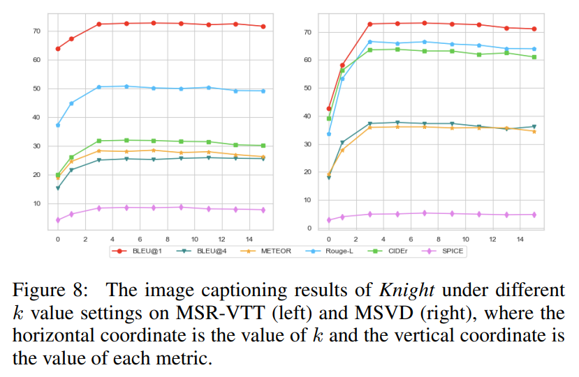
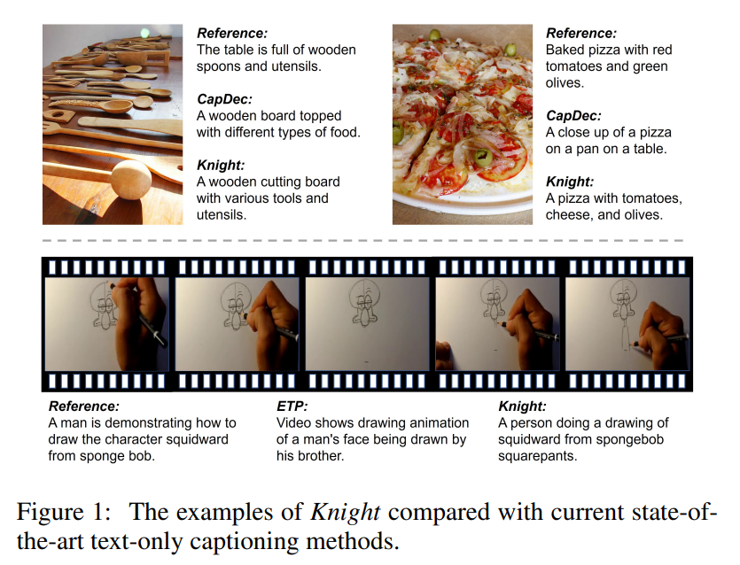
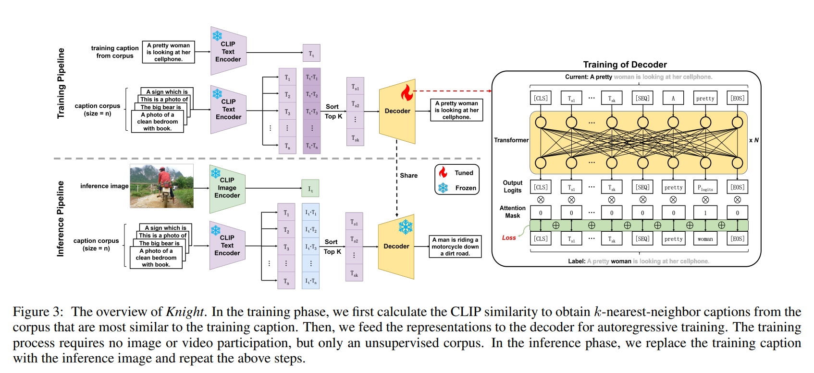
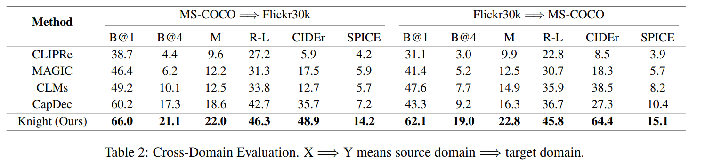

논문 및 이미지 출처 : <https://arxiv.org/pdf/2304.13273>

# Abstract

CLIP 과 ALIGN 으로 대표되는 Vision-Language Pretraining Models (VLPMs) 의 발전으로, zero-shot capability 를 가진 CLIP 의 fine-tuning 없이도 image classification 과 image-text retrieval 과 같은 association-based visual task 에서 큰 진전이 이루어졌다.

그러나 CLIP 은 generation-based task 에 적용하기 어렵다. 이는 generation 을 위한 decoder architecture 와 pre-training task 가 부족하기 때문이다. 이전 연구들은 추가적인 language model 을 통해 CLIP 에 generation capacity 를 부여했지만, 서로 다른 modality 의 CLIP representation 사이에 존재하는 modality gap 과, 이 gap 의 offset 을 CLIP 이 model 할 수 없다는 한계로 인해, concept 가 modality 를 넘어 transfer 되지 못한다.

이 문제를 해결하기 위해, 저자는 image / video 를 language modality 로 mapping 하고, language modality 로부터 caption 을 generation 하는 접근을 시도한다. 본 논문에서는 association 에서 generation 으로의 zero-shot 전환을 위한 방법으로 **K-nearest-neighbor Cross-modality Mapping (Knight)** 을 제안한다. 

Knight 는 text-only unsupervised training 만으로, image captioning 과 video captioning 에서 zero-shot 방법들 중 state-of-the-art performance 를 달성한다.

# 1 Introduction

multi-modal learning 의 발전 과정에서 두 가지 recursive level 이 나타난다:\
(1) multi-modal association,\
(2) cross-modal generation.

전자는 multi-modal input 에 의존하고, 주어진 multi-modal input 에 대해 association expression 을 통해 association score 를 계산한다. 대표적 task 는 image classification, image-text retrieval, object detection 등이 있다. 후자는 하나의 modality 로부터 다른 modality 로 input 을 변환하는 것으로, 동일한 concept 가 서로 다른 modality 에서 정확히 표현될 수 있도록 cross-modal transformation relationship 이 필요하다. 대표적 task 는 image-to-text 와 text-to-image generation 이다.

현재 CLIP 과 ALIGN 으로 대표되는 Vision-Language Pre-training Models (VLPMs) 은 contrastive learning 이라는 multi-modal association 기반 pre-training task 의 장점 덕분에 첫 번째 level 에서 큰 성공을 거두었다. 

* 4 억 개의 방대한 (image, text) training data 를 기반으로 CLIP 은 vision modality 와 language modality 사이의 association 을 성공적으로 model 한다. 
* 다양한 web data 로부터 CLIP 은 open-world knowledge 에 대한 광범위한 perception 을 갖게 된다. fine-tuning 없이도 CLIP 은 zero-shot setting 에서 ImageNet accuracy 76.2% 를 달성하고, 여러 domain 의 dataset 에서 fine-tuning model 과 비교해 경쟁하거나 오히려 능가한다. 
* 많은 multi-modal association 기반 연구들이 CLIP 의 강력한 zero-shot capability 로부터 혜택을 얻고 있다. 이는 supervised data 의 높은 수집 비용을 피하고, deployment 과정도 단순화한다.

association level 에서의 CLIP 의 큰 성공은 generation level 에 대한 탐구를 촉발했다. 그러나 CLIP 은 generation 을 위한 decoder architecture 와 pre-training task 가 존재하지 않으므로 generation-based task 에 적합하지 않다. 그럼에도 BERT 와 GPT 같은 large-scale language model 의 dominant performance 덕분에 CLIP 의 embedding space 로부터 decoding 하는 것이 가능해졌다. 이 기반 위에서 joint space 기반 zero-shot generation 아이디어가 등장했다. 

* CLIP 은 image 와 text pair 를 embedding space 에서 충분히 가깝게 encode 한다는 것이다. 
* 그러나 Liang et al 은 CLIP 이 image 와 text 를 두 개의 별도 subspace 로 encode 하며 이들 사이에는 상당한 gap 이 존재함을 보여주었다. 이는 Fig. 8 (a) 위쪽에 나타나 있다. 
* 이는 decoder 가 오직 한 modality 에서만 효과적임을 의미한다. decoder 를 한 modality 에서 다른 modality 로 transfer 할 때 modality gap 때문에 representation 을 정확히 이해하는 데 실패한다. 이는 Fig. 8 (b) 에 나타나 있다.

modality gap 의 영향을 제거하기 위해 해결해야 할 핵심 문제는 두 modality 사이의 transformation relationship 을 어떻게 구축할 것인가이다. 자연스러운 생각은 대량의 supervised data 를 통해 이 관계를 model 하는 것이다. 그러나 이는 막대한 supervised data 와 training resource 를 요구한다. 저자는 이 관계가 CLIP 의 association capability 를 활용한 unsupervised 방법으로도 구축될 수 있다고 주장한다.

이를 기반으로, 저자는 K-nearest-neighbor Cross-modality Mapping (Knight) 을 제안한다. 이는 Fig. 9 에 나타난 text-only captioning method 이다. 

* 먼저, image-text 와 video-text dataset 에서 caption 을 corpus 로 수집한다. 
* training 단계에서 corpus 로부터 training caption 을 선택하고, 해당 training caption 과 가장 유사한 k-nearest-neighbor caption 을 CLIP similarity 로 retrieval 한다. 
* 이후 training caption 의 CLIP feature 를 사용해 autoregression loss 로 decoder 를 training 한다. 
* inference 단계에서 Knight 는 image captioning 과 video captioning 모두에 적용될 수 있다. 
* image captioning 에서는 inference image 와 가장 유사한 k-nearest-neighbor caption 을 retrieval 한다. 
* video captioning 에서는 각 keyframe 에 대해 retrieval 한 결과를 평균하여 video 에 대한 multi-frame input 을 얻는다. 
* Knight 는 decoder 가 text subspace 에서만 작동하게 하므로 Fig. 8 (c) 에 나타나듯 modality gap 의 영향을 제거한다.

저자의 contribution 은 다음과 같다:

* 저자는 unsupervised cross-modal mapping 을 기반으로 하는 text-only captioning method, Knight 를 제안한다. 이 방법은 vision modality 에서 language modality 로 representation mapping 을 달성하며, cross-modal generation 에서 modality gap 의 영향을 크게 완화한다.
* 저자는 Knight 를 기존 zero-shot image captioning 및 video captioning baseline 과 비교한다. 실험 결과 Knight 는 state-of-the-art performance 를 달성한다. 또한 저자는 CLIP 의 association capacity 를 활용해 zero-shot generation-based task 를 해결할 가능성을 탐구한다.

# 2 Background and Related Work

## 2.1 CLIP

400M (image, text) pair dataset 에서 contrastive learning 을 수행함으로써, CLIP 은 image 와 text 사이의 association 을 model 한다. CLIP 은 classification, retrieval 등의 zero-shot task 에 널리 사용된다. zero-shot performance 는 fine-tuned model 에 근접하거나 심지어 능가하는 것으로 알려져 있다. 많은 연구들이 image segmentation, image generation, object detection 과 같은 특정 application scenario 에 CLIP 의 zero-shot capacity 를 적용해 왔다.

## 2.2 text-only Captioning

captioning task 의 mainstream method 는 크게 두 가지로 나뉜다:

1. pre-trained network 을 사용해 visual feature 를 추출하고, 최종 caption 을 생성하는 decoder 를 training 하는 방식
2. pre-training 을 활용해 image 와 text 의 shared latent space 를 구축함으로써 vision 과 language 사이의 gap 을 bridge 하는 방식

CLIP 의 부상과 함께, 최근 captioning method 들은 CLIP 을 사용해 training time 을 줄이거나 caption quality 를 개선하고 있다.

그러나 기존 연구들은 모두 방대한 training 과정과 수집하기 어려운 large paired data 를 요구한다. 이를 해결하기 위해 style-guided captioning 이 제안되었지만, 여전히 paired data 에 대한 training 이 필요하다. 반면 CLIP 은 대규모 resource 로 pre-training 되며 cross-modal pattern 을 학습했다. 이는 CLIP 의 pre-trained knowledge 를 효과적으로 활용하면 supervised data 의 제약에서 벗어나 captioning 이 가능함을 의미한다.

* Tewel et al. 은 pre-trained language model 을 사용해 주어진 image 와 CLIP similarity 가 가장 높은 caption 을 generation 하려 했지만, language model 과 CLIP 의 text encoder 가 서로 다른 pre-training data 와 paradigm 을 사용하기 때문에 image-relevant 고품질 caption 을 generation 하기 어려웠다. 
  * 이후 연구자들은 language model 과 CLIP 의 embedding space alignment 를 위해 추가적인 language data 가 필요함을 인식했고, text-only captioning method 들이 등장했다.
* Su et al. 은 unsupervised corpus 로 language model 을 fine-tuning 하여 CLIP domain 에 맞추려 했다. 
  * 그러나 이러한 방식은 language model 이 candidate word 를 제공해야 하므로 severe language prior 문제를 가진다는 점이 밝혀졌다. 
* Wang et al. 과 Nukrai et al. 은 joint space 개념을 제안하며, CLIP 이 image-text pair 를 embedding space 상에서 충분히 가깝게 encode 한다고 주장했다. 
  * 이를 통해 decoder 를 language modality 에서 training 하고 inference 에서 vision modality 로 transfer 하는 방식으로 language prior 문제를 완화하고자 했다.

## 2.3 Addressing the Modality Gap

기존 text-only method 들은 embedded text 가 그에 대응하는 visual embedding 과 비교적 가깝다고 주장했다. 그러나 Liang et al. 은 image 와 text 가 두 개의 별도 subspace 에 독립적으로 embed 되며, 이들 사이에 상당한 modality gap 이 존재함을 보여주었다. 이는 Fig. 8 (a) 위쪽에 나타나 있다. 이 gap 은 기존 method 들의 generation quality 를 제한한다. 두 modality 사이의 pattern 을 학습하는 것은 가능하지만, Ramesh et al. 은 이 과정의 overhead 가 매우 크다고 지적했다.

그럼에도 저자는 CLIP 의 effective cross-modal interaction 이 paired data 기반 association 에서 이루어짐을 주목한다. 이는 Fig. 8 (a) 아래쪽에 나타나 있다. 이러한 관찰은 modality gap 때문에 cross-modal generation 을 직접적으로 달성하기는 어렵지만, association 을 통해 간접적으로 달성할 수 있음을 시사한다.

# 3 Method

## 3.1 Preliminaries

#### Notations

먼저 text-only captioning method 의 정의와 training data 에 대한 요구사항을 설명한다. 

supervised dataset $\mathcal{D}_s = \{(x_1, y_1), \ldots, (x_n, y_n)\}$ 은 image 또는 video $x_i$ 와 reference caption $y_i = \{c_i^1, \ldots, c_i^{|y_i|}\}$ 의 $n$ 개 pair 로 구성된다. 

여기서 $y_i$ 는 서로 다른 관점에서 $x_i$ 를 설명하는 caption 들의 집합이고, $c_i^j$ 는 $y_i$ 의 $j$-th caption 을 의미한다.

unsupervised data 는 label 이 없는 image 또는 video dataset $\mathcal{D}^I_u = \{x_1, \ldots, x_i\}$ 와 text dataset $\mathcal{D}^T_u = \{y_1, \ldots, y_j\}$ 로 구성된다.

전통적 captioning method 는 supervised dataset $\mathcal{D}_s$ 를 사용해 training 하지만, text-only captioning method 는 unlabeled dataset $\mathcal{D}^T_u$ 만 사용한다고 가정한다.

#### CLIP

CLIP 은 dual-encoder architecture 를 가진 VLPM 이다. vision 과 language modality 를 각각 위한 독립적 encoder 를 갖는다. CLIP 은 대규모 image-text pair 에서 vision-language semantic gap 을 representation space 에서 bridge 하도록 pre-training 된다. similarity 는 다음과 같이 계산된다:

$$
\begin{gather*}
    I = f_V(x) \\
    T = f_L(y) \\
    \text{Sim}(I, T) = \cos\langle I, T \rangle = \frac{I}{|I|} \cdot \frac{T}{|T|}
\end{gather*}\tag{1}
$$

* 여기서 $f_V$, $f_L$ 은 각각 CLIP 의 image encoder 와 text encoder 이다.

#### Unsupervised Language Modelling

이는 unsupervised corpus 에 대해 self-supervised training 을 수행하는 방법으로, next-token prediction 을 통해 문장 context 관계를 학습한다. pre-training loss 는 Maximum Likelihood Estimation (MLE) 이며 다음과 같이 정의된다:

$$
\mathcal{L}_{\text{MLE}} = -\frac{1}{|T|}
\sum_{i=1}^{|T|}
\log M_\theta(T_i \mid T_1 T_2 \ldots T_{i-1})
\tag{2}
$$

* 여기서 $\theta$ 는 model $M$ 이 최적화해야 할 parameter 를 의미한다.

## 3.2 Knight

training caption $y'$ 을 $\mathcal{D}^T_u$ 로부터 선택한다고 하자. 다음과 같이 $T_t$ 와 $T_{1\sim n}$ 을 계산한다:

$$
\begin{gather*}
    T_t = f_L(y')\\
    T_{1\sim n} = \{f_L(y_1), \ldots, f_L(y_n)\} = \{T_1, \ldots, T_n\}
\end{gather*}
\tag{3}
$$

* 여기서 $n$ 은 training corpus 의 크기이다. 

이후 $T_t$ 와 $T_{1\sim n}$ 사이의 CLIP similarity $S$ 를 계산한다:

$$
S = \{\text{Sim}(T_t, T_1), \ldots, \text{Sim}(T_t, T_n)\}
\tag{4}
$$

이제 $S$ 를 큰 값부터 정렬하고, 상위 $k$ 개 representation 을 선택해 $T' = \{T_{s_1}, \ldots, T_{s_k}\}$ 을 얻는다. 

* 여기서 $T_{s_i}$ 는 정렬 결과에서 $i$ 번째로 큰 값이다. 

최종적으로 다음 식과 같이 $T'$ 를 사용해 autoregression training 을 수행한다:

$$
L_{\text{MLE}} = -\frac{1}{|T'|}
\sum_{i=1}^{|T'|}
\log M_\theta(T_i \mid T_{s_1} \ldots T_{s_k}, T_1 \ldots T_{i-1})
\tag{5}
$$

#### Image Captioning

training 후 decoder parameter 는 고정한다. inference 단계에서 training caption 대신 inference image $x$ 를 입력하여 $I_t = f_V(x)$ 을 얻는다. 이후 다음과 같이 similarity $S$ 를 계산한다:

$$
S = \{\text{Sim}(I_t, T_1), \ldots, \text{Sim}(I_t, T_n)\}
\tag{6}
$$

* 그리고 training 단계와 동일하게 $T'$ 를 구한 뒤, 식 (5) 와 동일하게 decoder 에 입력해 caption 을 generation 한다.

#### Video Captioning

image captioning 과정은 k-nearest-neighbor caption 들로부터 정보를 filtering 및 regrouping 하는 과정으로 이해할 수 있다. 이는 여러 frame 간 관계를 reasoning 해야 하는 video captioning 과정과 유사하다. 따라서 Knight 를 video captioning 으로 transfer 할 수 있다고 본다.

video 는 여러 frame 의 집합이므로, 먼저 inference video $x$ 의 keyframe 들을 $x = \{x_1, \ldots, x_m\}$ 으로 추출한다. 여기서 $m$ 은 keyframe 수이다. 이후 각 keyframe 에 대해 $I^i_t = f_V(x_i)$ 를 계산한다. 각 keyframe 에 대해 다음과 같이 similarity set $S_i$ 를 얻는다:

$$
S_i = \{\text{Sim}(I^i_t, T_1), \ldots, \text{Sim}(I^i_t, T_n)\}
\tag{7}
$$

* 각 $S_i$ 를 정렬하여 상위 $k$ 개 representation 을 선택해 $T_i'$ 를 구성한다. 

마지막으로 video 전체에 대해 다음과 같이 representation 을 평균해

$$
T' = \{T_{s_1}, \ldots, T_{s_m}\} = \{\text{mean}(T_1'), \ldots, \text{mean}(T_m')\}
\tag{8}
$$

을 얻는다. 최종적으로 $T'$ 를 decoder 에 입력하여 식 (5) 와 동일하게 caption 을 generation 한다.

# 4 Experiment

## 4.1 Experimental Settings

#### Evaluation Benchmarks

* image captioning task 에 대해 Flickr30k 와 MS-COCO 두 benchmark 에서 실험을 수행한다. 
  * 두 dataset 에 대해 Karpathy et al. 이 제공한 protocol 에 따라 training, validation, test split 을 구성한다. 
* video captioning task 에 대해서는 MSR-VTT 와 MSVD 두 video dataset 을 선택한다. 
  * 다른 text-only captioning 연구와 동일하게, training set 의 caption 을 training corpus 로 사용하고 test set 에서 method 를 평가한다.

#### Implementation Details

* CLIP 은 ResNet50x64 architecture 를 사용하며 각 image 를 1024-dimension vector 로 encode 한다. 
* decoder 는 GPT-2 large version 을 사용하며 embedding space dimension 은 1280 이다. 
  * CLIP representation 과 decoder 를 representation layer 에서 align 하기 위해 3-layer MLP 를 사용해 CLIP representation 을 1280 dimension 으로 변환한다. 
  * decoder 는 Adam optimizer 와 learning rate $1\mathrm{e}{-6}$ 으로 최적화한다. 
* vision modality 가 훈련 과정에 포함되지 않기 때문에 training cost 는 매우 작고, Tesla A100 GPU 1 개로 6 시간 미만이다. 
* inference 단계에서는 beam search 를 사용하며 beam branch 수는 기존 method 와 동일하게 5 로 설정한다. video keyframe 은 isometric sampling 으로 추출한다.

#### Baselines

image captioning 에 대해 다음 zero-shot method 를 baseline 으로 포함한다.

* training-free method: CLIPRe. 주어진 image 에 대해 CLIP similarity 기반으로 corpus 에서 가장 관련된 caption 을 retrieval 한다.
* training-free method: ZeroCap, SMs
* text-only method: MAGIC, CLMs
* state-of-the-art method: CapDec

video captioning 에 대해서는 state-of-the-art method 인 EPT 를 비교 baseline 으로 사용한다. 이 method 는 evolving pseudo-tokens 기반의 zero-shot video captioning method 이다. 또한 image captioning baseline 들을 [Tewel et al.] 을 참고하여 video captioning 에 적응시켜 비교한다. 이 method 들은 video keyframe 의 average feature 를 input 으로 사용한다.

#### Evaluation Metrics

기존 연구와 동일하게 BLEU-1 (B@1), BLEU-4 (B@4), METEOR (M), ROUGE-L (R-L), CIDEr, SPICE 지표로 평가한다.

## 4.2 Performance Comparison

#### Image Captioning

image captioning 결과는 Tab. 1 에 나타나 있다. 

* Knight 는 12 개 모든 metric 에서 best performance 를 달성한다. 
  * 특히 state-of-the-art method 인 CapDec 대비 훨씬 적은 training parameter 를 사용하면서도 큰 성능 향상을 이룬다. 
  * 이는 CapDec 이 joint space 기반이므로 modality gap 을 noise interference 로 완화하려 하지만, modality gap 의 offset 방향은 directional 인 반면 random Gaussian noise 는 non-directional 이기 때문이다. 
  * 반면 Knight 는 CLIP 에 가장 잘 맞는 similarity mapping 을 사용하며, 이 mapping 방향은 modality gap 의 offset 방향과 일관된다.

Knight 의 generalization ability 를 평가하기 위해 cross-domain experiment 를 수행한다. 즉, source domain (e.g., MS-COCO) 의 corpus 로 text-only training 을 수행하고, target domain (e.g., Flickr30k) 의 test set 에서 inference 한다. 

결과는 Tab. 2 에 제시되어 있으며, Knight 의 generalization ability 가 매우 뛰어남을 확인할 수 있다.

* Fig. 10 (a) 에 CapDec 과 Knight 의 generated caption 예시를 제시한다. 
  * Knight 가 생성한 caption 은 foreground 와 background 모두에서 image content 와 매우 잘 대응한다. 
* Fig. 10 (b) 에서 Knight 의 high-quality generation 이유를 embedding space 시각화를 통해 분석한다. 
* k-nearest-neighbor caption representation (solid dots) 을 t-SNE 로 2-dimensional space 로 축소하고, generated caption representation (black-circle dots) 을 embedding space 로 되돌린다. 
* 서로 다른 image 의 k-nearest-neighbor caption 이 embedding space 상에서 명확히 구별되는 것을 확인할 수 있으며, 이는 Knight 가 다양한 concept 에 대해 강한 discriminatory ability 를 가진다는 것을 의미한다.

#### Video Captioning

video captioning 결과는 Tab. 3 에 제시되어 있다. 

* image captioning 에서 적응된 method 의 결과를 보면, 이러한 method 가 video captioning 에 적합하지 않음을 확인할 수 있다. 
  * 이는 이들 method 의 input 이 단일 image 또는 single text representation 이기 때문이다. 
* video 의 경우 다수의 keyframe 이 input 으로 주어지므로, 이들 method 는 여러 frame 의 representation 을 하나의 representation 으로 fusion 해야 한다. 
  * 그러나 이 과정은 feature 의 손실을 야기할 뿐 아니라 keyframe 간의 관계를 model 하지 못하게 하며, 결국 video 전체의 behavior 를 inference 하지 못하게 된다.
* EPT 결과에서 볼 수 있듯이, 비록 video captioning 을 위해 설계된 method 이지만 여전히 성능은 좋지 않다. 
  * 이는 image captioning 에서 ZeroCap 이 고품질 caption 을 생성하지 못하는 것과 같은 이유 때문이다. 
  * 즉, matching computation 에 사용되는 CLIP 은 text training 없이 generation 에 사용되는 language model 과 alignment 될 수 없다.
* 마지막으로, Knight 는 full-supervised method 와 비교하면 여전히 성능 차이가 존재하지만, unsupervised method 중에서는 12 개 모든 metric 에서 best 를 기록하며 다른 method 대비 큰 우위를 보인다.

Fig. 1 의 예시에서, Knight 는 Squidward image 를 training 에 사용하지 않았음에도, CLIP 의 unsupervised cross-modal mapping 을 통해 Squidward concept 로 성공적으로 mapping 한다. Fig. 11 에 더 많은 예시를 제시한다. 

* 결과에서 확인할 수 있듯 Knight 는 open-world concept 를 강하게 인식한다. 
* 예를 들어 첫 번째 예시는 게임 이름 Minecraft, 두 번째 예시는 math, 세 번째 예시는 Middle East 개념을 성공적으로 포착한다.

## 4.3 Discussions

> **A.** Knight 의 결과가 training corpus 내 inference image 또는 video 와 유사한 caption 때문인가?

이 문제를 분석하기 위해 CLIPRe (Tab. 1) 와 비교한다. 

* CLIPRe 는 주어진 image 에 대해 CLIP similarity 를 기반으로 training corpus 로부터 가장 관련된 caption 을 단순 retrieval 한다. 
* 결과에서 확인되듯 corpus 가 큰 Flickr30k 및 MS-COCO 를 사용하더라도 retrieval 만으로는 좋은 성능을 얻을 수 없다. 이는 Knight 가 retrieval method 가 아니라 generation method 임을 의미한다.

> **B.** k-nearest-neighbor caption 중 관련 없는 내용이 generation quality 에 영향을 미치는가?

* Fig. 10 (b) 결과에서 확인할 수 있듯, generated caption 은 해당 image 의 k-nearest-neighbor caption 과 강하게 연관되어 있으나, 두 representation 간의 명확한 차이가 존재한다. 
* 이는 decoder 가 특정 caption 에 과도하게 의존하지 않고, k-nearest-neighbor caption 전체의 feature 를 기반으로 재구성(reorganization) 한다는 것을 의미한다. 
* 따라서 k-nearest-neighbor caption 중 일부에 irrelevant information 이 있어도 decoder 는 그 정보를 그대로 따르지 않는다.

> **C.** k 값의 선택이 Knight 성능에 어떤 영향을 미치는가?

이를 탐구하기 위해 다양한 k 값을 설정했다. image captioning 결과는 Fig. 12 에, video captioning 결과는 appendix 에 제시된다. 

* k = 0 은 inference image 의 representation 을 직접 사용해 generation 한다는 의미이다. 
* 먼저, k = 0 에서 성능이 좋지 않다는 점은 modality gap 의 존재를 다시 확인시켜 준다. 
* k = 1, 즉 nearest-neighbor mapping 에서도 최적의 성능은 아니다. 
* 마지막으로, k 가 증가함에 따라 성능이 일정 수준까지 상승한 후 크게 변화하지 않는다. 
  * 이는 corpus 안에 inference image 와 관련된 caption 수가 제한적이며, 지나치게 큰 k 는 noise 를 도입해 오히려 성능을 저해하기 때문이다.

> **D.** training corpus 의 크기가 줄어들면 Knight 성능이 크게 저하되는가?

이를 분석하기 위해 training corpus 크기를 달리하여 실험했다. B@4 의 결과는 Fig. 13 에, 다른 metric 결과는 appendix 에 제시된다. 

corpus 크기가 줄어들면 Knight 의 성능도 감소하긴 하지만, corpus 의 10% 만 사용하더라도 catastrophic performance drop 은 발생하지 않는다. 게다가 여전히 Knight 는 다른 method 대비 큰 장점을 유지한다.

# 5 Conclusion

본 논문은 CLIP 의 zero-shot capability 를 활용해 generation 을 달성하는 방법을 탐구한다. 

text-only captioning method 에서 modality gap 이 초래하는 부정적 영향을 완화하기 위해, 저자는 association-to-generation method 인 Knight 를 제안한다. 기존 method 와 달리 inference 단계에서 image 또는 video 와 corpus caption 간의 similarity 를 계산해 k-nearest-neighbor caption 으로 표현한다. 이를 통해 training 과 inference 단계에서 decoding range 를 통일시키며, modality gap 에 완전히 의존하지 않는 generated caption 을 얻는다.

실험 결과 Knight 는 text-only image captioning 과 video captioning 모두에서 state-of-the-art performance 를 달성함을 확인했다.

