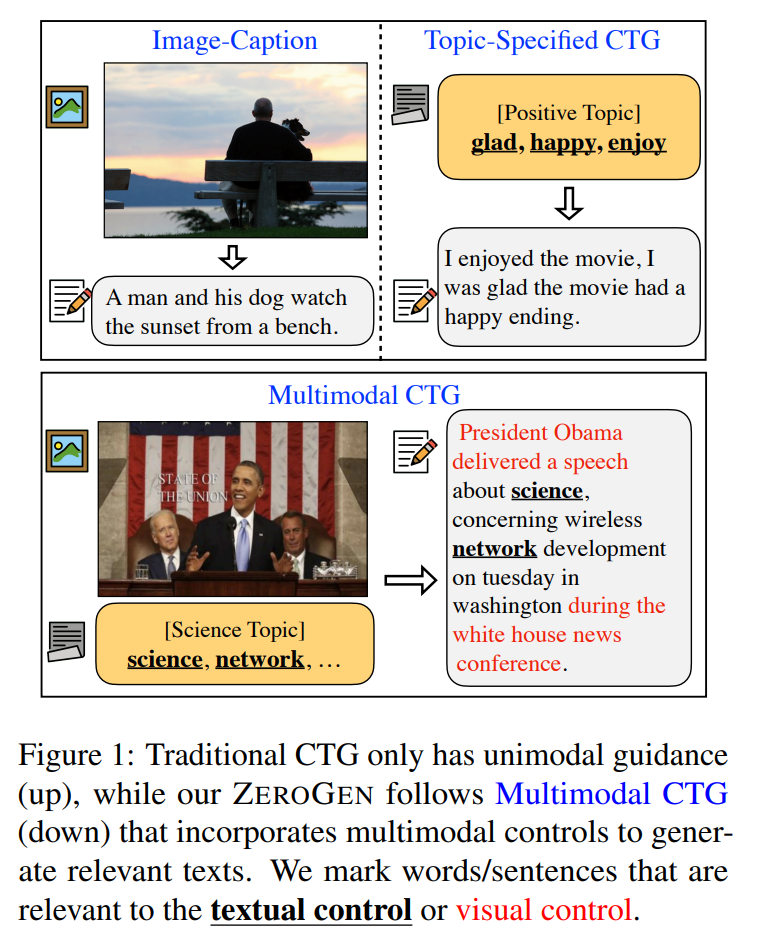
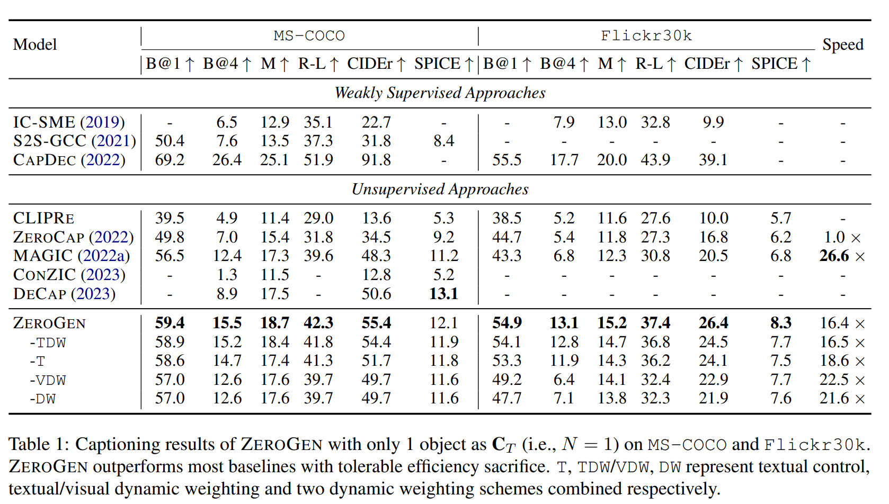
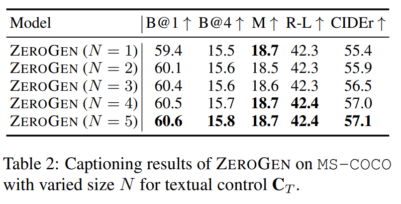
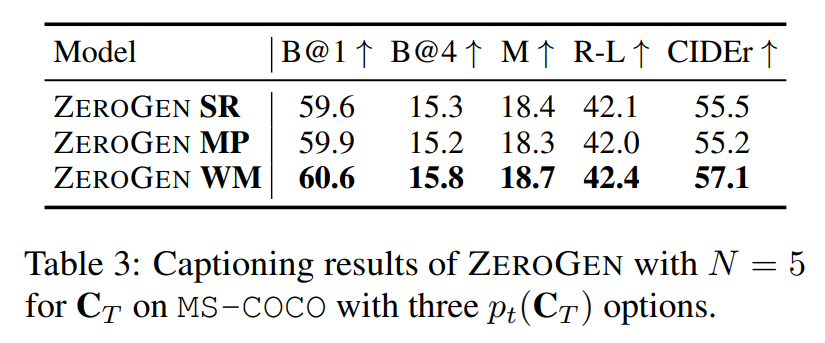
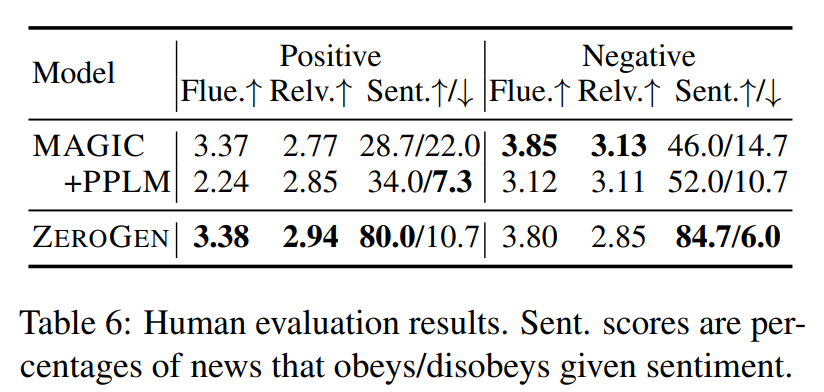
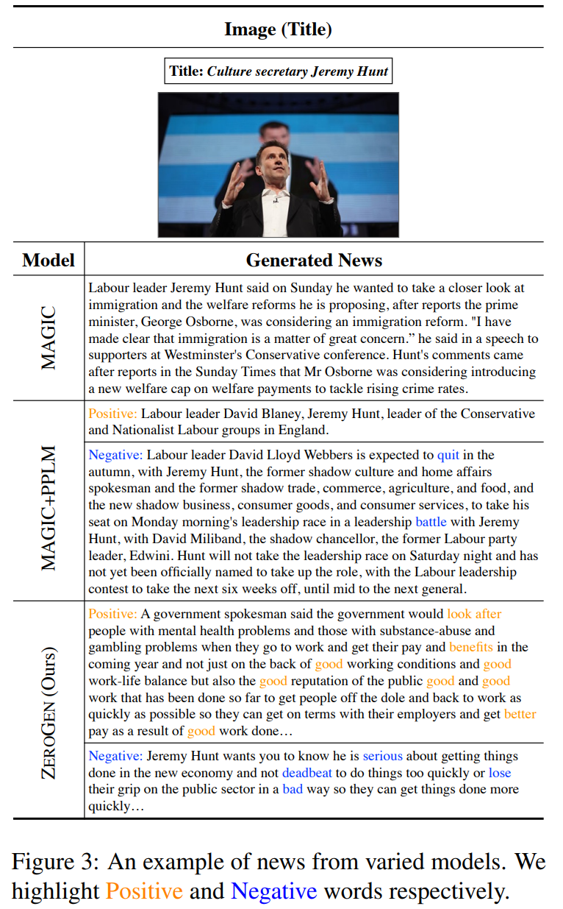

논문 및 이미지 출처 : <https://arxiv.org/pdf/2306.16649>

# Abstract

원하는 속성을 가진 textual content 를 자동으로 생성하는 것은 오랫동안 연구되어 온 도전적인 task 이다. 기존 work 들은 unimodal control 을 language models (LMs) 에 통합하는 데 있어 상당한 progress 를 이루었으나, multimodal signal 을 사용하면서도 높은 efficiency 를 유지하여 controllable sentence 를 생성하는 방법은 여전히 open question 으로 남아 있다.

이 문제를 해결하기 위해, 저자는 multimodal signal 을 사용하는 zero-shot controllable text generation 의 새로운 paradigm 인 **ZeroGen** 을 제안한다. 

* 구체적으로, ZeroGen 은 text 와 image 의 control 을 token-level 에서 sentence-level 까지 순차적으로 활용하고, decoding 시 이들을 unified probability space 로 mapping 하여, 추가적인 training 없이도 weighted addition 을 통해 LM outputs 를 사용자 요구에 맞게 조정한다. 
* 더 나은 inter-modal trade-off 를 달성하기 위해, 저자는 모든 control weight 를 조절하는 효과적인 dynamic weighting mechanism 을 추가로 도입한다.
* 또한, 저자는 서로 다른 modality 로부터 오는 signal 들 사이에서 in-depth 와 in-width 의 관계를 탐구하기 위해 다양한 experiment 를 수행한다. 
* 세 가지 downstream task 에 대한 고무적인 empirical result 는, ZeroGen 이 captioning task 에서 기존 방법들을 큰 폭으로 능가할 뿐만 아니라, 더 높은 degree 의 control 을 갖는 multimodal news generation 에서도 큰 잠재력을 보인다는 것을 보여 준다.

# 1 Introduction

Large-scale pre-trained models (PTMs) 는 최근 큰 성공을 거두며 AI 분야의 milestone 이 되었다. 정교한 pre-training objective 와 거대한 model parameter 덕분에, PTMs 는 다양한 downstream task 에 Oracle 과 같이 도움을 줄 수 있다. language domain 에서 pre-trained language models (PLMs) 는 controllable text generation (CTG) 을 포함한 다양한 generation task 의 cornerstone 이 되었다. 특정 linguistic attribute 의 presence 를 control 함으로써, 이러한 PLMs 는 length, topic 등의 원하는 측면을 갖는 text 를 생성하도록 training 될 수 있다. 

전통적인 접근은 보통 supervision (e.g., fine-tuning) 을 통해 conditional LM 을 구성하지만, 가능한 조합이 combinatorially 많고 annotated data 가 부족하다는 점에서 scalability 가 떨어진다. 최근 work 들은 “plug-and-play” (PnP) solution 에 주목하기 시작했다. 이러한 technique 은 PLM 에 임의의 restriction 을 plug 하여 원하는 sentence 생성을 guide 하며, 필요한 training 비용도 매우 적다. 그러나 이 paradigm 의 control signal 은 일반적으로 keyword 나 topic 과 같은 unimodal domain 에 제한되어 있다.

최근 PnP 방식은 multimodal knowledge 로까지 확장되고 있으며, pre-trained multimodal model (e.g., CLIP) 을 vision-only control 로 활용하여 captioning 과 같은 cross-modal task 에 적용하는 work 들이 등장했다. 이러한 접근들은 task-oriented training 을 최소화하거나 아예 사용하지 않으면서도 뛰어난 성능을 보였다.

한편, 인간의 의미 있는 상호작용은 종종 real-world experience 를 필요로 하며, text-only instruction 만으로는 이러한 communication 목적을 완전히 충족하기 어렵다. 그 결과, CTG 를 위해 unimodal control 만 사용하는 것은 현재 PLM 을 안정적으로 제어하는 방식과 실제 시나리오(e.g., Fig. 1 의 multimodal controlled news generation) 사이에서 충돌을 일으킬 수 있다. 또한 keyword-guided PnP work 의 일부와 달리, visual guidance 를 language generation 에 통합하는 기존 방식은 LM decoding 과정의 dynamic 한 특성을 고려하지 않고 decoding 동안 constant control 을 삽입하므로 task under-performance 로 이어질 수 있다.

이러한 한계를 극복하기 위해, 저자는 기존 unimodal PnP paradigm 을 multimodal setting 으로 확장한 **ZeroGen** 을 제안한다. 

* multimodal CTG 를 위해, 서로 다른 domain 으로부터의 input 은 text 내에서 서로 다른 granularity 의 presence 에 영향을 준다는 점에 주목한다. 
* Fig. 1 에서 보이듯이, textual control 은 관련 keyword 를 제시하여 생성된 news 를 science topic 방향으로 steer 하지만, visual control 은 sentence description 을 제공함으로써 더 풍부한 ambient information 을 제공한다.

이러한 multimodal signal 을 plug 하기 위해, 저자는 Oracle 들로부터 얻은 token-level 또는 sentence-level similarity 를 통해 control 을 LM output probability 에 unify 하는 방식을 제안한다. 구체적으로:

* textual guidance 는 decoding 전에 textual Oracle 로부터 keyword 와 LM vocabulary 사이의 token-level similarity 로 간주하여 generation 시 LM output 에 weighted addition 으로 반영한다.
* visual guidance 는 multimodal Oracle 이 결정한 sentence-level probability 를 기반으로 한 multimodal score 를 사용한다.
* 최종적으로 beam search 를 통해 각 decoding step 에서 가장 높은 score 의 token 을 찾는다.

또한 LM decoding 과정의 dynamic 한 특성에 적응하고 model performance 를 향상하기 위해, 저자는 word-level 에서 작동하는 dynamic weighting mechanism 을 제안한다. 이 방식은 visual information 표현을 강화하면서도 output fluency 를 유지한다.

ZeroGen 을 활용하여 저자는 세 가지 task (image captioning, stylized captioning, controllable news generation) 를 수행한다. 저자는 textual control 과 visual control 이 vertical 또는 lateral 관계를 갖는지 탐구한다.

* captioning task 에서는 image 의 textual object 들이 visual signal 의 보완 요소로 기능하여 vertical extension 을 이룬다.
* news generation 에서는 positive 또는 negative word 의 집합을 사용하여 생성된 news 가 특정 sentiment 를 갖도록 하며, 이는 lateral extension 에 해당한다.

automatic metric 과 human evaluation 모두에서 얻어진 결과는, ZeroGen 이 captioning 에서 기존 방식보다 우수할 뿐 아니라, 높은 degree 의 control 을 갖는 multimodal news generation 에서도 큰 잠재력을 가진다는 것을 보여 준다.

**Contributions.**

1. 저자는 zero-shot setting 의 multimodal controllable text generation task 를 탐구하고, 이를 위해 token-level 및 sentence-level multimodal guidance 를 활용하는 ZeroGen 을 제안한다.
2. 저자는 word-level 에서 작동하며 다양한 modality 에 적용 가능한 dynamic weighting scheme 을 제시하고, 이를 통해 생성 text 의 fluency 및 controllability 를 향상시킨다.
3. 두 captioning task 와 controllable news generation task 에 대한 extensive experiment 는 ZeroGen 의 효과를 입증하며, modality control 간의 관계 역시 규명한다.

# 2 Related Work

Efficient Image Captioning. supervised captioning 이 대량의 paired image-text data 를 필요로 한다는 점은 실제 상황에서는 비현실적이다. 이러한 large-scale paired image-text data 의 의존성을 줄이기 위한 다양한 시도가 이루어져 왔다. 예를 들어, 일부 work 은 주어진 image 로부터 object 를 추출하여 model training 에 통합하는 방식을 사용했다. supervised method 에 비해 효율적이지만, 여전히 부분적인 cross-modal guidance 를 supervision 으로 사용하여 training 해야 한다는 한계를 가진다. vision-language alignment 의 milestone 인 CLIP 은 다양한 multimodal generation task 에서 impressive 한 zero-shot capability 를 보여 주었다.

* 예를 들어, Tewel et al 은 CLIP 과 base LM (i.e., GPT-2) 를 이용한 최초의 zero-shot captioning model 을 제안했다. 
  * 이 방법은 CLIP guidance decoding 방향에 따라 model 의 transformer cache 를 지속적으로 update 하지만, generation 중 gradient computation 과 optimization 이 필요해 추가 generation overhead 가 발생한다. 
* Su et al 은 CLIP 기반 token decoding score 를 활용하여 task-specified training 없이도 plausible caption 을 생성하는 MAGIC 을 제안했다. 
* 가장 최근에는 Nukrai et al. 이 text-only training 에 소량의 image 로 parameterize 된 gaussian noise 를 사용하는 방식으로 CLIP 과 base LM textual embedding 을 연결하는 방법을 제안했지만, 여전히 training 중 일정량의 external visual knowledge 가 필요하다.

저자의 model 인 ZeroGen 은 MAGIC 을 확장하여 multimodal guided generation 을 위한 추가 capability 와 dynamic weighting 을 제공한다. 이는 여러 downstream application 을 지원하면서도 서로 다른 base LM 으로 transfer 될 수 있는 능력을 유지한다. 아주 최근의 work 은 language decoding 과정에서 sample-based sequential polishing 을 수행하여 plausible 하고 fluent 한 caption 을 생성하는 방법을 제안했다.

PnP Controllable Text Generation. PLM 을 CTG task 에 맞게 fine-tuning 하는 과정에는 과도한 training cost 가 필요하므로, 연구자들은 Dathathri et al. 이 제안한 “plug-and-play” (PnP) framework 와 같은 specialized training-free method 에 주목하기 시작했다. 이 framework 는 기존 generative LM (base LM) 과 함께 사용할 수 있으며, PnP component 와 base LM 사이에서 최소한의 training 혹은 전혀 training 없이 작동한다. 전통적 방법과 비교하면, 이러한 PnP 접근은 보통 두 가지 측면을 따른다.

* **In-model guidance approach**: “prompt tuning” 과 같이 base LM 에 입력되는 prompt 나 추가 parameter 를 최적화하거나, base LM 중간에 trainable model 을 삽입하여 input/output layer 가 아닌 hidden representation 을 조정하는 방식이다.
* **Out-model guidance technique**: 반대로 base LM 의 output probability 만을 inference time 에 수정하여 controllable language model 을 구축하는 방식이다.

저자의 ZeroGen 은 이 마지막 category 에 속하며, LM decoding 단계에서만 control signal 을 부여한다.

# 3 ZeroGen Methodology

multimodal CTG task 를 다음과 같이 정의한다. visual control $C_V$ (i.e., image) 와, topic 또는 image 로부터 얻은 $N$ 개의 representative word 로 이루어진 textual control $C_T = \{ C_{T_1}, ..., C_{T_N} \}$ 이 주어졌을 때, 두 control 요소를 동시에 만족하는 textual output $X = \{ x_1, x_2, ... \}$ 을 생성하는 것이 목표이다.

* ZeroGen 은 base LM 의 output probability space 에 초점을 맞춘다. 
* Fig. 2 에 나타난 바와 같이, decoding step $t$ 에서 모델은 먼저 original LM output probability $p_{\text{LM}}$ 를 keyword–vocabulary similarity 에 기반한 token-level textual guidance 로 조정하여 $p_{\text{LM}}'$ 를 얻는다. 
* 이후 sentence-level multimodal scoring function 및 beam search 를 통해 단어 탐색을 수행한다. 
* Pascual et al. 의 방식과 달리 token similarity 를 decoding 중 반복 계산하지 않고, decoding 이전에 단 한 번 계산하여 옵션과 함께 전체 textual control 로 변환한다. 
* 마지막으로 word-level 에서 dynamic weighting scheme 을 적용하여 매 generation step 에서 두 control weight 를 조절한다.

## 3.1 Token-level Textual Guidance

특정 topic 에 해당하는 keyword 의 등장 여부가 생성되는 sentence 를 해당 방향으로 유도할 수 있으므로, LM token 과 $C_T$ 내 keyword 사이의 token-level similarity 를 textual guidance 로 사용한다. 추가적 computational cost 를 피하기 위해, textual control 을 base LM vocabulary 공간에서 keyword 와 vocabulary 간 cosine similarity 로 표현한다. textual Oracle $\phi_T$ (e.g., pre-trained word embedding) 을 사용하여 다음과 같이 얻는다.

$$
p(V, C_T) = \{ \cos(\phi_T(V), \phi_T(C_T^{n})) \}_{n=1}^{N},
$$

* 여기서 $p(V, C_T) \in \mathbb{R}^{N \times V}$, 
* $V$ 는 vocabulary size 이다.

$N > 1$ 인 경우, 모든 keyword 를 활용하기 위해 step $t$ 에서 다음 세 가지 selection 방법 중 하나를 사용하여 overall textual control $p_t(C_T) \in \mathbb{R}^{V}$ 를 구성한다.

* **Step-wise Random (SR)**: generation 동안 변화하는 control 을 제공한다. 매 step 마다 $p(V, C_T)$ 로부터 하나의 keyword–vocabulary similarity 를 uniform sampling 한다.
* **Mean Pooling (MP)**: 직관적으로, 모든 keyword 에 대한 similarity 를 vocabulary 기준으로 평균하여 textual 정보를 모두 반영한다.
* **Word-wise Max (WM)**: vocabulary 의 각 token $w$ 에 대해 가장 유사한 keyword 를 선택하고(최대 cosine similarity), 이를 토대로 $p_t(C_T)$ 를 구성한다.

선택 방법을 거쳐 얻어진 textual control $p_t(C_T)$ 는 다음과 같이 LM output 에 weighted bias 로 추가된다: $p'^{\text{LM}}_t = p^{\text{LM}}_t + \alpha \times p_t(C_T)$.

## 3.2 Sentence-level Visual Guidance

image information 은 단일 단어보다 훨씬 일반적이고 높은 수준의 global information 을 담고 있으므로, Sec. 1 에서 논의한 바와 같이 sentence-level similarity 를 visual guidance 로 사용한다.

Su et al. 의 방식에 따라, $t$ 번째 step 에 대해 단어 $w \in V$ 에 대한 weighted visual guidance scoring function $S_t$ 를 정의하고, beam search 를 사용하여 decoding 을 수행한다.

$$
\begin{aligned}
    &S_t(w, C_V \mid x_{<t}, W_t^{(k)}) = \\
&\begin{cases}
p'_{\text{LM}_t}(w \mid x_{<t}) +
\beta \times
\frac{e^{p_{\phi_M}([x_{<t}; w], C_V)}}
{\sum_{z \in W_t^{(k)}} e^{p_{\phi_M}([x_{<t}; z], C_V)}},
& w \in W_t^{(k)} \\
-\infty, & \text{otherwise}
\end{cases}
\end{aligned}
$$

* 여기서 $[x_{<t}; w]$ 는 현재까지 생성된 문장 뒤에 token $w$ 를 append 한 sequence 를 의미하며, 
* $W_t^{(k)}$ 는 $p'_{\text{LM}_t}$ 상위 $k$ 개 단어로 구성된 beam 이다. 
* multimodal Oracle $\phi_M$ (e.g., CLIP) 을 활용하여 다음과 같은 similarity 를 계산한다: $p_{\phi_M}([x_{<t}; w], C_V) = \cos(\phi_M([x_{<t}; w]), \phi_M(C_V))$.

최종적으로 다음을 만족하는 token 을 선택한다: $x_t = \argmax_{w \in V} S_t(w, C_V \mid x_{<t}, W_t^{(k)})$.

## 3.3 Multimodal Dynamic Weighting

model performance 를 추가로 향상시키고 generation 과정의 dynamic 한 특성에 적응하도록 하기 위해, step-wise 로 multimodal weight 를 조정하는 dynamic weighting mechanism 을 제안한다. 이를 위해 고정 weight $\alpha, \beta$ 대신 step-dependent weight $\alpha_t, \beta_t$ 를 사용한다. design 시 다음 원칙을 고려한다.

1. textual control 과 original LM modeling 사이의 적절한 balance 를 찾지 않으면 output 이 incoherent 해질 수 있다.
2. generation 과정에서 visual 관련 단어는 강화하고, 관련 없는 단어는 억제해야 한다. LM 의 최소 이해 단위가 word 이므로 word-level 에서 조정한다.

#### Dynamic $\alpha_t$

original LM 의 modeling 능력을 보존하면서 textual guidance 를 최대한 활용하기 위해, 변화하지 않은 LM output probability $p^{\text{LM}}_t$ 로부터 keyword probability 의 평균을 계산하여 step $t$ 의 weight 로 사용한다.

$$
D_T = \sum_{n=1}^{\hat{N}}\frac{p_{\text{LM}_t}(C_{T_n}\mid x_{<t})}{\hat{N}},\ \alpha_t = \min\left(\frac{D_T}{\lambda}, \hat{\alpha}\right). 
$$

* $D_T$ 가 높다는 것은 base LM 이 keyword 생성에 높은 confidence 를 가진다는 의미이므로 fluency 를 해치지 않으면서 controlled text 생성이 가능하다.

#### Dynamic $\beta_t$

visual control 과 강하게 관련된 word 후보가 등장하는 generation stage 를 강화하고, 그렇지 않은 경우 패널티를 주기 위해 beam candidate 와 image control 간 similarity 를 평균한다.

$$
D_V = \sum_{w\in W_t^{(k)}} \frac{p(w,C_V)}{k},\ \beta_t = \min \left(\frac{D_V}{\lambda}, \hat{\beta}\right).
$$

* $D_V$ 가 높으면 beam 후보들이 $C_V$ 와 강한 연관을 가지므로 더 적극적으로 표현되어야 한다.

Gu et al. 의 방식에서 영감을 받아, $\lambda$ 는 control signal amplification threshold 로 사용되며, $D_V$ 또는 $D_T$ 가 이를 넘으면 weight 을 강화하고, 그렇지 않으면 억제한다. $\hat{\alpha}, \hat{\beta}$ 는 upper bound 이다.

# 4 General Implementations and Baselines

#### General Implementations

* 저자는 SimCTG 를 base LM 으로 사용하고, 기존 work 과 동일하게 모든 dataset 에 대해 text-only data 로 먼저 fine-tuning 한다. 
* ZeroGen 은 zero-shot paradigm 을 따르므로, 어떤 off-the-shelf LM 과도 결합하여 “pair of eyes” 를 부여할 수 있다. 
* Oracle 로는 textual Oracle $\phi_T$ 로 GloVe 를, multimodal Oracle $\phi_M$ 으로 CLIP 을 사용한다. 
* $\alpha_t$ 계산 시 사용하는 $\hat{N}$ 은 두 captioning task 에서는 $N$ 전체를 사용하고, controllable news generation 에서는 ablation study 결과 $2$ 로 설정한다. 
* amplifying factor $\lambda$ 는 전체 실험에서 0.2 로 고정한다. full model detail 은 Appendix A 에 기술되어 있다.

#### Baseline Models

image captioning task 에서는 weakly supervised 방법과 unsupervised 방법을 모두 baseline 으로 선택한다.

1. Weakly supervised approaches
   * IC-SME
   * S2S-GCC
   * CAPDEC \
     첫 두 방식은 pseudo caption 에 visual feature 를 align 하는 neural network module 을 적응시키며, CAPDEC 은 CLIP guidance 와 소량의 image 를 training 과정에 도입한다.
2. Zero-shot methods
   * CLIPRE
   * ZEROCAP
   * MAGIC \
     이들은 각각 retrieval 방식, CLIP-guided gradient update, CLIP-based decoding scheme 에 해당한다. 공정한 비교를 위해 ZEROCAP 과 MAGIC 에 동일한 base LM 을 사용한다.

stylized captioning 에서는 MEMCAP 도 추가 baseline 으로 고려한다.

controllable news generation task 에서는 MAGIC 과 MAGIC+PPLM 을 baseline 으로 사용한다. MAGIC+PPLM 은 image 와 keyword 를 입력으로 받는 두 기존 PnP work 을 조합한 방식이다. PPLM 은 controllable PnP LM 의 최초 모델이며, decoding 단계 동안 hidden state 에 gradient descent 가 필요하다.

# 5 Experiments and Analysis

## 5.1 Image Captioning

#### Dataset and Metrics

MS-COCO 와 Flickr30k 를 Karpathy split 으로 사용한다. visual control $C_V$ 는 captioning task 의 image, textual control $C_T$ 는 image 에 포함된 textual object 로 설정한다. 평가에는 B@1, B@4, METEOR, ROUGE-L, CIDEr, SPICE 등 다섯 개의 relevance-based metric 을 사용한다. 또한 decoding speed 도 비교한다.

#### Main Results

두 modality control 이 모두 이미지 content 이해와 caption 품질 향상을 목표로 하므로, 이 task 에서 $C_T$ 는 $C_V$ 의 vertical augmentation (즉, 보완 정보) 로 간주된다.

Tab. 1 에 따른 주요 결론은 다음과 같다.

1. ZeroGen 은 unsupervised baseline 과 대부분의 weakly supervised 방법(CAPDEC 제외)보다 큰 폭으로 우수한 성능을 보인다.
   * 이는 제안된 방법의 강점을 명확히 보여 준다.
2. textual guidance 는 visual guidance 의 vertical augmentation 으로서 추가 정보를 제공하며, CIDEr 기준 두 dataset 에서 2 point 이상 성능 향상을 가져온다.
3. dynamic weighting 기법은 특히 VDW 가 model capacity 를 강화한다.
   * 이는 image 에서 인식된 특정 token 의 등장 확률을 직접 최적화하는 효과 때문이다.
4. efficiency 측면에서는 MAGIC 보다 느리지만 ZEROCAP 보다 훨씬 효율적이다.
   * multimodal control 및 dynamic weighting 계산이 추가되기 때문이며, ZEROCAP 처럼 gradient 계산이 필요하지 않다는 점은 장점이다.

Appendix B.3 의 cross-domain evaluation 은 ZeroGen 의 domain robustness 를 추가로 검증한다.

#### Number of Objects in $C_T$

더 많은 object 가 항상 더 좋은가? 이를 검증하기 위해 MS-COCO 에서 $C_T$ 의 object 수 $N$ 을 변화시키며 WM 방법을 사용해 실험하였다. 

* Tab. 2 에 따르면 object 수가 증가할수록 대부분의 metric 에서 성능이 향상되며, 이는 captioning task 에서 textual object 정보가 중요한 역할을 한다는 것을 보여 준다. 동일한 현상은 Flickr30k 실험(appendix B.1) 에서도 확인된다.

#### $p(C_T)$ Selection Method

* Tab. 3 에 따르면 가장 효과적인 $p(C_T)$ selection 방법은 **word-wise max (WM)** 이다. 
* WM 은 vocabulary 내 관련 token 전체에 대해 textual object 를 보다 선명하게 강조하기 때문이다. 
* mean pooling(MP) 역시 모든 keyword 를 고려하지만, 각 keyword 를 동일한 비중으로 처리하기 때문에 token similarity 계산 및 output controlling 에 bias 를 유발할 수 있다. 따라서 이후 모든 실험에서는 WM 을 사용한다.

## 5.2 Stylized Captioning

모델이 “romantic”, “humorous” 와 같은 다양한 style 에 적응할 수 있는 충분성을 탐구하기 위해, 저자는 Nukrai et al. 의 설정을 따라 base LM 에 stylized-text fine-tuning 을 수행하여 stylized captioning 을 실험한다.

#### Dataset and Metrics

이 task 에서도 image 로부터 추출한 textual object 를 $C_T$ 로 사용하며, FlickrStyle10k dataset 에 대해 기존 work 과 동일한 실험 설정을 따른다. metric 은 Sec. 5.1 과 동일한 지표를 사용한다. 추가 detail 은 Appendix A.3 에 제시되어 있다.

#### Main Results

Tab. 4 의 정량적 결과는 다음과 같은 결론을 보여 준다.

1. ZeroGen 은 두 stylized data(Romantic, Humorous) 중 대부분에서 baseline 을 능가한다.
   * 특히 weakly supervised CAPDEC (Romantic) 와 task-oriented training 을 사용하는 MEMCAP 보다 우수한 결과를 보인다.
2. Humorous data 일부 metric 에서 CAPDEC 보다 낮은 성능을 보이지만, ZeroGen 은 더 fluent 하고 plausible 한 caption 을 생성하며 B@3 score 가 일관적으로 더 높다.
3. textual guidance 는 두 stylized set 모두에서 성능 향상에 큰 기여를 하며, multimodal guidance 의 효과를 확인시킨다. (model -T 와 비교)

## 5.3 Controllable News Generation

textual guidance 는 visual knowledge 의 보완 요소뿐 아니라 lateral extension 으로도 작동할 수 있다. 이 task 에서 textual control 은 news sentiment 조절을 위해 사용하고, visual control 은 image-relevant news 생성을 위해 사용한다.

#### Dataset and Metrics

실험은 VisNews dataset 에서 수행한다. base LM(SimCTG) 은 news data 로 fine-tuning 하며, news title 을 input prompt 로 사용한다. sentiment guidance 를 위해 Dathathri et al. 의 방식에 따라 두 sentiment 에 해당하는 word list 를 구성한다.

평가는 다음 네 측면을 포함한다.

* **diversity**: Distinct-2 (D-2), Distinct-4 (D-4)
* **image-text relevance**: CLIP score (C-S)
* **control degree**: $\Delta$Acc (%) — 생성된 문장과 human-written news 사이 accuracy gain
* **fluency**: perplexity (PPL)

human evaluation 은 다음 세 기준을 따른다.

* Fluency (Flue.)
* Relevance (Relv.)
* Sentiment control (Sent.)

평가는 double-blind 절차로 수행되며 세 명의 annotator 는 model 정보를 알지 못한다. 각 model 당 100 instance 를 샘플링한다.

#### Main Results

Tab. 5 의 결과는 다음 결론을 제시한다.

1. ZeroGen 은 모든 통계에서 가장 높은 classification accuracy gain 을 달성하고, 경쟁력 있는 CLIP score 를 기록한다.
   이는 multimodal supervision 아래에서 controllable output 을 성공적으로 생성할 수 있음을 보여 준다.
   다만 diversity 가 감소하는 경향이 있는데, 이는 trade-off 로 해석된다.
2. dynamic weighting 은 전반적인 model 성능을 향상시킨다.
   * VDW 는 image 와 news content 간 연결성을 강화하여 더 높은 CLIP score 를 유도한다.
   * TDW 는 sentiment control 을 강화하면서도 content diversity 를 희생하지 않는다.
     이 결과는 multimodal dynamic weighting 이 두 modality 가 서로 보완적이지 않아도 효과적으로 작동함을 의미한다.
3. external control 은 PPL을 약간 증가시켜 output confidence 를 낮추지만, ZeroGen 은 MAGIC+PPLM 보다 훨씬 낮은 PPL 을 기록한다.
   또한 dynamic weighting 의 일부가 없는 버전(-VDW 등)조차 controllability 와 diversity 에서 MAGIC+PPLM 을 능가한다.
4. ZeroGen 은 task-oriented training 을 필요로 하지 않으며, decoding efficiency 면에서 MAGIC+PPLM 대비 약 10배 빠르다.

human evaluation 결과(Tab. 6) 역시 위의 결론을 지원하며, fluency, relevance, sentiment control 모두에서 ZeroGen 의 강점을 확인할 수 있다.

#### Effect of $\alpha$ Upper Bound

이 task 에서 sentiment manipulation 의 유일한 source 는 $C_T$ 이며, 그 upper bound $\hat{\alpha}$ 은 output sentence 의 sentiment 구분 가능성을 결정한다. 

* Tab. 7 에서 보이듯이, $\hat{\alpha}$ 가 증가하면 accuracy 와 fluency 모두에서 큰 향상이 나타난다. 
* 그러나 text diversity 와 image relevance 지표들은 급격히 감소한다. 
* 이는 sentiment 로부터 오는 guiding information 이 증가할수록 model 이 이미지와의 연관성이나 표현 다양성을 희생하고, 원하는 sentiment 를 표현하는 데만 치우치기 때문이라고 설명할 수 있다. 
* 사용자 측에서는, task 상황에 맞추어 $\hat{\alpha}$ 를 조정함으로써 이러한 trade-off 를 유연하게 관리할 수 있다.

#### $C_T$ Plays Two Roles

앞서 $C_T$ 가 complement (captioning) 또는 additional control element (news generation) 로서 어떤 기능을 하는지 검증했다. *그렇다면 두 역할을 동시에 잘 수행할 수 있는가?*

이를 확인하기 위해, 저자는 ZeroGen 에 image object 와 sentiment word 를 모두 textual guidance 로 제공하는 실험을 수행했다. object 기반 guidance 를 포함한 방법은 “w/ obj” 로 표기된다. 결과적으로 “w/ obj” 모델은 더 높은 CLIP score 를 기록하지만, accuracy 와 PPL 은 object guidance 가 없는 경우보다 전반적으로 더 낮아졌다. 이는 $\hat{\alpha}$ 조정으로 완화될 수 있지만, 결과적으로 $C_T$ 가 complement 와 lateral extension 두 역할을 동시에 수행할 경우 혼란이 발생함을 의미한다.

#### Case Analysis

Fig. 3 의 예시는 controllable news generation 결과를 보여 준다. 

* 이미지에는 문화부 장관 Jeremy Hunt 가 연설하는 장면이 나타나 있다. 모든 방법은 image/title 과 관련된 문장을 생성하지만, MAGIC+PPLM 은 Jeremy Hunt 를 “leader of Conservative and Nationalist Labour groups” 로 잘못 인식하는 등 false evidence 를 포함한다. 
* 반면 ZeroGen 은 긍정의 경우 “good”, “benefits”, 부정의 경우 “deadbeat”, “lose” 와 같은 보다 다양한 controllable word 를 생성하는 반면, MAGIC+PPLM 은 이러한 controllability 를 구현하지 못한다. 추가 사례는 Appendix C 에 제시되어 있다.

# 6 Conclusion

본 논문에서는 multimodal signal 을 이용한 zero-shot controllable text generation paradigm 인 **ZeroGen** 을 제안한다. 

* 저자는 visual control 과 textual control 을 각각 sentence-level 및 token-level guidance 로 명확히 분리하고, 두 Oracle 을 사용하여 control signal 을 LM output probability space 로 통합한다. 
* 또한 모든 multimodal control 에 적응하는 dynamic weighting mechanism 을 도입하여 generation 성능을 더욱 향상시킨다. captioning 부터 controllable news generation 에 이르는 세 가지 task 에 대한 실험은 ZeroGen 의 효과성을 입증하고 modality 간 신호의 관계를 탐구하는 데 도움을 준다. 
* 저자는 multimodal knowledge 를 제공함으로써 task-specified training 없이도 LM 이 다양한 domain 과 setting 에 걸쳐 뛰어난 multimodal 성능을 달성할 수 있음을 보였다.

# 7 Limitations

ZeroGen 은 zero-shot controllable text generation 을 성공적으로 달성했음에도 불구하고, 향후 해결해야 할 몇 가지 제한점이 존재한다.

1. weakly supervised 방법과 fully supervised 방법 사이의 성능 격차가 여전히 크다.
   * 저자가 활용한 large-scale pre-trained Oracle 이 가진 풍부한 semantic information 을 통해 이 격차를 더 줄일 수 있을 것으로 기대한다.
2. controllable news generation task 에서 diversity 가 충분하지 않다.
   * 이는 zero-shot 연구 전반에 존재하는 일반적인 문제로, 다양한 language decoding scheme 이나 adapter 등의 부분적 training parameter 를 도입하여 개선할 계획이다.
3. spurious correlation 이 일부 bad case 에 여전히 존재한다.
   * Appendix C 에 나타난 사례처럼 nonnegligible 한 문제이며, 향후 causal inference 를 활용하는 방향으로 해결을 모색할 예정이다.
