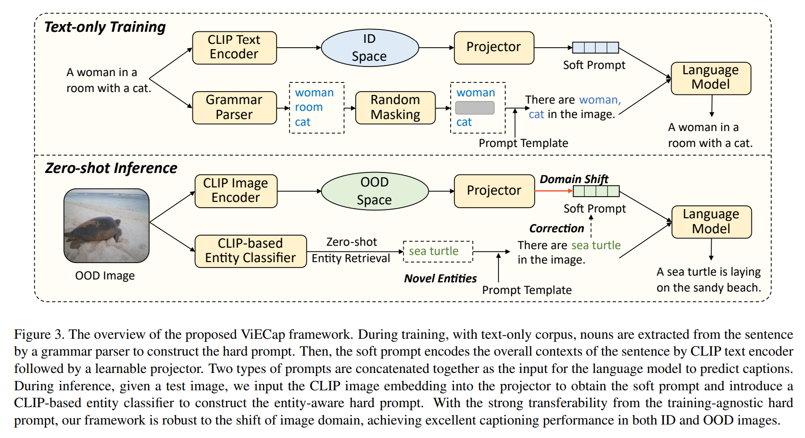
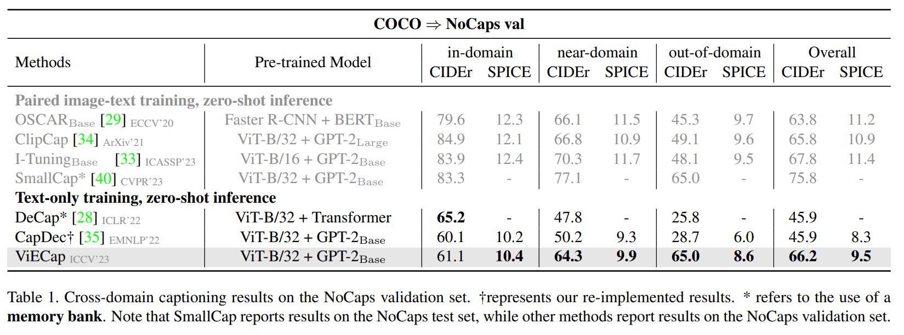
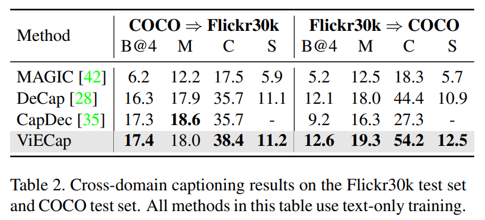
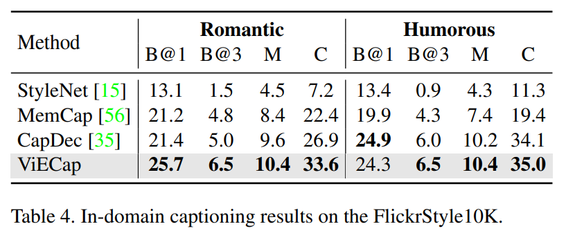
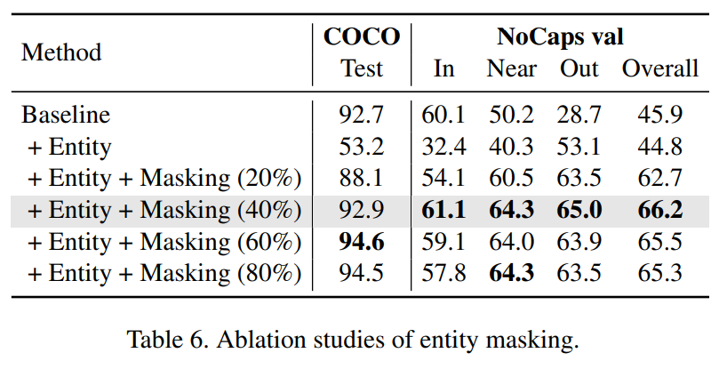
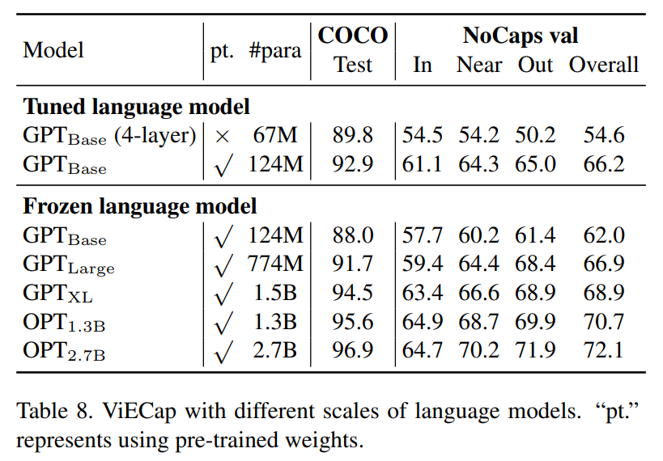

논문 및 이미지 출처 : <https://arxiv.org/pdf/2307.16525>

# Abstract

Image-to-text generation 은 이미지 를 natural language 로 서술하는 것을 목표로 한다. 최근 pre-trained vision-language model (VLM) 과 large language model (LLM) 기반 zero-shot image captioning 이 큰 발전을 이루었다. 그러나 저자는 이러한 방법들이 LLM 에 의해 유도된 modality bias 에 취약하며, 실제 이미지 에 존재하지 않지만 training 동안 자주 등장한 object (entity) 를 포함하는 description 을 생성하는 경향이 있음을 관찰하고 실증적으로 보였다 (i.e., object hallucination).

본 논문에서 저자는 **ViECap** 을 제안한다. 

* ViECap 은 seen 및 unseen scenario 모두에서 description 을 생성하기 위해 entity-aware decoding 을 활용하는 transferable decoding model 이다. 
* ViECap 은 이미지 에 존재하는 visual entity 로 LLM 의 attention 을 유도하기 위해 entity-aware hard prompt 를 도입하며, 이를 통해 다양한 scene 전반에 걸쳐 일관된 caption 생성을 가능하게 한다. 
* Entity-aware hard prompt 를 사용함으로써 ViECap 은 in-domain 에서 out-of-domain scenario 로 transfer 할 때 도 성능을 유지할 수 있다.

광범위한 experiment 를 통해 ViECap 이 cross-domain (transferable) captioning 에서 새로운 state-of-the-art 를 달성하고, 기존 VLM 기반 zero-shot 방법들과 비교했을 때 in-domain captioning 에서도 경쟁력 있는 성능을 보인다는 것을 보여준다.

# 1. Introduction

Large-scale pre-trained vision-language model (VLM) 인 CLIP 과 ALIGN 은 다양한 discriminative downstream task (e.g., classification, segmentation, detection) 에서 인상적인 zero-shot transferability 를 보여준다. 그러나 이러한 pre-trained VLM 을 text 및 image generation 과 같은 zero-shot generative task 로 효과적으로 adaptation 하는 것은 여전히 추가 탐구가 필요한 open question 이다. 

최근 일부 연구는 GPT 와 같은 large language model (LLM) 을 활용해 CLIP 기반 zero-shot image-to-text generation 을 달성했다. 이들은 word prediction 이 완료된 후 visual information 을 주입하는 late-guidance paradigm 을 따른다. 그러나 이 paradigm 에서 visual guidance 가 미약하여 modality bias 가 자주 발생한다. 즉, LLM 의 language prior 가 decoding process 를 지배하며 이미지 와 무관한 description 을 생성하게 된다. 

Fig. 1(a) 는 late-guidance decoding 이 만든 잘못된 예측을 보여준다. 예를 들어 “jump” 와 “cobblestone” 은 이미지 와 무관하지만, 예측된 단어 “skateboarder” 및 “snowy” 와의 연관성 때문에 최종적으로 생성된다. Fig. 1(b) 의 또 다른 예도 “donut” 과 “rocks” 가 visual guidance 보다는 language prior 에 의해 생성되었음을 보여준다.

Early-guidance 방법들은 visual prompt 를 text token 앞에 prefix 하여 LLM 의 word generation 에 명시적 guidance 를 제공한다. 일반적으로 visual prompt 는 CLIP image embedding 을 learnable projector 로 projection 하여 얻는다. 

* Early-guidance paradigm 은 modality bias 를 상당히 완화하고 image 와 generated caption 간 alignment 를 크게 향상시킨다. 
  * 그러나 learnable (soft) visual prompt 는 제한된 corpus 에서 training 할 경우 overfitting 되기 쉽고, 다양한 object (visual entity) 를 기술하는 능력이 저하된다. 
  * 이는 generated caption 에서 object hallucination 을 초래할 수 있다. 특히 이러한 model 을 training corpus 를 벗어난 unseen scenario 로 transfer 할 경우, novel entity 가 training corpus 에 자주 등장한 유사 entity 로 잘못 인식된다. 
* Fig. 1 에서 보이듯 early-guidance decoding 은 in-domain (ID) image 는 이해하지만 out-of-domain (OOD) image 에서는 실제 존재하지 않는 entity 를 hallucination 하는 경향이 있다 (e.g., “surfboard” 가 training corpus 에 자주 등장하므로 “sea turtle” 을 surfboard 로 hallucination). 
* 그 결과 well-learned CLIP latent space 의 transferability 가 현재 decoding 전략에서 심각하게 저하되어 real-world scenario 에서의 적용 가능성을 제한한다. 

Sec. 3 의 experiment 는 pre-trained VLM 과 LLM 을 image-to-text generation 에 adaptation 할 때 modality bias 및 object hallucination 문제가 실제로 발생함을 추가적으로 검증한다.

이러한 문제를 해결하기 위해 저자는 **ViECap** 을 제안한다. 

* ViECap 은 특정 training corpus 에 대해 soft prompt 를 학습하면서 발생하는 CLIP latent space degradation 을 보완하기 위해 entity-aware hard prompt 를 도입한다. 
* 이 방법은 CLIP 기반 entity classifier 가 ID 및 OOD image 모두를 정확히 분류할 수 있다는 관찰에 기반한다 (e.g., Fig. 1 의 “snowboard”, “sea turtle”). 
* Entity-aware hard prompt 는 CLIP latent space 로부터 transferable language decoding 을 가능하게 한다. 

Fig. 1 은 제안한 entity-aware decoding 이 다양한 image 에서 seen 및 unseen entity 를 모두 기술할 수 있음을 보인다. 

* 구체적으로 ViECap 은 CapDec 과 같은 early-guidance decoding 방법을 기반으로 한다. 
* 이러한 model 들이 training corpus 에 존재하는 entity 만 기술할 수 있는 반면, 저자의 model 은 다양한 scenario 에서 caption 을 생성할 수 있다. 
* CapDec 을 따르며 ViECap 은 text data 만으로 training 된다. 
* Entity-aware hard prompt 는 다양한 captioning scenario 로의 transferability 를 가능하게 하는 핵심 설계 요소이다. 
* Hard prompt 는 training 중 text 로부터 추출한 noun, 혹은 inference 중 image 로부터 retrieval 한 entity 로 구성되며, CLIP 에 기반한 open vocabulary retrieval 로 LLM 이 training-agnostic entity 에 attention 하도록 만든다. 
* 그러나 naive 한 entity 통합은 ViECap 이 copy-then-paste shortcut (i.e., entity 를 직접 caption 에 복사하는 방식) 을 학습하게 만든다는 점을 발견했다. 
* 이를 방지하기 위해 저자는 early-guidance decoding 에 entity-aware hard prompt 를 통합할 때 간단하지만 효율적인 entity masking 전략을 도입한다.

저자는 ViECap 을 네 개의 benchmark, NoCaps, COCO, Flickr30k, FlickrStyle10K 에 대해 광범위하게 평가했다. 

* Experiment 결과 ViECap 은 text-only method 중 모든 방법을 능가하며 cross-domain (transferable) setting 에서 새로운 state-of-the-art 를 달성했고, in-domain setting 에서도 기존 방법과 경쟁력 있는 성능을 유지했다. 
* Out-of-domain scenario (NoCaps) 에서 ViECap 은 DeCap 및 CapDec 대비 각각 39.2 및 36.3 의 큰 차이로 성능을 개선했다. 
* 일부 supervised method 보다도 우수한 성능을 보여 novel entity 에 대한 일반화 능력이 뛰어남을 입증한다. 
* FlickrStyle10K experiment 에서는 training set 의 style 에 대응하는 다양한 style 의 caption 을 효과적으로 생성한다. 
* 또한 data-efficient experiment 는 ViECap 이 low-data setting 에서도 적용 가능함을 보여주며, 다양한 scenario 에 걸쳐 model 의 versatility 와 effectiveness 를 강조한다.

정리하면, 저자의 contribution 은 다음과 같다:

1. 저자는 pre-trained VLM 과 LLM 을 image-to-text generation 으로 adaptation 할 때 generalizability 가 저하되는 원인인 modality bias 와 object hallucination 을 관찰하고 그 근본 원인을 분석하여 large-scale model adaptation 에 중요한 통찰을 제공한다.
2. 저자는 zero-shot captioning 의 transferability 를 향상시키기 위해 entity-aware decoding 을 도입한다. 구체적으로 VLM 의 도움을 받아 entity-aware hard prompt 와 entity masking 전략을 decoding process 에 통합하여 LLM 이 seen 및 unseen entity 모두에 attention 하도록 유도한다.
3. 광범위한 experiment 를 통해 ViECap 이 remarkable zero-shot transferability 를 보여주며, 특히 low-data scenario 에서도 효과적임을 입증한다.

# 2. Related Work

#### Supervision in Image Captioning

Image captioning model 은 training 중 image-text alignment information 이 제공되는지 여부에 따라 supervised 와 unsupervised 방법으로 구분된다. Supervised image captioning 방법은 paired (well-aligned) image-text data 로 training 되며 일반적으로 encoder-decoder architecture 를 채택한다. 

* 초기에는 다양한 vision backbone (e.g., CNN, ViT) 이 visual feature 를 추출하는 데 사용되며, 이는 language decoder (e.g., LSTM, Transformer) 로 전달되어 coherent sentence 를 생성한다. 
* 다양한 attention mechanism 은 vision-language alignment cue 를 캡처하기 위해 널리 사용된다. 
* 그러나 paired image-text data 수집 비용이 높기 때문에 이러한 model 의 적용 가능성이 제한된다. 
* 반면 unsupervised image captioning 방법은 unpaired image-text data 를 사용해 model 을 training 하며, 주로 visual concept 를 anchor point 로 활용하여 pseudo image-text alignment 를 구축한다. 

저자의 접근법은 model training 에 text data 만 필요하다. 기존 방법과 비교해 저자의 방법은 data collection cost 를 더욱 감소시키며, training 중 image encoding 이 필요하지 않아 효율성도 높다.

#### Zero-shot Image Captioning

Zero-shot image captioning 은 human-annotated data 없이 image caption 을 생성하는 것을 목표로 한다. 일부 방법은 large-scale weak image-text pair 로 model 을 pre-train 한 뒤 추가 fine-tuning 없이 target benchmark 에서 평가한다. 또 다른 방법들은 large VLM 과 LLM 을 결합하여 zero-shot image captioning 을 달성한다. 구체적으로 VLM 은 vision-aware language guidance 를 제공하여 LLM 이 image-related caption 을 생성하도록 유도한다. 이러한 방법은 두 가지 paradigm 으로 나눌 수 있다:

1. late-guidance 방법 (ZeroCap, MAGIC) 은 word prediction 이후 visual guidance 를 주입하고,
2. early-guidance 방법 (SMs, CapDec, DeCap) 은 VLM 을 사용해 여러 token 에 visual information 을 유지하여 LLM 이 image-aware word 를 생성하도록 유도한다.

저자의 방법은 early-guidance paradigm 을 따르지만, entity masking 전략과 함께 추가적인 entity-aware hard prompt 를 통합함으로써 novel object 를 포함한 image 를 기술할 때 발생하는 object hallucination 문제를 크게 줄인다.

#### Novel Object Captioning

이 task 는 training 중 등장하지 않은 object 를 포함하는 image 에 대해 description 을 생성하는 것을 목표로 한다. 

DCC 와 NOC 는 object recognition network 를 활용해 novel concept 를 인식한다. 

* 다른 방법들은 Faster R-CNN, Mask R-CNN 과 같은 object detector 에 의존해 unseen entity 를 인식한다. 
* 최근에는 CLIP 기반 entity classifier 를 활용한 captioning model 이 image 의 novel concept 를 기술하는 데 더 뛰어난 성능을 보였다. 
* 그러나 이러한 방법들은 제한된 image-text pair 로 training 되기 때문에 data collection 이 어렵고, training corpus 의 text style 에 overfitting 되기 쉽다. 
* 그 결과 diverse sentence 를 생성하는 능력이 제한된다. 

본 연구에서 저자는 novel object captioning 을 보다 data-efficient 한 setting 으로 확장한다. 앞서 언급한 방법들과 달리, 저자의 model 은 text-only data 로 간단히 fine-tuning 하는 것만으로 새로운 domain 에 seamlessly adapt 할 수 있으며, 이를 통해 transferability 와 diversity 를 향상시킨다.

# 3. Empirical Observations

본 section 은 VLM 과 LLM 을 image-to-text generation 에 adaptation 할 때 modality bias 와 object hallucination 이 실제로 존재함을 보여준다. 이는 이러한 한계를 해결하는 ViECap 을 제안하는 데 출발점이 된다.

#### Modality Bias

좋은 captioning model 은 visual guidance 와 language context 사이에서 균형을 이루어야 한다. Visual guidance 의 영향을 평가하기 위해 저자는 two-stage decoding strategy 를 설계한다. 

먼저 captioning model (e.g., MAGIC, CapDec) 을 사용해 caption 의 처음 $m$ 개 word 를 생성하고, 이후 pre-trained language model 에 이 prefix word 를 입력해 pure language context 에 기반해 이후 word 를 생성한다. 생성된 caption 의 accuracy 는 *CIDEr* 로 측정하며 이를 $\text{CIDEr}(m)$ 으로 표기한다. Visual guidance 의 중요도 $G_{\text{vis}}(m)$ 은 다음과 같이 정의한다:

$$
G_{\text{vis}}(m) = 1 - G_{\text{lang}}(m)
= 1 - \frac{\text{CIDEr}(m)}{\text{CIDEr}_{\text{model}}}
\tag{1}
$$

* 여기서 $\text{CIDEr}*{\text{model}}$ 은 pure language model 없이 captioning model 자체가 생성한 caption 의 accuracy (i.e., $m$ 이 sentence length 와 동일). 
* $G_{\text{lang}}(m)$ 은 language context 의 중요도이다. 
* Captioning model 이 language prior 에 지배된다면, pure language model 이 caption 을 정확히 예측할 수 있기 때문에 $G_{\text{vis}}(m)$ 은 작아지게 된다.

Fig. 2 (left) 는 late-guidance 방법인 MAGIC 이 early-guidance 방법인 CapDec 및 저자의 ViECap 과 비교했을 때 특히 작은 $m$ 에서 훨씬 낮은 $G_{\text{vis}}(m)$ 을 보임을 나타낸다. 이는 late-guidance 방법들이 language 쪽으로 modality bias 를 가진다는 관찰을 확증한다.

#### Object Hallucination

Early-guidance decoding 은 modality bias 문제를 효과적으로 완화하지만, 기존 model 은 novel concept 를 포함하는 OOD image 에 대해 generalizability 가 제한적이다. 현재 방법들의 transferability degradation 을 보여주기 위해 저자는 image 와 해당 generated caption 의 CLIP cosine similarity 를 계산한다. 

Fig. 2 (middle) 은 CapDec 이 ID 에서 OOD setting 으로 갈수록 점진적인 성능 저하를 겪는 반면, 저자의 ViECap 은 다양한 domain 의 image 를 기술하는 데 보다 robust 한 capability 를 보임을 나타낸다.

Object hallucination 은 generated caption 에 잘못된 entity 를 포함시키는 문제를 의미한다. 이를 더 분석하기 위해 Fig. 2 (right) 는 서로 다른 방법으로 검출된 entity 의 precision 을 비교한다. CLIP embedding 자체는 remarkable transferability 를 보이나, CapDec 의 caption generation 과정에서는 이 성능이 저하된다. CapDec 의 accuracy 는 ID → OOD 로 이동할 때 60.2 에서 43.6 으로 크게 감소한다.

반면 ViECap 은 visual entity 를 명시적으로 도입함으로써 seen 및 unseen entity 모두를 기술하는 capability 를 보여준다. 구체적으로 CLIP 이 예측한 accuracy 대비 ViECap 의 entity detection accuracy 감소폭은 4.3 에 불과하며, 이는 3 의 감소율이다.

# 4. ViECap

제안하는 ViECap 은 CLIP 을 기반으로 하고 text-only corpus 로 training 되는 transferable captioning framework 이다. 구체적으로 저자는 language decoder 를 training 하여 sentence 의 CLIP text embedding 을 decoding 하도록 만들고, entity-aware prompt 를 통합해 transferable captioning 을 가능하게 한다. Zero-shot inference 시에는 주어진 image 의 CLIP image embedding 을 trained decoder 에 직접 입력하여 caption 을 생성한다. Fig. 3 은 ViECap 의 전체 framework 를 보여준다.

## 4.1. Entity-aware Transferable Decoding

Text-only data 가 주어졌을 때, 목표는 transferability 가 우수한 entity-aware language decoder 를 training 하는 것이다. 이를 위해 ground-truth caption 으로부터 다음 두 종류의 visual-aware guidance 를 추출한다:

1. caption 내 noun — 이는 image 의 entity 를 grounding 하는 anchor 역할을 한다. 이러한 noun (i.e., discrete category name) 은 human, animal, object 와 같이 salient 하고 static 한 visual cue 를 잘 포착한다.
2. caption 의 CLIP text embedding — 이는 image embedding 과 implicit 하게 aligned 되어 있으며 scene 이나 object 간 interaction 과 같은 overall context 를 제공한다.

저자는 entity 와 text embedding 을 prompt token 으로 변환하여 language model (i.e., GPT-2) 이 caption 을 predict 하도록 유도한다. Training 동안 CLIP text encoder 의 parameter 는 freeze 하여 transferability 를 극대화한다. Projector 는 scratch 로 training 하며, language model 은 autoregressive loss 로 fine-tune 한다 (detail 은 Appendix 참고).

#### Hard Prompt

먼저 entity vocabulary $\mathcal{V}$ 를 구성한다. Caption 내 noun 은 NLTK grammar parser 로 추출되며, 이 vocabulary 로 filtering 된다. 추출된 entity 는 prompt template “There are $e_1, ..., e_N$ in the image.” 에 삽입된다. 

여기서 $e_n$ 은 $n$ 번째 entity 를 의미한다. Entity-aware hard prompt 는 training-agnostic module 로 구성되며, ID → OOD 로 domain 이 shift 될 때도 강한 robustness 를 제공한다.

#### Soft Prompt

먼저 CLIP text embedding 에 Gaussian noise 를 주입하여 modality gap 을 완화한다 (CapDec 에서 제안된 방식). 이후 trainable projector 가 CLIP text embedding 을 변환하여 soft prompt 를 만든다. Projector 는 ClipCap 과 동일하게 $L$ 개의 learnable query 를 갖는 lightweight transformer 로 구현된다. $L$ 개 query token 의 output feature 를 soft prompt 로 사용한다.

#### Entity Masking

Noun 을 hard prompt 에 그대로 통합하면 training 동안 copy-then-paste shortcut 을 학습하는 문제가 발생한다. 즉, 모든 noun 을 입력으로 넣으면 model 이 이를 그대로 caption 에 복사해 버려 captioning task 가 trivial 해지고, inference 시 잘못된 entity 가 입력되면 generalizability 가 크게 손상된다.

이를 해결하기 위해 저자는 간단하지만 효과적인 **entity masking strategy** 를 제안한다. Training 중 noun 의 일정 비율을 masking ratio $r_{\text{mask}}$ 로 random drop 한다. 이 전략은 learning collapse 를 크게 완화하고 ID 및 OOD setting 모두에서 captioning performance 를 향상시킨다. Tab. 6 에서 masking 전략의 효과가 검증된다.

## 4.2. Zero-shot Inference

Decoder 가 training 된 이후, 이를 zero-shot captioning inference 에 활용할 수 있다. 

* Test image 가 주어지면 먼저 CLIP image encoder 를 사용해 visual embedding 을 추출한다. 
* 이후 trained projector 로 visual embedding 을 변환하여 soft prompt 를 생성한다. 
* Hard prompt 는 다시 visual embedding 을 사용하여 entity classification 을 수행해 얻는다. 
1. 구체적으로 vocabulary $V$ 의 각 category 에 대해 “A photo of {entity}” 라는 manual template 을 entity description 으로 사용한다. 
2. 그런 다음 visual embedding 과 각 entity description 간 similarity score 를 계산하고, top $M$ entity 를 선택해 entity-aware hard prompt 를 구성한다. 
3. 마지막으로 soft prompt 와 hard prompt 를 순차적으로 concat 하여 language model 에 입력하고 auto-regressive 방식으로 caption 을 predict 한다.

Model 구조에는 training-inference gap 이 존재한다. 이를 해결하고 performance 를 개선하기 위해 training 중 두 가지 전략을 사용한다:

1. noisy text embedding 을 사용하여 visual embedding 과 text embedding 간 gap 을 줄인다.
2. entity masking mechanism 을 사용하여 copy-then-paste shortcut 을 방지하고, 동시에 model 이 soft prompt 로부터 missing entity 를 복원하도록 유도한다.

#### Transferability on OOD images

Limited ID data 로 training 되기 때문에 projector 는 ID dataset 에 overfit 하며, 그 결과 soft prompt 는 OOD input 에서 큰 성능 저하를 일으킬 수 있다. 반면 entity-aware hard prompt 는 frozen CLIP 을 기반으로 하므로 CLIP embedding 의 강력한 transferability 를 그대로 물려받는다. GPT 는 soft prompt 와 entity-aware hard prompt 를 유연하게 조합하여 ID 와 OOD 성능 사이에서 균형 있는 trade-off 를 달성할 수 있다.

# 5. Experiments

저자는 다양한 zero-shot image captioning setting 에서 ViECap 의 성능을 평가하기 위해 광범위한 experiment 를 수행한다. 평가 setting 은 다음과 같다:

1. cross-domain captioning,
2. in-domain captioning,
3. data-efficient captioning.

Sec. 5.1 에서는 cross-domain setting 을 통해 ViECap 의 transferability 를 평가한다. 여기서 model 은 source domain 의 corpus 로 training 되고 target domain 에서 평가된다. Sec. 5.2 에서는 동일한 dataset 에서 training 및 평가가 이루어지는 in-domain scenario 에서 ViECap 의 generalizability 를 살펴본다. Sec. 5.3 에서는 low-data scenario 에서 model 의 applicability 를 평가하기 위한 data-efficient experiment 를 수행한다. Sec. 5.4 에서는 entity-aware decoding 의 효과를 평가하기 위한 다양한 ablation experiment 를 수행한다. Sec. 5.5 에서는 ViECap 의 qualitative evaluation 을 제공한다.

#### Implementation Details

* Backbone 은 CLIP-ViT-B/32 를 사용한다. 
* Language model 은 Wolf et al. 이 구현한 GPT-2base 이다. 
* Projector 는 8 attention head 와 hidden size 768 을 갖는 8-layer transformer 로 구성된다. 
* Learnable soft prompt 의 길이는 10 으로 설정한다. 
* Training 동안 CLIP text encoder 는 freeze 하고 GPT-2 및 projector 만 AdamW optimizer 로 training 한다. 
* Caption generation 은 beam size 5 의 beam search 를 사용한다. 자세한 사항은 Appendix 에 제시한다.

#### Datasets and Metrics

저자는 네 개의 널리 사용되는 image captioning benchmark — NoCaps, COCO, Flickr30k, FlickrStyle10K — 에서 experiment 를 수행한다. 

* COCO 와 Flickr30k 에 대해서는 commonly used Karpathy split 을 따른다. 
* NoCaps 에서는 OSCAR 의 설정처럼 COCO training set 으로 training 하고 validation set 에서 평가한다. 
* FlickrStyle10K 에서는 MemCap 설정을 따라 6,000 개 caption 을 training set 으로 random sampling 하고 나머지 image-text pair 를 test 에 사용한다. 
* Metric 은 BLEU@n (B@n), METEOR (M), CIDEr (C), SPICE (S) 를 사용한다. Dataset 의 detail 은 Appendix 참고.

#### Methods

저자는 다음과 같은 captioning method 들과 비교한다:

1. BUTD, OSCAR — classic supervised method,
2. ClipCap, I-Tuning, SmallCap — GPT-2 를 활용한 lightweight paired captioning method,
3. ZeroCap — training-free method,
4. StyleNet, MemCap — style captioning 방법,
5. MAGIC, CapDec, DeCap — 저자의 작업과 aligned 된 text-only training method. \
   MAGIC 은 late-guidance decoding 을 사용한다. CapDec 과 DeCap 은 soft prompt 를 학습하는 early-guidance decoding 을 사용한다. DeCap 은 추가 memory bank 를 활용하며, CapDec 은 baseline 으로 사용된다.

## 5.1. Cross-Domain Captioning

본 section 은 cross-domain captioning 에서 ViECap 의 transferability 를 평가한다. COCO training set 으로 training 하고 어떠한 추가 fine-tuning 없이 NoCaps validation set 에서 평가하여 novel entity 를 기술하는 능력을 테스트한다. 

* Tab. 1 에서 보이듯 ViECap 은 다른 text-only method 들을 큰 폭으로 능가하며, out-of-domain 및 Overall setting 에서 일부 supervised method 와 비교해도 competitive 한 성능을 달성한다. 
  * 이는 entity-aware hard prompt 의 도입이 unseen entity 를 기술하는 데 model 에 유리함을 보여준다.
* 다른 방법들은 NoCaps 의 in-domain → out-of-domain setting 에서 CIDEr score 가 크게 감소하는 반면, ViECap 은 domain 에 관계없이 매우 작은 변동만을 보이며 뛰어난 transferability 를 입증한다. 
* 실제 real-world scenario 에서는 target domain 이 분명하지 않기 때문에 Overall 결과가 model 의 practical effectiveness 를 더 잘 반영한다. 
* 놀랍게도 text-only corpus 로 training 했음에도 ViECap 은 supervised 방법과 거의 비슷한 결과를 달성한다. 
  * 예를 들어 Overall CIDEr 기준으로 OSCAR 63.8, ClipCap 65.8 인 반면 ViECap 은 66.2 를 기록한다. 
  * 또한 ViECap 은 unpaired method 인 DeCap 과 CapDec 보다 20.3 CIDEr 높은 성능을 보여 다양한 domain 에서 안정적인 caption quality 를 달성한다.

* Tab. 2 는 더욱 다양한 cross-domain setting 의 결과를 보여주며, ViECap 은 Flickr30k → COCO 전이에서 모든 metric 에 대해 새로운 state-of-the-art 를 기록하고 COCO → Flickr30k 전이에서도 대부분의 metric 에서 최고 성능을 보인다.

Tab. 1 과 Tab. 2 는 저자의 model 이 remarkable zero-shot transferability 를 가진다는 것을 명확히 보여준다. ViECap 은 training set 의 distribution 과 멀리 벗어난 image 뿐 아니라 distribution 과 가까운 image 도 모두 잘 기술할 수 있어 real-world scenario 에 매우 유용하다.

## 5.2. In-Domain Captioning

ViECap 의 generalizability 를 더 평가하기 위해 COCO, Flickr30k, FlickrStyle10K 에서 training 및 testing 이 동일 dataset 에서 이루어지는 in-domain setting 실험을 수행한다. 

* Tab. 3 에서 보이듯 제안한 model 은 대부분의 metric 에서 baseline 인 CapDec 을 능가한다. 
  * 이러한 개선은 entity-aware hard prompt 가 infrequent object concept 를 명시적으로 강조하여 기존 dataset 의 long-tail 문제를 완화하기 때문이라고 볼 수 있다.
* 또한 DeCap 은 modality gap 을 완화하기 위해 large memory bank 를 활용하지만, 이는 real-world scenario 에서 practical 하지 않을 수 있다. 반면 ViECap 은 acceptable 한 memory complexity 로 comparable 한 성능을 달성하며 효율성을 유지한다. 

* Tab. 4 는 ViECap 이 FlickrStyle10K 에서 state-of-the-art 를 달성했음을 보여준다. 
* 이는 ViECap 이 다양한 style 의 text data 에 잘 적응할 수 있음을 의미하며, model 의 versatility 및 강력한 generalizability 를 입증한다.

## 5.3. Data-Efficient Captioning

이번 section 에서는 ViECap 이 low-data scenario 에서 얼마나 잘 학습하는지 평가한다. 구체적으로 저자는 COCO training set 에서 다양한 scale 의 data 를 random sampling 하여 ViECap 을 training 한다. 편의를 위해 In, Near, Out 은 각각 in-domain, near-domain, out-of-domain 을 의미한다.

* Tab. 5 에서 보이듯 모든 data scale 에서 ViECap 은 CapDec 대비 우수한 성능을 보인다. 
* 극단적으로 0.1% 의 data 만 사용해도 ViECap 은 여전히 reasonable 한 caption 을 생성하며 transferability 역시 유지한다 (COCO testing set CIDEr 32.3, NoCaps Overall 30.2). 
* 이는 ViECap 이 data-efficient 하며 low-data setting 에도 적용 가능함을 의미한다.

## 5.4. Ablation Studies

저자는 entity 및 prompt 구조가 model 에 미치는 영향을 탐구하기 위해 포괄적인 ablation study 를 수행한다. 또한 ViECap 의 성능에 language model scaling 이 어떤 영향을 미치는지도 평가한다. 모든 실험은 COCO testing set 과 NoCaps validation set 에서 성능을 평가한다.

#### Masking Rate.

먼저 entity 를 서로 다른 masking rate 로 random masking 하여 ViECap 에 미치는 영향을 분석한다. 

* Tab. 6 에서 보이듯 entity 를 통합하면 unseen entity 를 인식하는 능력이 크게 향상된다 (28.7 → 53.1). 
  * 그러나 앞서 언급했듯 detected entity 로부터 shortcut 을 학습하여 ID 성능이 급격히 하락한다 (92.7 → 53.2).
* COCO testing set 의 CIDEr score 는 masking rate 증가에 따라 점진적으로 상승하며, 이는 entity masking 이 ViECap 이 entity 에 과도하게 의존하는 것을 방지함을 의미한다. 
* NoCaps validation set 의 경우 performance 는 처음 증가했다가 감소하며, moderate 한 masking rate 가 unseen scenario 에서 caption prediction 에 가장 이롭다는 것을 보여준다. 

이 실험은 entity masking 전략이 다양한 scene 에서 ViECap 의 captioning performance 를 향상시킨다는 점을 입증한다.

#### Prompts

다음으로 prompt 생성 방법이 ViECap performance 에 미치는 영향을 분석한다. 

* Tab. 7 에서 보이듯 soft prompt 만 학습하면 in-domain captioning 에 과도하게 overfit 되며 novel entity 기술 능력이 저하된다. 
* Hard prompt 를 통합하면 unseen image captioning 성능은 개선되지만 entity 정보만을 모델링할 경우 in-domain 성능이 감소한다.
* Soft + hard prompt 조합 시 ID 성능은 soft prompt-only 와 유사하고 OOD 성능은 크게 향상된다. 
* 또한 soft prompt 와 hard prompt 의 순서가 ViECap 성능에 영향을 주지 않음을 확인하였다. 
* Hard prompt 구성에는 CLIP 기반 retrieval 을 활용하며 prompt ensemble 에 의해 retrieval accuracy 역시 향상된다.

#### Scaling up ViECap

저자는 GPT-2 부터 OPT 까지 다양한 pre-trained LLM 을 대상으로, language model scaling 이 novel entity 기술 능력에 미치는 영향을 평가한다. 

* Tab. 8 에서 보이듯 parameter scale 이 커질수록 ViECap 성능도 지속적으로 향상된다. 
* Language model 은 freeze 하여 더욱 효과적인 training 을 수행한다. 
* 놀랍게도 추가 fine-tuning 없이도 ViECap 은 pre-trained language model 의 지식을 효과적으로 활용한다.

## 5.5. Qualitative Evaluation

Fig. 4 는 COCO 로 training 된 CapDec 과 ViECap 이 생성한 caption 을 보여준다. 

* Image 는 unseen entity 를 포함하는 NoCaps validation set 의 out-of-domain set 에서 가져왔다. 
* Fig. 4 의 첫 번째 image 에서 ViECap 은 “jay” 라는 구체적 entity 를 정확히 인식한 반면, CapDec 은 generic entity 인 “bird” 로 잘못 식별한다. 다른 예시에서도 동일한 경향이 확인된다. 
* CapDec 은 text description 에서 object hallucination 을 보이지만, ViECap 은 novel scenario 의 entity 를 정확하고 고품질로 기술한다. 
  * 이는 hard prompt 가 LLM 에 이미지 내 entity 에 집중하도록 유도하는 데 효과적임을 보여준다. Appendix 에 추가 visualization 이 제공된다.

# 6. Conclusion

본 논문은 pre-trained VLM 및 LLM 을 image-to-text generation 으로 adaptation 할 때 발생하는 주요 challenge 를 정밀하게 분석하였다. Empirical finding 은 modality bias 와 object hallucination 이 존재함을 보여주며, pre-trained model 을 downstream task 에 적용할 때 transferability 가 제한됨을 드러낸다. 이는 향후 연구에 중요한 insight 를 제공한다.

저자는 이러한 문제를 해결하기 위해 entity-aware decoding 접근법을 제안했다. CLIP latent space 를 활용해 caption generation 동안 GPT-2 를 prompt 함으로써 제안한 ViECap 은 seen 및 unseen scenario 모두에서 뛰어난 성능을 보여준다.

광범위한 experiment 는 ViECap 이 transferability 측면에서 기존 zero-shot 방법을 능가하며, zero-shot in-domain captioning 에서도 competitive 한 성능을 달성함을 보여준다. 또한 COCO 의 low-data setting 에서도 data-efficient 함을 확인했다. FlickrStyle10K 실험은 training corpus 의 style 에 따라 다양한 style 의 caption 역시 생성할 수 있음을 보여준다.
