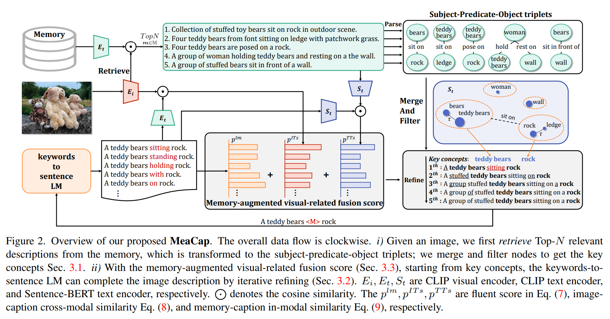
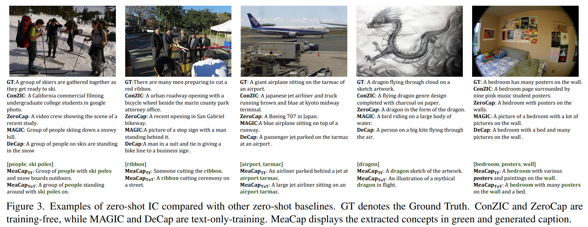
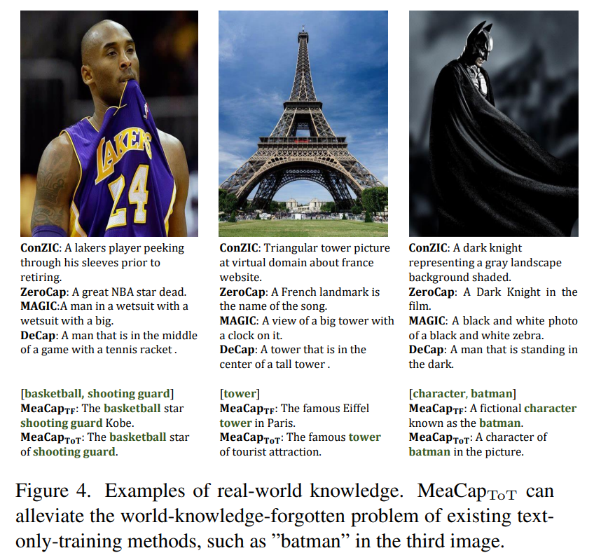
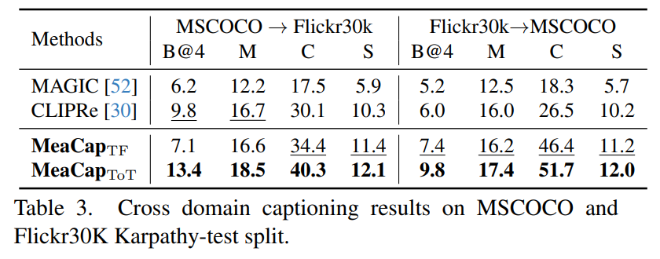
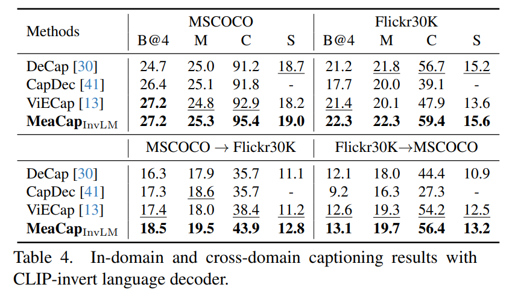

논문 및 이미지 출처 : <https://arxiv.org/pdf/2403.03715>

# Abstract

well-paired image-text data 가 없는 Zero-shot image captioning (IC) 은 training-free 와 text-only-training 의 두 가지 category 로 나눌 수 있다. 일반적으로 이 두 유형의 method 는 image-text similarity evaluation 을 위해 CLIP 과 같은 pre-trained vision-language models 를, caption generation 을 위해 pre-trained language model (LM) 을 통합하여 zero-shot IC 를 구현한다. 

둘 사이의 주요 차이는 LM 을 training 할 때 textual corpus 를 사용하는지 여부이다. 일부 metric 에 대해서는 매력적인 performance 를 달성하지만, 기존 method 들은 공통적인 단점을 보이는 경우가 많다. Training-free method 는 hallucination 을 일으키는 경향이 있고, text-only-training 은 종종 generalization capability 를 잃는다. 

이러한 한계를 넘어가기 위해, 본 논문에서 저자는 새로운 Memory-Augmented zero-shot image Captioning framework 인 **MeaCap** 을 제안한다. 

* 구체적으로, 저자의 방법은 textual memory 를 장착하고 image 와 높은 관련성이 있는 key concepts 를 얻기 위해 retrieve-then-filter module 을 도입한다. 
* 그리고 저자가 제안한 memory-augmented visual-related fusion score 를 keywords-to-sentence LM 에 적용함으로써, MeaCap 은 더 적은 hallucination 과 더 많은 world-knowledge 를 포함하면서 image 와의 높은 consistency 를 유지하는 concept-centered captions 를 생성할 수 있다. 

MeaCap framework 는 일련의 zero-shot IC setting 에서 state-of-the-art performance 를 달성한다.

# Introduction

Image captioning (IC) 은 visual content 를 이해하고 text description 을 생성하는 것을 목표로 한다. 잘 annotated 된 image-text pair 를 사용하는 supervised models 은 일반적인 IC benchmark 에서 유의미한 result 를 달성해왔다. 그러나 annotation cost 가 높기 때문에, 이러한 benchmark 의 training set 은 제한된 image style/content 만을 포함하는 경우가 많으며, 이는 supervised model 이 wild 환경의 image 로 generalize 되는 데 큰 장애물이 된다. Human-annotated image-text pair 없이 IC 를 실현하기 위해 최근 zero-shot IC 가 주목받고 있다. 기존 연구는 크게 training-free methods 와 text-only-training methods 의 두 group 으로 나눌 수 있다.

Training-free approach 는 fine-tuning 없이 pre-trained model 을 사용하여 zero-shot image-to-text generation 을 실현한다. 

* 구체적으로, 이러한 method 는 CLIP 과 같은 pre-trained vision-language model 과 BERT 또는 GPT-2 와 같은 pre-trained language model (LM) 을 사용하여 주어진 image 에 맞는 sentence 를 생성하도록 한다. 
* Iterative inference 를 통해 이 line of work 는 어떠한 training 도 필요로 하지 않는다. 
* 높은 generalization ability 와 높은 CLIP score 를 달성했음에도 불구하고, 이러한 method 는 extrinsic hallucination 현상을 보인다. 
* 즉, Fig. 1a 와 같이 주어진 image 에 존재하지 않는 imaginary information 을 포함한 story 를 생성하는 경향이 있다.

이 문제를 완화하기 위해 또 다른 line of work 는 image 없이 high-quality text data 만을 기반으로 text decoder 를 training 또는 fine-tuning 한다. 이를 text-only-training methods 라고 한다. 

* Training corpus 에 기술된 object 를 포함한 test image 의 경우, text-only-training method 는 객관적인 caption 을 생성하며 BLEU, METEOR, CIDEr 와 같은 reference-based score 에서 큰 성능 향상을 이룬다. 
* 그러나 제한된 training corpus 때문에, pre-trained LM 이 가진 knowledge 는 training 과정에서 점차 잊혀지고, 결국 Fig. 1b 와 같이 out-of-domain data 에서 severe performance degradation 이 발생한다. 
* Web-scale high-quality corpus 로 training 하는 것은 잠재적 해결책이지만, 이는 매우 큰 computational cost 를 유발한다.

Wild 환경의 image 에 대한 높은 generalization ability 를 유지하면서도 불합리한 imagination 을 제거하기 위해, 본 논문은 memory-guided mechanism 을 기반으로 한 새로운 Memory-Augmented zero-shot image Captioning framework 인 **MeaCap** 을 제안한다. 

* 이는 LM 을 training 하는 대신 captioning corpus 를 활용하는 대체적 scheme 을 제공한다. 
* 구체적으로, external textual memory 로부터 주어진 image 와 높은 관련성을 지닌 key concept 를 찾기 위해 retrieve-then-filter module 을 개발한다. 
* 또한 저자가 제안한 memory-augmented visual-related fusion score 를 keywords-to-sentence LM 인 CBART 에 적용하여, MeaCap 은 image 와 높은 consistency 를 유지하는 concept-centered caption 을 생성할 수 있다. 
* 이 새로운 visual-related score 는 CLIP 을 사용하는 기존 zero-shot IC method 와 같이 image-text cross-modal similarity 를 고려할 뿐 아니라, caption 과 retrieval 된 image-related memory 간의 similarity 를 평가함으로써 text-text in-modal similarity 또한 고려한다. 
* MeaCap 은 CBART 를 fine-tuning 하지 않는 training-free 버전 MeaCapTF 와 fine-tuning 을 적용한 text-only-training 버전 MeaCapToT 로 모두 구현될 수 있다.

저자의 contribution 은 다음과 같이 요약된다:

* 저자는 text-only captioning corpus 를 external memory 로 사용하여 training-free zero-shot IC 를 강화한다. 이를 위해 retrieve-then-filter module 을 도입해 memory 로부터 key concept 를 추출하고, CBART 를 통해 concept-centered generation 을 수행하여 기존 training-free method 의 hallucination 문제를 완화한다.
* Retrieval 된 textual memory 를 기반으로, 저자는 memory-augmented visual-related fusion score 를 CBART 에 도입하여 image 와 생성 caption 간의 correlation 을 향상시키면서 world-knowledge 를 유지한다.
* Zero-shot, in-domain, cross-domain scenario 에서 광범위한 experiment 를 수행한 결과, 저자가 제안한 memory-augmented design 은 training-free 와 text-only-training setting 모두에서 image content 와의 consistency 를 크게 향상시킨다.

# Related work

## 2.1. Supervised image captioning

Supervised IC 는 일반적으로 잘 aligned 된 image-text pair 를 사용하고 encoder-decoder model 을 training 한다. 예를 들어, 일부 초기 시도들은 CNN-based encoder 를 구성하여 visual feature 를 추출하고, RNN/LSTM-based decoder 로 output sentence 를 생성한다. 더 나은 visual understanding 을 위해, 여러 method 는 object detector 를 사용하여 attentive image region 을 추출한다. 두 modality 간의 상호작용을 강화하기 위해 attention mechanism 과 graph neural network 이 널리 사용되었다.

## 2.2. Zero-shot image captioning

최근 몇 년간 zero-shot IC 에 대한 관심이 증가하고 있다. Supervised IC 와 달리, zero-shot IC 는 다음 두 경우에서 image caption 을 생성하는 것을 목표로 한다:\
i) 어떤 training data 도 사용하지 않는 training-free zero-shot IC,\
ii) LM 을 training 하기 위해 captioning dataset 의 text 만을 사용하는 text-only-training zero-shot IC.

#### Training-free methods

이 유형의 method 는 pre-trained vision-language model 인 CLIP 을 활용하여 pre-trained LM 의 generation 을 guide 함으로써 zero-shot IC 를 실현한다. 특히, ZeroCap 과 그 extension 인 video captioning version 은 gradient-search iteration 에 기반해 제안되었다. Zero-shot IC 의 controllability 를 높이기 위해, ConZIC 은 Gibbs-sampling 과 non-autoregressive LM 을 결합하여 caption 의 diversity 와 inference speed 를 향상시킨다. 높은 generalization ability 와 높은 CLIP score 를 달성했음에도 불구하고, 이러한 방법들은 Fig. 1a 와 같이 image 에 존재하지 않는 description 을 생성하는 hallucination 문제를 보일 수 있다.

#### Text-only-training methods

또 다른 line of zero-shot IC method 는 captioning dataset 의 corpus 만을 사용해 text decoder 를 training 또는 fine-tuning 한다. 구체적으로, simCTG 를 특정 corpus 에 fine-tuning 한 뒤, MAGIC 과 ZEROGEN 은 CLIP-induced score 를 도입하여 simCTG 의 generation process 를 regularization 하여 주어진 image 와 semantic relevance 를 유지하도록 한다. Visual feature 를 text feature 로 mapping 하여 이를 LM 의 prompt 로 사용하는 아이디어를 기반으로 DeCap, CapDec, ViECap 이 개발되었다.

저자가 제안하는 MeaCap 은 training-free 와 text-only-training zero-shot IC 양쪽 모두에서 활용될 수 있다. Training-free setting 에서는 memory mechanism 으로 key concept identification (Sec. 3.1) 과 LM generation 에 대한 guidance (Sec. 3.3) 를 제공하여 hallucination 을 줄인 더 정확한 caption 생성이 가능하다. Text-only-training setting 에서는 corpus 를 external memory 로 사용함으로써, 기존 method 에서 발생하는 pre-trained LM 의 world-knowledge forgetting 문제를 완화할 수 있다.

## 2.3. External memory in image captioning

External memory 를 도입하는 것이 여러 visual·language task — natural language process, visual recognition, image synthesis, open-domain question-answering, 그리고 IC — 에 유용함이 입증되어 왔다. 예를 들어, SmallCap 은 CLIP 을 사용해 관련 caption 을 retrieval 하고, 이를 LM 의 prompt 로 사용하여 적은 training parameter 로도 정확한 caption 을 생성할 수 있음을 보였다. Zero-shot captioning 분야에서, DeCap 은 CLIP text embedding 을 해당 sentence 로 invert 하도록 LM 을 training 한다. 또한 CLIP visual embedding 을 textual memory embedding 의 weighted sum 으로 projection 하고, 이를 LM 의 soft prompt 로 사용해 caption generation 을 guide 한다.

저자의 방법은 DeCap 및 SmallCap 과 달리, retrieval 된 textual memory 전체를 prompt 로 사용하는 대신, training-free filter 를 통해 noisy information 을 제거하고 key concept 를 추출한다. 또한 DeCap 의 memory 가 text-only-training 에만 특화된 것과 달리, 저자의 explicit memory design 은 training-free 와 text-only-training 두 scenario 모두에 적용 가능하며 더 정확한 caption 을 생성하는 데 강력한 성능을 보인다.

# 3. MeaCap

더 적은 hallucination 과 더 많은 world-knowledge 를 보존하며 zero-shot IC 성능을 개선하기 위해, Fig. 2 와 같이 저자는 새로운 framework 인 MeaCap 을 제안한다.

i) 기존 training-free method 가 caption 에 hallucination 을 유발하는 문제를 해결하기 위해, MeaCap 은 image 와 높은 관련성을 가진 retrieval 된 textual memory 로부터 key concept 를 식별하고, 이를 기반으로 한 concept-centered captioning 을 수행한다 (Sec. 3.1).\
ii) Image-text cross-modal similarity 와 text-text in-modal similarity (textual memory 와 caption 간 similarity) 를 모두 고려하는 memory-augmented visual-related fusion score 를 개발하여 keywords-to-sentence LM 인 CBART 에 도입한다 (Sec. 3.2, Sec. 3.3). 이를 통해 image-caption correlation 을 향상시킨다.

# 3. MeaCap

Fig. 2 에서 보이는 것처럼, 적은 hallucination 으로 더 나은 zero-shot IC 를 수행하면서 더 많은 world-knowledge 를 보존하기 위해, 저자는 MeaCap 이라는 새로운 framework 를 제안한다.

* i) caption 에 hallucination 을 유발할 수 있는 기존 training-free 방법들이 가진 문제를 해결하기 위해, MeaCap 은 image 와 높은 관련성을 가지는 retrieved textual memory 로부터 일부 핵심 concept 를 식별하고, 이를 기반으로 하는 concept-centered captioning 을 수행한다 (Sec. 3.1).
* ii) 저자는 image-text cross-modal similarity 와 text-text in-modal similarity (textual memory 와 caption 사이) 를 모두 고려하는 memory-augmented visual-related fusion score (Sec. 3.3) 를 설계하고, 이를 keywords-to-sentence LM 인 CBART (Sec. 3.2) 에 도입함으로써 image-caption correlation 을 향상시킨다.

## 3.1. Retrieve-then-filter to get key concepts

기존 text-only-training zero-shot IC 방법들은 보통 captioning dataset 의 text 에 대해 LM 을 training 하거나 fine-tuning 하며, 이를 통해 hallucination 이 적고 더 적절한 description 을 생성한다. 그러나 이러한 방법들은 생성된 caption 이 특정 corpus 에 overfit 되도록 만들어 out-of-distribution generalization 이 부족해진다. 이러한 현상에 동기부여되어, 저자는 text 에 대해 LM 을 training 또는 fine-tuning 하는 대신, zero-shot IC 를 위한 key concept 를 얻기 위해 augmented textual memory 를 구축하는 접근을 취한다.

### Build augmented memory

이를 위해, 저자는 먼저 다양한 visual concept 를 풍부하게 포함하는 여러 visual-related sentence 로 이루어진 큰 textual memory $M$ 을 구성한다. 이 memory 는 training-free 경우에 hallucination 을 제거하는 데 중요하며, text-only-training 경우에 발생하는 knowledge-forgotten 을 완화할 수 있다.

Image-related description retrieval. 위와 같이 memory 를 얻은 뒤, 주어진 image $I$ 에 대해, 저자는 CLIP 을 사용하여 image-text similarity 를 계산하고, memory 로부터 Top-$N$ 개의 image-related description 을 다음과 같이 retrieval 한다.

$$
\{ m_n \}_{n=1}^{N_d} = \underset{m\in \mathcal{M}}{TopN} \big[ \cos(E_i(I), E_t(m)) \big], \tag{1}
$$

* 여기서 $E_i(\cdot)$ 와 $E_t(\cdot)$ 는 각각 CLIP 의 image encoder 와 text encoder 를 나타내고, 
* $\cos(\cdot, \cdot)$ 는 cosine similarity 이다.

#### Subject-Predicate-Object triplet. 

image-related description $\{ m_n \}_{n=1}^{N_d}$ 안에는 관사나 전치사와 같은 정보량이 적은 단어들이 포함되어 있어, 이러한 단어들의 영향을 추가로 줄이기 위해, 저자는 off-the-shelf textual parser 인 TextGraphParser 를 사용하여 각 description $m_n$ 을 여러 subject-predicate-object triplet 을 포함하는 text-graph $g_n$ 으로 변환한다. 

여기서 subject 와 object 는 node 이고, predicate 는 relation 이다. 이 node 들은 이후 filter 와 merge 를 거쳐 key concept 의 집합을 형성하게 될 candidate concept 로 간주된다. relation 은 두 concept 사이의 순서를 결정한다. 저자는 모든 $N_d$ text-graph $\{ g_n \}_{n=1}^{N_d}$ 로부터 얻은 모든 node 의 집합을 $\{ v_n \}_{n=1}^{N_c}$ 로 정의한다.

Key concept 를 얻기 위한 merge 와 filter. Fig. 2 에서 보이는 것처럼, 어떤 concept 를 나타내는 node 들은 image 내의 동일한 object 를 가리킬 수 있다 (e.g., ‘bear’ 와 ‘teddy bear’), 반면 일부 node 들은 image 와 무관할 수 있다 (e.g., ‘woman’). 따라서 key concept 를 얻기 전에 이러한 node 들은 merge 및 filter 과정을 거쳐야 한다.

* **1) Merge.** SentenceBERT 의 text encoder $S_t(\cdot)$ 의 도움을 받아, 저자는 개념 embedding set $\{ f^c_n \}_{n=1}^{N_c}$ 을 $f^c_n = S_t(v_n)$ 으로 얻는다. 그런 다음, 임의의 두 개념 embedding 사이의 similarity 를

  $$d_{ij} = \cos(f^c_i, f^c_j); i, j = 1, \cdots, N_c, \tag{2}$$

  와 같이 계산한다. 
  * 여기서 저자는 threshold 역할을 하는 hyper-parameter $\tau$ 를 설정하고, 
  * $d_{ij} > \tau$ 이면 $i$-th concept 와 $j$-th concept 가 동일한 cluster 에 속한다고 본다. 
  * 이 과정을 거친 후, 전체적으로 $N_v$ 개의 concept cluster 를 $\{ c_n = \{ v_i \}_{i=1}^{N^{c}_n} \}_{n=1}^{N_v}$ 로 얻으며, 
    * 여기서 $N^{c}_n$ 은 $n$-th concept cluster $c_n$ 에 포함된 node 의 개수를 의미한다.
* **2) Filter.** 이 단계에서는 $n$-th concept cluster $c_n$ 을 제거할지, 혹은 보존할지를 결정해야 한다. 이를 위해, image 와 무관한 단어일수록 Eq. (1) 에서의 retrieved description $\{ m_n \}_{n=1}^{N_d}$ 에 등장하는 횟수가 더 적다는 가정을 두는 것이 타당하다. 따라서 저자는 $c_n$ 에 속한 $v_i$ 가 $m_k$ 에 등장하는지를 점검하여 concept-cluster frequency $CF(c_n)$ 을 다음과 같이 계산한다.

  $$CF(c_n) = \dfrac{\sum_{i=1}^{N_{c_n}} \sum_{k=1}^{N_d} \delta(v_i \in m_k)}{N_d}, \tag{3}$$

  $\delta(v_i \in m_k) = \begin{cases} 1 & v_i \in m_k \\ 0 & v_i \notin m_k \end{cases}.$

  * 여기서 $CF(c_n)$ 은 retrieved descriptions $\{ m_n \}_{n=1}^{N_d}$ 에서 $n$-th cluster 가 등장하는 빈도를 나타낸다. 
  * 경험적으로, $CF(c_n) > 0.5$ 이면 cluster $c_n$ 을 보존하고, 그렇지 않으면 제거한다. 
  * 최종적으로 저자는 원래의 $N_v$ 개 cluster 중에서 image 와 높은 관련성을 갖는 $n_v$ 개의 key concept cluster 를 filter 로 골라낸다.
* **3) Find key concepts.** $n_v$ 개의 key concept cluster $\{ c_n \}_{n=1}^{n_v}$ 를 얻었을 때, 각 cluster 는 여러 개의 유사한 concept 를 포함할 수 있으므로, 각 cluster 를 대표할 하나의 concept 를 선택해야 한다. 이를 위해 저자는 CLIP 을 사용하여 image-concept similarity 가 최대가 되는 concept 를 cluster 별로 하나씩 선택한다.

  $$c^{key}_n = \underset{v_j \in c_n}{\argmax} \big[ \cos(E_i(I), E_t(v_j)) \big] ; n = 1, \cdots, n_v, \tag{4}$$

  * 여기서 $c^{key}_n$ 은 cluster $c_n$ 을 대표하도록 선택된 concept 이다. 
  * 이 세 단계 이후, 저자는 시각적으로 높은 관련성을 갖는 key concept 의 집합 $\{ c^{key}_n \}_{n=1}^{n_v}$ 을 얻게 된다. 
  * 이어지는 keywords-to-sentence LM 을 사용하여 caption 을 생성하기 전에, 이러한 concept 들의 순서를 결정해야 하는데, 이는 subject-predicate-object triplet 에 포함된 relation 에 의해 결정된다.

## 3.2. Keywords-to-sentence LM

key concept $\{ c^{key}_n \}_{n=1}^{n_v}$ 로부터 유창하고 visual-related 한 caption 을 생성하기 위해, 저자는 pre-trained lexically constrained language model 인 CBART 를 사용한다. 구체적으로, CBART 는 ordered $K$ 개 keyword $\{ c_i \}_{i=1}^{K}$ 가 주어졌을 때, 다음의 조건부 확률을 최대화함으로써 문장 $S = (x_1, \ldots, x_n)$ 을 생성하도록 개발되었다.

$$
S = \argmax_S P(x_1, \ldots, x_n \mid \{ c_i \}_{i=1}^{T}), \tag{5}
$$

* 여기서 $x_1, \ldots, x_n$ 은 단어들이다. 
* 이를 위해 CBART 는 keyword 로부터 시작해 문장을 반복적으로 refinement 하기 위한 action encoder 와 language decoder 를 가진다. 
* $t$-th iteration 에서 encoder 는 어떤 word-level action (copy, replacement, insertion) 을 취해야 하는지를 예측하는 역할을 담당한다.
* 다시 말해, encoder 는 $n'$ words 를 가진 불완전한 문장 $S^t$ 를 입력으로 받아, 이에 대응하는 action sequence $L_t = \{ l_{t,1}, \ldots, l_{t,n'} \}$ 를 출력하며, 
  * 여기서 $l_{t,i}$ 는 $t$-th iteration 에서 $i$-th word 에 대한 action 을 의미한다.

각 action 은 다음과 같다.

* **i) Copy.**\
  Copy 는 현재 단어가 변경되지 않고 그대로 유지됨을 의미한다.
* **ii) Replacement.**\
  Replacement 는 현재 단어가 교체되어야 함을 의미한다. 구체적으로, CBART 는 mask token 인 $\langle M \rangle$ 을 사용해 현재 단어를 대체하고, pre-trained LM 의 조건부 확률 $p^{lm}(x_{\langle M \rangle} \mid x_{-\langle M \rangle})$ 에 기반하여 새로운 단어를 sampling 한다. 
  * 여기서 $x_{-\langle M \rangle}$ 는 mask 되지 않은 token 들을 나타낸다.
* **iii) Insertion.**\
  Insertion 은 decoder 가 현재 단어 앞에 새로운 단어를 삽입해야 함을 의미한다. Replacement action 과 유사하게, CBART 는 현재 단어 앞에 $\langle M \rangle$ token 을 삽입한 뒤, $p_{lm}(x_{\langle M \rangle} \mid x_{-\langle M \rangle})$ 로부터 단어를 sampling 한다.

이와 같이 decoder 는 문장을 $S^t$ 로부터 $S^{t+1}$ 로 refinement 할 수 있다. 따라서 CBART 의 $t$-th iteration 에서의 전체 encoder-decoder sentence refinement 과정은 다음과 같이 정식화될 수 있다.

$$
\begin{gather}
  L_t = \text{LM}_\text{Encoder}(S_t), \\
  S_{t+1} = \text{LM}_\text{Decoder}(S_t, L_t).
\end{gather}
\tag{6}
$$

몇 번의 iteration 후, encoder 가 full-copy action sequence 를 출력하면 CBART 는 refinement 를 종료한다.

위와 같은 소개에서 알 수 있듯이, 기존 CBART 는 저자의 요구를 충족하지 못하는데, 그 이유는 replacement 와 insertion action 에 대해 단어가 pre-trained LM 의 확률 $p^{lm}(x_{\langle M \rangle} \mid x_{-\langle M \rangle})$ 에서만 sampling 되기 때문이다. 이는 문장의 fluency 만 보장하고, visual-text 관계는 고려하지 못한다.

## 3.3. Memory-augmented visual-related fusion score

주어진 image $I$ 에 대해 caption 이 높은 관련성을 갖도록 만들기 위해서는, insertion 과 replacement action 에서 단어를 생성할 때 사용할 visual guidance 가 필요하다. 널리 사용되는 CLIP contrastive score 가 visual-text similarity 를 평가하는 데 활용되는 점에 동기부여되어, 저자는 \
i) image-text cross-modal similarity 와 \
ii) text-text in-modal similarity 를 모두 고려하여, \
CBART 의 원래 word prediction 분포를 주어진 image 에 더 잘 맞도록 조정하는 memory-augmented visual-related fusion score 를 설계한다.

구체적으로, position $i$ 에서 단어 $x_i$ 를 sampling 할 때, CBART 는 먼저 조건부 확률 $p^{lm}$ 을 예측하고, 그에 대응하는 fluency score 를 가지는 Top-$K_w$ 개의 candidate word $\{ x_i^k \}_{k=1}^{K_w}$ 를 다음과 같이 선택한다.

$$
p_{lm}(x_i^k) = p^{LM}(x_{ik} \mid x_{-i}), \quad k = 1, \cdots, K_w \tag{7}
$$

그 다음, context $x_{-i}$ 와 candidate word $x_i^k$ 를 결합하여 $K_w$ 개의 candidate sentence $\{ s_k = (x_1, \ldots, x_i^k, \ldots, x_n) \}_{k=1}^{K_w}$ 를 구성한다.

* i) **image-text cross-modal similarity.**
  이 similarity 는 $p_{IT}^s$ 로 표기하며, candidate sentence 들 ${ s_k }_{k=1}^{K_w}$ 와 image $I$ 를 입력으로 하여 CLIP 의 cross-modality similarity 를 계산함으로써 얻는다.

  $$
  p^{ITs}(x_{ik}) = \cos\big(E_i(I), E_t(s_k)\big). \tag{8}
  $$
* ii) **text-text in-modal similarity.**
  Eq. (1) 에서의 retrieved memory $\{ m_n \}_{n=1}^{N_d}$ 또한 image 와 관련이 있다는 점에 주목한다. 따라서 저자는 Sentence-BERT text encoder $S_t$ 를 사용하여 $\{ s_k \}_{k=1}^{K_w}$ 와 $\{ m_n \}_{n=1}^{N_d}$ 사이의 similarity 를 평가함으로써, image-caption 상관성을 더욱 향상시키는 memory-augmented visual-related similarity $p^{TT_s}$ 를 다음과 같이 도입한다.

  $$
  p^{TTs}(x_{ik}) = \frac{1}{N_d} \sum_{n=1}^{N_d} \cos\big(S_t(m_n), S_t(s_k)\big). \tag{9}
  $$
  
마지막으로, Eq. (7), Eq. (8), Eq. (9) 의 weighted sum 을 취하여, 다음과 같은 memory-augmented visual-related fusion score 를 얻는다.

$$
p^{fusion} = \alpha p^{lm} + \beta p^{ITs} + \gamma p^{TTs}. \tag{10}
$$

그 결과, 저자의 model 에서 CBART 가 replacement 나 insertion 용으로 $i$-th word 를 sampling 할 때, 다음과 같이 fusion score 가 가장 높은 candidate word 를 선택한다.

$$
x_i = \argmax_{x_{ik}} ; p^{fusion}(x_{ik}), \quad k = 1, \cdots, K_w. \tag{11}
$$

지금까지의 과정을 통해, 저자가 제안한 MeaCap 은 training-free zero-shot IC setting 에서 더 적은 hallucination 으로 동작할 수 있으며, 실험에서는 이를 MeaCapTF 라고 부른다.

또한, text 만을 사용하여 language model 을 fine-tune 하는 대부분의 text-only-training zero-shot IC model 과 마찬가지로, 저자는 먼저 CBART 를 fine-tuning 한 뒤 text-only zero-shot IC 를 수행할 수도 있으며, 실험에서는 이를 MeaCapToT 라고 부른다.

# 4. Experiments

MeaCap 이 다양한 zero-shot setting 에서 높은 performance 를 효율적으로 달성할 수 있음을 보이기 위해, 저자는 기존 연구를 따라 Task One: zero-shot IC (Sec. 4.1) 와 Task Two: unpaired IC (Sec. 4.2) 에 대해 광범위한 experiment 를 수행한다. 각 setting 마다 training-free 버전 MeaCapTF 와 text-only-training 버전 MeaCapToT 의 result 를 모두 보고한다. Sec. 4.3 에서는 제안한 memory 기반 zero-shot IC framework 를 다른 LM 과 결합했을 때의 validity 를 추가 평가하고, Sec. 4.4 에서는 MeaCap 의 detailed ablation study 를 수행한다.

#### Dataset

저자는 세 가지 널리 사용되는 IC benchmark—MSCOCO, Flickr30K, NoCaps—에서 experiment 를 수행한다. MSCOCO 와 Flickr30K 는 기존 연구를 따라 Karpathy split 을 사용하고, NoCaps validation set 은 다른 dataset 로 training 된 IC model 의 transferability 평가에 사용한다.

또한 Task One 에서는 기존 연구를 따라 웹 기반 large-scale corpus 인 CC3M 을 source 로 사용하여 MSCOCO 와 NoCaps 로 transfer 한다. CC3M 은 웹에서 수집된 3 백만 개의 image-description pair 로 구성되며, 저자는 memory 구축 또는 LM finetune 용도로 text 만 사용한다.

## Implementation Details

MeaCap 은 여러 pre-trained module 을 활용한다.

* **CLIP**: pre-trained ViT-B/32 CLIP
* **Sentence-BERT**: HuggingFace 의 pre-trained model
* **CBART**: One-Billion-Word corpus 로 pre-trained
* **TextGraphParser**: off-the-shelf textual scene graph extractor 사용

Training-free MeaCapTF 는 sentence 시작에 “The image above depicts that” 라는 prefix 를 붙인다. Text-only-training MeaCapToT 는 추가로 AdamW 로 CBART 를 fine-tuning 한다.

Task One 에서는 CC3M 을 memory 로 사용하고, Task Two 에서는 source dataset 의 training corpus 를 memory 로 사용한다. Concept 유사도 threshold 는 CC3M memory 에서 $\tau=0.55$, 다른 memory 에서 $\tau=0.6$ 으로 설정한다.

Hyperparameter $N_d$, $K_w$, $\alpha$, $\beta$, $\gamma$ 는 전체 experiment 에서 각각 5, 200, 0.1, 0.4, 0.2 로 설정한다.

모든 experiment 는 단일 RTX3090 GPU 에서 수행한다. Textual corpus 는 CLIP text encoder 로 embedding 하여 memory 로 저장해 fast retrieval 을 수행한다. 예를 들어 CC3M retrieval 은 RTX3090 GPU 기준 평균 0.05 초, CPU 기준 약 1 초가 소요된다.

#### Metrics

생성 caption 의 accuracy 평가는 supervised metric 인 BLEU (B@n), METEOR (M), CIDEr (C), SPICE (S) 를 사용한다. Training-free method 에 대해서는 image-text similarity 측정을 위해 CLIPScore (CLIP-S) 를 사용한다.

그러나 CLIP-S 는 Fig. 1b 와 같이 CLIP 기반 method 의 hallucination 을 잘 감지하지 못하므로, 저자는 추가로 pre-trained large model BLIP-2 를 이용한 BLIP2Score (BLIP2-S) 를 사용한다.

## 4.1. Zero-shot image captioning

이 section 에서는 web-collected corpus 에서 downstream IC dataset 으로 transfer 할 수 있는 model 의 능력을 평가하기 위한 zero-shot IC experiment 를 수행한다.

#### Baselines

저자는 두 종류의 baseline 과 비교한다.

1. **Training-free methods**
   * ZeroCap
   * Tewel et al.
   * ConZIC\
     이들은 pre-trained CLIP + frozen LM(GPT-2/BERT) 조합으로 zero-shot IC 를 수행한다.
2. **Text-only-training methods**
   * DeCap\
  이 역시 Sec. 2.3 에서 논의된 memory 기반 method 이며 pre-trained LM 대신 language decoder 를 scratch 부터 training 한다.
  또한 DeCap 는 CLIPRe 라는 baseline 을 제시하는데, 이는 memory 에서 가장 관련성 높은 text 를 직접 retrieval 하는 방식이다.

MeaCapTF 는 CC3M 을 memory 로 사용하고, MeaCapToT 는 CC3M memory 와 CBART finetuning 을 모두 사용한다. Tab. 1 result 에서 MeaCap 은 MSCOCO 와 NoCaps 모두에서 새로운 state-of-the-art 를 달성한다.

#### Training-free Results

MeaCapTF 는 reference-based metric (B@4, M, C, S) 에서 ZeroCap, Tewel et al., ConZIC 보다 큰 margin 으로 우수한 성능을 보이며 memory-augmented design 의 효과를 입증한다.

Reference-free metric 에서는 BLIP2-S 에서 우수한 성능을 보이며 CLIP-S 에서는 약간 낮다. 이는 기존 training-free method 가 hallucination 을 생성하는 경향 때문에 CLIP-S 에서 더 높은 점수를 받는다는 Sec. 1 의 논의와 일치한다.

Besides, 저자의 MeaCapTF 는 retrieval 기반 baseline 인 CLIPRe 를 큰 폭으로 능가하며, 이는 단순히 가장 관련성 높은 caption 을 retrieval 하는 것만으로는 정확도가 충분하지 않음을 보여준다. 또한 text-only-training 방식인 DeCap 과 비교해도 MeaCapTF 는 MSCOCO 와 NoCap 모두에서 더 우수하거나 비슷한 performance 를 보이며, training 없이도 robust 한 성능을 확인할 수 있다.

#### Text-only-training Results

MeaCap 의 잠재력을 더 탐구하기 위해, 저자는 DeCap 방식과 동일하게 web-scale corpus 를 이용한 text-only-training 도 수행하였다. 즉, CC3M corpus 로 CBART 를 fine-tuning 한 MeaCapToT 를 평가하였다.

결과적으로, MeaCapToT 는 특히 NoCap dataset 에서 성능이 크게 향상되며, 동일한 training 및 memory 조건에서 DeCap 을 MSCOCO 와 NoCaps 모두에서 능가한다. 이는 external memory 를 활용하는 저자의 방식이 text-only-training setting 에서도 확실한 우위를 가짐을 보여준다.

#### Qualitative results

정량적 비교 외에도 Fig. 1, Fig. 3, Fig. 4 에 생성 caption 을 시각화하였다. 시각적 결과에서도 MeaCap 은 더 많은 knowledge 를 포함하고 더 적은 hallucination 을 가지는 caption 을 생성함을 확인할 수 있다.

## 4.2. Task Two: Unpaired image captioning

### 4.2.1 In-domain captioning

여기서는 **in-domain setting**, 즉 training data, memory, test set 이 모두 동일 dataset 에 속하지만 image-text pair 는 사용하지 않는 환경에서 MeaCap 의 추가적 가능성을 탐구한다.

#### Baselines

비교 대상은 다음과 같은 text-only-training method 와 retrieval 기반 방법이다.

* ZeroCap†
* MAGIC
* ZEROGEN
* CLIPRe (retrieval-based)

ZeroCap 은 원래 training-free method 이지만 ZeroCap† 는 이를 text-only-training 버전으로 확장한 것이다. 이 method 들은 CLIP 을 freeze 하고 training text 로 LM 을 fine-tuning 한다.

In-domain 실험에서도 저자는 training text 를 memory 로만 사용하는 MeaCapTF 와 training text 로 CBART 를 fine-tuning 하며 동시에 memory 로 사용하는 MeaCapToT 를 모두 보고한다.

#### Results

* Tab. 2 결과에서 보듯이, MeaCapTF 는 CLIPRe 및 다른 text-only-training baselines 보다 C 및 S score 에서 우수하다. 
* B@4, M 에 비해 C 및 S score 는 entity 및 관계의 정확성을 더 중시한다. 
* 따라서 이 두 metric 의 우수한 성능은 저자의 memory 기반 retrieve-then-filter method 가 높은 품질의 key concept 를 잘 추출함을 의미한다.
* 또한 MeaCapToT 는 모든 기준 모델을 큰 폭으로 능가하며, in-domain training 이 적용될 경우 제안 방식이 더욱 강력한 성능을 보임을 보여준다.

## 4.2.2 Cross-domain captioning

Cross-domain setting 에서는 training data 와 test data 가 서로 다른 dataset 에서 온다. MeaCapTF 와 MeaCapToT 는 source domain 의 text 를 memory 로 사용하며, MeaCapToT 는 CBART finetune 도 수행한다.

#### Results

저자는 text-only-training baseline 인 MAGIC (GPT-2 finetune 기반), 그리고 retrieval 방법인 CLIPRe 와 비교하였다. 

* Tab. 3 결과를 보면, GPT-2 를 source data 로 finetune 한 MAGIC 은 target domain 에서 성능이 급락하며 CLIPRe 보다도 나쁜 결과를 보인다. 
  * 이는 text-only-training 방식의 도메인 overfitting 문제를 반영한다.
* 반면, 저자의 memory-augmented design 을 적용한 MeaCapTF 는 대부분의 metric 에서 CLIPRe 를 능가하며, MeaCapToT 는 모든 baseline 대비 큰 폭의 우수성을 보인다. 
  * 이는 memory-augmented design 이 cross-domain generalization 에 있어 매우 효과적임을 명확히 보여준다.

## 4.3. Flexibility of MeaCap with other LM

저자가 제안한 Sec. 3.1 의 memory 기반 key concept 추출 메커니즘은 plug-and-play 방식으로, Task Two 의 대부분 text-only-training SOTA method [13, 30, 41] 를 추가 비용 없이 향상시킬 수 있다. 이를 검증하기 위해, 저자는 MeaCap 에서 CBART(Sec. 3.2) 를 제거하고 기존 method 들이 사용하는 LM 으로 대체하였다. 이 과정에서 Sec. 3.3 의 fusion score 도 필요하지 않다.

#### Baselines

DeCap, CapDec, ViECap 은 공통적으로 **CLIP text encoder 를 invert** 하는 LM (InvLM) 을 scratch 부터 training 한다. 구체적으로:

* CLIP visual encoder 로 visual embedding 을 얻고
* 이를 CLIP text embedding space 로 projection 한 뒤
* InvLM 이 text embedding 을 다시 자연어로 reconstruct 한다.

저자는 이러한 InvLM 기반 구조에 key concept 를 주입하기 위해 다음 template 을 사용한다:

> “There are [c1, c2, ..., cn] in the image”

여기서 $c_n$ 은 저자가 추출한 n-th key concept 이다. 이 template sentence 를 CLIP text encoder 로 embedding 하여 **concept-aware prompt** 를 생성한다. 이 prompt 를 textual embedding 과 concat 하여 InvLM 의 입력으로 사용한 버전을 **MeaCapInvLM** 이라 한다.

#### Results

Tab. 4 의 결과에 따르면, **MeaCapInvLM 은 in-domain 과 cross-domain 모든 metric 에서 모든 baseline 을 능가한다**. 이는:

* 저자의 memory 기반 key concept 추출 전략이 매우 효과적이며
* 다양한 LM 구조와 zero-shot setting 에 유연하게 적용됨을 의미한다.

## 4.4. Ablation studies

MeaCap 의 핵심 구성요소인 \
i) retrieve-then-filter module (ReF),\
ii) image-text similarity score (ITs),\
iii) text-text similarity score (TTs)\
각각의 영향을 분석하기 위해 MSCOCO dataset 기반 zero-shot Task One 에 대해 ablation 을 수행하였다. MeaCapTF 와 MeaCapToT 실험 결과는 Tab. 5 에 제시된다.

결과는 다음과 같다:

* **ReF + original LM** (첫 번째 row) 만으로도, 기존 training-free method 가 사용하는 CLIP 기반 visual guidance 인 **ITs only** (두 번째 row) 보다 높은 성능을 보인다.\
  → ReF 로 얻은 key concept 들이 zero-shot IC 에 매우 중요함을 의미한다.
* **ReF + ITs** 조합은 개별 모듈 각각보다 더 큰 개선을 가져온다.\
  → key concept 와 visual similarity 의 결합이 caption quality 를 높임.
* 마지막으로 **TTs** 를 추가하면 성능이 추가적으로 상승한다.\
  → 제안된 memory-augmented visual-related fusion score 의 효과가 입증됨.

또한 Fig. 5 에서 retrieval 되는 memory caption 개수의 영향을 평가한 결과, **5개 retrieval** 시 최상의 성능을 보였다.

# 5. Conclusion

본 논문은 새로운 memory-augmented zero-shot image captioning framework 인 **MeaCap** 을 제안한다. 저자는 external textual memory 로부터 key concept 를 추출하기 위한 retrieve-then-filter module 을 도입하고, 이를 기반으로 memory-augmented visual-related fusion score 를 개발하였다. 이를 CBART 와 결합하여 기존 training-free method 의 hallucination 문제를 완화하고 text-only-training method 의 accuracy 를 향상시켰다.

다양한 zero-shot captioning setting 에서의 광범위한 실험 결과, MeaCap 은 기존 training-free 및 text-only-training method 를 모두 능가하는 성능을 보였다.
