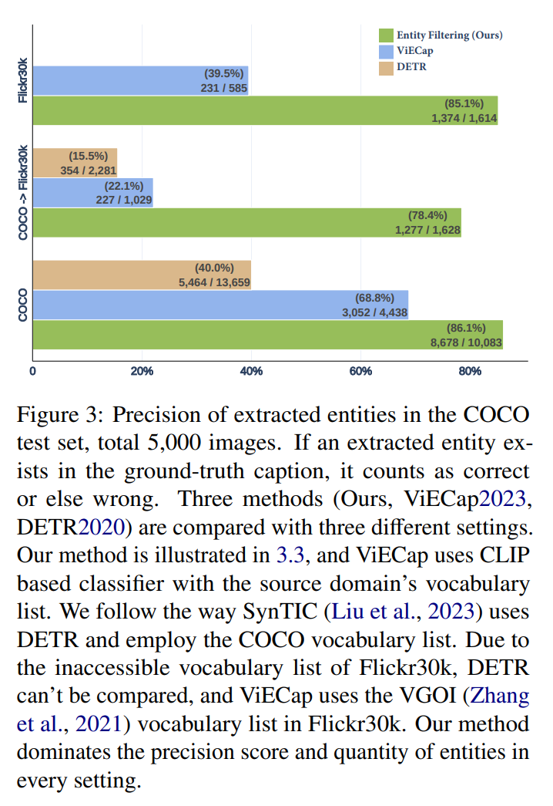
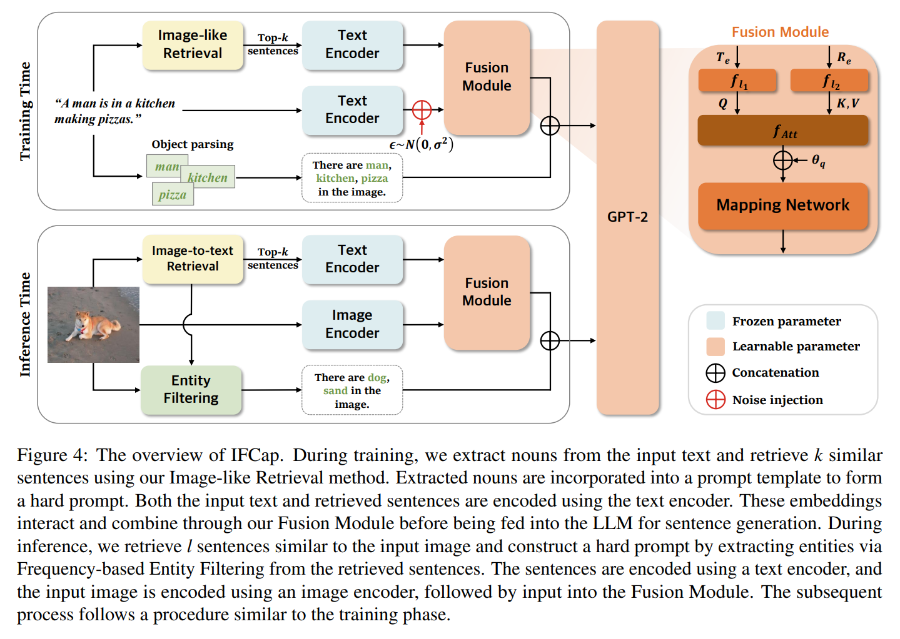
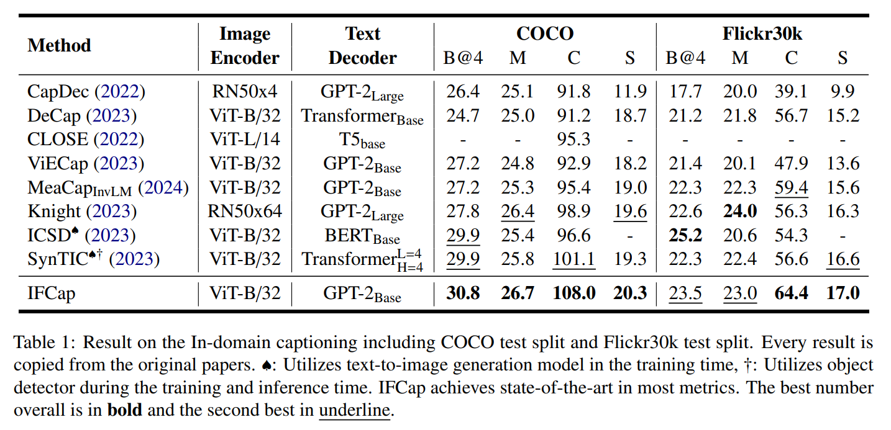
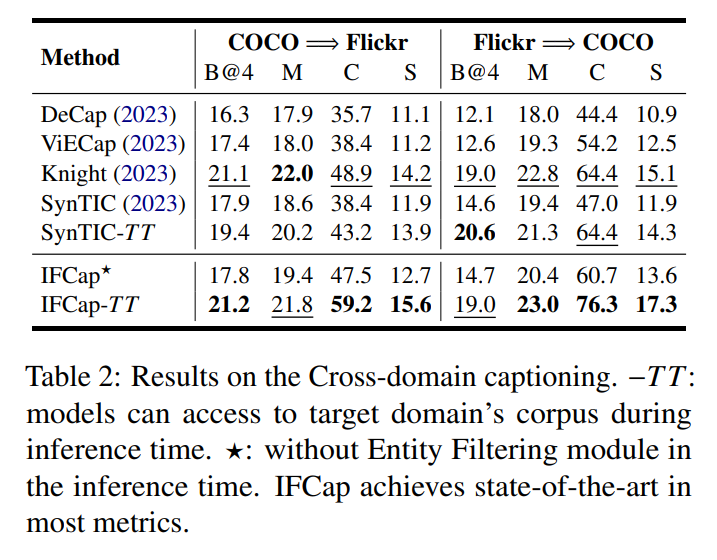
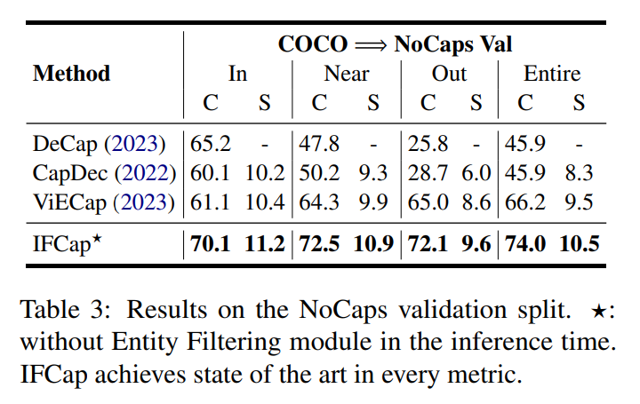
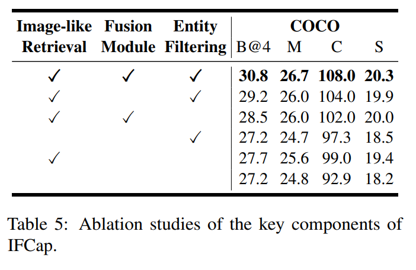
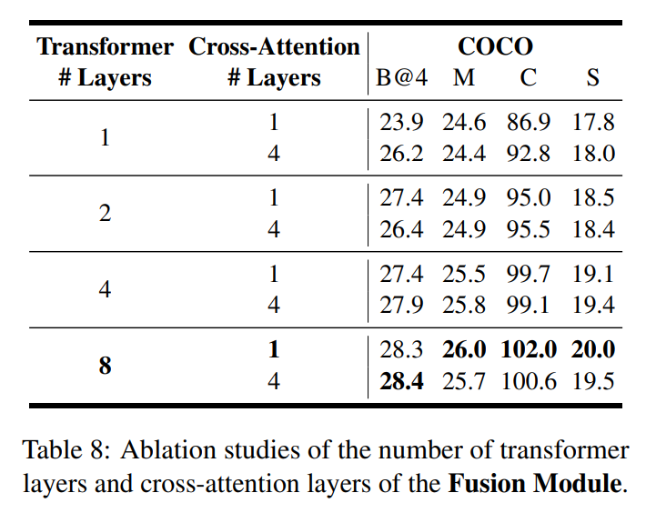

논문 및 이미지 출처 : <https://arxiv.org/pdf/2409.18046>

# Abstract

최근 image captioning 의 발전에서는 paired image-text data 의 한계를 극복하기 위해 text-only training 방법을 탐구해 왔다. 그러나 기존 text-only training 방법은 training 시에는 text data 를 사용하고 inference 시에는 image 를 사용하는 것 사이의 modality gap 을 종종 간과한다. 

* 이 문제를 해결하기 위해, 저자는 **Image-like Retrieval** 이라 불리는 새로운 접근법을 제안하며, 이는 text feature 를 시각적으로 관련 있는 feature 와 정렬하여 modality gap 을 완화한다. 
* 저자의 방법은 추가로, retrieval 된 caption 을 input feature 와 통합하는 *Fusion Module* 을 설계함으로써 생성된 caption 의 정확도를 향상시킨다. 
* 또한 저자는 caption 의 품질을 크게 개선하는 Frequency-based Entity Filtering 기법을 도입한다. 

저자는 이러한 방법들을 하나의 통합 framework 로 결합하며, 이를 **IFCap (Image-like Retrieval and Frequency-based Entity Filtering for Zero-shot Captioning)** 이라 지칭한다. 

광범위한 실험을 통해, 이 단순하지만 강력한 접근법의 효능이 입증되었으며, text-only training 기반 zero-shot captioning 과 비교했을 때 image captioning 과 video captioning 모두에서 state-of-the-art 방법들을 큰 폭으로 능가하는 성능을 보여준다.

# 1 Introduction

image captioning task 는 CV 와 NLP 를 결합하여 image 에 적절한 textual description 을 생성한다. Large Language Models (LLMs) 와 Vision and Language Models (VLMs) 의 등장과 함께, 다양한 연구에서는 image captioning 을 위한 효율적인 training 방법을 탐구해 왔다. 이러한 접근법들은 pre-trained model 과 적은 수의 parameter 또는 lightweight network 를 사용하여 효과적인 captioning 을 개발한다. 그러나 이러한 연구들은 paired image-text data 에 의존하며, 이는 비용이 많이 든다. 이를 극복하기 위해 최근 연구들은 image captioning 을 오직 textual data 만으로 해결하려는 text-only training 방법을 탐색해 왔다.

text-only training 은 model 이 text data 만을 사용하여 training 되는 새로운 방향을 제시한다. 

* 최근 연구들은 추가 cue 로 사용할 요소들에 대해 탐구해 왔으며, 예를 들어 추출된 명사, synthetic image, object detector 로부터 추출된 tag 등이 있다. 
* 그러나 object 정보에 의존하는 기존 방법들은 잘못된 data 에 민감하며, stable diffusion 이나 object detector 와 같은 대형 external model 을 활용하면 추가 비용이 발생한다. 
* 따라서 저자는 추가 model 없이 다양한 정보를 cost-effective 하게 획득하는 방향으로 문제를 해결하고자 한다.

retrieval task 는 주어진 query 에 대해 database 에서 관련 정보를 찾는 작업이다. 

* NLP 에서 시작된 retrieval 은 CV 와 multi-modal retrieval 로 확장되었다. 
* input data 와 database 에 따라 image-to-text retrieval, text-to-text retrieval 등 다양한 retrieval 방식이 가능하다. 
* 기존 text-only training 연구에서는 text-to-text retrieval 을 활용하려는 시도가 있었다. 그러나 training 은 text 로 수행하고 inference 는 image 로 수행하는 text-only training 특성상 내재된 modality gap 을 기존 연구들은 해결하지 못한다. 
* 또한 이러한 연구들은 시각 정보 고려 없이 retrieval 된 caption 에 과도하게 의존한다. 이러한 modality gap 과 좁은 범위의 정보 사용은 성능 저하로 이어질 수 있다.

* 이를 검증하기 위해, COCO validation split 에 대해 CLIP similarity 기반 KNN retrieval 을 수행한 후, t-SNE 를 사용하여 model 이 training 중 사용하는 retrieval caption 의 CLIP embedding feature 를 시각화하였다. 
* Fig. 2 에서 볼 수 있듯이, image-to-text retrieval 과 text-to-text retrieval 사이에는 큰 feature distribution 차이가 존재하며, 이는 image 와 text 사이에 modality gap 이 존재함을 보여준다.

이 문제를 해결하기 위해, 저자는 image 와 text data 사이의 modality gap 을 완화하는 새로운 접근법인 **“Image-like Retrieval”** 을 제안한다. 

* 저자는 CLIP text feature 에 noise 를 주입하여 image feature distribution 에서 query 역할을 하도록 한다. 
* Fig. 2 오른쪽에서 확인할 수 있듯이, 제안한 방법은 기존 text-to-text retrieval 과 달리 image-to-text retrieval 결과 및 ground truth caption 과 매우 유사한 distribution 을 보인다. 
* 실제로 제안한 방법을 기존 연구에 적용하면 Table 12 에서 확인되듯 성능 향상이 나타난다.

기존 연구는 retrieval 된 caption 에만 의존하기 때문에, input caption 에 잘못된 정보가 포함되었을 때 부정확한 output 이 생성될 수 있다. 

* 이를 해결하기 위해 저자는 original input 과 추가 representation 을 효과적으로 통합하는 Fusion Module 을 설계하였다. 
* 또한 여러 연구에서 보이듯 prompt 는 language model 에 제공되는 정보를 명확히 할 수 있다. 저자는 input caption 에서 keyword 를 추출하여 hard prompt 를 구성하고, 이를 LLM 에 제공하여 명시적 가이드를 제공한다. 이는 text data 의 활용을 극대화하여 model 이 더욱 정확하고 관련성 높은 caption 을 생성하도록 돕는다.

image 로부터 추출된 entity 로 caption decoder 를 guide 하면 model 이 더욱 정확한 description 을 생성하도록 도움을 준다. 그러나 기존 연구들은 vocabulary 가 커질수록 entity detection precision 이 낮아지는 문제를 보인다. 

이를 해결하기 위해 저자는 vocabulary 에 의존하지 않고 entity 정보를 정밀하게 활용하는 Frequency-based Entity Filtering 을 제안한다. 

* inference 단계에서 image 로부터 retrieval 된 문장을 parsing 하여 명사만 추출한 뒤, frequency 를 계산한다. 
* 이후 미리 정의된 threshold 로 명사들을 filtering 하여 text decoder 에 제공할 hard prompt 를 구성한다. 이 단순한 방법은 매우 큰 성능 향상을 가져온다.

요약하면 저자의 기여는 다음과 같다:

* text-only training 에서 image-to-text retrieval 과 유사한 효과를 달성하는 Image-like Retrieval 을 제안하고, 기존 representation 과 추가 representation 의 interaction 을 위한 Fusion Module 을 도입하였다.
* inference 단계에서 자주 등장하는 entity 를 filtering 하여 language model 을 향상시키는 Frequency-based Entity Filtering 기법을 제안하였다.
* 광범위한 평가를 통해 IFCap 이 다양한 benchmark, 특히 video captioning 에서 state-of-the-art 성능을 달성함을 보인다.

# 2 Related work

## 2.1 Text-only Captioning

CLIP 의 장점은 image captioning, image generation, object detection 등 다양한 task 에 활용되어 왔다. image captioning 영역에서는 image data 없이 text data 만을 사용해 학습하는 text-only training 연구가 등장하고 있으며, 이는 image embedding 과 text embedding 이 가깝게 학습된다는 CLIP 의 특성을 활용한다.

* DeCap 은 textual data 만으로 text decoder 를 training 하고, inference 시 input image 를 text embedding space 로 사상하기 위한 support memory mechanism 을 도입해 caption 생성을 가능하게 한다.
* ViECap 은 input 으로 들어오는 text data 의 main entity 를 인식해 이를 prompt 로 구성하며, CLIP 기반 open vocabulary retrieval 을 통해 object-agnostic learning 을 수행하도록 한다.

## 2.2 Modality Gap

CLIP 과 같은 vision language model 은 image 와 text 를 shared space 내에 가깝게 embedding 하는 것을 목표로 한다. 그러나 실제로는 두 embedding 이 서로 다른 영역에 위치하며, modality 간 큰 gap 이 존재함이 확인되었다. 이러한 modality gap 은 vision 과 text modality 간 상호작용을 저해하며, 생성되는 caption 의 품질을 제한한다.

이 문제를 다루는 대표적 접근으로 CapDec 은 text embedding 주변의 작은 반경 내에 paired image embedding 이 위치한다고 가정하고 noise injection 으로 gap 을 완화한다. CLOSE 는 image 와 paired text 사이의 cosine similarity 가 낮음을 강조하며, hyper-parameter 로 scale 된 noise injection 을 통해 gap 을 줄인다.

저자는 retrieval 에서의 modality gap 에 주목하며, text-to-text retrieval 이 image-to-text retrieval 과 유사한 방식으로 동작하도록 하는 것을 목표로 한다. 기존 방법과의 차이는 Fig. 2 left 에서 확인할 수 있다.

## 2.3 Retrieval Augmented Generation

retrieval 은 NLP 에서 다양한 방식으로 사용되어 왔다. image captioning 또한 retrieval module 을 통해 novel object 및 새로운 정보를 caption 에 포함하여 추가 training 없이 새로운 domain 에 접근할 수 있다. image captioning model 들은 retrieval 을 여러 방식으로 적용한다.

* Smallcap 은 input image 와 관련된 caption 을 retrieval 하고 이를 text decoder 의 instruction 으로 활용한다.
* text-only image captioning 에서 ViECap 은 input image 로부터 novel object 를 retrieval 하여 prompt 로 사용한다.
* Knight 는 retrieval caption 을 text feature 로 사용한다.

대부분의 retrieval 방법은 image-to-text retrieval 을 기반으로 하지만, text-only captioning 은 text-to-text retrieval 을 수행한다. 그러나 inference 단계에서는 input image 로 인해 modality gap 이 발생하여 성능 저하로 이어진다. 저자의 방법은 image 와 text 사이의 gap 을 고려하여 이 문제를 정교하게 해결함으로써 성능을 향상시킨다.

# 3 Methods

저자는 Fig. 4 에 제시된 새로운 text-only image captioning model 인 IFCap 을 제안한다. 

training 단계에서 model 은 text-only training model 의 표준 설정과 동일하게 text data 만을 활용한다. 먼저 input text 를 text encoder 로 embedding 하고, 이 text embedding 을 mapping network 에 전달하여 modality 간의 gap 을 줄인다. 마지막으로 처리된 embedding 은 caption decoder 를 거쳐 output caption 을 생성한다.

IFCap 은 단순하지만 강력한 retrieval mechanism 을 사용하며, Image-like Retrieval (Sec. 3.1) 을 통해 image 와 text 간 modality gap 을 해결한다. Image-like Retrieval 후, 저자는 Fusion Module (Sec. 3.2) 을 사용하여 input embedding 과 retrieval feature 를 결합한다. inference 단계에서는 Frequency-based Entity Filtering (Sec. 3.3) 을 적용하여 image 로부터 retrieval 한 caption 에서 정확한 entity 를 추출한다.

## 3.1 Image-like Retrieval (ILR)

text-to-text retrieval 은 training 에서는 효과적으로 수행될 수 있으나, inference 시 input 으로 image 가 들어오면 modality gap 때문에 성능 저하가 발생한다. 따라서 Image-like Retrieval (ILR) 의 목표는 text input 에 대해 text-to-text retrieval 을 수행하되, 그 결과가 image-to-text retrieval 과 유사하도록 하는 것이다.

이를 위해 저자는 input text feature space 에 noise 를 삽입하여 image feature space 에 더 가깝게 이동시키는 방식을 제안한다. 과정은 다음과 같다.

먼저 CLIP 을 사용하여 input text $t_i$ 와 text corpus $\mathcal{T} = \{ t_i \}_{i=1}^{N_c}$ 를 text encoder $\mathcal{E}_T$ 로 embedding 한다. 이후 input text embedding $T_i$ 에 noise $\epsilon_r \sim \mathcal{N}(0, \sigma_r^2)$ 를 주입하여 image feature space 에 가깝게 조정한다:

$$
T_i = \mathcal{E}_T(t_i), \quad T^\epsilon_i = T_i + \epsilon_r. \tag{1}
$$

다음 retrieval 단계에서는 noise 가 삽입된 $T^\epsilon_i$ 를 query 로 사용한다. $T^\epsilon_i$ 와 corpus 내 모든 sentence embedding 의 cosine similarity 를 계산하여 가장 관련성 높은 top-k description 을 retrieval 한다. 이 과정은 image-to-text retrieval 과 유사하지만, image 대신 $T^\epsilon_i$ 를 사용한다는 점이 다르다.

이 접근을 training 중에 적용함으로써, text-only training 환경에서도 model 이 image-like 정보를 제공할 수 있게 되어 modality gap 이 축소되며 성능이 향상된다.

## 3.2 Fusion Module (FM)

text-only image captioning 에서는 model 에 어떤 추가 정보를 넣을지, 그리고 주어진 data 와 새로운 representation 을 어떻게 결합할지가 중요한 문제다. 이를 해결하기 위해 저자는 attention mechanism 을 활용하여 input text feature 와 retrieval caption feature 사이의 의미 있는 상호작용을 추출한다. attention 은 중요한 feature 에 가중치를 부여하는 효과가 있어 captioning 분야에서 널리 사용된다.

과정은 다음과 같다.

1. input text 와 retrieval caption 을 CLIP text encoder 로 encoding 한다.
2. modality gap 을 줄이기 위해 input text feature 에 Gaussian noise $\epsilon \sim \mathcal{N}(0,\sigma^2)$ 를 주입한다.
3. input text feature 와 retrieval caption feature 를 각각 linear layer $f_{l1}$, $f_{l2}$ 로 caption decoder 의 embedding dimension 에 맞게 변환한다.
4. 변환된 입력을 기반으로 $T_e$ 를 query, $R_e$ 를 key 로 하여 cross-attention $f^{Att}$ 을 적용하고, 두 representation 을 포함한 fusion representation $F_e$ 를 만든다.
5. 마지막으로 trainable Mapping Network $Map(\cdot; \theta_q)$ 을 사용해 전체 내용을 encoding 한다.

수식은 다음과 같다:

$$
T_e = T_i + \epsilon, \quad R_e = \mathcal{E}_T(\text{ILR}(T_i)), \tag{2}
$$

$$
F_e = f_{Att}( f_{l_1}(T_e), f_{l_2}(R_e) ), \tag{3}
$$

$$
F = \text{Map}(F_e; \theta_q). \tag{3}
$$

명사는 image 속 object 를 직관적이고 명확하게 설명하는 정보이므로 중요한 signal 을 담고 있다. 이를 활용하기 위해 training text corpus 와 input image 각각에서 entity 를 추출한다. 추출된 entity 집합 $E = \{ e_1, e_2, \dots, e_n \}$ 로 hard prompt $h$ 를 구성하여 model 이 해당 entity 를 인지하도록 한다. retrieval caption 과 entity 기반 hard prompt 를 통해 image 없이도 적절한 caption 을 학습할 수 있다. 저자는 auto-regressive loss 를 사용해 projector 와 caption decoder 를 최적화한다:

$$
\mathcal{L}_\theta = -\frac{1}{N} \sum_{i=1}^{N} \log ( y_i \mid F; h; y_{<i}; \theta ).
$$

## 3.3 Frequency-based Entity Filtering (EF)

image 로부터 $l$ 개의 caption 을 retrieval 한 이후, grammar parser (e.g., NLTK) 를 사용하여 retrieval sentence 들에서 noun 을 추출하고, 각 noun 의 frequency 를 $F = [f_1, f_2, \dots, f_n]$ 형태로 계산한다. 이후 미리 정의된 threshold 보다 frequency 가 높은 noun 들만 hard prompt 에 포함한다.

#### Heuristic threshold

frequency 가 discrete 이므로 가능한 모든 threshold 에 대해 실험하여 최적 threshold 를 찾을 수 있다. 이를 통해 global optimum threshold 를 결정할 수 있다.

#### Adaptive threshold

heuristic threshold 는 환경에 따라 적합하지 않을 수 있고, exhaustive search 는 비용이 크다. 이를 해결하기 위해 noun frequency 가 정규분포 $N(\mu_F, \sigma_F^2)$ 를 따른다고 가정하고 adaptive threshold 를 정의한다:

$$
\tau_{\text{adap}} = \mu_F + \sigma_F.
$$

frequency 가 $\tau_{\text{adap}}$ 이상인 noun 들은 상위 15% 에 해당하는 outlier 로 볼 수 있으므로, 이를 entity 로 선택한다. 이 adaptive threshold 는 다양한 조건에 유연하게 적용 가능하지만 global optimum 을 보장하지는 않으므로 heuristic threshold 와 trade-off 관계를 형성한다.

# 4 Experiments

## 4.1 Implementation Details

* state-of-the-art 성능을 검증하기 위해, 저자는 image encoder 로 CLIP (ViT-B/32) 를, text decoder 로 GPT2$_\text{base}$ 를 사용한다. 
* training 중 image encoder 의 parameter 는 frozen 상태로 유지되며, text decoder 와 Fusion Module 만을 학습한다. 
* 총 5 epoch 동안 학습하며, learning rate 는 $2 \times 10^{-5}$ 로 설정하고, learning rate scheduler 와 AdamW optimizer 를 사용하며 batch size 는 80 이다. 
* NVIDIA RTX4090 (24GB VRAM) 한 장으로 학습하며, 약 1 시간 소요되고 12GB VRAM 을 사용한다.

#### Image-like Retrieval

저자는 먼저 Image-like Retrieval 을 위한 적절한 $\sigma_r$ 을 찾는다. 실험 결과 (Fig. 5) 에 따라 대부분의 경우 $\sigma_r = 0.04$ 를 사용한다. noise 가 주입된 input text feature $T_e$ 를 사용하여 $k$ 개의 sentence 를 retrieval 한다.

#### Fusion Module

$T_e \in \mathbb{R}^d$, $R_e \in \mathbb{R}^{d \times k}$ 를 각각 $f_{l_1}$, $f_{l_2}$ 로 projection 하여 GPT-2 embedding space 인 $\mathbb{R}^{d_{gpt}}$, $\mathbb{R}^{d_{gpt} \times k}$ 로 변환한다. 

cross-attention layer $f^{Att}$ 에서 query 로는 projection 된 $T_e$, key 로는 projection 된 $R_e$ 를 사용한다. 이후 $F_e$ 와 $\theta_q$ 를 concatenation 하고, 8-layer transformer 로 구성된 Mapping Network 에 입력한다.

#### Frequency-based Entity Filtering

input image 로부터 $l$ 개의 sentence 를 retrieval 하고 noun 을 extraction 한 뒤 frequency $F$ 를 계산한다. 미리 정의된 threshold 에 따라 entity 를 filtering 하고, 이를 hard prompt $h$ 로 구성하여 caption decoder 에 더욱 정확하고 다양한 entity 를 제공한다.

#### Datasets, Metrics

저자는 human-annotated dataset 에 대해 model 을 평가한다. in-domain generalization 을 위해 MS-COCO, Flickr30k 를 사용하며 Karpathy split 을 따른다. unseen scenario 성능을 평가하기 위해 NoCaps validation set 을 사용한다. 평가 metric 은 CIDEr, SPICE, BLEU@n, METEOR 이다. dataset 과 metric 에 대한 세부 내용은 appendix (Sec. A) 에 포함된다.

## 4.2 Text-only Captioning

저자는 본 model 을 state-of-the-art text-only image captioning model 과 비교한다. 

* CapDec 과 ViECap 은 Clipcap 기반이며, text 와 image feature 정렬을 위해 predefined Gaussian noise 를 사용한다. 
* CLOSE 역시 다양한 noise 설정을 활용한다.
* DeCap 은 memory bank 를 사용한다. 최근 방법인 Knight 는 retrieval mechanism 을 사용하여 text feature 만 활용한다. 
* MeaCap 은 retrieval sentence 를 Subject-Predicate-Object triplet 으로 변환하여 추가 정보로 사용한다. 
* ICSD 와 SynTIC 은 Stable Diffusion 과 같은 text-to-image generation model 을 활용해 modality gap 을 줄인다.

## 4.3 In-domain Captioning

저자는 Tab. 1 에 제시된 COCO 및 Flickr30k in-domain 환경에서 IFCap 을 benchmark 한다. 

* 기존 state-of-the-art text-only image captioning model 과 비교했을 때 IFCap 은 COCO 데이터셋에서 모든 metric 을 압도하며, larger model 을 사용하거나 training time 이 복잡한 기존 연구보다 뛰어난 성능을 보인다. 
* 또한 Flickr30k 에서 BLEU@4, METEOR 에서 준수한 성능을 보이며, CIDEr 와 SPICE 에서는 최고 점수를 달성한다.

## 4.4 Cross-domain Captioning

저자는 NoCaps validation set 과 COCO → Flickr30k, Flickr30k → COCO cross-domain 설정을 통해 IFCap 의 transfer 능력을 검증한다. 

* NoCaps 실험에서는 COCO domain 에서 학습된 동일한 model 을 사용하여 training 중 보지 못한 object 에 대한 인식 능력을 평가한다. 
* NoCaps validation split 에서 IFCap 은 이전 state-of-the-art text-only captioning model 들보다 모든 metric 및 domain 에서 우수한 성능을 보인다. 
* 또한 COCO 와 Flickr30k 간 cross-domain 설정에서도 대부분의 metric 에서 state-of-the-art 를 기록하며, 일부 metric 에서는 두 번째로 높은 성능을 보인다.

## 4.5 Video Captioning

video captioning 에서도 저자는 이전 실험과 동일한 방식으로 model 을 학습한다. 

* 먼저 MSVD, MSR-VTT dataset 의 corpus 에 대해 Image-like Retrieval 을 수행한다. 
* inference 단계에서는 input video 로부터 5 개의 frame 을 sampling 하고, 각 frame 의 CLIP image feature 를 평균하여 image representation 을 구성한다. 
* 또한 frame 당 5 개의 sentence 를 retrieval 하여 총 25 개의 caption 을 얻고, image 별 CLIP text feature 의 평균을 계산한다. 
* 두 dataset 모두에서 대부분의 metric 에서 IFCap 은 state-of-the-art 성능을 달성하며, METEOR 를 제외하면 모든 항목에서 우수한 성능을 기록한다.

## 4.6 Ablation Study

저자는 IFCap 의 세 가지 핵심 구성 요소인 Image-like Retrieval (ILR), Fusion Module (FM), Frequency-based Entity Filtering (EF) 각각의 기여도를 분석하기 위해 광범위한 실험을 수행한다. 또한 각 구성 요소의 hyper-parameter 를 COCO test split in-domain 설정에서 탐색한다.

#### Key Components

각 구성 요소를 제거하여 성능 변화를 비교한다 (Tab. 5).

* FM 제거: $f_{l1}$, $f_{l2}$ 로 dimension mapping 후 input text feature 와 retrieval feature 를 단순 concatenation 하여 decoder 로 전달한다.
* EF 제거: ViECap 과 유사하게 CLIP classifier 를 사용해 entity 를 extraction 한다.
* ILR 제거: retrieval 기능이 사라지기 때문에 input text feature 만 사용하게 되며, FM 은 ILR 없이 존재할 수 없다.

baseline 에 각 구성 요소를 추가할수록 성능 향상을 확인할 수 있으며, 세 구성 요소 모두를 적용한 IFCap 및 IFCap$^\star$ (EF 제외) 가 state-of-the-art model 을 구성한다. in-domain, cross-domain, video captioning 전체 비교는 Table 14 에 제시된다.

#### Image-like Retrieval

ILR 에서는 noise injection timing 이 중요하다. noise 를 retrieval 이전에 주입하는 Pre-$\epsilon$ 방식과 retrieval 이후에 주입하는 Post-$\epsilon$ 방식을 비교할 수 있다. 

Tab. 6 에서 확인되듯, retrieval 이전에 noise 를 주입하는 현재 설정이 가장 우수한 성능을 보인다.

#### Fusion Module

저자는 FM 에서 cross-attention layer 와 transformer layer 를 다양한 조합으로 실험한다 (Tab. 8).

* transformer layer 수가 4 개까지 증가하면 성능 향상이 지속된다.
* 8 개 transformer layer 를 사용할 때도 약간의 성능 향상이 있다.
* cross-attention layer 는 transformer layer 수가 작은 경우 효과적이지만, transformer layer 가 증가하면 영향이 줄어든다.

최종적으로 transformer layer 8 개와 cross-attention layer 1 개 조합이 최적 조합으로 결정된다. 공정한 비교를 위해 EF module 은 제거한 상태로 실험한다. 또한 retrieval caption 의 개수 $k$ 역시 중요한 요소이며, ablation 결과는 Table 7 에 제시된다.

#### Frequency-based Entity Filtering

EF 구성에서는 두 가지 선택이 필요하다:

1. retrieval sentence 의 개수 $l$
2. noun filtering threshold $\tau$

retrieval sentence 수 $l$ 은 domain 에 따라 다르며 (Table 9), COCO 에서는 $l = 9$, Flickr30k 에서는 $l = 7$ 이 최적이다.

threshold 탐색은 두 방식으로 수행된다:

1. *Heuristic threshold*

Tab. 10 에서 $\tau$ 를 1~8 범위로 설정하여 실험한다. 

* COCO test split 에서는 $l = 9$, Flickr30k 는 $l = 7$ 을 사용한다. 
* domain 별 최적 $\tau$ 는 서로 다르며, COCO 는 5, Flickr30k 는 3 이 CIDEr 기준 최적이다.

2. *Adaptive threshold*

noun frequency 분포를 정규분포 또는 log-normal 분포로 가정하여, $\mu$, $\mu + \sigma$, $\mu + 2\sigma$ 를 threshold 로 사용한다. 이는 upper 50%, 15.8%, 2.2% 를 의미한다. 

* Tab. 11 에 따르면 $\tau_{adap} = \mu + \sigma$ 설정이 heuristic 방식의 global optimum 과 거의 동일한 성능을 재현한다. 
* ground truth 가 없거나 연산 자원이 제한된 경우 adaptive threshold 가 유용하다.

# 5 Conclusion

본 연구에서는 text-only training 기반 zero-shot captioning 방법인 **IFCap** 을 제안하였다. 

IFCap 은 image-to-text retrieval 과 text-to-text retrieval 사이의 gap 을 해결하는 Image-like Retrieval, 기존 representation 과 retrieval representation 의 interaction 을 위한 Fusion Module, inference 단계에서 retrieval sentence 로부터 자주 등장하는 entity 를 추출하는 Frequency-based Entity Filtering 을 수행한다. 

제안한 방법은 다양한 task 에 쉽게 적용될 수 있으며, text-only 환경에서 retrieval 기반 방법에 명확하고 정밀한 guidance 를 제공한다. 또한 제한된 vocabulary 에 의존하지 않고 LLM 에 중요한 정보를 전달할 수 있다. IFCap 의 단순성과 견고함은 image 및 video captioning 의 다양한 dataset 에서 state-of-the-art 성능을 통해 입증된다. 향후 연구 방향으로는 region-based captioning 이나 visual question answering 과 같은 더 복잡한 dataset 으로의 확장 가능성이 있다.

# 6 Limitations

저자는 IFCap 이 다양한 image captioning 및 video captioning dataset 에서 text-only training 기반 zero-shot captioning model 중 가장 우수한 성능을 보임을 확인하였다. 그러나 Image-like Retrieval 을 위한 최적 $\epsilon_r$ 값을 찾는 과정은 여전히 heuristic 에 의존한다. 보다 효율적이고 자동화된 방법으로 최적 $\epsilon_r$ 을 결정하는 과정은 향후 연구 과제로 남아 있으며, 이는 text-only training 기반 image captioning model 의 발전을 더욱 향상시킬 수 있다.
