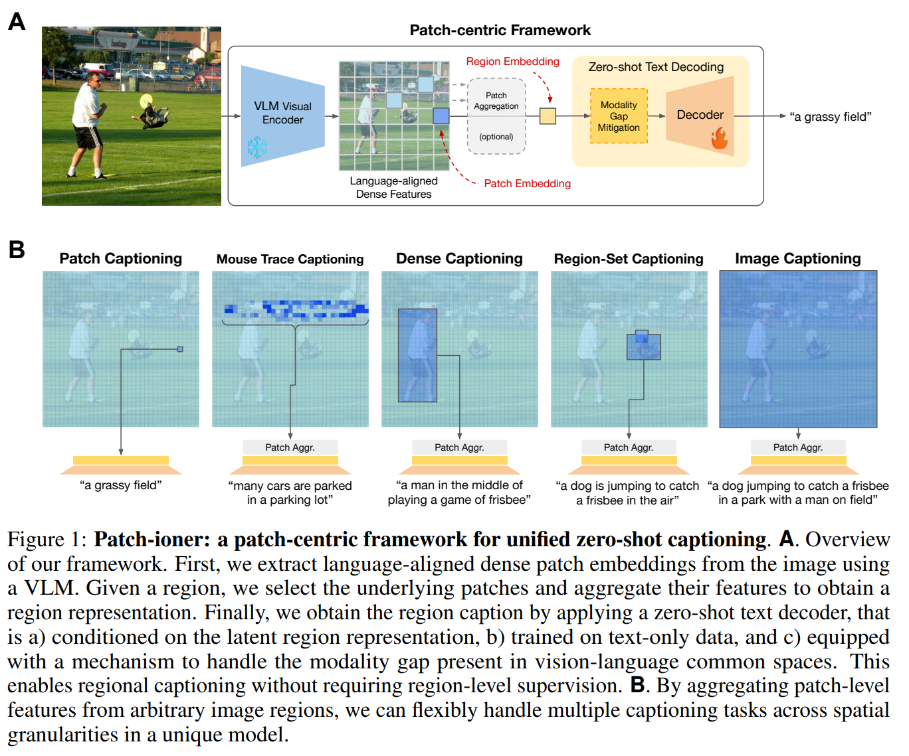
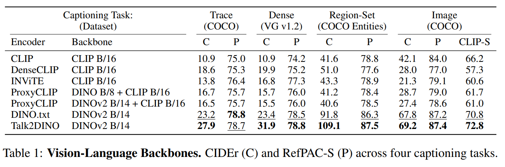

논문 및 이미지 출처 : <https://arxiv.org/pdf/2510.02898>

# Abstract

Zero-shot captioners 는 paired image-text data 에 의존하지 않고 common-space vision-language representations 를 활용하여 images 를 caption 하는, 최근에 제안된 models 이다. image 를 caption 하기 위해, 이들은 text 와 정렬된 image feature 를 text 로 decoding 하는 방식으로 동작하지만, global representations 와 whole-image captions 로 범위를 제한한다.

저자는 **Patch-ioner** 라는 zero-shot captioning 을 위한 unified framework 를 제안하며, 

* image-centric paradigm 에서 patch-centric paradigm 으로 전환함으로써, region-level supervision 없이도 임의의 region 을 caption 할 수 있게 한다. 
* 저자는 global image representations 에 의존하는 대신, 개별 patch 를 원자적 captioning unit 으로 취급하고, single patch 에서 non-contiguous area, 그리고 전체 image 에 이르는 임의의 region 을 기술하기 위해 이를 aggregate 한다.

저자는 기존 latent captioners 가 저자가 새롭게 제안한 framework 내에서 동작하게 만드는 핵심 요소들을 분석한다. 

* 실험 결과, DINO 와 같이 의미 있는 dense visual features 를 생성하는 backbones 가 여러 region-based captioning task 에서 state-of-the-art performance 를 달성하는 데 핵심이라는 점이 드러난다. 
* 다른 baselines 및 state-of-the-art competitors 와 비교했을 때, 저자의 models 는 zero-shot dense captioning, region-set captioning, 그리고 새로 도입된 trace captioning task 에서 더 나은 performance 를 달성하며, scalable caption generation 을 위해 patchwise semantic representations 가 효과적임을 보여 준다.

# 1 Introduction

Image captioning 은 vision-language understanding 의 가장 대표적인 tasks 중 하나이며, pre-trained vision-language backbones 와 large paired image-text datasets 의 활용 덕분에 놀라운 accuracy 에 도달했다. 기본적 formulation 에서 captioning model 은 full image 를 input 으로 받아, 어떤 요소들을 어느 정도까지 기술할지 스스로 결정한다. 사용자 guidance 를 가능하게 하고 더 목표지향적 descriptions 를 생성하기 위해, 일부 기존 works 는 region-level captioning methods 를 제안했으며, 이는 추가 input 으로 spatial indication — e.g., bounding boxes — 을 받아서 어떤 image regions 를 어떤 순서로 기술해야 하는지를 지정한다.

이러한 region-level captioning methods 는 model 을 완전히 supervise 하기 위해 값비싼 manually labeled data 를 요구한다. 실제로, 주어진 image 의 각 sequence 또는 bounding boxes set 은 해당 objects 를 기술하는 manually written ground-truth caption 과 대응해야 한다. 이러한 fully supervised 방식은 적절히 scale 되지 않는다.

본 논문은 **specific spatial granularity** — single image patch 에서 entire image 까지 — 를 대상으로, *image-level* 또는 *region-level* supervision 없이 zero-shot 방식으로 region-level captioning 을 수행할 수 있게 하는 **perspective shift** 를 제안한다. 

구체적으로, captioning method 의 subject 가 image 이고, 이후 sub-regions 에 의해 condition 되는 기존 아이디어에 의존하는 대신, 저자는 두 가지 단순하지만 강력한 아이디어를 기반으로 한다:

* i) caption 가능한 가장 단순한 요소는 patch 이며, 이는 vision transformers 기반 modern architectures 에서 image representation 의 atomic element 이다.
* ii) multiple patch representations 를 쉽게 aggregate 하여 arbitrarily large — 심지어 contiguous 하지 않은 — image regions 를 기술하는 description 을 생성할 수 있다.

저자는 이러한 아이디어를 구현한 zero-shot captioning framework 인 **Patch-ioner** 를 제안한다. 

이 formulation 은 zero-shot captioning tasks 에서 최대한의 flexibility 를 제공하며, 개별 patches 에서 큰 image regions, 나아가 entire image 에 이르는 다양한 patch aggregation 에 대해 effortless 하게 captions 를 생성하는 models 를 생산한다.

그러나 patch 를 새로운 captioning unit 으로 정의하는 강력한 관점 전환에도 불구하고, 문제는 이제 다음과 같은 단순하지만 핵심적인 질문과 얽혀 있다: **직접적 patch-level ground truth supervision 없이 patch-level captions 를 제공할 수 있는 model 을 어떻게 구축할 수 있는가?**

최근 몇 년 동안, CLIP 와 같은 large pre-trained vision-language foundation models 는 zero-shot 또는 심지어 training-free configurations 에서 많은 downstream tasks 를 해결해 왔다. 특히, contrastive 로 학습된 vision-language representations 는 image classification, open-vocabulary detection, segmentation, text-image retrieval 등의 zero-shot settings 에서 인상적인 결과를 가능하게 했다. 그러나 image captioning 은 CLIP 이 본질적으로 generative 가 아니라 discriminative approach 이기 때문에 inference time 에서 CLIP machinery 를 직접 활용해 text 를 생성할 수 없다.

최근 들어서야 image captioning models 는 image encoding — pre-trained discriminative models (e.g., CLIP) 로부터 적절한 image/text representations 를 생성하는 단계 — 을 actual generative module 과 분리함으로써 zero-shot 이 되었다. 예를 들어, Nukrai et al., Li et al., Gu et al., Zeng et al., Fei et al., Yan et al., Tewel et al., Su et al. 등의 models 는 다음과 같은 방식으로 동작한다:

* i) shared vision-language semantic space 를 활용하기 위해 CLIP 을 사용하고,
* ii) solely text samples 만 사용하여 text decoder 를 train 하여 CLIP textual feature 로부터 text 를 복원한다.

이는 pre-trained contrastive model 과 large set of sole text samples 만으로 강력한 captioner 를 구축할 수 있도록 한다.

본 논문에서 저자는 이러한 core idea 를 저자의 framework 가 일반화할 수 있음을 보이며, 적절한 components 와 결합할 경우 많은 zero-shot captioners 를 zero-shot region-based captioning 을 수행하도록 쉽게 재구성할 수 있음을 보여 준다. 따라서 저자는 이 새로운 zero-shot region-based captioning framework 에서 가장 critical 한 components 를 규명하고 자세히 연구한다.

특히, 저자는 pre-trained vision-language contrastive backbone 에 집중한다. 이 backbone 은 CLIP 과 달리 meaningful patch representations 를 생성할 수 있어야 한다. 이를 위해 저자는 localized capability 가 CLIP 보다 우수한 DINO 기반 variants 를 폭넓게 탐구한다. 또한 modality gap 을 완화하기 위한 다양한 전략들을 분석하며, text decoder 가 paired image-text features 없이 solely text 에서 train 될 수 있게 하는 방식을 연구하고, 서로 다른 patch aggregation methods 도 탐구한다.

* 이러한 components 를 연구하고 DINO 와 같이 patch-level meaningful representations 를 output 할 수 있는 vision backbone 을 활용함으로써, 저자는 많은 zero-shot captioners 가 dense captioning, region-set captioning, standard image captioning 등 다양한 zero-shot captioning task variants 에서 state-of-the-art 또는 유사한 성능에 도달할 수 있음을 보인다. 
* 또한 극단적 patch-based captioning scenarios 에서 저자의 framework 의 효과를 명확히 보여 주기 위해, image 내에서 mouse trace 로 지정된 region 을 caption 해야 하는 zero-shot trace captioning task 도 도입한다.

요약하면, 본 논문의 기여는 다음과 같다:\
a) 저자는 captioning 을 image-to-caption 접근에서 patch-to-caption 접근으로 전환하여, 지역적/전역적 tasks 를 단일 framework 인 Patch-ioner 안에 통합하며 region-level supervision 을 필요로 하지 않는다.\
b) 저자는 기존 models 를 이 새로운 framework 내에서 동작하도록 재구성하며, 특히 vision backbone 의 역할에 주목하여 핵심 components 를 분석한다.\
c) 저자는 소수 patches 부터 whole image 에 이르기까지 다양한 region granularity 를 갖는 네 가지 zero-shot captioning tasks 에 대해 model 의 성능을 보여 주며, 전체적으로 단순한 framework 임에도 불구하고 제안된 perspective shift 의 효과를 입증한다.

# 2 Related Work

#### Language-aligned Dense Image Representations

Language-aligned Dense Image Representations 는 patch level 에서 captioning 을 수행하기 위한 핵심 요소이다. 

CLIP 과 같은 vision-language models (VLM) 은 contrastive learning 을 통해 shared space 에서 global modality representations 를 학습하는 강력한 접근을 제시하여, captioning 을 포함한 여러 downstream tasks 를 해결할 수 있는 길을 열었다. 그러나 zero-shot settings 에서는 CLIP-like representations 가 local visual patches 와 fine-grained semantics 간 misalignment 때문에 dense tasks 에 취약한 것으로 알려져 있다. 

반면, DINO 와 같은 visual-only self-supervised models (SSM) 은 local semantic modeling 에서 뛰어나지만 language 와의 연결 고리가 없다. 최근 SILC 와 DINO.txt 와 같은 works 는 DINO- 와 CLIP-like training objectives 를 결합하여 language-aligned dense representations 를 얻고자 한다. 

* INViTE 는 마지막 layers 에서 각 patch 가 다른 모든 patch 로 보내는 attention weights 를 zero 로 만들며 CLIP 의 visual encoder 를 수정하여 더 semantic 한 patch features 를 얻는다. 
* DenseCLIP 과 RegionCLIP 은 CLIP 을 region-level supervision 으로 확장한다. 
* RegionCLIP 은 region-proposal network 를 활용해 image-text datasets 로부터 region-text pairs 를 구성하고, 
* DenseCLIP 은 pixel-to-text matching loss 를 도입하여 local regions 와 textual concepts 간 alignment 를 강화한다. 

다른 방법들은 minimal 또는 zero training 으로 기존 VLMs 과 SSMs 를 활용하여 동일한 성질을 얻고자 한다. 예를 들어, Talk2DINO 는 CLIP textual representations 를 DINOv2 patches 로 mapping 하여 DINOv2 space 와 language 를 연결하고, ProxyCLIP 은 DINO 의 attention maps 를 활용해 CLIP visual embeddings 의 local 성질을 개선한다.

#### Zero-shot Image Captioning 

Zero-shot Image Captioning methods 는 주로 global CLIP representations 에 의존하여 text generation 을 유도한다. 

early-guided decoding methods 는 CLIP visual features 를 input 으로 받아 modality gap 을 줄이기 위한 adaptation techniques 를 도입한다. 

* DeCap 은 CLIP visual features 를 text-aligned space 로 projection 하기 위해 texts memory 를 basis 로 사용하고, 
* CapDec 과 CLOSE 는 text-only training 과정에서 noise 를 주입해 CLIP visual space 로부터도 decoding 할 수 있게 한다. 
* generation 을 개선하기 위해 ViECap, MeaCap, MERCap, EntroCap 은 external knowledge 를 CLIP image representation 과 함께 decoding 을 condition 하는 데 활용한다. 

한편, late-guided decoding methods 는 CLIP 을 direct input 으로 사용하기보다는 scoring 또는 optimization signal 로 사용한다. 

* ZeroCap 은 CLIP gradients 를 활용해 text generation 중 cached context 를 조정하고, 
* MAGIC 은 CLIP similarity scores 에 기반하여 token selection 을 최적화한다. 

그러나 위 모든 approaches 는 global representations 에 의존하며, 이는 localized semantic details 를 포착하는 데 적합하지 않으므로 patch-level 또는 region-level captioning 의 zero-shot settings 에서는 suboptimal 하다.

#### Region-level Captioning

Region-level Captioning 은 image 의 sub-parts 를 기반으로 natural language descriptions 를 생성해야 하는 여러 tasks 를 포함한다. 이러한 tasks 는 단순히 cropped regions 또는 feature maps 를 caption 하면 image 의 global context 가 손실되어 region 에 대한 misinterpretation 을 유발한다는 추가적 도전을 수반한다. 

이러한 이유로 zero-shot solutions 는 여전히 충분히 탐구되지 않았다. controllable captioning — regions 의 set 또는 sequence 에 의해 조절되는 caption 생성 — 과 dense captioning — image 의 salient regions 를 localization 하고 caption 하는 작업 — 의 state-of-the-art solutions 인 CAG-Net, GRiT, ControlCap, FlexCap 등은 좋은 performance 를 보이지만 ground-truth boxes supervision 을 필요로 한다. 

최근 works 는 arbitrary regions captioning 을 향해 region-level supervision 을 활용하는 방향으로 나아갔으며, Localized Narratives dataset 은 images, timed captions, timed mouse tracks 를 포함하며 track- 또는 patch-level captioning 평가의 기반을 제공한다. 

본 논문은 image- 에서 patch-level 에 이르는 다양한 granularities 에서 zero-shot setting 으로 captioning 을 해결하기 위한 unique framework 를 제안한다.

# 3 A Patch-centric Framework

## 3.1 Motivation and Formulation

#### Learned region fusion requires regional data.

전통적 regional captioning 은 모델 내부에서 region specification 을 early injection 하는 방식을 따른다. 형식적으로, image $I$ 와 region $R$ 이 주어졌을 때 region caption $t$ 는
$t = \mathcal{D}(I, R)$ 로 모델링된다. 

이러한 models 는 region-caption annotations 를 필요로 하며, 종종 captioning task 또는 granularity 별로 dedicated models 또는 losses 를 사용한다.

한 단계 더 나아가기 위해, image encoding 과 region specification 을 분리한 formulation 을 도입할 수 있으며, 다음과 같이 정의한다: $t = \mathcal{D}(\psi(I), R)$, 여기서 $\psi(I)$ 는 region $R$ 과 무관하게 image 의 visual representation 을 제공하고, $\mathcal{D}$ 는 late region selection 과 text decoding 을 수행한다. 

region-level labels 로 전체 pipeline 을 train 하지 않기 위해, 저자는 decoder module $D(\cdot)$ 을 두 개의 독립된 모듈로 further decompose 한다:

* patch-level representations 의 parameter-free fixed aggregation $agg_{R}$,
* region $R$ 에 직접 condition 되지 않는 실제 text decoder $\phi(\cdot)$,

따라서 caption 은 다음과 같이 정의된다: $t = \phi(agg_{R}(\psi(I), R))$.

아래에서는 이 factorized components 를 자세히 설명한다.

#### Parameter-free patch aggregation

Image $I \in \mathbb{R}^{H \times W \times 3}$ 를 non-overlapping patches of size $P \times P$ 로 분할한다고 하자. 각 patch 는 vision backbone $\psi_{v}$ 로 encoding 되며, 다음과 같은 dense grid of patch-level embeddings 를 얻는다: $V = \psi_{v}(I) = \{ v_{i} \} \in \mathbb{R}^{\frac{H}{P} \times \frac{W}{P} \times D}$, 여기서 $v_{i} \in \mathbb{R}^{D}$.

$\psi_{v}(I)$ 가 이러한 spatial grid 를 생성한다고 가정하면, region 정의 $R$ 은 특정 patch feature subset 을 선택하고, 저자는 이를 aggregate 하여 region embedding $v_{R} = \text{agg}(\psi_v(I))$ 을 얻는다: $v_S = \sum_{i \in S} w_{i} v_{i}$,

여기서 $S$ 는 region 을 구성하는 patch indices set 이고, $w_{i}$ 는 aggregation weights 이다.

여러 aggregation functions (uniform, gaussian, attention-based 등) 이 고려될 수 있지만, regional captioning 에서는 그 선택이 큰 영향을 미치지 않음을 (SM§8) 확인했다. 따라서 mean aggregation ($w_{i} = 1/|S|$) 를 사용한다.

set operator 기반 aggregation 은 arbitrary sets of patches 를 aggregate 할 수 있는 flexibility 를 제공하며, 따라서 region 을 boxes, masks, traces, single patches, full-image grids 등으로 정의할 수 있다.

또한 저자는 모든 $\psi_{v}$ 가 patch-level meaningful visual representations 를 추출하는 데 적합하지 않음을 경험적으로 확인했으며, dense local contrastive objectives 로 pretrain 된 transformer architectures (e.g., DINO) 가 patch level 에서 훨씬 robust 하다는 것을 §4.2 에서 검증한다.

#### Zero-shot decoding

저자는 prefix language modeling 접근을 사용하여 text decoder $\phi: \mathbb{R}^{D} \rightarrow \mathcal{T}$ 를 train 한다. decoder 는 text embedding $\psi_{t}(t)$ 로부터 caption $t \in \mathcal{T}$ 를 reconstruct 한다.

만약 $\psi_{t}(t)$ 가 visual encoder $\psi_{v}(I)$ 에 aligned 되어 있다면, text-only data 로 train 된 text-only decoder 로부터 visual embeddings 를 직접 decode 할 수 있다. 이 경우 region representation 을 자연어 caption 으로 decode 할 수 있다: $t = \phi(v_{R})$.

그러나 $\phi(\cdot)$ 가 text-only training 동안 $\psi_{t}(t)$ 로부터 학습한 features 와 $\psi_{v}(I)$ 로부터의 visual features 를 동일하게 처리할 수 있다고 가정하는 것은 modality gap 때문에 지나치게 낙관적이다. text 와 image representations 는 동일 multimodal space 에 존재하더라도 서로 다른 subspaces 를 점유한다.

저자는 decoder 가 visual embeddings 에 적용 가능하도록 modality gap 을 완화하는 두 가지 전략을 실험했다:

1. Projection step at inference (Li et al., 2023b 방식)
   * text embeddings memory 를 기반으로
     visual features → text subspace mapping 을 수행.
2. Input perturbation-based decoder training (Gu et al., 2023; Nukrai et al., 2022 방식)
   * decoder training 중 input 을 perturb 하여
     visual embeddings 를 직접 처리할 수 있는 robustness 를 학습시킴.

이 두 modality-gap mitigation strategies 의 효과는 SM§9 에서 분석한다.

---

전반적으로, 저자의 formulation 은 다음 세 가지 주요 장점을 갖는다:

a) **zero-shot by design**
 * training 에 image-level textual descriptions 만 필요하며,
 * text decoder 를 train 하기 위해 paired image-text samples 가 필요하지 않다.

b) **범용 region 처리 가능**

* whole image, box, mask, free-form trace, single point 등 어떤 region 이든 동일한 방식으로 처리하며,
* modular 하고 general-purpose 인 regional captioning pipeline 을 구성할 수 있다.

c) **single forward pass efficiency**

* vision backbone 은 entire image 에 대해 단 한 번 forward pass 하면 되고,
* 그 후 추출된 patch features 를 재사용하여 여러 regions 를 caption 할 수 있어,
* 각 region 마다 full pipeline 을 다시 실행할 필요가 없다.

## 3.2 FROM PATCHES TO REGIONS

patch-level zero-shot captioning 에 기반하여, 저자의 framework 는 image 의 arbitrary regions 에 대해 captions 를 생성할 수 있다. region 은 patches 의 set 으로 정의되며, 해당 region 의 representation 은 그 구성 patches 의 embeddings 를 평균하여 얻는다. 

이 단순한 formulation 은 기존 region-level captioning tasks 를 하나로 통합하며, tasks 간 차이는 relevant patches 를 어떻게 선택하느냐에만 존재한다. 따라서 task-specific modifications 없이 다양한 tasks 를 처리할 수 있다. 아래에서는 저자의 evaluation 에 포함된 tasks 와 각각이 유도하는 patch selection 방식들을 설명한다.

#### Image Captioning

Image Captioning 은 entire image 를 기술하는 single caption 을 생성하는 task 이다. 이를 위해 image $I$ 의 모든 patches $\{ v_{i} \}$ 의 feature embeddings 를 aggregate 하여 global representation $v_{I} = \text{avg}_{i}(v_{i})$ 를 얻는다.

#### Dense Captioning

Dense Captioning 은 salient regions 를 locating 하고 해당 descriptions 를 생성하는 task 이다. 정의된 evaluation protocols 을 따르기 위해 localization subtask 는 제거하며, 이미 정의된 bounding boxes 를 caption 하는 데 집중한다. 이는 localization 이 region-proposal models 로 추가적으로 처리될 수 있기 때문이다.

bounding box $B$ 와 $B$ 와 intersect 하는 patch indices set $S_{B}$ 가 주어지면, region representation 은 $v_{B} = \text{avg}_{i \in S_{B}}(v_{i})$ 로 계산된다.

#### Region-set Captioning

Region-set Captioning 은 image 내 여러 regions 에 대해 single caption 을 생성하는 task 이며, 각 region 은 bounding box 로 지정된다.

image $I$ 와 bounding boxes set $\mathcal{B} = \{ B_{1}, B_{2}, \ldots, B_{K} \}$ 이 주어지면, 각 $B_{k}$ 에 대해 해당 box 와 intersect 하는 patches 의 set $S_{B_{k}}$ 를 정의한다.

set 전체를 represent 하기 위해, 모든 bounding boxes 에 걸쳐 선택된 patches 의 embeddings 를 다음과 같이 aggregate 한다:

$$
v_{\mathcal{B}} =
\frac{1}{\sum_{B \in \mathcal{B}} |S_{B}|}
\sum_{B \in \mathcal{B}}
\sum_{i \in S_{B}} v_{i}.
\tag{1}
$$

patch 가 둘 이상 box 에 포함될 경우, 평균 과정에서 더 높은 weight 를 갖게 된다는 점에 유의한다.

#### Trace Captioning

저자의 접근의 flexibility 를 보여주기 위해 **Trace Captioning** 이라는 새로운 task 를 소개한다. 이 task 에서 region of interest 는 $L$ 개의 points 를 가진 mouse trace $T = \{ p_{1}, \ldots, p_{L} \}$ 로 지정된다.

각 point $p_{j}$ 는 해당하는 patch index $i_{j}$ 로 매핑되며, trace sequence $S_{T} = [ i_{1}, \ldots, i_{L} ]$ 를 형성한다.

trace-level representation 은 선택된 patches 의 embeddings 를 averaging 하여 얻는다:

$$
v_{T} = \frac{1}{L} \sum_{j=1}^{L} v_{i_{j}}.
\tag{2}
$$

box 기반 방식과 달리, 이 formulation 은 사용자 지정 free-form regions 를 허용하며 interactive 하고 fine-grained localized descriptions 를 가능하게 한다. 따라서 region-level captioning 의 적용 범위를 확장한다.

# 4 Experiments

본 section 에서는 먼저 저자의 novel framework 에서 backbone 이 수행하는 역할을 정량적으로 평가한다 (§4.2). 이후 state-of-the-art zero-shot captioning methods 를 저자의 새로운 formulation 내에서 region-specific zero-shot tasks 에 대해 평가한다 (§4.3). 그 외 modality-gap mitigation strategy 또는 patch aggregation operator $agg_{R}(\cdot)$ 의 역할과 같이 흥미롭지만 영향이 비교적 적은 연구들은 SM §8 및 §9 에 제시되어 있다.

공통적 평가 기반을 마련하기 위해, 먼저 본 section 에서 사용된 datasets 및 metrics 를 소개한다.

## 4.1 Datasets and Metrics

#### Trace Captioning

저자는 Trace Captioning benchmark 를 구축하기 위해 Localized Narratives 를 활용한다 — annotators 가 image 속 objects 를 기술하면서 마우스 포인터를 해당 object 위로 움직이며 vocally descriptions 를 제공하는 dataset 이다. 이 dataset 은 여러 standard captioning datasets 의 images 에 대해 temporal annotated voice transcriptions 와 mouse traces 를 제공한다.

저자는 labeled COCO (splits: Karpathy & Fei-Fei) 및 Flickr30K test subsets 를 사용하여 trace captioning evaluation datasets 를 구축했다. 각 image 에 대해 long traces 및 transcriptions 를 sentences 단위로 분할하고, 각 sentence 의 start 와 end 사이에 temporal 하게 위치하지 않는 trace 구간들은 제거한다.

저자는 noisy sentences — 예: “The image is blurred”, “The image is edited” 등 image properties 설명 — 을 제거하고, voice descriptions 특유의 불확실성을 제거하기 위해 few-shots prompted LLM (LLama 3) 을 사용하여 보다 concise 하고 caption-like 한 style 로 재작성하였다. annotation cleaning 이후, 51 COCO images 는 clean sentences 가 없어 제외되었다.

각 sub-trace 와 대응 sentence 는 독립된 sample 로 간주하며, consecutive sentences 의 temporal information 은 평가에서 무시한다. 오직 각각의 sub-trace 가 기술하는 description correctness 만 평가한다.

datasets samples 및 추가 세부사항은 §10 에 제시되어 있다.

#### Dense Captioning

저자는 Dense Captioning 을 평가하기 위해 Johnson et al. 의 evaluation procedure 를 따른다. 단, bounding box proposal 단계는 생략하며, ground-truth boxes 를 입력으로 하여 bounding box captioning task 만 평가한다.

standard caption metrics 외에도 Johnson et al. 이 정의한 mAP 도 보고한다.

사용된 datasets:

* **Visual Genome (VG) v1.2**: VG 로부터 5000 images
* **VG-COCO test split**: VG 와 COCO overlap images 2476 장

각 image 는 여러 bounding box annotations 및 descriptions 를 포함한다.

#### Region-Set Captioning

Region-set captioning 평가를 위해 Cornia et al. 의 evaluation protocol 을 따른다. Flickr30K Entities 와 COCO Entities datasets 를 사용한다. 각 record 는 다음으로 구성된다:

* image
* variable-length bounding boxes set
* ground-truth controlled caption

Karpathy & Fei-Fei test split 에 기반하여 COCO 의 경우 3569 images, Flickr30K 의 경우 1000 images 를 평가에 사용한다.

#### Image Captioning

zero-shot image captioning 을 위해 Karpathy’s COCO test split (5000 images) 에 대해 captions 를 생성하고, 다음 state-of-the-art models 와 비교한다:

* DeCap
* CLOSE
* ZeroCap
* MAGIC
* ViECap
* CapDec
* EntroCap
* MeaCap
* MERCap

또한 DeCap, ViECap, MeaCap 에 대해서는 저자가 재현한 best results 도 보고한다.

#### Metrics

모든 datasets 는 각 annotation 에 대해 ground-truth caption 을 제공하므로, 저자는 생성된 captions 와 reference captions 간 similarity 를 평가하기 위해 standard captioning metrics 를 채택한다.

주요 metrics:

* **CIDEr (C)** — syntactic overlap 을 포착
* **RefPAC Score (P)** — caption phrasing 과 독립적인 semantic similarity 를 측정하는 최근 metric

추가적으로 BLEU@4, METEOR, ROUGE-L, SPICE 등 전통적 metrics 는 supplementary materials 에 제공한다.

Image Captioning task 의 경우, image 와 생성 caption 간 alignment 를 joint CLIP vision–language space 에서 측정하는 **CLIP-Score** 도 추가로 보고한다. 단, region-set, trace, dense captioning tasks 에서는 caption 이 entire image 가 아닌 local regions 를 기술하므로 CLIP-Score 를 적용할 수 없다.

## 4.2 Backbone Selection

visual backbone 의 선택은 저자의 patch-centric framework 에서 핵심적이다. patch features 의 quality 와 semantic richness 가 captioning performance 에 직접적으로 영향을 미치기 때문이다. 저자는 region-level supervision 없이 pre-trained 된 여러 state-of-the-art vision-language models 을 테스트하고, 해당 framework 내에서 이들이 얼마나 효과적인지를 평가했다.

테스트한 backbones 는 다음과 같다:

* **vanilla CLIP**
* **dense tasks 를 위해 CLIP 을 강화한 세 모델**
  * DenseCLIP
  * INViTE
  * ProxyCLIP
* **DINOv2 visual encoder 기반 models**
  * DINO.txt
  * Talk2DINO

patch aggregation 은 §3.2 에서 설명한 방식대로 수행한다. zero-shot decoder 의 경우 Li et al. 의 setting 을 따르며, prefix GPT-2 style decoder (구현 세부사항은 SM§6) 와 modality gap 완화를 위한 memory-based latent projection approach 를 사용한다.

구체적으로, decoding 에 앞서 region representation $v$ 는 다음과 같이 text embedding space 로 projection 된다: $v_{\text{proj}} = M \alpha,\ \alpha = \text{softmax} \left(\frac{1}{\tau} M^{\top} v\right),$

여기서

* $M = [m_{1}, \ldots, m_{N}]$ 은 text embeddings memory bank,
* $m_{j} = \psi_{t}(t_{j})$,
* $\tau > 0$ 는 weighting distribution 의 sharpness 를 조절한다.

이 선택은 두 가지 이유로 적합하다:

1. 동일 decoder architecture 를 사용하는 기존 연구들과 직접적 비교가 가능하다.
2. 저자가 테스트한 zero-shot decoder methods 중 가장 성능이 우수했다 (SM§9 참고).

또한 SM§8 에서는 memory bank $M$ 의 선택이 captioning performance 에 어떤 영향을 미치는지 분석하며, achievable metrics 의 upper bound 를 제시한다.

Tab. 1 의 결과는 backbone 의 효과성이 fine-grained local semantics 를 얼마나 잘 포착하는가에 강하게 연관되어 있음을 보여 준다.

* Standard CLIP 은 성능이 매우 낮다.\
  → patch tokens 가 spatial detail 이 부족하다는 기존 분석들과 일치한다.
* INViTE, DenseCLIP 등 CLIP local representations 를 강화한 모델들은 더 강한 결과를 보인다.\
  → local 정보 강화를 위한 저자의 가설을 지지한다.
* 가장 높은 성능을 보인 것은 DINOv2 기반 backbones
  * DINO.txt
  * Talk2DINO (best)

이는 high-quality region-level captions 를 위해서는 semantic richness 를 갖춘 patch-level features 가 필수적임을 명확히 보여 준다.

이러한 결과로 인해, 저자는 이후 모든 실험에서 **Talk2DINO** 를 default backbone 으로 채택해 결과를 보고한다.

## 4.3 Comparison with SOTA

zero-shot image captioning 은 최근 큰 발전을 보였으나, **zero-shot regional captioning** 에 특화된 prior methods 는 존재하지 않는다. 기존 zero-shot captioners 는 whole-image 수준에서만 평가되며, arbitrary regions 에 native 하게 attend 할 수 있는 mechanism 이 없다. 저자의 Patch-ioner framework 의 이점을 엄밀히 측정하기 위해, Tab. 2 에서는 다음 두 종류의 baselines 와 비교한다:

1. state-of-the-art whole-image zero-shot captioners
   * standard setting
   * 또는 region crops 에 적용하여 regional captioning 을 간접적으로 simulation
2. region-supervised encoders (저자의 no-region-label setting 에 포함되지 않음)
   * mask 기반 attention 사용: AlphaCLIP
   * crop 기반 attention 사용: RegionCLIP
   * 동일한 zero-shot decoder 와 결합\
     → 특정 regions 에 직접 attend 가능

이 design 은 image-level 과 region-level zero-shot captioning 모두에서 가능한 가장 강력한 baselines 와의 비교를 보장한다.

region-level data 로 train 된 large multimodal models (e.g., Guo et al., Hua et al.) 은 저자의 supervision assumptions 를 벗어나므로 비교에서 제외한다.

저자의 strongest model (Talk2DINO + memory-based mitigation) 외에도, 기존 zero-shot captioning approaches 를 backbone 만 교체해 표현한 조합들도 보고한다:

* CLOSE
* CapDec
* ViECap
* MeaCap

CLOSE, CapDec 은 noise-injection mitigation + standard decoder pipeline (§4.2) 를 적용하면 동일하게 표현된다. ViECap 과 MeaCap 또한 동일하나, text decoding 중 external knowledge 를 추가한다:

* ViECap: entity-aware prompts
* MeaCap: knowledge base 로부터 structured concept retrieval

저자는 각 task 마다 COCO 기반 dataset 과 또 다른 dataset (Visual Genome 또는 Flickr30K) 을 사용하여 평가한다. Fig. 2 는 qualitative results 를 보여 준다.

#### Patch-centric captioning excels in local, fine-grained tasks.

Trace 및 dense captioning task 는 local visual content 를 강조하는데, 저자의 patch-centric framework 는 이러한 모든 metric 에서 baseline 을 크게 능가한다. 

* Trace captioning (Tab. 2, first group) 에서 patch-based formulation 은 whole-image captioner 와 crop-based adaptation 을 모두 능가한다. 
  * Global CLS representation 에 의존하는 model 은 trace 아래의 정확한 object 와 attribute 를 포착하지 못한다.
  * Region-supervised backbone 으로 trace 에 자연스럽게 적용될 수 있는 AlphaCLIP 또한 뒤처지는데, 이는 pretrained CLIP backbone 의 내재적 한계를 보여준다. 
* Dense captioning 역시 동일한 경향을 보이며 (Tab. 2, second group), 저자의 model 은 baseline 을 능가한다. 
  * 이 task 의 경우, DeCap, ViECap, MeaCap 의 crop-based adaptation 을 보고하는데, 이는 동일한 model 을 global CLS 에 적용한 것에 비해 더 강한 baseline 을 제공하기 때문이다 (SM 의 Tab. 4 참조). 
  * 이러한 model 은 regional content 를 분리해내지만, coherent 한 dense description 에 중요한 broader contextual cue 를 폐기해버린다.

#### Patch aggregation extends seamlessy to context-aware captioning.

Region-set captioning (Tab. 2, third group) 에서도 저자의 model 은 zero-shot baseline 과 region-supervised model 을 모두 능가하며 state-of-the-art 결과를 달성한다. 

* Region-set captioning task 는 국소 영역만을 엄밀히 다루기보다 image-level captioning 에 더 가깝게 정렬되는 경향이 있는데 (SM 의 Fig. 6, Fig. 7 참조), 이는 region 이 image-level caption 을 제어하기 위해 의도되기 때문이다. 
  * 따라서 global model 또한 이러한 task 에서 우수하게 작동하며, 저자의 최신 state-of-the-art 와의 격차가 상대적으로 좁아진다. 
* Arbitrary 하거나 서로 분리된 region set 으로부터 patch embedding 을 aggregation 함으로써, model 은 선택된 영역들의 집합적 semantics 에 부합하는 coherent 하고 contextually rich 한 caption 을 생성한다. 
* 반면 whole-image method 인 ViECap 및 DeCap 은 regional cue 를 자연스럽게 통합할 수 없어 이 setting 에서의 효과가 제한된다. 
* 특히 mask supervision 에 의존하는 AlphaCLIP 보다도 저자의 patch-based aggregation 이 더 우수하다.

#### Patch-centric models deliver comparable performance on whole-image captioning.

Whole-image captioning (Tab. 2, fourth group) 에서 저자의 결과는 가장 강력한 zero-shot captioner 와 경쟁 가능하지만, MERCap 및 EntroCap 과 같은 image-centric 전용 architecture 에 비해 약간 뒤처진다. 

* 이 task 에서는 attention-based weighting 이 도움이 되는 경우 그 성능을 보고하는데, 이는 일반적인 average patch aggregation 보다 소폭 우수한 경향이 있어 해당 task 를 위한 best model 을 나타내며 state-of-the-art model 과의 격차가 가장 작기 때문이다 (SM §8 참조). 
* 특히 structured external knowledge 또는 filtered retrieval (ViECap 또는 MeaCap 과 같이) 을 noise-based decoder 와 결합하면 fluency 및 informativeness 가 향상되며, 이는 이러한 모듈이 강한 regional semantics 의 대체물이 아니라 보완적임을 시사한다. 
* 그러나 이는 memory-based decoder 를 사용하는 model 과 유사한 수준으로 비교된다.

# 5 CONCLUSIONS

저자는 Patch-ioner 라는 새로운 zero-shot captioning framework 를 소개하였다. 이 framework 는 image-centric 접근에서 patch-centric 접근으로 전환함으로써, 개별 patches 와 임의의 patch aggregation 에 대해 region supervision 은 물론 image supervision 도 없이 caption 을 생성할 수 있게 한다. 저자의 방법은 DINOv2 의 강한 spatial awareness 에 기반하며, 여기서 local image patches 는 text modality 와 효과적으로 bridge 되었다. decoder network 의 disentangled training 덕분에, 이 flexible 하고 scalable 한 방법은 dense captioning, region-based captioning, 그리고 새로 제안된 trace captioning 을 포함한 다양한 regional captioning tasks 에서 새로운 state of the art 를 달성한다.

비록 단순한 구조이지만, 결과는 저자의 patch-centric 접근이 image captioning 에서 local 과 global understanding 간의 간극을 효과적으로 bridge 할 수 있음을 보여 준다. 이는 zero-shot setting 에서 multi-granularity captioning tasks 를 위한 unified framework 를 제공한다. 더 나아가, 저자의 models 는 single backbone forward pass 만으로 multiple regions 를 caption 할 수 있으므로, interactive applications 에서의 practical viability 를 높인다.

#### Limitations and Future Work

강력한 zero-shot performance 에도 불구하고, 저자의 model 은 여전히 fully supervised, task-specific approaches 에는 미치지 못한다. 각 patch 의 contextual scope 는 backbone 에 의해 고정되며, 사용자 intent 에 맞게 조정되지 않는다. 더불어, modality jump 는 noise 를 도입하여 hallucination 을 유발할 수 있다. 미래 연구에서는 weak supervision — 예를 들어 image-level captioning loss — 을 도입하여 contrastively-learned representations 에서 patch-level semantics 를 향상시키거나, patch-to-text projection 을 정교화하여 zero-shot settings 에서 modality gap 을 더욱 줄이는 방향을 고려할 수 있다.

