논문 및 이미지 출처 : <https://openaccess.thecvf.com/content/CVPR2025/papers/Vasu_FastVLM_Efficient_Vision_Encoding_for_Vision_Language_Models_CVPR_2025_paper.pdf>

# Abstract

input image resolution 을 scaling 하는 것은 Vision Language Models (VLMs) 의 성능을 향상시키는 데 필수적이며, 특히 text-rich image understanding task 에서 그러하다. 그러나 ViT 와 같은 널리 사용되는 visual encoder 는 많은 수의 token 과 높은 encoding latency 때문에 high resolution 에서 비효율적이 된다. 

서로 다른 operational resolution 에서, VLM 의 vision encoder 는 두 축을 따라 최적화될 수 있다. 즉, encoding latency 를 줄이고 LLM 으로 전달되는 visual token 의 수를 최소화하여 전체 latency 를 낮추는 것이다. 

Image resolution, vision latency, token count, 그리고 LLM size 사이의 상호작용에 대한 포괄적인 efficiency analysis 를 바탕으로, 저자는 resolution, latency, accuracy 사이에서 최적화된 trade-off 를 달성하는 model 인 **FastVLM** 을 소개한다. 

* FastVLM 은 FastViTHD 를 포함하는데, 이는 적은 수의 token 을 출력하고 high-resolution image 에 대한 encoding time 을 크게 줄이도록 설계된 새로운 hybrid vision encoder 이다. 
* 이전 방법들과 달리, FastVLM 은 input image 를 scaling 하는 것만으로 visual token count 와 image resolution 사이의 최적 균형을 달성하며, 추가적인 token pruning 의 필요를 제거하고 model design 을 단순화한다. 
* LLaVA1.5 setup 에서, FastVLM 은 이전 연구와 비교해 VLM benchmark 에서 유사한 성능을 유지하면서 time-to-first-token (TTFT) 에서 3.2→ 향상을 달성한다. 
* 최고 resolution ($1152 \rightarrow 1152$) 에서의 LLaVa-OneVision 과 비교하면, FastVLM 은 동일한 0.5B LLM 을 사용하면서도 SeedBench 와 MMMU 와 같은 핵심 benchmark 에서 comparable 한 성능을 달성하고, TTFT 는 85→ 더 빠르며 vision encoder 는 3.4→ 더 작다. 

# 1. Introduction

Vision Language Models (VLMs) 는 textual input 과 함께 visual understanding 을 가능하게 한다. VLMs 는 종종 pretrained vision backbone 에서 나온 visual token 을 projection layer 를 통해 pretrained Large Language Model (LLM) 로 전달하는 방식으로 구축된다. 이전 연구들은 이 세 구성 요소, 즉 vision backbone, projection, 그리고 일반적으로 decoder-only model 인 LLM 에 대해 다양한 training 및 fine-tuning strategy 를 탐구해 왔다.

여러 연구는 image resolution 이 VLM 성능의 핵심 요소임을 강조하며, 특히 text 와 chart 가 풍부한 data 에서 그러하다. 그러나 image resolution 을 높이는 것은 여러 도전 과제를 제시한다. 

* 첫째, pretrained vision encoder 는 high-resolution image 를 지원하지 못할 수 있는데, 이는 그렇게 할 경우 pretraining 이 비효율적이 되기 때문이다. 
* 이를 해결하기 위해, 한 가지 접근법은 vision backbone 을 high resolution 에 적응시키기 위해 연속적으로 pretrain 하는 것이다. 
* 대안적으로, Sphinx, S2, AnyRes 와 같은 tiling strategy 는 image 를 subregion 으로 나누고, 각 subregion 을 backbone 이 독립적으로 처리하도록 한다.

추가적인 도전 과제는 high-resolution inference 와 관련된 runtime computational cost 이다. 

* 단일 high-resolution inference 와 더 낮은 resolution 에서의 multiple inference (tiling strategy) 모두 visual token 을 생성할 때 상당한 latency 를 초래한다. 
* 또한, high-resolution image 는 본질적으로 더 많은 token 을 생성하므로, LLM prefilling time (visual token 을 포함해 context 내 모든 token 에 대한 LLM forward pass time) 을 증가시키고, 그 결과 vision encoder latency 와 LLM prefilling time 의 합인 time-to-first-token (TTFT) 을 더욱 증가시킨다.

이 연구에서 저자는 runtime efficiency 관점에서 VLM design 과 training 을 연구한다. 

* 저자는 image resolution 이 증가함에 따라 optimization landscape 를 탐구하며, accuracy-latency trade-off 를 개선하는 것을 목표로 한다. 
  * 여기서 latency 는 vision encoder inference time 과 LLM prefilling time 을 모두 포함한다. 
* 서로 다른 LLM size 와 resolution 에 대한 광범위한 실험을 사용하여, 저자는 특정 vision backbone 에 대해 Pareto optimal curve 를 확립하고, resolution 과 LLM size 의 서로 다른 선택에 따라 주어진 **runtime budget (TTFT)** 내에서 달성 가능한 최상의 accuracy 를 보여준다.

---

* 저자는 먼저 hybrid convolutional-transformer architecture 인 FastViT 를, MobileCLIP 으로 pretrained 한 후, VLM setup 을 위한 vision backbone 으로 사용하는 방식을 탐구한다 (Sec. 3.1). 
* 저자는 이 hybrid backbone 의 잠재력을 보여주는데, 이 backbone 은 ViT model 보다 4→ 이상 빠르게 visual token 을 생성하면서도 multi-scale feature 와 함께 더 높은 전체 VLM accuracy 를 달성한다 (Sec. 3.1.1). 
  * 그러나 주요 목표가 high-resolution VLM 인 경우에는 (MobileCLIP-pretrained FastViT 에서와 같은 embedding generation 이 아니라) 추가적인 architectural optimization 이 가능하다. 
* 저자는 high-resolution image 에서 효율적인 VLM 성능을 위해 특별히 설계된 새로운 hybrid vision encoder 인 FastViTHD 를 도입하고 (Sec. 3.2), visual instruction tuning 을 통해 FastVLM 을 얻기 위한 vision backbone 으로 이를 사용한다. 

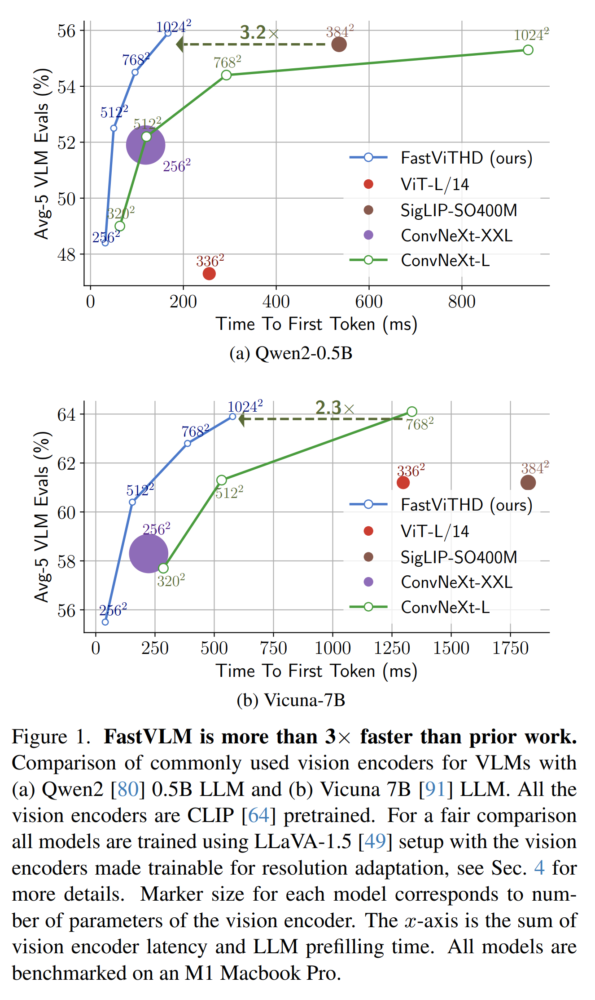

* FastVLM 은 서로 다른 input image resolution 과 LLM size 에 대해 ViT, convolutional encoder, 그리고 앞서 논의한 hybrid FastViT 기반 VLM 보다 현저히 개선된 accuracy-latency trade-off 를 보여준다 (Fig. 1a, Fig. 1b 및 Fig. 4). 
* 특히, FastVLM 은 여러 이전 연구보다 더 작고, 더 빠르며, 더 적은 data 로 training 되었음에도 더 우수한 성능을 보인다 (Tab. 6). 
* 가능한 최고 resolution 인 $1152 \rightarrow 1152$ 에서 동작하는 LLaVA-OneVision 과 비교할 때, FastVLM 은 동일한 0.5B LLM 으로 comparable 한 성능을 얻으면서도 TTFT 는 85→ 더 빠르고 vision encoder 는 3.4→ 더 작다.

저자의 기여를 요약하면 다음과 같다.

* 저자는 hybrid vision backbone 이 VLM 에서 ViT 를 능가함을 보이고, multi-scale vision feature 와 같은 추가적인 architectural intervention 을 도입하여 efficiency 를 유지하면서 VLM 성능을 더욱 향상시킨다.
* 저자는 FastVLM 을 위해 high resolution 입력에서 효율적인 VLM 성능에 최적화된 새로운 hybrid architecture 인 FastViTHD 를 설계하고 pretrain 한다. 오직 vision backbone 만 변경되는 통제된 experimental setup 에서, 저자는 FastViTHD 가 VLM 에 사용될 때 ViT-based 및 convolution-based counterpart 를 능가함을 보인다. 즉, SigLIP-SO400M 대비 3.2→ 더 빠른 TTFT 와 3.6→ 더 작은 size 를 달성하고, ConvNeXT 대비 2.3→ 더 빠른 TTFT 와 1.7→ 더 작은 size 를 달성한다. 저자는 또한 더 많은 visual instruction tuning data 가 다양해질수록 FastVLM 이 효과적으로 scaling 됨을 보여준다.
* 저자는 실제 hardware benchmark 에서 vision backbone latency 와 LLM prefilling time 을 모두 고려하여 VLM accuracy-latency trade-off 를 체계적으로 연구한다. 저자의 결과는 추정치가 아니라 on-device 측정을 통해 FastVLM 이 개선된 resolution-latency-accuracy trade-off 를 달성함을 보여준다.

# 2. Related Works

#### Large Multimodal Models

web-scale image-text dataset 에서 training 된 large language model 과 CLIP 과 같은 large pretrained vision model 의 등장과 함께, visual signal 의 해석을 가능하게 하기 위해 large language model (LLM) 과 정렬된 image encoding 을 수행하는 여러 multimodal architecture 가 제안되었다. 

* Frozen 및 Florence 와 같은 초기 연구는 image embedding 을 LLM 의 intermediate layer 에서 text embedding 과 융합하는 cross-attention mechanism 을 사용하였다. 
* 보다 최근에는 image embedding 을 text 와 함께 LLM 의 입력으로 제공하는 auto-regressive architecture 가 인기를 얻고 있다. 이러한 architecture 를 사용하는 대표적인 연구로는 LLaVA, mPLUG-Owl, InstructBLIP, BLIP-3, SPHINX, MiniGPT-4, VILA, MM1, Qwen-VL, InternVL, Cambrian-1 이 있다. 
* 최근에는 Fuyu 와 EVE 가 raw image 를 직접 LLM decoder 로 전달하는 단순화된 architecture 를 도입하였다. 
* Chameleon 은 pretrained codebook 을 사용해 image 를 tokenization 하는 early fusion mixed-modal model 을 도입하였다. Image encoder 를 생략하는 것은 흥미로운 접근법이지만, 이러한 새로운 계열의 model 의 성능은 pretrained image encoder 를 사용하는 architecture 에 비해 뒤처진다.

#### Efficient Image Encoding

CLIP 으로 pretrained 된 vision transformer 는 vision-language model 에서 image encoding 을 위해 널리 사용되며, 대표적인 선택지로는 SigLIP, EVA-CLIP, InternViT, DFN-CLIP 이 있다. 

성능을 향상시키기 위해, 최근 연구들은 서로 다른 objective 로 training 된 vision encoder ensemble 을 사용한다. 이러한 연구는 저자의 연구와 orthogonal 한데, vision encoder ensemble 가운데 효율적인 vision encoder 를 사용하는 것으로부터 이득을 얻을 수 있기 때문이다. 

* ViT-based architecture 는 VLM 에서 널리 사용되는 선택지이므로, visual token 수로부터 비효율성이 발생하며, 이에 따라 LLaVA-PruMerge 및 Matryoshka-based token sampling 과 같은 방법은 token 을 동적으로 pruning 한다. 
* 다른 접근법들은 perceiver-style resampler 나 pooling technique 을 사용하여 token 수를 줄인다. 
* ViT 와 같은 isotropic architecture 를 사용한 뒤 custom resampler 와 projector 를 설계하는 대신, hierarchical architecture 는 더 단순한 design choice 가 될 수 있다. 
* ConvNeXT 및 FastViT 와 같은 hierarchical backbone 은 compute 의 각 stage 마다 입력 tensor 를 downsample 하므로 더 적은 token 을 생성한다. 
* 최근에는 VLM 을 위해 image 를 encoding 하는 pure-convolutional vision encoder 를 사용하는 ConvLLaVA 가 도입되었다. 

저자의 연구에서는 VLM 을 위한 향상된 convolution-transformer hybrid architecture 를 도입하고, 이 architecture 가 더 높은 입력 resolution 으로 scaling 될 때의 pareto-optimal operating point 를 논의한다.

# 3. Architecture

이 section 에서 저자는 먼저 vision-language modeling 을 위해 FastViT hybrid vision encoder 를 채택하는 방식을 탐구한다. 이어서 VLM task 에서 성능을 향상시키기 위한 architectural intervention 을 도입한다. 

저자는 효율적인 high-resolution VLM 을 위해 설계된 새로운 hybrid vision encoder 인 FastViTHD 를 제시한다. 또한 서로 다른 LLM 및 입력 resolution 에 대해 FastViTHD 가 FastViT 및 이전 연구보다 더 최적임을 보여주기 위해 포괄적인 ablation 을 제공한다. Fig. 2 는 FastVLM 및 FastViTHD 의 전체 architecture 를 보여준다. 

이 section 의 모든 결과에 대한 training setup 은, 별도 언급이 없는 한, LLM decoder 로 Vicuna-7B 를 사용하는 LLaVA-1.5 와 동일한 configuration 을 따른다. 자세한 내용은 Sec. 4 를 참조한다.

## 3.1. FastViT as VLM Image Encoder

LLaVA 와 같은 VLM 은 세 가지 주요 구성 요소를 가진다. image encoder, vision-language projector, 그리고 large language model (LLM) 이 그것이다. 

VLM 의 성능과 runtime efficiency 는 모두 vision backbone 에 크게 의존한다. 다양한 VLM benchmark, 특히 text-rich task 에서 강한 성능을 달성하기 위해서는 high resolution 에서 image 를 encoding 하는 것이 필수적이다. 따라서 scalable resolution 을 가진 vision encoder 는 VLM 에 특히 유익하다. 

저자는 **hybrid vision encoder** (convolutional layer 뒤에 transformer block 이 오는 구조) 가 VLM 에 이상적인 후보라고 판단하는데, 그 convolutional component 가 native resolution scaling 을 가능하게 하고, transformer block 이 LLM 이 사용할 high-quality visual token 을 추가로 정제하기 때문이다.

저자는 CLIP-pretrained hybrid vision encoder, 구체적으로는 **MobileCLIP** 의 MCi2 image encoder 를 사용하며, 이 encoder 는 35.7M parameter 를 가지고 FastViT architecture 에 기반한다. 단순화를 위해, 저자는 논문의 나머지 부분에서 이 encoder 를 “**FastViT**” 라고 지칭한다.

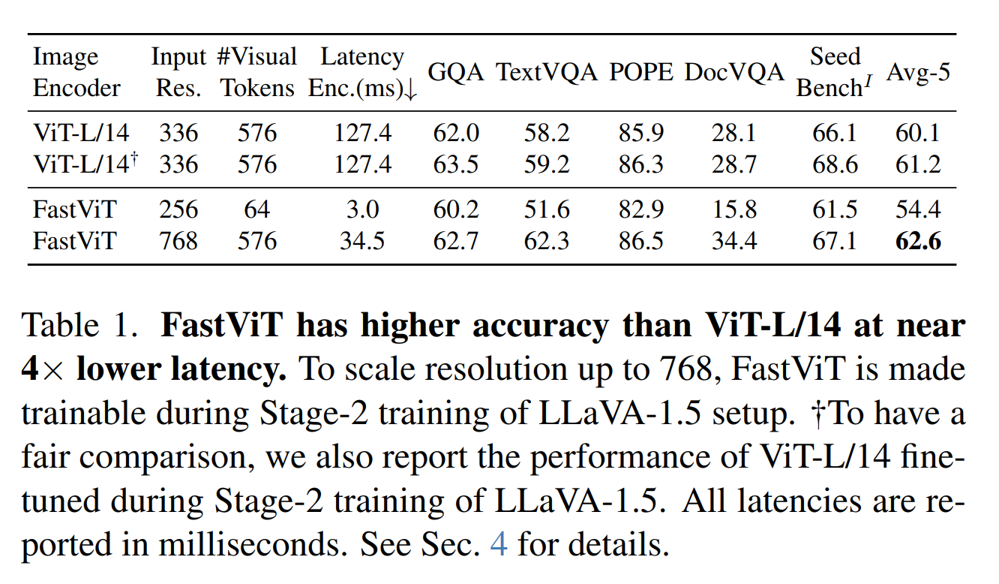

* Tab. 1 에서 보이듯이, CLIP-pretrained resolution 인 $256 \rightarrow 256$ 에서 FastViT 를 사용하는 것만으로는 강한 VLM 이 되지 않는다. 
* FastViT 와 같은 hybrid encoder 의 주요 장점은 image resolution scaling 특성이 유리하다는 점이며, 이는 patch size 가 14 인 ViT architecture 보다 5.2→ 더 적은 token 을 생성함을 의미한다. 
  * 이러한 token 감소는 transformer decoder 의 prefilling time 및 time-to-first-token 을 줄이므로 VLM 에 상당한 이점을 제공한다. 
* FastViT 의 입력 resolution 을 $768 \rightarrow 768$ 로 scaling 하면, 입력 resolution 이 $336 \rightarrow 336$ 인 ViT-L/14 와 동일한 수의 visual token 을 생성하지만, VLM benchmark 에서 더 나은 성능을 달성한다. 
  * 이 성능 차이는 두 architecture 가 동일한 수의 visual token 을 생성함에도 불구하고, TextVQA 및 DocVQA 와 같은 text-rich benchmark 에서 더욱 두드러진다. 
  * 더욱이, 더 높은 resolution 에서 token count 가 동일하더라도, 효율적인 convolution layer 덕분에 image encoding 속도가 훨씬 빠르다.

### 3.1.1. Multi-Scale Features

전형적인 convolutional architecture 및 hybrid architecture 는 computation 을 4 개의 distinct stage 로 나누고, 그 사이에 downsampling operation 을 둔다. 

VLM 은 penultimate layer 의 feature 에 의존하지만, network 의 더 이른 stage 의 feature 는 서로 다른 granularity 에서 정보를 추출한다. 여러 scale 의 정보를 집계하는 것은 penultimate layer 의 high-level feature 를 보완할 수 있다. 

Multiple scale feature extraction 을 위한 architecture 는 Fig. 2 에 제시되어 있다. 저자는 서로 다른 stage 로부터 feature 를 pooling 하기 위한 2 가지 design, 즉 *AvgPooling* 과 *2D Depthwise convolution* 을 비교하는 ablation 을 수행한다.

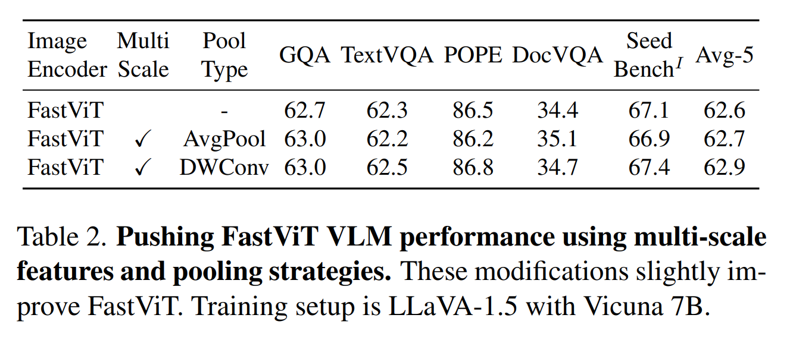

Tab. 2 로부터, depthwise convolution 을 사용하는 것이 더 나은 성능을 가져온다는 것을 확인한다.

## 3.2. FastViTHD: High Resolution Encoder for VLM

* 도입된 model intervention 을 적용한 FastViT 는 ViT-L/14 보다 8.7→ 더 작은 image encoder 로서 좋은 성능을 보이지만, 이전 연구들은 image encoder 의 scale 을 키우는 것이 generalization capability 를 향상시킨다는 점을 보여주었다. 
* Hybrid architecture 는 일반적으로 4-stage design 에서 self-attention layer 수와 width 를 scaling 하지만, 이는 단점을 가진다. 

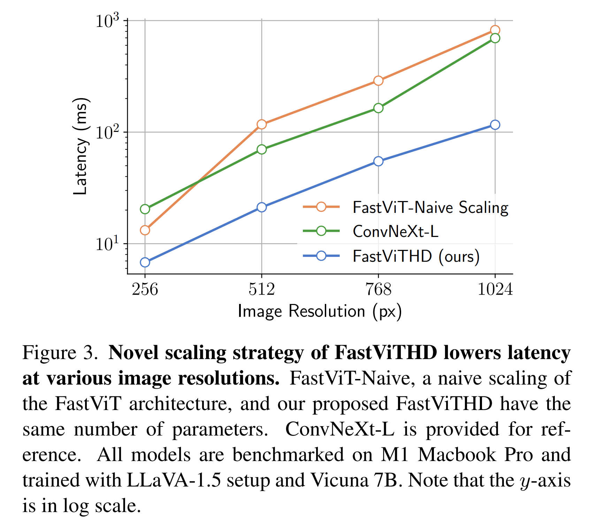

* Fig. 3 에서 보이듯이, 이전 연구들처럼 FastViT 의 stage 3 및 4 에서 self-attention layer 수를 단순히 늘리는 것은 suboptimal 하며 ConvNeXT-L 보다 느리다. 
* 이를 완화하기 위해, 저자는 downsampling layer 를 포함하는 추가 stage 를 도입하여, self-attention 이 ViTamin 과 같은 최근 model 에서처럼 16 배 downsampled 된 tensor 가 아니라 32 배 downsampled 된 tensor 위에서 동작하도록 한다. 
* Naive scaling approach 에 대한 더 자세한 내용은 Sec. B 에서 확인할 수 있다. 
* 저자의 design 은 image encoding latency 를 줄이고, compute-intensive 한 LLM decoder 를 위해 4→ 더 적은 token 을 생성하여, time-to-first-token (TTFT) 을 감소시킨다. 
* Architecture schematic 은 Fig. 2 에 제시되어 있으며, 저자는 이 model 을 **FastViTHD** 라고 부른다.

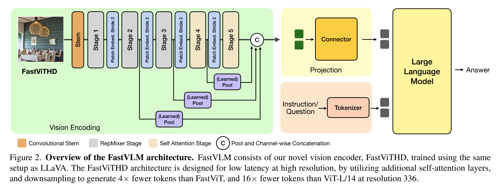

* Model architecture 는 Fig. 2 에 나타난 것처럼 5 개의 stage 로 구성되며, 처음 세 stage 는 RepMixer block 을 사용하고 마지막 두 stage 는 multi-headed self-attention block 을 사용한다. 
* 각 stage 에서의 model depth 는 [2, 12, 24, 4, 2] 이고, 각 stage 의 embedding dimension 은 [96, 192, 384, 768, 1536] 이다. 
* ConvFFN layer 의 MLP expansion ratio 는 4.0 으로 설정된다. 
* 이 model 은 125.1M parameter 를 가지며, 이는 MobileCLIP 의 가장 큰 FastViT variant 보다 3.5→ 크지만, 여전히 널리 사용되는 ViT 대안들보다 작다.

저자는 FastViTHD 를 FastVLM training 에 사용하기 전에, DataCompDR-1B dataset 을 사용하여 CLIP pretraining setup 을 따른다. 

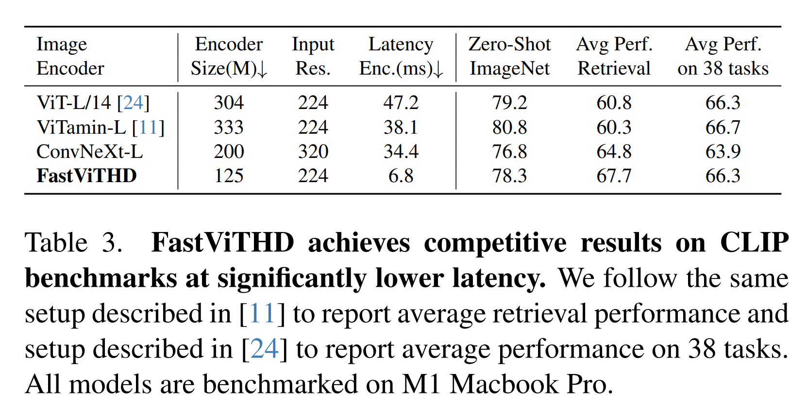

* Tab. 3 은 FastViTHD 가 ViT-L/14 보다 2.4→ 더 작고 6.9→ 더 빠름에도 불구하고, 38 개의 multi-modal zero-shot task 전반에서 comparable 한 평균 성능을 달성함을 보여준다. 
* VLM 을 위해 구축된 hybrid transformer architecture 인 ViTamin 과 비교할 때, FastViTHD 는 2.7→ 더 작고 5.6→ 더 빠르면서도 더 우수한 평균 retrieval 성능을 제공한다. 

Tab. 4 에서 저자는 LLaVA-1.5 training 이후 VLM task 에 대해 FastViTHD 를 다른 CLIP-pretrained hierarchical backbone, 즉 ConvNeXT-L 및 ConvNeXT-XXL 과 비교한다.

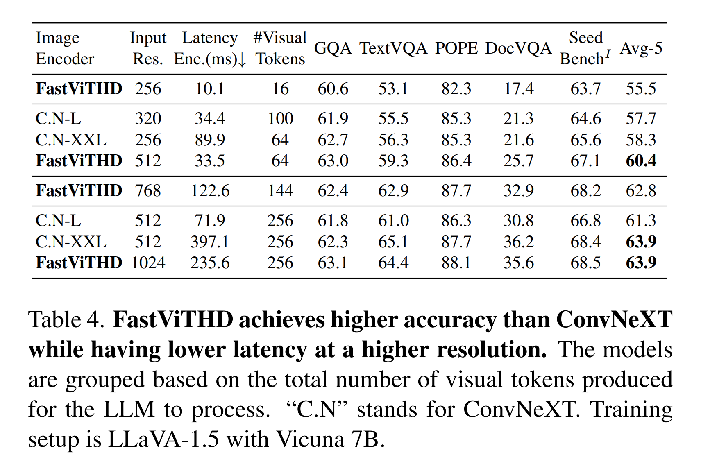

* FastViTHD 는 ConvNeXT-XXL 과 동등한 성능을 보이면서도 6.8→ 더 작고 3.3→ 더 빠르다.

### 3.2.1. Vision Encoder - Language Decoder Interplay

VLM 에서 accuracy-latency trade-off 는 여러 요인의 영향을 받는다. 한편으로, VLM 의 전체 성능은 다음에 의존한다.

* input image resolution
* visual token 의 quantity 와 quality
* LLM 의 capability

다른 한편으로, VLM 의 전체 latency (첫 token 생성까지의 시간) 는 다음에 의해 결정된다.

* vision encoder 의 latency
* LLM 의 prefilling time

후자는 vision encoder 가 생성하는 token 수와 LLM 의 size 모두의 영향을 받는다.

VLM 의 optimization landscape 가 복잡하기 때문에, vision encoder 의 optimality 에 대한 주장은 다양한 $(\mathrm{Resolution}, \mathrm{LLM})$ 쌍에 걸쳐 검증되어야 한다. 여기서 저자는 FastViTHD 가 FastViT 보다 optimal 함을 실험적으로 보여준다. 각 vision encoder 에 대해, 저자는 세 가지 LLM, 즉 Qwen2-0.5B/1.5B/7B 와 함께 다양한 input image resolution 을 고려한다. 각 $(\mathrm{Resolution}, \mathrm{LLM})$ 쌍에 대해, 저자는 LLaVA-1.5 pretraining 과 visual instruction tuning 을 수행하고, 생성된 model 을 다양한 task 에 걸쳐 평가한다. 결과는 Fig. 4 에 제시되어 있다.

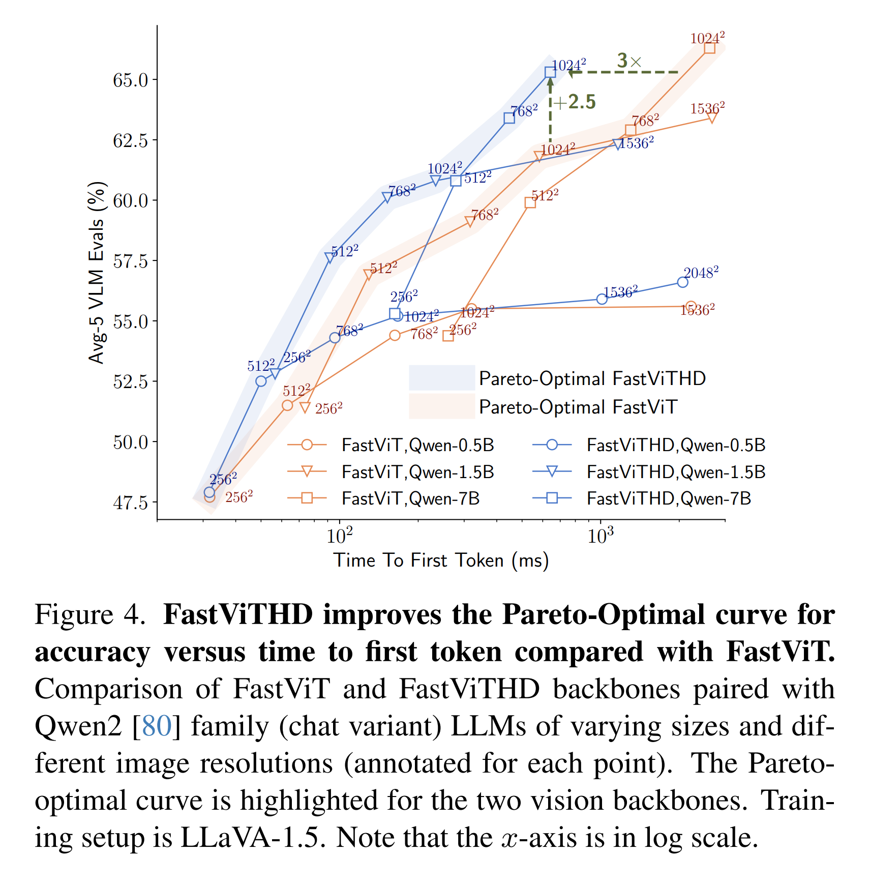

* 첫째, 저자는 vision encoder 에 대해 Pareto-optimal curve (Fig. 4 에서 강조 표시됨) 가 주어진 runtime budget (TTFT) 에 대해 달성 가능한 최대 성능을 나타내며, 서로 다른 size 의 LLM 들로 구성된다는 점을 관찰한다. 
* 구체적으로, high resolution 을 작은 LLM 과 짝짓는 것은 suboptimal 한데, 작은 LLM 은 그렇게 많은 token 을 효과적으로 활용할 수 없고, TTFT 는 vision encoder 의 latency 가 지배하게 되기 때문이다 (Fig. 5 참조).

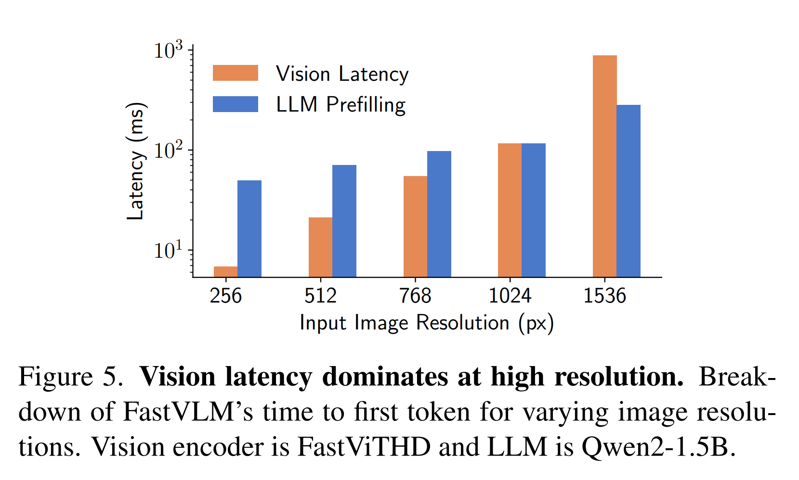

* 둘째, Fig. 4 에서 FastViTHD 의 Pareto-optimal curve 는 FastViT 의 그것보다 현저히 더 우수하다. 주어진 runtime budget 에 대해, 가능한 모든 $(\mathrm{Resolution}, \mathrm{LLM})$ 쌍을 고려하면, 저자는 FastViTHD 로 훨씬 더 나은 성능(Average-5 metric 에서 2.5 point 이상의 향상)을 달성한다. 
* 마찬가지로, FastViTHD 는 목표 VLM 성능에 최대 3→ 더 빠르게 도달할 수 있다. 중요한 점은, 이전 section 들에서 저자가 FastViT 기반 VLM 이 이미 ViT 기반 VLM 에 비해 상당한 향상을 나타냄을 보여주었음에도, FastViTHD 가 FastViT 대비 추가로 상당한 이득을 제공한다는 것이다.

### 3.2.2. Static vs. Dynamic Input Resolution

입력 resolution 을 scaling 하는 방법은 두 가지가 있다. Model 의 입력 resolution 을 직접 조정하는 방법과, image 를 tile 로 나누고 encoder 의 resolution 을 tile size 로 설정하는 방법이다. Tiled inference (AnyRes) 는 이전 연구에서 ViT model 이 high resolution image 를 처리할 수 있도록 도입되었다. FastViTHD 는 높은 입력 resolution 에서 효율적으로 inference 를 수행하도록 설계되었기 때문에, 저자는 두 가지 strategy 를 사용해 다양한 resolution 에 대한 optimal operating point 를 분석한다. 

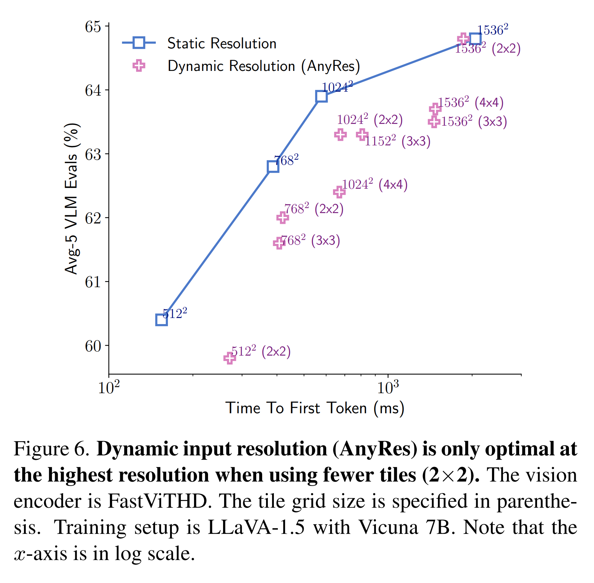

* Fig. 6 에서, model 의 입력 resolution 을 원하는 resolution 으로 직접 설정하는 것이 가장 좋은 accuracy-latency trade-off 를 제공하며, dynamic resolution 은 memory bandwidth limitation 때문에 $1536 \rightarrow 1536$ 과 같은 극단적인 resolution 에서만 이점을 보인다는 것을 확인할 수 있다. 
* Dynamic resolution 이 필요하다면, 더 적은 수의 tile 을 사용하는 설정이 더 나은 accuracy-latency trade-off 를 보인다. 이 setup 에 대한 추가 논의는 Sec. C.1 에 제시된다.

### 3.2.3. Comparison with Token Pruning & Downsampling

저자는 또한 서로 다른 resolution 에서 동작하는 FastViTHD 의 성능을 문헌에 있는 대표적인 token pruning 방법들과 추가로 비교한다. 

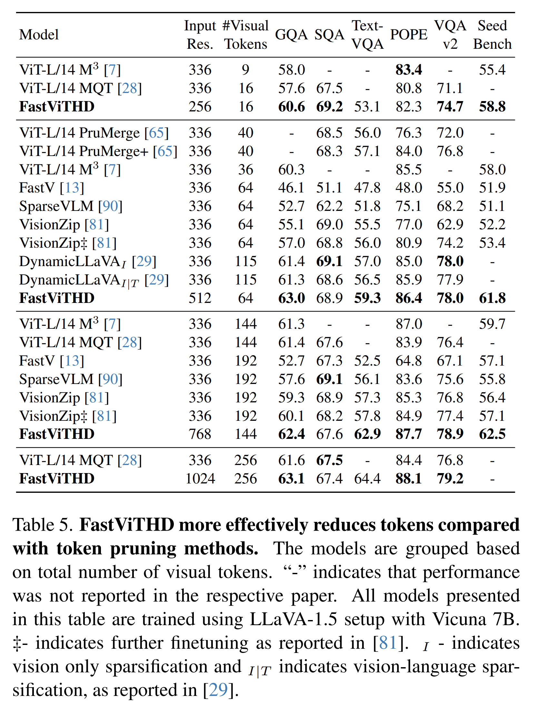

* Tab. 5 로부터, VLM 은 ViT 와 같은 isotropic architecture 에서 token pruning 방법을 사용하는 것보다 hierarchical backbone 을 사용할 때 더 나은 accuracy-latency trade-off 를 달성한다는 것을 확인한다. 
* 단순히 더 낮은 입력 resolution 에서 VLM 을 training 하는 것만으로도, FastViTHD 는 visual token count 를 16 까지 낮출 수 있으며, 최근의 token pruning 방법들을 능가한다. 
* 흥미롭게도, 제안된 가장 효과적인 token pruning 방법들조차도, $256 \rightarrow 256$ 의 더 낮은 입력 resolution 에서 training 된 FastViTHD 보다 성능이 떨어진다.

# 4. Experiments

#### Training Setup

Sec. 3 에 제시된 모든 ablation 에 대해, 별도 언급이 없는 한 저자는 Vicuna-7B 를 LLM decoder 로 사용하는 LLaVA-1.5 의 2-stage setup 을 따른다. 

* 첫 번째 stage 동안에는 projector 만을 training 하며, LLaVA-558K alignment dataset 을 사용해 1 epoch 동안, batch size 256 과 learning rate $10^{-3}$ 로 학습한다. 
  * 이 stage 에서는 input image resolution 이 backbone pretraining resolution 과 일치한다 (예: FastViT 에 대해서는 256, FastViTHD 에 대해서는 224). 
* 두 번째 stage 에서는 LLaVA-665K supervised finetuning dataset 을 사용하고, model 을 1 epoch 동안 training 하며, vision encoder, projector, LLM 을 포함한 모든 module 을 tuning 한다. 이 stage 에서는 input image resolution 을 목표 resolution 으로 설정한다.

Sec. 4 에서 저자는 서로 다른 LLM decoder 를 사용한 결과를 제시하며, 주로 Qwen2-0.5B/1.5B/7B model family (chat variant) 와 Vicuna-7B model 을 사용한다. 저자는 두 가지 training setup 에서의 결과를 보고한다.

* 첫 번째 setup 은 LLaVA-1.5 에서 도입된 2-Stage setup 이다.
* 두 번째 training setup 에서는, 문헌의 최근 경향을 따라 VLM 을 3 단계로 training 한다. 즉, connector training 을 위한 Stage 1, resolution scaling 을 위한 Stage 1.5, visual instruction tuning 을 위한 Stage 2 이다.

이 stage 들에서 사용된 dataset 정보는 Sec. D 에서 확인할 수 있다. 이 setup 에서는 Stage 1 에 대해 input image resolution 을 backbone pretraining resolution 로 설정하고, 이후 두 stage 에 대해서는 목표 resolution 으로 조정한다. 두 setup 모두에서, vision encoder 와 LLM 은 stage 1 에서만 frozen 되며, 나머지 stage 에서는 모든 module 이 finetuned 된다.

* 논문에서 보고된 모든 FastVLM model 은 8 개의 NVIDIA H100-80GB GPU 를 갖춘 단일 node 에서 training 된다. 
* VLM 의 Stage 1 training 은 빠르며, Qwen2-7B decoder 로 학습할 때 대략 30 분이 소요된다. 
* Stage 1.5 와 Stage 2 training 시간은 입력 resolution 에 따라 달라진다. 
* 입력 resolution 이 $1024 \rightarrow 1024$ 일 때, Stage 1.5 는 77 시간, Stage 2 는 8 시간이 걸린다. 보고된 wall clock time 은 각 stage 에서 사용된 다음 dataset 에 해당한다. 
* Stage 1.5 에서는 15 million sample, Stage 2 에서는 1.1 million sample 이 사용된다.

#### Evaluation

저자는 GQA, ScienceQA, TextVQA, POPE, LLaVA-in-the-wild, VQAv2, MMVet, MMMU, DocVQA, SeedBench 의 mainstream benchmark 에서 model 을 평가한다. GQA, ScienceQA, TextVQA, POPE, LLaVA-in-the-wild benchmark 에 대해서는 LLaVA 의 공식 evaluation 을 사용한다. 나머지 evaluation 에 대해서는 lmms-eval library v0.2.2 를 사용한다. 모든 evaluation 에 대해 default setting 을 사용하며, lmms-eval 은 judge 로 GPT 에 의존하는 evaluation 에 대해 기본적으로 0613 version 의 GPT 를 사용한다.

Sec. 3 에 제시된 ablation 에 대해서는 GQA, TextVQA, POPE, DocVQA, SeedBench 를 보고한다.

* GQA 와 SeedBench 는 general knowledge benchmark 이다.
* DocVQA 와 TextVQA 는 text-rich evaluation 을 나타낸다.
* POPE 는 hallucination benchmark 이다.

이 benchmark 들은 함께 diversity 를 제공하며, ablation 을 위해 빠르게 평가할 수 있다. 가장 중요한 점은, 이 benchmark 들이 서로 다른 initialization 과 probabilistic decoding setting 에 대해 더 낮은 variance 를 보인다는 점이다. 저자는 서로 다른 initialization 에 대한 모든 eval 의 variance 를 Sec. D.3 에서 보고한다. 선택된 5 개 metric 전반의 standard deviation 은 0.5 보다 작다. 저자는 이 5 개 benchmark 의 평균을 Avg-5 라고 부르며, 이를 분석을 위한 신뢰할 수 있는 signal 로 사용한다. Avg-5 에 대한 empirical standard deviation estimate 는 0.1 이다.

#### Benchmarking

저자는 모든 model 을 M1 Max chip 과 32GB RAM 을 갖춘 MacBook Pro 에서 benchmark 한다. 

* Image encoder 는 coremltools v7.2 를 사용해 Core ML package file 로 변환되며, XCode 15.4 (15F31d) 를 사용하여 neural engine 에서 benchmark 된다. 
* LLM 은 MLX 를 사용하여 MacBook Pro GPU 에서 benchmark 된다. Model 은 먼저 mlx_lm.convert tool 을 사용해 변환되며, 이 도구는 huggingface 상의 model 을 MLX format 으로 변환하고 tensor 를 FP16 으로 cast 한다. 
* Prefilling latency 는 mlx_lm.cache_prompt tool 을 사용해 추정된다. Time-To-First-Token (TTFT) 은 특정 resolution 에서의 image encoding latency 에, 해당 visual token 에 대한 LLM prefilling latency 를 더하여 추정된다.

## 4.1. Comparison with state-of-the-art

Tab. 6 에서 저자는 FastVLM 을 최근 발표된 방법들과 비교한다. 

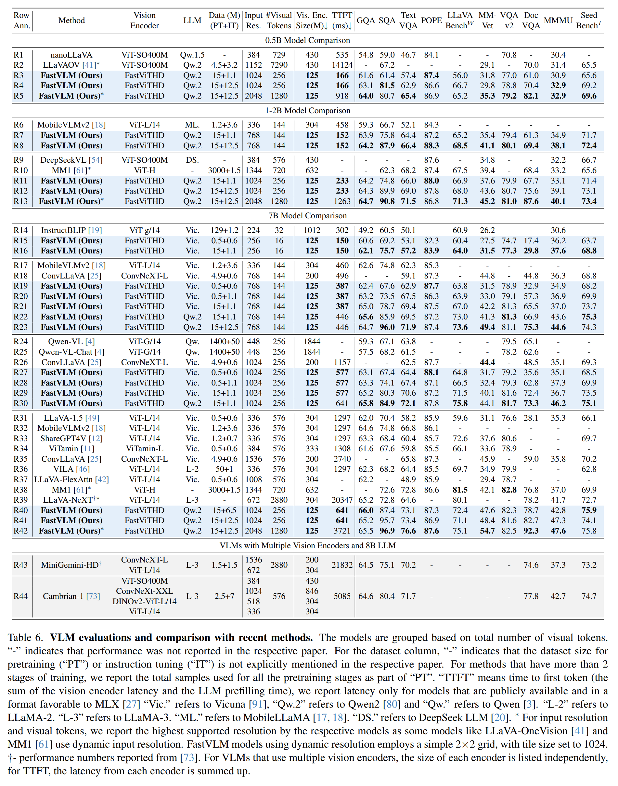

* Training setup 은 연구마다 크게 다를 수 있다. 각 연구에 대해, 공정한 비교를 돕기 위해 저자는 해당 VLM 을 training 하는 데 사용된 LLM decoder 와 instruction tuning dataset 및 pretraining dataset 의 크기를 함께 보고한다.

#### Hierarchical Backbones

* FastVLM (R20) 을 ConvLLaVA (R18) 와 비교할 때, 동일한 LLM 과 유사한 training data size 를 사용하면, 저자의 model 은 TextVQA 에서 +8.4% 더 나은 성능과 DocVQA 에서 +12.5% 더 나은 성능을 달성하면서 22% 더 빠르다. 
* 이 차이는 더 높은 resolution 에서 더욱 커지는데, FastVLM (R28, R29) 은 동일한 LLM decoder 를 사용하면서도 다양한 benchmark 에서 ConvLLaVA (R26) 보다 더 우수한 성능을 보이며 2→ 더 빠르다.

#### Dataset Scaling

* 15M sample 을 사용한 resolution scaling 용 intermediate pretraining stage 를 포함하여 pretraining dataset 을 scaling 할 때, FastVLM (R21) 은 다양한 benchmark 전반에서 MM1 (R38) 과 동등하거나 이를 능가한다. 
  * 주목할 만하게도, FastVLM 은 5→ 더 적은 visual token 을 생성하면서 이러한 성능을 달성한다. 
* 입력 resolution 이 $1024 \rightarrow 1024$ 이고 크기 12.5M 의 더 큰 instruction tuning dataset 을 사용할 때, FastVLM (R41) 은 TextVQA 와 DocVQA 와 같이 입력 resolution 과 visual token 수에 민감한 text-rich evaluation 을 포함한 다양한 benchmark 에서 MM1 (R38) 과 LLaVA-NeXT (R39) 를 능가한다. 
* AnyRes 를 사용하여 입력 resolution 을 더 확장하면 그 차이는 더욱 커지며, 자세한 내용은 Sec. C.1 에 제시된다. 저자는 dataset split 의 세부 사항을 Sec. D 에서 제공한다.

#### Multiple Vision Encoders

최근 MiniGemini 와 Cambrian-1 은 multiple vision encoder 에 의존하는 model 을 도입하였다. Tab. 6 에서 저자는 단일 vision encoder 를 사용하는 FastVLM (R40) 을, multiple encoder 를 사용하고 유사한 규모의 visual instruction tuning dataset 으로 training 된 방법들과 비교한다. 

* Cambrian-1 (R44) 에서는 vision encoding 이 약 5 초의 총 time-to-first-token 중에서 LLM prefilling 보다 3.2→ 더 크게 기여하며, 자세한 분해는 Tab. 9 에 제시되어 있다. 
* FastVLM (R40) 은 유사한 visual instruction tuning dataset 으로 training 되었을 때 Cambrian-1 (R44) 을 능가하면서 7.9→ 더 빠르다. 
* Instruction tuning dataset 을 12.5M 으로 scaling 하면, FastVLM (R41) 은 2.3→ 더 적은 visual token 으로 Cambrian-1 (R44) 보다 우수한 성능을 달성하며, visual token 수에 민감한 text-rich evaluation 에서조차 그러하다 (Tab. 10 참조).

#### Effect of Decoder

VLM 성능은 prior study 에서 보여주듯이 LLM 의 품질에도 의존한다. 

* Vicuna-7B (R21, R29) 에서 Qwen2 model (R22, R30) 로 전환하면, 모든 benchmark 에서 성능 향상이 나타난다. 
  * 이러한 향상은 MMVet, LLaVA-in-the-wild, MMMU benchmark 에서 특히 크다. 
* Qwen2-0.5B 를 LLM decoder 로 사용할 때, FastVLM (R4) 은 LLaVA-OneVision (R2) 을 능가하면서 85→ 더 빠르다. 
* 이 결과는 두 model 이 동일한 LLM decoder 를 사용하고, FastViTHD 가 SigLIP-SO400M 보다 3.4→ 더 작다는 점에서, 저자의 vision encoder 의 품질을 강조한다.

# 5. Conclusion

이 연구에서 저자는 high-resolution 입력을 효율적으로 encoding 하기 위해 FastViTHD vision backbone 을 활용하는 FastVLM 을 도입하였다. FastViTHD 는 hybrid architecture 를 가지며, reinforced image-text data 로 pretraining 되었고, 정확도 희생을 최소화하면서 상당히 줄어든 수의 visual token 을 출력한다. FastVLM 은 다양한 VLM benchmark 전반에서 이전 연구와 경쟁력 있는 성능을 보이면서, time-to-first-token 과 vision backbone 의 parameter 수 양쪽 모두에서 efficiency 를 향상시킨다. M1 MacBook Pro 에서의 엄격한 benchmarking 은 FastVLM 이 기존 연구와 비교해 state-of-the-art resolution-latency-accuracy trade-off 를 달성함을 보여준다.
